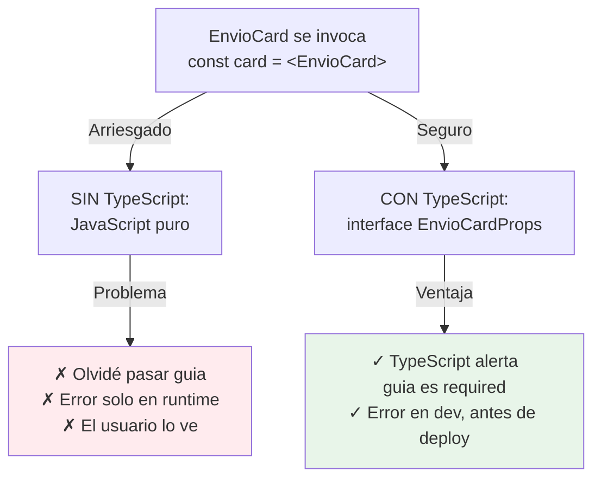
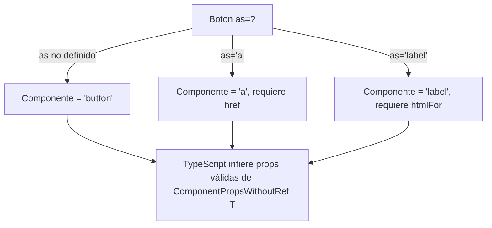

# Módulo 11: TypeScript con React


## Aprende construyendo

### Tema 1: Tipado de props y children

#### Paso 1 · Objetivo y preparación
Al finalizar vas a tipar las props de `EnvioCard` con una `interface`, incluyendo `children: React.ReactNode` para aceptar contenido adicional opcional dentro de la tarjeta. Prerrequisitos: Módulo 0 completo.

#### Paso 2 · Contexto y caso real
`EnvioCard` se usa en varias pantallas de RutaFlow con datos ligeramente distintos — sin tipar sus props, nada evita que alguien la invoque sin pasar la guía del envío, un error que solo se descubriría en producción al intentar mostrar un valor `undefined`.

#### Paso 3 · Teoría, modelo mental y analogía
Tipar las props con una `interface` declara explícitamente qué forma deben tener los datos esperados, detectando en tiempo de compilación props faltantes o de tipo incorrecto.

**Diagrama: Sin TypeScript vs Con TypeScript**



#### Paso 4 · Demostración guiada desde cero
```tsx
interface EnvioCardProps {
  guia: string;
  direccion: string;
  children?: React.ReactNode;
}

function EnvioCard({ guia, direccion, children }: EnvioCardProps) {
  return <div><h3>{guia}</h3><p>{direccion}</p>{children}</div>;
}
```
Resultado esperado: `<EnvioCard direccion="Calle 10" />` (sin `guia`) falla en tiempo de compilación con un error explícito señalando que falta la prop obligatoria `guia` — nunca llega a ejecutarse con un valor `undefined` en producción.

#### Paso 5 · Práctica guiada
Pista: cambiá `guia: string` a `guia: any` "para que compile rápido mientras terminás otra cosa" — ese es el fallo deliberado: ahora `<EnvioCard guia={123} direccion="Calle 10" />` (pasando un número) compila sin ningún error, aunque el resto del código de `EnvioCard` asuma que `guia` siempre es un string.

#### Paso 6 · Práctica independiente
Corregí el Paso 5 devolviendo `guia: string`, y agregá una segunda prop opcional `destacado?: boolean`, confirmando que usar `EnvioCard` sin esa prop sigue compilando (por ser opcional) pero pasar un valor del tipo incorrecto sigue siendo rechazado.

#### Paso 7 · Cierre y evidencia
Entregá `EnvioCard` tipada del Paso 4, el `any` que oculta el error del Paso 5, y la prop opcional del Paso 6; explicá por qué `any` no es "un tipo más flexible" sino la desactivación completa de la verificación de tipos para ese valor. Siguiente paso: estudia hooks genéricos. Errores comunes: usar `any` para evitar pensar el tipo correcto, tipar `children` como `React.ReactElement` cuando el componente acepta contenido arbitrario, y marcar como opcional una prop que en realidad siempre debería proporcionarse. Fuentes oficiales: https://react.dev/learn/typescript y https://www.typescriptlang.org/docs/handbook/2/objects.html.
**¿Por qué es importante?** Tipar las props detecta en tiempo de compilación errores de uso del componente que de otro modo solo se manifestarían en tiempo de ejecución, potencialmente en producción.
**Evidencia de aprendizaje:** entrega EnvioCard tipada, error oculto por any detectado y prop opcional agregada.
**Conceptos clave:** `interface`, `React.ReactNode`, props opcionales.

```typescript
interface TarjetaProps {
  titulo: string;
  children: React.ReactNode;
  onSeleccionar?: () => void;
}
```

Tipar las props de un componente con una interface declara explícitamente qué forma deben tener los datos que el componente espera recibir, permitiendo que TypeScript detecte en tiempo de compilación errores como olvidar una prop obligatoria, pasar un tipo incorrecto, o invocar una función opcional sin verificar primero que efectivamente fue proporcionada, exactamente el mismo beneficio general de tipado estático estudiado a lo largo del track de TypeScript, aplicado aquí específicamente a la superficie de props de un componente React.

`React.ReactNode` es el tipo apropiado para `children` (y para cualquier prop que reciba contenido renderizable arbitrario), dado que abarca correctamente todo lo que React puede renderizar válidamente: elementos JSX, strings, números, arreglos de esos elementos, o incluso `null`/`undefined` (que React simplemente no renderiza), un tipo deliberadamente más amplio que `React.ReactElement` (que representa específicamente un elemento JSX único, sin abarcar strings o arreglos sueltos), siendo importante elegir el tipo correcto según qué tan restrictivo debe ser realmente el contenido aceptado por ese componente específico.

**Analogía:** tipar las props de un componente es como especificar exactamente qué ingredientes y en qué formato acepta una receta antes de intentar prepararla, detectando de antemano si falta un ingrediente obligatorio o si el formato de alguno no es el esperado, en vez de descubrirlo a mitad de la preparación real.

**¿Por qué es importante?** Tipar las props detecta en tiempo de compilación errores de uso del componente (props faltantes, tipos incorrectos) que de otro modo solo se manifestarían como errores en tiempo de ejecución, potencialmente en producción.

**Código del ejemplo:**

```tsx
interface TarjetaProps {
  titulo: string;
  children: React.ReactNode;
  onSeleccionar?: () => void; // opcional
}

function Tarjeta({ titulo, children, onSeleccionar }: TarjetaProps) {
  return <div onClick={onSeleccionar}><h2>{titulo}</h2>{children}</div>;
}
```

* Ejecutar: `npm test`
* Código: `examples/rutaflow/react/use-shipment-tracking.tsx`
* Proyecto: proyecto integrador RutaFlow

### Tema 2: Hooks genéricos

#### Paso 1 · Objetivo y preparación
Al finalizar vas a escribir `useLocalStorage<T>` genérico y usarlo tanto para persistir el filtro de zona (`string`) como las columnas visibles de una tabla (un array), sin duplicar la implementación. Prerrequisitos: Tema 1 de este módulo.

#### Paso 2 · Contexto y caso real
RutaFlow necesita persistir en `localStorage` tanto el string del filtro de zona como un array de columnas visibles en una tabla — escribir un hook separado y específico para cada tipo de dato duplicaría exactamente la misma lógica dos veces.

#### Paso 3 · Teoría, modelo mental y analogía
Un hook genérico usa un parámetro de tipo `T` para permanecer reutilizable para cualquier tipo de dato concreto, sin fijar de antemano un tipo específico — un molde ajustable, no uno nuevo por cada forma.

#### Paso 4 · Demostración guiada desde cero
```tsx
function useLocalStorage<T>(clave: string, valorInicial: T) {
  const [valor, setValor] = useState<T>(() => {
    const guardado = localStorage.getItem(clave);
    return guardado ? JSON.parse(guardado) : valorInicial;
  });
  useEffect(() => localStorage.setItem(clave, JSON.stringify(valor)), [clave, valor]);
  return [valor, setValor] as const;
}

const [zona, setZona] = useLocalStorage<string>('zona', 'todas');
const [columnas, setColumnas] = useLocalStorage<string[]>('columnas', ['guia', 'estado']);
```
Resultado esperado: el mismo `useLocalStorage` tipa correctamente `zona` como `string` y `columnas` como `string[]` en cada punto de uso, sin que la implementación del hook necesite conocer de antemano cuáles serían esos tipos concretos.

#### Paso 5 · Práctica guiada
Pista: invocá el hook con un valor inicial ambiguo (`useLocalStorage('zona', null)`) en vez de especificar el tipo explícitamente — ese es el fallo deliberado: TypeScript infiere `T` como `null`, y `setZona('norte')` ahora es rechazado (porque `T` quedó fijado en `null`, no en `string`), perdiendo la utilidad real del tipo por depender de una inferencia ambigua.

#### Paso 6 · Práctica independiente
Corregí el Paso 5 especificando explícitamente el parámetro de tipo (`useLocalStorage<string>('zona', 'todas')`) en vez de depender de la inferencia en un caso ambiguo, y confirmá que `setZona(42)` ahora sí es rechazado en tiempo de compilación.

#### Paso 7 · Cierre y evidencia
Entregá el hook genérico reutilizado para dos tipos distintos del Paso 4, el caso de inferencia ambigua del Paso 5, y la especificación explícita del Paso 6; explicá cuándo conviene especificar el parámetro de tipo explícitamente en vez de depender de que TypeScript lo infiera solo. Siguiente paso: estudia eventos tipados y componentes polimórficos. Errores comunes: depender de la inferencia de tipos en casos ambiguos donde el valor inicial no determina claramente el tipo deseado, duplicar un hook para cada tipo de dato en vez de generalizarlo, y omitir el parámetro de tipo cuando TypeScript realmente no puede inferirlo del contexto. Fuentes oficiales: https://www.typescriptlang.org/docs/handbook/2/generics.html y https://react.dev/learn/reusing-logic-with-custom-hooks.
**¿Por qué es importante?** Un hook genérico se escribe una única vez y se reutiliza correctamente tipado para cualquier tipo de dato concreto, evitando duplicar la implementación.
**Evidencia de aprendizaje:** entrega hook reutilizado para dos tipos, inferencia ambigua detectada y tipo explícito agregado.
**Conceptos clave:** parámetro de tipo `<T>`, reutilización para cualquier tipo de dato.

Un hook personalizado genérico (`function useLocalStorage<T>(clave: string, valorInicial: T) {...}`) usa un parámetro de tipo (`T`) para permanecer reutilizable para cualquier tipo de dato concreto que se le pase, en vez de fijar de antemano un tipo específico (por ejemplo, `string` únicamente) que limitaría su reutilización a ese único caso: al invocarlo como `useLocalStorage<'claro' | 'oscuro'>('tema', 'claro')`, TypeScript infiere (o recibe explícitamente) que `T` es el tipo unión `'claro' | 'oscuro'` para esa invocación específica, tipando correctamente tanto el valor devuelto como el setter correspondiente según ese tipo concreto, sin que el hook en sí tenga que conocer de antemano cuál será ese tipo específico en cada uso particular.

Este mismo principio de generics aplicado a hooks es exactamente el mismo concepto de generics estudiado de forma más general para funciones y clases en el track de TypeScript, aplicado aquí específicamente al caso de hooks personalizados de React: el hook define su comportamiento una única vez de forma abstracta sobre un tipo `T` no especificado todavía, y cada punto de uso concreto especifica (o permite que TypeScript infiera) cuál es ese tipo específico para esa invocación particular, obteniendo tipado preciso sin necesidad de duplicar la implementación del hook para cada tipo de dato distinto que pudiera necesitarse.

**Analogía:** un hook genérico es como un molde ajustable que puede producir piezas de distintas formas específicas según el parámetro que se le indique, en vez de tener que fabricar un molde completamente nuevo y separado para cada forma específica de pieza que se necesite producir.

**¿Por qué es importante?** Un hook genérico se escribe una única vez y se reutiliza correctamente tipado para cualquier tipo de dato concreto, evitando duplicar la implementación para cada tipo específico que pudiera necesitarse.

**Código del ejemplo:**

```tsx
function useLocalStorage<T>(clave: string, valorInicial: T) {
  const [valor, setValor] = useState<T>(() => {
    const guardado = localStorage.getItem(clave);
    return guardado ? JSON.parse(guardado) : valorInicial;
  });
  useEffect(() => localStorage.setItem(clave, JSON.stringify(valor)), [clave, valor]);
  return [valor, setValor] as const;
}

const [tema, setTema] = useLocalStorage<'claro' | 'oscuro'>('tema', 'claro');
```

* Ejecutar: `npm test`
* Código: `examples/rutaflow/react/use-shipment-tracking.tsx`
* Proyecto: proyecto integrador RutaFlow
* Visualización: concepto mostrado en diagrama

### Tema 3: Eventos tipados y componentes polimórficos

#### Paso 1 · Objetivo y preparación
Al finalizar vas a tipar el manejador de cambio del campo de búsqueda de guía con `React.ChangeEvent<HTMLInputElement>`, y a construir un `Boton` polimórfico que pueda renderizarse como `<button>` o como `<a>`. Prerrequisitos: Tema 2 de este módulo.

#### Paso 2 · Contexto y caso real
El botón "Ver detalle" de un envío necesita comportarse como un link real (`<a href="/envios/RF-4471">`) en algunos contextos y como un `<button onClick={...}>` en otros — sin un componente polimórfico, habría que duplicar el estilo visual en dos componentes distintos.

#### Paso 3 · Teoría, modelo mental y analogía
Tipar un evento con el tipo específico del elemento permite que TypeScript sepa qué propiedades existen en `e.target`; un componente polimórfico renderiza distintos elementos según una prop `as`, tipado dinámicamente según cuál se indique.

#### Paso 4 · Demostración guiada desde cero
```tsx
function manejarCambioBusqueda(e: React.ChangeEvent<HTMLInputElement>) {
  console.log(e.target.value); // TypeScript sabe que .value existe en HTMLInputElement
}

type BotonProps<T extends React.ElementType> = { as?: T } & React.ComponentPropsWithoutRef<T>;
function Boton<T extends React.ElementType = 'button'>({ as, ...props }: BotonProps<T>) {
  const Componente = as || 'button';
  return <Componente {...props} />;
}
// <Boton as="a" href="/envios/RF-4471">Ver detalle</Boton>
```
Resultado esperado: `<Boton as="a" href="/envios/RF-4471">` compila correctamente (TypeScript sabe que `<a>` acepta `href`); `<Boton href="/envios/RF-4471">` sin `as="a"` (dejando el `button` por defecto) es rechazado en tiempo de compilación, porque un `<button>` no tiene una prop `href` válida.

#### Paso 5 · Práctica guiada
Pista: cambiá el tipo del manejador de `React.ChangeEvent<HTMLInputElement>` a `React.ChangeEvent<HTMLElement>` (el tipo base genérico) — ese es el fallo deliberado: TypeScript ya no reconoce que `.value` existe en `e.target`, y acceder a `e.target.value` ahora produce un error de compilación, perdiendo exactamente la seguridad de tipos que el tipo específico ofrecía.

#### Paso 6 · Práctica independiente
Corregí el Paso 5 devolviendo el tipo específico `HTMLInputElement`, y agregá un segundo caso polimórfico: `<Boton as="label" htmlFor="busqueda">`, confirmando que TypeScript acepta `htmlFor` solo cuando `as="label"`.

#### Paso 7 · Cierre y evidencia
Entregá el evento tipado y el componente polimórfico del Paso 4, la pérdida de tipo específico del Paso 5, y el segundo caso polimórfico del Paso 6; explicá por qué usar el tipo de elemento más específico posible preserva el acceso tipado a las propiedades reales de ese elemento. Siguiente paso: cerrá el módulo migrando un componente completo a TypeScript estricto sin ningún `any`. Errores comunes: tipar un evento con el tipo base genérico en vez del específico del elemento real, omitir la restricción `T extends React.ElementType` en un componente polimórfico, y aceptar props que no son válidas para el elemento efectivamente renderizado según `as`. Fuentes oficiales: https://react.dev/learn/typescript#typing-the-usestate-hook y https://www.typescriptlang.org/docs/handbook/release-notes/typescript-2-9.html.
**¿Por qué es importante?** Tipar eventos sintéticos correctamente detecta accesos inválidos a propiedades en tiempo de compilación; tipar componentes polimórficos preserva la seguridad de tipos incluso cuando el elemento final es configurable dinámicamente.
**Evidencia de aprendizaje:** entrega evento tipado, pérdida de tipo específico detectada y segundo caso polimórfico confirmado.
**Conceptos clave:** `React.ChangeEvent<T>`, componentes que renderizan como elemento configurable.

Tipar el parámetro de un manejador de eventos con el tipo específico correspondiente (`function manejarCambio(e: React.ChangeEvent<HTMLInputElement>) { console.log(e.target.value); }`) permite que TypeScript sepa exactamente qué propiedades existen en `e.target` según el tipo de elemento involucrado (`.value` existe en un `HTMLInputElement`, pero no necesariamente de la misma forma en otros tipos de elementos), detectando en tiempo de compilación el acceso a una propiedad que no existiría realmente en ese tipo específico de evento, en vez de descubrir ese error únicamente en tiempo de ejecución con un valor `undefined` inesperado.

Un componente polimórfico es aquel que puede renderizarse como distintos elementos HTML o componentes subyacentes según una prop `as` (`<Boton as="a" href="/inicio">Ir</Boton>` renderizando un `<a>` en vez de un `<button>`), y tiparlo correctamente (`type BotonProps<T extends React.ElementType> = { as?: T } & React.ComponentPropsWithoutRef<T>`) requiere que TypeScript infiera dinámicamente qué props son válidas según el elemento específico indicado en `as` (aceptando `href` cuando `as="a"`, pero rechazándolo cuando `as` es el valor por defecto `'button'`, dado que un `<button>` no tiene una prop `href` válida), un patrón de tipado avanzado que preserva la seguridad de tipos incluso para componentes deliberadamente flexibles en cuanto a qué elemento final renderizan.

**Analogía:** un componente polimórfico correctamente tipado es como un formulario de pedido que ajusta automáticamente qué campos son válidos y obligatorios según qué producto específico se seleccione, en vez de mostrar siempre el mismo conjunto fijo de campos sin importar qué producto realmente se está pidiendo.

**¿Por qué es importante?** Tipar eventos sintéticos correctamente detecta accesos inválidos a propiedades del evento en tiempo de compilación; tipar componentes polimórficos preserva la seguridad de tipos incluso cuando el elemento final renderizado es configurable dinámicamente.

**Código del ejemplo:**

```tsx
function manejarCambio(e: React.ChangeEvent<HTMLInputElement>) {
  console.log(e.target.value); // TypeScript sabe que .value existe
}

type BotonProps<T extends React.ElementType> = { as?: T } & React.ComponentPropsWithoutRef<T>;
function Boton<T extends React.ElementType = 'button'>({ as, ...props }: BotonProps<T>) {
  const Componente = as || 'button';
  return <Componente {...props} />;
}
```

#### Paso 8 · Diseño y decisiones de arquitectura
**Cuándo NO usar un componente polimórfico:** si solo necesitás dos variantes fijas y nunca van a crecer (por ejemplo "botón" vs "link" y nada más), un componente polimórfico genérico con `T extends React.ElementType` agrega complejidad de tipos que no se paga a sí misma — en ese caso, dos componentes simples y explícitos (`BotonAccion` y `EnlaceAccion`) son más fáciles de leer y mantener que una abstracción genérica para dos casos.

En el proyecto integrador RutaFlow (`examples/rutaflow/react/dashboard/src/components/Boton.tsx`), el componente polimórfico se justifica porque "Ver detalle" aparece en más de cinco contextos distintos del dashboard (tabla de envíos, tarjeta de resumen, notificación, breadcrumb, modal), algunos como navegación real y otros como acción en el momento — la cantidad de variantes reales justifica el costo de la abstracción genérica.



Ejercicio: compilá el proyecto y confirmá que TypeScript rechaza la combinación inválida:
```bash
npm run build
```
Resultado esperado: la compilación falla si algún lugar del código pasa `href` a `<Boton>` sin `as="a"`, señalando el error de tipos exactamente en esa línea antes de llegar a producción.

---


## Laboratorio práctico

**Objetivo del laboratorio:** migrar un componente existente a TypeScript estricto, incluyendo un hook genérico y un componente polimórfico.

**Requisitos previos:** Módulos 0-10 completados, conocimientos de TypeScript.

| Paso | Acción | Código | Explicación |
|---|---|---|---|
| 1 | Tipar las props de un componente existente | Ver Tema 1 | Incluye `children: React.ReactNode` |
| 2 | Escribir `useLocalStorage<T>` genérico | Ver Tema 2 | Verifica que funciona para distintos tipos |
| 3 | Tipar correctamente un evento de input | Ver Tema 3 | `React.ChangeEvent<HTMLInputElement>` |
| 4 | Migrar el componente completo sin `any` | — | Verifica con `tsc --noEmit` en modo estricto |

**Verificación:** el laboratorio se considera exitoso si el componente migrado compila en modo estricto sin ningún `any`, y si el hook genérico funciona correctamente para al menos dos tipos de datos distintos en distintos puntos de uso.

**Errores comunes y soluciones**

- **Usar `any` para evitar un error de tipado difícil.** Investiga el tipo correcto específico en vez de recurrir a `any`, que anula la verificación de tipos.
- **Tipar `children` como `React.ReactElement` en vez de `React.ReactNode`.** Usa `React.ReactNode` si el componente acepta contenido renderizable arbitrario, no solo un único elemento JSX.
- **Olvidar el parámetro de tipo al invocar un hook genérico.** Especifícalo explícitamente cuando TypeScript no pueda inferirlo del contexto.

---

* Ejecutar: `npm test`
* Código: `examples/rutaflow/react/use-shipment-tracking.tsx`
* Proyecto: proyecto integrador RutaFlow
* Visualización: concepto mostrado en diagrama
