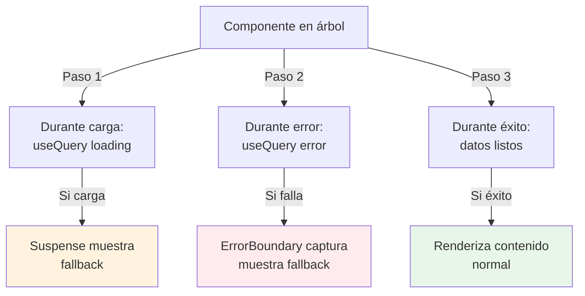

# Módulo 13: React en producción — resiliencia, accesibilidad y seguridad

Una SPA puede aprobar el flujo feliz y aun desaparecer ante un error de render, perder foco al navegar, ejecutar HTML hostil o hidratar con información distinta a la del servidor. Este módulo convierte el proyecto final en una interfaz que falla de forma contenida, recupera con intención y conserva sus garantías entre cliente y servidor.


## Aprende construyendo

### Tema 1: Diseñar estados de carga, error y recuperación

#### Paso 1 · Objetivo y preparación
Al finalizar vas a envolver `DetalleEnvio` en un `ErrorBoundary` + `Suspense` que distinga un fallo real de la carga normal, con un botón de recuperación que invalida la query en vez de repetir el mismo recurso rechazado. Prerrequisitos: Módulo 6 completo.

#### Paso 2 · Contexto y caso real
Si la API de RutaFlow falla al cargar un envío puntual, `DetalleEnvio` hoy simplemente desaparece sin ningún fallback — el operador no sabe si el envío no existe, si la red falló, o si la app se rompió.

#### Paso 3 · Teoría, modelo mental y analogía
Un Error Boundary captura errores de render en descendientes y muestra un fallback; recuperar significa restaurar una precondición (invalidar la query), no repetir ciegamente el mismo recurso rechazado — los mamparos de un barco limitan qué compartimento se pierde.

**Diagrama: Error Boundary + Suspense**



#### Paso 4 · Demostración guiada desde cero
```tsx
<ErrorBoundary
  resetKeys={[envioId]}
  fallbackRender={({ resetErrorBoundary }) => (
    <section role="alert">
      <h2>No pudimos mostrar este envío</h2>
      <button onClick={resetErrorBoundary}>Intentar de nuevo</button>
    </section>
  )}
  onError={(error, info) => reportError(error, info.componentStack)}
>
  <Suspense fallback={<EnvioSkeleton />}>
    <DetalleEnvio id={envioId} />
  </Suspense>
</ErrorBoundary>
```
Resultado esperado: si la API falla, el `ErrorBoundary` más cercano muestra el mensaje "No pudimos mostrar este envío" con un botón de reintentar, sin que el resto de la pantalla (navegación, otros widgets) desaparezca junto con el error.

#### Paso 5 · Práctica guiada
Pista: implementá `resetErrorBoundary` para que simplemente vuelva a renderizar con el mismo resultado de query ya rechazado, sin invalidarlo ni crear una nueva Promise — ese es el fallo deliberado: tocar "Intentar de nuevo" muestra el mismo error inmediatamente otra vez, porque la cache todavía tiene el mismo resultado rechazado; nada cambió la precondición que causó el fallo original.

#### Paso 6 · Práctica independiente
Corregí el Paso 5 haciendo que `resetErrorBoundary` invalide la query de ese envío antes de resetear el boundary, y agregá un test que simule el fallo con MSW, confirmando que el botón de reintentar efectivamente dispara una nueva petición de red.

#### Paso 7 · Cierre y evidencia
Entregá el ErrorBoundary con recuperación real del Paso 4, el botón que no recupera nada del Paso 5, y el test del Paso 6; explicá por qué un botón "Intentar de nuevo" que no cambia ninguna precondición del fallo no es una recuperación real, solo una ilusión de progreso. Siguiente paso: estudia cómo la composición visual debe conservar semántica y foco. Errores comunes: un boundary global único para toda la app en vez de unidades que fallan independientemente, esperar que el Error Boundary capture errores de manejadores de eventos o callbacks asíncronos (no lo hace), y un botón de reintentar que repite el mismo recurso ya rechazado. Fuentes oficiales: https://react.dev/reference/react/Suspense y https://github.com/bvaughn/react-error-boundary.
**¿Por qué es importante?** Un error de un widget no debería borrar navegación y trabajo no relacionado, y un fallback sin recuperación real deja al usuario atrapado repitiendo el mismo fallo.
**Evidencia de aprendizaje:** entrega ErrorBoundary con recuperación real, botón sin efecto detectado y test de recuperación con MSW.
**Conceptos clave:** pureza, render, commit, Effect, sincronización, Suspense, promise cacheada, Error Boundary, fallback, reset, error operacional, defecto, component stack, telemetría y Strict Mode.

El render debe comportarse como función pura: mismas props, estado y contexto producen la misma descripción sin modificar el exterior. Acceder al DOM, iniciar una petición imperativa o escribir storage durante render crea resultados que dependen de cuántas veces React evalúe. Un Effect sincroniza con un sistema externo **después** del commit; no es un lugar genérico para derivar estado que podía calcularse durante render.

Strict Mode repite ciertos ciclos en desarrollo para revelar efectos sin limpieza y render impuro. No “causa” la duplicación de producción: expone que el código no es simétrico. Cada suscripción debe devolver cleanup; cada request debe cancelarse o ignorar resultados obsoletos.

Suspense representa una parte que todavía no puede mostrar contenido. Una frontera demasiado alta reemplaza toda la pantalla por spinner; una demasiado baja produce parpadeo. Ubícala donde el diseño acepta revelar contenido conjuntamente. Una Promise leída mediante `use` necesita identidad cacheada; crearla durante cada render suspende repetidamente.

Error Boundary captura errores de render en descendientes y muestra fallback. No captura event handlers, callbacks asíncronos ordinarios, SSR, ni errores del propio boundary. Los eventos deben manejar rechazo en su flujo; el servidor usa su frontera; timers reportan explícitamente.

```tsx
<ErrorBoundary
  resetKeys={[taskId]}
  fallbackRender={({ resetErrorBoundary }) => (
    <section role="alert">
      <h2>No pudimos mostrar la tarea</h2>
      <button onClick={resetErrorBoundary}>Intentar de nuevo</button>
    </section>
  )}
  onError={(error, info) => reportError(error, info.componentStack)}
>
  <Suspense fallback={<TaskSkeleton />}>
    <TaskDetails id={taskId} />
  </Suspense>
</ErrorBoundary>
```

Recuperar significa restaurar una precondición: invalidar query, crear nueva Promise, resetear boundary o navegar. Un botón que repite el mismo recurso rechazado no recupera. Conserva estado confirmado, revierte optimistic update fallido y distingue offline, 404, 403 y defecto inesperado.

La telemetría incluye versión, ruta lógica y correlation ID, no props completos, tokens ni texto del usuario. Source maps simbolizan stacks con acceso controlado.

**Analogía:** los mamparos de un barco no evitan toda entrada de agua; limitan qué compartimento se pierde y permiten que el resto siga operando mientras se repara.

**¿Por qué es importante?** porque un error de una tarjeta no debería borrar navegación y trabajo no relacionado, y un fallback sin recuperación deja al usuario atrapado.

**Casos de uso reales:** chunk lazy que falla, query rechazada, componente con dato inesperado, actualización optimista revertida, sesión expirada y efecto duplicado en desarrollo.

**Diagrama:**

```text
render puro -> suspende -> Suspense fallback -> recurso resuelve -> UI
           `-> error -> boundary más cercano -> fallback + reporte
evento async -> catch explícito -> estado recuperable
reset -> nuevo recurso/precondición, no repetir objeto rechazado
```

* Ejecutar: `npm test`
* Código: `examples/rutaflow/react/use-shipment-tracking.tsx`
* Proyecto: proyecto integrador RutaFlow

### Tema 2: La composición visual debe conservar semántica y foco

#### Paso 1 · Objetivo y preparación
Al finalizar vas a corregir el campo de PIN de confirmación de entrega para que un error de validación mueva el foco al campo inválido y lo anuncie mediante `aria-describedby`, en vez de solo cambiar un color. Prerrequisitos: Tema 1 de este módulo.

#### Paso 2 · Contexto y caso real
Hoy, si el PIN es incorrecto, el campo se pone en borde rojo — alguien que navega con teclado o lector de pantalla no recibe ninguna señal de que algo falló, ni sabe cuál campo corregir.

#### Paso 3 · Teoría, modelo mental y analogía
React no cambia las reglas de HTML; un campo con error necesita `aria-invalid` y `aria-describedby` apuntando al mensaje real, y el foco debe moverse al primer campo inválido tras un submit fallido.

#### Paso 4 · Demostración guiada desde cero
```tsx
function CampoPin({ id, label, error, ...props }: CampoPinProps) {
  const errorId = `${id}-error`;
  return (
    <div>
      <label htmlFor={id}>{label}</label>
      <input id={id} aria-invalid={Boolean(error)} aria-describedby={error ? errorId : undefined} {...props} />
      {error && <p id={errorId} role="alert">{error}</p>}
    </div>
  );
}
```
Resultado esperado: al enviar un PIN incorrecto, el lector de pantalla anuncia tanto que el campo es inválido (`aria-invalid`) como el mensaje de error asociado (`aria-describedby`), sin depender únicamente de un color que un usuario con baja visión o ceguera no puede percibir.

#### Paso 5 · Práctica guiada
Pista: quitá `aria-describedby` y dejá solo el borde rojo con CSS para indicar el error — ese es el fallo deliberado: navegando con VoiceOver o NVDA, el campo se anuncia como inválido genéricamente (si acaso) pero sin explicar nada sobre cuál es el problema concreto ni cómo corregirlo.

#### Paso 6 · Práctica independiente
Corregí el Paso 5 restaurando `aria-describedby`, y agregá además que, tras un submit fallido, el foco se mueva explícitamente al primer campo inválido, en vez de dejarlo donde estaba.

#### Paso 7 · Cierre y evidencia
Entregá el campo accesible del Paso 4, el error indicado solo por color del Paso 5, y el movimiento de foco del Paso 6; explicá por qué un color por sí solo nunca es información accesible, y por qué mover el foco al primer error ayuda específicamente a quien navega con teclado. Siguiente paso: estudia la frontera de seguridad entre cliente y servidor. Errores comunes: indicar un error solo con color sin texto ni atributos ARIA, no mover el foco tras un submit inválido, y usar un índice de lista como `key` en una lista reordenable. Fuentes oficiales: https://www.w3.org/WAI/ARIA/apg/ y https://testing-library.com/docs/queries/byrole/.
**¿Por qué es importante?** Las abstracciones de diseño pueden borrar semántica sin que TypeScript avise; el resultado excluye usuarios y vuelve frágiles las pruebas que dependen de esa semántica.
**Evidencia de aprendizaje:** entrega campo accesible, error solo por color detectado y movimiento de foco agregado.
**Conceptos clave:** HTML semántico, nombre accesible, rol, estado, teclado, foco, landmark, heading, route announcement, live region, formulario, error, portal, focus trap, Testing Library y axe.

React no cambia las reglas de HTML. Un componente `Button` que devuelve `<div onClick>` sigue siendo un div. Diseña primitivas semánticas antes de añadir estilos. Props polimórficas requieren contratos: si `as="a"`, debe existir `href`; si actúa como botón, usa button.

Las listas mantienen identidad mediante `key`. Una key inestable no solo afecta rendimiento: puede mover estado y foco al elemento equivocado después de reordenar. Usa identidad del dominio, nunca índice cuando se insertan o eliminan filas.

Al navegar en SPA actualiza `document.title`, conserva un `<h1>` único y anuncia transición. No enfoques automáticamente en cada render. Tras una navegación iniciada por usuario, mover foco al encabezado o contenido principal puede dar contexto; al cerrar modal, retorna al disparador. Portals cambian ubicación DOM, no la jerarquía React, y necesitan foco atrapado, Escape y fondo inerte.

```tsx
function Field({ id, label, error, ...props }: FieldProps) {
  const errorId = `${id}-error`;
  return (
    <div>
      <label htmlFor={id}>{label}</label>
      <input
        id={id}
        aria-invalid={Boolean(error)}
        aria-describedby={error ? errorId : undefined}
        {...props}
      />
      {error && <p id={errorId}>{error}</p>}
    </div>
  );
}
```

En un submit inválido, muestra resumen con enlaces o lleva foco al primer campo inválido según el flujo, sin borrar valores. Mensajes deben indicar cómo corregir, no solo “error”. Estados loading y disabled conservan nombre y explicación; no sustituyas el botón por spinner sin texto.

Testing Library consulta por roles/nombres porque aproxima el árbol accesible. Añade axe para reglas automatizables y Playwright para tabulación, Escape y restauración de foco. Ninguna herramienta sustituye lector y revisión humana del orden.

**Analogía:** componer componentes es ensamblar señales de tránsito. Cambiar pintura no puede eliminar el significado, orden ni ruta que una persona necesita para llegar.

**¿Por qué es importante?** porque abstracciones de diseño pueden borrar semántica sin que TypeScript avise. El resultado excluye usuarios y vuelve frágiles las pruebas.

**Casos de uso reales:** modal por portal, combobox, formulario multi-paso, lista reordenable, toast, navegación protegida y skeleton que oculta nombres.

**Diagrama:**

```text
componente -> elemento nativo -> nombre + rol + estado
acción teclado -> foco predecible -> feedback asociado
Testing Library/axe -> regresión automática
teclado + lector -> flujo completo comprensible
```

* Ejecutar: `npm test`
* Código: `examples/rutaflow/react/use-shipment-tracking.tsx`
* Proyecto: proyecto integrador RutaFlow
* Visualización: concepto mostrado en diagrama

### Tema 3: Cliente y servidor forman una sola frontera de seguridad

#### Paso 1 · Objetivo y preparación
Al finalizar vas a auditar la Server Action `confirmarEntregaAction` (Módulo 10) para confirmar que autentica y autoriza dentro de la propia función, no solo ocultando el botón en el cliente. Prerrequisitos: Tema 2 de este módulo.

#### Paso 2 · Contexto y caso real
Ocultar el botón "Confirmar entrega" para conductores sin la ruta asignada no impide que alguien invoque la Server Action directamente, sin pasar nunca por ese botón.

#### Paso 3 · Teoría, modelo mental y analogía
Una Server Action es un endpoint invocable, no una función privada por estar junto al componente — una puerta tras el mostrador, no una habitación secreta; debe autenticar y autorizar dentro de la propia acción.

#### Paso 4 · Demostración guiada desde cero
```ts
export async function confirmarEntregaAction(formData: FormData) {
  'use server';
  const session = await requireSession();
  const envioId = EnvioId.parse(formData.get('envioId'));
  await authorize(session.userId, 'confirmar', envioId);
  await envios.confirmar(envioId);
}
```
Resultado esperado: llamar a `confirmarEntregaAction` para un envío que no está asignado al conductor autenticado lanza un error de autorización dentro de la propia función, sin importar si el botón correspondiente en el cliente estaba oculto, deshabilitado, o nunca se renderizó para ese usuario.

#### Paso 5 · Práctica guiada
Pista: quitá la llamada a `authorize(...)` de la Server Action, confiando en que el botón ya está oculto en el cliente para conductores sin esa ruta asignada — ese es el fallo deliberado: cualquiera que invoque la acción sin pasar por el botón oculto puede confirmar la entrega de un envío que no le pertenece, porque la única "protección" vivía en el cliente.

#### Paso 6 · Práctica independiente
Corregí el Paso 5 restaurando `authorize(...)`, y agregá una prueba que invoque `confirmarEntregaAction` directamente (sin pasar por ningún componente de UI) con un `userId` sin autorización, confirmando que la acción la rechaza igual.

#### Paso 7 · Cierre y evidencia
Entregá la Server Action con autorización real del Paso 4, el acceso indebido provocado en el Paso 5, y la prueba directa del Paso 6; explicá por qué "el botón está oculto" nunca es un control de seguridad, y por qué cada Server Action necesita repetir las mismas verificaciones que cualquier otro endpoint de servidor. Siguiente paso: estudia hidratación determinista y releases medibles. Errores comunes: autorizar ocultando elementos de UI en vez de validar dentro de la acción del servidor, pasar objetos con campos privados desde un Server Component a un Client Component, y usar `dangerouslySetInnerHTML` con contenido no sanitizado por una política real. Fuentes oficiales: https://react.dev/reference/rsc/server-functions y https://nextjs.org/docs/app/building-your-application/data-fetching/forms-and-mutations.
**¿Por qué es importante?** Mezclar render de servidor/cliente mueve datos y acciones a través de fronteras invisibles en JSX; un supuesto equivocado sobre quién verifica qué filtra datos o autoriza por interfaz en vez de por permiso real.
**Evidencia de aprendizaje:** entrega Server Action con autorización real, acceso indebido detectado y prueba directa de la acción.
**Conceptos clave:** XSS, escape, dangerouslySetInnerHTML, sanitización contextual, URL, CSP, nonce, Server Component, Client Component, serialización, secreto, Server Action, autenticación, autorización, CSRF y cache.

React escapa texto interpolado. `dangerouslySetInnerHTML` omite esa protección porque declara HTML intencional. Solo recibe contenido sanitizado por una política mantenida y apropiada al contexto; no una regex. Valida protocolos de URLs y evita `javascript:`. Librerías que tocan DOM pueden crear sinks fuera de JSX.

```tsx
function RichDescription({ sanitizedHtml }: { sanitizedHtml: SanitizedHtml }) {
  return <section dangerouslySetInnerHTML={{ __html: sanitizedHtml.value }} />;
}
```

El tipo de marca ayuda a que solo el sanitizador cree `SanitizedHtml`, pero no demuestra que la implementación sea segura: prueba payloads y revisa configuración. CSP con nonce/hashes y Trusted Types agrega defensa. Evita permitir `unsafe-inline` global para hacer desaparecer errores.

Server Components no envían su código al cliente, pero los valores que pasan a Client Components se serializan y llegan al navegador. Nunca pases secreto, credencial o objeto con campos privados. Minimiza DTO en la frontera `use client`.

Server Actions son endpoints invocables, no funciones privadas por estar junto al componente. Autentica y autoriza dentro de cada acción, valida `FormData`, protege invariantes y considera CSRF/origen según cookies e infraestructura. Ocultar botón no impide llamar la acción.

La cache del servidor debe incluir identidad, permisos, locale y demás dimensiones que cambian resultado, o evitar cache compartida para datos privados. Tras una mutación, invalida datos correctos sin mostrar a otro usuario una respuesta reutilizada.

```ts
export async function deleteTask(formData: FormData) {
  'use server';
  const session = await requireSession();
  const taskId = TaskId.parse(formData.get('taskId'));
  await authorize(session.userId, 'delete', taskId);
  await tasks.delete(taskId);
}
```

**Analogía:** un Server Action es una puerta tras el mostrador, no una habitación secreta. Aunque el cliente normal llegue mediante un botón, cualquiera puede intentar la dirección y la puerta debe verificar identidad y permiso.

**¿Por qué es importante?** porque mezclar render servidor/cliente mueve datos y acciones a través de fronteras invisibles en JSX. Un supuesto equivocado filtra secretos o autoriza por interfaz.

**Casos de uso reales:** CMS, markdown, avatar URL, acción admin, cookie de sesión, RSC con objeto usuario, cache de dashboard y error serializado.

**Diagrama:**

```text
DB/secreto -> Server Component -> DTO mínimo serializable -> Client Component
form/browser -> Server Action -> autenticar -> autorizar -> validar -> mutar
texto -> escape React; HTML permitido -> sanitizador -> sink auditado
CSP/Trusted Types cubren DOM completo
```

* Ejecutar: `npm test`
* Proyecto: proyecto integrador RutaFlow
* Visualización: concepto mostrado en diagrama

### Tema 4: Hidratación determinista, idioma y releases medibles

#### Paso 1 · Objetivo y preparación
Al finalizar vas a eliminar un mismatch de hidratación en `DetalleEnvio` causado por formatear la fecha estimada con la zona horaria del navegador del cliente, distinta de la usada en el servidor. Prerrequisitos: Tema 3 de este módulo.

#### Paso 2 · Contexto y caso real
`DetalleEnvio` renderizado en el servidor (SSR) muestra la fecha estimada formateada con una zona horaria, pero el primer render del cliente la recalcula sin especificar zona, usando la del navegador del conductor — si son distintas, React detecta una discrepancia entre el HTML del servidor y lo que el cliente esperaba renderizar.

#### Paso 3 · Teoría, modelo mental y analogía
La hidratación une listeners al HTML del servidor asumiendo que el primer render del cliente coincide exactamente; una zona horaria implícita (o `Date.now()`, `Math.random()`) produce un mismatch.

#### Paso 4 · Demostración guiada desde cero
```tsx
const due = new Intl.DateTimeFormat(locale, {
  dateStyle: 'long',
  timeZone: userTimeZone, // la misma zona decidida en el servidor, no la del navegador
}).format(new Date(envio.fechaEstimada));
```
Resultado esperado: tanto el servidor como el primer render del cliente usan exactamente el mismo `locale` y `userTimeZone` (decididos una sola vez, por ejemplo en la sesión), produciendo el mismo string de fecha en ambos lados — sin ninguna advertencia de mismatch de hidratación en consola.

#### Paso 5 · Práctica guiada
Pista: quitá `timeZone: userTimeZone` del formato, dejando que `Intl.DateTimeFormat` use la zona horaria por defecto del entorno de ejecución — ese es el fallo deliberado: el servidor (en UTC) y el navegador del conductor (en su zona local) producen strings de fecha distintos para el mismo timestamp, y React reporta una advertencia de hydration mismatch, además de un parpadeo visible donde la fecha cambia justo después de cargar.

#### Paso 6 · Práctica independiente
Corregí el Paso 5 devolviendo `timeZone: userTimeZone` explícito, y confirmá en la consola del navegador que la advertencia de mismatch desapareció.

#### Paso 7 · Cierre y evidencia
Entregá el formato determinista del Paso 4, el mismatch provocado en el Paso 5, y la confirmación sin advertencias del Paso 6; explicá por qué `suppressHydrationWarning` no habría sido la corrección correcta acá: oculta el síntoma sin eliminar la causa (dos zonas horarias distintas decidiendo el mismo dato). Siguiente paso: cerrá el módulo con la auditoría completa de resiliencia del proyecto integrador. Errores comunes: depender de la zona horaria o locale implícitos del entorno de ejecución en vez de uno explícito y compartido, usar `suppressHydrationWarning` para silenciar un mismatch real en vez de eliminar su causa, y no medir Core Web Vitals segmentados por versión antes de confirmar que un cambio mejoró algo. Fuentes oficiales: https://react.dev/reference/react-dom/client/hydrateRoot y https://react.dev/link/hydration-mismatch.
**¿Por qué es importante?** SSR solo aporta valor si el cliente conserva el resultado; una app que decide locale/zona de forma distinta en servidor y cliente produce discrepancias reales, no solo advertencias cosméticas.
**Evidencia de aprendizaje:** entrega formato determinista, mismatch provocado y confirmación sin advertencias.
**Conceptos clave:** SSR, hydration, mismatch, determinismo, identifierPrefix, suppressHydrationWarning, locale, timezone, RTL, streaming, bundle budget, Core Web Vitals, RUM, deployment ID y rollback.

Hydration une listeners al HTML del servidor suponiendo que el primer render cliente coincide. `Date.now()`, `Math.random()`, lectura directa de `window`, locale distinta o datos que cambian entre respuestas producen mismatch. Pasa snapshot serializable, usa IDs estables (`useId` cuando corresponde) y difiere contenido exclusivamente cliente después del montaje si no puede renderizarse igual.

`suppressHydrationWarning` silencia una diferencia inevitable en un nivel; no corrige datos ni debe cubrir árboles completos. Investiga primero: una divergencia puede asociar handlers con DOM equivocado o forzar render cliente.

El locale decidido en servidor debe llegar al cliente y a la ruta. Formatea números, moneda y fecha con locale y zona explícitos. Traduce contenido, labels, errores, metadatos y fallbacks de Suspense. Soporta plural completo y RTL mediante propiedades CSS lógicas. Prueba textos largos y mezcla bidireccional.

```tsx
const price = new Intl.NumberFormat(locale, {
  style: 'currency',
  currency: task.currency,
}).format(task.amount);

const due = new Intl.DateTimeFormat(locale, {
  dateStyle: 'long',
  timeZone: userTimeZone,
}).format(new Date(task.dueAt));
```

Define presupuesto de JS inicial y por ruta, pero mide experiencia: LCP, INP y CLS en dispositivos reales, segmentados por versión y ruta. Server Components pueden reducir JS, pero queries secuenciales crean waterfalls. Streaming mejora contenido temprano si boundaries siguen la jerarquía visual.

Cada release incluye deployment ID en telemetría, source maps privados, canary y rollback. Cliente y servidor pueden coexistir durante despliegue; cambios de contrato deben ser compatibles. Un chunk viejo solicitado después de limpiar assets produce fallo: conserva assets por ventana o maneja actualización con recarga segura que no pierda formulario.

**Analogía:** hidratar es superponer un plano interactivo sobre un edificio ya construido. Si puerta y ventana aparecen en posiciones distintas, ocultar la advertencia no alinea el edificio.

**¿Por qué es importante?** porque SSR solo aporta valor si el cliente conserva el resultado, y una app global debe producir el mismo significado entre servidor, navegador y release.

**Casos de uso reales:** hora local distinta, ID aleatorio, tema desde localStorage, locale por header, RTL, chunk desaparecido, despliegue canary y rollback compatible.

**Diagrama:**

```text
request -> locale/zona/datos snapshot -> HTML servidor
                                  `-> payload -> primer render cliente idéntico
build -> budgets -> canary -> RUM por deployment ID -> ampliar
                                  `-> regresión -> rollback compatible
```

## Revisión oficial de plataforma — julio de 2026

### React 19.2, Compiler y seguridad de Server Components

**React 19.2** incorpora `Activity`, `useEffectEvent`, `cacheSignal`, Performance Tracks y capacidades de pre-render parcial. `useEffectEvent` separa lógica no reactiva de un efecto sin mentir al linter; no es una forma general de omitir dependencias. **React Compiler** 1.0 puede reducir memorización manual, pero primero exige código conforme a las reglas de React y mediciones. Las aplicaciones con React Server Components deben usar una versión parcheada —19.0.1, 19.1.2, 19.2.1 o posterior— por avisos oficiales de seguridad.

**Aplicación al proyecto:** elimina una memorización especulativa y compara Performance Tracks, modela una pantalla conservada con Activity, migra un callback de efecto a useEffectEvent y añade un gate que rechace versiones vulnerables de paquetes RSC.


## Laboratorio práctico

### Proyecto: auditoría resiliente de la SPA y su versión Next.js

Parte del proyecto 12. Si migraste una vista a Next.js, ejecuta las pruebas de servidor/cliente; si conservas Vite, implementa las partes aplicables y documenta la frontera que no existe.

1. Dibuja árbol de Suspense y Error Boundaries para rutas y widgets. Justifica qué contenido permanece ante cada fallo.
2. Inyecta errores de render, query, handler, timer y SSR; registra cuáles captura cada mecanismo.
3. Implementa fallback accesible con retry que renueva el recurso y conserva estado confirmado.
4. Recorre login/lista/crear/editar solo con teclado y lector. Corrige semántica, foco, errores y announcements.
5. Automatiza roles/nombres, orden de tabulación, modal y restauración de foco con Testing Library, axe y Playwright.
6. Introduce un payload XSS inocuo en una descripción rica aislada, corrige con política contextual y añade CSP.
7. Audita props que cruzan Server/Client Components y cada Server Action; prueba 401, 403, manipulación y CSRF aplicable.
8. Provoca mismatches con fecha, random e información de navegador; elimínalos sin abuso de `suppressHydrationWarning`.
9. Añade `es-CO` y `en-US`, plurales, moneda y dos zonas; prueba RTL o pseudo-RTL y fallbacks.
10. Define budgets por entrada/ruta y mide Core Web Vitals en un dispositivo limitado antes/después de una mejora.
11. Simula despliegue con HTML viejo y chunks nuevos, y viceversa. Documenta compatibilidad, recuperación de formulario y rollback.

**Verificación:** conserva matriz fallo/frontera/resultado, evidencia del lector, reporte axe, payload bloqueado, pruebas de autorización, logs de hydration limpios, capturas de locales/RTL y comparación de métricas por deployment ID. CI falla ante regresión de contrato, a11y o budget crítico.

**Errores comunes y soluciones**

- Usar Effect para derivar estado: calcula durante render o modela evento; Effect sincroniza externos.
- Un boundary global único: delimita unidades que pueden fallar y recuperarse independientemente.
- Esperar que boundary capture eventos/timers: usa manejo asíncrono explícito.
- Arreglar accesibilidad con `aria-label` indiscriminado: empieza por elemento, label y flujo nativos.
- Confiar en “React escapa”: revisa HTML intencional, URLs, DOM externo y librerías.
- Autorizar ocultando botones: valida sesión y permiso dentro de acción/servidor.
- Silenciar hydration: elimina no determinismo o aísla la diferencia inevitable mínima.
- Formatear según navegador tras SSR: conserva la misma decisión de locale/zona en ambos lados.

<!-- OFFICIAL-TOPIC-ATLAS:START -->
## Atlas completo de temas oficiales

Derivado de la [documentación oficial](https://react.dev/reference/react), sus referencias, migraciones y guías de operación. Inventariar no equivale a dominar: cada selección se demuestra con código, prueba, medición y explicación. **Cobertura: 45 temas.**

| Área | Temas que deben poder explicarse y aplicarse | Evidencia práctica |
|---|---|---|
| Modelo | `pureza` · `JSX` · `props` · `estado` · `keys` · `render y commit` · `eventos` · `estado como snapshot` | portal |
| Hooks | `useState` · `useReducer` · `useContext` · `useRef` · `useEffect` · `useLayoutEffect` · `useEffectEvent` · `hooks propios` | portal |
| UX | `formularios` · `Actions` · `useActionState` · `useOptimistic` · `useTransition` · `Suspense` · `use` · `error boundaries` | portal |
| Servidor | `SSR` · `streaming` · `hidratación` · `Server Components` · `Server Functions` · `use client/use server` · `serialización` | portal |
| Optimización | `React Compiler` · `reglas del compilador` · `memoización` · `profiler` · `code splitting` · `caché` · `virtualización` | portal |
| Ingeniería | `routing` · `testing` · `accesibilidad` · `seguridad RSC` · `estado remoto` · `arquitectura` · `migración` | portal |

### Método de estudio y proyecto de ampliación

Para cada tema responde qué problema resuelve, cuál es su modelo mental, cómo falla, cómo se verifica y cuándo no conviene. Elige uno por área e intégralos en un proyecto propio de ampliación. Entrega diagrama, ADR, pruebas de éxito y fallo, una medición, una amenaza y el enlace oficial con versión y fecha. Una API preview se aísla en laboratorio y nunca se presenta como base estable.
<!-- OFFICIAL-TOPIC-ATLAS:END -->

* Ejecutar: `npm test`
* Código: `examples/rutaflow/react/use-shipment-tracking.tsx`
* Visualización: concepto mostrado en diagrama

