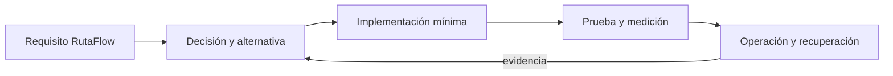

# Módulo 14: React Master: servidor, Next.js, a11y e i18n


## Aprende construyendo

### Tema 1: Server Components y streaming

#### Paso 1 · Objetivo y preparación
Al finalizar construirás este tema desde cero. Prerrequisitos: Node.js LTS y npm; verifica `node --version`.
#### Paso 2 · Contexto y caso real
Una app de entregas necesita reducir JavaScript enviado sin ocultar errores; la analogía es una central que procesa antes de enviar.
#### Paso 3 · Teoría, modelo mental y analogía
El contrato define entradas, salidas y límites; la analogía anterior guía la decisión.
#### Paso 4 · Demostración guiada
Ejecuta `npx create-next-app@latest ejemplo-server` y crea `app/page.tsx`; comenta cada bloque.
```bash
npx --version
```
Resultado esperado: la aplicación compila y muestra la pantalla inicial.
#### Paso 5 · Práctica guiada
Pista: observa el mensaje del servidor antes de cambiar el código.
Pista: fuerza una carga lenta para provocar un fallo deliberado y corrígelo.
#### Paso 6 · Práctica independiente
Añade un caso límite, una prueba y documenta la decisión frente a una alternativa.
#### Paso 7 · Cierre y evidencia
Conserva salida, fallo y corrección; explica el resultado y entrega la evidencia. Como siguiente paso, estudia integración. Errores comunes: secretos en componentes y medir solo local. Fuente oficial: https://nextjs.org/docs.
Ejemplo independiente: repite el flujo desde una carpeta vacía.
```bash
npm init -y
```
Evidencia: entrega la salida y explica el resultado.

**Conceptos clave:** propósito, modelo de ejecución, configuración, seguridad, coste, pruebas y operación.

Server Components y streaming se estudia como una decisión de ingeniería y no como una colección de comandos. Primero identifica el problema que resuelve y los límites de la plataforma; luego construye el incremento mínimo dentro de RutaFlow. Registra entradas, salidas, dependencias y condiciones de fallo. Compara al menos una alternativa y conserva la medición que justifica la elección. Si la tecnología es experimental, se aísla del camino estable y se documenta la estrategia de retirada.

En producción debes considerar configuración por ambiente, identidad de máquina y persona, secretos, compatibilidad, telemetría y recuperación. Una demostración exitosa no prueba comportamiento bajo concurrencia, reintentos, pérdida de red o datos inválidos. Por eso el laboratorio introduce un fallo deliberado y exige una prueba de regresión. El resultado debe poder repetirse desde terminal y CI sin pasos secretos del editor.

**Analogía:** es como incorporar una nueva estación a una red logística: no basta con construirla; hay que definir rutas, capacidad, controles, contingencias y cómo sabremos que funciona.

**¿Por qué es importante?** Porque Server Components y streaming aparece cuando el sistema crece y las decisiones dejan de ser locales. Comprender su coste evita adoptar una herramienta por popularidad o descartarla por una primera experiencia incompleta.

**Casos de uso reales:** operación normal, configuración inválida, dependencia lenta, solicitud duplicada, cambio incompatible y recuperación posterior a un despliegue fallido.

**Diagrama:**


### Tema 2: Server Actions y seguridad

#### Paso 1 · Objetivo y preparación
Al finalizar construirás este tema desde cero. Prerrequisitos: Node.js LTS y npm; verifica `node --version`.
#### Paso 2 · Contexto y caso real
Una acción de entrega recibe datos no confiables; la analogía es una ventanilla que valida identidad antes de tramitar.
#### Paso 3 · Teoría, modelo mental y analogía
El contrato define entradas, salidas y límites; la analogía anterior guía la decisión.
#### Paso 4 · Demostración guiada
Ejecuta `npx create-next-app@latest ejemplo-actions` y crea `app/actions.ts`; comenta cada bloque.
```bash
npx --version
```
Resultado esperado: la aplicación compila y valida la acción.
#### Paso 5 · Práctica guiada
Pista: observa el mensaje del servidor antes de cambiar el código.
Envía una entrada inválida para provocar un fallo deliberado y corrígelo.
#### Paso 6 · Práctica independiente
Añade autorización, prueba de regresión y documenta el resultado.
#### Paso 7 · Cierre y evidencia
Conserva salida, fallo y corrección; explica el resultado y entrega la evidencia. Como siguiente paso, estudia autorización. Errores comunes: confiar en el cliente y registrar tokens. Fuente oficial: https://nextjs.org/docs/app/building-your-application/data-fetching/server-actions-and-mutations.
Ejemplo independiente: repite el flujo desde una carpeta vacía.
```bash
npm init -y
```
Evidencia: entrega la salida y explica el resultado.

**Conceptos clave:** propósito, modelo de ejecución, configuración, seguridad, coste, pruebas y operación.

Server Actions y seguridad se estudia como una decisión de ingeniería y no como una colección de comandos. Primero identifica el problema que resuelve y los límites de la plataforma; luego construye el incremento mínimo dentro de RutaFlow. Registra entradas, salidas, dependencias y condiciones de fallo. Compara al menos una alternativa y conserva la medición que justifica la elección. Si la tecnología es experimental, se aísla del camino estable y se documenta la estrategia de retirada.

En producción debes considerar configuración por ambiente, identidad de máquina y persona, secretos, compatibilidad, telemetría y recuperación. Una demostración exitosa no prueba comportamiento bajo concurrencia, reintentos, pérdida de red o datos inválidos. Por eso el laboratorio introduce un fallo deliberado y exige una prueba de regresión. El resultado debe poder repetirse desde terminal y CI sin pasos secretos del editor.

**Analogía:** es como incorporar una nueva estación a una red logística: no basta con construirla; hay que definir rutas, capacidad, controles, contingencias y cómo sabremos que funciona.

**¿Por qué es importante?** Porque Server Actions y seguridad aparece cuando el sistema crece y las decisiones dejan de ser locales. Comprender su coste evita adoptar una herramienta por popularidad o descartarla por una primera experiencia incompleta.

**Casos de uso reales:** operación normal, configuración inválida, dependencia lenta, solicitud duplicada, cambio incompatible y recuperación posterior a un despliegue fallido.

**Diagrama:**


### Tema 3: Next.js ISR, Metadata y Middleware

#### Paso 1 · Objetivo y preparación
Al finalizar construirás este tema desde cero. Prerrequisitos: Node.js LTS y npm; verifica `node --version`.
#### Paso 2 · Contexto y caso real
Las páginas públicas de seguimiento deben ser rápidas y seguras; la analogía es publicar una edición con fecha de caducidad.
#### Paso 3 · Teoría, modelo mental y analogía
El contrato define entradas, salidas y límites; la analogía anterior guía la decisión.
#### Paso 4 · Demostración guiada
Ejecuta `npx create-next-app@latest ejemplo-next` y crea `middleware.ts`; comenta cada bloque.
```bash
npx --version
```
Resultado esperado: la aplicación compila y aplica la ruta.
#### Paso 5 · Práctica guiada
Pista: observa el mensaje del servidor antes de cambiar el código.
Usa una regla de ruta incorrecta para provocar un fallo deliberado y corrígelo.
#### Paso 6 · Práctica independiente
Añade metadata, caché y una prueba de navegación.
#### Paso 7 · Cierre y evidencia
Conserva salida, fallo y corrección; explica el resultado y entrega la evidencia. Como siguiente paso, estudia caché. Errores comunes: cachear datos privados y loops de middleware. Fuente oficial: https://nextjs.org/docs.
Ejemplo independiente: repite el flujo desde una carpeta vacía.
```bash
npm init -y
```
Evidencia: entrega la salida y explica el resultado.

**Conceptos clave:** propósito, modelo de ejecución, configuración, seguridad, coste, pruebas y operación.

Next.js ISR, Metadata y Middleware se estudia como una decisión de ingeniería y no como una colección de comandos. Primero identifica el problema que resuelve y los límites de la plataforma; luego construye el incremento mínimo dentro de RutaFlow. Registra entradas, salidas, dependencias y condiciones de fallo. Compara al menos una alternativa y conserva la medición que justifica la elección. Si la tecnología es experimental, se aísla del camino estable y se documenta la estrategia de retirada.

En producción debes considerar configuración por ambiente, identidad de máquina y persona, secretos, compatibilidad, telemetría y recuperación. Una demostración exitosa no prueba comportamiento bajo concurrencia, reintentos, pérdida de red o datos inválidos. Por eso el laboratorio introduce un fallo deliberado y exige una prueba de regresión. El resultado debe poder repetirse desde terminal y CI sin pasos secretos del editor.

**Analogía:** es como incorporar una nueva estación a una red logística: no basta con construirla; hay que definir rutas, capacidad, controles, contingencias y cómo sabremos que funciona.

**¿Por qué es importante?** Porque Next.js ISR, Metadata y Middleware aparece cuando el sistema crece y las decisiones dejan de ser locales. Comprender su coste evita adoptar una herramienta por popularidad o descartarla por una primera experiencia incompleta.

**Casos de uso reales:** operación normal, configuración inválida, dependencia lenta, solicitud duplicada, cambio incompatible y recuperación posterior a un despliegue fallido.

**Diagrama:**


### Tema 4: Optimización de imágenes y fuentes

#### Paso 1 · Objetivo y preparación
Al finalizar construirás este tema desde cero. Prerrequisitos: Node.js LTS y npm; verifica `node --version`.
#### Paso 2 · Contexto y caso real
Fotos de entrega afectan batería y datos; la analogía es transportar solo el tamaño necesario.
#### Paso 3 · Teoría, modelo mental y analogía
El contrato define entradas, salidas y límites; la analogía anterior guía la decisión.
#### Paso 4 · Demostración guiada
Ejecuta `npx create-next-app@latest ejemplo-media` y crea `app/components/Photo.tsx`; comenta cada bloque.
```bash
npx --version
```
Resultado esperado: la aplicación compila y optimiza el recurso.
#### Paso 5 · Práctica guiada
Pista: observa el mensaje del servidor antes de cambiar el código.
Carga una fuente no declarada para provocar un fallo deliberado y corrígelo.
#### Paso 6 · Práctica independiente
Compara tamaños, Web Vitals y accesibilidad.
#### Paso 7 · Cierre y evidencia
Conserva salida, fallo y corrección; explica el resultado y entrega la evidencia. Como siguiente paso, estudia Web Vitals. Errores comunes: imágenes sin dimensiones y fuentes bloqueantes. Fuente oficial: https://nextjs.org/docs/app/building-your-application/optimizing/images.
Ejemplo independiente: repite el flujo desde una carpeta vacía.
```bash
npm init -y
```
Evidencia: entrega la salida y explica el resultado.

**Conceptos clave:** propósito, modelo de ejecución, configuración, seguridad, coste, pruebas y operación.

Optimización de imágenes y fuentes se estudia como una decisión de ingeniería y no como una colección de comandos. Primero identifica el problema que resuelve y los límites de la plataforma; luego construye el incremento mínimo dentro de RutaFlow. Registra entradas, salidas, dependencias y condiciones de fallo. Compara al menos una alternativa y conserva la medición que justifica la elección. Si la tecnología es experimental, se aísla del camino estable y se documenta la estrategia de retirada.

En producción debes considerar configuración por ambiente, identidad de máquina y persona, secretos, compatibilidad, telemetría y recuperación. Una demostración exitosa no prueba comportamiento bajo concurrencia, reintentos, pérdida de red o datos inválidos. Por eso el laboratorio introduce un fallo deliberado y exige una prueba de regresión. El resultado debe poder repetirse desde terminal y CI sin pasos secretos del editor.

**Analogía:** es como incorporar una nueva estación a una red logística: no basta con construirla; hay que definir rutas, capacidad, controles, contingencias y cómo sabremos que funciona.

**¿Por qué es importante?** Porque Optimización de imágenes y fuentes aparece cuando el sistema crece y las decisiones dejan de ser locales. Comprender su coste evita adoptar una herramienta por popularidad o descartarla por una primera experiencia incompleta.

**Casos de uso reales:** operación normal, configuración inválida, dependencia lenta, solicitud duplicada, cambio incompatible y recuperación posterior a un despliegue fallido.

**Diagrama:**


### Tema 5: Accesibilidad y React Aria

#### Paso 1 · Objetivo y preparación
Al finalizar construirás este tema desde cero. Prerrequisitos: Node.js LTS y npm; verifica `node --version`.
#### Paso 2 · Contexto y caso real
Un operador debe usar teclado y lector de pantalla; la analogía es diseñar rutas con señalización universal.
#### Paso 3 · Teoría, modelo mental y analogía
El contrato define entradas, salidas y límites; la analogía anterior guía la decisión.
#### Paso 4 · Demostración guiada
Ejecuta `npx create-next-app@latest ejemplo-a11y` y crea `app/components/Dialog.tsx`; comenta cada bloque.
```bash
npx --version
```
Resultado esperado: la aplicación compila y el control es navegable.
#### Paso 5 · Práctica guiada
Pista: observa el mensaje del servidor antes de cambiar el código.
Quita el nombre accesible para provocar un fallo deliberado y corrígelo.
#### Paso 6 · Práctica independiente
Prueba teclado, foco y contraste con una herramienta automática.
#### Paso 7 · Cierre y evidencia
Conserva salida, fallo y corrección; explica el resultado y entrega la evidencia. Como siguiente paso, estudia pruebas de accesibilidad. Errores comunes: ARIA redundante y foco perdido. Fuente oficial: https://react-spectrum.adobe.com/react-aria/.
Ejemplo independiente: repite el flujo desde una carpeta vacía.
```bash
npm init -y
```
Evidencia: entrega la salida y explica el resultado.

**Conceptos clave:** propósito, modelo de ejecución, configuración, seguridad, coste, pruebas y operación.

Accesibilidad y React Aria se estudia como una decisión de ingeniería y no como una colección de comandos. Primero identifica el problema que resuelve y los límites de la plataforma; luego construye el incremento mínimo dentro de RutaFlow. Registra entradas, salidas, dependencias y condiciones de fallo. Compara al menos una alternativa y conserva la medición que justifica la elección. Si la tecnología es experimental, se aísla del camino estable y se documenta la estrategia de retirada.

En producción debes considerar configuración por ambiente, identidad de máquina y persona, secretos, compatibilidad, telemetría y recuperación. Una demostración exitosa no prueba comportamiento bajo concurrencia, reintentos, pérdida de red o datos inválidos. Por eso el laboratorio introduce un fallo deliberado y exige una prueba de regresión. El resultado debe poder repetirse desde terminal y CI sin pasos secretos del editor.

**Analogía:** es como incorporar una nueva estación a una red logística: no basta con construirla; hay que definir rutas, capacidad, controles, contingencias y cómo sabremos que funciona.

**¿Por qué es importante?** Porque Accesibilidad y React Aria aparece cuando el sistema crece y las decisiones dejan de ser locales. Comprender su coste evita adoptar una herramienta por popularidad o descartarla por una primera experiencia incompleta.

**Casos de uso reales:** operación normal, configuración inválida, dependencia lenta, solicitud duplicada, cambio incompatible y recuperación posterior a un despliegue fallido.

**Diagrama:**


### Tema 6: i18n, pluralización y RTL

#### Paso 1 · Objetivo y preparación
Al finalizar construirás este tema desde cero. Prerrequisitos: Node.js LTS y npm; verifica `node --version`.
#### Paso 2 · Contexto y caso real
Los mensajes de entregas cambian por idioma y dirección; la analogía es traducir instrucciones sin alterar su intención.
#### Paso 3 · Teoría, modelo mental y analogía
El contrato define entradas, salidas y límites; la analogía anterior guía la decisión.
#### Paso 4 · Demostración guiada
Ejecuta `npx create-next-app@latest ejemplo-i18n` y crea `app/[locale]/page.tsx`; comenta cada bloque.
```bash
npx --version
```
Resultado esperado: la aplicación compila y cambia de idioma.
#### Paso 5 · Práctica guiada
Pista: observa el mensaje del servidor antes de cambiar el código.
Elimina una traducción para provocar un fallo deliberado y corrígelo.
#### Paso 6 · Práctica independiente
Añade plural, formato de fecha y una prueba RTL.
#### Paso 7 · Cierre y evidencia
Conserva salida, fallo y corrección; explica el resultado y entrega la evidencia. Como siguiente paso, estudia formatos regionales. Errores comunes: concatenar frases y formatos manuales. Fuente oficial: https://nextjs.org/docs.
Ejemplo independiente: repite el flujo desde una carpeta vacía.
```bash
npm init -y
```
Evidencia: entrega la salida y explica el resultado.

**Conceptos clave:** propósito, modelo de ejecución, configuración, seguridad, coste, pruebas y operación.

i18n, pluralización y RTL se estudia como una decisión de ingeniería y no como una colección de comandos. Primero identifica el problema que resuelve y los límites de la plataforma; luego construye el incremento mínimo dentro de RutaFlow. Registra entradas, salidas, dependencias y condiciones de fallo. Compara al menos una alternativa y conserva la medición que justifica la elección. Si la tecnología es experimental, se aísla del camino estable y se documenta la estrategia de retirada.

En producción debes considerar configuración por ambiente, identidad de máquina y persona, secretos, compatibilidad, telemetría y recuperación. Una demostración exitosa no prueba comportamiento bajo concurrencia, reintentos, pérdida de red o datos inválidos. Por eso el laboratorio introduce un fallo deliberado y exige una prueba de regresión. El resultado debe poder repetirse desde terminal y CI sin pasos secretos del editor.

**Analogía:** es como incorporar una nueva estación a una red logística: no basta con construirla; hay que definir rutas, capacidad, controles, contingencias y cómo sabremos que funciona.

**¿Por qué es importante?** Porque i18n, pluralización y RTL aparece cuando el sistema crece y las decisiones dejan de ser locales. Comprender su coste evita adoptar una herramienta por popularidad o descartarla por una primera experiencia incompleta.

**Casos de uso reales:** operación normal, configuración inválida, dependencia lenta, solicitud duplicada, cambio incompatible y recuperación posterior a un despliegue fallido.

**Diagrama:**


## Trazabilidad de la auditoría original

- **Accessibility (a11y)**: cubierto mediante fundamento, laboratorio y evidencia del capítulo.
- **Internationalization (i18n)**: cubierto mediante fundamento, laboratorio y evidencia del capítulo.
- **Server Components Avanzado**: cubierto mediante fundamento, laboratorio y evidencia del capítulo.
- **Next.js Avanzado**: cubierto mediante fundamento, laboratorio y evidencia del capítulo.
