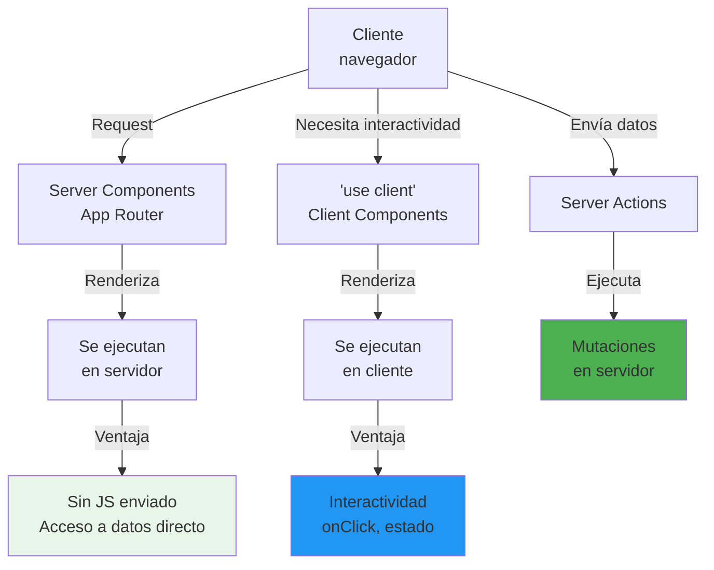

# Módulo 14: React Master: servidor, Next.js, a11y e i18n


## Aprende construyendo

### Tema 1: Server Components y streaming

#### Paso 1 · Objetivo y preparación
Al finalizar vas a construir `app/envios/page.tsx` como Server Component que hace streaming de una sección lenta con `Suspense`, en vez de bloquear toda la página hasta que todo esté listo. **Prerrequisitos:** Node.js LTS, npm y un proyecto Next.js con App Router; confirma `npx next --version`.

#### Paso 2 · Contexto y caso real
La página pública de seguimiento de un envío tarda ~2 segundos en mostrar CUALQUIER contenido porque el historial de eventos (una consulta lenta) se espera con `await` antes del `return`, bloqueando también a la lista de datos del envío que ya estaba lista en 50ms.

#### Paso 3 · Teoría, modelo mental y analogía
Un Server Component se ejecuta solo en el servidor y no agrega JavaScript propio al bundle del cliente; puede hacer `await` directo sobre datos sin un `useEffect`. Un límite `<Suspense>` permite que React envíe (haga streaming de) el HTML ya listo de inmediato, mientras lo que está dentro del límite llega después, sin que un `await` lento afuera del límite bloquee a lo que ya estaba listo. La analogía: una cocina que saca los platos que ya están listos en vez de retener todo el pedido hasta que el plato más lento también esté listo.

**Diagrama: Full-stack React con Next.js**


```mermaid
graph TD
    A["Cliente<br/>navegador"]
    B["Server Components<br/>App Router"]
    C["Se ejecutan<br/>en servidor"]
    D["Sin JS enviado<br/>Acceso a datos directo"]
    E["'use client'<br/>Client Components"]
    F["Se ejecutan<br/>en cliente"]
    G["Interactividad<br/>onClick, estado"]
    H["Server Actions"]
    I["Mutaciones<br/>en servidor"]

    A -->|Request| B
    B -->|Renderiza| C
    C -->|Ventaja| D
    A -->|Necesita interactividad| E
    E -->|Renderiza| F
    F -->|Ventaja| G
    A -->|Envía datos| H
    H -->|Ejecuta| I

    style D fill:#e8f5e9
    style G fill:#2196f3
    style I fill:#4caf50
```

#### Paso 4 · Demostración guiada
```tsx
// app/envios/page.tsx
import { Suspense } from 'react';
import { ListaEnvios } from './ListaEnvios';
import { HistorialEnvio } from './HistorialEnvio';

export default async function EnviosPage() {
  const envios = await obtenerEnvios(); // ~50ms

  return (
    <main>
      <ListaEnvios envios={envios} />
      <Suspense fallback={<p>Cargando historial…</p>}>
        <HistorialEnvio envioId={envios[0].id} />
      </Suspense>
    </main>
  );
}
```
```bash
npm run build && npm start
```
Resultado esperado: `ListaEnvios` aparece de inmediato; "Cargando historial…" se muestra brevemente y luego `HistorialEnvio` (la parte lenta) llega sin haber retrasado el resto de la página.

**Fallo deliberado:** quita el `<Suspense>` y hacé `const historial = await obtenerHistorial(envios[0].id);` directamente en `EnviosPage`, antes del `return`. Ahora la página entera (incluida `ListaEnvios`, que ya estaba lista en 50ms) espera los ~2 segundos de `obtenerHistorial`, porque un `await` fuera de un límite `Suspense` bloquea todo lo que esté en el mismo componente, sin excepción.

#### Paso 5 · Práctica guiada
Pista: medí el tiempo hasta el primer byte (`curl -w "%{time_starttransfer}\n" -o /dev/null -s http://localhost:3000/envios`) con y sin el `<Suspense>` — la diferencia numérica es la evidencia, no la percepción visual.

#### Paso 6 · Práctica independiente
Agregá una segunda sección lenta (por ejemplo `EstadisticasEnvio`) con su propio límite `<Suspense>` independiente, y confirmá que ambas secciones hacen streaming por separado: una puede terminar antes que la otra sin esperarse entre sí.

#### Paso 7 · Cierre y evidencia
Entrega la página con streaming del Paso 4, el bloqueo total reproducido en el Paso 5, y las dos secciones independientes del Paso 6; explica por qué el streaming ocurre por límite `Suspense`, no por página completa. Como siguiente paso, estudia Server Actions para las mutaciones de esos mismos datos. Errores comunes: hacer `await` de algo lento fuera de cualquier `Suspense`, anulando el streaming de todo lo demás; marcar un componente como `'use client'` sin necesitarlo, perdiendo el beneficio de no enviar su JavaScript. Fuentes oficiales: https://react.dev/reference/react/Suspense y https://nextjs.org/docs/app/building-your-application/routing/loading-ui-and-streaming.

**¿Por qué es importante?** Un `await` lento fuera de un límite `Suspense` bloquea todo lo demás en ese componente, aunque el resto de los datos ya estuviera listo — el streaming solo funciona dentro de los límites que vos definís explícitamente.

**Evidencia de aprendizaje:** entrega la página con streaming funcionando, el bloqueo total reproducido al quitar `Suspense`, y las dos secciones independientes del Paso 6.

**Conceptos clave:** Server Component, `Suspense`, streaming por límite, `await` bloqueante.

### Tema 2: Server Actions y seguridad

#### Paso 1 · Objetivo y preparación
Al finalizar vas a construir una Server Action `marcarEntregado` que valida su entrada con `zod` y verifica en el servidor que el operador tiene permiso sobre ESE envío, y vas a reproducir el fallo de confiar en el id que envía el cliente sin revalidar el permiso. **Prerrequisitos:** Tema 1 de este módulo.

#### Paso 2 · Contexto y caso real
Un operador puede marcar como entregado un envío que NO le corresponde, simplemente editando el campo oculto `envioId` del formulario en las DevTools antes de enviarlo — la acción solo confiaba en el id recibido, sin volver a comprobar en el servidor si ese operador tiene permiso sobre ese envío específico.

#### Paso 3 · Teoría, modelo mental y analogía
Una Server Action marcada `'use server'` queda expuesta como un endpoint invocable: cualquier cliente puede llamarla con CUALQUIER valor, sin importar qué muestre la interfaz. El servidor es el único lugar donde la autorización es confiable; validar la forma de los datos con `zod` no reemplaza verificar que ese usuario puede actuar sobre ese recurso específico. La analogía: una ventanilla alcanzable por cualquiera que sepa el número — el empleado igual debe comprobar que el documento de identidad corresponde a la cuenta, nunca confiar en lo que la persona afirma.

#### Paso 4 · Demostración guiada
```tsx
// app/actions.ts
'use server';
import { z } from 'zod';
import { auth } from '@/lib/auth';
import { db } from '@/lib/db';

const schema = z.object({ envioId: z.string().regex(/^RF-\d+$/) });

export async function marcarEntregado(formData: FormData) {
  const session = await auth();
  const { envioId } = schema.parse({ envioId: formData.get('envioId') });

  const envio = await db.envio.findUniqueOrThrow({ where: { id: envioId } });
  if (envio.operadorId !== session.userId) {
    throw new Error('No autorizado para modificar este envío');
  }

  await db.envio.update({ where: { id: envioId }, data: { estado: 'entregado' } });
}
```
Resultado esperado: marcar como entregado un envío propio funciona; `zod` rechaza un `envioId` con formato inválido antes de llegar a la base de datos.

**Fallo deliberado:** quita el bloque `if (envio.operadorId !== session.userId) { throw ... }`. Editá el campo oculto `envioId` en las DevTools del navegador para apuntar a un envío de otro operador y enviá el formulario: la acción lo acepta y lo marca como entregado, porque `zod` valida la FORMA del dato (`RF-\d+`), no si el usuario tiene permiso sobre ese id específico.

#### Paso 5 · Práctica guiada
Pista: `zod` que valida el formato de `envioId` pasa aunque el id pertenezca a otro operador — probá exactamente ese caso (un id ajeno con formato válido) para confirmar que el problema es de autorización, no de validación de esquema.

#### Paso 6 · Práctica independiente
Restaurá la comprobación de `operadorId`, y agregá una prueba con una sesión simulada que confirme que llamar a `marcarEntregado` con el id de un envío ajeno lanza el error, junto con una prueba de regresión que confirme que el camino legítimo (envío propio) sigue funcionando.

#### Paso 7 · Cierre y evidencia
Entrega la acción autorizada del Paso 4, el envío ajeno modificado sin autorización del Paso 5, y las dos pruebas del Paso 6; explica por qué validar la forma de los datos con `zod` no es lo mismo que autorizar la operación sobre un recurso específico. Como siguiente paso, estudia ISR y Middleware para proteger rutas completas, no solo acciones puntuales. Errores comunes: confiar en cualquier dato que llega del cliente (incluidos ids en campos ocultos) sin revalidar permisos en el servidor; registrar tokens de sesión completos en logs de error. Fuente oficial: https://nextjs.org/docs/app/building-your-application/data-fetching/server-actions-and-mutations#security.

**¿Por qué es importante?** Una Server Action es un endpoint invocable con cualquier valor, sin importar qué muestre la interfaz; validar el formato del dato no reemplaza comprobar que ese usuario puede actuar sobre ese recurso específico.

**Evidencia de aprendizaje:** entrega la acción autorizada, el envío ajeno modificado sin la comprobación, y las dos pruebas (autorización y regresión) agregadas.

**Conceptos clave:** `'use server'`, validación de esquema vs. autorización, confianza cero en datos del cliente.

### Tema 3: Next.js ISR, Metadata y Middleware

#### Paso 1 · Objetivo y preparación
Al finalizar vas a escribir `middleware.ts` para proteger `/panel` antes de que cualquier contenido llegue al navegador, y vas a configurar `revalidate` e `generateMetadata` en `/envios/[id]`, reproduciendo el fallo de un `matcher` mal escrito que deja la ruta sin protección. **Prerrequisitos:** Tema 2 de este módulo.

#### Paso 2 · Contexto y caso real
El panel interno de operadores (`/panel`) solo tenía un redirect del lado del cliente: la pantalla protegida se alcanzaba a mostrar brevemente antes de redirigir, visible para cualquiera lo suficientemente rápido o con JavaScript deshabilitado. A la vez, la página pública de seguimiento `/envios/[id]` se regeneraba en cada request sin ningún caché, golpeando la base de datos para una página que cambia pocas veces por día.

#### Paso 3 · Teoría, modelo mental y analogía
El middleware corre antes de que la ruta se resuelva, puede inspeccionar cookies y redirigir sin que ningún contenido protegido llegue a enviarse — a diferencia de un redirect del lado del cliente, que primero renderiza y después redirige. `revalidate` permite servir una página desde caché y regenerarla en segundo plano como máximo cada N segundos, en vez de ser completamente estática o completamente dinámica. La analogía: el middleware es un control en la entrada del edificio, no un guardia que te pide salir después de que ya entraste.

#### Paso 4 · Demostración guiada
```ts
// middleware.ts
import { NextResponse } from 'next/server';
import type { NextRequest } from 'next/server';

export function middleware(request: NextRequest) {
  const session = request.cookies.get('session');
  if (request.nextUrl.pathname.startsWith('/panel') && !session) {
    return NextResponse.redirect(new URL('/login', request.url));
  }
}

export const config = { matcher: '/panel/:path*' };
```
```tsx
// app/envios/[id]/page.tsx
export const revalidate = 60;

export async function generateMetadata({ params }: { params: { id: string } }) {
  const envio = await obtenerEnvio(params.id);
  return { title: `Envío ${envio.id} — RutaFlow` };
}
```
Resultado esperado: visitar `/panel` sin cookie `session` redirige a `/login` antes de que llegue contenido del panel; `/envios/RF-4471` se sirve desde caché y se regenera como máximo cada 60 segundos.

**Fallo deliberado:** cambiá el `matcher` a `'/pane/:path*'` (falta la "l" de "panel"). El middleware deja de proteger `/panel` por completo — cualquiera accede sin redirección, sin ningún error en consola, porque el `matcher` simplemente no coincide con ninguna ruta real y el middleware nunca se ejecuta para `/panel`.

#### Paso 5 · Práctica guiada
Pista: el middleware no lanza ningún error cuando su `matcher` no coincide con nada — tenés que visitar `/panel` activamente sin sesión y confirmar que SÍ redirige, nunca asumirlo por la ausencia de errores en la consola.

#### Paso 6 · Práctica independiente
Corregí el `matcher`, y agregá una prueba que confirme la cabecera `x-nextjs-cache` (`HIT` o `STALE`) en una segunda visita a `/envios/[id]` dentro de la ventana de 60 segundos, confirmando que el ISR configurado en el Paso 4 realmente está sirviendo desde caché.

#### Paso 7 · Cierre y evidencia
Entrega el middleware y el ISR funcionando del Paso 4, la ruta desprotegida por el typo del Paso 5, y la verificación de caché del Paso 6; explica por qué un `matcher` que no coincide con nada falla en silencio, sin ningún error que lo señale. Como siguiente paso, estudia la optimización de imágenes y fuentes de la misma página de seguimiento. Errores comunes: cachear con `revalidate` una página que muestra datos privados por usuario; un `matcher` de middleware con un typo que deja rutas completas sin protección. Fuente oficial: https://nextjs.org/docs/app/building-your-application/routing/middleware.

**¿Por qué es importante?** Un middleware con un `matcher` mal escrito falla en silencio, dejando rutas completas sin protección sin ningún error visible — la única forma de detectarlo es probar activamente la ruta, no confiar en la ausencia de errores.

**Evidencia de aprendizaje:** entrega el middleware y el ISR funcionando, la ruta desprotegida por el typo reproducida, y la verificación de la cabecera de caché.

**Conceptos clave:** middleware vs. redirect de cliente, `matcher`, `revalidate`, `generateMetadata`.

### Tema 4: Optimización de imágenes y fuentes

#### Paso 1 · Objetivo y preparación
Al finalizar vas a construir `app/components/Photo.tsx` con `next/image` y dimensiones explícitas para la foto de evidencia de entrega, y vas a cargar una fuente con `next/font` en vez de un `<link>` bloqueante, midiendo el CLS antes y después. **Prerrequisitos:** Tema 3 de este módulo.

#### Paso 2 · Contexto y caso real
La foto de evidencia de entrega en la página de detalle de un envío no tenía dimensiones explícitas: toda la página saltaba visiblemente hacia abajo apenas la imagen terminaba de descargar, un CLS (Cumulative Layout Shift) alto y medible, no solo una percepción de que "se ve mal".

#### Paso 3 · Teoría, modelo mental y analogía
`next/image` exige `width`/`height` (o `fill`) de antemano para que el navegador reserve exactamente ese espacio antes de que la imagen descargue, eliminando el salto de layout; `next/font` descarga y autohospeda la fuente en tiempo de build, en vez de depender de una petición externa que bloquea el pintado del texto. La analogía: pintar las líneas de un lugar de estacionamiento antes de que el auto llegue, en vez de dejar que la llegada del auto decida el espacio.

#### Paso 4 · Demostración guiada
```tsx
// app/components/Photo.tsx
import Image from 'next/image';

export function Photo({ src, alt }: { src: string; alt: string }) {
  return <Image src={src} alt={alt} width={400} height={300} />;
}
```
```ts
// app/layout.tsx
import { Inter } from 'next/font/google';
const inter = Inter({ subsets: ['latin'] });
```
Resultado esperado: Lighthouse reporta un CLS cercano a 0 para la foto, y el texto se pinta sin esperar la descarga de la fuente externa.

**Fallo deliberado:** reemplazá `<Image src={src} alt={alt} width={400} height={300} />` por un `` plano, sin dimensiones. El navegador ya no reserva espacio hasta que la imagen descarga, y el contenido debajo salta visiblemente — medible como un CLS alto en Lighthouse, no una impresión subjetiva.

#### Paso 5 · Práctica guiada
Pista: corré Lighthouse (o el panel "Performance" de DevTools) antes y después del cambio y compará el valor numérico de CLS — el salto visual es la pista, el número es la evidencia.

#### Paso 6 · Práctica independiente
Restaurá `next/image`, y además compará: quitá temporalmente `next/font` en favor de un `<link>` externo a Google Fonts y medí la diferencia en First Contentful Paint entre ambas estrategias.

#### Paso 7 · Cierre y evidencia
Entrega la foto sin salto de layout del Paso 4, el CLS alto reproducido con `` plano del Paso 5, y la comparación de FCP entre `next/font` y un `<link>` externo del Paso 6; explica por qué reservar espacio de antemano es lo que elimina el salto, no el formato del archivo de imagen. Como siguiente paso, estudia accesibilidad con React Aria para esa misma página. Errores comunes: usar `` plano sin `width`/`height` donde `next/image` ya está disponible; cargar una fuente externa bloqueante cuando `next/font` puede autohospedarla. Fuente oficial: https://nextjs.org/docs/app/building-your-application/optimizing/images y https://nextjs.org/docs/app/building-your-application/optimizing/fonts.

**¿Por qué es importante?** Reservar el espacio de una imagen antes de que descargue es lo que elimina el salto de layout — el formato o la compresión de la imagen no resuelven ese problema por sí solos.

**Evidencia de aprendizaje:** entrega la foto sin salto de layout, el CLS alto reproducido con `` plano, y la comparación de FCP entre las dos estrategias de fuente.

**Conceptos clave:** `next/image`, CLS, `next/font`, reserva de espacio.

### Tema 5: Accesibilidad y React Aria

#### Paso 1 · Objetivo y preparación
Al finalizar vas a construir `app/components/Dialog.tsx` con `useDialog` de React Aria para confirmar "marcar como entregado", y vas a reproducir el fallo de un diálogo construido como un `<div>` plano que es invisible para un lector de pantalla. **Prerrequisitos:** Tema 4 de este módulo.

#### Paso 2 · Contexto y caso real
Un diálogo de confirmación construido como un `<div>` con estilos propios se veía perfecto visualmente, pero un lector de pantalla no anunciaba nada al abrirlo, y la tecla Tab podía mover el foco a elementos detrás del diálogo mientras seguía abierto.

#### Paso 3 · Teoría, modelo mental y analogía
Un `<div>` no tiene ninguna semántica ARIA implícita: un lector de pantalla no tiene forma de saber que es un diálogo, cuál es su nombre accesible, ni que el foco debería quedar atrapado dentro. Los hooks de React Aria (`useDialog`, `useModal`, `useOverlay`) conectan el `role="dialog"`, el `aria-modal` y el atrapado/restauración de foco correctos, comportamiento que es fácil de implementar mal a mano. La analogía: una puerta sin cartel ni manija — puede funcionar, pero nadie que no la vea sabe que está ahí o cómo usarla.

#### Paso 4 · Demostración guiada
```tsx
// app/components/Dialog.tsx
import { useDialog } from 'react-aria';
import { useRef } from 'react';

export function ConfirmarEntregaDialog({ onConfirm, onClose }: Props) {
  const ref = useRef<HTMLDivElement>(null);
  const { dialogProps, titleProps } = useDialog({}, ref);

  return (
    <div {...dialogProps} ref={ref}>
      <h2 {...titleProps}>Confirmar entrega</h2>
      <button onClick={onConfirm}>Confirmar</button>
      <button onClick={onClose}>Cancelar</button>
    </div>
  );
}
```
Resultado esperado: un lector de pantalla anuncia "Confirmar entrega, diálogo" al abrirlo, y el árbol de accesibilidad de DevTools muestra `role="dialog"` con ese nombre.

**Fallo deliberado:** quitá `{...dialogProps}` y `{...titleProps}` del JSX, dejando el `div` y el `h2` planos. El diálogo se ve idéntico, pero la pestaña "Accessibility" de Chrome DevTools ya no muestra ningún `role="dialog"` ni nombre accesible para ese nodo — confirmable sin tocar un lector de pantalla real.

#### Paso 5 · Práctica guiada
Pista: usá la pestaña "Accessibility" de Chrome DevTools para inspeccionar el nodo del diálogo antes y después de quitar los props — el rol y el nombre accesible desaparecen del árbol, no solo de la apariencia visual.

#### Paso 6 · Práctica independiente
Restaurá los props de `useDialog`, agregá `useModal`/`FocusScope` para confirmar que Tab no puede escapar del diálogo mientras está abierto, y agregá una prueba automática con `jest-axe` que falle si el `role="dialog"` o el nombre accesible faltan.

#### Paso 7 · Cierre y evidencia
Entrega el diálogo accesible del Paso 4, la pérdida de semántica confirmada en el árbol de accesibilidad del Paso 5, y el atrapado de foco más la prueba con `jest-axe` del Paso 6; explica por qué un componente puede verse idéntico y a la vez ser invisible para un lector de pantalla. Como siguiente paso, estudia i18n para que los textos de ese mismo diálogo sean traducibles. Errores comunes: confiar en que "se ve bien" es lo mismo que "es accesible"; reinventar el atrapado de foco a mano en vez de usar `useModal`/`FocusScope`. Fuente oficial: https://react-spectrum.adobe.com/react-aria/useDialog.html.

**¿Por qué es importante?** Un componente puede verse visualmente idéntico y a la vez ser invisible para un lector de pantalla — la única forma de confirmarlo es inspeccionar el árbol de accesibilidad, no la apariencia.

**Evidencia de aprendizaje:** entrega el diálogo accesible, la pérdida de semántica confirmada en el árbol de accesibilidad, y el atrapado de foco con la prueba de `jest-axe`.

**Conceptos clave:** `useDialog`, árbol de accesibilidad, atrapado de foco, `jest-axe`.

### Tema 6: i18n, pluralización y RTL

#### Paso 1 · Objetivo y preparación
Al finalizar vas a configurar `next-intl` para `/[locale]/envios/[id]` con un mensaje pluralizado correctamente ("1 envío" vs. "3 envíos") y `dir="rtl"` para un locale árabe, y vas a reproducir el fallo de una clave de traducción faltante en un idioma. **Prerrequisitos:** Tema 5 de este módulo.

#### Paso 2 · Contexto y caso real
Agregar un locale "ar" para la expansión de RutaFlow a Medio Oriente expuso dos problemas a la vez: la regla de plural de "N envíos" no tiene la misma forma en árabe que en español (el árabe tiene seis categorías de plural, no dos), y el layout no invertía su dirección, dejando íconos y texto visualmente al revés.

#### Paso 3 · Teoría, modelo mental y analogía
Las reglas de pluralización son categorías CLDR específicas de cada idioma (`zero`/`one`/`two`/`few`/`many`/`other`), no una simple singular-o-plural; una librería con ICU MessageFormat elige la categoría correcta en vez de un `count === 1 ? ... : ...` escrito a mano. El atributo `dir` en `<html>` controla la dirección de lectura de toda la página y debe fijarse por locale en la raíz, no quedar fijo en "ltr". La analogía: una carta modelo con un espacio en blanco para una cantidad tiene que usar la forma gramatical correcta para ese número en ese idioma — "1 día" frente a "2 días" frente a, en árabe, hasta seis formas distintas según la cantidad.

#### Paso 4 · Demostración guiada
```json
// messages/es.json
{ "envios": "{count, plural, one {# envío} other {# envíos}}" }
```
```json
// messages/ar.json
{ "envios": "{count, plural, zero {بدون شحنات} one {شحنة واحدة} two {شحنتان} few {# شحنات} many {# شحنة} other {# شحنة}}" }
```
```tsx
// app/[locale]/layout.tsx
export default function LocaleLayout({ children, params: { locale } }: Props) {
  const dir = locale === 'ar' ? 'rtl' : 'ltr';
  return (
    <html lang={locale} dir={dir}>
      <body>{children}</body>
    </html>
  );
}
```
Resultado esperado: con el locale "ar", el documento tiene `dir="rtl"` y el conteo de envíos usa la categoría plural árabe correcta según la cantidad, no la regla binaria de español.

**Fallo deliberado:** agregá la clave `envios` solo a `messages/es.json`, sin tocar `messages/ar.json`. Al visitar `/ar/envios`, `next-intl` no encuentra la clave para ese locale: la build falla (o la ruta lanza un error en runtime, según la configuración de `onError`), nunca muestra silenciosamente el texto en español como reemplazo.

#### Paso 5 · Práctica guiada
Pista: corré la build (o visitá `/ar/envios` en desarrollo) inmediatamente después de agregar la clave a un solo archivo de idioma — el error aparece ahí, antes de que alguien reporte un texto roto en producción.

#### Paso 6 · Práctica independiente
Agregá la clave `envios` a `messages/ar.json` con las categorías de plural correctas, y agregá una prueba que recorra todas las claves de `messages/es.json` confirmando que cada una tiene su equivalente en `messages/ar.json`, para detectar claves faltantes en CI en vez de en producción.

#### Paso 7 · Cierre y evidencia
Entrega la pluralización y el `dir="rtl"` funcionando del Paso 4, la build rota por la clave faltante del Paso 5, y la prueba de paridad de claves del Paso 6; explica por qué una clave de traducción faltante debe ser un error detectable, nunca un texto de respaldo silencioso. Con esto cerrás el track completo de React, listo para operar en producción real. Errores comunes: tratar la pluralización como un simple singular/plural binario cuando el idioma destino tiene más categorías; fijar `dir="ltr"` de forma fija en vez de derivarlo del locale activo. Fuente oficial: https://next-intl.dev/docs/usage/messages#plurals.

**¿Por qué es importante?** Una clave de traducción faltante en un idioma debe producir un error detectable en build o en CI, nunca un texto de respaldo silencioso que solo se descubre al llegar a producción.

**Evidencia de aprendizaje:** entrega la pluralización y el `dir="rtl"` funcionando, la build rota por la clave faltante reproducida, y la prueba de paridad de claves entre idiomas.

**Conceptos clave:** categorías CLDR de plural, `dir` por locale, paridad de claves entre idiomas.

---

## Trazabilidad de la auditoría original

- **Server Components Avanzado**: cubierto en los Temas 1 (streaming con Suspense) y 2 (Server Actions y seguridad) de este módulo.
- **Next.js Avanzado**: cubierto en los Temas 3 (ISR, Metadata y Middleware) y 4 (optimización de imágenes y fuentes) de este módulo.
- **Accessibility (a11y)**: cubierto en el Tema 5 (React Aria) de este módulo.
- **Internationalization (i18n)**: cubierto en el Tema 6 (i18n, pluralización y RTL) de este módulo.
