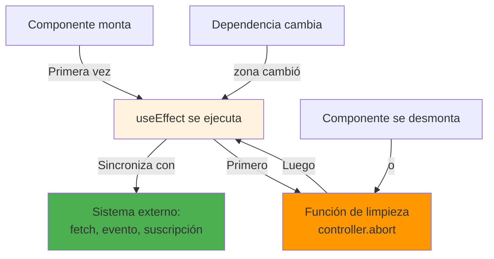
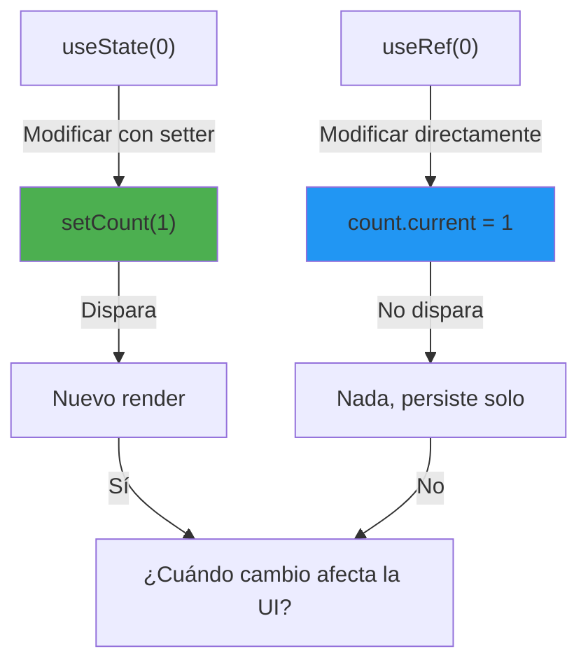
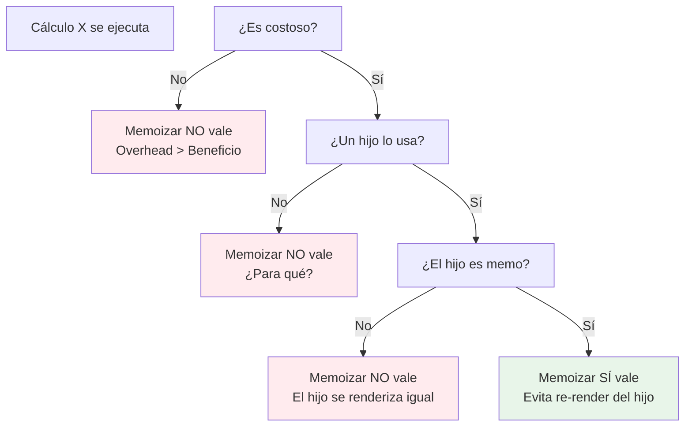
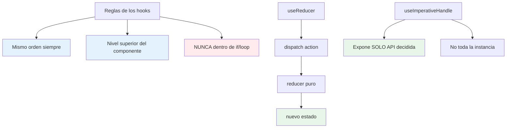

# Módulo 2: Hooks esenciales


## Aprende construyendo

### Tema 1: useEffect — dependencias y limpieza

#### Paso 1 · Objetivo y preparación
Al finalizar vas a hacer que `PanelEnvios` consulte la API de RutaFlow dentro de un `useEffect`, cancelando la petición con `AbortController` cuando el componente se desmonte o cambie el filtro. Prerrequisitos: Módulo 1 completo.

#### Paso 2 · Contexto y caso real
Si el operador cambia de pantalla antes de que la respuesta de envíos llegue, una petición sin cancelar puede intentar actualizar el estado de un componente que ya no existe, o mezclar su respuesta con la de una pantalla distinta.

#### Paso 3 · Teoría, modelo mental y analogía
`useEffect` sincroniza con sistemas externos; su función de limpieza cancela lo que el efecto empezó antes de volver a ejecutarse o de que el componente se desmonte — una suscripción que se abre, se usa y se cancela con el mismo identificador.

**Diagrama: useEffect y su ciclo de vida**



#### Paso 4 · Demostración guiada desde cero
```jsx
useEffect(() => {
  const controller = new AbortController();
  fetch(`/api/envios?zona=${zona}`, { signal: controller.signal })
    .then(res => res.json())
    .then(setEnvios);
  return () => controller.abort();
}, [zona]);
```
Resultado esperado: cambiar `zona` cancela la petición anterior (todavía en vuelo) antes de disparar la nueva, y desmontar `PanelEnvios` cancela cualquier petición pendiente — nunca llega una respuesta vieja a actualizar `envios` después de que la zona o el componente ya cambiaron.

#### Paso 5 · Práctica guiada
Pista: quitá el `return () => controller.abort()` del efecto — ese es el fallo deliberado: cambiá `zona` rápidamente dos veces seguidas y, si la primera respuesta llega después de la segunda, `envios` termina mostrando los envíos de la zona vieja, sobrescribiendo silenciosamente los de la zona actual.

#### Paso 6 · Práctica independiente
Corregí el Paso 5 restaurando la cancelación, y agregá un segundo `useEffect` separado que sincronice el título del documento (`document.title`) con la cantidad de envíos pendientes, confirmando que cada efecto tiene su propio array de dependencias independiente.

#### Paso 7 · Cierre y evidencia
Entregá el efecto con cancelación del Paso 4, la respuesta obsoleta provocada en el Paso 5, y el segundo efecto del Paso 6; explicá por qué un efecto que hace fetch sin cancelar puede mostrar datos de una petición vieja, aunque esa petición ya no le interese a nadie. Siguiente paso: estudia `useRef` para valores que no disparen un render. Errores comunes: un array de dependencias incompleto que omite `zona`, usar un efecto para calcular un dato derivado que podría calcularse directamente en el render, y olvidar la función de limpieza en cualquier efecto que se suscribe a algo. Fuentes oficiales: https://react.dev/reference/react/useEffect y https://react.dev/learn/synchronizing-with-effects.
**¿Por qué es importante?** Porque los efectos son la frontera donde React toca red, DOM y recursos externos; sin limpieza, una respuesta obsoleta puede sobrescribir silenciosamente el estado actual.
**Evidencia de aprendizaje:** entrega efecto con cancelación, respuesta obsoleta provocada y segundo efecto agregado.
**Conceptos clave:** sincronización con sistemas externos, array de dependencias, función de limpieza.

`useEffect` es el mecanismo de React para sincronizar un componente con un sistema externo al propio modelo de React: suscribirse a un evento del navegador (`window.addEventListener('resize', handler)`), establecer una conexión (un WebSocket, un temporizador), o cualquier operación que necesite ejecutarse como reacción a que el componente se montó o a que cierto valor cambió, en vez de como parte directa del cálculo de qué renderizar (que pertenece al cuerpo de la función componente en sí, no a un efecto).

El array de dependencias, segundo argumento de `useEffect`, controla exactamente cuándo el efecto se vuelve a ejecutar: sin ningún array (`useEffect(() => {...})`), el efecto se ejecuta después de cada render, sin excepción; con un array vacío (`useEffect(() => {...}, [])`), se ejecuta una única vez, inmediatamente después del primer montaje del componente; con un array que contiene valores específicos (`useEffect(() => {...}, [valor])`), se ejecuta después del montaje inicial y de nuevo cada vez que cualquiera de esos valores listados cambia entre un render y el siguiente, comparando cada valor mediante igualdad referencial (`Object.is`).

La función que un efecto puede devolver opcionalmente es su función de limpieza, ejecutada por React inmediatamente antes de que el efecto se vuelva a ejecutar (si sus dependencias cambiaron) y también cuando el componente se desmonta definitivamente (`return () => window.removeEventListener('resize', handler)`), garantizando que cualquier suscripción, temporizador o conexión establecida por el efecto se libere correctamente antes de establecer una nueva, o antes de que el componente deje de existir, evitando fugas de memoria del mismo tipo conceptual estudiadas para suscripciones de RxJS en el Módulo 6 del track de Angular, aunque aquí aplicado al modelo de efectos de React en vez de a Observables.

**Analogía:** un efecto sin limpieza es como suscribirse a una lista de correo sin nunca darse de baja, incluso después de mudarse de dirección; la función de limpieza es el mecanismo explícito de darse de baja correctamente antes de suscribirse a una nueva lista o de abandonar definitivamente esa dirección.

**¿Por qué es importante?** El array de dependencias controla con precisión cuándo un efecto se re-ejecuta; la función de limpieza evita fugas de recursos externos (suscripciones, temporizadores, conexiones) que sobrevivirían innecesariamente al componente o a un cambio de dependencias.

**Código del ejemplo:**

```jsx
useEffect(() => {
  const handler = () => console.log(window.innerWidth);
  window.addEventListener('resize', handler);
  return () => window.removeEventListener('resize', handler); // limpieza al desmontar
}, []); // array vacío: solo se ejecuta al montar
```

* Ejecutar: `npm test`
* Proyecto: proyecto integrador RutaFlow

### Tema 2: useRef — valores mutables sin re-render

#### Paso 1 · Objetivo y preparación
Al finalizar vas a contar, con `useRef`, cuántas veces se renderizó `PanelEnvios` sin que ese contador dispare ningún render adicional por sí mismo. Prerrequisitos: Tema 1 de este módulo.

#### Paso 2 · Contexto y caso real
Querés depurar cuántas veces se re-renderiza `PanelEnvios` mientras el operador escribe en el filtro de zona, pero contar eso con `useState` agregaría un render extra por cada medición, contaminando la medición misma.

#### Paso 3 · Teoría, modelo mental y analogía
`useRef` crea un objeto mutable que persiste entre renders sin disparar ninguno nuevo al modificar `.current` — una libreta personal que el componente puede modificar sin anunciarlo públicamente.

**Diagrama: useState vs useRef**



#### Paso 4 · Demostración guiada desde cero
```jsx
function PanelEnvios() {
  const renderCount = useRef(0);
  renderCount.current++;
  console.log(`PanelEnvios se renderizó ${renderCount.current} veces`);
  // ...
}
```
Resultado esperado: cada letra que el operador escribe en el filtro de zona incrementa `renderCount.current` y lo imprime, pero ese incremento por sí mismo nunca provoca un render adicional — el contador solo avanza como consecuencia de renders que ya ocurrían por otra razón (el cambio de `zona`).

#### Paso 5 · Práctica guiada
Pista: cambiá `useRef(0)` por `useState(0)` y `renderCount.current++` por `setRenderCount(c => c + 1)` directamente en el cuerpo del componente, sin ningún `useEffect` — ese es el fallo deliberado: llamar al setter dentro del cuerpo del componente dispara un nuevo render, que vuelve a ejecutar esa misma línea, que vuelve a llamar al setter: un loop infinito que cuelga la pestaña del navegador.

#### Paso 6 · Práctica independiente
Corregí el Paso 5 devolviendo `useRef`, y agregá una segunda referencia que guarde la última `zona` consultada, comparándola contra la `zona` actual dentro de un efecto para loguear solo cuándo realmente cambió, no en cada render.

#### Paso 7 · Cierre y evidencia
Entregá el contador con `useRef` del Paso 4, el loop infinito provocado en el Paso 5, y la comparación de zona anterior del Paso 6; explicá por qué `useState` dentro del cuerpo del componente (sin pasar por un evento o efecto) es peligroso para un contador de renders, mientras que `useRef` no lo es. Siguiente paso: estudia cuándo `useMemo`/`useCallback` valen la pena. Errores comunes: llamar a un setter de `useState` directamente en el cuerpo del componente fuera de un evento o efecto, usar `useRef` para datos que sí deberían reflejarse visualmente, y leer `.current` esperando que esté sincronizado inmediatamente con el render visual actual. Fuentes oficiales: https://react.dev/reference/react/useRef y https://react.dev/learn/referencing-values-with-refs.
**¿Por qué es importante?** `useRef` permite mantener valores mutables persistentes entre renders sin el costo ni la semántica de disparar un nuevo render cada vez que cambian.
**Evidencia de aprendizaje:** entrega contador con useRef, loop infinito detectado y comparación de zona anterior.
**Conceptos clave:** persistencia entre renders sin disparar actualización, acceso a nodos del DOM.

`useRef` crea un objeto mutable (`{ current: valorInicial }`) que persiste con la misma identidad a través de renders sucesivos del componente, con una diferencia crucial respecto a `useState`: modificar `.current` (`renderCount.current++`) no dispara un nuevo render del componente, a diferencia de llamar a un setter de `useState`, que sí lo hace siempre. Esto hace a `useRef` apropiado específicamente para valores que el componente necesita recordar entre renders pero que no deben influir en lo que se renderiza visualmente (un contador interno de cuántas veces se renderizó el componente con fines de depuración, el valor anterior de una prop para compararlo con el actual, o un identificador de un temporizador activo que debe poder cancelarse después).

Otro uso extremadamente común de `useRef` es obtener una referencia directa a un nodo del DOM real renderizado por el componente (`<input ref={inputRef} />`, permitiendo después llamar `inputRef.current.focus()` imperativamente), un escape hatch deliberado hacia manipulación imperativa del DOM para casos donde el modelo declarativo de React no ofrece una forma directa de expresar la operación deseada (poner foco en un campo, medir sus dimensiones reales, iniciar una animación imperativa con una librería externa).

**Analogía:** `useRef` es como una libreta personal que el componente puede modificar libremente sin tener que anunciar públicamente cada cambio (sin disparar un re-render); `useState`, en cambio, es como un anuncio público formal que notifica a todos los interesados (incluyendo al propio proceso de renderizado) cada vez que cambia.

**¿Por qué es importante?** `useRef` permite mantener valores mutables persistentes entre renders (o acceder directamente a nodos del DOM) sin el costo ni la semántica de disparar un nuevo render cada vez que cambian.

**Código del ejemplo:**

```jsx
const renderCount = useRef(0);
renderCount.current++; // no causa re-render, a diferencia de useState
```

* Ejecutar: `npm test`
* Código: `examples/rutaflow/react/use-shipment-tracking.tsx`
* Proyecto: proyecto integrador RutaFlow

### Tema 3: useMemo y useCallback con criterio

#### Paso 1 · Objetivo y preparación
Al finalizar vas a medir (antes de "optimizar a ciegas") si ordenar la lista de envíos por fecha estimada es realmente costoso, y a decidir si `useMemo` vale la pena para ese cálculo. Prerrequisitos: Tema 2 de este módulo.

#### Paso 2 · Contexto y caso real
Alguien en el equipo propuso envolver TODOS los cálculos de `PanelEnvios` en `useMemo` "por si acaso son lentos", sin medir ninguno todavía.

#### Paso 3 · Teoría, modelo mental y analogía
`useMemo`/`useCallback` solo valen la pena cuando el cálculo es realmente costoso o cuando previenen un re-render mensurable de un hijo memoizado — guardar en el refrigerador solo la comida que realmente sobra, no cada resto trivial.

**Diagrama: Optimización con useMemo/useCallback**



#### Paso 4 · Demostración guiada desde cero
```jsx
console.time('ordenar');
const ordenados = [...envios].sort((a, b) => a.fechaEstimada - b.fechaEstimada);
console.timeEnd('ordenar');
```
Resultado esperado: con una lista realista de RutaFlow (decenas de envíos, no miles), `console.timeEnd` reporta una fracción de milisegundo — un costo insignificante que no justifica envolver ese `sort` en `useMemo`, dado que el propio overhead de comparar dependencias en cada render sería comparable o mayor al costo del cálculo real.

**Demo con React DevTools Profiler + console.time:**
1. Crea un componente `ListaOrdenada` que ordene 100 envíos cada render (sin useMemo)
2. Abre DevTools → Profiler tab → grabar
3. Cambia otro estado no relacionado (p. ej., el tema claro/oscuro)
4. Mira la consola: `console.timeEnd` reporta 0.5-1ms (trivial)
5. Ahora envuelve el sort en `useMemo`
6. Repite: grabar cambio de tema
7. Mira la consola: el tiempo es idéntico o muy similar (porque el cálculo es insignificante)
8. En el Profiler: ambas versiones tienen rendimiento casi idéntico
9. Resultado esperado: entender que sin un cálculo realmente costoso (p. ej., 100,000 items), memoizar no tiene impacto visible, pero SÍ agrega complejidad al código.

#### Paso 5 · Práctica guiada
Pista: envolvé ese `sort` trivial en `useMemo` igual, "para estar seguros", y medí el tiempo total de un render completo antes y después — ese es el fallo deliberado: el tiempo total no mejora de forma perceptible, pero el código ahora es más difícil de leer, con una dependencia adicional (`[envios]`) que hay que mantener sincronizada correctamente.

#### Paso 6 · Práctica independiente
Corregí el Paso 5 quitando el `useMemo` innecesario sobre el `sort`, y en su lugar medí con el Profiler de React (Módulo 9) si memoizar el callback `onSeleccionarEnvio` pasado a una lista larga de `EnvioCard` envueltos en `React.memo` sí previene re-renders mensurables — un caso donde memoizar sí puede justificarse.

#### Paso 7 · Cierre y evidencia
Entregá la medición del Paso 4, el `useMemo` innecesario descartado en el Paso 5, y la medición con el Profiler del Paso 6; explicá la diferencia entre memoizar "por si acaso" y memoizar con evidencia concreta de que el problema de rendimiento existe. Siguiente paso: estudia las reglas de los hooks y `useReducer`. Errores comunes: envolver cálculos triviales en `useMemo` sin medir, memoizar una función sin que ningún hijo memoizado la use, y confundir "se ve más rápido" con una medición real del Profiler. Fuentes oficiales: https://react.dev/reference/react/useMemo y https://react.dev/reference/react/useCallback.
**¿Por qué es importante?** `useMemo`/`useCallback` solo aportan beneficio real cuando el cálculo es genuinamente costoso o cuando previenen un re-render mensurable de un hijo memoizado; usarlos sin esa justificación agrega complejidad sin beneficio.
**Evidencia de aprendizaje:** entrega medición del cálculo trivial, useMemo innecesario descartado y medición del Profiler.
**Conceptos clave:** memoización de valores frente a memoización de funciones, costo real frente a beneficio real.

`useMemo(() => calculoCostoso(datos), [datos])` memoiza el resultado (el valor) de un cálculo, recalculándolo únicamente cuando alguna de las dependencias listadas cambia, en vez de recalcularlo en cada render del componente sin importar si sus entradas relevantes efectivamente cambiaron; `useCallback(() => hacer(id), [id])` es conceptualmente equivalente pero memoiza específicamente una función (una referencia estable a esa función) en vez de un valor arbitrario, siendo `useCallback(fn, deps)` sintácticamente equivalente a `useMemo(() => fn, deps)`.

Ambos hooks solo valen genuinamente la pena en dos escenarios concretos: cuando el cálculo memoizado es realista y mensurablemente costoso en tiempo de ejecución (no una suma trivial de dos números, donde recalcular es más barato que el propio overhead de comparar dependencias), o cuando memoizar una función previene el re-render innecesario de un componente hijo envuelto en `React.memo` (Módulo 9) que de otro modo recibiría una nueva referencia de función distinta en cada render del padre (dado que una función definida dentro del cuerpo del componente se recrea en cada ejecución, con una nueva identidad referencial cada vez, incluso si su lógica interna es idéntica), rompiendo la comparación superficial de props que `React.memo` realiza para decidir si evitar un re-render.

Usar `useMemo`/`useCallback` indiscriminadamente en todo el código, sin evidencia real de que resuelven un problema mensurable de rendimiento (idealmente confirmado con el Profiler, Módulo 9), agrega complejidad de lectura del código y un pequeño overhead de comparación de dependencias en cada render, sin ningún beneficio real a cambio — un antipatrón de optimización prematura que conviene evitar hasta tener evidencia concreta de que el problema que se busca resolver efectivamente existe.

**Analogía:** `useMemo`/`useCallback` son como guardar en el refrigerador solo la comida que realmente sobra y vale la pena conservar, en vez de intentar guardar cada pequeño resto de comida, gastando más esfuerzo en organizar el refrigerador que el que se ahorraría no volviendo a cocinar esos restos triviales.

**¿Por qué es importante?** `useMemo`/`useCallback` solo aportan beneficio real cuando el cálculo es genuinamente costoso o cuando previenen un re-render mensurable de un hijo memoizado; usarlos sin esa justificación agrega complejidad sin beneficio.

**Código del ejemplo:**

```jsx
const resultado = useMemo(() => calculoCostoso(datos), [datos]); // memoiza un VALOR
const manejarClick = useCallback(() => hacer(id), [id]);          // memoiza una FUNCIÓN
```

* Ejecutar: `npm test`
* Código: `examples/rutaflow/react/use-shipment-tracking.tsx`
* Proyecto: proyecto integrador RutaFlow

### Tema 4: Reglas de los hooks, useReducer y useImperativeHandle

#### Paso 1 · Objetivo y preparación
Al finalizar vas a modelar con `useReducer` las transiciones de estado de `PanelEnvios` (cargando/éxito/error), en vez de varios `useState` independientes que podrían quedar en combinaciones inconsistentes. Prerrequisitos: Tema 3 de este módulo.

#### Paso 2 · Contexto y caso real
Con `useState` separados para `cargando`, `envios` y `error`, nada impide que el código deje `cargando=true` y `error="algo falló"` activos al mismo tiempo, un estado que no debería ser posible pero que ningún tipo lo prohíbe.

#### Paso 3 · Teoría, modelo mental y analogía
`useReducer` modela transiciones de estado mediante una función pura que recibe el estado actual y una acción, devolviendo un nuevo estado completo y consistente — las reglas de los hooks exigen el mismo orden de llamada siempre, porque React asocia cada hook por posición, no por nombre.

#### Paso 4 · Demostración guiada desde cero
```jsx
function reducer(estado, accion) {
  switch (accion.type) {
    case 'cargando': return { estado: 'cargando', envios: [], error: null };
    case 'exito': return { estado: 'listo', envios: accion.envios, error: null };
    case 'error': return { estado: 'error', envios: [], error: accion.error };
  }
}
const [estado, dispatch] = useReducer(reducer, { estado: 'cargando', envios: [], error: null });
```
Resultado esperado: en cualquier momento, `estado.estado` es exactamente uno de `'cargando'`, `'listo'` o `'error'` — nunca una combinación ambigua de "cargando con error" al mismo tiempo, porque cada `case` del reducer devuelve un objeto completo y consistente, no un parche parcial sobre el estado anterior.

#### Paso 5 · Práctica guiada
Pista: dentro de un `if (zona === 'norte')`, agregá una llamada a un nuevo `useState` adicional "solo para esa zona" — ese es el fallo deliberado: React reporta un error explícito en desarrollo ("Rendered more hooks than during the previous render") en cuanto `zona` cambia de `'norte'` a cualquier otro valor entre renders, porque la cantidad y posición de hooks llamados dejó de ser consistente.

#### Paso 6 · Práctica independiente
Corregí el Paso 5 moviendo ese `useState` al nivel superior del componente (sin ningún `if` alrededor), usando la condición solo para decidir qué hacer con el valor, no para decidir si llamar al hook; agregá además un `useImperativeHandle` en `PanelEnvios` que exponga únicamente un método `refrescar()` hacia un componente padre con `ref`, sin exponer el nodo DOM completo.

#### Paso 7 · Cierre y evidencia
Entregá el reducer sin estados inconsistentes del Paso 4, el error de hooks provocado en el Paso 5, y el `useImperativeHandle` del Paso 6; explicá por qué React asocia cada hook por su posición de llamada y no por un nombre, y qué rompe exactamente llamar un hook dentro de una condición. Siguiente paso: estudia Context y cuándo usarlo. Errores comunes: llamar un hook dentro de un `if`, un bucle o una función anidada condicional, modelar estados mutuamente excluyentes con varios `useState` independientes en vez de un reducer, y exponer el nodo DOM completo con `ref` en vez de una API imperativa acotada. Fuentes oficiales: https://react.dev/reference/rules/rules-of-hooks y https://react.dev/reference/react/useReducer.
**¿Por qué es importante?** Respetar las reglas de los hooks garantiza que React asocie correctamente cada hook con su estado interno entre renders; un reducer evita estados mutuamente excluyentes que coexistan por error.
**Evidencia de aprendizaje:** entrega reducer consistente, error de hooks detectado y useImperativeHandle agregado.
**Conceptos clave:** orden consistente de llamadas, reducers para estado complejo, exponer una API imperativa controlada.

Las reglas de los hooks establecen que los hooks deben llamarse siempre en el mismo orden, en el nivel superior de la función componente, nunca dentro de un `if`, un bucle, o una función anidada condicional: React asocia internamente cada hook con su estado correspondiente basándose estrictamente en el orden en que fueron llamados durante el render (no en un nombre o identificador explícito), por lo que llamar un hook condicionalmente (a veces sí, a veces no, según una rama de código) rompería esa asociación posicional, causando que React confunda el estado de un hook con el de otro en renders sucesivos, un error que React detecta y reporta explícitamente en desarrollo cuando ocurre.

`useReducer` modela transiciones de estado más complejas que un simple `useState` mediante el mismo patrón de reducer estudiado para NgRx en el Módulo 9 del track de Angular (aunque aquí sin la infraestructura completa de una librería dedicada): una función reducer pura que recibe el estado actual y una "action" describiendo qué ocurrió, devolviendo el nuevo estado sin mutar el original, invocada mediante `dispatch(action)` en vez de un setter directo, apropiado cuando las transiciones de estado de un componente son numerosas o interdependientes de forma no trivial (por ejemplo, un formulario multi-paso con reglas de transición complejas entre pasos).

`useImperativeHandle`, usado junto con `forwardRef`, permite a un componente controlar exactamente qué API imperativa expone hacia un componente padre que sostiene una referencia (`ref`) hacia él, en vez de exponer automáticamente el nodo DOM completo o la instancia interna completa del componente, un mecanismo deliberadamente restrictivo que preserva la encapsulación del componente hijo, exponiendo únicamente los métodos imperativos específicos que el diseño del componente decide hacer públicos (por ejemplo, un método `focus()` personalizado, sin exponer el resto de la implementación interna del componente).

**Analogía:** las reglas de los hooks son como una lista de tareas diarias que deben ejecutarse siempre en el mismo orden estricto, porque un sistema externo lleva la cuenta de cada tarea únicamente por su posición en la secuencia, no por su nombre; `useImperativeHandle` es como una recepción que solo permite a los visitantes acceder a ciertos servicios específicos autorizados del edificio, sin darles acceso irrestricto a todas las instalaciones internas.

**¿Por qué es importante?** Respetar las reglas de los hooks garantiza que React asocie correctamente cada hook con su estado interno entre renders; `useImperativeHandle` preserva la encapsulación de un componente incluso cuando expone cierta API imperativa controlada hacia su padre.

**Diagrama:**



* Ejecutar: `npm test -- --testNamePattern="reducer|rules"`
* Código: `src/hooks/useShipmentReducer.tsx`
* Proyecto: proyecto integrador RutaFlow

---


## Laboratorio práctico

**Objetivo del laboratorio:** construir un componente con un efecto de suscripción externa correctamente limpiado, y aplicar memoización con criterio.

**Requisitos previos:** Módulo 1 completado.

| Paso | Acción | Código | Explicación |
|---|---|---|---|
| 1 | Suscribirse al evento `resize` de `window` | Ver Tema 1 | Verifica que se limpia al desmontar |
| 2 | Guardar el valor anterior de una prop con `useRef` | Ver Tema 2 | Sin causar un re-render adicional |
| 3 | Medir con `console.log` los recálculos sin `useMemo` | Ver Tema 3 | Luego confirma que `useMemo` evita recálculos |
| 4 | Envolver un callback con `useCallback` para un hijo memoizado | Ver Tema 3 | Verifica que evita el re-render del hijo |
| 5 | Provocar una violación de las reglas de los hooks | Ver Tema 4 | Lee el error que React reporta |

**Verificación:** el laboratorio se considera exitoso si el efecto de suscripción se limpia correctamente al desmontar (verificable sin advertencias de memory leak en consola), y si puedes demostrar con mediciones concretas que `useMemo`/`useCallback` efectivamente evitan trabajo redundante en el caso implementado.

**Errores comunes y soluciones**

- **Olvidar la función de limpieza en un efecto con suscripción.** Siempre que un efecto se suscribe a algo, debe devolver una función que se desuscriba.
- **Llamar un hook dentro de un `if`.** Mueve la condición dentro del hook, no alrededor de él.
- **Usar `useMemo`/`useCallback` en todo sin medir.** Verifica primero con el Profiler (Módulo 9) que el problema de rendimiento existe realmente.

---

* Ejecutar: `npm test`
* Código: `examples/rutaflow/react/use-shipment-tracking.tsx`
* Proyecto: proyecto integrador RutaFlow
* Visualización: concepto mostrado en diagrama
