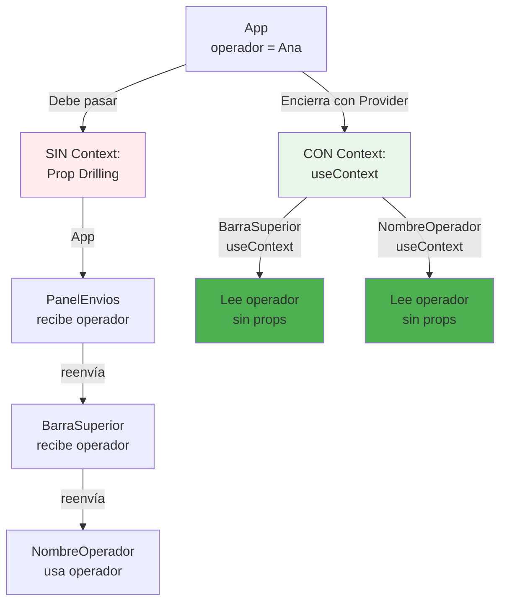

# Módulo 4: Context API y composición


## Aprende construyendo

### Tema 1: createContext y useContext

#### Paso 1 · Objetivo y preparación
Al finalizar vas a crear `SesionContext` para compartir el operador autenticado de RutaFlow con cualquier componente del árbol, sin pasarlo por props en cada nivel intermedio. Prerrequisitos: Módulo 3 completo.

#### Paso 2 · Contexto y caso real
`PanelEnvios`, `BarraSuperior` y `ModalConfirmacion` necesitan saber quién es el operador actual (su nombre, su zona asignada) — pasarlo como prop desde el componente raíz exigiría reenviarlo manualmente a través de cada componente intermedio que no usa ese dato para nada propio.

#### Paso 3 · Teoría, modelo mental y analogía
`createContext` define un canal; un `Provider` establece el valor para un subárbol; cualquier descendiente lee ese valor con `useContext` sin que los intermedios lo conozcan — un anuncio por altavoz que llega directo, sin que cada piso tenga que repetirlo.

**Diagrama: Context API evita prop drilling**



#### Paso 4 · Demostración guiada desde cero
```jsx
const SesionContext = createContext(null);

function App() {
  const [operador, setOperador] = useState({ nombre: 'Ana', zona: 'norte' });
  return (
    <SesionContext.Provider value={{ operador, setOperador }}>
      <PanelEnvios />
    </SesionContext.Provider>
  );
}

function BarraSuperior() {
  const { operador } = useContext(SesionContext); // sin pasar props por cada nivel intermedio
  return <span>Operador: {operador.nombre}</span>;
}
```
Resultado esperado: `BarraSuperior`, sin importar cuántos componentes intermedios existan entre ella y `App`, lee `operador.nombre` directamente — ningún componente entre ambos necesitó recibir ni reenviar esa prop.

#### Paso 5 · Práctica guiada
Pista: renderizá `BarraSuperior` en una parte del árbol que queda fuera de `SesionContext.Provider` (por ejemplo, un modal montado vía portal directamente en el `<body>`, sin envolverlo con el Provider) — ese es el fallo deliberado: `useContext(SesionContext)` devuelve `null`, y leer `operador.nombre` lanza un error en tiempo de ejecución porque `operador` es `null`.

#### Paso 6 · Práctica independiente
Corregí el Paso 5 envolviendo también ese modal con `SesionContext.Provider`, y agregá una validación explícita en `BarraSuperior` que muestre un mensaje claro de error de configuración si el contexto llega como `null`, en vez de crashear con un error críptico.

#### Paso 7 · Cierre y evidencia
Entregá el Context funcionando del Paso 4, el crash por Provider faltante del Paso 5, y la validación explícita del Paso 6; explicá por qué `useContext` nunca "busca" el Provider más cercano en todo el árbol, sino solo entre los ancestros reales del componente que lo consume. Siguiente paso: estudia cuándo Context deja de ser suficiente. Errores comunes: olvidar envolver una parte del árbol (especialmente contenido montado vía portales) con el Provider correspondiente, no validar que el valor del contexto no sea el valor por defecto antes de usarlo, y crear un nuevo objeto de valor en cada render del Provider sin memoizarlo. Fuentes oficiales: https://react.dev/learn/passing-data-deeply-with-context y https://react.dev/reference/react/useContext.
**¿Por qué es importante?** Context permite que un componente lea un valor compartido sin que cada componente intermedio en el árbol tenga que reenviarlo manualmente, pero solo funciona dentro del subárbol efectivamente envuelto por su Provider.
**Evidencia de aprendizaje:** entrega Context funcionando, crash por Provider faltante y validación explícita agregada.
**Conceptos clave:** proveedor y consumidor, evitar prop drilling.

`createContext('claro')` crea un objeto Context con un valor por defecto, que luego se provee a un subárbol completo de componentes mediante un componente `Provider` (`<ThemeContext.Provider value={{ tema, setTema }}>`) envolviendo esa parte de la aplicación; cualquier componente descendiente de ese Provider, sin importar cuántos niveles de anidamiento existan entre ambos, puede leer ese valor directamente con `useContext(ThemeContext)`, sin que ningún componente intermedio entre el Provider y el consumidor final necesite recibir, conocer, ni reenviar manualmente ese valor a través de sus propias props.

Esto resuelve directamente el problema conocido como "prop drilling": sin Context, compartir un valor entre un componente ancestro y otro descendiente lejano en el árbol requeriría pasar ese valor explícitamente como prop a través de cada componente intermedio en el camino entre ambos, incluso si esos componentes intermedios no usan ese valor para nada propio, simplemente lo reenvían hacia abajo — un acoplamiento innecesario que hace que cambiar la forma de ese valor compartido, o insertar un nuevo componente intermedio en el árbol, requiera modificar potencialmente muchos componentes que no tienen ninguna relación conceptual real con ese dato compartido, más allá de estar geográficamente ubicados entre el proveedor y el consumidor final.

**Analogía:** Context es como un anuncio por altavoz que llega directamente a cualquier persona dentro de un edificio específico, sin necesidad de que cada persona en cada piso intermedio tenga que repetir manualmente el mensaje al piso siguiente para que finalmente llegue a su destinatario real.

**¿Por qué es importante?** Context permite que un componente lea un valor compartido sin que cada componente intermedio en el árbol tenga que reenviarlo manualmente, evitando el acoplamiento innecesario del prop drilling.

**Código del ejemplo:**

```jsx
const ThemeContext = createContext('claro');

function App() {
  const [tema, setTema] = useState('claro');
  return (
    <ThemeContext.Provider value={{ tema, setTema }}>
      <Pagina />
    </ThemeContext.Provider>
  );
}

function BotonToggle() {
  const { tema, setTema } = useContext(ThemeContext); // sin pasar props por cada nivel intermedio
  return <button onClick={() => setTema(t => t === 'claro' ? 'oscuro' : 'claro')}>{tema}</button>;
}
```

### Tema 2: Cuándo Context es suficiente y cuándo no

#### Paso 1 · Objetivo y preparación
Al finalizar vas a medir cuántos componentes se re-renderizan cuando `SesionContext` cambia, y a decidir si ese costo es aceptable para el caso de RutaFlow. Prerrequisitos: Tema 1 de este módulo.

#### Paso 2 · Contexto y caso real
Alguien propuso meter también el texto del filtro de búsqueda de envíos (que cambia en cada tecla) dentro de `SesionContext`, junto al operador, "ya que está, para no crear otro Context".

#### Paso 3 · Teoría, modelo mental y analogía
Cada cambio en el valor de un Context re-renderiza todos sus consumidores, sin distinción granular — aceptable para valores que cambian poco (operador, tema), problemático para valores que cambian mucho (una tecla por vez).

#### Paso 4 · Demostración guiada desde cero
```jsx
// Mal: mezclar un valor de cambio frecuente dentro de un Context de cambio infrecuente
<SesionContext.Provider value={{ operador, filtroBusqueda, setFiltroBusqueda }}>
```
Resultado esperado: agregando un `console.log('render')` en `BarraSuperior` (que solo lee `operador`, nunca `filtroBusqueda`), escribir en el campo de búsqueda re-renderiza `BarraSuperior` de todas formas — React re-renderiza todos los consumidores del Context cuando el valor provisto cambia, sin importar qué parte de ese valor cada consumidor efectivamente lee.

**Demo con React DevTools:**
1. Crea un componente `BarraSuperior` que consuma `SesionContext` y solo lea `operador`
2. Crea un componente `CampoBusqueda` que también lea `filtroBusqueda` del mismo Context
3. Abre DevTools → Profiler tab → Grabar
4. Tipea en el campo de búsqueda
5. Detén la grabación y mira el chart: verás que `BarraSuperior` aparece resaltada en amarillo/rojo (re-renderizada)
6. Aunque `BarraSuperior` solo usa `operador`, se re-renderizó igual porque el Context cambió
7. Ahora refactoriza: saca `filtroBusqueda` del Context a un `useState` local en `CampoBusqueda`
8. Tipea de nuevo y graba con Profiler: ahora `BarraSuperior` NO aparece resaltada (no se re-renderizó)
9. Resultado esperado: ver en el Profiler la diferencia visual entre compartir estado innecesariamente vs mantenerlo local.

#### Paso 5 · Práctica guiada
Pista: dejá `filtroBusqueda` dentro de `SesionContext` y escribí rápido en el campo de búsqueda mientras mirás el `console.log` de `BarraSuperior` — ese es el fallo deliberado confirmado: `BarraSuperior` se re-renderiza en cada tecla aunque nunca lee `filtroBusqueda`, un desperdicio que empeora proporcionalmente a la cantidad de consumidores de `SesionContext`.

#### Paso 6 · Práctica independiente
Corregí el Paso 5 sacando `filtroBusqueda` de `SesionContext` y manejándolo con un `useState` local dentro del componente de búsqueda, sin Context, porque solo lo necesita ese componente y sus hijos directos — confirmá que `BarraSuperior` ya no se re-renderiza al escribir.

#### Paso 7 · Cierre y evidencia
Entregá la medición del re-render innecesario de los Pasos 4-5, y la corrección del Paso 6; explicá con tus propias palabras por qué "ya que está el Context, meto todo ahí" ignora la frecuencia de cambio de cada valor. Siguiente paso: estudia componentes compuestos y hooks personalizados. Errores comunes: meter valores de cambio frecuente dentro de un Context de cambio infrecuente, no medir el impacto real de re-renders antes de decidir, y asumir que Context siempre es más simple que una librería de estado dedicada sin considerar el costo real. Fuentes oficiales: https://react.dev/learn/passing-data-deeply-with-context y https://react.dev/learn/scaling-up-with-reducer-and-context.
**¿Por qué es importante?** Context es apropiado para valores que cambian con poca frecuencia consumidos ampliamente; mezclar un valor de cambio frecuente dentro del mismo Context re-renderiza innecesariamente a todos los consumidores que no lo usan.
**Evidencia de aprendizaje:** entrega medición del re-render innecesario y corrección separando el estado de cambio frecuente.
**Conceptos clave:** frecuencia de cambio del valor, re-renders de todos los consumidores.

Context resuelve bien el caso de valores que cambian con poca frecuencia relativa (el tema visual de la aplicación, el idioma seleccionado, la identidad del usuario autenticado) y que necesitan leerse desde muchos lugares distintos y potencialmente lejanos del árbol de componentes, dado que el costo de un re-render ocasional de todos los consumidores de ese Context (cada vez que el valor provisto cambia, absolutamente todos los componentes que consumen ese Context con `useContext` se re-renderizan, sin distinción de granularidad más fina) es perfectamente aceptable cuando esos cambios son infrecuentes.

Ese mismo comportamiento se vuelve problemático cuando el valor compartido cambia con mucha frecuencia (por ejemplo, el valor de un input que cambia en cada tecla) y es consumido por muchos componentes distintos: cada cambio re-renderizaría absolutamente todos esos consumidores, incluso aquellos que, en la práctica, solo necesitarían actualizarse ante una porción específica y más granular de ese cambio, no ante cualquier cambio del Context completo, un problema de rendimiento que empeora proporcionalmente a la frecuencia del cambio y a la cantidad de consumidores, y que librerías dedicadas de estado como Zustand (Módulo 7) resuelven de forma más granular, permitiendo a cada componente suscribirse selectivamente solo a la porción específica del estado que efectivamente necesita, sin re-renderizarse ante cambios de otras porciones no relacionadas.

**Analogía:** Context es como un tablón de anuncios comunitario, perfecto para avisos poco frecuentes que interesan a todo el vecindario (el tema, el idioma); para actualizaciones extremadamente frecuentes que solo interesan a ciertos vecinos específicos, un tablón general que notifica a todo el vecindario ante cada actualización se vuelve ruidoso e ineficiente, siendo preferible un sistema de suscripción más selectivo y granular.

**¿Por qué es importante?** Context es apropiado para valores que cambian con poca frecuencia consumidos ampliamente; para estado que cambia con mucha frecuencia y es consumido selectivamente, una librería con suscripción granular como Zustand evita re-renders innecesarios de consumidores no relacionados con el cambio específico.

**Diagrama:**

```
Context apropiado: tema, idioma, usuario autenticado (cambia poco, se lee en muchos lugares)
Context problemático: valor de un input en cada tecla (cambia mucho, re-renderiza TODOS los consumidores)
```

### Tema 3: Componentes compuestos, render props y hooks personalizados

#### Paso 1 · Objetivo y preparación
Al finalizar vas a construir `Pestanias`/`Pestanias.Panel` (un componente compuesto) para organizar el panel de operador en pestañas ("Envíos activos", "Historial"), coordinadas internamente sin que quien lo usa gestione ese estado. Prerrequisitos: Tema 2 de este módulo.

#### Paso 2 · Contexto y caso real
Sin un patrón de coordinación interna, cada vez que alguien usa un sistema de pestañas tendría que gestionar manualmente cuál está activa y pasarle esa información a cada panel individualmente.

#### Paso 3 · Teoría, modelo mental y analogía
El patrón de componentes compuestos usa un Context interno y privado para coordinar estado entre un contenedor y sus hijos relacionados, sin exponer esa coordinación al usuario final del componente.

#### Paso 4 · Demostración guiada desde cero
```jsx
const PestaniasContext = createContext(null);

function Pestanias({ children }) {
  const [activa, setActiva] = useState(0);
  return <PestaniasContext.Provider value={{ activa, setActiva }}>{children}</PestaniasContext.Provider>;
}
Pestanias.Panel = function Panel({ indice, titulo, children }) {
  const { activa, setActiva } = useContext(PestaniasContext);
  return (
    <>
      <button onClick={() => setActiva(indice)}>{titulo}</button>
      {activa === indice && <div>{children}</div>}
    </>
  );
};
```
Resultado esperado: `<Pestanias><Pestanias.Panel indice={0} titulo="Envíos activos">...</Pestanias.Panel></Pestanias>` coordina automáticamente cuál panel se muestra, sin que el código que usa `Pestanias` escriba ningún `useState` propio para rastrear la pestaña activa.

#### Paso 5 · Práctica guiada
Pista: usá `Pestanias.Panel` fuera de un `<Pestanias>` envolvente, directamente en la pantalla — ese es el fallo deliberado: `useContext(PestaniasContext)` devuelve `null` dentro de `Panel`, y desestructurar `{ activa, setActiva }` de `null` lanza un error en tiempo de ejecución, porque `Panel` depende implícitamente de estar dentro de un `Pestanias`.

#### Paso 6 · Práctica independiente
Corregí el Paso 5 devolviendo `Panel` dentro de `Pestanias`, y agregá una validación explícita dentro de `Panel` que lance un error descriptivo ("Pestanias.Panel debe usarse dentro de Pestanias") si el contexto es `null`, en vez de un error críptico de desestructuración.

#### Paso 7 · Cierre y evidencia
Entregá el componente compuesto funcionando del Paso 4, el error por uso fuera de contexto del Paso 5, y el mensaje de error descriptivo del Paso 6; explicá por qué `Pestanias.Panel` depende implícitamente de un ancestro `Pestanias`, y por qué hacer ese error explícito mejora la experiencia de quien use el componente. Siguiente paso: integrá esto al panel de operador completo. Errores comunes: exponer el Context interno de un componente compuesto directamente al usuario, no validar el caso de uso fuera de contexto con un mensaje claro, y recrear patrones antiguos (render props, HOCs) cuando un componente compuesto expresa la misma idea de forma más directa. Fuentes oficiales: https://react.dev/learn/passing-data-deeply-with-context y https://react.dev/learn/reusing-logic-with-custom-hooks.
**¿Por qué es importante?** Los componentes compuestos ofrecen una API declarativa y limpia para el usuario final, ocultando la coordinación interna necesaria sin exponer detalles de implementación.
**Evidencia de aprendizaje:** entrega componente compuesto funcionando, error por uso fuera de contexto detectado y mensaje descriptivo agregado.
**Conceptos clave:** coordinación implícita vía Context interno, alternativas históricas de reutilización de lógica.

El patrón de componentes compuestos usa un Context interno y privado (no expuesto directamente al usuario del componente) para coordinar el estado compartido entre un componente contenedor y sus componentes hijos relacionados, sin que el usuario final del componente necesite pasar props de coordinación manualmente: `<Tabs><Tabs.Tab label="Perfil">...</Tabs.Tab></Tabs>` funciona porque `Tabs` provee internamente un Context que sus propios componentes hijos `Tabs.Tab` consumen automáticamente, coordinando cuál pestaña está activa sin que el código que usa `Tabs` tenga que gestionar ese estado explícitamente por su cuenta.

Antes de que los hooks existieran (previo a React 16.8), dos patrones eran comunes para reutilizar lógica con estado entre componentes distintos: render props (un componente que recibe una función como prop y la invoca pasándole cierto estado interno, `<DataFetcher render={data => <Vista data={data} />} />`) y componentes de orden superior (funciones que envuelven un componente para inyectarle props adicionales). Los hooks personalizados (funciones que empiezan con `use` y pueden llamar a otros hooks internamente) reemplazaron en gran medida ambos patrones anteriores, permitiendo extraer y reutilizar lógica con estado de forma más directa y sin la anidación adicional de componentes envolventes que ambos patrones anteriores requerían.

**Analogía:** el patrón de componentes compuestos es como un equipo de trabajo donde los miembros se coordinan internamente mediante un canal de comunicación privado del propio equipo, sin que el cliente externo que contrata al equipo necesite coordinar manualmente la comunicación interna entre sus miembros.

**¿Por qué es importante?** Los componentes compuestos ofrecen una API declarativa y limpia para el usuario final del componente, ocultando la coordinación interna necesaria; los hooks personalizados reemplazaron patrones anteriores más verbosos (render props, HOCs) para reutilizar lógica con estado.

**Código del ejemplo:**

```jsx
<Tabs>
  <Tabs.Tab label="Perfil"><Perfil /></Tabs.Tab>
  <Tabs.Tab label="Ajustes"><Ajustes /></Tabs.Tab>
</Tabs>
// Tabs provee un Context interno que Tabs.Tab consume, sin coordinación manual del usuario
```

---


## Laboratorio práctico

**Objetivo del laboratorio:** implementar un theme switcher completo con Context, y un componente compuesto Tabs/Tab.

**Requisitos previos:** Módulos 0-3 completados.

| Paso | Acción | Código | Explicación |
|---|---|---|---|
| 1 | Crear `ThemeContext` con `ThemeProvider` | Ver Tema 1 | Envuelve la app completa |
| 2 | Consumir el contexto 3 niveles abajo | Ver Tema 1 | Sin prop drilling |
| 3 | Implementar el toggle de tema | Ver Tema 1 | Verifica que todos los consumidores se actualizan |
| 4 | Construir `Tabs`/`Tabs.Tab` compuesto | Ver Tema 3 | Comparte estado interno vía Context |

**Verificación:** el laboratorio se considera exitoso si el cambio de tema se refleja instantáneamente en todos los componentes consumidores sin importar su profundidad en el árbol, y si `Tabs`/`Tabs.Tab` coordinan la pestaña activa sin que el código que los usa gestione ese estado manualmente.

**Errores comunes y soluciones**

- **Usar Context para estado que cambia muy frecuentemente y es consumido por muchos componentes.** Considera Zustand (Módulo 7) para ese caso.
- **Exponer el Context interno de un componente compuesto directamente al usuario.** Mantenlo privado, coordinando internamente sin exponer detalles de implementación.
- **Olvidar envolver la aplicación (o el subárbol relevante) con el Provider.** Sin el Provider, `useContext` devuelve el valor por defecto, no el valor esperado.

---
