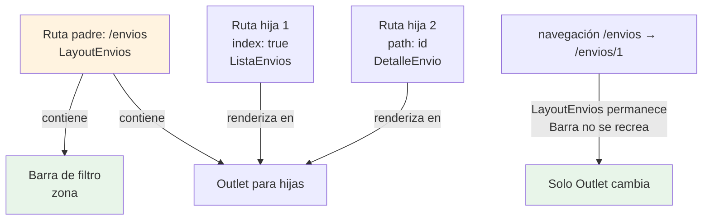

# Módulo 5: React Router — navegación


## Aprende construyendo

### Tema 1: Rutas anidadas y layouts compartidos

#### Paso 1 · Objetivo y preparación
Al finalizar vas a anidar `/envios` y `/envios/:id` bajo un layout compartido (`LayoutEnvios`, con la barra de filtros de zona) sin duplicar esa barra en cada vista. Prerrequisitos: Módulo 4 completo.

#### Paso 2 · Contexto y caso real
Tanto la lista de envíos como el detalle de un envío puntual deberían mostrar la misma barra de filtro de zona en la parte superior; repetirla en cada componente de vista duplicaría ese marcado y su lógica.

#### Paso 3 · Teoría, modelo mental y analogía
Una ruta padre puede definir un `element` que actúa como layout compartido, dentro del cual se renderizan sus rutas hijas — un marco de fotos común que envuelve fotos intercambiables.

**Diagrama: Rutas anidadas y layouts**



#### Paso 4 · Demostración guiada desde cero
```jsx
const router = createBrowserRouter([
  {
    path: '/envios',
    element: <LayoutEnvios />, // barra de filtro de zona compartida
    children: [
      { index: true, element: <ListaEnvios /> },
      { path: ':id', element: <DetalleEnvio /> },
    ],
  },
]);
```
Resultado esperado: navegar de `/envios` a `/envios/RF-4471` no remonta `LayoutEnvios` (la zona seleccionada en la barra de filtro se conserva) — solo el `<Outlet />` dentro de `LayoutEnvios` cambia entre `ListaEnvios` y `DetalleEnvio`.

#### Paso 5 · Práctica guiada
Pista: en vez de anidar, definí `/envios` y `/envios/:id` como dos rutas completamente independientes al mismo nivel, cada una renderizando su propia copia de la barra de filtro — ese es el fallo deliberado: al navegar de la lista al detalle, la barra de filtro se desmonta y vuelve a montar desde cero, perdiendo la zona seleccionada aunque visualmente "se vea igual".

#### Paso 6 · Práctica independiente
Corregí el Paso 5 volviendo a anidar ambas rutas bajo `LayoutEnvios`, y agregá una tercera ruta hija (`path: ':id/historial'`) que también comparta el mismo layout, confirmando que la barra de filtro sigue sin remontarse al navegar entre las tres.

#### Paso 7 · Cierre y evidencia
Entregá la estructura anidada del Paso 4, la pérdida de estado provocada en el Paso 5, y la tercera ruta hija del Paso 6; explicá por qué anidar rutas (en vez de duplicar el layout en rutas independientes) preserva el estado del layout compartido entre navegaciones. Siguiente paso: estudia loaders para evitar el parpadeo de carga. Errores comunes: duplicar el layout en rutas independientes en vez de anidarlas, olvidar el `<Outlet />` dentro del layout (las rutas hijas nunca se renderizarían), y anidar rutas que en realidad no comparten ningún layout real. Fuentes oficiales: https://reactrouter.com/start/data/route-object y https://reactrouter.com/start/framework/routing.
**¿Por qué es importante?** Anidar rutas bajo un layout compartido centraliza ese layout en un único lugar y preserva su estado entre navegaciones, algo que rutas independientes duplicadas no logran.
**Evidencia de aprendizaje:** entrega estructura anidada, pérdida de estado detectada y tercera ruta hija confirmada.
**Conceptos clave:** `children`, layout compartido, composición de rutas.

React Router permite definir rutas anidadas mediante la propiedad `children` de una configuración de ruta: una ruta padre (`/tareas`) puede definir un `element` que actúa como layout compartido (por ejemplo, una barra de navegación común a todas las sub-rutas), dentro del cual se renderizan sus rutas hijas (`{ index: true, element: <ListaTareas /> }` para la ruta exacta `/tareas`, y `{ path: ':id', element: <DetalleTarea /> }` para `/tareas/:id`), evitando la necesidad de repetir manualmente ese layout compartido (la navbar, por ejemplo) en cada componente de vista individual.

Esta estructura anidada refleja directamente la jerarquía visual real de la aplicación: si todas las vistas bajo `/tareas/*` comparten la misma barra de navegación circundante, expresar esa relación mediante anidamiento de rutas evita duplicar ese layout en cada componente de vista, centralizándolo en un único lugar (el componente de la ruta padre), de forma conceptual similar al routing anidado con layouts compartidos estudiado en el Módulo 4 del track de Angular, aunque expresado con la API específica de React Router en vez de la de Angular Router.

**Analogía:** un layout compartido en rutas anidadas es como un marco de fotos común que envuelve distintas fotos intercambiables: el marco (la navbar) permanece igual, mientras que el contenido específico dentro de él (la vista actual) cambia según la ruta activa.

**¿Por qué es importante?** Anidar rutas bajo un layout compartido centraliza ese layout en un único lugar, evitando duplicarlo manualmente en cada componente de vista individual.

**Código del ejemplo:**

```jsx
const router = createBrowserRouter([
  {
    path: '/tareas',
    element: <LayoutTareas />, // navbar compartida
    children: [
      { index: true, element: <ListaTareas /> },
      { path: ':id', element: <DetalleTarea /> },
    ],
  },
]);
```

### Tema 2: Loaders — datos antes de renderizar

#### Paso 1 · Objetivo y preparación
Al finalizar vas a cargar los datos de `/envios/:id` con un loader de React Router, en vez de un `fetch` dentro de un `useEffect`, para eliminar el parpadeo de "cargando...". Prerrequisitos: Tema 1 de este módulo.

#### Paso 2 · Contexto y caso real
Hoy, `DetalleEnvio` se monta vacío, muestra "Cargando..." por un instante, y luego se actualiza con los datos reales del envío — un parpadeo visible cada vez que se navega al detalle.

#### Paso 3 · Teoría, modelo mental y analogía
Un loader es una función asociada a una ruta que React Router ejecuta y espera antes de renderizar el componente — esperar a que el plato esté listo en la cocina antes de servirlo, en vez de servir la mesa vacía primero.

#### Paso 4 · Demostración guiada desde cero
```jsx
{
  path: ':id',
  loader: ({ params }) => fetch(`/api/envios/${params.id}`).then(r => r.json()),
  element: <DetalleEnvio />,
}
// dentro de DetalleEnvio:
const envio = useLoaderData();
```
Resultado esperado: navegar a `/envios/RF-4471` espera a que la respuesta de la API llegue antes de montar `DetalleEnvio` — nunca se ve un estado intermedio vacío o "Cargando...", el componente aparece directamente con `envio` ya poblado.

**Demo con React DevTools:**
1. Implementa la app con loader como arriba
2. Abre DevTools → Network tab → throttle a "Slow 3G" para simular red lenta
3. Haz click en un enlace `/envios/1`
4. Observa en DevTools → Elementos tab: `DetalleEnvio` **no se monta hasta que la respuesta llega** (no ves ningún marcado intermedio)
5. Compara: implementa la misma vista pero sin loader, manejando fetch en un `useEffect` del componente
6. Repite el click con throttle: ahora verás un marcado vacío primero, luego "Cargando...", luego los datos
7. Resultado esperado: ver en DevTools/Network que el loader espera a que el fetch complete antes de renderizar el componente.

#### Paso 5 · Práctica guiada
Pista: apuntá el loader a una URL inexistente (`/api/envios-typo/${params.id}`) — ese es el fallo deliberado: la petición falla, React Router activa su mecanismo de error de ruta, y si no definiste un `errorElement`, el usuario ve una pantalla de error genérica de React Router en vez de un mensaje específico de RutaFlow explicando qué pasó.

#### Paso 6 · Práctica independiente
Corregí el Paso 5 devolviendo la URL correcta, y agregá un `errorElement` específico para esa ruta que muestre "No pudimos cargar este envío" con un botón de reintentar, en vez de la pantalla de error genérica.

#### Paso 7 · Cierre y evidencia
Entregá el loader sin parpadeo del Paso 4, el error de ruta provocado en el Paso 5, y el `errorElement` específico del Paso 6; explicá por qué un loader cambia cuándo se cargan los datos (antes de renderizar, no después de montar), y por qué eso elimina el parpadeo que un `useEffect` siempre tiene. Siguiente paso: estudia rutas protegidas y code-splitting. Errores comunes: no definir un `errorElement` para rutas con loader, loaders sin manejo del caso en que la petición falla, y mezclar fetching por loader y por `useEffect` para el mismo dato en la misma vista. Fuentes oficiales: https://reactrouter.com/start/framework/data-loading y https://reactrouter.com/start/framework/error-handling.
**¿Por qué es importante?** Un loader evita el parpadeo de un estado intermedio "cargando" al asegurar que los datos ya están disponibles antes de que el componente de la ruta se renderice por primera vez.
**Evidencia de aprendizaje:** entrega loader sin parpadeo, error de ruta detectado y errorElement específico agregado.
**Conceptos clave:** carga de datos previa a la vista, `useLoaderData`, evitar el parpadeo de carga.

Un loader es una función asociada a una ruta específica que React Router ejecuta y espera a que complete antes de renderizar el componente de esa ruta: `loader: ({ params }) => fetch(`/api/tareas/${params.id}`)`, con el componente accediendo al resultado de esa carga mediante `useLoaderData()`, en vez de disparar la carga de datos dentro de un `useEffect` una vez que el componente ya se montó (el patrón tradicional de fetching dentro del propio componente).

Esta diferencia de timing es la ventaja concreta de un loader: con fetching dentro de un `useEffect`, el componente se monta primero (típicamente mostrando algún estado de "cargando..." mientras la petición está en curso), y solo después de que la petición completa se actualiza el estado con los datos reales, produciendo un parpadeo visual perceptible entre el estado vacío/cargando inicial y el contenido final; con un loader, React Router espera a que la carga de datos complete antes de montar el componente en absoluto, evitando ese parpadeo intermedio por completo, dado que el componente nunca se renderiza en un estado sin datos.

**Analogía:** un loader es como esperar a que el plato completo esté listo en la cocina antes de servirlo en la mesa; fetching dentro de un `useEffect` es como servir la mesa vacía primero y traer el plato después, dejando al comensal esperando frente a un plato vacío durante un momento perceptible antes de que llegue el contenido real.

**¿Por qué es importante?** Un loader evita el parpadeo de un estado intermedio "cargando" al asegurar que los datos ya están disponibles antes de que el componente de la ruta se renderice por primera vez.

**Código del ejemplo:**

```jsx
{
  path: '/tareas/:id',
  loader: ({ params }) => fetch(`/api/tareas/${params.id}`),
  element: <DetalleTarea />,
}
// dentro del componente:
const tarea = useLoaderData();
```

### Tema 3: Rutas protegidas y code-splitting por ruta

#### Paso 1 · Objetivo y preparación
Al finalizar vas a proteger la ruta `/admin` de RutaFlow (solo para supervisores) y a cargarla con `React.lazy` para que su código no forme parte del bundle inicial. Prerrequisitos: Tema 2 de este módulo.

#### Paso 2 · Contexto y caso real
La pantalla de administración de RutaFlow (gestión de conductores, reportes) la usan muy pocos operadores; descargarla en el bundle inicial para todos, incluyendo conductores que nunca la verán, infla innecesariamente la carga inicial de la app.

#### Paso 3 · Teoría, modelo mental y analogía
Una ruta protegida verifica una condición de acceso antes de mostrar su contenido real; `React.lazy` + `Suspense` descarga el código de un componente solo cuando efectivamente se necesita — un guardia que verifica credencial, y no llevar el manual completo de todas las salas, solo el de la sala a la que efectivamente entrás.

#### Paso 4 · Demostración guiada desde cero
```jsx
function RutaProtegida({ children }) {
  const { operador } = useContext(SesionContext);
  return operador.rol === 'supervisor' ? children : <Navigate to="/" />;
}

const Admin = lazy(() => import('./Admin'));
<Route path="/admin" element={
  <RutaProtegida><Suspense fallback={<Spinner />}><Admin /></Suspense></RutaProtegida>
} />
```
Resultado esperado: un conductor (rol distinto de `'supervisor'`) que navega a `/admin` es redirigido inmediatamente a `/` sin que el chunk de `Admin` siquiera se descargue; un supervisor sí accede, y recién ahí el navegador descarga el chunk separado de `Admin` (verificable en la pestaña Network).

#### Paso 5 · Práctica guiada
Pista: envolvé `Admin` en `Suspense` pero quitá `RutaProtegida` "para simplificar" — ese es el fallo deliberado: cualquier conductor que navegue manualmente a `/admin` ahora sí ve la pantalla de administración completa en el cliente, aunque no tenga el rol correspondiente — una falsa sensación de seguridad, porque esta verificación es solo de experiencia de usuario, no un control de autorización real.

#### Paso 6 · Práctica independiente
Corregí el Paso 5 restaurando `RutaProtegida`, y agregá un comentario explícito en el código recordando que el backend de RutaFlow debe repetir esta misma verificación de rol en cada endpoint que `Admin` consuma, porque una ruta protegida en el cliente nunca reemplaza la autorización real del servidor.

#### Paso 7 · Cierre y evidencia
Entregá la ruta protegida con lazy loading del Paso 4, el acceso indebido provocado en el Paso 5, y el recordatorio de autorización en servidor del Paso 6; explicá por qué una ruta protegida en el cliente mejora la experiencia pero nunca sustituye la verificación de permisos en el servidor. Siguiente paso: cerrá el módulo integrando rutas, loaders y protección en el proyecto completo. Errores comunes: confiar en una ruta protegida del cliente como única barrera de seguridad, olvidar `Suspense` alrededor de un componente `lazy`, y cargar con `lazy` una ruta tan pequeña que el overhead de un chunk adicional no se justifica. Fuentes oficiales: https://react.dev/reference/react/lazy y https://reactrouter.com/start/framework/navigating.
**¿Por qué es importante?** Las rutas protegidas centralizan la lógica de redirección según autenticación y el code-splitting reduce el bundle inicial, pero ninguna de las dos sustituye la autorización real que debe vivir en el servidor.
**Evidencia de aprendizaje:** entrega ruta protegida con lazy loading, acceso indebido detectado y recordatorio de autorización en servidor.
**Conceptos clave:** redirección condicional según autenticación, `React.lazy` + `Suspense`, chunks separados.

Una ruta protegida verifica, antes de mostrar su contenido real, si el usuario cumple una condición de acceso (típicamente estar autenticado):

```jsx
function RutaProtegida({ children }) {
  const { autenticado } = useAuth();
  return autenticado ? children : <Navigate to="/login" />;
}
```

Este componente envolvente renderiza condicionalmente su contenido protegido o redirige a la ruta de login, conceptualmente equivalente a un guard funcional de Angular (`CanActivateFn`, Módulo 4 del track de Angular), aunque expresado aquí como un componente de React en vez de una función dedicada del sistema de routing.

`React.lazy(() => import('./Configuracion'))` marca un componente para que su código se compile en un chunk de JavaScript separado del bundle principal, descargado únicamente cuando efectivamente se necesita renderizar (cuando el usuario navega a la ruta correspondiente), reduciendo el tamaño del bundle inicial que se descarga al cargar la aplicación por primera vez; `<Suspense fallback={<Spinner />}>` envuelve ese componente perezoso, mostrando el `fallback` mientras el chunk correspondiente todavía se está descargando, de forma conceptualmente equivalente al `@defer`/`@placeholder` de Angular (Módulo 11 del track de Angular), aunque aplicado aquí específicamente a la carga perezosa de componentes completos de ruta en vez de a bloques arbitrarios de una plantilla.

**Analogía:** una ruta protegida es como un guardia en la entrada de una sala que verifica una credencial antes de permitir el paso, redirigiendo a otra sala (login) a quien no la presente; el code-splitting por ruta es como no llevar contigo el manual completo de todas las salas del edificio, sino recibir solo el manual específico de la sala a la que efectivamente entras, en el momento en que entras a ella.

**¿Por qué es importante?** Las rutas protegidas centralizan la lógica de redirección según autenticación; el code-splitting por ruta reduce el bundle inicial descargado, mejorando el tiempo de carga inicial de la aplicación.

**Código del ejemplo:**

```jsx
function RutaProtegida({ children }) {
  const { autenticado } = useAuth();
  return autenticado ? children : <Navigate to="/login" />;
}

const Configuracion = lazy(() => import('./Configuracion'));
<Route path="/config" element={
  <Suspense fallback={<Spinner />}><Configuracion /></Suspense>
} />
```

---


## Laboratorio práctico

**Objetivo del laboratorio:** construir una aplicación con rutas anidadas, un loader, una ruta protegida y carga perezosa.

**Requisitos previos:** Módulos 0-4 completados.

| Paso | Acción | Código | Explicación |
|---|---|---|---|
| 1 | Definir rutas anidadas con layout compartido | Ver Tema 1 | `/tareas` con hijas `index` y `:id` |
| 2 | Agregar un loader a la ruta de detalle | Ver Tema 2 | Verifica que evita el parpadeo de carga |
| 3 | Implementar la ruta protegida | Ver Tema 3 | Redirige a `/login` sin sesión |
| 4 | Cargar una ruta pesada con `React.lazy` | Ver Tema 3 | Verifica en Network que el chunk se descarga solo al navegar ahí |

**Verificación:** el laboratorio se considera exitoso si la navegación entre rutas anidadas mantiene el layout compartido sin remontarlo, si la ruta con loader no muestra ningún parpadeo de carga, y si el chunk de la ruta perezosa se descarga únicamente al navegar hacia ella (verificable en la pestaña Network).

**Errores comunes y soluciones**

- **Duplicar el layout en cada componente de vista en vez de anidar rutas.** Usa una ruta padre con `children` para compartir el layout.
- **Hacer fetching dentro de un `useEffect` cuando un loader evitaría el parpadeo.** Prefiere un loader para datos necesarios antes de mostrar la vista.
- **Olvidar envolver un componente `lazy` en `Suspense`.** Sin `Suspense`, React no sabe qué mostrar mientras el chunk se descarga.

---
