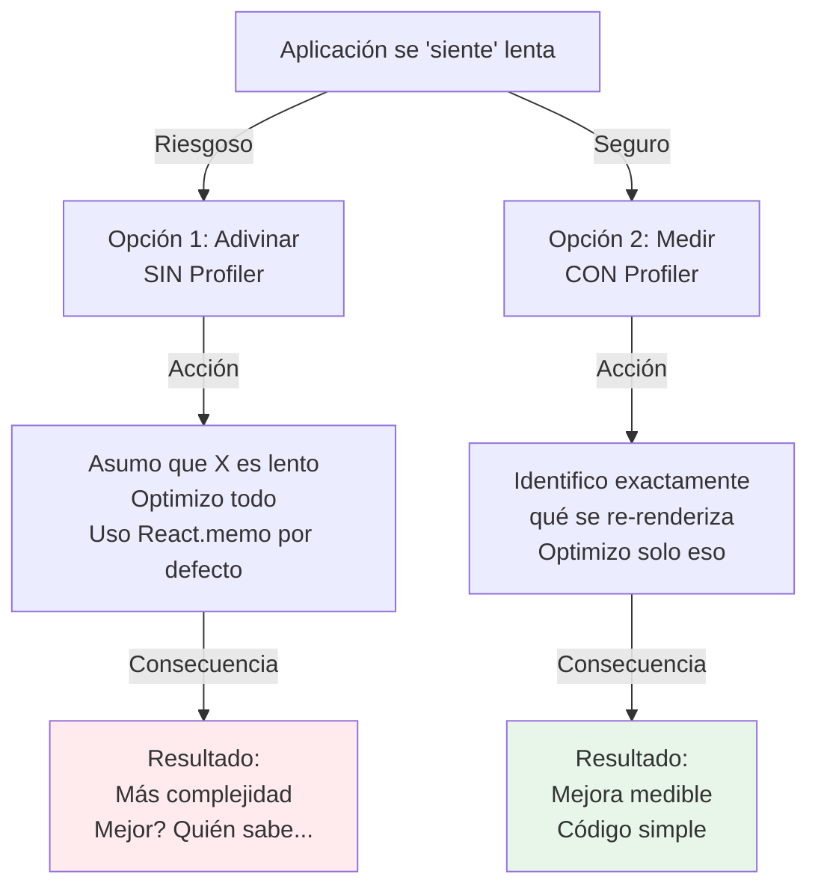

# Módulo 9: Performance en React


## Aprende construyendo

### Tema 1: Medir antes de optimizar

#### Paso 1 · Objetivo y preparación
Al finalizar vas a grabar con React DevTools Profiler una interacción real de `ListaEnvios` (escribir en el filtro) para identificar qué componente específico se re-renderiza innecesariamente, antes de optimizar nada. Prerrequisitos: Módulo 8 completo.

#### Paso 2 · Contexto y caso real
Alguien en el equipo "intuye" que `EnvioCard` es lento y propone envolverlo en `React.memo` preventivamente, sin haber grabado ninguna interacción real todavía.

#### Paso 3 · Teoría, modelo mental y analogía
El Profiler graba una interacción y muestra exactamente qué componentes se re-renderizaron y por qué — un diagnóstico real, en vez de adivinar qué pieza "suena mal".

**Diagrama: Optimización sin medición**



#### Paso 4 · Demostración guiada desde cero
```text
1. Abrí React DevTools > pestaña Profiler
2. Click en grabar (●)
3. Escribí una letra en el campo de filtro de zona
4. Detené la grabación
5. Inspeccioná qué componentes aparecen resaltados y por qué
```
Resultado esperado: el Profiler muestra que `EncabezadoPanel` (que ni siquiera lee el filtro) se re-renderizó igual, simplemente porque es hijo del mismo padre que cambió de estado — no porque `EncabezadoPanel` en sí sea lento, sino porque heredó un render de su padre.

#### Paso 5 · Práctica guiada
Pista: envolvé `EnvioCard` en `React.memo` basándote solo en la intuición inicial ("parece pesado"), sin confirmar con el Profiler que ese es el componente real del problema — ese es el fallo deliberado: volvé a grabar la interacción, y confirmá que `EnvioCard` nunca estuvo en la lista de componentes re-renderizados innecesariamente; el tiempo invertido en memoizarlo no resolvió nada, porque el problema real estaba en otro componente.

#### Paso 6 · Práctica independiente
Corregí el Paso 5 identificando con el Profiler cuál es el componente que sí se re-renderiza innecesariamente (`EncabezadoPanel`, según el Paso 4), y aplicá ahí la optimización que estudiarás en el Tema 2, confirmando con una nueva grabación que ese render innecesario desaparece.

#### Paso 7 · Cierre y evidencia
Entregá la grabación del Paso 4 señalando el componente real afectado, la optimización desperdiciada del Paso 5, y la corrección dirigida del Paso 6; explicá por qué memoizar basándose en intuición en vez de en evidencia del Profiler puede hacer que el esfuerzo de optimización se invierta en el componente equivocado. Siguiente paso: estudia React.memo con criterio. Errores comunes: optimizar sin medir primero, confiar en percepción subjetiva de qué componente "parece lento", y asumir que el componente visualmente más grande es automáticamente el más costoso de renderizar. Fuentes oficiales: https://react.dev/learn/render-and-commit y https://react.dev/reference/react/Profiler.
**¿Por qué es importante?** El Profiler proporciona evidencia concreta de qué componentes se re-renderizan innecesariamente y por qué, evitando esfuerzo de optimización desperdiciado en suposiciones incorrectas.
**Evidencia de aprendizaje:** entrega grabación del Profiler, optimización desperdiciada identificada y corrección dirigida confirmada.
**Conceptos clave:** React DevTools Profiler, evidencia antes que intuición.

React DevTools Profiler graba una interacción específica de la aplicación (un clic, escribir en un input, navegar entre vistas) y muestra exactamente qué componentes se re-renderizaron durante esa interacción y por qué (props que cambiaron, estado que cambió, o simplemente que su componente padre se re-renderizó, arrastrando consigo un re-render del hijo aunque sus props sean idénticas), información concreta y medible que reemplaza la intuición o suposición sobre qué parte del código podría estar causando lentitud.

Optimizar código sin esta información concreta es, en la inmensa mayoría de los casos, esfuerzo desperdiciado en el lugar equivocado: es común intuir que cierto componente "parece pesado" y envolverlo preventivamente en `React.memo` (Tema 2), cuando en realidad el componente que efectivamente causa el problema de rendimiento percibido es otro completamente distinto, identificable únicamente inspeccionando el Profiler durante la interacción real que el usuario reporta como lenta, en vez de adivinar basándose en una impresión general del código.

**Analogía:** optimizar sin el Profiler es como intentar reparar un motor de auto basándose únicamente en la intuición de qué pieza "suena mal", en vez de conectar un diagnóstico real que muestre exactamente qué componente específico está fallando y por qué.

**¿Por qué es importante?** El Profiler proporciona evidencia concreta de qué componentes se re-renderizan innecesariamente y por qué, evitando esfuerzo de optimización desperdiciado en suposiciones incorrectas sobre dónde está el problema real.

**Diagrama:**

```
Profiler graba una interacción → muestra QUÉ componentes se re-renderizaron y POR QUÉ
(props cambiadas / estado cambiado / re-render heredado del padre)
```

* Ejecutar: `npm test`
* Código: `examples/rutaflow/react/use-shipment-tracking.tsx`
* Proyecto: proyecto integrador RutaFlow

### Tema 2: React.memo con criterio

#### Paso 1 · Objetivo y preparación
Al finalizar vas a envolver `EncabezadoPanel` (identificado en el Tema 1 con el Profiler) en `React.memo`, confirmando que el render heredado innecesario desaparece. Prerrequisitos: Tema 1 de este módulo.

#### Paso 2 · Contexto y caso real
`EncabezadoPanel` recibe siempre las mismas props (`titulo="Panel de envíos"`) pero se re-renderiza cada vez que el padre cambia de estado por el filtro, aunque sus props nunca cambian entre esos renders.

#### Paso 3 · Teoría, modelo mental y analogía
`React.memo` compara superficialmente las props entre renders; si son referencialmente iguales, React se salta la re-ejecución — un guardia que compara la lista de invitados antes de repetir el mismo trabajo.

#### Paso 4 · Demostración guiada desde cero
```jsx
const EncabezadoPanel = React.memo(function EncabezadoPanel({ titulo }) {
  return <h1>{titulo}</h1>;
});
```
Resultado esperado: grabando de nuevo con el Profiler mientras se escribe en el filtro de zona, `EncabezadoPanel` ya no aparece en la lista de componentes re-renderizados — React detecta que `titulo` sigue siendo exactamente el mismo string y se salta la re-ejecución completamente.

**Demo con React DevTools Profiler:**
1. Abre la app sin `React.memo` en `EncabezadoPanel`
2. DevTools → Profiler tab → grabar (●)
3. Tipea una letra en el filtro de zona
4. Detén la grabación
5. Observa: `EncabezadoPanel` aparece resaltada en rojo/amarillo con un tiempo de render X ms
6. Ahora envuelve `EncabezadoPanel` en `React.memo`
7. Repite: grabar, tipear, detener
8. Resultado esperado: `EncabezadoPanel` YA NO aparece en el chart del Profiler (no se re-renderizó en absoluto)
9. Conclusión: las mismas props (`titulo="Panel de envíos"`) no cambiaron, así que `React.memo` bloqueó el render innecesario.

#### Paso 5 · Práctica guiada
Pista: envolvé también `BotonFiltro` (que sí recibe una prop nueva en cada tecla, el texto del filtro actual) en `React.memo` "ya que estamos memoizando todo" — ese es el fallo deliberado: medí con el Profiler el costo de la comparación superficial en `BotonFiltro`; como sus props cambian en cada render, la comparación siempre determina que hay que re-renderizar igual, agregando el costo de comparar sin evitar ningún trabajo real.

#### Paso 6 · Práctica independiente
Corregí el Paso 5 quitando `React.memo` de `BotonFiltro` (que no lo necesita, porque sus props cambian casi siempre), dejándolo únicamente en `EncabezadoPanel`, y confirmá con el Profiler que esa es la única memoización que efectivamente ahorra trabajo real.

#### Paso 7 · Cierre y evidencia
Entregá `EncabezadoPanel` memoizado del Paso 4, el memo desperdiciado en `BotonFiltro` del Paso 5, y la limpieza del Paso 6; explicá por qué `React.memo` solo aporta beneficio cuando las props de un componente son estables con frecuencia significativa, no en cualquier componente "por si acaso". Siguiente paso: estudia virtualización para listas largas. Errores comunes: envolver indiscriminadamente todos los componentes en `React.memo`, memoizar un componente cuyas props cambian en casi todos los renders, y no confirmar con el Profiler que la memoización efectivamente eliminó un render real. Fuentes oficiales: https://react.dev/reference/react/memo y https://react.dev/reference/react/memo#minimizing-props-changes.
**¿Por qué es importante?** `React.memo` solo ayuda cuando un componente recibe las mismas props con frecuencia significativa; aplicarlo indiscriminadamente agrega overhead de comparación sin beneficio real.
**Evidencia de aprendizaje:** entrega EncabezadoPanel memoizado, memo desperdiciado detectado y limpieza confirmada con el Profiler.
**Conceptos clave:** comparación superficial de props, overhead de comparación, cuándo realmente ayuda.

`React.memo(function Fila({ item }) { return <li>{item.nombre}</li>; })` envuelve un componente para que React realice una comparación superficial de sus props entre el render anterior y el actual antes de volver a ejecutar la función del componente: si todas las props son referencialmente iguales al render anterior, React se salta completamente la re-ejecución de ese componente y reutiliza el resultado anterior, en vez de volver a calcular un árbol de elementos idéntico innecesariamente.

`React.memo` solo aporta un beneficio real cuando el componente efectivamente recibe las mismas props en renders sucesivos con una frecuencia significativa (por ejemplo, una fila de una lista larga que se re-renderiza cada vez que el componente padre se actualiza por una razón no relacionada con esa fila específica): envolver absolutamente todos los componentes de la aplicación con `React.memo` de forma indiscriminada agrega el overhead de esa comparación superficial de props en cada render, sin ningún beneficio real en componentes que de todas formas reciben props distintas en la mayoría de sus renders (donde la comparación superficial siempre determinaría que sí hay que re-renderizar, agregando el costo de la comparación sin evitar ningún trabajo real).

**Analogía:** `React.memo` es como un guardia que compara una lista de invitados exacta antes de dejar pasar a un evento que ya ocurrió con la misma lista, ahorrando repetir el mismo trabajo; pedirle a ese guardia que revise la lista incluso cuando la lista prácticamente siempre cambia agrega el costo de la revisión sin ahorrar ningún trabajo real, dado que casi siempre habrá que dejar pasar de todas formas.

**¿Por qué es importante?** `React.memo` solo ayuda cuando un componente recibe las mismas props con frecuencia significativa; aplicarlo indiscriminadamente agrega overhead de comparación sin beneficio real en componentes que de todas formas cambian de props frecuentemente.

**Código del ejemplo:**

```jsx
const Fila = React.memo(function Fila({ item }) {
  return <li>{item.nombre}</li>;
}); // solo se re-renderiza si `item` cambia (comparación superficial)
```

* Ejecutar: `npm test`
* Código: `examples/rutaflow/react/use-shipment-tracking.tsx`
* Proyecto: proyecto integrador RutaFlow
* Visualización: concepto mostrado en diagrama

### Tema 3: Virtualización y code-splitting

#### Paso 1 · Objetivo y preparación
Al finalizar vas a virtualizar `ListaEnvios` cuando RutaFlow acumula miles de envíos históricos, renderizando en el DOM solo los que están visibles en pantalla. Prerrequisitos: Tema 2 de este módulo.

#### Paso 2 · Contexto y caso real
La pantalla de historial de RutaFlow puede mostrar más de 10,000 envíos acumulados — renderizar los 10,000 `<li>` completos en el DOM de una sola vez, aunque solo una docena sea visible, es trabajo desperdiciado.

#### Paso 3 · Teoría, modelo mental y analogía
La virtualización renderiza únicamente los elementos visibles en el viewport (más un pequeño margen), reciclando los mismos nodos DOM al hacer scroll — un teatro que solo construye los asientos de la sección visible, no el estadio completo.

#### Paso 4 · Demostración guiada desde cero
```jsx
import { FixedSizeList } from 'react-window';
<FixedSizeList height={600} itemCount={envios.length} itemSize={48}>
  {({ index, style }) => <div style={style}>{envios[index].guia}</div>}
</FixedSizeList>
```
Resultado esperado: inspeccionando el DOM real en las herramientas de desarrollador mientras se hace scroll sobre los 10,000 envíos, nunca existen más de unas pocas decenas de nodos `<div>` simultáneamente — los mismos nodos se reciclan mostrando contenido distinto a medida que el scroll avanza.

#### Paso 5 · Práctica guiada
Pista: reemplazá `FixedSizeList` por un `.map()` directo sobre los 10,000 `envios` "para simplificar" — ese es el fallo deliberado: medí con el Profiler el tiempo de renderizado inicial antes y después de este cambio; sin virtualizar, el render inicial tarda notablemente más, y el scroll se siente perceptiblemente menos fluido, porque ahora existen 10,000 nodos DOM reales simultáneamente.

#### Paso 6 · Práctica independiente
Corregí el Paso 5 restaurando `FixedSizeList`, y agregá `React.lazy` para la pantalla de "Reportes" de RutaFlow (usada por pocos operadores), confirmando en la pestaña Network que su chunk se descarga solo al navegar ahí, no en la carga inicial.

#### Paso 7 · Cierre y evidencia
Entregá la lista virtualizada del Paso 4, la medición del render completo sin virtualizar del Paso 5, y el code-splitting de Reportes del Paso 6; explicá la diferencia entre lo que resuelve la virtualización (renderizado continuo de una lista ya cargada) y lo que resuelve el code-splitting (descarga inicial del bundle). Siguiente paso: estudia useTransition para mantener la interfaz responsiva durante cálculos costosos. Errores comunes: virtualizar una lista pequeña que no lo necesita, usar un índice de array en vez de un id estable como key dentro de la lista virtualizada, y confundir virtualización con code-splitting. Fuentes oficiales: https://github.com/bvaughn/react-window y https://react.dev/reference/react/lazy.
**¿Por qué es importante?** La virtualización reduce drásticamente el costo de renderizar listas largas; el code-splitting reduce el bundle inicial descargado — dos optimizaciones distintas para dos problemas distintos.
**Evidencia de aprendizaje:** entrega lista virtualizada, medición sin virtualizar y code-splitting de Reportes confirmado.
**Conceptos clave:** renderizar solo lo visible, dividir el bundle en chunks.

Renderizar una lista de 10,000 elementos completos en el DOM, incluso si la mayoría no son visibles en la pantalla en un momento dado, es costoso tanto en tiempo de renderizado inicial como en memoria consumida por nodos DOM que el usuario nunca ve directamente; la virtualización (`<FixedSizeList height={600} itemCount={10000} itemSize={40}>{({ index, style }) => <div style={style}>{datos[index].nombre}</div>}</FixedSizeList>` con `react-window`) renderiza únicamente los elementos actualmente visibles en el viewport (más un pequeño margen para un scroll suave), reciclando los mismos nodos DOM a medida que el usuario hace scroll, en vez de mantener los 10,000 nodos completos existiendo simultáneamente en el DOM real.

`React.lazy(() => import('./Reportes'))` combinado con `Suspense` (estudiado en profundidad en el Módulo 5 para code-splitting por ruta) divide el bundle de JavaScript en chunks separados descargados bajo demanda, reduciendo el tamaño del bundle inicial que la aplicación necesita descargar y ejecutar antes de volverse interactiva, una técnica de reducción de trabajo inicial complementaria (pero distinta) a la virtualización, que reduce el trabajo de renderizado continuo de listas largas ya cargadas.

**Analogía:** la virtualización es como un teatro que solo construye físicamente los asientos de la sección actualmente visible desde donde alguien mira, en vez de construir las 10,000 butacas completas de un estadio entero de una sola vez; el code-splitting es como entregar solo el capítulo del manual que el usuario necesita en este momento, en vez del libro completo de antemano.

**¿Por qué es importante?** La virtualización reduce drásticamente el costo de renderizar listas largas al mantener en el DOM solo los elementos visibles; el code-splitting reduce el bundle inicial descargado, mejorando el tiempo hasta que la aplicación se vuelve interactiva.

**Código del ejemplo:**

```jsx
import { FixedSizeList } from 'react-window';
<FixedSizeList height={600} itemCount={10000} itemSize={40}>
  {({ index, style }) => <div style={style}>{datos[index].nombre}</div>}
</FixedSizeList>

const Reportes = lazy(() => import('./Reportes'));
<Suspense fallback={<Spinner />}><Reportes /></Suspense>
```

* Ejecutar: `npm test`
* Código: `examples/rutaflow/react/use-shipment-tracking.tsx`
* Proyecto: proyecto integrador RutaFlow
* Visualización: concepto mostrado en diagrama

### Tema 4: useTransition, useDeferredValue y Fiber

#### Paso 1 · Objetivo y preparación
Al finalizar vas a usar `useTransition` para que escribir en el filtro de zona de RutaFlow siga respondiendo instantáneamente, aunque filtrar 10,000 envíos sea un cálculo costoso en segundo plano. Prerrequisitos: Tema 3 de este módulo.

#### Paso 2 · Contexto y caso real
Filtrar la lista completa de 10,000 envíos cada vez que el operador escribe una letra bloquea momentáneamente la interfaz — el input se siente "trabado" porque React trata esa actualización con la misma prioridad urgente que la propia tecla.

#### Paso 3 · Teoría, modelo mental y analogía
`useTransition` marca una actualización como no urgente, permitiendo que React la posponga en favor de actualizaciones más urgentes — gracias a Fiber, que hace que el trabajo de renderizado sea interrumpible y priorizable.

#### Paso 4 · Demostración guiada desde cero
```jsx
const [isPending, startTransition] = useTransition();
function manejarCambioFiltro(texto) {
  setTextoInput(texto); // urgente: el input responde de inmediato
  startTransition(() => {
    setEnviosFiltrados(filtrarEnvios(envios, texto)); // no urgente: puede esperar
  });
}
```
Resultado esperado: el input de filtro muestra cada letra tecleada instantáneamente (porque `setTextoInput` no está dentro de la transición), mientras la lista filtrada se actualiza con una prioridad menor, sin bloquear la respuesta del input; `isPending` permite mostrar un indicador sutil mientras esa actualización no urgente está en curso.

#### Paso 5 · Práctica guiada
Pista: metés ambos `setTextoInput` y `setEnviosFiltrados` dentro de `startTransition` — ese es el fallo deliberado: ahora el propio texto visible del input también se trata como no urgente, y al escribir rápido, las letras tardan en aparecer en el campo.

#### Paso 6 · Práctica independiente
Corregí el Paso 5 devolviendo `setTextoInput` fuera de la transición (urgente) y dejando solo `setEnviosFiltrados` dentro de `startTransition` (no urgente), y agregá un indicador visual sutil basado en `isPending` mientras la lista filtrada todavía se está recalculando.

#### Paso 7 · Cierre y evidencia
Entregá la transición correctamente dividida del Paso 4, el bloqueo del input provocado en el Paso 5, y el indicador de `isPending` del Paso 6; explicá por qué solo el cálculo derivado costoso (no la actualización del propio input) debería marcarse como no urgente, y cómo Fiber hace posible que React interrumpa ese trabajo para atender la tecla siguiente. Siguiente paso: cerrá el módulo integrando Profiler, memo, virtualización y transitions en el panel completo de RutaFlow. Errores comunes: marcar como no urgente la actualización que debería sentirse instantánea, no usar `isPending` para comunicar que hay trabajo en curso, y aplicar `useTransition` a actualizaciones que ya son baratas y no lo necesitan. Fuentes oficiales: https://react.dev/reference/react/useTransition y https://react.dev/reference/react/useDeferredValue.
**¿Por qué es importante?** `useTransition`/`useDeferredValue` mantienen la interfaz responsiva ante actualizaciones costosas al priorizar el trabajo urgente sobre el no urgente, gracias a la arquitectura Fiber.
**Evidencia de aprendizaje:** entrega transición dividida correctamente, bloqueo del input detectado y indicador de pending agregado.
**Conceptos clave:** actualizaciones no urgentes, arquitectura de trabajo interrumpible.

`useTransition` permite marcar ciertas actualizaciones de estado como "de transición" (no urgentes), indicándole a React que puede posponer o interrumpir ese trabajo de renderizado específico en favor de actualizaciones más urgentes que ocurran mientras tanto (como seguir respondiendo instantáneamente a la escritura del usuario en un input, mientras una lista de resultados derivados de ese input, potencialmente costosa de recalcular, se actualiza en segundo plano con menor prioridad); `useDeferredValue` ofrece un mecanismo relacionado, proporcionando una versión "retrasada" de un valor que se actualiza con menor prioridad que el valor original, útil para mantener la interfaz responsiva mientras un cálculo derivado costoso se pone al día en segundo plano.

Estas APIs son posibles gracias a Fiber, la arquitectura interna de React (introducida como reescritura completa del motor de reconciliación) que representa el árbol de trabajo de renderizado como una estructura de datos que puede pausarse, reanudarse y priorizarse de forma incremental, en vez del algoritmo de reconciliación anterior (previo a Fiber), que ejecutaba el trabajo de renderizado de forma síncrona e ininterrumpible de principio a fin una vez iniciado. Reconciliation es el proceso mediante el cual React compara el árbol de elementos anterior con el nuevo (Módulo 1, Tema 2) para determinar el conjunto mínimo de cambios reales que aplicar al DOM, y Fiber es la arquitectura que permite que ese proceso de comparación se ejecute de forma interrumpible y priorizable, en vez de bloquear el hilo principal del navegador de forma ininterrumpida durante actualizaciones costosas.

**Analogía:** `useTransition` es como decirle a un asistente "esto puede esperar, atiende primero cualquier solicitud urgente que llegue mientras tanto"; Fiber es como reorganizar el flujo de trabajo de ese asistente para que pueda pausar una tarea larga en curso, atender algo urgente que acaba de llegar, y luego retomar exactamente donde la había dejado, en vez de tener que completar obligatoriamente la tarea larga en curso antes de poder atender cualquier otra cosa.

**¿Por qué es importante?** `useTransition`/`useDeferredValue` mantienen la interfaz responsiva ante actualizaciones costosas al priorizar el trabajo urgente sobre el no urgente, una capacidad habilitada estructuralmente por la arquitectura Fiber, que hace que el trabajo de renderizado sea interrumpible y priorizable.

**Diagrama:**

```
Fiber: árbol de trabajo interrumpible y priorizable (reemplaza el reconciliador síncrono anterior)
useTransition: marca una actualización como no urgente, interrumpible por trabajo más urgente
useDeferredValue: ofrece una versión "retrasada" de un valor, actualizada con menor prioridad
```

---


## Laboratorio práctico

**Objetivo del laboratorio:** medir con el Profiler, aplicar `React.memo` con criterio, y virtualizar una lista larga.

**Requisitos previos:** Módulos 0-8 completados.

| Paso | Acción | Código | Explicación |
|---|---|---|---|
| 1 | Grabar una interacción con el Profiler | — | Encuentra un componente que se re-renderiza sin necesidad |
| 2 | Envolver ese componente con `React.memo` | Ver Tema 2 | Confirma con el Profiler que el render innecesario desaparece |
| 3 | Virtualizar una lista de 10,000 elementos | Ver Tema 3 | Compara el rendimiento de scroll antes/después |
| 4 | Dividir un bundle grande con `React.lazy` | Ver Tema 3 | Verifica la mejora en el tiempo de carga inicial |

**Verificación:** el laboratorio se considera exitoso si puedes mostrar una comparación concreta antes/después con el Profiler del componente optimizado, y si la lista virtualizada mantiene un scroll fluido con 10,000 elementos donde la versión sin virtualizar no lo hacía.

**Errores comunes y soluciones**

- **Optimizar sin medir primero con el Profiler.** Identifica el componente problemático real antes de aplicar cualquier optimización.
- **Envolver todo con `React.memo` sin criterio.** Solo aplícalo donde el componente recibe las mismas props con frecuencia significativa.
- **Renderizar listas largas sin virtualizar.** Usa `react-window` u otra librería de virtualización para listas de miles de elementos.

---

* Ejecutar: `npm test`
* Código: `examples/rutaflow/react/use-shipment-tracking.tsx`
* Proyecto: proyecto integrador RutaFlow
* Visualización: concepto mostrado en diagrama
