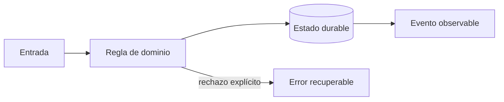
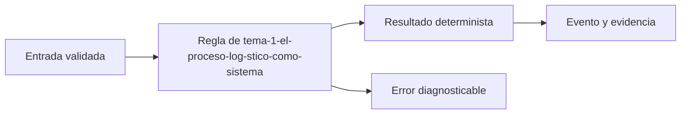
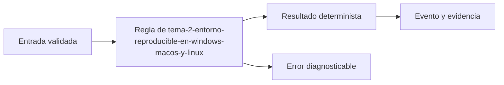

# Módulo 0: RutaFlow desde cero: producto, entorno y dominio


## Antes de comenzar: instala y comprueba el entorno

Necesitas Git, un editor, Docker Desktop o Docker Engine, Node.js LTS, Python 3.12+, Java 21, Flutter estable y `make` opcional. En **Windows**, instala WSL 2 con Ubuntu, activa virtualización y ejecuta el repositorio dentro del sistema de archivos de WSL. En **macOS**, instala Xcode Command Line Tools; Homebrew facilita herramientas pero no es obligatorio. En **Linux**, instala Git y Docker desde la documentación de tu distribución y agrega tu usuario al grupo de Docker solo si comprendes su alcance de privilegios. Flutter exige Android Studio y Android SDK para Android; Xcode solo está disponible en macOS para iOS.

Valida una herramienta a la vez: `git --version`, `docker version`, `node --version`, `python3 --version`, `java --version` y `flutter doctor -v`. No continúes ante una marca roja relacionada con la plataforma que usarás. Después crea una carpeta vacía, inicializa Git, copia `.env.example` a `.env` sin secretos reales y levanta PostgreSQL con Compose. El primer criterio de éxito no es «instalé algo», sino que una prueba pueda conectarse, crear un envío y eliminar los datos de prueba de manera repetible.

### Si la instalación falla, no continúes a ciegas

Diagnostica una capa cada vez. Si aparece **command not found** o **no se reconoce como un comando**, cierra y abre la terminal y vuelve a ejecutar el comando de versión; si continúa, la herramienta no está en `PATH`. Si `docker version` muestra el cliente pero no el servidor, Docker Desktop no terminó de iniciar o el servicio Docker está detenido. En Windows con WSL, no mezcles un repositorio guardado en `C:\` con comandos ejecutados parcialmente dentro de Linux: guarda el proyecto bajo tu carpeta de usuario de WSL y usa una sola terminal para ese laboratorio. Si `flutter doctor -v` muestra una marca roja, resuelve solo la plataforma que vas a usar primero; Xcode no puede instalarse en Windows o Linux.

Cuando un puerto esté ocupado, identifica el proceso antes de cambiar números al azar: `docker compose ps`, `docker ps` y los logs del servicio deben explicar qué está ejecutándose. Si PostgreSQL arranca pero la aplicación no conecta, compara host, puerto, usuario y nombre de base de `.env` con `docker compose.yml`; desde otro contenedor el host suele ser el nombre del servicio, mientras que desde tu computador suele ser `localhost`. Guarda la salida exacta del comando que falló: esa evidencia permite pedir ayuda sin depender de frases vagas como «no funciona».

No reinstales todo como primer intento. Anota: sistema operativo, comando ejecutado, carpeta actual (`pwd` o `Get-Location`), versión observada, mensaje completo y último paso que funcionó. Corrige la primera causa comprobable y repite la verificación antes de avanzar.

## Ruta de proyecto progresivo desde carpeta vacía

Cada módulo agrega una vertical ejecutable al mismo repositorio: primero dominio; luego persistencia; API; web; móvil; optimización y tiempo real; finanzas; finalmente despliegue y operación. Cada entrega conserva README, ADR, prueba automatizada, comandos de ejecución y una demostración breve. No se copia una solución final: se avanza con commits pequeños y se registra por qué cambió el diseño.

## Aprende construyendo

### Tema 1: El proceso logístico como sistema

**Conceptos clave:** actores, comandos, eventos, estados, invariantes y límites.

Una guía pasa por admisión, clasificación, asignación, tránsito, intento y entrega. El estado resume el presente; el evento conserva el hecho ocurrido. Cliente, operador, conductor, tesorería y soporte observan el mismo envío con permisos y necesidades diferentes. Una invariante como «una entrega confirmada no vuelve a tránsito» pertenece al dominio y no a una pantalla. El criterio no es memorizar la herramienta, sino poder predecir qué sucede ante duplicados, datos incompletos, concurrencia, pérdida de red o permisos insuficientes. Documenta supuestos y mide antes de optimizar.

**Analogía:** Es como un expediente clínico: el diagnóstico actual resume, pero la historia explica cómo se llegó allí.

**¿Por qué es importante?** Porque evita que cada aplicación invente reglas contradictorias y permite auditar decisiones. En RutaFlow la decisión se valida con una prueba automatizada y una observación operativa, no solo con una captura de pantalla.

**Casos de uso reales:** estudia el flujo normal, un reintento, un dato tardío y un acceso sin permiso. Dibuja primero el flujo y marca dónde puede fallar.

**Diagrama:**



#### Paso 1 · Objetivo y preparación

Al finalizar podrás construir y verificar **Tema 1: El proceso logístico como sistema** dentro de RutaFlow, empezando desde una carpeta vacía y explicando qué decisión técnica resuelve. **Conocimiento previo:** terminal, Git y lectura de JSON.

#### Paso 2 · Contexto y caso real

**¿Por qué es importante?** En una plataforma de entregas, tema 1: el proceso logístico como sistema afecta directamente la trazabilidad, la seguridad y la capacidad de recuperar un fallo. Separar la decisión del detalle de infraestructura permite probarla antes de desplegarla y evita que una pantalla o un proveedor externo se convierta en la única fuente de verdad.

**Caso real:** una entrega puede repetirse, llegar fuera de orden o quedarse sin conexión. El diseño debe conservar una salida determinista y una evidencia que otra persona pueda revisar.

#### Paso 3 · Teoría, conceptos y analogía

**Conceptos clave:** contrato, estado, evidencia, idempotencia, observabilidad y límite de responsabilidad. Piensa en este tema como una estación de clasificación: recibe una entrada con formato conocido, aplica una regla explícita y entrega una salida que puede auditarse. Si una regla no se puede observar ni probar, todavía no es una parte confiable del sistema.

**Analogía:** es como una guía de despacho: cada paquete tiene una etiqueta, una operación responsable y una marca que demuestra qué ocurrió.



#### Paso 4 · Demostración guiada desde cero

Crea una carpeta independiente para comprobar el concepto antes de conectarlo al monorepo. Después crea `src/tema.js`:

```bash
mkdir -p rutaflow-labs/tema-1-el-proceso-log-stico-como-sistema
cd rutaflow-labs/tema-1-el-proceso-log-stico-como-sistema
printf '%s\n' '{"tema":"Tema 1: El proceso logístico como sistema","estado":"preparado"}' > evidencia.json
cat evidencia.json
```

```javascript
// La entrada representa un contrato mínimo y verificable.
const entrada = { tema: 'Tema 1: El proceso logístico como sistema', estado: 'preparado' };
const salida = { ...entrada, evidencia: true };
console.log(JSON.stringify(salida));
```

Ejecuta la comprobación desde `rutaflow-labs/tema-1-el-proceso-log-stico-como-sistema/`:

```bash
node -e "const fs=require('fs'); const x=JSON.parse(fs.readFileSync('evidencia.json','utf8')); if (!x.tema) throw new Error('Falta tema'); console.log('OK', x.tema);"
```

**Resultado esperado:** el comando imprime `OK` y el nombre del tema; `evidencia.json` conserva una entrada reproducible.

**Fallo deliberado:** cambia `tema` por una cadena vacía y ejecuta de nuevo. El proceso debe fallar con `Falta tema`; diagnostica leyendo la primera causa, corrige solo ese dato y repite la prueba.

#### Paso 5 · Práctica guiada

1. Añade un campo `version` y rechaza valores menores que `1`.
2. Registra una salida JSON de éxito y otra de error sin mezclar ambas.
3. Pista: valida la entrada antes de ejecutar la regla y conserva el mensaje original del error.

#### Paso 6 · Práctica independiente

Implementa una función `procesarEntrada(entrada)` que devuelva una salida determinista, rechace entradas incompletas y pueda ejecutarse dos veces sin duplicar evidencia. No copies la solución del paso anterior; escribe primero el contrato y después el código.

#### Paso 7 · Cierre, evidencia y proyecto

Entrega el archivo `evidencia.json`, la salida `OK`, la salida del fallo deliberado y una breve explicación de la decisión. El siguiente tema conecta este incremento con el proyecto RutaFlow: **Tema 1: El proceso logístico como sistema** debe convertirse en una capacidad comprobable, observable y recuperable. **Fuente oficial:** [https://developer.mozilla.org/en-US/docs/Learn_web_development](https://developer.mozilla.org/en-US/docs/Learn_web_development).

**Errores comunes:** ejecutar desde otra carpeta; validar después de mutar el estado; ocultar el mensaje original del error; no conservar evidencia; asumir que un proveedor externo siempre responde.
### Tema 2: Entorno reproducible en Windows, macOS y Linux

**Conceptos clave:** Git, editor, runtimes, contenedores, variables y diagnóstico.

El punto de partida será un monorepo con apps, servicios, paquetes, infraestructura y documentación. En Windows se recomienda WSL 2; en macOS, Homebrew es opcional; en Linux se usa el gestor de la distribución. Docker no sustituye comprender puertos, procesos y volúmenes. Cada instalación se valida con comandos de versión y una prueba mínima. El criterio no es memorizar la herramienta, sino poder predecir qué sucede ante duplicados, datos incompletos, concurrencia, pérdida de red o permisos insuficientes. Documenta supuestos y mide antes de optimizar.

**Analogía:** Es como una cocina profesional: importa la receta, pero también que todos midan con los mismos instrumentos.

**¿Por qué es importante?** Porque reduce el tiempo perdido por diferencias locales y vuelve repetible cada laboratorio. En RutaFlow la decisión se valida con una prueba automatizada y una observación operativa, no solo con una captura de pantalla.

**Casos de uso reales:** estudia el flujo normal, un reintento, un dato tardío y un acceso sin permiso. Dibuja primero el flujo y marca dónde puede fallar.

**Diagrama:**


#### Paso 1 · Objetivo y preparación

Al finalizar podrás construir y verificar **Tema 2: Entorno reproducible en Windows, macOS y Linux** dentro de RutaFlow, empezando desde una carpeta vacía y explicando qué decisión técnica resuelve. **Conocimiento previo:** terminal, Git y lectura de JSON.

#### Paso 2 · Contexto y caso real

**¿Por qué es importante?** En una plataforma de entregas, tema 2: entorno reproducible en windows, macos y linux afecta directamente la trazabilidad, la seguridad y la capacidad de recuperar un fallo. Separar la decisión del detalle de infraestructura permite probarla antes de desplegarla y evita que una pantalla o un proveedor externo se convierta en la única fuente de verdad.

**Caso real:** una entrega puede repetirse, llegar fuera de orden o quedarse sin conexión. El diseño debe conservar una salida determinista y una evidencia que otra persona pueda revisar.

#### Paso 3 · Teoría, conceptos y analogía

**Conceptos clave:** contrato, estado, evidencia, idempotencia, observabilidad y límite de responsabilidad. Piensa en este tema como una estación de clasificación: recibe una entrada con formato conocido, aplica una regla explícita y entrega una salida que puede auditarse. Si una regla no se puede observar ni probar, todavía no es una parte confiable del sistema.

**Analogía:** es como una guía de despacho: cada paquete tiene una etiqueta, una operación responsable y una marca que demuestra qué ocurrió.



#### Paso 4 · Demostración guiada desde cero

Crea una carpeta independiente para comprobar el concepto antes de conectarlo al monorepo. Después crea `src/tema.js`:

```bash
mkdir -p rutaflow-labs/tema-2-entorno-reproducible-en-windows-macos-y-linux
cd rutaflow-labs/tema-2-entorno-reproducible-en-windows-macos-y-linux
printf '%s\n' '{"tema":"Tema 2: Entorno reproducible en Windows, macOS y Linux","estado":"preparado"}' > evidencia.json
cat evidencia.json
```

```javascript
// La entrada representa un contrato mínimo y verificable.
const entrada = { tema: 'Tema 2: Entorno reproducible en Windows, macOS y Linux', estado: 'preparado' };
const salida = { ...entrada, evidencia: true };
console.log(JSON.stringify(salida));
```

Ejecuta la comprobación desde `rutaflow-labs/tema-2-entorno-reproducible-en-windows-macos-y-linux/`:

```bash
node -e "const fs=require('fs'); const x=JSON.parse(fs.readFileSync('evidencia.json','utf8')); if (!x.tema) throw new Error('Falta tema'); console.log('OK', x.tema);"
```

**Resultado esperado:** el comando imprime `OK` y el nombre del tema; `evidencia.json` conserva una entrada reproducible.

**Fallo deliberado:** cambia `tema` por una cadena vacía y ejecuta de nuevo. El proceso debe fallar con `Falta tema`; diagnostica leyendo la primera causa, corrige solo ese dato y repite la prueba.

#### Paso 5 · Práctica guiada

1. Añade un campo `version` y rechaza valores menores que `1`.
2. Registra una salida JSON de éxito y otra de error sin mezclar ambas.
3. Pista: valida la entrada antes de ejecutar la regla y conserva el mensaje original del error.

#### Paso 6 · Práctica independiente

Implementa una función `procesarEntrada(entrada)` que devuelva una salida determinista, rechace entradas incompletas y pueda ejecutarse dos veces sin duplicar evidencia. No copies la solución del paso anterior; escribe primero el contrato y después el código.

#### Paso 7 · Cierre, evidencia y proyecto

Entrega el archivo `evidencia.json`, la salida `OK`, la salida del fallo deliberado y una breve explicación de la decisión. El siguiente tema conecta este incremento con el proyecto RutaFlow: **Tema 2: Entorno reproducible en Windows, macOS y Linux** debe convertirse en una capacidad comprobable, observable y recuperable. **Fuente oficial:** [https://developer.mozilla.org/en-US/docs/Learn_web_development](https://developer.mozilla.org/en-US/docs/Learn_web_development).

**Errores comunes:** ejecutar desde otra carpeta; validar después de mutar el estado; ocultar el mensaje original del error; no conservar evidencia; asumir que un proveedor externo siempre responde.
### Tema 3: Arquitectura, privacidad y amenazas

**Conceptos clave:** monolito modular, límites, PII, mínimo privilegio y ADR.

Se comienza con un monolito modular porque despliegues distribuidos no corrigen un dominio confuso. Direcciones, teléfonos, fotografías y coordenadas son datos sensibles: se clasifican, minimizan, cifran y retienen solo el tiempo justificado. Un ADR registra contexto, decisión y consecuencias. El threat model estudia suplantación, manipulación, repudio, exposición y abuso de recursos. El criterio no es memorizar la herramienta, sino poder predecir qué sucede ante duplicados, datos incompletos, concurrencia, pérdida de red o permisos insuficientes. Documenta supuestos y mide antes de optimizar.

**Analogía:** Es como diseñar un edificio: primero se separan áreas y accesos; después se decide cuántos edificios hacen falta.

**¿Por qué es importante?** Porque la arquitectura queda guiada por riesgo y cambio, no por moda. En RutaFlow la decisión se valida con una prueba automatizada y una observación operativa, no solo con una captura de pantalla.

**Casos de uso reales:** estudia el flujo normal, un reintento, un dato tardío y un acceso sin permiso. Dibuja primero el flujo y marca dónde puede fallar.

**Diagrama:**


#### Paso 1 · Objetivo y preparación

Al finalizar podrás construir y verificar **Tema 3: Arquitectura, privacidad y amenazas** dentro de RutaFlow, empezando desde una carpeta vacía y explicando qué decisión técnica resuelve. **Conocimiento previo:** terminal, Git y lectura de JSON.

#### Paso 2 · Contexto y caso real

**¿Por qué es importante?** En una plataforma de entregas, tema 3: arquitectura, privacidad y amenazas afecta directamente la trazabilidad, la seguridad y la capacidad de recuperar un fallo. Separar la decisión del detalle de infraestructura permite probarla antes de desplegarla y evita que una pantalla o un proveedor externo se convierta en la única fuente de verdad.

**Caso real:** una entrega puede repetirse, llegar fuera de orden o quedarse sin conexión. El diseño debe conservar una salida determinista y una evidencia que otra persona pueda revisar.

#### Paso 3 · Teoría, conceptos y analogía

**Conceptos clave:** contrato, estado, evidencia, idempotencia, observabilidad y límite de responsabilidad. Piensa en este tema como una estación de clasificación: recibe una entrada con formato conocido, aplica una regla explícita y entrega una salida que puede auditarse. Si una regla no se puede observar ni probar, todavía no es una parte confiable del sistema.

**Analogía:** es como una guía de despacho: cada paquete tiene una etiqueta, una operación responsable y una marca que demuestra qué ocurrió.


#### Paso 4 · Demostración guiada desde cero

Crea una carpeta independiente para comprobar el concepto antes de conectarlo al monorepo. Después crea `src/tema.js`:

```bash
mkdir -p rutaflow-labs/tema-3-arquitectura-privacidad-y-amenazas
cd rutaflow-labs/tema-3-arquitectura-privacidad-y-amenazas
printf '%s\n' '{"tema":"Tema 3: Arquitectura, privacidad y amenazas","estado":"preparado"}' > evidencia.json
cat evidencia.json
```

```javascript
// La entrada representa un contrato mínimo y verificable.
const entrada = { tema: 'Tema 3: Arquitectura, privacidad y amenazas', estado: 'preparado' };
const salida = { ...entrada, evidencia: true };
console.log(JSON.stringify(salida));
```

Ejecuta la comprobación desde `rutaflow-labs/tema-3-arquitectura-privacidad-y-amenazas/`:

```bash
node -e "const fs=require('fs'); const x=JSON.parse(fs.readFileSync('evidencia.json','utf8')); if (!x.tema) throw new Error('Falta tema'); console.log('OK', x.tema);"
```

**Resultado esperado:** el comando imprime `OK` y el nombre del tema; `evidencia.json` conserva una entrada reproducible.

**Fallo deliberado:** cambia `tema` por una cadena vacía y ejecuta de nuevo. El proceso debe fallar con `Falta tema`; diagnostica leyendo la primera causa, corrige solo ese dato y repite la prueba.

#### Paso 5 · Práctica guiada

1. Añade un campo `version` y rechaza valores menores que `1`.
2. Registra una salida JSON de éxito y otra de error sin mezclar ambas.
3. Pista: valida la entrada antes de ejecutar la regla y conserva el mensaje original del error.

#### Paso 6 · Práctica independiente

Implementa una función `procesarEntrada(entrada)` que devuelva una salida determinista, rechace entradas incompletas y pueda ejecutarse dos veces sin duplicar evidencia. No copies la solución del paso anterior; escribe primero el contrato y después el código.

#### Paso 7 · Cierre, evidencia y proyecto

Entrega el archivo `evidencia.json`, la salida `OK`, la salida del fallo deliberado y una breve explicación de la decisión. El siguiente tema conecta este incremento con el proyecto RutaFlow: **Tema 3: Arquitectura, privacidad y amenazas** debe convertirse en una capacidad comprobable, observable y recuperable. **Fuente oficial:** [https://developer.mozilla.org/en-US/docs/Learn_web_development](https://developer.mozilla.org/en-US/docs/Learn_web_development).

**Errores comunes:** ejecutar desde otra carpeta; validar después de mutar el estado; ocultar el mensaje original del error; no conservar evidencia; asumir que un proveedor externo siempre responde.
