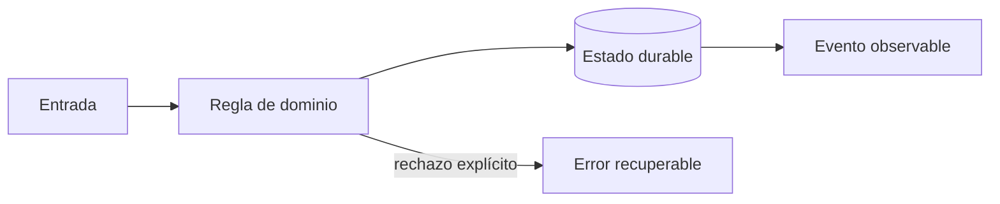

# Módulo 0: RutaFlow desde cero: producto, entorno y dominio

## Sílabo

**Objetivo general:** Convertir un proceso real de paquetería en un producto verificable antes de escoger frameworks.

Al terminar, podrás explicar las decisiones con vocabulario técnico sencillo, implementar una vertical funcional, provocar al menos un fallo y demostrar su recuperación. El producto de estudio es ficticio: evita copiar marcas, identidades o datos de una empresa real.

**Evaluación:** 20 % modelo y explicación, 40 % laboratorio ejecutable, 25 % pruebas y manejo de fallos, 15 % documentación y demostración.


## Antes de comenzar: instala y comprueba el entorno

Necesitas Git, un editor, Docker Desktop o Docker Engine, Node.js LTS, Python 3.12+, Java 21, Flutter estable y `make` opcional. En **Windows**, instala WSL 2 con Ubuntu, activa virtualización y ejecuta el repositorio dentro del sistema de archivos de WSL. En **macOS**, instala Xcode Command Line Tools; Homebrew facilita herramientas pero no es obligatorio. En **Linux**, instala Git y Docker desde la documentación de tu distribución y agrega tu usuario al grupo de Docker solo si comprendes su alcance de privilegios. Flutter exige Android Studio y Android SDK para Android; Xcode solo está disponible en macOS para iOS.

Valida una herramienta a la vez: `git --version`, `docker version`, `node --version`, `python3 --version`, `java --version` y `flutter doctor -v`. No continúes ante una marca roja relacionada con la plataforma que usarás. Después crea una carpeta vacía, inicializa Git, copia `.env.example` a `.env` sin secretos reales y levanta PostgreSQL con Compose. El primer criterio de éxito no es «instalé algo», sino que una prueba pueda conectarse, crear un envío y eliminar los datos de prueba de manera repetible.

### Si la instalación falla, no continúes a ciegas

Diagnostica una capa cada vez. Si aparece **command not found** o **no se reconoce como un comando**, cierra y abre la terminal y vuelve a ejecutar el comando de versión; si continúa, la herramienta no está en `PATH`. Si `docker version` muestra el cliente pero no el servidor, Docker Desktop no terminó de iniciar o el servicio Docker está detenido. En Windows con WSL, no mezcles un repositorio guardado en `C:\` con comandos ejecutados parcialmente dentro de Linux: guarda el proyecto bajo tu carpeta de usuario de WSL y usa una sola terminal para ese laboratorio. Si `flutter doctor -v` muestra una marca roja, resuelve solo la plataforma que vas a usar primero; Xcode no puede instalarse en Windows o Linux.

Cuando un puerto esté ocupado, identifica el proceso antes de cambiar números al azar: `docker compose ps`, `docker ps` y los logs del servicio deben explicar qué está ejecutándose. Si PostgreSQL arranca pero la aplicación no conecta, compara host, puerto, usuario y nombre de base de `.env` con `docker compose.yml`; desde otro contenedor el host suele ser el nombre del servicio, mientras que desde tu computador suele ser `localhost`. Guarda la salida exacta del comando que falló: esa evidencia permite pedir ayuda sin depender de frases vagas como «no funciona».

No reinstales todo como primer intento. Anota: sistema operativo, comando ejecutado, carpeta actual (`pwd` o `Get-Location`), versión observada, mensaje completo y último paso que funcionó. Corrige la primera causa comprobable y repite la verificación antes de avanzar.

## Ruta de proyecto progresivo desde carpeta vacía

Cada módulo agrega una vertical ejecutable al mismo repositorio: primero dominio; luego persistencia; API; web; móvil; optimización y tiempo real; finanzas; finalmente despliegue y operación. Cada entrega conserva README, ADR, prueba automatizada, comandos de ejecución y una demostración breve. No se copia una solución final: se avanza con commits pequeños y se registra por qué cambió el diseño.


## Contenido teórico

### Tema 1: El proceso logístico como sistema

**Conceptos clave:** actores, comandos, eventos, estados, invariantes y límites.

Una guía pasa por admisión, clasificación, asignación, tránsito, intento y entrega. El estado resume el presente; el evento conserva el hecho ocurrido. Cliente, operador, conductor, tesorería y soporte observan el mismo envío con permisos y necesidades diferentes. Una invariante como «una entrega confirmada no vuelve a tránsito» pertenece al dominio y no a una pantalla. El criterio no es memorizar la herramienta, sino poder predecir qué sucede ante duplicados, datos incompletos, concurrencia, pérdida de red o permisos insuficientes. Documenta supuestos y mide antes de optimizar.

**Analogía:** Es como un expediente clínico: el diagnóstico actual resume, pero la historia explica cómo se llegó allí.

**¿Por qué es importante?** Porque evita que cada aplicación invente reglas contradictorias y permite auditar decisiones. En RutaFlow la decisión se valida con una prueba automatizada y una observación operativa, no solo con una captura de pantalla.

**Casos de uso reales:** estudia el flujo normal, un reintento, un dato tardío y un acceso sin permiso. Dibuja primero el flujo y marca dónde puede fallar.

**Diagrama:**


### Tema 2: Entorno reproducible en Windows, macOS y Linux

**Conceptos clave:** Git, editor, runtimes, contenedores, variables y diagnóstico.

El punto de partida será un monorepo con apps, servicios, paquetes, infraestructura y documentación. En Windows se recomienda WSL 2; en macOS, Homebrew es opcional; en Linux se usa el gestor de la distribución. Docker no sustituye comprender puertos, procesos y volúmenes. Cada instalación se valida con comandos de versión y una prueba mínima. El criterio no es memorizar la herramienta, sino poder predecir qué sucede ante duplicados, datos incompletos, concurrencia, pérdida de red o permisos insuficientes. Documenta supuestos y mide antes de optimizar.

**Analogía:** Es como una cocina profesional: importa la receta, pero también que todos midan con los mismos instrumentos.

**¿Por qué es importante?** Porque reduce el tiempo perdido por diferencias locales y vuelve repetible cada laboratorio. En RutaFlow la decisión se valida con una prueba automatizada y una observación operativa, no solo con una captura de pantalla.

**Casos de uso reales:** estudia el flujo normal, un reintento, un dato tardío y un acceso sin permiso. Dibuja primero el flujo y marca dónde puede fallar.

**Diagrama:**


### Tema 3: Arquitectura, privacidad y amenazas

**Conceptos clave:** monolito modular, límites, PII, mínimo privilegio y ADR.

Se comienza con un monolito modular porque despliegues distribuidos no corrigen un dominio confuso. Direcciones, teléfonos, fotografías y coordenadas son datos sensibles: se clasifican, minimizan, cifran y retienen solo el tiempo justificado. Un ADR registra contexto, decisión y consecuencias. El threat model estudia suplantación, manipulación, repudio, exposición y abuso de recursos. El criterio no es memorizar la herramienta, sino poder predecir qué sucede ante duplicados, datos incompletos, concurrencia, pérdida de red o permisos insuficientes. Documenta supuestos y mide antes de optimizar.

**Analogía:** Es como diseñar un edificio: primero se separan áreas y accesos; después se decide cuántos edificios hacen falta.

**¿Por qué es importante?** Porque la arquitectura queda guiada por riesgo y cambio, no por moda. En RutaFlow la decisión se valida con una prueba automatizada y una observación operativa, no solo con una captura de pantalla.

**Casos de uso reales:** estudia el flujo normal, un reintento, un dato tardío y un acceso sin permiso. Dibuja primero el flujo y marca dónde puede fallar.

**Diagrama:**


## Criterio transversal de calidad del código

Usa nombres del dominio (`confirmDelivery`, no `processData`), funciones pequeñas con una responsabilidad observable y errores tipados que conserven causa y contexto sin revelar secretos. Primero escribe una prueba del comportamiento o del fallo que quieres controlar; luego implementa la solución más simple. Aplica SOLID cuando existe presión real de cambio: separa políticas de infraestructura, invierte dependencias en límites externos y evita interfaces enormes. No abstraer antes de encontrar repetición con el mismo significado. Revisa corrección, claridad, cohesión, seguridad, complejidad y capacidad de operación; Clean Code no justifica ocultar costes ni crear capas ceremoniales.


## Laboratorio práctico

Trabaja sobre `examples/rutaflow` y crea una rama para el módulo. Empieza con una prueba roja que represente la regla central; implementa el camino mínimo y luego agrega un fallo deliberado. Ejecuta linters y pruebas desde terminal para que el resultado no dependa del editor.

1. Dibuja el flujo entrada → regla → persistencia → evento → interfaz y escribe dos invariantes.
2. Implementa una vertical pequeña con tipos explícitos y un límite de infraestructura sustituible.
3. Añade pruebas para éxito, entrada inválida, repetición y dependencia no disponible.
4. Registra logs estructurados sin PII, una métrica de resultado y un correlation ID.
5. Explica en el README cómo iniciar, verificar, detener y limpiar el laboratorio.

Usa este contrato como guía, adaptándolo al lenguaje del módulo:

```text
Given un envío existente y una identidad autorizada
When se ejecuta el comando con una clave idempotente
Then cambia una sola vez, persiste un evento y expone el mismo resultado ante reintento
```

**Definición de terminado:** otra persona puede clonar el repositorio, seguir instrucciones, ejecutar la prueba, observar el fallo controlado y comprender la decisión sin preguntarte qué botón presionar.

## Ejercicios de evaluación

### Ejercicio 1: explica antes de programar

Construye un diagrama propio, define tres términos con palabras cotidianas y señala un supuesto peligroso. Contrasta estado y evento, estimación y hecho, o identidad y permiso según corresponda.

### Ejercicio 2: rompe la solución

Introduce duplicación, concurrencia, pérdida de conexión o datos fuera de orden. Conserva la prueba que reproduce el defecto y corrige la causa sin capturar todas las excepciones ni esconder el error.

### Ejercicio 3: decisión profesional

Escribe un ADR de una página con contexto, dos alternativas, decisión, consecuencias, señal que obligaría a revisarla y fuente oficial consultada. Incluye una consideración de accesibilidad, privacidad o coste.

## Rúbrica del proyecto

| Criterio | Inicial | Competente | Profesional |
|---|---|---|---|
| Fundamento | Repite términos | Explica la decisión | Compara alternativas y límites |
| Funcionamiento | Solo camino feliz | Maneja fallos previstos | Demuestra recuperación e idempotencia |
| Código | Acoplado y ambiguo | Claro y probado | Límites cohesionados y deuda explícita |
| Datos y seguridad | Usa datos reales | Minimiza y autoriza | Audita, retiene y modela amenazas |
| Operación | Requiere pasos ocultos | README reproducible | Métricas, runbook y evidencia |

## Bibliografía y fundamento académico

- Documentación oficial de las tecnologías enlazadas desde el panel **Actualizaciones oficiales** de la Academia; verifica versión y fecha antes de aplicar una API.
- Eric Evans, *Domain-Driven Design*, para lenguaje ubicuo, agregados e invariantes.
- Martin Kleppmann, *Designing Data-Intensive Applications*, para datos, replicación, streams y fallos.
- NIST Secure Software Development Framework y OWASP ASVS/MASVS, para ciclo de desarrollo y controles verificables.
- Google SRE Book y SRE Workbook, para SLI, SLO, presupuesto de error e incidentes.
- W3C WCAG, RFC de HTTP y OpenTelemetry Specification cuando la decisión afecte accesibilidad, contratos u observabilidad.

Las fuentes son punto de partida, no autoridad incuestionable: registra versión, distingue norma de recomendación y valida cada afirmación con un experimento reproducible.

## Resumen del módulo

Este capítulo conecta fundamento, implementación y operación. Debes poder contar qué problema resolviste, qué invariante protegiste, cómo comprobaste el comportamiento y qué límite conserva la solución. La evidencia final incluye código, pruebas, diagrama, ADR y demostración; completar una lista de temas sin poder explicar los fallos no representa dominio profesional.
