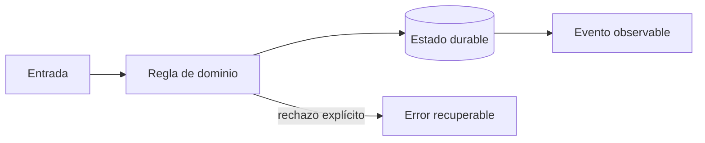
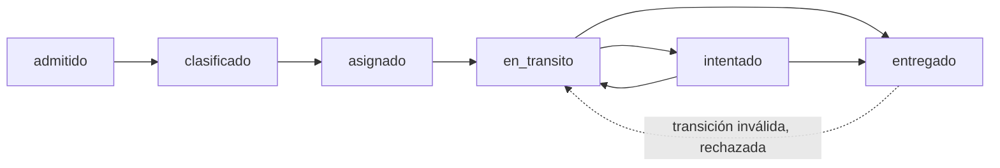
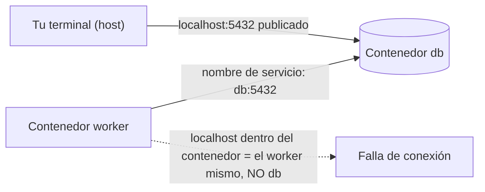
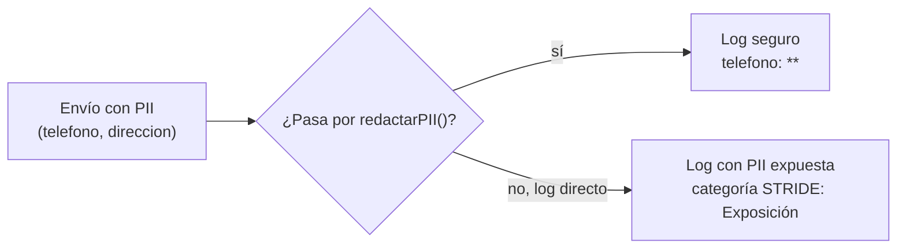

# Módulo 0: RutaFlow desde cero: producto, entorno y dominio


## Antes de comenzar: instala y comprueba el entorno

Necesitas Git, un editor, Docker Desktop o Docker Engine, Node.js LTS, Python 3.12+, Java 21, Flutter estable y `make` opcional. En **Windows**, instala WSL 2 con Ubuntu, activa virtualización y ejecuta el repositorio dentro del sistema de archivos de WSL. En **macOS**, instala Xcode Command Line Tools; Homebrew facilita herramientas pero no es obligatorio. En **Linux**, instala Git y Docker desde la documentación de tu distribución y agrega tu usuario al grupo de Docker solo si comprendes su alcance de privilegios. Flutter exige Android Studio y Android SDK para Android; Xcode solo está disponible en macOS para iOS.

Valida una herramienta a la vez: `git --version`, `docker version`, `node --version`, `python3 --version`, `java --version` y `flutter doctor -v`. No continúes ante una marca roja relacionada con la plataforma que usarás. Después crea una carpeta vacía, inicializa Git, copia `.env.example` a `.env` sin secretos reales y levanta PostgreSQL con Compose. El primer criterio de éxito no es «instalé algo», sino que una prueba pueda conectarse, crear un envío y eliminar los datos de prueba de manera repetible.

### Si la instalación falla, no continúes a ciegas

Diagnostica una capa cada vez. Si aparece **command not found** o **no se reconoce como un comando**, cierra y abre la terminal y vuelve a ejecutar el comando de versión; si continúa, la herramienta no está en `PATH`. Si `docker version` muestra el cliente pero no el servidor, Docker Desktop no terminó de iniciar o el servicio Docker está detenido. En Windows con WSL, no mezcles un repositorio guardado en `C:\` con comandos ejecutados parcialmente dentro de Linux: guarda el proyecto bajo tu carpeta de usuario de WSL y usa una sola terminal para ese laboratorio. Si `flutter doctor -v` muestra una marca roja, resuelve solo la plataforma que vas a usar primero; Xcode no puede instalarse en Windows o Linux.

Cuando un puerto esté ocupado, identifica el proceso antes de cambiar números al azar: `docker compose ps`, `docker ps` y los logs del servicio deben explicar qué está ejecutándose. Si PostgreSQL arranca pero la aplicación no conecta, compara host, puerto, usuario y nombre de base de `.env` con `docker compose.yml`; desde otro contenedor el host suele ser el nombre del servicio, mientras que desde tu computador suele ser `localhost`. Guarda la salida exacta del comando que falló: esa evidencia permite pedir ayuda sin depender de frases vagas como «no funciona».

No reinstales todo como primer intento. Anota: sistema operativo, comando ejecutado, carpeta actual (`pwd` o `Get-Location`), versión observada, mensaje completo y último paso que funcionó. Corrige la primera causa comprobable y repite la verificación antes de avanzar.

## Ruta de proyecto progresivo desde carpeta vacía

Cada módulo agrega una vertical ejecutable al mismo repositorio: primero dominio; luego persistencia; API; web; móvil; optimización y tiempo real; finanzas; finalmente despliegue y operación. Cada entrega conserva README, ADR, prueba automatizada, comandos de ejecución y una demostración breve. No se copia una solución final: se avanza con commits pequeños y se registra por qué cambió el diseño.

## Aprende construyendo

### Tema 1: El proceso logístico como sistema

**Conceptos clave:** actores, comandos, eventos, estados, invariantes y límites.

Una guía pasa por admisión, clasificación, asignación, tránsito, intento y entrega. El estado resume el presente; el evento conserva el hecho ocurrido. Cliente, operador, conductor, tesorería y soporte observan el mismo envío con permisos y necesidades diferentes. Una invariante como «una entrega confirmada no vuelve a tránsito» pertenece al dominio y no a una pantalla. El criterio no es memorizar la herramienta, sino poder predecir qué sucede ante duplicados, datos incompletos, concurrencia, pérdida de red o permisos insuficientes. Documenta supuestos y mide antes de optimizar.

**Analogía:** Es como un expediente clínico: el diagnóstico actual resume, pero la historia explica cómo se llegó allí.

**¿Por qué es importante?** Porque evita que cada aplicación invente reglas contradictorias y permite auditar decisiones. En RutaFlow la decisión se valida con una prueba automatizada y una observación operativa, no solo con una captura de pantalla.

**Casos de uso reales:** estudia el flujo normal, un reintento, un dato tardío y un acceso sin permiso. Dibuja primero el flujo y marca dónde puede fallar.

**Diagrama:**


```mermaid
flowchart LR
  A[Entrada] --> B[Regla de dominio]
  B --> C[(Estado durable)]
  C --> D[Evento observable]
  B -->|rechazo explícito| E[Error recuperable]
```

#### Paso 1 · Objetivo y preparación

Al finalizar podrás construir y verificar **Tema 1: El proceso logístico como sistema** dentro de RutaFlow, empezando desde una carpeta vacía y explicando qué decisión técnica resuelve. **Conocimiento previo:** terminal, Git y lectura de JSON.

#### Paso 2 · Contexto y caso real

**¿Por qué es importante?** `RF-4471` puede pasar por `admitido → clasificado → asignado → en_tránsito → entregado`, o desviarse a `intentado` si el conductor no encuentra al destinatario. Si el estado "entregado" no es realmente terminal en el código (solo en la documentación), un reintento de red o un webhook duplicado puede regresar silenciosamente un envío ya entregado a "en_tránsito", corrompiendo la trazabilidad que tesorería usa para facturar y que soporte usa para responder reclamos.

**Caso real:** dos eventos de un mismo proveedor de GPS llegan fuera de orden por una reconexión de red; si el sistema aplica el segundo evento sin validar la transición, el estado queda inconsistente con la historia real del envío.

#### Paso 3 · Teoría, conceptos y analogía

Un envío no es solo un registro mutable con un campo `estado`: es una secuencia de **eventos** (hechos ya ocurridos, inmutables) de la cual el estado actual es una proyección. Modelar las transiciones válidas explícitamente (una tabla o función que dice qué estados siguen a cuáles) convierte una invariante de negocio ("un envío entregado es terminal") en código que falla de forma ruidosa ante una transición ilegal, en vez de una regla que solo vive en un documento y que cualquier pantalla nueva puede violar sin darse cuenta.

**Analogía:** es como un semáforo con una secuencia fija de colores: no existe un botón que lleve de "rojo" directo a "verde intermedio" ya usado; cada estado solo permite avanzar a los siguientes estados válidos de la secuencia, nunca retroceder a uno ya cerrado.


```mermaid
flowchart LR
  A[admitido] --> B[clasificado]
  B --> C[asignado]
  C --> D[en_transito]
  D --> E[intentado]
  D --> F[entregado]
  E --> D
  E --> F
  F -.->|transición inválida, rechazada| D
```

#### Paso 4 · Demostración guiada desde cero

```bash
mkdir -p rutaflow-labs/tema-1-proceso-logistico/src
cd rutaflow-labs/tema-1-proceso-logistico
```

Crea `src/envio-estado.js`:

```javascript
// Tabla explícita de transiciones válidas: "entregado" no tiene salidas, es terminal.
const TRANSICIONES_VALIDAS = {
  admitido: ['clasificado'],
  clasificado: ['asignado'],
  asignado: ['en_transito'],
  en_transito: ['intentado', 'entregado'],
  intentado: ['en_transito', 'entregado'],
  entregado: [],
};

function transicionar(envio, nuevoEstado) {
  const permitidas = TRANSICIONES_VALIDAS[envio.estado] ?? [];
  if (!permitidas.includes(nuevoEstado)) {
    throw new Error(`Transición inválida: ${envio.estado} -> ${nuevoEstado}`);
  }
  return { ...envio, estado: nuevoEstado, eventos: [...envio.eventos, { tipo: nuevoEstado, en: new Date().toISOString() }] };
}

module.exports = { transicionar };
```

```bash
node -e "
const { transicionar } = require('./src/envio-estado.js');
let envio = { id: 'RF-4471', estado: 'admitido', eventos: [] };
envio = transicionar(envio, 'clasificado');
envio = transicionar(envio, 'asignado');
envio = transicionar(envio, 'en_transito');
envio = transicionar(envio, 'entregado');
console.log('OK', envio.estado, envio.eventos.length, 'eventos');
"
```

**Resultado esperado:** `OK entregado 4 eventos` — el envío avanzó por la secuencia completa y acumuló un evento inmutable por cada transición.

**Fallo deliberado:** con el mismo `envio` ya en estado `entregado`, llamá `transicionar(envio, 'en_transito')` de nuevo. La función lanza `Transición inválida: entregado -> en_transito`: la invariante "una entrega confirmada no vuelve a tránsito" ahora es código ejecutable, no solo una frase en la documentación — un evento duplicado o fuera de orden que intente esa transición es rechazado explícitamente, no aplicado en silencio.

#### Paso 5 · Práctica guiada

1. Agregá el estado `cancelado`, alcanzable solo desde `admitido`, `clasificado` o `asignado` (nunca desde `en_transito` en adelante).
2. Confirmá que `transicionar({estado: 'en_transito', ...}, 'cancelado')` lanza el mismo error de transición inválida que el caso de "entregado" del Paso 4.
3. Pista: agregá la entrada nueva a `TRANSICIONES_VALIDAS` primero; el chequeo de `permitidas.includes(...)` ya cubre el resto sin tocar `transicionar`.

#### Paso 6 · Práctica independiente

Escribí una función `reconstruirEstado(eventos)` que, dada solo la lista de `envio.eventos` (sin el campo `estado` guardado), reproduzca secuencialmente las transiciones y devuelva el estado final — y confirmá con una aserción que ese estado reconstruido coincide exactamente con `envio.estado` guardado directamente. Esto es una verificación mínima de "estado derivado de eventos" (event sourcing simplificado): si alguna vez difieren, el bug está en cómo se aplicó algún evento, no en el estado guardado.

#### Paso 7 · Cierre y evidencia

Entregá la secuencia completa de transiciones válidas del Paso 4, el error de invariante al intentar reabrir un envío entregado, el estado `cancelado` del Paso 5 y la reconstrucción por eventos del Paso 6; explicá por qué una invariante de negocio como "entregado es terminal" debe vivir como código en el dominio, no solo como una regla documentada que cada pantalla nueva podría ignorar. Como siguiente paso, en el Tema 2 preparás el entorno reproducible (Docker Compose) para correr este mismo dominio junto a una base de datos real. **Fuente oficial:** [https://martinfowler.com/eaaDev/EventSourcing.html](https://martinfowler.com/eaaDev/EventSourcing.html).

**Errores comunes:** guardar solo el estado final y descartar los eventos que lo produjeron; validar la transición después de haber mutado el objeto en vez de antes; tratar "entregado" como un estado más en vez de terminal; aceptar un evento duplicado sin comparar contra el estado actual.
### Tema 2: Entorno reproducible en Windows, macOS y Linux

**Conceptos clave:** Git, editor, runtimes, contenedores, variables y diagnóstico.

El punto de partida será un monorepo con apps, servicios, paquetes, infraestructura y documentación. En Windows se recomienda WSL 2; en macOS, Homebrew es opcional; en Linux se usa el gestor de la distribución. Docker no sustituye comprender puertos, procesos y volúmenes. Cada instalación se valida con comandos de versión y una prueba mínima. El criterio no es memorizar la herramienta, sino poder predecir qué sucede ante duplicados, datos incompletos, concurrencia, pérdida de red o permisos insuficientes. Documenta supuestos y mide antes de optimizar.

**Analogía:** Es como una cocina profesional: importa la receta, pero también que todos midan con los mismos instrumentos.

**¿Por qué es importante?** Porque reduce el tiempo perdido por diferencias locales y vuelve repetible cada laboratorio. En RutaFlow la decisión se valida con una prueba automatizada y una observación operativa, no solo con una captura de pantalla.

**Casos de uso reales:** estudia el flujo normal, un reintento, un dato tardío y un acceso sin permiso. Dibuja primero el flujo y marca dónde puede fallar.

**Diagrama:**


```mermaid
flowchart LR
  A[Entrada] --> B[Regla de dominio]
  B --> C[(Estado durable)]
  C --> D[Evento observable]
  B -->|rechazo explícito| E[Error recuperable]
```

#### Paso 1 · Objetivo y preparación

Al finalizar podrás construir y verificar **Tema 2: Entorno reproducible en Windows, macOS y Linux** dentro de RutaFlow, empezando desde una carpeta vacía y explicando qué decisión técnica resuelve. **Conocimiento previo:** terminal, Git y lectura de JSON.

#### Paso 2 · Contexto y caso real

**¿Por qué es importante?** Un script que conecta a PostgreSQL funciona perfecto cuando lo corrés directo en tu terminal, pero falla con un error de resolución de nombre apenas lo movés a correr dentro de otro contenedor Docker — "funciona en mi máquina" casi siempre es, en el fondo, una confusión entre la red del host y la red interna que Docker Compose crea entre sus propios contenedores.

**Caso real:** el equipo agrega un segundo servicio (por ejemplo, un worker) al `docker-compose.yml` y copia la misma `DATABASE_URL` que usaba el script de la terminal, con `localhost` como host; el worker no puede conectar, porque `localhost` dentro de un contenedor se refiere al contenedor mismo, no al contenedor de la base de datos ni al host.

#### Paso 3 · Teoría, conceptos y analogía

Docker Compose crea una red interna donde cada servicio es accesible por su **nombre de servicio** (el que aparece como clave en `docker-compose.yml`) desde los OTROS contenedores de esa misma red — nunca por `localhost`, que dentro de un contenedor siempre apunta al contenedor mismo. Desde tu terminal (el host), en cambio, un puerto publicado con `ports:` sí es alcanzable por `localhost`, porque el host no es parte de esa red interna. Son dos redes distintas con reglas de resolución de nombres distintas, y confundirlas produce el clásico "funciona en mi máquina, no en el contenedor" (o viceversa).

**Analogía:** es como el conmutador interno de una oficina frente a la línea externa: marcar la extensión "203" solo funciona entre teléfonos internos conectados al mismo conmutador; alguien llamando desde afuera necesita el número público completo, y confundir ambos solo produce un tono de error, no una llamada equivocada.


```mermaid
flowchart LR
  H["Tu terminal (host)"] -->|localhost:5432 publicado| DB[(Contenedor db)]
  W["Contenedor worker"] -->|nombre de servicio: db:5432| DB
  W -.->|localhost dentro del contenedor = el worker mismo, NO db| X[Falla de conexión]
```

#### Paso 4 · Demostración guiada desde cero

```bash
mkdir -p rutaflow-labs/tema-2-entorno-reproducible
cd rutaflow-labs/tema-2-entorno-reproducible
```

Crea `docker-compose.yml`:

```yaml
services:
  db:
    image: postgres:16-alpine
    environment:
      POSTGRES_PASSWORD: rutaflow
      POSTGRES_DB: rutaflow
    ports:
      - "5432:5432"
```

```bash
docker compose up -d
docker compose ps
```

Crea `verificar.js` y ejecutalo DESDE TU TERMINAL (fuera de cualquier contenedor):

```javascript
const net = require('net');
const socket = net.createConnection({ host: 'localhost', port: 5432 }, () => {
  console.log('OK: localhost:5432 alcanzable desde el host');
  socket.end();
});
socket.on('error', (e) => { console.error('FALLÓ:', e.message); process.exit(1); });
```

```bash
node verificar.js
```

**Resultado esperado:** `OK: localhost:5432 alcanzable desde el host` — el puerto publicado por `ports:` sí responde desde tu terminal.

**Fallo deliberado:** cambiá `host: 'localhost'` por `host: 'db'` en `verificar.js` y volvé a ejecutarlo DESDE TU TERMINAL (no dentro de Docker). Falla con un error de DNS (`ENOTFOUND db` o equivalente): el nombre de servicio `db` solo es resoluble dentro de la red interna que Docker Compose crea entre SUS PROPIOS contenedores — tu terminal no es parte de esa red, así que no tiene ninguna forma de resolver ese nombre.

#### Paso 5 · Práctica guiada

1. Corré `docker compose run --rm --network container:db sh -c "true"` no es necesario; en su lugar, agregá un segundo servicio `app` minimalista al `docker-compose.yml` (imagen `node:22-alpine`, sin comando fijo) para tener un segundo contenedor en la misma red.
2. Copiá `verificar.js` dentro de ese servicio (bind mount) y ejecutalo con `docker compose run --rm app node verificar.js` usando `host: 'db'`. Pista: ahora SÍ debería conectar, porque ambos contenedores comparten la red interna de Compose.

#### Paso 6 · Práctica independiente

Documentá en un `README.md` de dos párrafos, dirigido a alguien que recién clona el repo, cuándo usar `localhost` y cuándo usar el nombre del servicio al escribir `DATABASE_URL` — y agregá una validación simple al arranque de un script Node (antes de conectar) que imprima una advertencia explícita si detecta `localhost` en una variable de entorno dentro de un contenedor (podés detectarlo chequeando si existe `/.dockerenv`).

#### Paso 7 · Cierre y evidencia

Entregá la conexión exitosa por `localhost` desde el host del Paso 4, el fallo de DNS al usar `db` desde el host, la conexión exitosa por `db` desde otro contenedor del Paso 5, y el README más la advertencia del Paso 6; explicá por qué "host" y "nombre de servicio" resuelven en redes distintas y nunca son intercambiables. Como siguiente paso, en el Tema 3 aplicás un threat model a los datos reales (direcciones, teléfonos) que esta misma base de datos va a almacenar. **Fuente oficial:** [https://docs.docker.com/compose/networking/](https://docs.docker.com/compose/networking/).

**Errores comunes:** copiar una `DATABASE_URL` con `localhost` de un script de terminal a un servicio dentro de `docker-compose.yml` sin cambiar el host; asumir que todos los contenedores de un mismo `docker-compose.yml` comparten red con el host; no publicar el puerto (`ports:`) y luego intentar conectar desde la terminal.
### Tema 3: Arquitectura, privacidad y amenazas

**Conceptos clave:** monolito modular, límites, PII, mínimo privilegio y ADR.

Se comienza con un monolito modular porque despliegues distribuidos no corrigen un dominio confuso. Direcciones, teléfonos, fotografías y coordenadas son datos sensibles: se clasifican, minimizan, cifran y retienen solo el tiempo justificado. Un ADR registra contexto, decisión y consecuencias. El threat model estudia suplantación, manipulación, repudio, exposición y abuso de recursos. El criterio no es memorizar la herramienta, sino poder predecir qué sucede ante duplicados, datos incompletos, concurrencia, pérdida de red o permisos insuficientes. Documenta supuestos y mide antes de optimizar.

**Analogía:** Es como diseñar un edificio: primero se separan áreas y accesos; después se decide cuántos edificios hacen falta.

**¿Por qué es importante?** Porque la arquitectura queda guiada por riesgo y cambio, no por moda. En RutaFlow la decisión se valida con una prueba automatizada y una observación operativa, no solo con una captura de pantalla.

**Casos de uso reales:** estudia el flujo normal, un reintento, un dato tardío y un acceso sin permiso. Dibuja primero el flujo y marca dónde puede fallar.

**Diagrama:**


```mermaid
flowchart LR
  A[Entrada] --> B[Regla de dominio]
  B --> C[(Estado durable)]
  C --> D[Evento observable]
  B -->|rechazo explícito| E[Error recuperable]
```

#### Paso 1 · Objetivo y preparación

Al finalizar podrás construir y verificar **Tema 3: Arquitectura, privacidad y amenazas** dentro de RutaFlow, empezando desde una carpeta vacía y explicando qué decisión técnica resuelve. **Conocimiento previo:** terminal, Git y lectura de JSON.

#### Paso 2 · Contexto y caso real

**¿Por qué es importante?** Cada envío en RutaFlow carga teléfono y dirección completa del destinatario — datos personales reales. Un `console.log` de depuración que alguien olvida en producción, apuntando a un envío completo sin redactar, puede terminar escribiendo esos datos en un sistema de logs centralizado con retención de meses y acceso mucho más amplio que la base de datos original.

**Caso real:** durante la implementación del Tema 1, alguien agrega un log temporal para depurar una transición de estado y lo deja en el código: ahora cada evento de cada envío imprime el teléfono y la dirección completa del destinatario en texto plano en los logs del servicio.

#### Paso 3 · Teoría, conceptos y analogía

STRIDE (un modelo de amenazas de Microsoft) nombra seis categorías de riesgo; la que aplica directamente a este caso es la **E** (Exposición de información): un dato sensible llega a un lugar con más acceso del que su clasificación permite. La defensa no es "tener cuidado" — es una función de redacción que se aplica SIEMPRE antes de loguear, de forma que un desarrollador nuevo no pueda loguear PII sin querer, porque el camino fácil (llamar a la función de log del equipo) ya redacta por defecto.

**Analogía:** es como un sobre con ventanilla: el repartidor ve el destinatario y la dirección porque la ventanilla lo expone a propósito; un sistema de logs es un archivo compartido con mucho más personal con acceso — ahí la misma información debería ir tachada, no a la vista de cualquiera con acceso al archivo.


```mermaid
flowchart LR
  A["Envío con PII<br/>(telefono, direccion)"] --> B{"¿Pasa por redactarPII()?"}
  B -->|sí| C["Log seguro<br/>telefono: **"]
  B -->|no, log directo| D["Log con PII expuesta<br/>categoría STRIDE: Exposición"]
```

#### Paso 4 · Demostración guiada desde cero

```bash
mkdir -p rutaflow-labs/tema-3-privacidad-y-amenazas/src
cd rutaflow-labs/tema-3-privacidad-y-amenazas
```

Crea `src/registrar-evento.js`:

```javascript
function redactarPII(envio) {
  const { telefono, direccionCompleta, ...resto } = envio;
  return {
    ...resto,
    telefono: telefono ? telefono.replace(/\d(?=\d{2})/g, '*') : undefined,
  };
}

function registrarEvento(envio) {
  console.log('evento:', JSON.stringify(redactarPII(envio)));
}

module.exports = { redactarPII, registrarEvento };
```

```bash
node -e "
const { registrarEvento } = require('./src/registrar-evento.js');
registrarEvento({ id: 'RF-4471', estado: 'entregado', telefono: '3001234567', direccionCompleta: 'Calle 10 # 5-20' });
"
```

**Resultado esperado:** el log impreso muestra el teléfono parcialmente enmascarado (ej. `*******567`) y NO incluye `direccionCompleta` en absoluto.

**Fallo deliberado:** en `registrarEvento`, reemplazá `console.log('evento:', JSON.stringify(redactarPII(envio)))` por `console.log('evento:', JSON.stringify(envio))` directo, sin pasar por `redactarPII`. Al ejecutar el mismo comando, el log ahora imprime el teléfono completo y la dirección completa en texto plano — una fuga de PII real y visible con solo mirar la salida, exactamente la categoría "Exposición de información" de STRIDE.

#### Paso 5 · Práctica guiada

1. Restaurá la llamada a `redactarPII` dentro de `registrarEvento`.
2. Agregá una segunda función, `registrarEventoSinRedactar`, y hacé que ambas coexistan — luego borrá intencionalmente la insegura, dejando solo un comentario explicando por qué no debe volver a existir una ruta de log que no redacte.
3. Pista: el riesgo real no es que alguien use mal `registrarEventoSinRedactar` — es que esa función exista como opción disponible.

#### Paso 6 · Práctica independiente

Escribí una prueba automatizada que llame a `registrarEvento` con un envío que incluya un teléfono conocido (ej. `'3001234567'`), capture la salida de `console.log` (podés reasignar temporalmente `console.log` a una función que guarde los argumentos recibidos), y haga una aserción de que esa salida capturada **no contiene** la cadena `'3001234567'` completa. Esta prueba debe fallar si alguien reintroduce el log sin redactar del Paso 4.

#### Paso 7 · Cierre y evidencia

Entregá el log redactado del Paso 4, la fuga de PII reproducida al quitar `redactarPII`, la función insegura eliminada del Paso 5, y la prueba de regresión del Paso 6; explicá por qué la defensa correcta es que el camino fácil (la función de log del equipo) redacte por defecto, no confiar en que cada desarrollador recuerde hacerlo. Como siguiente paso, en el Módulo 1 estas mismas invariantes de dominio y reglas de privacidad se persisten en PostgreSQL con PostGIS. **Fuente oficial:** [https://owasp.org/www-community/Threat_Modeling](https://owasp.org/www-community/Threat_Modeling).

**Errores comunes:** dejar una ruta de código que loguea sin redactar "por si acaso" durante depuración; redactar solo el teléfono y olvidar la dirección completa u otros campos sensibles; confiar en revisión de código manual en vez de una prueba automatizada para detectar una regresión de este tipo.
