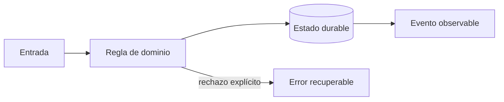
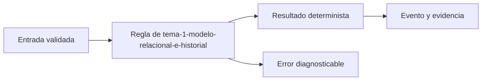
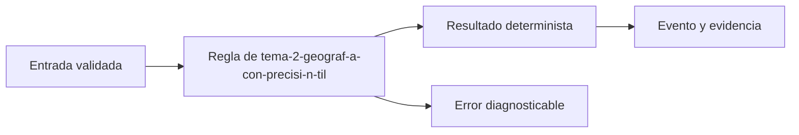
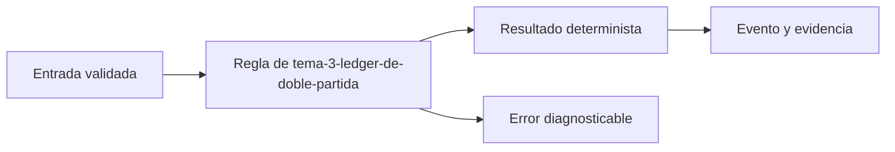

# Módulo 1: Datos, geografía y contabilidad de una entrega


## Aprende construyendo

### Tema 1: Modelo relacional e historial

**Conceptos clave:** identidades, claves, constraints, migraciones y auditoría.

Shipment representa el agregado; ShipmentEvent registra hechos inmutables. Una transición se valida dentro de una transacción y una restricción protege incluso ante errores de aplicación. Direcciones operativas se separan de su presentación pública. Las migraciones son código versionado, reversible cuando es posible y probado con datos realistas. El criterio no es memorizar la herramienta, sino poder predecir qué sucede ante duplicados, datos incompletos, concurrencia, pérdida de red o permisos insuficientes. Documenta supuestos y mide antes de optimizar.

**Analogía:** Es como un libro de actas: se agrega una corrección, no se borra el pasado.

**¿Por qué es importante?** Porque permite explicar qué ocurrió y reconstruir proyecciones. En RutaFlow la decisión se valida con una prueba automatizada y una observación operativa, no solo con una captura de pantalla.

**Casos de uso reales:** estudia el flujo normal, un reintento, un dato tardío y un acceso sin permiso. Dibuja primero el flujo y marca dónde puede fallar.

**Diagrama:**



#### Paso 1 · Objetivo y preparación

Al finalizar podrás construir y verificar **Tema 1: Modelo relacional e historial** dentro de RutaFlow, empezando desde una carpeta vacía y explicando qué decisión técnica resuelve. **Conocimiento previo:** terminal, Git y lectura de JSON.

#### Paso 2 · Contexto y caso real

**¿Por qué es importante?** En una plataforma de entregas, tema 1: modelo relacional e historial afecta directamente la trazabilidad, la seguridad y la capacidad de recuperar un fallo. Separar la decisión del detalle de infraestructura permite probarla antes de desplegarla y evita que una pantalla o un proveedor externo se convierta en la única fuente de verdad.

**Caso real:** una entrega puede repetirse, llegar fuera de orden o quedarse sin conexión. El diseño debe conservar una salida determinista y una evidencia que otra persona pueda revisar.

#### Paso 3 · Teoría, conceptos y analogía

**Conceptos clave:** contrato, estado, evidencia, idempotencia, observabilidad y límite de responsabilidad. Piensa en este tema como una estación de clasificación: recibe una entrada con formato conocido, aplica una regla explícita y entrega una salida que puede auditarse. Si una regla no se puede observar ni probar, todavía no es una parte confiable del sistema.

**Analogía:** es como una guía de despacho: cada paquete tiene una etiqueta, una operación responsable y una marca que demuestra qué ocurrió.



#### Paso 4 · Demostración guiada desde cero

Crea una carpeta independiente para comprobar el concepto antes de conectarlo al monorepo. Después crea `src/tema.js`:

```bash
mkdir -p rutaflow-labs/tema-1-modelo-relacional-e-historial
cd rutaflow-labs/tema-1-modelo-relacional-e-historial
printf '%s\n' '{"tema":"Tema 1: Modelo relacional e historial","estado":"preparado"}' > evidencia.json
cat evidencia.json
```

```javascript
// La entrada representa un contrato mínimo y verificable.
const entrada = { tema: 'Tema 1: Modelo relacional e historial', estado: 'preparado' };
const salida = { ...entrada, evidencia: true };
console.log(JSON.stringify(salida));
```

Ejecuta la comprobación desde `rutaflow-labs/tema-1-modelo-relacional-e-historial/`:

```bash
node -e "const fs=require('fs'); const x=JSON.parse(fs.readFileSync('evidencia.json','utf8')); if (!x.tema) throw new Error('Falta tema'); console.log('OK', x.tema);"
```

**Resultado esperado:** el comando imprime `OK` y el nombre del tema; `evidencia.json` conserva una entrada reproducible.

**Fallo deliberado:** cambia `tema` por una cadena vacía y ejecuta de nuevo. El proceso debe fallar con `Falta tema`; diagnostica leyendo la primera causa, corrige solo ese dato y repite la prueba.

#### Paso 5 · Práctica guiada

1. Añade un campo `version` y rechaza valores menores que `1`.
2. Registra una salida JSON de éxito y otra de error sin mezclar ambas.
3. Pista: valida la entrada antes de ejecutar la regla y conserva el mensaje original del error.

#### Paso 6 · Práctica independiente

Implementa una función `procesarEntrada(entrada)` que devuelva una salida determinista, rechace entradas incompletas y pueda ejecutarse dos veces sin duplicar evidencia. No copies la solución del paso anterior; escribe primero el contrato y después el código.

#### Paso 7 · Cierre, evidencia y proyecto

Entrega el archivo `evidencia.json`, la salida `OK`, la salida del fallo deliberado y una breve explicación de la decisión. El siguiente tema conecta este incremento con el proyecto RutaFlow: **Tema 1: Modelo relacional e historial** debe convertirse en una capacidad comprobable, observable y recuperable. **Fuente oficial:** [https://developer.mozilla.org/en-US/docs/Learn_web_development](https://developer.mozilla.org/en-US/docs/Learn_web_development).

**Errores comunes:** ejecutar desde otra carpeta; validar después de mutar el estado; ocultar el mensaje original del error; no conservar evidencia; asumir que un proveedor externo siempre responde.
### Tema 2: Geografía con precisión útil

**Conceptos clave:** PostGIS, SRID, índices, distancia, geocodificación y privacidad.

Latitud y longitud no son texto. Se almacenan con sistema de referencia explícito y se consultan con índices espaciales. La distancia geodésica no equivale a la distancia por carretera. Guardar seis decimales no hace exacto un GPS con error de veinte metros; la interfaz debe comunicar precisión y antigüedad. El criterio no es memorizar la herramienta, sino poder predecir qué sucede ante duplicados, datos incompletos, concurrencia, pérdida de red o permisos insuficientes. Documenta supuestos y mide antes de optimizar.

**Analogía:** Es como una fotografía desenfocada guardada en alta resolución sigue desenfocada.

**¿Por qué es importante?** Porque impide decisiones falsas, consultas lentas y exposición innecesaria. En RutaFlow la decisión se valida con una prueba automatizada y una observación operativa, no solo con una captura de pantalla.

**Casos de uso reales:** estudia el flujo normal, un reintento, un dato tardío y un acceso sin permiso. Dibuja primero el flujo y marca dónde puede fallar.

**Diagrama:**


#### Paso 1 · Objetivo y preparación

Al finalizar podrás construir y verificar **Tema 2: Geografía con precisión útil** dentro de RutaFlow, empezando desde una carpeta vacía y explicando qué decisión técnica resuelve. **Conocimiento previo:** terminal, Git y lectura de JSON.

#### Paso 2 · Contexto y caso real

**¿Por qué es importante?** En una plataforma de entregas, tema 2: geografía con precisión útil afecta directamente la trazabilidad, la seguridad y la capacidad de recuperar un fallo. Separar la decisión del detalle de infraestructura permite probarla antes de desplegarla y evita que una pantalla o un proveedor externo se convierta en la única fuente de verdad.

**Caso real:** una entrega puede repetirse, llegar fuera de orden o quedarse sin conexión. El diseño debe conservar una salida determinista y una evidencia que otra persona pueda revisar.

#### Paso 3 · Teoría, conceptos y analogía

**Conceptos clave:** contrato, estado, evidencia, idempotencia, observabilidad y límite de responsabilidad. Piensa en este tema como una estación de clasificación: recibe una entrada con formato conocido, aplica una regla explícita y entrega una salida que puede auditarse. Si una regla no se puede observar ni probar, todavía no es una parte confiable del sistema.

**Analogía:** es como una guía de despacho: cada paquete tiene una etiqueta, una operación responsable y una marca que demuestra qué ocurrió.



#### Paso 4 · Demostración guiada desde cero

Crea una carpeta independiente para comprobar el concepto antes de conectarlo al monorepo. Después crea `src/tema.js`:

```bash
mkdir -p rutaflow-labs/tema-2-geograf-a-con-precisi-n-til
cd rutaflow-labs/tema-2-geograf-a-con-precisi-n-til
printf '%s\n' '{"tema":"Tema 2: Geografía con precisión útil","estado":"preparado"}' > evidencia.json
cat evidencia.json
```

```javascript
// La entrada representa un contrato mínimo y verificable.
const entrada = { tema: 'Tema 2: Geografía con precisión útil', estado: 'preparado' };
const salida = { ...entrada, evidencia: true };
console.log(JSON.stringify(salida));
```

Ejecuta la comprobación desde `rutaflow-labs/tema-2-geograf-a-con-precisi-n-til/`:

```bash
node -e "const fs=require('fs'); const x=JSON.parse(fs.readFileSync('evidencia.json','utf8')); if (!x.tema) throw new Error('Falta tema'); console.log('OK', x.tema);"
```

**Resultado esperado:** el comando imprime `OK` y el nombre del tema; `evidencia.json` conserva una entrada reproducible.

**Fallo deliberado:** cambia `tema` por una cadena vacía y ejecuta de nuevo. El proceso debe fallar con `Falta tema`; diagnostica leyendo la primera causa, corrige solo ese dato y repite la prueba.

#### Paso 5 · Práctica guiada

1. Añade un campo `version` y rechaza valores menores que `1`.
2. Registra una salida JSON de éxito y otra de error sin mezclar ambas.
3. Pista: valida la entrada antes de ejecutar la regla y conserva el mensaje original del error.

#### Paso 6 · Práctica independiente

Implementa una función `procesarEntrada(entrada)` que devuelva una salida determinista, rechace entradas incompletas y pueda ejecutarse dos veces sin duplicar evidencia. No copies la solución del paso anterior; escribe primero el contrato y después el código.

#### Paso 7 · Cierre, evidencia y proyecto

Entrega el archivo `evidencia.json`, la salida `OK`, la salida del fallo deliberado y una breve explicación de la decisión. El siguiente tema conecta este incremento con el proyecto RutaFlow: **Tema 2: Geografía con precisión útil** debe convertirse en una capacidad comprobable, observable y recuperable. **Fuente oficial:** [https://developer.mozilla.org/en-US/docs/Learn_web_development](https://developer.mozilla.org/en-US/docs/Learn_web_development).

**Errores comunes:** ejecutar desde otra carpeta; validar después de mutar el estado; ocultar el mensaje original del error; no conservar evidencia; asumir que un proveedor externo siempre responde.
### Tema 3: Ledger de doble partida

**Conceptos clave:** cuentas, débitos, créditos, tarifas versionadas y conciliación.

El saldo es una proyección de movimientos, no un campo que se corrige manualmente. Cada asiento debe balancear débitos y créditos en la misma moneda. Una tarifa conserva versión y vigencia para reproducir una cotización histórica. Recaudo, comisión, obligación al comercio y efectivo del conductor son cuentas diferentes. El criterio no es memorizar la herramienta, sino poder predecir qué sucede ante duplicados, datos incompletos, concurrencia, pérdida de red o permisos insuficientes. Documenta supuestos y mide antes de optimizar.

**Analogía:** Es como una balanza: todo valor que aparece en un lado debe explicar su contrapartida.

**¿Por qué es importante?** Porque hace auditables el efectivo, pagos, liquidaciones y reversos. En RutaFlow la decisión se valida con una prueba automatizada y una observación operativa, no solo con una captura de pantalla.

**Casos de uso reales:** estudia el flujo normal, un reintento, un dato tardío y un acceso sin permiso. Dibuja primero el flujo y marca dónde puede fallar.

**Diagrama:**


#### Paso 1 · Objetivo y preparación

Al finalizar podrás construir y verificar **Tema 3: Ledger de doble partida** dentro de RutaFlow, empezando desde una carpeta vacía y explicando qué decisión técnica resuelve. **Conocimiento previo:** terminal, Git y lectura de JSON.

#### Paso 2 · Contexto y caso real

**¿Por qué es importante?** En una plataforma de entregas, tema 3: ledger de doble partida afecta directamente la trazabilidad, la seguridad y la capacidad de recuperar un fallo. Separar la decisión del detalle de infraestructura permite probarla antes de desplegarla y evita que una pantalla o un proveedor externo se convierta en la única fuente de verdad.

**Caso real:** una entrega puede repetirse, llegar fuera de orden o quedarse sin conexión. El diseño debe conservar una salida determinista y una evidencia que otra persona pueda revisar.

#### Paso 3 · Teoría, conceptos y analogía

**Conceptos clave:** contrato, estado, evidencia, idempotencia, observabilidad y límite de responsabilidad. Piensa en este tema como una estación de clasificación: recibe una entrada con formato conocido, aplica una regla explícita y entrega una salida que puede auditarse. Si una regla no se puede observar ni probar, todavía no es una parte confiable del sistema.

**Analogía:** es como una guía de despacho: cada paquete tiene una etiqueta, una operación responsable y una marca que demuestra qué ocurrió.



#### Paso 4 · Demostración guiada desde cero

Crea una carpeta independiente para comprobar el concepto antes de conectarlo al monorepo. Después crea `src/tema.js`:

```bash
mkdir -p rutaflow-labs/tema-3-ledger-de-doble-partida
cd rutaflow-labs/tema-3-ledger-de-doble-partida
printf '%s\n' '{"tema":"Tema 3: Ledger de doble partida","estado":"preparado"}' > evidencia.json
cat evidencia.json
```

```javascript
// La entrada representa un contrato mínimo y verificable.
const entrada = { tema: 'Tema 3: Ledger de doble partida', estado: 'preparado' };
const salida = { ...entrada, evidencia: true };
console.log(JSON.stringify(salida));
```

Ejecuta la comprobación desde `rutaflow-labs/tema-3-ledger-de-doble-partida/`:

```bash
node -e "const fs=require('fs'); const x=JSON.parse(fs.readFileSync('evidencia.json','utf8')); if (!x.tema) throw new Error('Falta tema'); console.log('OK', x.tema);"
```

**Resultado esperado:** el comando imprime `OK` y el nombre del tema; `evidencia.json` conserva una entrada reproducible.

**Fallo deliberado:** cambia `tema` por una cadena vacía y ejecuta de nuevo. El proceso debe fallar con `Falta tema`; diagnostica leyendo la primera causa, corrige solo ese dato y repite la prueba.

#### Paso 5 · Práctica guiada

1. Añade un campo `version` y rechaza valores menores que `1`.
2. Registra una salida JSON de éxito y otra de error sin mezclar ambas.
3. Pista: valida la entrada antes de ejecutar la regla y conserva el mensaje original del error.

#### Paso 6 · Práctica independiente

Implementa una función `procesarEntrada(entrada)` que devuelva una salida determinista, rechace entradas incompletas y pueda ejecutarse dos veces sin duplicar evidencia. No copies la solución del paso anterior; escribe primero el contrato y después el código.

#### Paso 7 · Cierre, evidencia y proyecto

Entrega el archivo `evidencia.json`, la salida `OK`, la salida del fallo deliberado y una breve explicación de la decisión. El siguiente tema conecta este incremento con el proyecto RutaFlow: **Tema 3: Ledger de doble partida** debe convertirse en una capacidad comprobable, observable y recuperable. **Fuente oficial:** [https://developer.mozilla.org/en-US/docs/Learn_web_development](https://developer.mozilla.org/en-US/docs/Learn_web_development).

**Errores comunes:** ejecutar desde otra carpeta; validar después de mutar el estado; ocultar el mensaje original del error; no conservar evidencia; asumir que un proveedor externo siempre responde.
