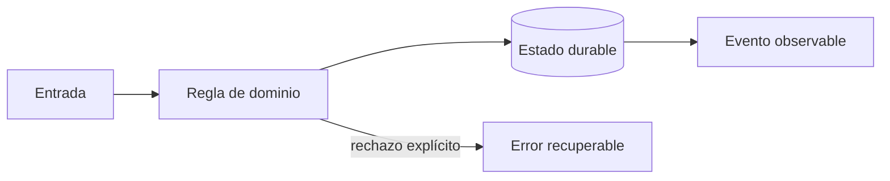

# Módulo 1: Datos, geografía y contabilidad de una entrega

## Aprende construyendo

### Tema 1: Modelo relacional e historial

**Conceptos clave:** identidades, claves, constraints, migraciones y auditoría.

Shipment representa el agregado; ShipmentEvent registra hechos inmutables. Una transición se valida dentro de una transacción y una restricción protege incluso ante errores de aplicación. Direcciones operativas se separan de su presentación pública. Las migraciones son código versionado, reversible cuando es posible y probado con datos realistas. El criterio no es memorizar la herramienta, sino poder predecir qué sucede ante duplicados, datos incompletos, concurrencia, pérdida de red o permisos insuficientes. Documenta supuestos y mide antes de optimizar.

**Analogía:** Es como un libro de actas: se agrega una corrección, no se borra el pasado.

**¿Por qué es importante?** Porque permite explicar qué ocurrió y reconstruir proyecciones. En RutaFlow la decisión se valida con una prueba automatizada y una observación operativa, no solo con una captura de pantalla.

**Casos de uso reales:** estudia el flujo normal, un reintento, un dato tardío y un acceso sin permiso. Dibuja primero el flujo y marca dónde puede fallar.

**Diagrama:**

### Tema 2: Geografía con precisión útil

**Conceptos clave:** PostGIS, SRID, índices, distancia, geocodificación y privacidad.

Latitud y longitud no son texto. Se almacenan con sistema de referencia explícito y se consultan con índices espaciales. La distancia geodésica no equivale a la distancia por carretera. Guardar seis decimales no hace exacto un GPS con error de veinte metros; la interfaz debe comunicar precisión y antigüedad. El criterio no es memorizar la herramienta, sino poder predecir qué sucede ante duplicados, datos incompletos, concurrencia, pérdida de red o permisos insuficientes. Documenta supuestos y mide antes de optimizar.

**Analogía:** Es como una fotografía desenfocada guardada en alta resolución sigue desenfocada.

**¿Por qué es importante?** Porque impide decisiones falsas, consultas lentas y exposición innecesaria. En RutaFlow la decisión se valida con una prueba automatizada y una observación operativa, no solo con una captura de pantalla.

**Casos de uso reales:** estudia el flujo normal, un reintento, un dato tardío y un acceso sin permiso. Dibuja primero el flujo y marca dónde puede fallar.

**Diagrama:**

### Tema 3: Ledger de doble partida

**Conceptos clave:** cuentas, débitos, créditos, tarifas versionadas y conciliación.

El saldo es una proyección de movimientos, no un campo que se corrige manualmente. Cada asiento debe balancear débitos y créditos en la misma moneda. Una tarifa conserva versión y vigencia para reproducir una cotización histórica. Recaudo, comisión, obligación al comercio y efectivo del conductor son cuentas diferentes. El criterio no es memorizar la herramienta, sino poder predecir qué sucede ante duplicados, datos incompletos, concurrencia, pérdida de red o permisos insuficientes. Documenta supuestos y mide antes de optimizar.

**Analogía:** Es como una balanza: todo valor que aparece en un lado debe explicar su contrapartida.

**¿Por qué es importante?** Porque hace auditables el efectivo, pagos, liquidaciones y reversos. En RutaFlow la decisión se valida con una prueba automatizada y una observación operativa, no solo con una captura de pantalla.

**Casos de uso reales:** estudia el flujo normal, un reintento, un dato tardío y un acceso sin permiso. Dibuja primero el flujo y marca dónde puede fallar.

**Diagrama:**

