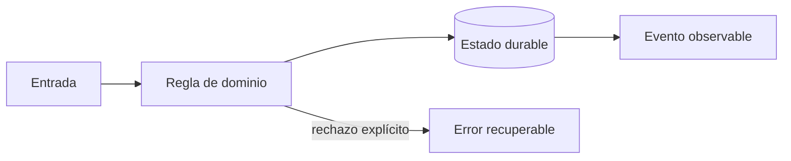

# Módulo 2: Backend: envíos, asignación e idempotencia

## Aprende construyendo

### Tema 1: Contratos HTTP y autorización

**Conceptos clave:** OpenAPI, recursos, errores, identidad, roles y ownership.

OpenAPI define entradas, salidas y errores antes de acoplar clientes. Autenticación responde quién; autorización decide qué puede hacer esa identidad sobre ese recurso. Un tracking público usa un token acotado y nunca expone notas internas, teléfono completo o coordenadas históricas. El criterio no es memorizar la herramienta, sino poder predecir qué sucede ante duplicados, datos incompletos, concurrencia, pérdida de red o permisos insuficientes. Documenta supuestos y mide antes de optimizar.

**Analogía:** Es como la recepción de un edificio verifica identidad y también a qué piso puede entrar.

**¿Por qué es importante?** Porque un endpoint funcional sin autorización contextual sigue siendo una vulnerabilidad. En RutaFlow la decisión se valida con una prueba automatizada y una observación operativa, no solo con una captura de pantalla.

**Casos de uso reales:** estudia el flujo normal, un reintento, un dato tardío y un acceso sin permiso. Dibuja primero el flujo y marca dónde puede fallar.

**Diagrama:**

### Tema 2: Casos de uso y transacciones

**Conceptos clave:** puertos, adaptadores, invariantes, optimistic locking e idempotency key.

Confirmar entrega es un caso de uso: carga el envío, valida versión y transición, registra evidencia, guarda evento y resultado idempotente. Si el cliente reintenta con la misma clave recibe el resultado anterior. Si dos operadores actualizan la misma versión, uno debe recargar en vez de sobrescribir silenciosamente. El criterio no es memorizar la herramienta, sino poder predecir qué sucede ante duplicados, datos incompletos, concurrencia, pérdida de red o permisos insuficientes. Documenta supuestos y mide antes de optimizar.

**Analogía:** Es como un número de turno: repetir la solicitud no crea dos trámites.

**¿Por qué es importante?** Porque los móviles pierden conectividad y los gateways reintentan; la duplicación es normal. En RutaFlow la decisión se valida con una prueba automatizada y una observación operativa, no solo con una captura de pantalla.

**Casos de uso reales:** estudia el flujo normal, un reintento, un dato tardío y un acceso sin permiso. Dibuja primero el flujo y marca dónde puede fallar.

**Diagrama:**

### Tema 3: Outbox, colas y observabilidad

**Conceptos clave:** commit atómico, entrega al menos una vez, deduplicación, trazas y métricas.

Guardar datos y publicar directamente crea una ventana de fallo. El outbox persiste cambio y mensaje en la misma transacción; un publicador reintenta. El consumidor registra message_id antes de aplicar efectos. Correlation ID y trazas conectan API, base y worker, mientras métricas miden latencia, errores y backlog. El criterio no es memorizar la herramienta, sino poder predecir qué sucede ante duplicados, datos incompletos, concurrencia, pérdida de red o permisos insuficientes. Documenta supuestos y mide antes de optimizar.

**Analogía:** Es como una bandeja de correo sellada junto con el documento que debe enviarse.

**¿Por qué es importante?** Porque convierte fallos parciales en trabajo recuperable y observable. En RutaFlow la decisión se valida con una prueba automatizada y una observación operativa, no solo con una captura de pantalla.

**Casos de uso reales:** estudia el flujo normal, un reintento, un dato tardío y un acceso sin permiso. Dibuja primero el flujo y marca dónde puede fallar.

**Diagrama:**

