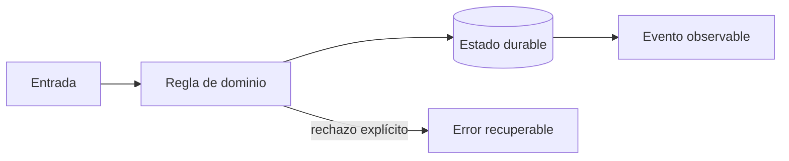
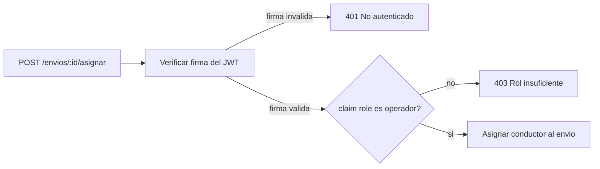
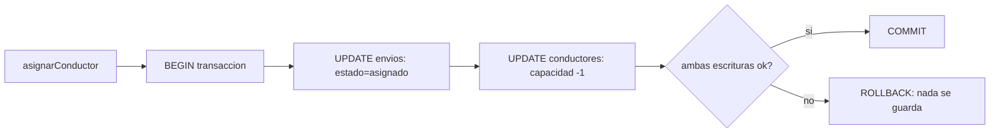
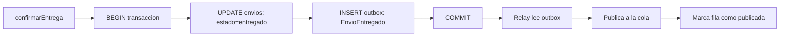

# Módulo 2: Backend: envíos, asignación e idempotencia


## Aprende construyendo

### Tema 1: Contratos HTTP y autorización

**Conceptos clave:** OpenAPI, recursos, errores, identidad, roles y ownership.

OpenAPI define entradas, salidas y errores antes de acoplar clientes. Autenticación responde quién; autorización decide qué puede hacer esa identidad sobre ese recurso. Un tracking público usa un token acotado y nunca expone notas internas, teléfono completo o coordenadas históricas. El criterio no es memorizar la herramienta, sino poder predecir qué sucede ante duplicados, datos incompletos, concurrencia, pérdida de red o permisos insuficientes. Documenta supuestos y mide antes de optimizar.

**Analogía:** Es como la recepción de un edificio verifica identidad y también a qué piso puede entrar.

**¿Por qué es importante?** Porque un endpoint funcional sin autorización contextual sigue siendo una vulnerabilidad. En RutaFlow la decisión se valida con una prueba automatizada y una observación operativa, no solo con una captura de pantalla.

**Casos de uso reales:** estudia el flujo normal, un reintento, un dato tardío y un acceso sin permiso. Dibuja primero el flujo y marca dónde puede fallar.

**Diagrama:**


```mermaid
flowchart LR
  A[Entrada] --> B[Regla de dominio]
  B --> C[(Estado durable)]
  C --> D[Evento observable]
  B -->|rechazo explícito| E[Error recuperable]
```

#### Paso 1 · Objetivo y preparación

Al finalizar podrás construir y verificar **Tema 1: Contratos HTTP y autorización** dentro de RutaFlow, empezando desde una carpeta vacía y explicando qué decisión técnica resuelve. **Conocimiento previo:** terminal, Git y lectura de JSON.

#### Paso 2 · Contexto y caso real

**¿Por qué es importante?** Un endpoint de asignación que no verifica el rol contra el token firmado es una autorización de fachada: cualquier cliente que conozca el nombre del campo puede declararse `operador` y mover conductores entre envíos ajenos. La integridad de RutaFlow depende de que la identidad y el rol salgan siempre del JWT ya verificado por el servidor, nunca de un dato que el propio cliente envía en la petición.

**Caso real:** una app de reparto modificada envía `{"role":"operador"}` en el cuerpo del `POST /envios/:id/asignar` para que el conductor se autoasigne envíos ajenos sin pasar por el panel de operaciones. Si el backend confía en ese campo del body, el ataque funciona sin tocar el token.

#### Paso 3 · Teoría, conceptos y analogía

**Conceptos clave:** JWT, claims verificados, control de acceso por rol (RBAC), diferencia entre 401 (no autenticado) y 403 (sin permiso), y la regla de "nunca uses datos del cliente para decidir permisos".

Pensá el contrato de este endpoint como dos capas de control: la primera (autenticación) confirma que el token es válido y no fue alterado; la segunda (autorización) lee el claim `role` de ESE token ya verificado y decide si esa identidad puede ejecutar `asignar` sobre el recurso `envío`. Cualquier dato que viaje en el cuerpo de la petición es responsabilidad del cliente y jamás debe influir en esa decisión.

**Analogía:** es como un guardia que ya validó tu cédula en la entrada: no le importa qué credencial digas tener en la mano, solo lo que el sistema interno —el token— ya confirmó sobre vos.


```mermaid
flowchart LR
  A[POST /envios/:id/asignar] --> B[Verificar firma del JWT]
  B -->|firma invalida| E1[401 No autenticado]
  B -->|firma valida| C{claim role es operador?}
  C -->|no| E2[403 Rol insuficiente]
  C -->|si| D[Asignar conductor al envio]
```

#### Paso 4 · Demostración guiada desde cero

Crea una carpeta independiente para comprobar el concepto antes de conectarlo al monorepo:

```bash
mkdir -p rutaflow-labs/tema-1-contratos-http-y-autorizacion
cd rutaflow-labs/tema-1-contratos-http-y-autorizacion
```

Contrato mínimo del endpoint (OpenAPI), en `contrato.yaml`:

```yaml
paths:
  /envios/{id}/asignar:
    post:
      summary: Asigna un conductor a un envío
      security:
        - bearerAuth: []
      requestBody:
        content:
          application/json:
            schema:
              type: object
              properties:
                conductorId: { type: string, example: cond-09 }
      responses:
        '200': { description: Envío asignado }
        '401': { description: Token ausente o inválido }
        '403': { description: Rol insuficiente (se requiere operador) }
```

Implementación en `src/asignar.js`:

```javascript
// Simula un token YA verificado por el middleware de autenticación (firma validada).
function tokenVerificado(role) {
  return { sub: 'usr-204', role };
}

// Caso de uso: solo "operador" puede asignar un conductor a un envío.
function asignarConductor({ envioId, conductorId, claims }) {
  if (claims.role !== 'operador') {
    const error = new Error(`rol insuficiente: ${claims.role}`);
    error.status = 403;
    throw error;
  }
  return { envioId, conductorId, estado: 'asignado' };
}

const claims = tokenVerificado('operador'); // sale del JWT verificado, no del body
const resultado = asignarConductor({ envioId: 'RF-4471', conductorId: 'cond-09', claims });
console.log(JSON.stringify(resultado));
```

Ejecuta `node src/asignar.js`.

**Resultado esperado:** imprime `{"envioId":"RF-4471","conductorId":"cond-09","estado":"asignado"}`.

**Fallo deliberado:** cambiá la función para que lea el rol del body en vez del token verificado:

```javascript
function asignarConductorInseguro({ envioId, conductorId, body }) {
  if (body.role !== 'operador') {
    const error = new Error(`rol insuficiente: ${body.role}`);
    error.status = 403;
    throw error;
  }
  return { envioId, conductorId, estado: 'asignado' };
}

// El atacante no tiene el rol operador en su JWT (su claim real es "repartidor"),
// pero puede escribir lo que quiera en el body de su propia petición.
const resultado = asignarConductorInseguro({
  envioId: 'RF-4471',
  conductorId: 'cond-09',
  body: { role: 'operador' },
});
console.log(JSON.stringify(resultado));
```

Al ejecutar esta versión, la asignación se aprueba (`estado: "asignado"`) aunque el token real del atacante tenga `role: "repartidor"` — el `body` nunca pasó por verificación. Diagnosticá el problema (la condición lee una fuente no confiable) y corregilo volviendo a leer `claims.role` del token verificado; repetí la ejecución y confirmá que ahora rechaza con `rol insuficiente: repartidor`.

#### Paso 5 · Práctica guiada

1. Agregá un claim `envioIds` (array) al token y permití la asignación solo si `envioId` pertenece a esa lista, aunque el rol ya sea `operador`.
2. Devolvé un cuerpo de error JSON consistente (`{ "error": "..." }`) para 401 y otro distinto para 403, sin mezclarlos.
3. Pista: nunca leas `role` ni ningún otro dato de autorización desde `req.body`; solo desde el payload ya verificado del token.

#### Paso 6 · Práctica independiente

Implementa una función `autorizarAsignacion(claims, envioId)` que separe la verificación de rol de la verificación de pertenencia del envío, y que pueda probarse sin un servidor HTTP real, pasándole distintos payloads de `claims` simulados. No copies la solución del paso anterior; escribe primero el contrato y después el código.

#### Paso 7 · Cierre, evidencia y proyecto

Entrega `contrato.yaml`, `src/asignar.js`, la salida exitosa, la salida del fallo deliberado y una breve explicación de por qué el rol debe salir del token. El siguiente tema toma esta misma acción de asignar un conductor y la lleva al nivel del caso de uso completo: qué pasa con el envío y con la capacidad del conductor cuando la operación debe ser todo-o-nada. **Fuente oficial:** [RFC 8725 — JSON Web Token Best Current Practices](https://www.rfc-editor.org/rfc/rfc8725).

**Errores comunes:** confiar en datos de autorización enviados por el cliente; no diferenciar 401 de 403; omitir la verificación de firma antes de leer claims; registrar el token completo en logs; asumir que HTTPS por sí solo reemplaza la autorización.
### Tema 2: Casos de uso y transacciones

**Conceptos clave:** puertos, adaptadores, invariantes, optimistic locking e idempotency key.

Confirmar entrega es un caso de uso: carga el envío, valida versión y transición, registra evidencia, guarda evento y resultado idempotente. Si el cliente reintenta con la misma clave recibe el resultado anterior. Si dos operadores actualizan la misma versión, uno debe recargar en vez de sobrescribir silenciosamente. El criterio no es memorizar la herramienta, sino poder predecir qué sucede ante duplicados, datos incompletos, concurrencia, pérdida de red o permisos insuficientes. Documenta supuestos y mide antes de optimizar.

**Analogía:** Es como un número de turno: repetir la solicitud no crea dos trámites.

**¿Por qué es importante?** Porque los móviles pierden conectividad y los gateways reintentan; la duplicación es normal. En RutaFlow la decisión se valida con una prueba automatizada y una observación operativa, no solo con una captura de pantalla.

**Casos de uso reales:** estudia el flujo normal, un reintento, un dato tardío y un acceso sin permiso. Dibuja primero el flujo y marca dónde puede fallar.

**Diagrama:**


```mermaid
flowchart LR
  A[Entrada] --> B[Regla de dominio]
  B --> C[(Estado durable)]
  C --> D[Evento observable]
  B -->|rechazo explícito| E[Error recuperable]
```

#### Paso 1 · Objetivo y preparación

Al finalizar podrás construir y verificar **Tema 2: Casos de uso y transacciones** dentro de RutaFlow, empezando desde una carpeta vacía y explicando qué decisión técnica resuelve. **Conocimiento previo:** terminal, Git y lectura de JSON.

#### Paso 2 · Contexto y caso real

**¿Por qué es importante?** Asignar un conductor no es una sola escritura: es un envío que cambia de estado Y un contador de capacidad que debe bajar en la misma operación. Si el proceso falla entre esas dos escrituras, el sistema puede terminar con un envío "asignado" a un conductor cuyo contador nunca bajó — y ese conductor sigue pareciendo disponible mientras ya tiene el envío encima. Esa inconsistencia solo se evita tratando ambas escrituras como una unidad atómica.

**Caso real:** un pico de pedidos satura la base por un instante; la actualización del envío se confirma pero la conexión se corta antes de descontar la capacidad del conductor. Sin transacción, ese conductor queda con capacidad fantasma y puede recibir más envíos de los que puede entregar.

#### Paso 3 · Teoría, conceptos y analogía

**Conceptos clave:** transacción (`BEGIN`/`COMMIT`/`ROLLBACK`), atomicidad, invariante de negocio (la capacidad nunca es negativa), estado parcial, optimistic locking.

Una operación transaccional no es "ejecutar dos pasos seguidos": es garantizar que ambos pasos se confirman juntos o ninguno se confirma. Si decrementás la capacidad del conductor y actualizás el envío en dos sentencias sueltas, cualquier error entre medio deja guardada una mitad del cambio y pierde la otra — un estado que ninguna regla de negocio predijo.

**Analogía:** es como transferir dinero entre dos cuentas: si el banco descuenta de una y el proceso se cae antes de acreditar en la otra, la plata no "desapareció", pero el sistema queda en un estado que no debería poder existir nunca.


```mermaid
flowchart LR
  A[asignarConductor] --> B[BEGIN transaccion]
  B --> C[UPDATE envios: estado=asignado]
  C --> D[UPDATE conductores: capacidad -1]
  D --> E{ambas escrituras ok?}
  E -->|si| F[COMMIT]
  E -->|no| G[ROLLBACK: nada se guarda]
```

#### Paso 4 · Demostración guiada desde cero

Crea una carpeta independiente y, dentro, `src/transaccion.js`:

```bash
mkdir -p rutaflow-labs/tema-2-casos-de-uso-y-transacciones
cd rutaflow-labs/tema-2-casos-de-uso-y-transacciones
```

```javascript
// Simulación en memoria de dos "tablas" para poder ejecutar el demo sin una base real.
const envios = { 'RF-4471': { estado: 'pendiente', conductorId: null } };
const conductores = { 'cond-09': { capacidadDisponible: 3 } };

// Versión SIN transacción: dos escrituras independientes.
function asignarConductorSinTransaccion(envioId, conductorId, simularCaidaDeRed) {
  envios[envioId].conductorId = conductorId;
  envios[envioId].estado = 'asignado'; // escritura 1: ya quedó guardada
  if (simularCaidaDeRed) {
    throw new Error('conexion perdida antes de descontar capacidad');
  }
  conductores[conductorId].capacidadDisponible -= 1; // escritura 2: no se ejecuta si hubo caída
}

asignarConductorSinTransaccion('RF-4471', 'cond-09', false);
console.log(JSON.stringify({ envio: envios['RF-4471'], conductor: conductores['cond-09'] }));
```

Ejecuta `node src/transaccion.js`.

**Resultado esperado:** con `simularCaidaDeRed=false` imprime `estado: "asignado"` y `capacidadDisponible: 2` — consistente.

**Fallo deliberado:** volvé a llamar la función sin transacción, ahora con la caída simulada en `true`:

```javascript
const envios2 = { 'RF-4471': { estado: 'pendiente', conductorId: null } };
const conductores2 = { 'cond-09': { capacidadDisponible: 3 } };

try {
  asignarConductorSinTransaccion.call(null, 'RF-4471', 'cond-09', true);
} catch (e) {
  console.log('Error capturado:', e.message);
}
console.log(JSON.stringify({ envio: envios['RF-4471'], conductor: conductores['cond-09'] }));
```

El envío queda `estado: "asignado"` con `conductorId` seteado, pero `capacidadDisponible` sigue en su valor anterior sin descontar — un estado inconsistente que ninguna consulta posterior puede explicar por sí sola. Corregilo envolviendo ambas escrituras en una transacción real (equivalente a `BEGIN; UPDATE envios ...; UPDATE conductores ...; COMMIT;` en PostgreSQL, o `@Transactional` en Spring Boot):

```javascript
function asignarConductorConTransaccion(envioId, conductorId, simularCaidaDeRed) {
  const envioPrevio = { ...envios[envioId] };
  const conductorPrevio = { ...conductores[conductorId] };
  try {
    envios[envioId].conductorId = conductorId;
    envios[envioId].estado = 'asignado';
    if (simularCaidaDeRed) {
      throw new Error('conexion perdida antes de descontar capacidad');
    }
    conductores[conductorId].capacidadDisponible -= 1;
  } catch (error) {
    envios[envioId] = envioPrevio; // ROLLBACK
    conductores[conductorId] = conductorPrevio; // ROLLBACK
    throw error;
  }
}
```

Repetí la prueba con la caída simulada: ahora el `catch` revierte ambas tablas a su estado previo (`estado: "pendiente"`, `capacidadDisponible: 3`), nunca una mezcla de las dos.

#### Paso 5 · Práctica guiada

1. Agregá una tercera "tabla" en memoria `historial` y escribí un registro en ella dentro de la misma operación; si falla, también debe revertirse.
2. Movés el punto de la caída simulada a después de descontar la capacidad pero antes de confirmar el envío, y verificá que el rollback cubre igual ambos cambios.
3. Pista: el rollback debe restaurar TODAS las tablas tocadas, no solo la última que se modificó.

#### Paso 6 · Práctica independiente

Implementa `transferirCapacidad(origenId, destinoId, cantidad)` que mueva cupo entre dos conductores de forma atómica (ambas cuentas cambian o ninguna), reutilizando el patrón de snapshot y rollback de este paso. No copies la solución del paso anterior; escribe primero el contrato y después el código.

#### Paso 7 · Cierre, evidencia y proyecto

Entrega `src/transaccion.js`, la salida consistente, la salida del fallo con la caída simulada y la salida ya corregida con rollback. El siguiente tema toma este mismo problema de atomicidad y lo extiende al momento de publicar el evento de la asignación: ¿qué pasa si la transacción se confirma pero el mensaje a la cola se pierde? **Fuente oficial:** [PostgreSQL — Transactions](https://www.postgresql.org/docs/current/tutorial-transactions.html).

**Errores comunes:** ejecutar escrituras relacionadas en sentencias sueltas; no revertir el estado parcial ante un error; confundir el rollback de la aplicación con el rollback de la base de datos; no probar el camino de fallo, solo el camino feliz; asumir que un error de red nunca ocurre entre dos escrituras consecutivas.
### Tema 3: Outbox, colas y observabilidad

**Conceptos clave:** commit atómico, entrega al menos una vez, deduplicación, trazas y métricas.

Guardar datos y publicar directamente crea una ventana de fallo. El outbox persiste cambio y mensaje en la misma transacción; un publicador reintenta. El consumidor registra message_id antes de aplicar efectos. Correlation ID y trazas conectan API, base y worker, mientras métricas miden latencia, errores y backlog. El criterio no es memorizar la herramienta, sino poder predecir qué sucede ante duplicados, datos incompletos, concurrencia, pérdida de red o permisos insuficientes. Documenta supuestos y mide antes de optimizar.

**Analogía:** Es como una bandeja de correo sellada junto con el documento que debe enviarse.

**¿Por qué es importante?** Porque convierte fallos parciales en trabajo recuperable y observable. En RutaFlow la decisión se valida con una prueba automatizada y una observación operativa, no solo con una captura de pantalla.

**Casos de uso reales:** estudia el flujo normal, un reintento, un dato tardío y un acceso sin permiso. Dibuja primero el flujo y marca dónde puede fallar.

**Diagrama:**


```mermaid
flowchart LR
  A[Entrada] --> B[Regla de dominio]
  B --> C[(Estado durable)]
  C --> D[Evento observable]
  B -->|rechazo explícito| E[Error recuperable]
```

#### Paso 1 · Objetivo y preparación

Al finalizar podrás construir y verificar **Tema 3: Outbox, colas y observabilidad** dentro de RutaFlow, empezando desde una carpeta vacía y explicando qué decisión técnica resuelve. **Conocimiento previo:** terminal, Git y lectura de JSON.

#### Paso 2 · Contexto y caso real

**¿Por qué es importante?** Si el backend confirma la entrega en la base y publica el evento directo a la cola, queda una ventana entre el `COMMIT` y la publicación donde el proceso puede morir: la base ya quedó consistente, pero ningún otro servicio (facturación, notificaciones, tracking) se entera jamás de que el envío se entregó. El outbox cierra esa ventana guardando el evento como parte de la misma transacción que el cambio de estado.

**Caso real:** el worker que confirma entregas se reinicia (deploy, falta de memoria, caída) justo después de hacer commit en la base y antes de publicar a la cola. Sin outbox, ese evento de entrega desaparece para siempre y el envío queda "entregado" en la base sin que ningún otro servicio lo sepa.

#### Paso 3 · Teoría, conceptos y analogía

**Conceptos clave:** tabla outbox, proceso relay/publicador, entrega al menos una vez (at-least-once), deduplicación por `message_id`, acoplamiento transaccional entre dominio y evento.

El patrón outbox separa dos responsabilidades que normalmente se mezclan: cambiar el estado de dominio (la fila del envío) y notificar ese cambio (el evento). En vez de publicar directo a la cola, el evento se escribe como una fila más dentro de la MISMA transacción de base de datos. Un proceso aparte —el relay— lee esa tabla y publica a la cola; si el relay falla, el evento sigue ahí esperando, no se perdió.

**Analogía:** es como escribir la carta y sellarla dentro del mismo sobre que vas a despachar: el cartero (el relay) puede demorarse en pasar a buscarla, pero la carta ya existe y no depende de que nadie la vuelva a escribir.


```mermaid
flowchart LR
  A[confirmarEntrega] --> B[BEGIN transaccion]
  B --> C[UPDATE envios: estado=entregado]
  C --> D[INSERT outbox: EnvioEntregado]
  D --> E[COMMIT]
  E --> F[Relay lee outbox]
  F --> G[Publica a la cola]
  G --> H[Marca fila como publicada]
```

#### Paso 4 · Demostración guiada desde cero

Crea una carpeta independiente y, dentro, `src/outbox.js`:

```bash
mkdir -p rutaflow-labs/tema-3-outbox-colas-y-observabilidad
cd rutaflow-labs/tema-3-outbox-colas-y-observabilidad
```

```javascript
// Simulación en memoria: una "tabla" envios, una "tabla" outbox y una cola externa.
const envios = { 'RF-4471': { estado: 'pendiente' } };
const outbox = [];
const cola = [];

// Patrón correcto: el cambio de dominio y el evento se escriben en la MISMA operación.
function confirmarEntregaConOutbox(envioId) {
  envios[envioId].estado = 'entregado';
  outbox.push({ id: outbox.length + 1, envioId, tipo: 'EnvioEntregado', publicado: false });
}

confirmarEntregaConOutbox('RF-4471');
console.log(JSON.stringify({ envio: envios['RF-4471'], outbox }));

// Proceso relay separado: lee el outbox y publica lo que falte.
function relayDeOutbox() {
  for (const fila of outbox) {
    if (!fila.publicado) {
      cola.push(fila);
      fila.publicado = true;
    }
  }
}
relayDeOutbox();
console.log('Cola tras el relay:', JSON.stringify(cola));
```

Ejecuta `node src/outbox.js`.

**Resultado esperado:** el envío queda `entregado`, el outbox guarda la fila del evento, y tras `relayDeOutbox()` la cola contiene ese mismo evento marcado como `publicado: true`.

**Fallo deliberado:** reemplazá el flujo por una publicación directa a la cola, sin outbox, simulando que el proceso muere justo después del commit:

```javascript
const envios2 = { 'RF-4471': { estado: 'pendiente' } };
const cola2 = [];

function confirmarEntregaSinOutbox(envioId, simularCaidaDelProceso) {
  envios2[envioId].estado = 'entregado'; // esto ya se guardó: COMMIT exitoso
  if (simularCaidaDelProceso) {
    throw new Error('el proceso murio antes de publicar el evento');
  }
  cola2.push({ envioId, tipo: 'EnvioEntregado' }); // publicación directa, fuera de la transacción
}

try {
  confirmarEntregaSinOutbox('RF-4471', true);
} catch (e) {
  console.log('Error:', e.message);
}
console.log('Envio:', JSON.stringify(envios2['RF-4471'])); // estado: "entregado" -> el cambio quedó
console.log('Cola:', JSON.stringify(cola2)); // [] -> el evento se perdió para siempre
```

El envío quedó `entregado` en la base, pero la cola está vacía: el evento se perdió para siempre y nada ni nadie lo va a reintentar, porque nunca se guardó en ningún lado. Corregilo volviendo al patrón outbox (`confirmarEntregaConOutbox` + `relayDeOutbox`): el evento sobrevive al crash porque ya estaba persistido en la misma transacción, y el relay lo publica en cuanto vuelve a correr.

#### Paso 5 · Práctica guiada

1. Agregá deduplicación: antes de aplicar un evento consumido, revisá si su `id` ya está en una lista de `procesados` y, si está, ignoralo sin repetir el efecto.
2. Ejecutá `relayDeOutbox()` dos veces seguidas y confirmá que no se publica el mismo evento dos veces gracias al flag `publicado`.
3. Pista: "al menos una vez" significa que el consumidor, no el publicador, es responsable de no duplicar efectos.

#### Paso 6 · Práctica independiente

Implementa `relayConReintentos(outbox, cola, maxIntentos)` que, si publicar una fila falla, la reintente hasta `maxIntentos` veces antes de marcarla como fallida, sin perder ni duplicar filas ya publicadas. No copies la solución del paso anterior; escribe primero el contrato y después el código.

#### Paso 7 · Cierre, evidencia y proyecto

Entrega `src/outbox.js`, la salida del flujo correcto, la salida del fallo sin outbox y la explicación de por qué el evento se pierde en ese caso. Con este tema el backend de envíos queda transaccional, autorizado y observable de punta a punta; el próximo módulo conecta estos tres temas con el resto de RutaFlow en el flujo end-to-end de un envío real. **Fuente oficial:** [microservices.io — Transactional Outbox](https://microservices.io/patterns/data/transactional-outbox.html).

**Errores comunes:** publicar a la cola antes o después del commit en vez de dentro de la misma transacción; no marcar las filas del outbox como publicadas; olvidar la deduplicación en el consumidor; dejar crecer la tabla outbox sin purgar filas ya publicadas; asumir que la cola nunca entrega un mensaje duplicado.
