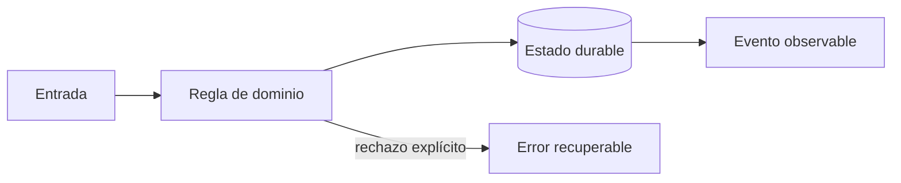
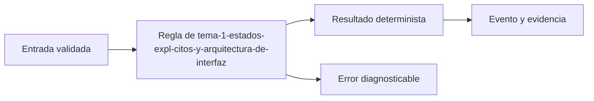
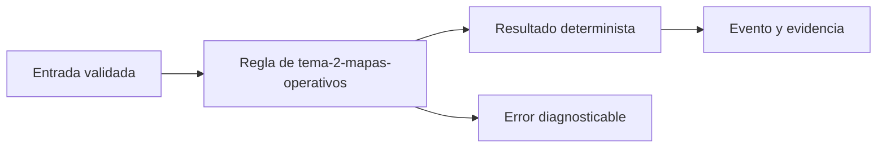
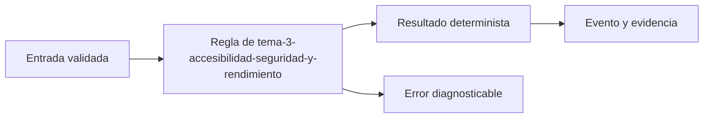

# Módulo 3: Frontend web: cliente y centro de operaciones


## Aprende construyendo

### Tema 1: Estados explícitos y arquitectura de interfaz

**Conceptos clave:** carga, vacío, éxito, error, cache, componentes y stores.

Una pantalla remota no tiene solo datos: puede estar cargando, desactualizada, vacía o fallar. Angular Signals o un hook React modelan esos estados sin mezclar transporte con presentación. Los componentes de dominio muestran ShipmentStatus; los adaptadores traducen DTO y errores del backend. El criterio no es memorizar la herramienta, sino poder predecir qué sucede ante duplicados, datos incompletos, concurrencia, pérdida de red o permisos insuficientes. Documenta supuestos y mide antes de optimizar.

**Analogía:** Es como un tablero de aeropuerto distingue vuelo a tiempo, retrasado, cancelado y sin información.

**¿Por qué es importante?** Porque evita spinners infinitos, datos viejos presentados como actuales y componentes imposibles de probar. En RutaFlow la decisión se valida con una prueba automatizada y una observación operativa, no solo con una captura de pantalla.

**Casos de uso reales:** estudia el flujo normal, un reintento, un dato tardío y un acceso sin permiso. Dibuja primero el flujo y marca dónde puede fallar.

**Diagrama:**



#### Paso 1 · Objetivo y preparación

Al finalizar podrás construir y verificar **Tema 1: Estados explícitos y arquitectura de interfaz** dentro de RutaFlow, empezando desde una carpeta vacía y explicando qué decisión técnica resuelve. **Conocimiento previo:** terminal, Git y lectura de JSON.

#### Paso 2 · Contexto y caso real

**¿Por qué es importante?** En una plataforma de entregas, tema 1: estados explícitos y arquitectura de interfaz afecta directamente la trazabilidad, la seguridad y la capacidad de recuperar un fallo. Separar la decisión del detalle de infraestructura permite probarla antes de desplegarla y evita que una pantalla o un proveedor externo se convierta en la única fuente de verdad.

**Caso real:** una entrega puede repetirse, llegar fuera de orden o quedarse sin conexión. El diseño debe conservar una salida determinista y una evidencia que otra persona pueda revisar.

#### Paso 3 · Teoría, conceptos y analogía

**Conceptos clave:** contrato, estado, evidencia, idempotencia, observabilidad y límite de responsabilidad. Piensa en este tema como una estación de clasificación: recibe una entrada con formato conocido, aplica una regla explícita y entrega una salida que puede auditarse. Si una regla no se puede observar ni probar, todavía no es una parte confiable del sistema.

**Analogía:** es como una guía de despacho: cada paquete tiene una etiqueta, una operación responsable y una marca que demuestra qué ocurrió.



#### Paso 4 · Demostración guiada desde cero

Crea una carpeta independiente para comprobar el concepto antes de conectarlo al monorepo. Después crea `src/tema.js`:

```bash
mkdir -p rutaflow-labs/tema-1-estados-expl-citos-y-arquitectura-de-interfaz
cd rutaflow-labs/tema-1-estados-expl-citos-y-arquitectura-de-interfaz
printf '%s\n' '{"tema":"Tema 1: Estados explícitos y arquitectura de interfaz","estado":"preparado"}' > evidencia.json
cat evidencia.json
```

```javascript
// La entrada representa un contrato mínimo y verificable.
const entrada = { tema: 'Tema 1: Estados explícitos y arquitectura de interfaz', estado: 'preparado' };
const salida = { ...entrada, evidencia: true };
console.log(JSON.stringify(salida));
```

Ejecuta la comprobación desde `rutaflow-labs/tema-1-estados-expl-citos-y-arquitectura-de-interfaz/`:

```bash
node -e "const fs=require('fs'); const x=JSON.parse(fs.readFileSync('evidencia.json','utf8')); if (!x.tema) throw new Error('Falta tema'); console.log('OK', x.tema);"
```

**Resultado esperado:** el comando imprime `OK` y el nombre del tema; `evidencia.json` conserva una entrada reproducible.

**Fallo deliberado:** cambia `tema` por una cadena vacía y ejecuta de nuevo. El proceso debe fallar con `Falta tema`; diagnostica leyendo la primera causa, corrige solo ese dato y repite la prueba.

#### Paso 5 · Práctica guiada

1. Añade un campo `version` y rechaza valores menores que `1`.
2. Registra una salida JSON de éxito y otra de error sin mezclar ambas.
3. Pista: valida la entrada antes de ejecutar la regla y conserva el mensaje original del error.

#### Paso 6 · Práctica independiente

Implementa una función `procesarEntrada(entrada)` que devuelva una salida determinista, rechace entradas incompletas y pueda ejecutarse dos veces sin duplicar evidencia. No copies la solución del paso anterior; escribe primero el contrato y después el código.

#### Paso 7 · Cierre, evidencia y proyecto

Entrega el archivo `evidencia.json`, la salida `OK`, la salida del fallo deliberado y una breve explicación de la decisión. El siguiente tema conecta este incremento con el proyecto RutaFlow: **Tema 1: Estados explícitos y arquitectura de interfaz** debe convertirse en una capacidad comprobable, observable y recuperable. **Fuente oficial:** [https://developer.mozilla.org/en-US/docs/Learn_web_development](https://developer.mozilla.org/en-US/docs/Learn_web_development).

**Errores comunes:** ejecutar desde otra carpeta; validar después de mutar el estado; ocultar el mensaje original del error; no conservar evidencia; asumir que un proveedor externo siempre responde.
### Tema 2: Mapas operativos

**Conceptos clave:** viewport, capas, clustering, selección, actualización incremental y precisión.

No se renderizan miles de marcadores DOM. El servidor limita por bounding box; el cliente agrupa puntos y actualiza solo entidades modificadas. Color no es el único canal: icono y texto comunican estado. La última posición muestra hora y círculo de precisión, no una certeza animada. El criterio no es memorizar la herramienta, sino poder predecir qué sucede ante duplicados, datos incompletos, concurrencia, pérdida de red o permisos insuficientes. Documenta supuestos y mide antes de optimizar.

**Analogía:** Es como un mapa de calor resume una multitud antes de pedir el detalle de una persona.

**¿Por qué es importante?** Porque mantiene legible y rápida una herramienta de decisión. En RutaFlow la decisión se valida con una prueba automatizada y una observación operativa, no solo con una captura de pantalla.

**Casos de uso reales:** estudia el flujo normal, un reintento, un dato tardío y un acceso sin permiso. Dibuja primero el flujo y marca dónde puede fallar.

**Diagrama:**


#### Paso 1 · Objetivo y preparación

Al finalizar podrás construir y verificar **Tema 2: Mapas operativos** dentro de RutaFlow, empezando desde una carpeta vacía y explicando qué decisión técnica resuelve. **Conocimiento previo:** terminal, Git y lectura de JSON.

#### Paso 2 · Contexto y caso real

**¿Por qué es importante?** En una plataforma de entregas, tema 2: mapas operativos afecta directamente la trazabilidad, la seguridad y la capacidad de recuperar un fallo. Separar la decisión del detalle de infraestructura permite probarla antes de desplegarla y evita que una pantalla o un proveedor externo se convierta en la única fuente de verdad.

**Caso real:** una entrega puede repetirse, llegar fuera de orden o quedarse sin conexión. El diseño debe conservar una salida determinista y una evidencia que otra persona pueda revisar.

#### Paso 3 · Teoría, conceptos y analogía

**Conceptos clave:** contrato, estado, evidencia, idempotencia, observabilidad y límite de responsabilidad. Piensa en este tema como una estación de clasificación: recibe una entrada con formato conocido, aplica una regla explícita y entrega una salida que puede auditarse. Si una regla no se puede observar ni probar, todavía no es una parte confiable del sistema.

**Analogía:** es como una guía de despacho: cada paquete tiene una etiqueta, una operación responsable y una marca que demuestra qué ocurrió.



#### Paso 4 · Demostración guiada desde cero

Crea una carpeta independiente para comprobar el concepto antes de conectarlo al monorepo. Después crea `src/tema.js`:

```bash
mkdir -p rutaflow-labs/tema-2-mapas-operativos
cd rutaflow-labs/tema-2-mapas-operativos
printf '%s\n' '{"tema":"Tema 2: Mapas operativos","estado":"preparado"}' > evidencia.json
cat evidencia.json
```

```javascript
// La entrada representa un contrato mínimo y verificable.
const entrada = { tema: 'Tema 2: Mapas operativos', estado: 'preparado' };
const salida = { ...entrada, evidencia: true };
console.log(JSON.stringify(salida));
```

Ejecuta la comprobación desde `rutaflow-labs/tema-2-mapas-operativos/`:

```bash
node -e "const fs=require('fs'); const x=JSON.parse(fs.readFileSync('evidencia.json','utf8')); if (!x.tema) throw new Error('Falta tema'); console.log('OK', x.tema);"
```

**Resultado esperado:** el comando imprime `OK` y el nombre del tema; `evidencia.json` conserva una entrada reproducible.

**Fallo deliberado:** cambia `tema` por una cadena vacía y ejecuta de nuevo. El proceso debe fallar con `Falta tema`; diagnostica leyendo la primera causa, corrige solo ese dato y repite la prueba.

#### Paso 5 · Práctica guiada

1. Añade un campo `version` y rechaza valores menores que `1`.
2. Registra una salida JSON de éxito y otra de error sin mezclar ambas.
3. Pista: valida la entrada antes de ejecutar la regla y conserva el mensaje original del error.

#### Paso 6 · Práctica independiente

Implementa una función `procesarEntrada(entrada)` que devuelva una salida determinista, rechace entradas incompletas y pueda ejecutarse dos veces sin duplicar evidencia. No copies la solución del paso anterior; escribe primero el contrato y después el código.

#### Paso 7 · Cierre, evidencia y proyecto

Entrega el archivo `evidencia.json`, la salida `OK`, la salida del fallo deliberado y una breve explicación de la decisión. El siguiente tema conecta este incremento con el proyecto RutaFlow: **Tema 2: Mapas operativos** debe convertirse en una capacidad comprobable, observable y recuperable. **Fuente oficial:** [https://developer.mozilla.org/en-US/docs/Learn_web_development](https://developer.mozilla.org/en-US/docs/Learn_web_development).

**Errores comunes:** ejecutar desde otra carpeta; validar después de mutar el estado; ocultar el mensaje original del error; no conservar evidencia; asumir que un proveedor externo siempre responde.
### Tema 3: Accesibilidad, seguridad y rendimiento

**Conceptos clave:** teclado, foco, contraste, XSS, CSP, budgets y pruebas.

El mapa tiene alternativa tabular; filtros poseen etiquetas; diálogos gestionan foco. Datos externos se tratan como texto y una CSP limita ejecución. Se miden LCP, interacción y tamaño de bundles. Pruebas unitarias cubren estados y E2E recorre cotización y tracking con teclado. El criterio no es memorizar la herramienta, sino poder predecir qué sucede ante duplicados, datos incompletos, concurrencia, pérdida de red o permisos insuficientes. Documenta supuestos y mide antes de optimizar.

**Analogía:** Es como una rampa no es un adorno: cambia quién puede entrar al edificio.

**¿Por qué es importante?** Porque una aplicación profesional funciona bajo discapacidad, mala red y dispositivos modestos. En RutaFlow la decisión se valida con una prueba automatizada y una observación operativa, no solo con una captura de pantalla.

**Casos de uso reales:** estudia el flujo normal, un reintento, un dato tardío y un acceso sin permiso. Dibuja primero el flujo y marca dónde puede fallar.

**Diagrama:**


#### Paso 1 · Objetivo y preparación

Al finalizar podrás construir y verificar **Tema 3: Accesibilidad, seguridad y rendimiento** dentro de RutaFlow, empezando desde una carpeta vacía y explicando qué decisión técnica resuelve. **Conocimiento previo:** terminal, Git y lectura de JSON.

#### Paso 2 · Contexto y caso real

**¿Por qué es importante?** En una plataforma de entregas, tema 3: accesibilidad, seguridad y rendimiento afecta directamente la trazabilidad, la seguridad y la capacidad de recuperar un fallo. Separar la decisión del detalle de infraestructura permite probarla antes de desplegarla y evita que una pantalla o un proveedor externo se convierta en la única fuente de verdad.

**Caso real:** una entrega puede repetirse, llegar fuera de orden o quedarse sin conexión. El diseño debe conservar una salida determinista y una evidencia que otra persona pueda revisar.

#### Paso 3 · Teoría, conceptos y analogía

**Conceptos clave:** contrato, estado, evidencia, idempotencia, observabilidad y límite de responsabilidad. Piensa en este tema como una estación de clasificación: recibe una entrada con formato conocido, aplica una regla explícita y entrega una salida que puede auditarse. Si una regla no se puede observar ni probar, todavía no es una parte confiable del sistema.

**Analogía:** es como una guía de despacho: cada paquete tiene una etiqueta, una operación responsable y una marca que demuestra qué ocurrió.



#### Paso 4 · Demostración guiada desde cero

Crea una carpeta independiente para comprobar el concepto antes de conectarlo al monorepo. Después crea `src/tema.js`:

```bash
mkdir -p rutaflow-labs/tema-3-accesibilidad-seguridad-y-rendimiento
cd rutaflow-labs/tema-3-accesibilidad-seguridad-y-rendimiento
printf '%s\n' '{"tema":"Tema 3: Accesibilidad, seguridad y rendimiento","estado":"preparado"}' > evidencia.json
cat evidencia.json
```

```javascript
// La entrada representa un contrato mínimo y verificable.
const entrada = { tema: 'Tema 3: Accesibilidad, seguridad y rendimiento', estado: 'preparado' };
const salida = { ...entrada, evidencia: true };
console.log(JSON.stringify(salida));
```

Ejecuta la comprobación desde `rutaflow-labs/tema-3-accesibilidad-seguridad-y-rendimiento/`:

```bash
node -e "const fs=require('fs'); const x=JSON.parse(fs.readFileSync('evidencia.json','utf8')); if (!x.tema) throw new Error('Falta tema'); console.log('OK', x.tema);"
```

**Resultado esperado:** el comando imprime `OK` y el nombre del tema; `evidencia.json` conserva una entrada reproducible.

**Fallo deliberado:** cambia `tema` por una cadena vacía y ejecuta de nuevo. El proceso debe fallar con `Falta tema`; diagnostica leyendo la primera causa, corrige solo ese dato y repite la prueba.

#### Paso 5 · Práctica guiada

1. Añade un campo `version` y rechaza valores menores que `1`.
2. Registra una salida JSON de éxito y otra de error sin mezclar ambas.
3. Pista: valida la entrada antes de ejecutar la regla y conserva el mensaje original del error.

#### Paso 6 · Práctica independiente

Implementa una función `procesarEntrada(entrada)` que devuelva una salida determinista, rechace entradas incompletas y pueda ejecutarse dos veces sin duplicar evidencia. No copies la solución del paso anterior; escribe primero el contrato y después el código.

#### Paso 7 · Cierre, evidencia y proyecto

Entrega el archivo `evidencia.json`, la salida `OK`, la salida del fallo deliberado y una breve explicación de la decisión. El siguiente tema conecta este incremento con el proyecto RutaFlow: **Tema 3: Accesibilidad, seguridad y rendimiento** debe convertirse en una capacidad comprobable, observable y recuperable. **Fuente oficial:** [https://developer.mozilla.org/en-US/docs/Learn_web_development](https://developer.mozilla.org/en-US/docs/Learn_web_development).

**Errores comunes:** ejecutar desde otra carpeta; validar después de mutar el estado; ocultar el mensaje original del error; no conservar evidencia; asumir que un proveedor externo siempre responde.
