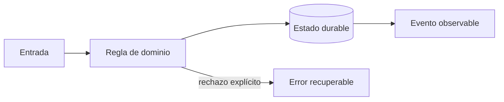

# Módulo 3: Frontend web: cliente y centro de operaciones

## Sílabo

**Objetivo general:** Crear interfaces comprensibles, accesibles y seguras para clientes y operación.

Al terminar, podrás explicar las decisiones con vocabulario técnico sencillo, implementar una vertical funcional, provocar al menos un fallo y demostrar su recuperación. El producto de estudio es ficticio: evita copiar marcas, identidades o datos de una empresa real.

**Evaluación:** 20 % modelo y explicación, 40 % laboratorio ejecutable, 25 % pruebas y manejo de fallos, 15 % documentación y demostración.

## Aprende construyendo

### Tema 1: Estados explícitos y arquitectura de interfaz

**Conceptos clave:** carga, vacío, éxito, error, cache, componentes y stores.

Una pantalla remota no tiene solo datos: puede estar cargando, desactualizada, vacía o fallar. Angular Signals o un hook React modelan esos estados sin mezclar transporte con presentación. Los componentes de dominio muestran ShipmentStatus; los adaptadores traducen DTO y errores del backend. El criterio no es memorizar la herramienta, sino poder predecir qué sucede ante duplicados, datos incompletos, concurrencia, pérdida de red o permisos insuficientes. Documenta supuestos y mide antes de optimizar.

**Analogía:** Es como un tablero de aeropuerto distingue vuelo a tiempo, retrasado, cancelado y sin información.

**¿Por qué es importante?** Porque evita spinners infinitos, datos viejos presentados como actuales y componentes imposibles de probar. En RutaFlow la decisión se valida con una prueba automatizada y una observación operativa, no solo con una captura de pantalla.

**Casos de uso reales:** estudia el flujo normal, un reintento, un dato tardío y un acceso sin permiso. Dibuja primero el flujo y marca dónde puede fallar.

**Diagrama:**


### Tema 2: Mapas operativos

**Conceptos clave:** viewport, capas, clustering, selección, actualización incremental y precisión.

No se renderizan miles de marcadores DOM. El servidor limita por bounding box; el cliente agrupa puntos y actualiza solo entidades modificadas. Color no es el único canal: icono y texto comunican estado. La última posición muestra hora y círculo de precisión, no una certeza animada. El criterio no es memorizar la herramienta, sino poder predecir qué sucede ante duplicados, datos incompletos, concurrencia, pérdida de red o permisos insuficientes. Documenta supuestos y mide antes de optimizar.

**Analogía:** Es como un mapa de calor resume una multitud antes de pedir el detalle de una persona.

**¿Por qué es importante?** Porque mantiene legible y rápida una herramienta de decisión. En RutaFlow la decisión se valida con una prueba automatizada y una observación operativa, no solo con una captura de pantalla.

**Casos de uso reales:** estudia el flujo normal, un reintento, un dato tardío y un acceso sin permiso. Dibuja primero el flujo y marca dónde puede fallar.

**Diagrama:**


### Tema 3: Accesibilidad, seguridad y rendimiento

**Conceptos clave:** teclado, foco, contraste, XSS, CSP, budgets y pruebas.

El mapa tiene alternativa tabular; filtros poseen etiquetas; diálogos gestionan foco. Datos externos se tratan como texto y una CSP limita ejecución. Se miden LCP, interacción y tamaño de bundles. Pruebas unitarias cubren estados y E2E recorre cotización y tracking con teclado. El criterio no es memorizar la herramienta, sino poder predecir qué sucede ante duplicados, datos incompletos, concurrencia, pérdida de red o permisos insuficientes. Documenta supuestos y mide antes de optimizar.

**Analogía:** Es como una rampa no es un adorno: cambia quién puede entrar al edificio.

**¿Por qué es importante?** Porque una aplicación profesional funciona bajo discapacidad, mala red y dispositivos modestos. En RutaFlow la decisión se valida con una prueba automatizada y una observación operativa, no solo con una captura de pantalla.

**Casos de uso reales:** estudia el flujo normal, un reintento, un dato tardío y un acceso sin permiso. Dibuja primero el flujo y marca dónde puede fallar.

**Diagrama:**


## Criterio transversal de calidad del código

Usa nombres del dominio (`confirmDelivery`, no `processData`), funciones pequeñas con una responsabilidad observable y errores tipados que conserven causa y contexto sin revelar secretos. Primero escribe una prueba del comportamiento o del fallo que quieres controlar; luego implementa la solución más simple. Aplica SOLID cuando existe presión real de cambio: separa políticas de infraestructura, invierte dependencias en límites externos y evita interfaces enormes. No abstraer antes de encontrar repetición con el mismo significado. Revisa corrección, claridad, cohesión, seguridad, complejidad y capacidad de operación; Clean Code no justifica ocultar costes ni crear capas ceremoniales.


## Laboratorio práctico

Trabaja sobre `examples/rutaflow` y crea una rama para el módulo. Empieza con una prueba roja que represente la regla central; implementa el camino mínimo y luego agrega un fallo deliberado. Ejecuta linters y pruebas desde terminal para que el resultado no dependa del editor.

1. Dibuja el flujo entrada → regla → persistencia → evento → interfaz y escribe dos invariantes.
2. Implementa una vertical pequeña con tipos explícitos y un límite de infraestructura sustituible.
3. Añade pruebas para éxito, entrada inválida, repetición y dependencia no disponible.
4. Registra logs estructurados sin PII, una métrica de resultado y un correlation ID.
5. Explica en el README cómo iniciar, verificar, detener y limpiar el laboratorio.

Usa este contrato como guía, adaptándolo al lenguaje del módulo:

```text
Given un envío existente y una identidad autorizada
When se ejecuta el comando con una clave idempotente
Then cambia una sola vez, persiste un evento y expone el mismo resultado ante reintento
```

**Definición de terminado:** otra persona puede clonar el repositorio, seguir instrucciones, ejecutar la prueba, observar el fallo controlado y comprender la decisión sin preguntarte qué botón presionar.


## Rúbrica del proyecto

| Criterio | Inicial | Competente | Profesional |
|---|---|---|---|
| Fundamento | Repite términos | Explica la decisión | Compara alternativas y límites |
| Funcionamiento | Solo camino feliz | Maneja fallos previstos | Demuestra recuperación e idempotencia |
| Código | Acoplado y ambiguo | Claro y probado | Límites cohesionados y deuda explícita |
| Datos y seguridad | Usa datos reales | Minimiza y autoriza | Audita, retiene y modela amenazas |
| Operación | Requiere pasos ocultos | README reproducible | Métricas, runbook y evidencia |

## Bibliografía y fundamento académico

- Documentación oficial de las tecnologías enlazadas desde el panel **Actualizaciones oficiales** de la Academia; verifica versión y fecha antes de aplicar una API.
- Eric Evans, *Domain-Driven Design*, para lenguaje ubicuo, agregados e invariantes.
- Martin Kleppmann, *Designing Data-Intensive Applications*, para datos, replicación, streams y fallos.
- NIST Secure Software Development Framework y OWASP ASVS/MASVS, para ciclo de desarrollo y controles verificables.
- Google SRE Book y SRE Workbook, para SLI, SLO, presupuesto de error e incidentes.
- W3C WCAG, RFC de HTTP y OpenTelemetry Specification cuando la decisión afecte accesibilidad, contratos u observabilidad.

Las fuentes son punto de partida, no autoridad incuestionable: registra versión, distingue norma de recomendación y valida cada afirmación con un experimento reproducible.

## Resumen del módulo

Este capítulo conecta fundamento, implementación y operación. Debes poder contar qué problema resolviste, qué invariante protegiste, cómo comprobaste el comportamiento y qué límite conserva la solución. La evidencia final incluye código, pruebas, diagrama, ADR y demostración; completar una lista de temas sin poder explicar los fallos no representa dominio profesional.
