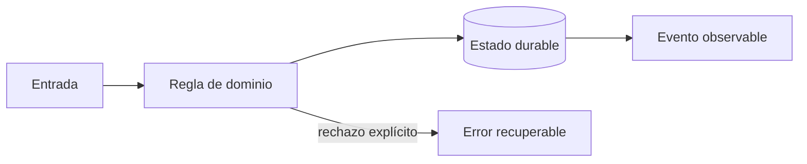

# Módulo 3: Frontend web: cliente y centro de operaciones

## Aprende construyendo

### Tema 1: Estados explícitos y arquitectura de interfaz

**Conceptos clave:** carga, vacío, éxito, error, cache, componentes y stores.

Una pantalla remota no tiene solo datos: puede estar cargando, desactualizada, vacía o fallar. Angular Signals o un hook React modelan esos estados sin mezclar transporte con presentación. Los componentes de dominio muestran ShipmentStatus; los adaptadores traducen DTO y errores del backend. El criterio no es memorizar la herramienta, sino poder predecir qué sucede ante duplicados, datos incompletos, concurrencia, pérdida de red o permisos insuficientes. Documenta supuestos y mide antes de optimizar.

**Analogía:** Es como un tablero de aeropuerto distingue vuelo a tiempo, retrasado, cancelado y sin información.

**¿Por qué es importante?** Porque evita spinners infinitos, datos viejos presentados como actuales y componentes imposibles de probar. En RutaFlow la decisión se valida con una prueba automatizada y una observación operativa, no solo con una captura de pantalla.

**Casos de uso reales:** estudia el flujo normal, un reintento, un dato tardío y un acceso sin permiso. Dibuja primero el flujo y marca dónde puede fallar.

**Diagrama:**

### Tema 2: Mapas operativos

**Conceptos clave:** viewport, capas, clustering, selección, actualización incremental y precisión.

No se renderizan miles de marcadores DOM. El servidor limita por bounding box; el cliente agrupa puntos y actualiza solo entidades modificadas. Color no es el único canal: icono y texto comunican estado. La última posición muestra hora y círculo de precisión, no una certeza animada. El criterio no es memorizar la herramienta, sino poder predecir qué sucede ante duplicados, datos incompletos, concurrencia, pérdida de red o permisos insuficientes. Documenta supuestos y mide antes de optimizar.

**Analogía:** Es como un mapa de calor resume una multitud antes de pedir el detalle de una persona.

**¿Por qué es importante?** Porque mantiene legible y rápida una herramienta de decisión. En RutaFlow la decisión se valida con una prueba automatizada y una observación operativa, no solo con una captura de pantalla.

**Casos de uso reales:** estudia el flujo normal, un reintento, un dato tardío y un acceso sin permiso. Dibuja primero el flujo y marca dónde puede fallar.

**Diagrama:**

### Tema 3: Accesibilidad, seguridad y rendimiento

**Conceptos clave:** teclado, foco, contraste, XSS, CSP, budgets y pruebas.

El mapa tiene alternativa tabular; filtros poseen etiquetas; diálogos gestionan foco. Datos externos se tratan como texto y una CSP limita ejecución. Se miden LCP, interacción y tamaño de bundles. Pruebas unitarias cubren estados y E2E recorre cotización y tracking con teclado. El criterio no es memorizar la herramienta, sino poder predecir qué sucede ante duplicados, datos incompletos, concurrencia, pérdida de red o permisos insuficientes. Documenta supuestos y mide antes de optimizar.

**Analogía:** Es como una rampa no es un adorno: cambia quién puede entrar al edificio.

**¿Por qué es importante?** Porque una aplicación profesional funciona bajo discapacidad, mala red y dispositivos modestos. En RutaFlow la decisión se valida con una prueba automatizada y una observación operativa, no solo con una captura de pantalla.

**Casos de uso reales:** estudia el flujo normal, un reintento, un dato tardío y un acceso sin permiso. Dibuja primero el flujo y marca dónde puede fallar.

**Diagrama:**

