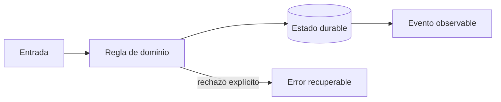
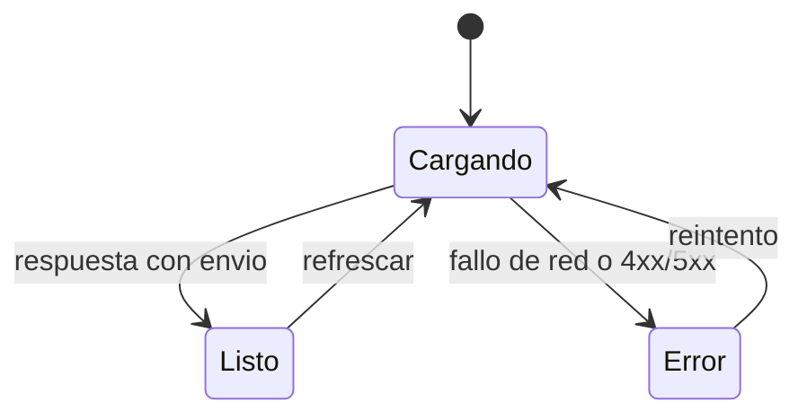
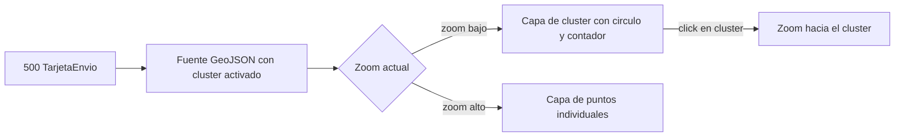
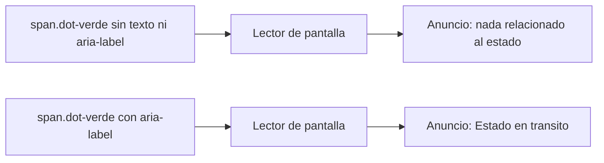

# Módulo 3: Frontend web: cliente y centro de operaciones


## Aprende construyendo

### Tema 1: Estados explícitos y arquitectura de interfaz

**Conceptos clave:** carga, vacío, éxito, error, cache, componentes y stores.

Una pantalla remota no tiene solo datos: puede estar cargando, desactualizada, vacía o fallar. Angular Signals o un hook React modelan esos estados sin mezclar transporte con presentación. Los componentes de dominio muestran EstadoEnvio; los adaptadores traducen DTO y errores del backend. El criterio no es memorizar la herramienta, sino poder predecir qué sucede ante duplicados, datos incompletos, concurrencia, pérdida de red o permisos insuficientes. Documenta supuestos y mide antes de optimizar.

**Analogía:** Es como un tablero de aeropuerto distingue vuelo a tiempo, retrasado, cancelado y sin información.

**¿Por qué es importante?** Porque evita spinners infinitos, datos viejos presentados como actuales y componentes imposibles de probar. En RutaFlow la decisión se valida con una prueba automatizada y una observación operativa, no solo con una captura de pantalla.

**Casos de uso reales:** estudia el flujo normal, un reintento, un dato tardío y un acceso sin permiso. Dibuja primero el flujo y marca dónde puede fallar.

**Diagrama:**


```mermaid
flowchart LR
  A[Entrada] --> B[Regla de dominio]
  B --> C[(Estado durable)]
  C --> D[Evento observable]
  B -->|rechazo explícito| E[Error recuperable]
```

#### Paso 1 · Objetivo y preparación

Al finalizar vas a tener un tipo de estado explícito (unión discriminada) para la vista de seguimiento de un envío, en vez de banderas sueltas (`isLoading`, `hasError`, `envio`) que pueden contradecirse entre sí. Vas a construirlo desde una carpeta vacía y vas a poder explicar por qué una unión discriminada hace imposible, a nivel de datos, que la vista esté "cargando" y "lista" al mismo tiempo. **Conocimiento previo:** terminal, Git y JavaScript básico (objetos y `switch`).

#### Paso 2 · Contexto y caso real

**¿Por qué es importante?** La vista de seguimiento de un envío puede estar cargando, puede haber terminado con datos, o puede haber fallado — pero nunca dos de esas cosas a la vez. Si el estado se modela con banderas sueltas, nada impide que las tres sean verdaderas simultáneamente: la pantalla queda obligada a *adivinar* cuál manda, y ahí aparecen los spinners que nunca desaparecen o los errores que tapan un dato que ya había llegado.

**Caso real:** un operador abre el tracking de `RF-4471` justo cuando la respuesta anterior todavía no terminó de limpiarse y llega un error de red de un reintento automático. Con banderas sueltas, `envio` (del éxito previo), `hasError` (del fallo nuevo) e `isLoading` (del reintento) pueden coexistir en el mismo render. Con una unión discriminada, el estado solo puede tomar una de esas tres formas — no hay combinación ambigua que resolver dentro del componente.

#### Paso 3 · Teoría, conceptos y analogía

**Conceptos clave:** unión discriminada (*discriminated union*), campo etiqueta (`tipo`), exhaustividad, estado derivado vs. única fuente de verdad. En Angular esto se modela con un `Signal<EstadoVista>` donde `EstadoVista` es la unión; en React, con un único `useState`/`useReducer` sobre ese mismo tipo en vez de tres estados booleanos independientes. La idea central: el dato ya prohíbe los estados imposibles, no hace falta acordarse de validarlos en cada componente que lo consume.

**Analogía:** es como un semáforo real: nunca muestra rojo y verde a la vez porque el propio hardware no lo permite — no depende de que el conductor interprete correctamente dos luces encendidas juntas.


```mermaid
stateDiagram-v2
  [*] --> Cargando
  Cargando --> Listo: respuesta con envio
  Cargando --> Error: fallo de red o 4xx/5xx
  Error --> Cargando: reintento
  Listo --> Cargando: refrescar
```

#### Paso 4 · Demostración guiada desde cero

Crea una carpeta independiente para comprobar el tipo de estado antes de conectarlo al componente real. Después crea `src/estado-vista.js`:

```bash
mkdir -p rutaflow-labs/tema-1-estado-vista/src
cd rutaflow-labs/tema-1-estado-vista
```

```javascript
// src/estado-vista.js
// Union discriminada: el campo "tipo" es la unica fuente de verdad del estado.
function estadoCargando() {
  return { tipo: 'cargando' };
}
function estadoListo(envio) {
  return { tipo: 'listo', envio };
}
function estadoError(mensaje) {
  return { tipo: 'error', mensaje };
}

function renderizar(estado) {
  switch (estado.tipo) {
    case 'cargando':
      return 'Cargando envio...';
    case 'listo':
      return `Envio ${estado.envio.codigo}: ${estado.envio.estado}`;
    case 'error':
      return `No se pudo cargar: ${estado.mensaje}`;
    default:
      throw new Error('Estado no manejado: ' + JSON.stringify(estado));
  }
}

const envio = { codigo: 'RF-4471', estado: 'en_transito' };
console.log(renderizar(estadoCargando()));
console.log(renderizar(estadoListo(envio)));
console.log(renderizar(estadoError('timeout de red')));
```

Ejecuta el script desde `rutaflow-labs/tema-1-estado-vista/`:

```bash
node src/estado-vista.js
```

**Resultado esperado:**

```
Cargando envio...
Envio RF-4471: en_transito
No se pudo cargar: timeout de red
```

Cada llamada a `renderizar` recibe una única forma de estado — nunca una mezcla.

**Fallo deliberado:** crea `src/estado-vista-roto.js` con la versión de banderas sueltas que el tipo explícito reemplaza:

```javascript
// src/estado-vista-roto.js
// Version con banderas sueltas: nada impide una combinacion imposible.
function renderizarBooleans({ isLoading, hasError, envio }) {
  if (isLoading) return 'Cargando envio...';
  if (hasError) return 'No se pudo cargar: error desconocido';
  return `Envio ${envio.codigo}: ${envio.estado}`;
}

const estadoImposible = {
  isLoading: true,
  hasError: true,
  envio: { codigo: 'RF-4471', estado: 'en_transito' },
};

console.log(renderizarBooleans(estadoImposible));
```

Ejecuta `node src/estado-vista-roto.js`. Imprime `Cargando envio...`: un spinner infinito aunque el envío **ya llegó** y aunque **hay un error real** pendiente de mostrar. Las tres banderas son `true`/con-dato a la vez, y el `if` solo revisa en el orden en que lo escribiste; con la unión discriminada del Paso 4 esta combinación ni siquiera se puede construir, porque `estado.tipo` solo admite un valor a la vez.

#### Paso 5 · Práctica guiada

1. Agrega un cuarto estado `vacio` (`{ tipo: 'vacio' }`) para cuando el envío todavía no tiene eventos, y actualiza `renderizar` para manejarlo de forma explícita (no con un `default` silencioso).
2. Hace que `estadoListo` valide que `envio.codigo` empiece con `RF-` y lance un error si no, antes de construir el estado.
3. Pista: si agregás un caso nuevo a la unión y el `switch` no lo maneja, el `default` del Paso 4 debe lanzar, nunca devolver un string vacío en silencio — esa es la exhaustividad que reemplaza al chequeo manual de combinaciones.

#### Paso 6 · Práctica independiente

Implementa un reductor `reducirEstadoVista(estadoActual, evento)` que reciba eventos `{ tipo: 'CARGAR' }`, `{ tipo: 'EXITO', envio }` o `{ tipo: 'ERROR', mensaje }` y devuelva siempre un `EstadoVista` nuevo y completo, nunca una mezcla del estado anterior con el nuevo. Verifica que, sin importar el estado de partida, un evento `EXITO` deje el resultado en `{ tipo: 'listo', envio }` y nada más — ningún campo de un estado anterior (por ejemplo `mensaje` de un error previo) debe sobrevivir. No copies la solución del Paso 4; escribe primero la firma del reductor y después el código.

#### Paso 7 · Cierre, evidencia y proyecto

Entrega `src/estado-vista.js` con su salida de tres líneas, `src/estado-vista-roto.js` con el `Cargando envio...` engañoso reproducido, y una explicación de por qué una unión discriminada elimina por construcción un estado imposible que las banderas sueltas permiten. El siguiente tema (**Tema 2: Mapas operativos**) aplica esta misma idea de estado explícito a cientos de pines en un mapa en vez de a una sola vista de seguimiento. **Fuente oficial:** [https://react.dev/learn/choosing-the-state-structure#avoid-contradictions-in-state](https://react.dev/learn/choosing-the-state-structure#avoid-contradictions-in-state).

**Errores comunes:** modelar el estado con banderas booleanas independientes; dejar un `default` que devuelve un valor en vez de lanzar; mezclar campos de estados distintos (por ejemplo conservar `mensaje` de un error en el estado `listo`); tratar el caso `vacio` como si fuera lo mismo que `error`.
### Tema 2: Mapas operativos

**Conceptos clave:** viewport, capas, clustering, selección, actualización incremental y precisión.

No se renderizan miles de marcadores DOM. El servidor limita por bounding box; el cliente agrupa puntos y actualiza solo entidades modificadas. Color no es el único canal: icono y texto comunican estado. La última posición muestra hora y círculo de precisión, no una certeza animada. El criterio no es memorizar la herramienta, sino poder predecir qué sucede ante duplicados, datos incompletos, concurrencia, pérdida de red o permisos insuficientes. Documenta supuestos y mide antes de optimizar.

**Analogía:** Es como un mapa de calor resume una multitud antes de pedir el detalle de una persona.

**¿Por qué es importante?** Porque mantiene legible y rápida una herramienta de decisión. En RutaFlow la decisión se valida con una prueba automatizada y una observación operativa, no solo con una captura de pantalla.

**Casos de uso reales:** estudia el flujo normal, un reintento, un dato tardío y un acceso sin permiso. Dibuja primero el flujo y marca dónde puede fallar.

**Diagrama:**


```mermaid
flowchart LR
  A[Entrada] --> B[Regla de dominio]
  B --> C[(Estado durable)]
  C --> D[Evento observable]
  B -->|rechazo explícito| E[Error recuperable]
```

#### Paso 1 · Objetivo y preparación

Al finalizar vas a poder agrupar (clusterizar) 500 `TarjetaEnvio` en el mapa operativo usando una fuente GeoJSON de MapLibre con `cluster: true`, en vez de renderizar 500 marcadores individuales. Vas a medir primero el problema real que resuelve el clustering. **Conocimiento previo:** terminal, Git, JSON y nociones básicas de mapas (latitud/longitud, zoom).

#### Paso 2 · Contexto y caso real

**¿Por qué es importante?** Un centro de operaciones que sigue 500 envíos en una sola ciudad no puede mostrar 500 marcadores individuales a la vez: al nivel de zoom en el que se ve la ciudad completa, decenas de pines terminan superpuestos en el mismo puñado de píxeles — el operador no puede hacer click en uno en particular, y cada pan o zoom tiene que recalcular posición y estilo de los 500 elementos aunque casi ninguno cambió de pantalla.

**Caso real:** en hora pico, la zona del centro de distribución de una ciudad concentra decenas de envíos `en_transito` en un radio de pocas cuadras. Sin agrupar, esos pines se dibujan unos encima de otros; con clustering, MapLibre los reemplaza por un único círculo con el conteo, hasta que el operador hace zoom lo suficiente como para distinguirlos.

#### Paso 3 · Teoría, conceptos y analogía

**Conceptos clave:** fuente GeoJSON, `cluster: true`, `clusterRadius`, `clusterMaxZoom`, capa de cluster vs. capa de punto individual. MapLibre no agrupa marcadores DOM: agrupa *features* de una fuente GeoJSON dentro del propio motor de mapas, y expone capas que vos estilizás por separado — círculos de cluster (con el conteo como texto) y puntos individuales para lo que ya no está agrupado al nivel de zoom actual.

**Analogía:** es como un mapa de calor que resume una multitud antes de pedir el detalle de una persona: de lejos ves densidad (un número), de cerca ves el pin individual.


```mermaid
flowchart LR
  A[500 TarjetaEnvio] --> B[Fuente GeoJSON con cluster activado]
  B --> C{Zoom actual}
  C -->|zoom bajo| D[Capa de cluster con circulo y contador]
  C -->|zoom alto| E[Capa de puntos individuales]
  D -->|click en cluster| F[Zoom hacia el cluster]
```

#### Paso 4 · Demostración guiada desde cero

Crea una carpeta independiente para comprobar el clustering antes de conectarlo al mapa real. Después crea `src/clustering.js`:

```bash
mkdir -p rutaflow-labs/tema-2-clustering/src
cd rutaflow-labs/tema-2-clustering
```

```javascript
// src/clustering.js
// PRNG determinista: el mismo resultado siempre que corras el script.
function crearGenerador(semilla) {
  let estado = semilla;
  return function siguiente() {
    estado = (estado * 1103515245 + 12345) & 0x7fffffff;
    return estado / 0x7fffffff;
  };
}

function generarEnvios(cantidad, centro, semilla) {
  const azar = crearGenerador(semilla);
  const envios = [];
  for (let i = 0; i < cantidad; i++) {
    const offsetLat = (azar() - 0.5) * 0.08;
    const offsetLon = (azar() - 0.5) * 0.08;
    envios.push({ codigo: `RF-${1000 + i}`, lon: centro.lon + offsetLon, lat: centro.lat + offsetLat });
  }
  return envios;
}

function proyectarAPixeles(envio, centro, zoom) {
  const escala = (256 * Math.pow(2, zoom)) / 360;
  return { x: (envio.lon - centro.lon) * escala, y: (centro.lat - envio.lat) * escala };
}

// Agrupa puntos que caen en la misma celda de tamaño clusterRadius: la misma idea
// que usa una fuente GeoJSON de MapLibre con cluster: true / clusterRadius.
function agruparEnClusters(puntosPx, clusterRadius) {
  const celdas = new Map();
  for (const p of puntosPx) {
    const clave = `${Math.floor(p.x / clusterRadius)}:${Math.floor(p.y / clusterRadius)}`;
    celdas.set(clave, (celdas.get(clave) || 0) + 1);
  }
  return celdas;
}

function contarSuperpuestos(puntosPx, radioMarcadorPx) {
  let superpuestos = 0;
  for (let i = 0; i < puntosPx.length; i++) {
    const tieneVecino = puntosPx.some((q, j) => {
      if (j === i) return false;
      const dx = puntosPx[i].x - q.x;
      const dy = puntosPx[i].y - q.y;
      return Math.sqrt(dx * dx + dy * dy) < radioMarcadorPx;
    });
    if (tieneVecino) superpuestos++;
  }
  return superpuestos;
}

const bogota = { lat: 4.711, lon: -74.0721 };
const envios = generarEnvios(500, bogota, 42);
const zoom = 12; // vista de ciudad completa en el centro de operaciones
const puntosPx = envios.map((e) => proyectarAPixeles(e, bogota, zoom));

// Config real de fuente MapLibre con clustering activado.
const fuenteCluster = { type: 'geojson', cluster: true, clusterMaxZoom: 14, clusterRadius: 50 };
const clusters = agruparEnClusters(puntosPx, fuenteCluster.clusterRadius);

console.log('Envios totales:', envios.length);
console.log('Grupos visibles CON clustering (clusterRadius 50px):', clusters.size);

// --- Fallo deliberado: descomentar para medir sin agrupar ---
// const superpuestos = contarSuperpuestos(puntosPx, 24);
// console.log('Marcadores superpuestos SIN agrupar (radio 24px):', superpuestos, 'de', envios.length);
```

Ejecuta el script desde `rutaflow-labs/tema-2-clustering/`:

```bash
node src/clustering.js
```

**Resultado esperado:**

```
Envios totales: 500
Grupos visibles CON clustering (clusterRadius 50px): 36
```

500 envíos se reducen a 36 grupos visualmente distinguibles en el mapa, con el mismo `clusterRadius` que usarías en la fuente GeoJSON real de MapLibre.

**Fallo deliberado:** descomenta las dos últimas líneas del script (las que miden sin agrupar) y volvé a ejecutar `node src/clustering.js`. Imprime `Marcadores superpuestos SIN agrupar (radio 24px): 500 de 500`: al zoom de ciudad completa, el 100% de los marcadores tiene al menos otro marcador a menos de 24 píxeles de distancia — ninguno es clickeable por separado. Eso es exactamente lo que vería el operador si la fuente nunca hubiera tenido `cluster: true`: los 36 grupos del Paso 4 no son un detalle estético, son la diferencia entre un mapa operable y uno inútil.

#### Paso 5 · Práctica guiada

1. Cambia `clusterRadius` a `20` y de nuevo a `100`; compará cuántos grupos quedan visibles en cada caso al mismo `zoom`.
2. Agrega una comprobación que rechace un `clusterRadius` menor o igual a `0` (un radio inválido agruparía todo en una sola celda o nada en absoluto).
3. Pista: un `clusterRadius` más chico se parece más al caso sin agrupar; uno más grande junta zonas que en el mapa real quedarían demasiado lejos entre sí para tener sentido como un solo grupo.

#### Paso 6 · Práctica independiente

Implementa una función `actualizarClusters(puntosPx, clusterRadius, bbox)` que recalcule los grupos solo para los puntos dentro de un `bbox` (viewport) dado, sin volver a procesar los 500 puntos completos en cada pan o zoom. Verifica que mover el `bbox` sin tocar `clusterRadius` no cambie el resultado de los puntos que quedan fuera de la zona visible. No copies la solución del Paso 4; escribe primero la firma de la función y después el código.

#### Paso 7 · Cierre, evidencia y proyecto

Entrega `src/clustering.js` con la salida de 36 grupos, la salida de `500 de 500` del fallo deliberado reproducida, y una explicación de por qué agrupar por celda resuelve el problema medido. El siguiente tema (**Tema 3: Accesibilidad, seguridad y rendimiento**) retoma este mismo mapa para agregarle una alternativa tabular y hacerlo utilizable con teclado y lector de pantalla. **Fuente oficial:** [https://maplibre.org/maplibre-gl-js/docs/examples/cluster/](https://maplibre.org/maplibre-gl-js/docs/examples/cluster/).

**Errores comunes:** renderizar un marcador DOM por punto en vez de usar una fuente GeoJSON agrupable; elegir un `clusterRadius` sin medir cuántos grupos produce; recalcular los 500 puntos completos en cada movimiento del mapa en vez de solo los del viewport; confundir "menos marcadores en pantalla" con "menos datos": el conteo del cluster debe seguir siendo exacto.
### Tema 3: Accesibilidad, seguridad y rendimiento

**Conceptos clave:** teclado, foco, contraste, XSS, CSP, budgets y pruebas.

El mapa tiene alternativa tabular; filtros poseen etiquetas; diálogos gestionan foco. Datos externos se tratan como texto y una CSP limita ejecución. Se miden LCP, interacción y tamaño de bundles. Pruebas unitarias cubren estados y E2E recorre cotización y tracking con teclado. El criterio no es memorizar la herramienta, sino poder predecir qué sucede ante duplicados, datos incompletos, concurrencia, pérdida de red o permisos insuficientes. Documenta supuestos y mide antes de optimizar.

**Analogía:** Es como una rampa no es un adorno: cambia quién puede entrar al edificio.

**¿Por qué es importante?** Porque una aplicación profesional funciona bajo discapacidad, mala red y dispositivos modestos. En RutaFlow la decisión se valida con una prueba automatizada y una observación operativa, no solo con una captura de pantalla.

**Casos de uso reales:** estudia el flujo normal, un reintento, un dato tardío y un acceso sin permiso. Dibuja primero el flujo y marca dónde puede fallar.

**Diagrama:**


```mermaid
flowchart LR
  A[Entrada] --> B[Regla de dominio]
  B --> C[(Estado durable)]
  C --> D[Evento observable]
  B -->|rechazo explícito| E[Error recuperable]
```

#### Paso 1 · Objetivo y preparación

Al finalizar vas a poder diagnosticar y corregir una insignia de estado que comunica información **solo por color**, dejándola invisible para un lector de pantalla y para un operador con daltonismo. Vas a construir el diagnóstico desde cero antes de tocar la consola real. **Conocimiento previo:** terminal, Git, HTML básico y JavaScript.

#### Paso 2 · Contexto y caso real

**¿Por qué es importante?** Una consola de operaciones profesional la usa gente con distintas capacidades y en distintas condiciones: un operador con daltonismo no distingue un punto verde de uno rojo, y un operador que usa lector de pantalla no "ve" ningún color — solo escucha lo que el DOM expone como texto. Si el único canal de información es el color de fondo de un `<span>`, esas dos personas no tienen forma de saber el estado de un envío.

**Caso real:** la consola muestra el estado de `RF-4471` con `<span class="dot-verde"></span>`: visualmente es un punto verde, pero no tiene texto ni `aria-label`. Un operador con VoiceOver o NVDA activado enfoca esa fila y el lector de pantalla no anuncia nada relacionado con el estado — como si la columna de estado no existiera.

#### Paso 3 · Teoría, conceptos y analogía

**Conceptos clave:** nombre accesible (*accessible name*), `aria-label`, texto visualmente oculto, "el color no puede ser el único canal" (criterio 1.4.1 de WCAG). El nombre accesible de un elemento se calcula en un orden fijo: primero `aria-label`, después el texto visible del propio elemento, después `title`. Un `<span>` vacío sin ninguno de los tres no tiene nombre accesible, sin importar qué color de fondo tenga en el CSS — el lector de pantalla no interpreta estilos.

**Analogía:** es como una rampa: no es un adorno, cambia literalmente quién puede entrar al edificio. Un punto de color sin texto es la versión digital de una señal "solo visual" en una puerta que en realidad también necesita sonido o relieve para quien no puede verla.


```mermaid
flowchart LR
  A[span.dot-verde sin texto ni aria-label] --> B[Lector de pantalla]
  B --> C[Anuncio: nada relacionado al estado]
  D[span.dot-verde con aria-label] --> E[Lector de pantalla]
  E --> F[Anuncio: Estado en transito]
```

#### Paso 4 · Demostración guiada desde cero

Crea una carpeta independiente para comprobar el cálculo de nombre accesible antes de tocar la consola real. Después crea `src/nombre-accesible.js`:

```bash
mkdir -p rutaflow-labs/tema-3-accesibilidad/src
cd rutaflow-labs/tema-3-accesibilidad
```

```javascript
// src/nombre-accesible.js
// Simula el orden real del calculo de "accessible name": aria-label > texto visible > title.
function nombreAccesible(nodo) {
  if (nodo.ariaLabel && nodo.ariaLabel.trim()) return nodo.ariaLabel.trim();
  if (nodo.textoVisible && nodo.textoVisible.trim()) return nodo.textoVisible.trim();
  if (nodo.title && nodo.title.trim()) return nodo.title.trim();
  return '';
}

// <span class="dot-verde"></span>  (sin texto, sin aria-label: la insignia rota)
const insigniaRota = { clase: 'dot-verde', textoVisible: '', ariaLabel: null, title: null };

// <span class="dot-verde" aria-label="Estado: en transito"></span>  (corregida)
const insigniaCorregida = { clase: 'dot-verde', textoVisible: '', ariaLabel: 'Estado: en transito', title: null };

console.log('Lector de pantalla anuncia (rota):', JSON.stringify(nombreAccesible(insigniaRota)));
console.log('Lector de pantalla anuncia (corregida):', JSON.stringify(nombreAccesible(insigniaCorregida)));
```

Ejecuta el script desde `rutaflow-labs/tema-3-accesibilidad/`:

```bash
node src/nombre-accesible.js
```

**Resultado esperado:**

```
Lector de pantalla anuncia (rota): ""
Lector de pantalla anuncia (corregida): "Estado: en transito"
```

La insignia rota tiene nombre accesible vacío: para un lector de pantalla, literalmente no comunica ningún estado. La corregida sí.

**Fallo deliberado:** esto ya es el fallo reproducido arriba — `insigniaRota` es exactamente el markup real `<span class="dot-verde"></span>` que existe hoy en una consola que solo usa color. Agregá esta aserción al final del script y volvé a ejecutar `node src/nombre-accesible.js`:

```javascript
if (nombreAccesible(insigniaRota) !== '') {
  throw new Error('se esperaba que la insignia sin aria-label no tuviera nombre accesible');
}
console.log('Confirmado: el span sin texto ni aria-label es invisible para un lector de pantalla.');
```

La aserción pasa, confirmando el bug: el punto verde "funciona" visualmente pero no existe para quien no puede ver el color.

#### Paso 5 · Práctica guiada

1. Corrige el HTML real: cambiá `<span class="dot-verde"></span>` por `<span class="dot-verde" aria-label="Estado: en transito"></span>`, o agregá un `<span class="sr-only">Estado: en transito</span>` visualmente oculto dentro del mismo elemento.
2. Verificá además el contraste de color del punto contra su fondo (no alcanza con agregar texto si el verde y el rojo además tienen bajo contraste entre sí para alguien con baja visión).
3. Pista: preferí texto visualmente oculto (`sr-only`) sobre `aria-label` cuando el contenido también debería poder seleccionarse o traducirse junto con el resto de la página.

#### Paso 6 · Práctica independiente

Implementa un componente `EstadoBadge({ estado, texto })` que **rechace** renderizarse (lance un error en desarrollo) si recibe `texto` vacío o `undefined`, de forma que sea imposible crear una instancia de la insignia sin su nombre accesible por accidente. Verificá con `nombreAccesible` que la salida siempre tenga una cadena no vacía para cualquier `estado` válido. No copies la solución del Paso 4; escribí primero la firma del componente y después el código.

#### Paso 7 · Cierre, evidencia y proyecto

Entrega `src/nombre-accesible.js` con ambas salidas y la aserción del fallo deliberado reproducida, más el fragmento de HTML corregido del Paso 5. Esto cierra el **Módulo 3**: el Módulo 4 retoma la app del conductor en Flutter, donde la misma disciplina de estado explícito y accesibilidad se traslada a permisos de ubicación, GPS en segundo plano y sincronización offline. **Fuente oficial:** [https://developer.mozilla.org/en-US/docs/Glossary/Accessible_name](https://developer.mozilla.org/en-US/docs/Glossary/Accessible_name).

**Errores comunes:** confiar en que el color por sí solo comunica estado; usar `title` como único mecanismo (no es anunciado por todos los lectores de pantalla ni funciona en touch); agregar `aria-label` pero dejar el contraste de color tan bajo que igual es ilegible para baja visión; ocultar visualmente el texto con `display: none` en vez de una clase `sr-only` real (`display: none` también lo oculta del lector de pantalla).
