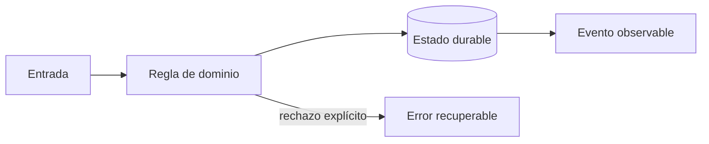
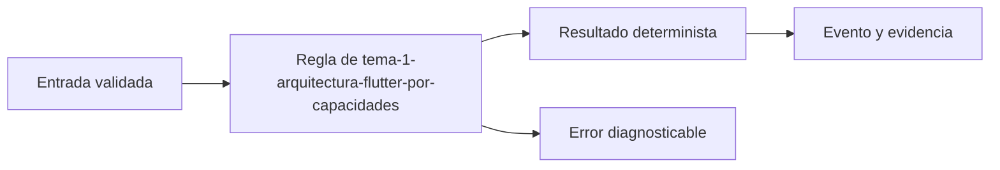
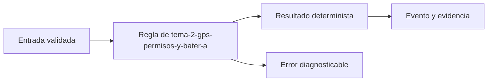
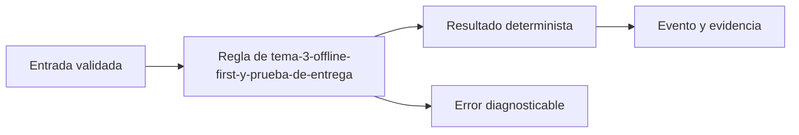

# Módulo 4: Aplicación Flutter del conductor: GPS, batería y offline


## Aprende construyendo

### Tema 1: Arquitectura Flutter por capacidades

**Conceptos clave:** features, dominio, repositorios, estado, navegación y pruebas.

La app separa jornada, paradas, escaneo, evidencia y sincronización. Widgets renderizan estado; casos de uso coordinan; repositorios aíslan SQLite, cámara, GPS y red. Las dependencias apuntan hacia políticas estables y no hacia plugins. Se prueban dominio, adapters y flujos críticos. El criterio no es memorizar la herramienta, sino poder predecir qué sucede ante duplicados, datos incompletos, concurrencia, pérdida de red o permisos insuficientes. Documenta supuestos y mide antes de optimizar.

**Analogía:** Es como una caja de herramientas: cada instrumento tiene propósito y puede reemplazarse sin reconstruir la casa.

**¿Por qué es importante?** Porque reduce acoplamiento a plugins y hace verificables las reglas offline. En RutaFlow la decisión se valida con una prueba automatizada y una observación operativa, no solo con una captura de pantalla.

**Casos de uso reales:** estudia el flujo normal, un reintento, un dato tardío y un acceso sin permiso. Dibuja primero el flujo y marca dónde puede fallar.

**Diagrama:**



#### Paso 1 · Objetivo y preparación

Al finalizar podrás construir y verificar **Tema 1: Arquitectura Flutter por capacidades** dentro de RutaFlow, empezando desde una carpeta vacía y explicando qué decisión técnica resuelve. **Conocimiento previo:** terminal, Git y lectura de JSON.

#### Paso 2 · Contexto y caso real

**¿Por qué es importante?** En una plataforma de entregas, tema 1: arquitectura flutter por capacidades afecta directamente la trazabilidad, la seguridad y la capacidad de recuperar un fallo. Separar la decisión del detalle de infraestructura permite probarla antes de desplegarla y evita que una pantalla o un proveedor externo se convierta en la única fuente de verdad.

**Caso real:** una entrega puede repetirse, llegar fuera de orden o quedarse sin conexión. El diseño debe conservar una salida determinista y una evidencia que otra persona pueda revisar.

#### Paso 3 · Teoría, conceptos y analogía

**Conceptos clave:** contrato, estado, evidencia, idempotencia, observabilidad y límite de responsabilidad. Piensa en este tema como una estación de clasificación: recibe una entrada con formato conocido, aplica una regla explícita y entrega una salida que puede auditarse. Si una regla no se puede observar ni probar, todavía no es una parte confiable del sistema.

**Analogía:** es como una guía de despacho: cada paquete tiene una etiqueta, una operación responsable y una marca que demuestra qué ocurrió.



#### Paso 4 · Demostración guiada desde cero

Crea una carpeta independiente para comprobar el concepto antes de conectarlo al monorepo. Después crea `src/tema.js`:

```bash
mkdir -p rutaflow-labs/tema-1-arquitectura-flutter-por-capacidades
cd rutaflow-labs/tema-1-arquitectura-flutter-por-capacidades
printf '%s\n' '{"tema":"Tema 1: Arquitectura Flutter por capacidades","estado":"preparado"}' > evidencia.json
cat evidencia.json
```

```javascript
// La entrada representa un contrato mínimo y verificable.
const entrada = { tema: 'Tema 1: Arquitectura Flutter por capacidades', estado: 'preparado' };
const salida = { ...entrada, evidencia: true };
console.log(JSON.stringify(salida));
```

Ejecuta la comprobación desde `rutaflow-labs/tema-1-arquitectura-flutter-por-capacidades/`:

```bash
node -e "const fs=require('fs'); const x=JSON.parse(fs.readFileSync('evidencia.json','utf8')); if (!x.tema) throw new Error('Falta tema'); console.log('OK', x.tema);"
```

**Resultado esperado:** el comando imprime `OK` y el nombre del tema; `evidencia.json` conserva una entrada reproducible.

**Fallo deliberado:** cambia `tema` por una cadena vacía y ejecuta de nuevo. El proceso debe fallar con `Falta tema`; diagnostica leyendo la primera causa, corrige solo ese dato y repite la prueba.

#### Paso 5 · Práctica guiada

1. Añade un campo `version` y rechaza valores menores que `1`.
2. Registra una salida JSON de éxito y otra de error sin mezclar ambas.
3. Pista: valida la entrada antes de ejecutar la regla y conserva el mensaje original del error.

#### Paso 6 · Práctica independiente

Implementa una función `procesarEntrada(entrada)` que devuelva una salida determinista, rechace entradas incompletas y pueda ejecutarse dos veces sin duplicar evidencia. No copies la solución del paso anterior; escribe primero el contrato y después el código.

#### Paso 7 · Cierre, evidencia y proyecto

Entrega el archivo `evidencia.json`, la salida `OK`, la salida del fallo deliberado y una breve explicación de la decisión. El siguiente tema conecta este incremento con el proyecto RutaFlow: **Tema 1: Arquitectura Flutter por capacidades** debe convertirse en una capacidad comprobable, observable y recuperable. **Fuente oficial:** [https://developer.mozilla.org/en-US/docs/Learn_web_development](https://developer.mozilla.org/en-US/docs/Learn_web_development).

**Errores comunes:** ejecutar desde otra carpeta; validar después de mutar el estado; ocultar el mensaje original del error; no conservar evidencia; asumir que un proveedor externo siempre responde.
### Tema 2: GPS, permisos y batería

**Conceptos clave:** precisión, frecuencia, distancia, background, consentimiento y muestreo adaptativo.

La política combina movimiento, etapa y carga: detenido usa menor frecuencia; ruta activa aumenta muestreo; batería baja reduce precisión. Permiso se pide al iniciar una función comprensible, no al abrir la app. Android e iOS imponen límites de background que deben probarse en dispositivos reales. El criterio no es memorizar la herramienta, sino poder predecir qué sucede ante duplicados, datos incompletos, concurrencia, pérdida de red o permisos insuficientes. Documenta supuestos y mide antes de optimizar.

**Analogía:** Es como un fotógrafo no dispara cien veces por segundo cuando la escena no cambia.

**¿Por qué es importante?** Porque preserva jornada y privacidad sin perder señal operacional útil. En RutaFlow la decisión se valida con una prueba automatizada y una observación operativa, no solo con una captura de pantalla.

**Casos de uso reales:** estudia el flujo normal, un reintento, un dato tardío y un acceso sin permiso. Dibuja primero el flujo y marca dónde puede fallar.

**Diagrama:**


#### Paso 1 · Objetivo y preparación

Al finalizar podrás construir y verificar **Tema 2: GPS, permisos y batería** dentro de RutaFlow, empezando desde una carpeta vacía y explicando qué decisión técnica resuelve. **Conocimiento previo:** terminal, Git y lectura de JSON.

#### Paso 2 · Contexto y caso real

**¿Por qué es importante?** En una plataforma de entregas, tema 2: gps, permisos y batería afecta directamente la trazabilidad, la seguridad y la capacidad de recuperar un fallo. Separar la decisión del detalle de infraestructura permite probarla antes de desplegarla y evita que una pantalla o un proveedor externo se convierta en la única fuente de verdad.

**Caso real:** una entrega puede repetirse, llegar fuera de orden o quedarse sin conexión. El diseño debe conservar una salida determinista y una evidencia que otra persona pueda revisar.

#### Paso 3 · Teoría, conceptos y analogía

**Conceptos clave:** contrato, estado, evidencia, idempotencia, observabilidad y límite de responsabilidad. Piensa en este tema como una estación de clasificación: recibe una entrada con formato conocido, aplica una regla explícita y entrega una salida que puede auditarse. Si una regla no se puede observar ni probar, todavía no es una parte confiable del sistema.

**Analogía:** es como una guía de despacho: cada paquete tiene una etiqueta, una operación responsable y una marca que demuestra qué ocurrió.



#### Paso 4 · Demostración guiada desde cero

Crea una carpeta independiente para comprobar el concepto antes de conectarlo al monorepo. Después crea `src/tema.js`:

```bash
mkdir -p rutaflow-labs/tema-2-gps-permisos-y-bater-a
cd rutaflow-labs/tema-2-gps-permisos-y-bater-a
printf '%s\n' '{"tema":"Tema 2: GPS, permisos y batería","estado":"preparado"}' > evidencia.json
cat evidencia.json
```

```javascript
// La entrada representa un contrato mínimo y verificable.
const entrada = { tema: 'Tema 2: GPS, permisos y batería', estado: 'preparado' };
const salida = { ...entrada, evidencia: true };
console.log(JSON.stringify(salida));
```

Ejecuta la comprobación desde `rutaflow-labs/tema-2-gps-permisos-y-bater-a/`:

```bash
node -e "const fs=require('fs'); const x=JSON.parse(fs.readFileSync('evidencia.json','utf8')); if (!x.tema) throw new Error('Falta tema'); console.log('OK', x.tema);"
```

**Resultado esperado:** el comando imprime `OK` y el nombre del tema; `evidencia.json` conserva una entrada reproducible.

**Fallo deliberado:** cambia `tema` por una cadena vacía y ejecuta de nuevo. El proceso debe fallar con `Falta tema`; diagnostica leyendo la primera causa, corrige solo ese dato y repite la prueba.

#### Paso 5 · Práctica guiada

1. Añade un campo `version` y rechaza valores menores que `1`.
2. Registra una salida JSON de éxito y otra de error sin mezclar ambas.
3. Pista: valida la entrada antes de ejecutar la regla y conserva el mensaje original del error.

#### Paso 6 · Práctica independiente

Implementa una función `procesarEntrada(entrada)` que devuelva una salida determinista, rechace entradas incompletas y pueda ejecutarse dos veces sin duplicar evidencia. No copies la solución del paso anterior; escribe primero el contrato y después el código.

#### Paso 7 · Cierre, evidencia y proyecto

Entrega el archivo `evidencia.json`, la salida `OK`, la salida del fallo deliberado y una breve explicación de la decisión. El siguiente tema conecta este incremento con el proyecto RutaFlow: **Tema 2: GPS, permisos y batería** debe convertirse en una capacidad comprobable, observable y recuperable. **Fuente oficial:** [https://developer.mozilla.org/en-US/docs/Learn_web_development](https://developer.mozilla.org/en-US/docs/Learn_web_development).

**Errores comunes:** ejecutar desde otra carpeta; validar después de mutar el estado; ocultar el mensaje original del error; no conservar evidencia; asumir que un proveedor externo siempre responde.
### Tema 3: Offline-first y prueba de entrega

**Conceptos clave:** SQLite, outbox local, estados de sincronización, conflictos y evidencia.

Confirmar entrega guarda primero un comando local con UUID y evidencia; luego sincroniza con idempotency key. Pendiente no significa fallido. Un conflicto de versión requiere política explícita. Fotografías se comprimen, cifran, suben con URL temporal y retención definida; firma no sustituye identidad. El criterio no es memorizar la herramienta, sino poder predecir qué sucede ante duplicados, datos incompletos, concurrencia, pérdida de red o permisos insuficientes. Documenta supuestos y mide antes de optimizar.

**Analogía:** Es como un mensajero conserva recibos numerados hasta entregarlos en oficina.

**¿Por qué es importante?** Porque el trabajo del conductor no desaparece al entrar a un ascensor sin señal. En RutaFlow la decisión se valida con una prueba automatizada y una observación operativa, no solo con una captura de pantalla.

**Casos de uso reales:** estudia el flujo normal, un reintento, un dato tardío y un acceso sin permiso. Dibuja primero el flujo y marca dónde puede fallar.

**Diagrama:**


#### Paso 1 · Objetivo y preparación

Al finalizar podrás construir y verificar **Tema 3: Offline-first y prueba de entrega** dentro de RutaFlow, empezando desde una carpeta vacía y explicando qué decisión técnica resuelve. **Conocimiento previo:** terminal, Git y lectura de JSON.

#### Paso 2 · Contexto y caso real

**¿Por qué es importante?** En una plataforma de entregas, tema 3: offline-first y prueba de entrega afecta directamente la trazabilidad, la seguridad y la capacidad de recuperar un fallo. Separar la decisión del detalle de infraestructura permite probarla antes de desplegarla y evita que una pantalla o un proveedor externo se convierta en la única fuente de verdad.

**Caso real:** una entrega puede repetirse, llegar fuera de orden o quedarse sin conexión. El diseño debe conservar una salida determinista y una evidencia que otra persona pueda revisar.

#### Paso 3 · Teoría, conceptos y analogía

**Conceptos clave:** contrato, estado, evidencia, idempotencia, observabilidad y límite de responsabilidad. Piensa en este tema como una estación de clasificación: recibe una entrada con formato conocido, aplica una regla explícita y entrega una salida que puede auditarse. Si una regla no se puede observar ni probar, todavía no es una parte confiable del sistema.

**Analogía:** es como una guía de despacho: cada paquete tiene una etiqueta, una operación responsable y una marca que demuestra qué ocurrió.



#### Paso 4 · Demostración guiada desde cero

Crea una carpeta independiente para comprobar el concepto antes de conectarlo al monorepo. Después crea `src/tema.js`:

```bash
mkdir -p rutaflow-labs/tema-3-offline-first-y-prueba-de-entrega
cd rutaflow-labs/tema-3-offline-first-y-prueba-de-entrega
printf '%s\n' '{"tema":"Tema 3: Offline-first y prueba de entrega","estado":"preparado"}' > evidencia.json
cat evidencia.json
```

```javascript
// La entrada representa un contrato mínimo y verificable.
const entrada = { tema: 'Tema 3: Offline-first y prueba de entrega', estado: 'preparado' };
const salida = { ...entrada, evidencia: true };
console.log(JSON.stringify(salida));
```

Ejecuta la comprobación desde `rutaflow-labs/tema-3-offline-first-y-prueba-de-entrega/`:

```bash
node -e "const fs=require('fs'); const x=JSON.parse(fs.readFileSync('evidencia.json','utf8')); if (!x.tema) throw new Error('Falta tema'); console.log('OK', x.tema);"
```

**Resultado esperado:** el comando imprime `OK` y el nombre del tema; `evidencia.json` conserva una entrada reproducible.

**Fallo deliberado:** cambia `tema` por una cadena vacía y ejecuta de nuevo. El proceso debe fallar con `Falta tema`; diagnostica leyendo la primera causa, corrige solo ese dato y repite la prueba.

#### Paso 5 · Práctica guiada

1. Añade un campo `version` y rechaza valores menores que `1`.
2. Registra una salida JSON de éxito y otra de error sin mezclar ambas.
3. Pista: valida la entrada antes de ejecutar la regla y conserva el mensaje original del error.

#### Paso 6 · Práctica independiente

Implementa una función `procesarEntrada(entrada)` que devuelva una salida determinista, rechace entradas incompletas y pueda ejecutarse dos veces sin duplicar evidencia. No copies la solución del paso anterior; escribe primero el contrato y después el código.

#### Paso 7 · Cierre, evidencia y proyecto

Entrega el archivo `evidencia.json`, la salida `OK`, la salida del fallo deliberado y una breve explicación de la decisión. El siguiente tema conecta este incremento con el proyecto RutaFlow: **Tema 3: Offline-first y prueba de entrega** debe convertirse en una capacidad comprobable, observable y recuperable. **Fuente oficial:** [https://developer.mozilla.org/en-US/docs/Learn_web_development](https://developer.mozilla.org/en-US/docs/Learn_web_development).

**Errores comunes:** ejecutar desde otra carpeta; validar después de mutar el estado; ocultar el mensaje original del error; no conservar evidencia; asumir que un proveedor externo siempre responde.
