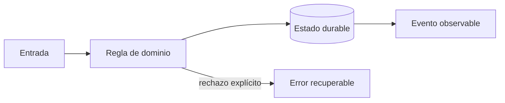

# Módulo 4: Aplicación Flutter del conductor: GPS, batería y offline

## Sílabo

**Objetivo general:** Implementar una jornada de reparto confiable aun con mala señal y recursos limitados.

Al terminar, podrás explicar las decisiones con vocabulario técnico sencillo, implementar una vertical funcional, provocar al menos un fallo y demostrar su recuperación. El producto de estudio es ficticio: evita copiar marcas, identidades o datos de una empresa real.

**Evaluación:** 20 % modelo y explicación, 40 % laboratorio ejecutable, 25 % pruebas y manejo de fallos, 15 % documentación y demostración.

## Aprende construyendo

### Tema 1: Arquitectura Flutter por capacidades

**Conceptos clave:** features, dominio, repositorios, estado, navegación y pruebas.

La app separa jornada, paradas, escaneo, evidencia y sincronización. Widgets renderizan estado; casos de uso coordinan; repositorios aíslan SQLite, cámara, GPS y red. Las dependencias apuntan hacia políticas estables y no hacia plugins. Se prueban dominio, adapters y flujos críticos. El criterio no es memorizar la herramienta, sino poder predecir qué sucede ante duplicados, datos incompletos, concurrencia, pérdida de red o permisos insuficientes. Documenta supuestos y mide antes de optimizar.

**Analogía:** Es como una caja de herramientas: cada instrumento tiene propósito y puede reemplazarse sin reconstruir la casa.

**¿Por qué es importante?** Porque reduce acoplamiento a plugins y hace verificables las reglas offline. En RutaFlow la decisión se valida con una prueba automatizada y una observación operativa, no solo con una captura de pantalla.

**Casos de uso reales:** estudia el flujo normal, un reintento, un dato tardío y un acceso sin permiso. Dibuja primero el flujo y marca dónde puede fallar.

**Diagrama:**

### Tema 2: GPS, permisos y batería

**Conceptos clave:** precisión, frecuencia, distancia, background, consentimiento y muestreo adaptativo.

La política combina movimiento, etapa y carga: detenido usa menor frecuencia; ruta activa aumenta muestreo; batería baja reduce precisión. Permiso se pide al iniciar una función comprensible, no al abrir la app. Android e iOS imponen límites de background que deben probarse en dispositivos reales. El criterio no es memorizar la herramienta, sino poder predecir qué sucede ante duplicados, datos incompletos, concurrencia, pérdida de red o permisos insuficientes. Documenta supuestos y mide antes de optimizar.

**Analogía:** Es como un fotógrafo no dispara cien veces por segundo cuando la escena no cambia.

**¿Por qué es importante?** Porque preserva jornada y privacidad sin perder señal operacional útil. En RutaFlow la decisión se valida con una prueba automatizada y una observación operativa, no solo con una captura de pantalla.

**Casos de uso reales:** estudia el flujo normal, un reintento, un dato tardío y un acceso sin permiso. Dibuja primero el flujo y marca dónde puede fallar.

**Diagrama:**

### Tema 3: Offline-first y prueba de entrega

**Conceptos clave:** SQLite, outbox local, estados de sincronización, conflictos y evidencia.

Confirmar entrega guarda primero un comando local con UUID y evidencia; luego sincroniza con idempotency key. Pendiente no significa fallido. Un conflicto de versión requiere política explícita. Fotografías se comprimen, cifran, suben con URL temporal y retención definida; firma no sustituye identidad. El criterio no es memorizar la herramienta, sino poder predecir qué sucede ante duplicados, datos incompletos, concurrencia, pérdida de red o permisos insuficientes. Documenta supuestos y mide antes de optimizar.

**Analogía:** Es como un mensajero conserva recibos numerados hasta entregarlos en oficina.

**¿Por qué es importante?** Porque el trabajo del conductor no desaparece al entrar a un ascensor sin señal. En RutaFlow la decisión se valida con una prueba automatizada y una observación operativa, no solo con una captura de pantalla.

**Casos de uso reales:** estudia el flujo normal, un reintento, un dato tardío y un acceso sin permiso. Dibuja primero el flujo y marca dónde puede fallar.

**Diagrama:**

## Criterio transversal de calidad del código

Usa nombres del dominio (`confirmDelivery`, no `processData`), funciones pequeñas con una responsabilidad observable y errores tipados que conserven causa y contexto sin revelar secretos. Primero escribe una prueba del comportamiento o del fallo que quieres controlar; luego implementa la solución más simple. Aplica SOLID cuando existe presión real de cambio: separa políticas de infraestructura, invierte dependencias en límites externos y evita interfaces enormes. No abstraer antes de encontrar repetición con el mismo significado. Revisa corrección, claridad, cohesión, seguridad, complejidad y capacidad de operación; Clean Code no justifica ocultar costes ni crear capas ceremoniales.

## Rúbrica del proyecto

| Criterio | Inicial | Competente | Profesional |
|---|---|---|---|
| Fundamento | Repite términos | Explica la decisión | Compara alternativas y límites |
| Funcionamiento | Solo camino feliz | Maneja fallos previstos | Demuestra recuperación e idempotencia |
| Código | Acoplado y ambiguo | Claro y probado | Límites cohesionados y deuda explícita |
| Datos y seguridad | Usa datos reales | Minimiza y autoriza | Audita, retiene y modela amenazas |
| Operación | Requiere pasos ocultos | README reproducible | Métricas, runbook y evidencia |

## Bibliografía y fundamento académico

- Documentación oficial de las tecnologías enlazadas desde el panel **Actualizaciones oficiales** de la Academia; verifica versión y fecha antes de aplicar una API.
- Eric Evans, *Domain-Driven Design*, para lenguaje ubicuo, agregados e invariantes.
- Martin Kleppmann, *Designing Data-Intensive Applications*, para datos, replicación, streams y fallos.
- NIST Secure Software Development Framework y OWASP ASVS/MASVS, para ciclo de desarrollo y controles verificables.
- Google SRE Book y SRE Workbook, para SLI, SLO, presupuesto de error e incidentes.
- W3C WCAG, RFC de HTTP y OpenTelemetry Specification cuando la decisión afecte accesibilidad, contratos u observabilidad.

Las fuentes son punto de partida, no autoridad incuestionable: registra versión, distingue norma de recomendación y valida cada afirmación con un experimento reproducible.

## Resumen del módulo

Este capítulo conecta fundamento, implementación y operación. Debes poder contar qué problema resolviste, qué invariante protegiste, cómo comprobaste el comportamiento y qué límite conserva la solución. La evidencia final incluye código, pruebas, diagrama, ADR y demostración; completar una lista de temas sin poder explicar los fallos no representa dominio profesional.
