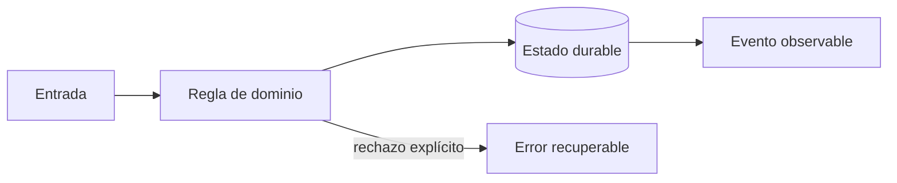

# Módulo 4: Aplicación Flutter del conductor: GPS, batería y offline

## Aprende construyendo

### Tema 1: Arquitectura Flutter por capacidades

**Conceptos clave:** features, dominio, repositorios, estado, navegación y pruebas.

La app separa jornada, paradas, escaneo, evidencia y sincronización. Widgets renderizan estado; casos de uso coordinan; repositorios aíslan SQLite, cámara, GPS y red. Las dependencias apuntan hacia políticas estables y no hacia plugins. Se prueban dominio, adapters y flujos críticos. El criterio no es memorizar la herramienta, sino poder predecir qué sucede ante duplicados, datos incompletos, concurrencia, pérdida de red o permisos insuficientes. Documenta supuestos y mide antes de optimizar.

**Analogía:** Es como una caja de herramientas: cada instrumento tiene propósito y puede reemplazarse sin reconstruir la casa.

**¿Por qué es importante?** Porque reduce acoplamiento a plugins y hace verificables las reglas offline. En RutaFlow la decisión se valida con una prueba automatizada y una observación operativa, no solo con una captura de pantalla.

**Casos de uso reales:** estudia el flujo normal, un reintento, un dato tardío y un acceso sin permiso. Dibuja primero el flujo y marca dónde puede fallar.

**Diagrama:**

### Tema 2: GPS, permisos y batería

**Conceptos clave:** precisión, frecuencia, distancia, background, consentimiento y muestreo adaptativo.

La política combina movimiento, etapa y carga: detenido usa menor frecuencia; ruta activa aumenta muestreo; batería baja reduce precisión. Permiso se pide al iniciar una función comprensible, no al abrir la app. Android e iOS imponen límites de background que deben probarse en dispositivos reales. El criterio no es memorizar la herramienta, sino poder predecir qué sucede ante duplicados, datos incompletos, concurrencia, pérdida de red o permisos insuficientes. Documenta supuestos y mide antes de optimizar.

**Analogía:** Es como un fotógrafo no dispara cien veces por segundo cuando la escena no cambia.

**¿Por qué es importante?** Porque preserva jornada y privacidad sin perder señal operacional útil. En RutaFlow la decisión se valida con una prueba automatizada y una observación operativa, no solo con una captura de pantalla.

**Casos de uso reales:** estudia el flujo normal, un reintento, un dato tardío y un acceso sin permiso. Dibuja primero el flujo y marca dónde puede fallar.

**Diagrama:**

### Tema 3: Offline-first y prueba de entrega

**Conceptos clave:** SQLite, outbox local, estados de sincronización, conflictos y evidencia.

Confirmar entrega guarda primero un comando local con UUID y evidencia; luego sincroniza con idempotency key. Pendiente no significa fallido. Un conflicto de versión requiere política explícita. Fotografías se comprimen, cifran, suben con URL temporal y retención definida; firma no sustituye identidad. El criterio no es memorizar la herramienta, sino poder predecir qué sucede ante duplicados, datos incompletos, concurrencia, pérdida de red o permisos insuficientes. Documenta supuestos y mide antes de optimizar.

**Analogía:** Es como un mensajero conserva recibos numerados hasta entregarlos en oficina.

**¿Por qué es importante?** Porque el trabajo del conductor no desaparece al entrar a un ascensor sin señal. En RutaFlow la decisión se valida con una prueba automatizada y una observación operativa, no solo con una captura de pantalla.

**Casos de uso reales:** estudia el flujo normal, un reintento, un dato tardío y un acceso sin permiso. Dibuja primero el flujo y marca dónde puede fallar.

**Diagrama:**

