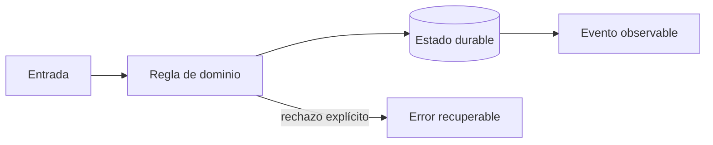
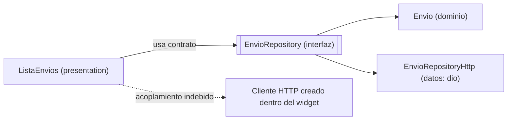
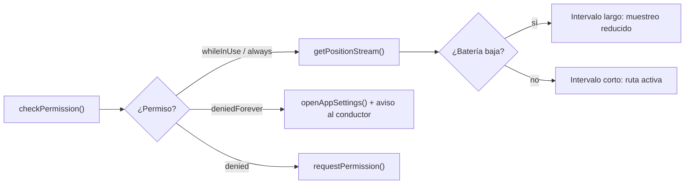
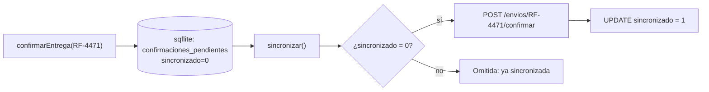

# Módulo 4: Aplicación Flutter del conductor: GPS, batería y offline


## Aprende construyendo

### Tema 1: Arquitectura Flutter por capacidades

**Conceptos clave:** features, dominio, repositorios, estado, navegación y pruebas.

La app separa jornada, paradas, escaneo, evidencia y sincronización. Widgets renderizan estado; casos de uso coordinan; repositorios aíslan SQLite, cámara, GPS y red. Las dependencias apuntan hacia políticas estables y no hacia plugins. Se prueban dominio, adapters y flujos críticos. El criterio no es memorizar la herramienta, sino poder predecir qué sucede ante duplicados, datos incompletos, concurrencia, pérdida de red o permisos insuficientes. Documenta supuestos y mide antes de optimizar.

**Analogía:** Es como una caja de herramientas: cada instrumento tiene propósito y puede reemplazarse sin reconstruir la casa.

**¿Por qué es importante?** Porque reduce acoplamiento a plugins y hace verificables las reglas offline. En RutaFlow la decisión se valida con una prueba automatizada y una observación operativa, no solo con una captura de pantalla.

**Casos de uso reales:** estudia el flujo normal, un reintento, un dato tardío y un acceso sin permiso. Dibuja primero el flujo y marca dónde puede fallar.

**Diagrama:**


```mermaid
flowchart LR
  A[Entrada] --> B[Regla de dominio]
  B --> C[(Estado durable)]
  C --> D[Evento observable]
  B -->|rechazo explícito| E[Error recuperable]
```

#### Paso 1 · Objetivo y preparación

Al finalizar podrás construir y verificar **Tema 1: Arquitectura Flutter por capacidades** dentro de RutaFlow, empezando desde una carpeta vacía y explicando qué decisión técnica resuelve. **Conocimiento previo:** terminal, Git y lectura de JSON.

#### Paso 2 · Contexto y caso real

**¿Por qué es importante?** En la app del conductor, la pantalla de entregas (`ListaEnvios`) necesita datos de `Envio` pero no debería saber si esos datos vienen de una API REST, de una caché SQLite o de un doble de pruebas. Si un widget instancia directamente un cliente HTTP, cambiar de proveedor de mapas, migrar de `dio` a otro cliente o agregar una caché offline obliga a reescribir pantallas en vez de tocar solo la capa de datos — y un error en ese cambio rompe la UI que el conductor mira en plena ruta.

**Caso real:** el equipo agrega soporte offline: antes de sincronizar, la app debe poder mostrar la lista de entregas guardada en SQLite cuando no hay señal. Si `ListaEnvios` crea su propio cliente HTTP adentro del widget en vez de pedirle los datos a un `EnvioRepository`, no hay forma de intercalar una fuente local sin reescribir la pantalla.

#### Paso 3 · Teoría, conceptos y analogía

**Conceptos clave:** capa de dominio, capa de datos, capa de presentación, inversión de dependencias e interfaz de repositorio. La capa de presentación (widgets como `ListaEnvios`) solo conoce contratos del dominio (`Envio`, `EnvioRepository`); la capa de datos implementa esos contratos contra HTTP, SQLite o GPS; el dominio no importa nada de Flutter ni de ningún paquete HTTP. Cuando una pantalla instancia directamente un cliente HTTP, la dependencia apunta en la dirección equivocada: la UI termina dependiendo del detalle de infraestructura, en vez de que la infraestructura dependa de un contrato estable que el dominio define.

**Analogía:** es como un restorán: el mesero (`presentation`) le pide un plato a la cocina a través de la carta (`EnvioRepository`, la interfaz); nunca entra a buscar los ingredientes él mismo. Si el mesero empieza a cocinar directamente, cambiar de proveedor de verduras obliga también a reentrenarlo a él.


```mermaid
flowchart LR
  P["ListaEnvios (presentation)"] -->|usa contrato| R[["EnvioRepository (interfaz)"]]
  R --> DOM["Envio (dominio)"]
  R --> HTTP["EnvioRepositoryHttp (datos: dio)"]
  P -.->|acoplamiento indebido| DIO["Cliente HTTP creado dentro del widget"]
```

#### Paso 4 · Demostración guiada desde cero

Crea una carpeta independiente con la estructura por capacidades antes de tocar el monorepo real:

```bash
mkdir -p rutaflow-labs/tema-1-arquitectura-flutter-por-capacidades/lib/features/entrega/domain
mkdir -p rutaflow-labs/tema-1-arquitectura-flutter-por-capacidades/lib/features/entrega/data
mkdir -p rutaflow-labs/tema-1-arquitectura-flutter-por-capacidades/lib/features/entrega/presentation
cd rutaflow-labs/tema-1-arquitectura-flutter-por-capacidades
```

Define el contrato en el dominio, sin ninguna dependencia de Flutter ni de HTTP:

```dart
// lib/features/entrega/domain/envio.dart
class Envio {
  final String guia;
  final String estado;
  const Envio({required this.guia, required this.estado});
}

// lib/features/entrega/domain/envio_repository.dart
import 'envio.dart';

abstract class EnvioRepository {
  Future<List<Envio>> obtenerPendientes();
}
```

Implementa el contrato en la capa de datos, y usalo desde presentación solo a través de la interfaz:

```dart
// lib/features/entrega/data/envio_repository_http.dart
import '../domain/envio.dart';
import '../domain/envio_repository.dart';

class EnvioRepositoryHttp implements EnvioRepository {
  final Future<List<Map<String, dynamic>>> Function() _get;
  EnvioRepositoryHttp(this._get);

  @override
  Future<List<Envio>> obtenerPendientes() async {
    final filas = await _get();
    return filas.map((f) => Envio(guia: f['guia'] as String, estado: f['estado'] as String)).toList();
  }
}

// lib/features/entrega/presentation/lista_envios.dart
import '../domain/envio_repository.dart';

class ListaEnvios {
  final EnvioRepository repositorio;
  ListaEnvios(this.repositorio);

  Future<int> contarPendientes() async {
    final envios = await repositorio.obtenerPendientes();
    return envios.length;
  }
}
```

```bash
cat > verificar.dart <<'EOF'
import 'lib/features/entrega/domain/envio_repository.dart';
import 'lib/features/entrega/data/envio_repository_http.dart';
import 'lib/features/entrega/presentation/lista_envios.dart';

Future<void> main() async {
  final EnvioRepository repo = EnvioRepositoryHttp(() async => [
        {'guia': 'RF-4471', 'estado': 'en_transito'},
        {'guia': 'RF-5002', 'estado': 'asignado'},
      ]);
  final pantalla = ListaEnvios(repo);
  final total = await pantalla.contarPendientes();
  print('OK pendientes=$total');
}
EOF
dart run verificar.dart
```

**Resultado esperado:** `OK pendientes=2` — `ListaEnvios` nunca importó `dart:io` ni ningún cliente HTTP; solo conoce `EnvioRepository`, así que `verificar.dart` pudo inyectarle una implementación de prueba sin tocar la pantalla.

**Fallo deliberado:** en `lista_envios.dart`, hacé que `ListaEnvios` ignore el repositorio recibido y llame directo a la implementación HTTP concreta:

```dart
// lib/features/entrega/presentation/lista_envios.dart (versión acoplada)
import '../data/envio_repository_http.dart';

class ListaEnvios {
  Future<int> contarPendientes() async {
    // Salta el dominio y la interfaz: la pantalla ahora conoce HTTP directamente.
    final filas = await EnvioRepositoryHttp(() async => [
      {'guia': 'RF-4471', 'estado': 'en_transito'},
    ]).obtenerPendientes();
    return filas.length;
  }
}
```

Al correr `dart run verificar.dart` de nuevo, el programa sigue imprimiendo `OK pendientes=1`, pero ahora `lista_envios.dart` importa `../data/envio_repository_http.dart` directamente: si más adelante agregás `EnvioRepositorySqlite` para la caché offline, no hay forma de usarla sin editar esta pantalla, porque el nombre de la clase concreta quedó escrito adentro de `presentation/`. Diagnóstico: `ListaEnvios` dejó de depender de una interfaz y pasó a depender de una clase concreta; corrección: devolvé el constructor a recibir `EnvioRepository repositorio` por parámetro y dejá que quien arma la pantalla decida qué implementación inyectar.

#### Paso 5 · Práctica guiada

1. Agregá una segunda implementación, `EnvioRepositorySqlite`, que devuelva una lista fija simulando una caché local, sin tocar `ListaEnvios`.
2. Hacé que `verificar.dart` construya `ListaEnvios` dos veces, una con cada repositorio, y confirmá que el conteo cambia según la fuente sin que la pantalla lo sepa.
3. Pista: si para agregar `EnvioRepositorySqlite` tuviste que tocar `lista_envios.dart`, la interfaz todavía tiene una fuga.

#### Paso 6 · Práctica independiente

Agregá un método `obtenerPorGuia(String guia)` a `EnvioRepository` y a ambas implementaciones, y hacé que `ListaEnvios` lo use para resaltar un envío específico — sin que la pantalla conozca en ningún momento si la respuesta vino de HTTP o de SQLite. Escribí primero la firma en la interfaz del dominio y después implementala en cada capa de datos.

#### Paso 7 · Cierre, evidencia y proyecto

Entregá la estructura de carpetas por capacidades, la salida `OK pendientes=2` del Paso 4, el acoplamiento reproducido al saltar la interfaz y la segunda implementación del Paso 5. El **Tema 2: GPS, permisos y batería** retoma exactamente este `EnvioRepository` para agregar una fuente de datos de ubicación que respete permisos y batería sin tocar la pantalla. **Fuente oficial:** [Flutter — Guía de arquitectura de apps](https://docs.flutter.dev/app-architecture/guide).

**Errores comunes:** instanciar una clase concreta de `data/` directamente desde un widget en vez de recibir la interfaz del dominio; dejar que la capa de dominio importe Flutter o un paquete HTTP; agregar una segunda fuente de datos editando la pantalla en vez de solo agregar una clase nueva que implemente el mismo contrato.
### Tema 2: GPS, permisos y batería

**Conceptos clave:** precisión, frecuencia, distancia, background, consentimiento y muestreo adaptativo.

La política combina movimiento, etapa y carga: detenido usa menor frecuencia; ruta activa aumenta muestreo; batería baja reduce precisión. Permiso se pide al iniciar una función comprensible, no al abrir la app. Android e iOS imponen límites de background que deben probarse en dispositivos reales. El criterio no es memorizar la herramienta, sino poder predecir qué sucede ante duplicados, datos incompletos, concurrencia, pérdida de red o permisos insuficientes. Documenta supuestos y mide antes de optimizar.

**Analogía:** Es como un fotógrafo no dispara cien veces por segundo cuando la escena no cambia.

**¿Por qué es importante?** Porque preserva jornada y privacidad sin perder señal operacional útil. En RutaFlow la decisión se valida con una prueba automatizada y una observación operativa, no solo con una captura de pantalla.

**Casos de uso reales:** estudia el flujo normal, un reintento, un dato tardío y un acceso sin permiso. Dibuja primero el flujo y marca dónde puede fallar.

**Diagrama:**


```mermaid
flowchart LR
  A[Entrada] --> B[Regla de dominio]
  B --> C[(Estado durable)]
  C --> D[Evento observable]
  B -->|rechazo explícito| E[Error recuperable]
```

#### Paso 1 · Objetivo y preparación

Al finalizar podrás construir y verificar **Tema 2: GPS, permisos y batería** dentro de RutaFlow, empezando desde una carpeta vacía y explicando qué decisión técnica resuelve. **Conocimiento previo:** terminal, Git y lectura de JSON.

#### Paso 2 · Contexto y caso real

**¿Por qué es importante?** En RutaFlow, pedir ubicación en segundo plano (`LocationPermission.always`) sin manejar el caso en que el sistema la niega para siempre (`deniedForever`) hace que la app deje de reportar posición en silencio, sin ningún mensaje que le explique al conductor por qué el mapa dejó de actualizarse. La política de permisos y de muestreo no es un detalle de UI: decide si RutaFlow tiene señal operativa real o un flujo de GPS que se corta solo, en producción, sin que nadie se entere.

**Caso real:** un conductor instala la app y, por error o apuro, rechaza el diálogo de permiso de ubicación dos veces seguidas; en Android eso activa `deniedForever` automáticamente, sin un tercer diálogo posible. Si el código solo contempla los casos `granted` y `denied`, la app queda pidiendo una posición que nunca va a llegar, sin ofrecerle al conductor ninguna forma de corregirlo desde la propia app.

#### Paso 3 · Teoría, conceptos y analogía

**Conceptos clave:** `LocationPermission` (`denied`, `deniedForever`, `whileInUse`, `always`), muestreo adaptativo y el paquete `battery_plus`. Pedir `always` sin necesitarlo es pedir más permiso del que la mayoría de los sistemas operativos conceden con un solo diálogo; `whileInUse` alcanza para la jornada activa del conductor con la app abierta, y solo una función real de rastreo en segundo plano justifica escalar a `always`. La frecuencia de muestreo tampoco debería ser fija: con batería baja, leer el GPS con menos frecuencia extiende la jornada del conductor sin perder la señal esencial.

**Analogía:** es como un fotógrafo que no dispara cien veces por segundo cuando la escena no cambia: pedí el permiso mínimo necesario para la foto que realmente vas a tomar, y bajá el ritmo del obturador cuando la batería de la cámara se está por agotar.


```mermaid
flowchart LR
  A["checkPermission()"] --> B{"¿Permiso?"}
  B -->|"whileInUse / always"| C["getPositionStream()"]
  B -->|"deniedForever"| D["openAppSettings() + aviso al conductor"]
  B -->|"denied"| E["requestPermission()"]
  C --> F{"¿Batería baja?"}
  F -->|"sí"| G["Intervalo largo: muestreo reducido"]
  F -->|"no"| H["Intervalo corto: ruta activa"]
```

#### Paso 4 · Demostración guiada desde cero

Crea una carpeta independiente y agrega los paquetes reales de ubicación y batería:

```bash
mkdir -p rutaflow-labs/tema-2-gps-permisos-y-bateria/lib/features/entrega/data
cd rutaflow-labs/tema-2-gps-permisos-y-bateria
flutter pub add geolocator battery_plus
```

```dart
// lib/features/entrega/data/politica_ubicacion.dart
import 'package:geolocator/geolocator.dart';
import 'package:battery_plus/battery_plus.dart';

class PermisoUbicacionDenegadoPermanente implements Exception {
  @override
  String toString() => 'Permiso de ubicación denegado permanentemente: abrí Ajustes para habilitarlo.';
}

class PoliticaUbicacion {
  final Battery _battery;
  PoliticaUbicacion(this._battery);

  /// Pide el permiso mínimo necesario y maneja explícitamente deniedForever.
  Future<LocationPermission> asegurarPermiso() async {
    var permiso = await Geolocator.checkPermission();
    if (permiso == LocationPermission.denied) {
      permiso = await Geolocator.requestPermission();
    }
    if (permiso == LocationPermission.deniedForever) {
      // No hay diálogo posible: el sistema ya decidió. Hay que guiar al conductor a Ajustes.
      throw PermisoUbicacionDenegadoPermanente();
    }
    return permiso;
  }

  /// Ajusta el intervalo de muestreo según la carga de batería.
  Future<LocationSettings> configurarMuestreo() async {
    final nivel = await _battery.batteryLevel;
    final intervalo = nivel < 20 ? const Duration(seconds: 30) : const Duration(seconds: 5);
    return LocationSettings(accuracy: LocationAccuracy.high, timeLimit: intervalo);
  }
}
```

```bash
flutter run -d <tu-dispositivo-o-emulador>
```

**Resultado esperado:** en un emulador con el permiso en "Solo mientras se usa la app", `asegurarPermiso()` devuelve `LocationPermission.whileInUse` y la app sigue reportando posición mientras está abierta; bajando la batería simulada por debajo de 20% (`adb shell dumpsys battery set level 15` en un emulador Android), `configurarMuestreo()` pasa a devolver un intervalo de 30 segundos en vez de 5.

**Fallo deliberado:** quitá el manejo explícito de `deniedForever` y pedí permiso sin revisar el resultado, como en una primera versión ingenua:

```dart
Future<void> asegurarPermisoIngenuo() async {
  await Geolocator.requestPermission(); // nunca revisa qué devolvió
}
```

En un emulador donde el conductor ya rechazó el permiso dos veces (estado real `deniedForever` en Android), `requestPermission()` devuelve `deniedForever` sin mostrar ningún diálogo nuevo — el valor de retorno se descarta, así que el código sigue llamando a `Geolocator.getPositionStream()` más adelante, que lanza `PermissionDeniedException` en tiempo de ejecución sin ningún mensaje explicativo para el conductor, y el mapa queda congelado sin que nadie sepa por qué. Diagnóstico: el código nunca distingue `deniedForever` de los demás casos; corrección: volver a `asegurarPermiso()`, que lanza `PermisoUbicacionDenegadoPermanente`, y que la pantalla capture esa excepción para ofrecer un botón "Abrir Ajustes" (`Geolocator.openAppSettings()`) en vez de reintentar un diálogo que el sistema ya no va a mostrar.

#### Paso 5 · Práctica guiada

1. Agregá un tercer nivel de muestreo: batería entre 20% y 50% usa un intervalo intermedio (15 segundos), y por debajo de 20% usa 30 segundos.
2. Escribí una función que, dado un `LocationPermission`, devuelva un mensaje distinto para cada caso (`denied`, `deniedForever`, `whileInUse`, `always`) en vez de un solo texto genérico de error.
3. Pista: `Geolocator.getPositionStream(locationSettings: ...)` acepta directamente el `LocationSettings` que devuelve `configurarMuestreo()`; no necesitás un timer manual para cambiar el intervalo.

#### Paso 6 · Práctica independiente

Implementá una clase `MuestreoAdaptativo` que escuche el `Stream` de `Geolocator.getPositionStream()` junto con `Battery().onBatteryStateChanged`, y reconfigure el intervalo de muestreo cada vez que la batería cruce el umbral de 20%, sin reiniciar la jornada del conductor ni perder la posición ya capturada.

#### Paso 7 · Cierre, evidencia y proyecto

Entregá `politica_ubicacion.dart` con el manejo explícito de `deniedForever`, la excepción reproducida al usar la versión ingenua y el muestreo adaptativo de tres niveles del Paso 5. El **Tema 3: Offline-first y prueba de entrega** usa esta misma posición capturada para adjuntarla, junto con la foto, a la confirmación de entrega que se guarda en SQLite cuando no hay señal. **Fuente oficial:** [geolocator — pub.dev](https://pub.dev/packages/geolocator).

**Errores comunes:** pedir `LocationPermission.always` de entrada sin verificar si la función realmente necesita segundo plano; descartar el valor de retorno de `requestPermission()`; fijar un intervalo de muestreo constante sin medir el impacto real en la batería del dispositivo.
### Tema 3: Offline-first y prueba de entrega

**Conceptos clave:** SQLite, outbox local, estados de sincronización, conflictos y evidencia.

Confirmar entrega guarda primero un comando local con UUID y evidencia; luego sincroniza con idempotency key. Pendiente no significa fallido. Un conflicto de versión requiere política explícita. Fotografías se comprimen, cifran, suben con URL temporal y retención definida; firma no sustituye identidad. El criterio no es memorizar la herramienta, sino poder predecir qué sucede ante duplicados, datos incompletos, concurrencia, pérdida de red o permisos insuficientes. Documenta supuestos y mide antes de optimizar.

**Analogía:** Es como un mensajero conserva recibos numerados hasta entregarlos en oficina.

**¿Por qué es importante?** Porque el trabajo del conductor no desaparece al entrar a un ascensor sin señal. En RutaFlow la decisión se valida con una prueba automatizada y una observación operativa, no solo con una captura de pantalla.

**Casos de uso reales:** estudia el flujo normal, un reintento, un dato tardío y un acceso sin permiso. Dibuja primero el flujo y marca dónde puede fallar.

**Diagrama:**


```mermaid
flowchart LR
  A[Entrada] --> B[Regla de dominio]
  B --> C[(Estado durable)]
  C --> D[Evento observable]
  B -->|rechazo explícito| E[Error recuperable]
```

#### Paso 1 · Objetivo y preparación

Al finalizar podrás construir y verificar **Tema 3: Offline-first y prueba de entrega** dentro de RutaFlow, empezando desde una carpeta vacía y explicando qué decisión técnica resuelve. **Conocimiento previo:** terminal, Git y lectura de JSON.

#### Paso 2 · Contexto y caso real

**¿Por qué es importante?** Confirmar una entrega cuando el conductor está sin señal — en un sótano, un ascensor o una zona rural — no puede depender de que la confirmación llegue al servidor en el momento exacto en que se toca el botón. Si el proceso de sincronización reenvía una confirmación que ya se había sincronizado, el backend puede recibir dos eventos de "entregado" para la misma guía apenas la conexión aparece y desaparece varias veces seguidas.

**Caso real:** el conductor confirma la entrega del envío `RF-4471` dentro de un edificio sin señal. La app guarda la confirmación localmente y, cuando vuelve a haber datos móviles intermitentes (una barra que aparece y desaparece), el proceso de sincronización se dispara dos veces antes de que la primera respuesta del servidor termine de procesarse — sin un control explícito, eso produce dos eventos "entregado" para el mismo envío.

#### Paso 3 · Teoría, conceptos y analogía

**Conceptos clave:** outbox local, tabla `confirmaciones_pendientes` en `sqflite`, bandera `sincronizado` e idempotencia del lado del cliente. El patrón outbox guarda primero la acción localmente, con un id propio, antes de intentar enviarla; sincronizar significa recorrer las filas con `sincronizado = 0`, nunca "todo lo que el conductor confirmó alguna vez". Una fila ya marcada `sincronizado = 1` no debería reenviarse jamás, aunque el proceso de sincronización se dispare de nuevo por una reconexión.

**Analogía:** es como un mensajero que numera cada recibo antes de salir a entregarlo: si pierde la señal de radio con la oficina, no vuelve a leer por radio un recibo que la oficina ya confirmó haber recibido — primero revisa cuáles todavía siguen sin confirmar.


```mermaid
flowchart LR
  A["confirmarEntrega(RF-4471)"] --> B[("sqflite: confirmaciones_pendientes<br/>sincronizado=0")]
  B --> C["sincronizar()"]
  C --> D{"¿sincronizado = 0?"}
  D -->|"sí"| E["POST /envios/RF-4471/confirmar"]
  E --> F["UPDATE sincronizado = 1"]
  D -->|"no"| G["Omitida: ya sincronizada"]
```

#### Paso 4 · Demostración guiada desde cero

Crea una carpeta independiente y agrega `sqflite` junto con la variante que corre sobre el Dart VM para poder verificar sin un emulador:

```bash
mkdir -p rutaflow-labs/tema-3-offline-first-y-prueba-de-entrega/lib/features/entrega/data
cd rutaflow-labs/tema-3-offline-first-y-prueba-de-entrega
flutter pub add sqflite
flutter pub add sqflite_common_ffi --dev
```

```dart
// lib/features/entrega/data/outbox_entregas.dart
import 'package:sqflite/sqflite.dart';

class OutboxEntregas {
  final Database db;
  OutboxEntregas(this.db);

  static Future<void> crearTabla(Database db) async {
    await db.execute('''
      CREATE TABLE confirmaciones_pendientes (
        id TEXT PRIMARY KEY,
        guia TEXT NOT NULL,
        creado_en TEXT NOT NULL,
        sincronizado INTEGER NOT NULL DEFAULT 0
      )
    ''');
  }

  Future<void> confirmarEntrega(String idConfirmacion, String guia) async {
    await db.insert('confirmaciones_pendientes', {
      'id': idConfirmacion,
      'guia': guia,
      'creado_en': DateTime.now().toIso8601String(),
      'sincronizado': 0,
    });
  }

  /// Solo reenvía las filas que todavía no se confirmaron con el servidor.
  Future<void> sincronizar(Future<void> Function(String guia) enviarAlServidor) async {
    final pendientes = await db.query('confirmaciones_pendientes', where: 'sincronizado = 0');
    for (final fila in pendientes) {
      await enviarAlServidor(fila['guia'] as String);
      await db.update(
        'confirmaciones_pendientes',
        {'sincronizado': 1},
        where: 'id = ?',
        whereArgs: [fila['id']],
      );
    }
  }
}
```

```dart
// verificar.dart
import 'package:sqflite_common_ffi/sqflite_ffi.dart';
import 'lib/features/entrega/data/outbox_entregas.dart';

Future<void> main() async {
  sqfliteFfiInit();
  final db = await databaseFactoryFfi.openDatabase(inMemoryDatabasePath);
  await OutboxEntregas.crearTabla(db);
  final outbox = OutboxEntregas(db);

  await outbox.confirmarEntrega('c-1', 'RF-4471');

  var llamadas = 0;
  Future<void> enviar(String guia) async {
    llamadas++;
    print('POST confirmar $guia');
  }

  await outbox.sincronizar(enviar);
  await outbox.sincronizar(enviar); // reconexión que dispara sincronizar() de nuevo

  print('OK llamadas=$llamadas');
}
```

```bash
dart run verificar.dart
```

**Resultado esperado:** `POST confirmar RF-4471` se imprime una sola vez y el programa termina con `OK llamadas=1` — la segunda llamada a `sincronizar()` no reenvía nada porque la fila ya quedó `sincronizado = 1`.

**Fallo deliberado:** en `sincronizar`, quitá el filtro `where: 'sincronizado = 0'` (sincronizar "todo lo que haya, por las dudas"):

```dart
Future<void> sincronizar(Future<void> Function(String guia) enviarAlServidor) async {
  final todas = await db.query('confirmaciones_pendientes'); // sin filtro: reenvía todo
  for (final fila in todas) {
    await enviarAlServidor(fila['guia'] as String);
    await db.update('confirmaciones_pendientes', {'sincronizado': 1}, where: 'id = ?', whereArgs: [fila['id']]);
  }
}
```

Ejecutá `dart run verificar.dart` de nuevo: ahora imprime `POST confirmar RF-4471` dos veces y termina con `OK llamadas=2` — la segunda llamada a `sincronizar()` (la reconexión) reenvía una confirmación que el servidor ya había recibido, generando un segundo evento "entregado" duplicado para la misma guía. Diagnóstico: `sincronizar()` dejó de distinguir entre filas pendientes y filas ya confirmadas; corrección: devolver el filtro `where: 'sincronizado = 0'`, que convierte cada fila en un registro idempotente — una vez marcada, ningún llamado posterior a `sincronizar()` vuelve a tocarla.

#### Paso 5 · Práctica guiada

1. Agregá una columna `intentos INTEGER NOT NULL DEFAULT 0` y hacé que `sincronizar` la incremente en cada intento, aunque el envío falle.
2. Simulá que `enviarAlServidor` lanza una excepción la primera vez y confirmá que la fila sigue con `sincronizado = 0` después de ese intento fallido, para que un reintento posterior sí la reenvíe.
3. Pista: envolvé la llamada a `enviarAlServidor` en un `try/catch` dentro del `for`, y actualizá `sincronizado = 1` solo si no hubo excepción.

#### Paso 6 · Práctica independiente

Implementá un método `confirmacionesVencidas(Duration umbral)` que devuelva las filas con `sincronizado = 0` cuyo `creado_en` sea más viejo que el umbral dado, para poder alertar a soporte cuando una confirmación lleva demasiado tiempo sin sincronizar (por ejemplo, el conductor estuvo offline varios días). No reutilices `sincronizar` para esto: es una consulta de solo lectura, no un intento de reenvío.

#### Paso 7 · Cierre, evidencia y proyecto

Entregá `outbox_entregas.dart`, la salida `OK llamadas=1` del Paso 4, la duplicación reproducida al quitar el filtro de idempotencia y el manejo de fallos parciales del Paso 5. Con los tres Temas completos, el **Módulo 5: Rutas, mapas y seguimiento en tiempo real** retoma esta misma posición GPS y estas confirmaciones de entrega para calcular ETAs y tracking en vivo sobre datos que ya llegan sin duplicados. **Fuente oficial:** [sqflite — pub.dev](https://pub.dev/packages/sqflite).

**Errores comunes:** sincronizar sin filtrar por `sincronizado = 0` "para no perder nada"; marcar una fila como sincronizada antes de confirmar que el servidor la recibió; no incrementar un contador de intentos y perder visibilidad de una confirmación que lleva días sin sincronizar.
