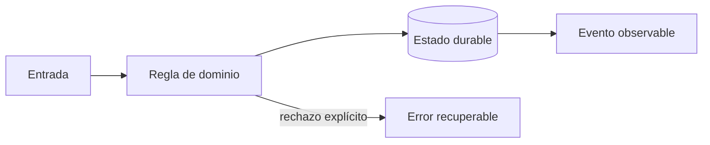

# Módulo 5: Rutas, mapas y seguimiento en tiempo real

## Sílabo

**Objetivo general:** Optimizar recorridos y transmitir posiciones sin confundir estimaciones con hechos.

Al terminar, podrás explicar las decisiones con vocabulario técnico sencillo, implementar una vertical funcional, provocar al menos un fallo y demostrar su recuperación. El producto de estudio es ficticio: evita copiar marcas, identidades o datos de una empresa real.

**Evaluación:** 20 % modelo y explicación, 40 % laboratorio ejecutable, 25 % pruebas y manejo de fallos, 15 % documentación y demostración.

## Contenido teórico

### Tema 1: Grafos y problema de rutas

**Conceptos clave:** matriz de coste, VRP, capacidad, ventanas, heurísticas y restricciones.

La ruta más corta puede incumplir capacidad, prioridad o horario. El problema real minimiza coste sujeto a restricciones y cambios. Se parte de nearest-neighbor, se mejora con 2-opt y se compara con una solución de referencia. Toda heurística registra semilla, tiempo y brecha. El criterio no es memorizar la herramienta, sino poder predecir qué sucede ante duplicados, datos incompletos, concurrencia, pérdida de red o permisos insuficientes. Documenta supuestos y mide antes de optimizar.

**Analogía:** Es como organizar citas médicas: cercanía importa, pero también horario, urgencia y duración.

**¿Por qué es importante?** Porque permite explicar por qué una ruta es viable aunque no sea geométricamente mínima. En RutaFlow la decisión se valida con una prueba automatizada y una observación operativa, no solo con una captura de pantalla.

**Casos de uso reales:** estudia el flujo normal, un reintento, un dato tardío y un acceso sin permiso. Dibuja primero el flujo y marca dónde puede fallar.

**Diagrama:**


### Tema 2: Geocoding y map matching

**Conceptos clave:** calidad de dirección, candidatos, snapping, error y fallback humano.

Geocodificar produce candidatos con confianza, no verdad. Se normaliza sin destruir información y se permite corrección humana. Map matching usa secuencia, red vial y velocidad para evitar saltar a una vía paralela. El sistema conserva entrada original y procedencia. El criterio no es memorizar la herramienta, sino poder predecir qué sucede ante duplicados, datos incompletos, concurrencia, pérdida de red o permisos insuficientes. Documenta supuestos y mide antes de optimizar.

**Analogía:** Es como reconocer una canción con ruido: el mejor resultado necesita un nivel de confianza.

**¿Por qué es importante?** Porque evita despachos a coordenadas plausibles pero incorrectas. En RutaFlow la decisión se valida con una prueba automatizada y una observación operativa, no solo con una captura de pantalla.

**Casos de uso reales:** estudia el flujo normal, un reintento, un dato tardío y un acceso sin permiso. Dibuja primero el flujo y marca dónde puede fallar.

**Diagrama:**


### Tema 3: Streaming y ETA con incertidumbre

**Conceptos clave:** orden, partición, backpressure, datos tardíos, percentiles e intervalos.

El stream particiona por conductor, usa sequence_number y tolera eventos tardíos. El cliente recibe actualizaciones limitadas, no cada punto bruto. ETA combina distancia, tráfico histórico y operación; se evalúa con MAE y percentiles y se comunica como intervalo cuando la incertidumbre es alta. El criterio no es memorizar la herramienta, sino poder predecir qué sucede ante duplicados, datos incompletos, concurrencia, pérdida de red o permisos insuficientes. Documenta supuestos y mide antes de optimizar.

**Analogía:** Es como un pronóstico del tiempo: una franja honesta es más útil que un minuto falso.

**¿Por qué es importante?** Porque protege infraestructura y confianza del usuario. En RutaFlow la decisión se valida con una prueba automatizada y una observación operativa, no solo con una captura de pantalla.

**Casos de uso reales:** estudia el flujo normal, un reintento, un dato tardío y un acceso sin permiso. Dibuja primero el flujo y marca dónde puede fallar.

**Diagrama:**


## Criterio transversal de calidad del código

Usa nombres del dominio (`confirmDelivery`, no `processData`), funciones pequeñas con una responsabilidad observable y errores tipados que conserven causa y contexto sin revelar secretos. Primero escribe una prueba del comportamiento o del fallo que quieres controlar; luego implementa la solución más simple. Aplica SOLID cuando existe presión real de cambio: separa políticas de infraestructura, invierte dependencias en límites externos y evita interfaces enormes. No abstraer antes de encontrar repetición con el mismo significado. Revisa corrección, claridad, cohesión, seguridad, complejidad y capacidad de operación; Clean Code no justifica ocultar costes ni crear capas ceremoniales.


## Laboratorio práctico

Trabaja sobre `examples/rutaflow` y crea una rama para el módulo. Empieza con una prueba roja que represente la regla central; implementa el camino mínimo y luego agrega un fallo deliberado. Ejecuta linters y pruebas desde terminal para que el resultado no dependa del editor.

1. Dibuja el flujo entrada → regla → persistencia → evento → interfaz y escribe dos invariantes.
2. Implementa una vertical pequeña con tipos explícitos y un límite de infraestructura sustituible.
3. Añade pruebas para éxito, entrada inválida, repetición y dependencia no disponible.
4. Registra logs estructurados sin PII, una métrica de resultado y un correlation ID.
5. Explica en el README cómo iniciar, verificar, detener y limpiar el laboratorio.

Usa este contrato como guía, adaptándolo al lenguaje del módulo:

```text
Given un envío existente y una identidad autorizada
When se ejecuta el comando con una clave idempotente
Then cambia una sola vez, persiste un evento y expone el mismo resultado ante reintento
```

**Definición de terminado:** otra persona puede clonar el repositorio, seguir instrucciones, ejecutar la prueba, observar el fallo controlado y comprender la decisión sin preguntarte qué botón presionar.

## Ejercicios de evaluación

### Ejercicio 1: explica antes de programar

Construye un diagrama propio, define tres términos con palabras cotidianas y señala un supuesto peligroso. Contrasta estado y evento, estimación y hecho, o identidad y permiso según corresponda.

### Ejercicio 2: rompe la solución

Introduce duplicación, concurrencia, pérdida de conexión o datos fuera de orden. Conserva la prueba que reproduce el defecto y corrige la causa sin capturar todas las excepciones ni esconder el error.

### Ejercicio 3: decisión profesional

Escribe un ADR de una página con contexto, dos alternativas, decisión, consecuencias, señal que obligaría a revisarla y fuente oficial consultada. Incluye una consideración de accesibilidad, privacidad o coste.

## Rúbrica del proyecto

| Criterio | Inicial | Competente | Profesional |
|---|---|---|---|
| Fundamento | Repite términos | Explica la decisión | Compara alternativas y límites |
| Funcionamiento | Solo camino feliz | Maneja fallos previstos | Demuestra recuperación e idempotencia |
| Código | Acoplado y ambiguo | Claro y probado | Límites cohesionados y deuda explícita |
| Datos y seguridad | Usa datos reales | Minimiza y autoriza | Audita, retiene y modela amenazas |
| Operación | Requiere pasos ocultos | README reproducible | Métricas, runbook y evidencia |

## Bibliografía y fundamento académico

- Documentación oficial de las tecnologías enlazadas desde el panel **Actualizaciones oficiales** de la Academia; verifica versión y fecha antes de aplicar una API.
- Eric Evans, *Domain-Driven Design*, para lenguaje ubicuo, agregados e invariantes.
- Martin Kleppmann, *Designing Data-Intensive Applications*, para datos, replicación, streams y fallos.
- NIST Secure Software Development Framework y OWASP ASVS/MASVS, para ciclo de desarrollo y controles verificables.
- Google SRE Book y SRE Workbook, para SLI, SLO, presupuesto de error e incidentes.
- W3C WCAG, RFC de HTTP y OpenTelemetry Specification cuando la decisión afecte accesibilidad, contratos u observabilidad.

Las fuentes son punto de partida, no autoridad incuestionable: registra versión, distingue norma de recomendación y valida cada afirmación con un experimento reproducible.

## Resumen del módulo

Este capítulo conecta fundamento, implementación y operación. Debes poder contar qué problema resolviste, qué invariante protegiste, cómo comprobaste el comportamiento y qué límite conserva la solución. La evidencia final incluye código, pruebas, diagrama, ADR y demostración; completar una lista de temas sin poder explicar los fallos no representa dominio profesional.
