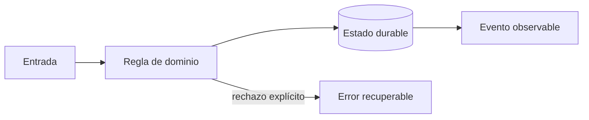
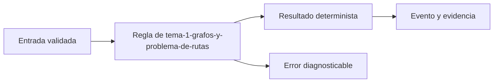
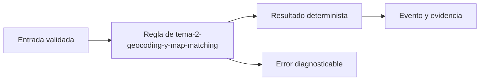
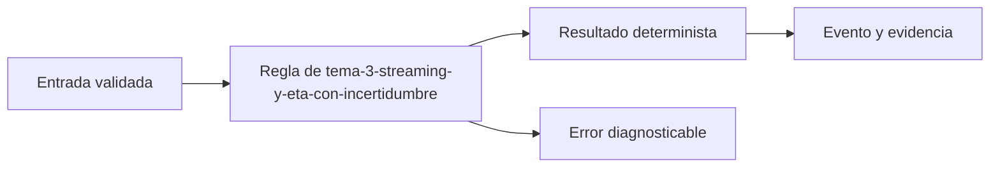

# Módulo 5: Rutas, mapas y seguimiento en tiempo real


## Aprende construyendo

### Tema 1: Grafos y problema de rutas

**Conceptos clave:** matriz de coste, VRP, capacidad, ventanas, heurísticas y restricciones.

La ruta más corta puede incumplir capacidad, prioridad o horario. El problema real minimiza coste sujeto a restricciones y cambios. Se parte de nearest-neighbor, se mejora con 2-opt y se compara con una solución de referencia. Toda heurística registra semilla, tiempo y brecha. El criterio no es memorizar la herramienta, sino poder predecir qué sucede ante duplicados, datos incompletos, concurrencia, pérdida de red o permisos insuficientes. Documenta supuestos y mide antes de optimizar.

**Analogía:** Es como organizar citas médicas: cercanía importa, pero también horario, urgencia y duración.

**¿Por qué es importante?** Porque permite explicar por qué una ruta es viable aunque no sea geométricamente mínima. En RutaFlow la decisión se valida con una prueba automatizada y una observación operativa, no solo con una captura de pantalla.

**Casos de uso reales:** estudia el flujo normal, un reintento, un dato tardío y un acceso sin permiso. Dibuja primero el flujo y marca dónde puede fallar.

**Diagrama:**



#### Paso 1 · Objetivo y preparación

Al finalizar podrás construir y verificar **Tema 1: Grafos y problema de rutas** dentro de RutaFlow, empezando desde una carpeta vacía y explicando qué decisión técnica resuelve. **Conocimiento previo:** terminal, Git y lectura de JSON.

#### Paso 2 · Contexto y caso real

**¿Por qué es importante?** En una plataforma de entregas, tema 1: grafos y problema de rutas afecta directamente la trazabilidad, la seguridad y la capacidad de recuperar un fallo. Separar la decisión del detalle de infraestructura permite probarla antes de desplegarla y evita que una pantalla o un proveedor externo se convierta en la única fuente de verdad.

**Caso real:** una entrega puede repetirse, llegar fuera de orden o quedarse sin conexión. El diseño debe conservar una salida determinista y una evidencia que otra persona pueda revisar.

#### Paso 3 · Teoría, conceptos y analogía

**Conceptos clave:** contrato, estado, evidencia, idempotencia, observabilidad y límite de responsabilidad. Piensa en este tema como una estación de clasificación: recibe una entrada con formato conocido, aplica una regla explícita y entrega una salida que puede auditarse. Si una regla no se puede observar ni probar, todavía no es una parte confiable del sistema.

**Analogía:** es como una guía de despacho: cada paquete tiene una etiqueta, una operación responsable y una marca que demuestra qué ocurrió.



#### Paso 4 · Demostración guiada desde cero

Crea una carpeta independiente para comprobar el concepto antes de conectarlo al monorepo. Después crea `src/tema.js`:

```bash
mkdir -p rutaflow-labs/tema-1-grafos-y-problema-de-rutas
cd rutaflow-labs/tema-1-grafos-y-problema-de-rutas
printf '%s\n' '{"tema":"Tema 1: Grafos y problema de rutas","estado":"preparado"}' > evidencia.json
cat evidencia.json
```

```javascript
// La entrada representa un contrato mínimo y verificable.
const entrada = { tema: 'Tema 1: Grafos y problema de rutas', estado: 'preparado' };
const salida = { ...entrada, evidencia: true };
console.log(JSON.stringify(salida));
```

Ejecuta la comprobación desde `rutaflow-labs/tema-1-grafos-y-problema-de-rutas/`:

```bash
node -e "const fs=require('fs'); const x=JSON.parse(fs.readFileSync('evidencia.json','utf8')); if (!x.tema) throw new Error('Falta tema'); console.log('OK', x.tema);"
```

**Resultado esperado:** el comando imprime `OK` y el nombre del tema; `evidencia.json` conserva una entrada reproducible.

**Fallo deliberado:** cambia `tema` por una cadena vacía y ejecuta de nuevo. El proceso debe fallar con `Falta tema`; diagnostica leyendo la primera causa, corrige solo ese dato y repite la prueba.

#### Paso 5 · Práctica guiada

1. Añade un campo `version` y rechaza valores menores que `1`.
2. Registra una salida JSON de éxito y otra de error sin mezclar ambas.
3. Pista: valida la entrada antes de ejecutar la regla y conserva el mensaje original del error.

#### Paso 6 · Práctica independiente

Implementa una función `procesarEntrada(entrada)` que devuelva una salida determinista, rechace entradas incompletas y pueda ejecutarse dos veces sin duplicar evidencia. No copies la solución del paso anterior; escribe primero el contrato y después el código.

#### Paso 7 · Cierre, evidencia y proyecto

Entrega el archivo `evidencia.json`, la salida `OK`, la salida del fallo deliberado y una breve explicación de la decisión. El siguiente tema conecta este incremento con el proyecto RutaFlow: **Tema 1: Grafos y problema de rutas** debe convertirse en una capacidad comprobable, observable y recuperable. **Fuente oficial:** [https://developer.mozilla.org/en-US/docs/Learn_web_development](https://developer.mozilla.org/en-US/docs/Learn_web_development).

**Errores comunes:** ejecutar desde otra carpeta; validar después de mutar el estado; ocultar el mensaje original del error; no conservar evidencia; asumir que un proveedor externo siempre responde.
### Tema 2: Geocoding y map matching

**Conceptos clave:** calidad de dirección, candidatos, snapping, error y fallback humano.

Geocodificar produce candidatos con confianza, no verdad. Se normaliza sin destruir información y se permite corrección humana. Map matching usa secuencia, red vial y velocidad para evitar saltar a una vía paralela. El sistema conserva entrada original y procedencia. El criterio no es memorizar la herramienta, sino poder predecir qué sucede ante duplicados, datos incompletos, concurrencia, pérdida de red o permisos insuficientes. Documenta supuestos y mide antes de optimizar.

**Analogía:** Es como reconocer una canción con ruido: el mejor resultado necesita un nivel de confianza.

**¿Por qué es importante?** Porque evita despachos a coordenadas plausibles pero incorrectas. En RutaFlow la decisión se valida con una prueba automatizada y una observación operativa, no solo con una captura de pantalla.

**Casos de uso reales:** estudia el flujo normal, un reintento, un dato tardío y un acceso sin permiso. Dibuja primero el flujo y marca dónde puede fallar.

**Diagrama:**


#### Paso 1 · Objetivo y preparación

Al finalizar podrás construir y verificar **Tema 2: Geocoding y map matching** dentro de RutaFlow, empezando desde una carpeta vacía y explicando qué decisión técnica resuelve. **Conocimiento previo:** terminal, Git y lectura de JSON.

#### Paso 2 · Contexto y caso real

**¿Por qué es importante?** En una plataforma de entregas, tema 2: geocoding y map matching afecta directamente la trazabilidad, la seguridad y la capacidad de recuperar un fallo. Separar la decisión del detalle de infraestructura permite probarla antes de desplegarla y evita que una pantalla o un proveedor externo se convierta en la única fuente de verdad.

**Caso real:** una entrega puede repetirse, llegar fuera de orden o quedarse sin conexión. El diseño debe conservar una salida determinista y una evidencia que otra persona pueda revisar.

#### Paso 3 · Teoría, conceptos y analogía

**Conceptos clave:** contrato, estado, evidencia, idempotencia, observabilidad y límite de responsabilidad. Piensa en este tema como una estación de clasificación: recibe una entrada con formato conocido, aplica una regla explícita y entrega una salida que puede auditarse. Si una regla no se puede observar ni probar, todavía no es una parte confiable del sistema.

**Analogía:** es como una guía de despacho: cada paquete tiene una etiqueta, una operación responsable y una marca que demuestra qué ocurrió.



#### Paso 4 · Demostración guiada desde cero

Crea una carpeta independiente para comprobar el concepto antes de conectarlo al monorepo. Después crea `src/tema.js`:

```bash
mkdir -p rutaflow-labs/tema-2-geocoding-y-map-matching
cd rutaflow-labs/tema-2-geocoding-y-map-matching
printf '%s\n' '{"tema":"Tema 2: Geocoding y map matching","estado":"preparado"}' > evidencia.json
cat evidencia.json
```

```javascript
// La entrada representa un contrato mínimo y verificable.
const entrada = { tema: 'Tema 2: Geocoding y map matching', estado: 'preparado' };
const salida = { ...entrada, evidencia: true };
console.log(JSON.stringify(salida));
```

Ejecuta la comprobación desde `rutaflow-labs/tema-2-geocoding-y-map-matching/`:

```bash
node -e "const fs=require('fs'); const x=JSON.parse(fs.readFileSync('evidencia.json','utf8')); if (!x.tema) throw new Error('Falta tema'); console.log('OK', x.tema);"
```

**Resultado esperado:** el comando imprime `OK` y el nombre del tema; `evidencia.json` conserva una entrada reproducible.

**Fallo deliberado:** cambia `tema` por una cadena vacía y ejecuta de nuevo. El proceso debe fallar con `Falta tema`; diagnostica leyendo la primera causa, corrige solo ese dato y repite la prueba.

#### Paso 5 · Práctica guiada

1. Añade un campo `version` y rechaza valores menores que `1`.
2. Registra una salida JSON de éxito y otra de error sin mezclar ambas.
3. Pista: valida la entrada antes de ejecutar la regla y conserva el mensaje original del error.

#### Paso 6 · Práctica independiente

Implementa una función `procesarEntrada(entrada)` que devuelva una salida determinista, rechace entradas incompletas y pueda ejecutarse dos veces sin duplicar evidencia. No copies la solución del paso anterior; escribe primero el contrato y después el código.

#### Paso 7 · Cierre, evidencia y proyecto

Entrega el archivo `evidencia.json`, la salida `OK`, la salida del fallo deliberado y una breve explicación de la decisión. El siguiente tema conecta este incremento con el proyecto RutaFlow: **Tema 2: Geocoding y map matching** debe convertirse en una capacidad comprobable, observable y recuperable. **Fuente oficial:** [https://developer.mozilla.org/en-US/docs/Learn_web_development](https://developer.mozilla.org/en-US/docs/Learn_web_development).

**Errores comunes:** ejecutar desde otra carpeta; validar después de mutar el estado; ocultar el mensaje original del error; no conservar evidencia; asumir que un proveedor externo siempre responde.
### Tema 3: Streaming y ETA con incertidumbre

**Conceptos clave:** orden, partición, backpressure, datos tardíos, percentiles e intervalos.

El stream particiona por conductor, usa sequence_number y tolera eventos tardíos. El cliente recibe actualizaciones limitadas, no cada punto bruto. ETA combina distancia, tráfico histórico y operación; se evalúa con MAE y percentiles y se comunica como intervalo cuando la incertidumbre es alta. El criterio no es memorizar la herramienta, sino poder predecir qué sucede ante duplicados, datos incompletos, concurrencia, pérdida de red o permisos insuficientes. Documenta supuestos y mide antes de optimizar.

**Analogía:** Es como un pronóstico del tiempo: una franja honesta es más útil que un minuto falso.

**¿Por qué es importante?** Porque protege infraestructura y confianza del usuario. En RutaFlow la decisión se valida con una prueba automatizada y una observación operativa, no solo con una captura de pantalla.

**Casos de uso reales:** estudia el flujo normal, un reintento, un dato tardío y un acceso sin permiso. Dibuja primero el flujo y marca dónde puede fallar.

**Diagrama:**


#### Paso 1 · Objetivo y preparación

Al finalizar podrás construir y verificar **Tema 3: Streaming y ETA con incertidumbre** dentro de RutaFlow, empezando desde una carpeta vacía y explicando qué decisión técnica resuelve. **Conocimiento previo:** terminal, Git y lectura de JSON.

#### Paso 2 · Contexto y caso real

**¿Por qué es importante?** En una plataforma de entregas, tema 3: streaming y eta con incertidumbre afecta directamente la trazabilidad, la seguridad y la capacidad de recuperar un fallo. Separar la decisión del detalle de infraestructura permite probarla antes de desplegarla y evita que una pantalla o un proveedor externo se convierta en la única fuente de verdad.

**Caso real:** una entrega puede repetirse, llegar fuera de orden o quedarse sin conexión. El diseño debe conservar una salida determinista y una evidencia que otra persona pueda revisar.

#### Paso 3 · Teoría, conceptos y analogía

**Conceptos clave:** contrato, estado, evidencia, idempotencia, observabilidad y límite de responsabilidad. Piensa en este tema como una estación de clasificación: recibe una entrada con formato conocido, aplica una regla explícita y entrega una salida que puede auditarse. Si una regla no se puede observar ni probar, todavía no es una parte confiable del sistema.

**Analogía:** es como una guía de despacho: cada paquete tiene una etiqueta, una operación responsable y una marca que demuestra qué ocurrió.



#### Paso 4 · Demostración guiada desde cero

Crea una carpeta independiente para comprobar el concepto antes de conectarlo al monorepo. Después crea `src/tema.js`:

```bash
mkdir -p rutaflow-labs/tema-3-streaming-y-eta-con-incertidumbre
cd rutaflow-labs/tema-3-streaming-y-eta-con-incertidumbre
printf '%s\n' '{"tema":"Tema 3: Streaming y ETA con incertidumbre","estado":"preparado"}' > evidencia.json
cat evidencia.json
```

```javascript
// La entrada representa un contrato mínimo y verificable.
const entrada = { tema: 'Tema 3: Streaming y ETA con incertidumbre', estado: 'preparado' };
const salida = { ...entrada, evidencia: true };
console.log(JSON.stringify(salida));
```

Ejecuta la comprobación desde `rutaflow-labs/tema-3-streaming-y-eta-con-incertidumbre/`:

```bash
node -e "const fs=require('fs'); const x=JSON.parse(fs.readFileSync('evidencia.json','utf8')); if (!x.tema) throw new Error('Falta tema'); console.log('OK', x.tema);"
```

**Resultado esperado:** el comando imprime `OK` y el nombre del tema; `evidencia.json` conserva una entrada reproducible.

**Fallo deliberado:** cambia `tema` por una cadena vacía y ejecuta de nuevo. El proceso debe fallar con `Falta tema`; diagnostica leyendo la primera causa, corrige solo ese dato y repite la prueba.

#### Paso 5 · Práctica guiada

1. Añade un campo `version` y rechaza valores menores que `1`.
2. Registra una salida JSON de éxito y otra de error sin mezclar ambas.
3. Pista: valida la entrada antes de ejecutar la regla y conserva el mensaje original del error.

#### Paso 6 · Práctica independiente

Implementa una función `procesarEntrada(entrada)` que devuelva una salida determinista, rechace entradas incompletas y pueda ejecutarse dos veces sin duplicar evidencia. No copies la solución del paso anterior; escribe primero el contrato y después el código.

#### Paso 7 · Cierre, evidencia y proyecto

Entrega el archivo `evidencia.json`, la salida `OK`, la salida del fallo deliberado y una breve explicación de la decisión. El siguiente tema conecta este incremento con el proyecto RutaFlow: **Tema 3: Streaming y ETA con incertidumbre** debe convertirse en una capacidad comprobable, observable y recuperable. **Fuente oficial:** [https://developer.mozilla.org/en-US/docs/Learn_web_development](https://developer.mozilla.org/en-US/docs/Learn_web_development).

**Errores comunes:** ejecutar desde otra carpeta; validar después de mutar el estado; ocultar el mensaje original del error; no conservar evidencia; asumir que un proveedor externo siempre responde.
