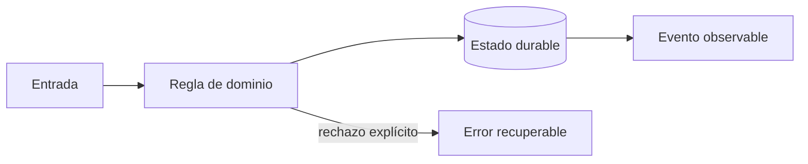

# Módulo 5: Rutas, mapas y seguimiento en tiempo real

## Aprende construyendo

### Tema 1: Grafos y problema de rutas

**Conceptos clave:** matriz de coste, VRP, capacidad, ventanas, heurísticas y restricciones.

La ruta más corta puede incumplir capacidad, prioridad o horario. El problema real minimiza coste sujeto a restricciones y cambios. Se parte de nearest-neighbor, se mejora con 2-opt y se compara con una solución de referencia. Toda heurística registra semilla, tiempo y brecha. El criterio no es memorizar la herramienta, sino poder predecir qué sucede ante duplicados, datos incompletos, concurrencia, pérdida de red o permisos insuficientes. Documenta supuestos y mide antes de optimizar.

**Analogía:** Es como organizar citas médicas: cercanía importa, pero también horario, urgencia y duración.

**¿Por qué es importante?** Porque permite explicar por qué una ruta es viable aunque no sea geométricamente mínima. En RutaFlow la decisión se valida con una prueba automatizada y una observación operativa, no solo con una captura de pantalla.

**Casos de uso reales:** estudia el flujo normal, un reintento, un dato tardío y un acceso sin permiso. Dibuja primero el flujo y marca dónde puede fallar.

**Diagrama:**

### Tema 2: Geocoding y map matching

**Conceptos clave:** calidad de dirección, candidatos, snapping, error y fallback humano.

Geocodificar produce candidatos con confianza, no verdad. Se normaliza sin destruir información y se permite corrección humana. Map matching usa secuencia, red vial y velocidad para evitar saltar a una vía paralela. El sistema conserva entrada original y procedencia. El criterio no es memorizar la herramienta, sino poder predecir qué sucede ante duplicados, datos incompletos, concurrencia, pérdida de red o permisos insuficientes. Documenta supuestos y mide antes de optimizar.

**Analogía:** Es como reconocer una canción con ruido: el mejor resultado necesita un nivel de confianza.

**¿Por qué es importante?** Porque evita despachos a coordenadas plausibles pero incorrectas. En RutaFlow la decisión se valida con una prueba automatizada y una observación operativa, no solo con una captura de pantalla.

**Casos de uso reales:** estudia el flujo normal, un reintento, un dato tardío y un acceso sin permiso. Dibuja primero el flujo y marca dónde puede fallar.

**Diagrama:**

### Tema 3: Streaming y ETA con incertidumbre

**Conceptos clave:** orden, partición, backpressure, datos tardíos, percentiles e intervalos.

El stream particiona por conductor, usa sequence_number y tolera eventos tardíos. El cliente recibe actualizaciones limitadas, no cada punto bruto. ETA combina distancia, tráfico histórico y operación; se evalúa con MAE y percentiles y se comunica como intervalo cuando la incertidumbre es alta. El criterio no es memorizar la herramienta, sino poder predecir qué sucede ante duplicados, datos incompletos, concurrencia, pérdida de red o permisos insuficientes. Documenta supuestos y mide antes de optimizar.

**Analogía:** Es como un pronóstico del tiempo: una franja honesta es más útil que un minuto falso.

**¿Por qué es importante?** Porque protege infraestructura y confianza del usuario. En RutaFlow la decisión se valida con una prueba automatizada y una observación operativa, no solo con una captura de pantalla.

**Casos de uso reales:** estudia el flujo normal, un reintento, un dato tardío y un acceso sin permiso. Dibuja primero el flujo y marca dónde puede fallar.

**Diagrama:**

