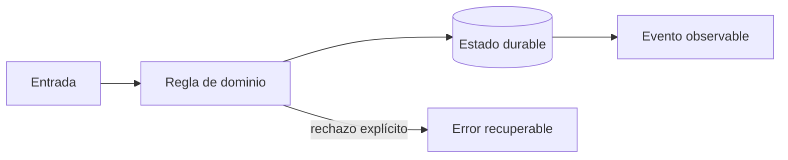
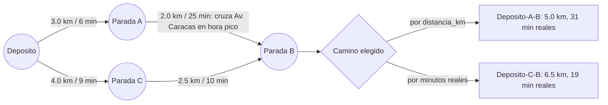
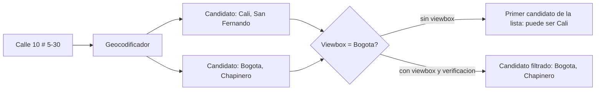
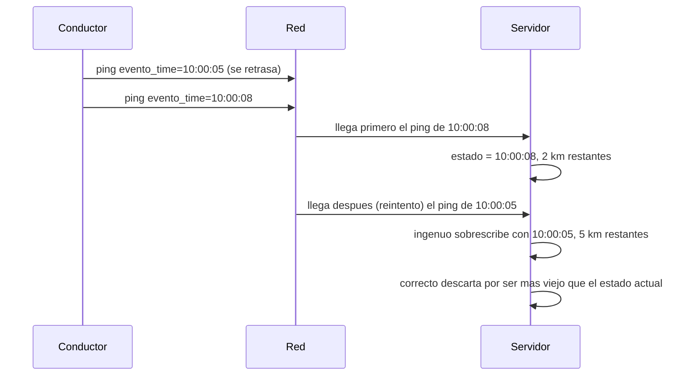

# Módulo 5: Rutas, mapas y seguimiento en tiempo real


## Aprende construyendo

### Tema 1: Grafos y problema de rutas

**Conceptos clave:** matriz de coste, VRP, capacidad, ventanas, heurísticas y restricciones.

La ruta más corta puede incumplir capacidad, prioridad o horario. El problema real minimiza coste sujeto a restricciones y cambios. Se parte de nearest-neighbor, se mejora con 2-opt y se compara con una solución de referencia. Toda heurística registra semilla, tiempo y brecha. El criterio no es memorizar la herramienta, sino poder predecir qué sucede ante duplicados, datos incompletos, concurrencia, pérdida de red o permisos insuficientes. Documenta supuestos y mide antes de optimizar.

**Analogía:** Es como organizar citas médicas: cercanía importa, pero también horario, urgencia y duración.

**¿Por qué es importante?** Porque permite explicar por qué una ruta es viable aunque no sea geométricamente mínima. En RutaFlow la decisión se valida con una prueba automatizada y una observación operativa, no solo con una captura de pantalla.

**Casos de uso reales:** estudia el flujo normal, un reintento, un dato tardío y un acceso sin permiso. Dibuja primero el flujo y marca dónde puede fallar.

**Diagrama:**


```mermaid
flowchart LR
  A[Entrada] --> B[Regla de dominio]
  B --> C[(Estado durable)]
  C --> D[Evento observable]
  B -->|rechazo explícito| E[Error recuperable]
```

#### Paso 1 · Objetivo y preparación

Al finalizar podrás construir y verificar **Tema 1: Grafos y problema de rutas** dentro de RutaFlow, empezando desde una carpeta vacía y explicando qué decisión técnica resuelve. **Conocimiento previo:** terminal, Git y lectura de JSON.

#### Paso 2 · Contexto y caso real

**¿Por qué es importante?** Minimizar la distancia total de una ruta no es lo mismo que minimizar el tiempo real que tarda un conductor en completarla: un tramo más corto en kilómetros puede cruzar una avenida saturada en hora pico y terminar siendo más lento que una alternativa más larga pero fluida. Si RutaFlow asigna rutas solo por distancia, un conductor queda atrapado en tráfico previsible mientras el sistema reporta que eligió la "mejor" ruta.

**Caso real:** un conductor debe ir del depósito a una parada final (`parada_b`) pasando por una intermedia. Dos caminos existen: uno más corto en kilómetros que cruza una avenida con congestión conocida en ese horario, y otro ligeramente más largo que la evita. El sistema debe comparar ambos por tiempo real de viaje, no solo por distancia, antes de asignar la ruta al conductor.

#### Paso 3 · Teoría, conceptos y analogía

**Conceptos clave:** grafo dirigido, nodo (parada), arista con peso (distancia y tiempo), algoritmo de camino mínimo (Dijkstra), y la diferencia entre optimizar por una métrica u otra.

Modelá la red de paradas como un grafo: cada parada es un nodo y cada tramo transitable es una arista con dos pesos distintos — la distancia en kilómetros y el tiempo real de viaje en minutos (que ya incluye congestión conocida). El algoritmo de camino mínimo no sabe nada de tráfico por sí mismo: encuentra el camino de menor peso según la métrica que vos le indiques. Si le pedís el camino de menor `km`, te va a devolver el más corto en el mapa, aunque cruce la avenida más congestionada de la ciudad a las 6pm.

**Analogía:** es como elegir un vuelo solo por la distancia en línea recta entre ciudades: ignora que una ruta con escala puede llegar antes que un vuelo directo si el directo sale más tarde o enfrenta más demora.


```mermaid
flowchart LR
  A((Deposito)) -->|"3.0 km / 6 min"| B((Parada A))
  B -->|"2.0 km / 25 min: cruza Av. Caracas en hora pico"| D((Parada B))
  A -->|"4.0 km / 9 min"| C((Parada C))
  C -->|"2.5 km / 10 min"| D
  D --> R{"Camino elegido"}
  R -->|"por distancia_km"| X["Deposito-A-B: 5.0 km, 31 min reales"]
  R -->|"por minutos reales"| Y["Deposito-C-B: 6.5 km, 19 min reales"]
```

#### Paso 4 · Demostración guiada desde cero

Crea una carpeta independiente y, dentro, `rutas.py`:

```bash
mkdir -p rutaflow-labs/tema-1-grafos-y-problema-de-rutas
cd rutaflow-labs/tema-1-grafos-y-problema-de-rutas
```

```python
import heapq

# Grafo dirigido de paradas: cada arista tiene distancia (km) y tiempo real (min),
# que ya incluye congestion conocida en ese tramo y horario.
grafo = {
    "deposito": {"parada_a": {"km": 3.0, "min": 6}, "parada_c": {"km": 4.0, "min": 9}},
    "parada_a": {"parada_b": {"km": 2.0, "min": 25}},  # cruza la Av. Caracas en hora pico
    "parada_c": {"parada_b": {"km": 2.5, "min": 10}},
    "parada_b": {},
}


def camino_minimo(grafo, origen, destino, peso):
    """Dijkstra generico: `peso` decide si se optimiza por 'km' o por 'min'."""
    distancias = {nodo: float("inf") for nodo in grafo}
    distancias[origen] = 0
    previos = {}
    cola = [(0, origen)]
    while cola:
        actual_dist, actual = heapq.heappop(cola)
        if actual == destino:
            break
        for vecino, pesos in grafo[actual].items():
            nueva_dist = actual_dist + pesos[peso]
            if nueva_dist < distancias[vecino]:
                distancias[vecino] = nueva_dist
                previos[vecino] = actual
                heapq.heappush(cola, (nueva_dist, vecino))
    ruta = [destino]
    while ruta[-1] != origen:
        ruta.append(previos[ruta[-1]])
    return list(reversed(ruta))


def minutos_reales(ruta):
    return sum(grafo[a][b]["min"] for a, b in zip(ruta, ruta[1:]))


ruta_por_distancia = camino_minimo(grafo, "deposito", "parada_b", peso="km")
ruta_por_tiempo = camino_minimo(grafo, "deposito", "parada_b", peso="min")

print("Ruta por distancia:", ruta_por_distancia, "->", minutos_reales(ruta_por_distancia), "min reales")
print("Ruta por tiempo real:", ruta_por_tiempo, "->", minutos_reales(ruta_por_tiempo), "min reales")
```

Ejecuta `python3 rutas.py` desde `rutaflow-labs/tema-1-grafos-y-problema-de-rutas/`.

**Resultado esperado:** `Ruta por distancia: ['deposito', 'parada_a', 'parada_b'] -> 31 min reales` y `Ruta por tiempo real: ['deposito', 'parada_c', 'parada_b'] -> 19 min reales`. La ruta "más corta" en kilómetros (5.0 km) tarda 31 minutos reales porque cruza la Av. Caracas en hora pico; la ruta por `parada_c` mide 6.5 km pero tarda solo 19 minutos.

**Fallo deliberado:** si el sistema de asignación llama `camino_minimo(grafo, "deposito", "parada_b", peso="km")` para decidir qué ruta darle al conductor — como hace cualquier optimizador que solo conoce distancias — va a asignar la ruta por `parada_a`, que en el mapa se ve más corta pero cruza la avenida congestionada y tarda 31 minutos reales, 12 minutos más que la alternativa. El conductor cumple la ruta "óptima" del sistema y llega tarde igual. Diagnosticá comparando `minutos_reales(ruta_por_distancia)` contra `minutos_reales(ruta_por_tiempo)` — la diferencia (12 minutos) es el costo de optimizar por la métrica equivocada — y corregí el criterio de asignación para que use siempre `peso="min"` como fuente de verdad operativa, reservando `km` solo para reportes de combustible.

#### Paso 5 · Práctica guiada

1. Agregá una arista `parada_b -> deposito` y comprobá que `camino_minimo` no la usa para ir de `deposito` a `parada_b` (el grafo es dirigido: una arista de regreso no habilita el camino inverso).
2. Agregá una regla: si la diferencia entre `ruta_por_distancia` y `ruta_por_tiempo` supera el 20% en minutos, el sistema debe registrar una advertencia de "ruta mal priorizada" antes de asignarla.
3. Pista: si pedís un camino entre nodos sin conexión, el código actual lanza `KeyError` al reconstruir la ruta porque `previos` nunca tiene esa clave; decidí cómo manejar ese caso explícitamente en vez de dejar que explote con un error genérico.

#### Paso 6 · Práctica independiente

Implementa una función `mejor_ruta(grafo, origen, destino)` que calcule ambos caminos (por `km` y por `min`), devuelva el de menor tiempo real por defecto, y además reporte cuántos minutos se habrían perdido si el sistema hubiera elegido por distancia. No copies la solución del paso anterior; escribe primero el contrato y después el código.

#### Paso 7 · Cierre, evidencia y proyecto

Entrega el archivo `rutas.py`, la salida de ambas rutas y una breve explicación de por qué la ruta más corta en kilómetros no siempre es la mejor asignación. El siguiente tema toma las coordenadas de estas paradas y resuelve de dónde salen: **Tema 2: Geocoding y map matching** convierte una dirección de texto en las coordenadas que este grafo necesita como nodos. **Fuente oficial:** [Python docs — heapq (cola de prioridad usada en Dijkstra)](https://docs.python.org/3/library/heapq.html).

**Errores comunes:** optimizar únicamente por distancia; ignorar que el grafo es dirigido y asumir que toda arista tiene su inversa; no actualizar los pesos de tiempo cuando cambia el tráfico conocido; mezclar unidades (minutos y kilómetros) en la misma comparación; asumir que el camino más corto siempre existe sin manejar el caso sin conexión.
### Tema 2: Geocoding y map matching

**Conceptos clave:** calidad de dirección, candidatos, snapping, error y fallback humano.

Geocodificar produce candidatos con confianza, no verdad. Se normaliza sin destruir información y se permite corrección humana. Map matching usa secuencia, red vial y velocidad para evitar saltar a una vía paralela. El sistema conserva entrada original y procedencia. El criterio no es memorizar la herramienta, sino poder predecir qué sucede ante duplicados, datos incompletos, concurrencia, pérdida de red o permisos insuficientes. Documenta supuestos y mide antes de optimizar.

**Analogía:** Es como reconocer una canción con ruido: el mejor resultado necesita un nivel de confianza.

**¿Por qué es importante?** Porque evita despachos a coordenadas plausibles pero incorrectas. En RutaFlow la decisión se valida con una prueba automatizada y una observación operativa, no solo con una captura de pantalla.

**Casos de uso reales:** estudia el flujo normal, un reintento, un dato tardío y un acceso sin permiso. Dibuja primero el flujo y marca dónde puede fallar.

**Diagrama:**


```mermaid
flowchart LR
  A[Entrada] --> B[Regla de dominio]
  B --> C[(Estado durable)]
  C --> D[Evento observable]
  B -->|rechazo explícito| E[Error recuperable]
```

#### Paso 1 · Objetivo y preparación

Al finalizar podrás construir y verificar **Tema 2: Geocoding y map matching** dentro de RutaFlow, empezando desde una carpeta vacía y explicando qué decisión técnica resuelve. **Conocimiento previo:** terminal, Git y lectura de JSON.

#### Paso 2 · Contexto y caso real

**¿Por qué es importante?** Un geocodificador que recibe "Calle 10 # 5-30" sin saber en qué ciudad buscar puede devolver, con total confianza numérica, coordenadas de una calle con el mismo nombre en otra ciudad del país. La app del conductor no tiene forma de saber que está mal: el servicio respondió con un punto válido en el mapa, solo que en el lugar equivocado. Sin acotar la búsqueda a una región esperada, un error de geocoding es silencioso y termina en una entrega despachada a la ciudad que no es.

**Caso real:** un cliente registra un envío a "Calle 10 # 5-30" en Bogotá. Esa misma combinación de calle y carrera también existe en Cali. Si el geocodificador no recibe una pista de región, puede devolver el candidato de Cali (el primero de su lista interna) y el sistema le asigna al conductor una parada a cientos de kilómetros de donde debía entregar.

#### Paso 3 · Teoría, conceptos y analogía

**Conceptos clave:** geocoding, candidatos con score de confianza, ambigüedad de direcciones, sesgo por región (`viewbox` / `bounded`), verificación de localidad esperada.

Un geocodificador real (como Nominatim sobre datos de OpenStreetMap, respaldado por PostGIS) no devuelve "la" coordenada de una dirección: devuelve una lista de candidatos, cada uno con su propia ciudad y nivel de confianza. Cuando el texto de la dirección es ambiguo (existe en más de una ciudad), el primer candidato de esa lista no necesariamente es el correcto para tu caso de uso. La forma de resolverlo no es "confiar en el primero", sino acotar la búsqueda con una pista de región y, después, verificar que la ciudad del candidato devuelto coincide con la que esperabas.

**Analogía:** es como preguntar "¿dónde queda la Calle 10?" en una ciudad que no mencionaste: te van a contestar con la primera Calle 10 que se les ocurra, no necesariamente la tuya.


```mermaid
flowchart LR
  A["Calle 10 # 5-30"] --> B["Geocodificador"]
  B --> C1["Candidato: Cali, San Fernando"]
  B --> C2["Candidato: Bogota, Chapinero"]
  C1 --> D{"Viewbox = Bogota?"}
  C2 --> D
  D -->|"sin viewbox"| E["Primer candidato de la lista: puede ser Cali"]
  D -->|"con viewbox y verificacion"| F["Candidato filtrado: Bogota, Chapinero"]
```

#### Paso 4 · Demostración guiada desde cero

Crea una carpeta independiente y, dentro, `geocoding.py`:

```bash
mkdir -p rutaflow-labs/tema-2-geocoding-y-map-matching
cd rutaflow-labs/tema-2-geocoding-y-map-matching
```

```python
# Simula el indice de un geocodificador real (p. ej. Nominatim sobre PostGIS):
# la misma combinacion de calle y carrera existe en mas de una ciudad.
INDICE = {
    "calle 10 # 5-30": [
        {"ciudad": "Cali", "localidad": "San Fernando", "lat": 3.4372, "lon": -76.5225},
        {"ciudad": "Bogota", "localidad": "Chapinero", "lat": 4.6126, "lon": -74.0705},
    ],
}


def geocodificar(direccion, ciudad_esperada=None):
    """Sin ciudad_esperada, devuelve el primer candidato tal cual el indice lo ordena
    (igual que un geocodificador real sin viewbox ni sesgo de region)."""
    candidatos = INDICE[direccion.strip().lower()]
    if ciudad_esperada is None:
        return candidatos[0]
    filtrados = [c for c in candidatos if c["ciudad"] == ciudad_esperada]
    if not filtrados:
        raise ValueError(f"sin candidatos para {direccion!r} en {ciudad_esperada!r}")
    return filtrados[0]


resultado = geocodificar("Calle 10 # 5-30", ciudad_esperada="Bogota")
print(resultado)
```

Ejecuta `python3 geocoding.py` desde `rutaflow-labs/tema-2-geocoding-y-map-matching/`.

**Resultado esperado:** `{'ciudad': 'Bogota', 'localidad': 'Chapinero', 'lat': 4.6126, 'lon': -74.0705}` — el candidato correcto, porque la búsqueda está acotada a la ciudad esperada.

**Fallo deliberado:** quitá el parámetro `ciudad_esperada` y llamá a la misma dirección como lo haría un servicio que confía en el primer resultado:

```python
resultado_ambiguo = geocodificar("Calle 10 # 5-30")
print(resultado_ambiguo)
```

Esto imprime `{'ciudad': 'Cali', 'localidad': 'San Fernando', 'lat': 3.4372, 'lon': -76.5225}` — coordenadas válidas, con formato correcto, pero a más de 400 km de donde el envío debía entregarse, y sin ningún error que lo señale: el programa termina sin excepciones. Diagnosticá comparando `resultado["ciudad"]` contra la ciudad real del pedido en tu sistema (nunca asumas que coincide), y corregí siempre pasando `ciudad_esperada` y verificando `resultado["ciudad"] == ciudad_esperada` antes de aceptar el candidato como válido.

#### Paso 5 · Práctica guiada

1. Agregá un tercer candidato para "Calle 10 # 5-30" en Medellín y comprobá que `ciudad_esperada="Medellin"` lo selecciona sin afectar los otros dos casos.
2. Hacé que `geocodificar` lance un error explícito (no devuelva `None` silenciosamente) cuando `ciudad_esperada` no tiene ningún candidato.
3. Pista: nunca aceptes un candidato sin registrar en la evidencia qué otros candidatos existían y por qué se descartaron; un operador humano debe poder revisar esa decisión.

#### Paso 6 · Práctica independiente

Implementa una función `geocodificar_verificado(direccion, ciudad_esperada)` que, además de filtrar por ciudad, rechace el resultado si la localidad devuelta no está en una lista de localidades válidas conocidas para esa ciudad, y registre cuántos candidatos alternativos existían. No copies la solución del paso anterior; escribe primero el contrato y después el código.

#### Paso 7 · Cierre, evidencia y proyecto

Entrega `geocoding.py`, la salida correcta, la salida del fallo deliberado (coordenadas en la ciudad equivocada) y una breve explicación de por qué una respuesta válida no garantiza la ciudad correcta. El siguiente tema toma estas coordenadas ya verificadas y las sigue en movimiento: **Tema 3: Streaming y ETA con incertidumbre** usa la posición geocodificada como punto de partida de cada actualización GPS. **Fuente oficial:** [Nominatim — Search API (parámetros viewbox y bounded)](https://nominatim.org/release-docs/latest/api/Search/).

**Errores comunes:** confiar en el primer candidato sin verificar la ciudad; no acotar la búsqueda con una región esperada; tratar una respuesta con coordenadas como sinónimo de "dirección correcta"; descartar el score de confianza del geocodificador; no conservar el texto original de la dirección junto con el resultado.
### Tema 3: Streaming y ETA con incertidumbre

**Conceptos clave:** orden, partición, backpressure, datos tardíos, percentiles e intervalos.

El stream particiona por conductor, usa sequence_number y tolera eventos tardíos. El cliente recibe actualizaciones limitadas, no cada punto bruto. ETA combina distancia, tráfico histórico y operación; se evalúa con MAE y percentiles y se comunica como intervalo cuando la incertidumbre es alta. El criterio no es memorizar la herramienta, sino poder predecir qué sucede ante duplicados, datos incompletos, concurrencia, pérdida de red o permisos insuficientes. Documenta supuestos y mide antes de optimizar.

**Analogía:** Es como un pronóstico del tiempo: una franja honesta es más útil que un minuto falso.

**¿Por qué es importante?** Porque protege infraestructura y confianza del usuario. En RutaFlow la decisión se valida con una prueba automatizada y una observación operativa, no solo con una captura de pantalla.

**Casos de uso reales:** estudia el flujo normal, un reintento, un dato tardío y un acceso sin permiso. Dibuja primero el flujo y marca dónde puede fallar.

**Diagrama:**


```mermaid
flowchart LR
  A[Entrada] --> B[Regla de dominio]
  B --> C[(Estado durable)]
  C --> D[Evento observable]
  B -->|rechazo explícito| E[Error recuperable]
```

#### Paso 1 · Objetivo y preparación

Al finalizar podrás construir y verificar **Tema 3: Streaming y ETA con incertidumbre** dentro de RutaFlow, empezando desde una carpeta vacía y explicando qué decisión técnica resuelve. **Conocimiento previo:** terminal, Git y lectura de JSON.

#### Paso 2 · Contexto y caso real

**¿Por qué es importante?** Los pings GPS de un conductor viajan por una red que puede reordenarlos: un reintento de red puede hacer que un dato más viejo llegue después de uno más nuevo. Si el sistema de ETA actualiza la posición del envío con "el último dato que llegó" en vez de "el dato con el timestamp más reciente", la llegada tardía de un ping viejo puede pisar una posición más actualizada e inflar el ETA mostrado al cliente, aunque el conductor ya haya avanzado.

**Caso real:** un conductor envía un ping a las `10:00:08` que llega a tiempo. Un ping anterior, de las `10:00:05`, se había perdido en la red y llega recién después, por un reintento automático del dispositivo. Si el servidor procesa "el último mensaje recibido" como la posición vigente, reemplaza la posición de las `10:00:08` (más cercana al destino) por la de las `10:00:05` (más lejana), y el ETA mostrado empeora aunque el conductor ya avanzó.

#### Paso 3 · Teoría, conceptos y analogía

**Conceptos clave:** tiempo de evento vs. tiempo de llegada, datos tardíos (*late data*), orden por `evento_time`, estado por envío, ETA como función de la posición más reciente por timestamp, no por orden de arribo.

La trampa más común en streaming es confundir "el mensaje que acabo de recibir" con "el dato más nuevo". Un stream de posiciones GPS no garantiza orden de entrega: la red puede repetir, retrasar o reordenar paquetes. La única fuente de verdad sobre qué tan reciente es un dato es su `evento_time` (cuándo ocurrió en el dispositivo), nunca el momento en que el servidor lo procesó. Mantener el estado correcto significa comparar el `evento_time` del evento entrante contra el `evento_time` ya guardado, y descartar cualquier evento más viejo que el estado actual.

**Analogía:** es como leer un grupo de postales que llegan desordenadas por correo: si las archivás en el orden en que las recibiste en vez de mirar la fecha escrita en cada una, terminás creyendo que el remitente retrocedió en el tiempo.


```mermaid
sequenceDiagram
  participant Conductor
  participant Red
  participant Servidor
  Conductor->>Red: ping evento_time=10:00:05 (se retrasa)
  Conductor->>Red: ping evento_time=10:00:08
  Red->>Servidor: llega primero el ping de 10:00:08
  Servidor->>Servidor: estado = 10:00:08, 2 km restantes
  Red->>Servidor: llega despues (reintento) el ping de 10:00:05
  Servidor->>Servidor: ingenuo sobrescribe con 10:00:05, 5 km restantes
  Servidor->>Servidor: correcto descarta por ser mas viejo que el estado actual
```

#### Paso 4 · Demostración guiada desde cero

Crea una carpeta independiente y, dentro, `eta.py`:

```bash
mkdir -p rutaflow-labs/tema-3-streaming-y-eta-con-incertidumbre
cd rutaflow-labs/tema-3-streaming-y-eta-con-incertidumbre
```

```python
from datetime import datetime


def ts(hhmmss):
    return datetime.strptime(hhmmss, "%H:%M:%S")


# Eventos tal como LLEGAN al servidor (orden de arribo), no el orden en que ocurrieron:
# el ping de las 10:00:05 se retraso en la red y llega despues del de 10:00:08.
eventos_en_orden_de_llegada = [
    {"envio_id": "RF-4471", "evento_time": ts("10:00:08"), "km_restantes": 2.0},
    {"envio_id": "RF-4471", "evento_time": ts("10:00:05"), "km_restantes": 5.0},  # llega tarde por reintento
]

VELOCIDAD_KM_MIN = 0.5  # supuesto simplificado para calcular ETA


def eta_minutos(km_restantes):
    return round(km_restantes / VELOCIDAD_KM_MIN, 1)


def procesar_por_event_time(eventos):
    """Correcto: solo actualiza el estado si el evento es mas nuevo que el guardado."""
    estado = {}
    for evento in eventos:
        actual = estado.get(evento["envio_id"])
        if actual is None or evento["evento_time"] > actual["evento_time"]:
            estado[evento["envio_id"]] = evento
    return estado


estado_correcto = procesar_por_event_time(eventos_en_orden_de_llegada)
posicion = estado_correcto["RF-4471"]
print("ETA correcto:", eta_minutos(posicion["km_restantes"]), "min, basado en evento de", posicion["evento_time"].time())
```

Ejecuta `python3 eta.py` desde `rutaflow-labs/tema-3-streaming-y-eta-con-incertidumbre/`.

**Resultado esperado:** `ETA correcto: 4.0 min, basado en evento de 10:00:08` — el servidor conserva la posición más nueva por timestamp (2.0 km restantes) aunque no haya sido la última en llegar.

**Fallo deliberado:** agregá esta función ingenua, que procesa los eventos en el orden en que llegaron y deja que el último sobrescriba siempre al anterior sin comparar `evento_time`:

```python
def procesar_por_orden_de_llegada(eventos):
    """Ingenuo: el ultimo evento recibido siempre pisa el estado anterior."""
    estado = {}
    for evento in eventos:
        estado[evento["envio_id"]] = evento  # no compara evento_time, solo sobrescribe
    return estado


estado_ingenuo = procesar_por_orden_de_llegada(eventos_en_orden_de_llegada)
posicion = estado_ingenuo["RF-4471"]
print("ETA ingenuo:", eta_minutos(posicion["km_restantes"]), "min, basado en evento de", posicion["evento_time"].time())
```

Esto imprime `ETA ingenuo: 10.0 min, basado en evento de 10:00:05` — el ping tardío de las `10:00:05` pisó el estado más nuevo de las `10:00:08` solo porque llegó después por la red, y el ETA empeora (de 4 a 10 minutos) aunque el conductor en realidad está más cerca. Diagnosticá comparando los dos `evento_time` impresos — el ingenuo termina con el timestamp más viejo, no el más nuevo — y corregí reemplazando la sobrescritura incondicional por la comparación `evento["evento_time"] > actual["evento_time"]` de `procesar_por_event_time`.

#### Paso 5 · Práctica guiada

1. Agregá un tercer ping con `evento_time=10:00:03` que llegue último de todos y comprobá que `procesar_por_event_time` lo descarta sin tocar el estado de las `10:00:08`.
2. Calculá, además del ETA, cuántos minutos de diferencia hubo entre el estado ingenuo y el correcto, y registralo como métrica de "corrección por evento tardío".
3. Pista: comparar timestamps con `>` no alcanza si dos eventos llegan con el mismo `evento_time` exacto; definí qué hacer en ese empate (por ejemplo, conservar el de menor `km_restantes`).

#### Paso 6 · Práctica independiente

Implementa una función `actualizar_posicion(estado, evento)` que aplique la regla de "solo el más nuevo por `evento_time` gana", devuelva un nuevo estado sin mutar el anterior, y pueda recibir los eventos en cualquier orden de llegada sin cambiar el resultado final. No copies la solución del paso anterior; escribe primero el contrato y después el código.

#### Paso 7 · Cierre, evidencia y proyecto

Entrega `eta.py`, las dos salidas (ETA correcto y el ingenuo) con la diferencia entre ambas, y una breve explicación de por qué el orden de llegada nunca debe ser la fuente de verdad del tiempo. Con esto cierra el recorrido del Módulo 5: desde el grafo de rutas (Tema 1), pasando por coordenadas verificadas por ciudad (Tema 2), hasta un ETA que resiste datos tardíos (Tema 3). El Módulo 6 retoma estas rutas, posiciones y ETAs ya confiables como entrada para facturación, recaudo y liquidaciones. **Fuente oficial:** [RFC 6455 — The WebSocket Protocol](https://www.rfc-editor.org/rfc/rfc6455) (la especificación solo garantiza orden de entrega dentro de una misma conexión; una reconexión por reintento abre una conexión nueva y no hereda esa garantía, por eso el `evento_time` del mensaje — no el orden de llegada — debe ser la fuente de verdad).

**Errores comunes:** usar el orden de llegada como si fuera el orden de ocurrencia; sobrescribir estado sin comparar `evento_time`; ignorar reintentos de red como fuente de eventos tardíos o duplicados; calcular el ETA sin registrar de qué evento salió; no definir una regla explícita para eventos con el mismo timestamp.
