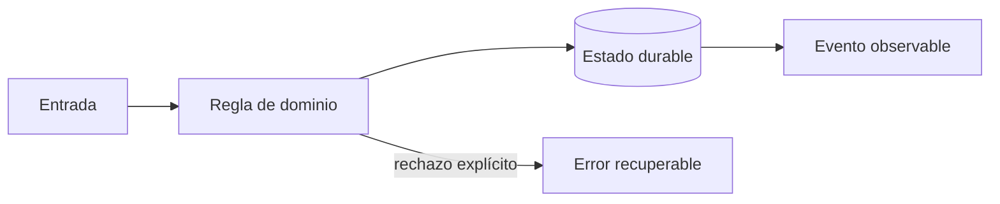

# Módulo 6: Facturación, recaudo, liquidaciones y fraude

## Sílabo

**Objetivo general:** Modelar dinero como un subsistema auditable y el riesgo como apoyo a decisiones humanas.

Al terminar, podrás explicar las decisiones con vocabulario técnico sencillo, implementar una vertical funcional, provocar al menos un fallo y demostrar su recuperación. El producto de estudio es ficticio: evita copiar marcas, identidades o datos de una empresa real.

**Evaluación:** 20 % modelo y explicación, 40 % laboratorio ejecutable, 25 % pruebas y manejo de fallos, 15 % documentación y demostración.

## Aprende construyendo

### Tema 1: Cotización y facturación reproducible

**Conceptos clave:** Money, moneda, redondeo, vigencia, impuestos y versiones.

Money combina entero en unidad menor y moneda; nunca float. La cotización guarda tarifa, versión, entradas y desglose. El cambio de tarifa crea nueva vigencia. Impuestos dependen de jurisdicción y fecha, por lo que el motor recibe política explícita. El criterio no es memorizar la herramienta, sino poder predecir qué sucede ante duplicados, datos incompletos, concurrencia, pérdida de red o permisos insuficientes. Documenta supuestos y mide antes de optimizar.

**Analogía:** Es como un tiquete conserva fecha y tarifa aunque el precio cambie mañana.

**¿Por qué es importante?** Porque soporte y auditoría pueden reproducir cada cobro. En RutaFlow la decisión se valida con una prueba automatizada y una observación operativa, no solo con una captura de pantalla.

**Casos de uso reales:** estudia el flujo normal, un reintento, un dato tardío y un acceso sin permiso. Dibuja primero el flujo y marca dónde puede fallar.

**Diagrama:**

### Tema 2: Recaudo, liquidación y conciliación

**Conceptos clave:** doble partida, efectivo contra entrega, pagos, settlement, reversos y diferencias.

Cobrar efectivo aumenta caja del conductor y obligación a entregar; liquidar mueve ambas cuentas. Un pago electrónico cruza procesador, banco y ledger interno. Conciliación compara fuentes por referencia, monto, moneda y ventana; las diferencias entran a una cola, no se eliminan. El criterio no es memorizar la herramienta, sino poder predecir qué sucede ante duplicados, datos incompletos, concurrencia, pérdida de red o permisos insuficientes. Documenta supuestos y mide antes de optimizar.

**Analogía:** Es como cerrar caja: el total esperado y el contado se comparan y toda diferencia se investiga.

**¿Por qué es importante?** Porque separa el movimiento real de la representación contable. En RutaFlow la decisión se valida con una prueba automatizada y una observación operativa, no solo con una captura de pantalla.

**Casos de uso reales:** estudia el flujo normal, un reintento, un dato tardío y un acceso sin permiso. Dibuja primero el flujo y marca dónde puede fallar.

**Diagrama:**

### Tema 3: Fraude responsable

**Conceptos clave:** señales, reglas, modelos, explicabilidad, revisión, sesgo y privacidad.

Velocidad imposible, evidencia repetida o concentración de reversos son señales, no culpabilidad. Una puntuación prioriza revisión y registra factores. Bloquear automáticamente por un GPS impreciso puede perjudicar zonas rurales. Se miden falsos positivos por segmento y existe apelación. El criterio no es memorizar la herramienta, sino poder predecir qué sucede ante duplicados, datos incompletos, concurrencia, pérdida de red o permisos insuficientes. Documenta supuestos y mide antes de optimizar.

**Analogía:** Es como una alarma de humo solicita inspección; no condena el edificio.

**¿Por qué es importante?** Porque reduce pérdidas sin convertir correlaciones defectuosas en decisiones irreversibles. En RutaFlow la decisión se valida con una prueba automatizada y una observación operativa, no solo con una captura de pantalla.

**Casos de uso reales:** estudia el flujo normal, un reintento, un dato tardío y un acceso sin permiso. Dibuja primero el flujo y marca dónde puede fallar.

**Diagrama:**

## Criterio transversal de calidad del código

Usa nombres del dominio (`confirmDelivery`, no `processData`), funciones pequeñas con una responsabilidad observable y errores tipados que conserven causa y contexto sin revelar secretos. Primero escribe una prueba del comportamiento o del fallo que quieres controlar; luego implementa la solución más simple. Aplica SOLID cuando existe presión real de cambio: separa políticas de infraestructura, invierte dependencias en límites externos y evita interfaces enormes. No abstraer antes de encontrar repetición con el mismo significado. Revisa corrección, claridad, cohesión, seguridad, complejidad y capacidad de operación; Clean Code no justifica ocultar costes ni crear capas ceremoniales.

## Bibliografía y fundamento académico

- Documentación oficial de las tecnologías enlazadas desde el panel **Actualizaciones oficiales** de la Academia; verifica versión y fecha antes de aplicar una API.
- Eric Evans, *Domain-Driven Design*, para lenguaje ubicuo, agregados e invariantes.
- Martin Kleppmann, *Designing Data-Intensive Applications*, para datos, replicación, streams y fallos.
- NIST Secure Software Development Framework y OWASP ASVS/MASVS, para ciclo de desarrollo y controles verificables.
- Google SRE Book y SRE Workbook, para SLI, SLO, presupuesto de error e incidentes.
- W3C WCAG, RFC de HTTP y OpenTelemetry Specification cuando la decisión afecte accesibilidad, contratos u observabilidad.

Las fuentes son punto de partida, no autoridad incuestionable: registra versión, distingue norma de recomendación y valida cada afirmación con un experimento reproducible.

## Resumen del módulo

Este capítulo conecta fundamento, implementación y operación. Debes poder contar qué problema resolviste, qué invariante protegiste, cómo comprobaste el comportamiento y qué límite conserva la solución. La evidencia final incluye código, pruebas, diagrama, ADR y demostración; completar una lista de temas sin poder explicar los fallos no representa dominio profesional.
