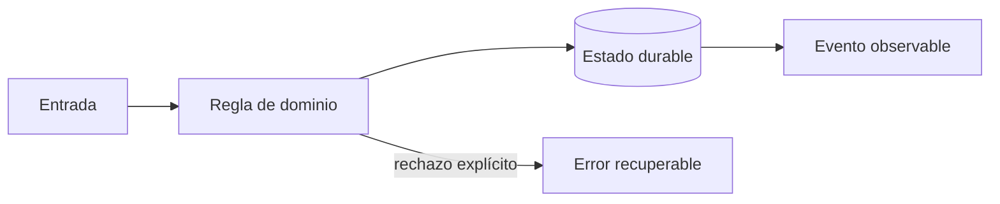

# Módulo 6: Facturación, recaudo, liquidaciones y fraude

## Aprende construyendo

### Tema 1: Cotización y facturación reproducible

**Conceptos clave:** Money, moneda, redondeo, vigencia, impuestos y versiones.

Money combina entero en unidad menor y moneda; nunca float. La cotización guarda tarifa, versión, entradas y desglose. El cambio de tarifa crea nueva vigencia. Impuestos dependen de jurisdicción y fecha, por lo que el motor recibe política explícita. El criterio no es memorizar la herramienta, sino poder predecir qué sucede ante duplicados, datos incompletos, concurrencia, pérdida de red o permisos insuficientes. Documenta supuestos y mide antes de optimizar.

**Analogía:** Es como un tiquete conserva fecha y tarifa aunque el precio cambie mañana.

**¿Por qué es importante?** Porque soporte y auditoría pueden reproducir cada cobro. En RutaFlow la decisión se valida con una prueba automatizada y una observación operativa, no solo con una captura de pantalla.

**Casos de uso reales:** estudia el flujo normal, un reintento, un dato tardío y un acceso sin permiso. Dibuja primero el flujo y marca dónde puede fallar.

**Diagrama:**

### Tema 2: Recaudo, liquidación y conciliación

**Conceptos clave:** doble partida, efectivo contra entrega, pagos, settlement, reversos y diferencias.

Cobrar efectivo aumenta caja del conductor y obligación a entregar; liquidar mueve ambas cuentas. Un pago electrónico cruza procesador, banco y ledger interno. Conciliación compara fuentes por referencia, monto, moneda y ventana; las diferencias entran a una cola, no se eliminan. El criterio no es memorizar la herramienta, sino poder predecir qué sucede ante duplicados, datos incompletos, concurrencia, pérdida de red o permisos insuficientes. Documenta supuestos y mide antes de optimizar.

**Analogía:** Es como cerrar caja: el total esperado y el contado se comparan y toda diferencia se investiga.

**¿Por qué es importante?** Porque separa el movimiento real de la representación contable. En RutaFlow la decisión se valida con una prueba automatizada y una observación operativa, no solo con una captura de pantalla.

**Casos de uso reales:** estudia el flujo normal, un reintento, un dato tardío y un acceso sin permiso. Dibuja primero el flujo y marca dónde puede fallar.

**Diagrama:**

### Tema 3: Fraude responsable

**Conceptos clave:** señales, reglas, modelos, explicabilidad, revisión, sesgo y privacidad.

Velocidad imposible, evidencia repetida o concentración de reversos son señales, no culpabilidad. Una puntuación prioriza revisión y registra factores. Bloquear automáticamente por un GPS impreciso puede perjudicar zonas rurales. Se miden falsos positivos por segmento y existe apelación. El criterio no es memorizar la herramienta, sino poder predecir qué sucede ante duplicados, datos incompletos, concurrencia, pérdida de red o permisos insuficientes. Documenta supuestos y mide antes de optimizar.

**Analogía:** Es como una alarma de humo solicita inspección; no condena el edificio.

**¿Por qué es importante?** Porque reduce pérdidas sin convertir correlaciones defectuosas en decisiones irreversibles. En RutaFlow la decisión se valida con una prueba automatizada y una observación operativa, no solo con una captura de pantalla.

**Casos de uso reales:** estudia el flujo normal, un reintento, un dato tardío y un acceso sin permiso. Dibuja primero el flujo y marca dónde puede fallar.

**Diagrama:**

