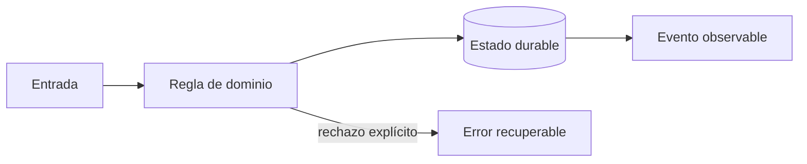

# Módulo 6: Facturación, recaudo, liquidaciones y fraude

## Sílabo

**Objetivo general:** Modelar dinero como un subsistema auditable y el riesgo como apoyo a decisiones humanas.

Al terminar, podrás explicar las decisiones con vocabulario técnico sencillo, implementar una vertical funcional, provocar al menos un fallo y demostrar su recuperación. El producto de estudio es ficticio: evita copiar marcas, identidades o datos de una empresa real.

**Evaluación:** 20 % modelo y explicación, 40 % laboratorio ejecutable, 25 % pruebas y manejo de fallos, 15 % documentación y demostración.

## Comienza desde cero: prepara este capítulo

Este recorrido parte de una carpeta vacía. Al finalizar tendrás **Un incremento pequeño, probado y reproducible del capítulo.** No avances ejecutando comandos que no comprendes: primero identifica la entrada, la transformación y la evidencia que comprobará el resultado.

### 1. Comprueba las herramientas

Los comandos funcionan en macOS, Linux y WSL. En PowerShell usa el equivalente indicado por la herramienta.

```bash
git --version
docker --version
node --version
java --version
flutter --version
```

Si un comando no existe, detente e instala esa herramienta desde su sitio oficial. Cierra y abre la terminal después de modificar `PATH`. Las versiones deben ser compatibles entre sí antes de crear archivos.

### 2. Crea o recupera el proyecto del track

```bash
mkdir -p academia-labs/rutaflow/{apps,services,packages,infra,docs/evidence}
cd academia-labs/rutaflow
git init
```

Trabaja dentro de `academia-labs/rutaflow`. Si ya existe, no lo vuelvas a generar: entra en la carpeta, confirma `git status` y continúa sobre una rama propia.

### 3. Ubica cada tema antes de escribir

```text
academia-labs/rutaflow/
├─ docs/iterations/
│  └─ module-6/
├─ tests/
├─ docs/decisions/
├─ evidence/module-6/
└─ README.md
```

| Tema | Archivo o decisión | Evidencia mínima |
|---|---|---|
| 1. Cotización y facturación reproducible | `docs/iterations/module-6/topic-1-cotizacion-y-facturacion-reproducible.md` | prueba + salida observable |
| 2. Recaudo, liquidación y conciliación | `docs/iterations/module-6/topic-2-recaudo-liquidacion-y-conciliacion.md` | prueba + salida observable |
| 3. Fraude responsable | `docs/iterations/module-6/topic-3-fraude-responsable.md` | prueba + salida observable |

Un ejemplo técnico vive en el archivo indicado y debe tener una prueba. Un tema conceptual vive en `docs/decisions/`: compara opciones usando restricciones medibles; no escribas código decorativo solo para llenar espacio.

### 4. Ejecuta una línea base

Desde `academia-labs/rutaflow`:

```bash
docker compose config
```

**Resultado esperado:** el comando reconoce el proyecto y termina sin errores antes de introducir el cambio del capítulo. Después del incremento, la evidencia debe demostrar: **Un incremento pequeño, probado y reproducible del capítulo.**

Si falla la línea base, no continúes. Localiza el primer mensaje que indique archivo, línea o dependencia; formula una causa y compruébala con un cambio pequeño.

### 5. Provoca un fallo y recupérate

Rompe de forma controlada un contrato entre componentes y localiza la causa con pruebas, logs o métricas. Guarda en `evidence/module-6/` el comando, la salida relevante, tu hipótesis y la corrección. Revierte únicamente el cambio deliberado; no borres todo el proyecto para ocultar la causa.

### 6. Conecta el capítulo con RutaFlow

Aplica el aprendizaje de **Facturación, recaudo, liquidaciones y fraude** a un incremento vertical de RutaFlow. Define qué componente produce el dato, qué contrato lo transporta, quién lo consume y cómo observarás un fallo. La entrega final incluye archivo o decisión, prueba, salida, error corregido y una limitación que todavía validarías en producción.

---

## Contenido teórico

### Tema 1: Cotización y facturación reproducible

**Conceptos clave:** Money, moneda, redondeo, vigencia, impuestos y versiones.

Money combina entero en unidad menor y moneda; nunca float. La cotización guarda tarifa, versión, entradas y desglose. El cambio de tarifa crea nueva vigencia. Impuestos dependen de jurisdicción y fecha, por lo que el motor recibe política explícita. El criterio no es memorizar la herramienta, sino poder predecir qué sucede ante duplicados, datos incompletos, concurrencia, pérdida de red o permisos insuficientes. Documenta supuestos y mide antes de optimizar.

**Analogía:** Es como un tiquete conserva fecha y tarifa aunque el precio cambie mañana.

**¿Por qué es importante?** Porque soporte y auditoría pueden reproducir cada cobro. En RutaFlow la decisión se valida con una prueba automatizada y una observación operativa, no solo con una captura de pantalla.

**Casos de uso reales:** estudia el flujo normal, un reintento, un dato tardío y un acceso sin permiso. Dibuja primero el flujo y marca dónde puede fallar.

**Diagrama:**


### Tema 2: Recaudo, liquidación y conciliación

**Conceptos clave:** doble partida, efectivo contra entrega, pagos, settlement, reversos y diferencias.

Cobrar efectivo aumenta caja del conductor y obligación a entregar; liquidar mueve ambas cuentas. Un pago electrónico cruza procesador, banco y ledger interno. Conciliación compara fuentes por referencia, monto, moneda y ventana; las diferencias entran a una cola, no se eliminan. El criterio no es memorizar la herramienta, sino poder predecir qué sucede ante duplicados, datos incompletos, concurrencia, pérdida de red o permisos insuficientes. Documenta supuestos y mide antes de optimizar.

**Analogía:** Es como cerrar caja: el total esperado y el contado se comparan y toda diferencia se investiga.

**¿Por qué es importante?** Porque separa el movimiento real de la representación contable. En RutaFlow la decisión se valida con una prueba automatizada y una observación operativa, no solo con una captura de pantalla.

**Casos de uso reales:** estudia el flujo normal, un reintento, un dato tardío y un acceso sin permiso. Dibuja primero el flujo y marca dónde puede fallar.

**Diagrama:**


### Tema 3: Fraude responsable

**Conceptos clave:** señales, reglas, modelos, explicabilidad, revisión, sesgo y privacidad.

Velocidad imposible, evidencia repetida o concentración de reversos son señales, no culpabilidad. Una puntuación prioriza revisión y registra factores. Bloquear automáticamente por un GPS impreciso puede perjudicar zonas rurales. Se miden falsos positivos por segmento y existe apelación. El criterio no es memorizar la herramienta, sino poder predecir qué sucede ante duplicados, datos incompletos, concurrencia, pérdida de red o permisos insuficientes. Documenta supuestos y mide antes de optimizar.

**Analogía:** Es como una alarma de humo solicita inspección; no condena el edificio.

**¿Por qué es importante?** Porque reduce pérdidas sin convertir correlaciones defectuosas en decisiones irreversibles. En RutaFlow la decisión se valida con una prueba automatizada y una observación operativa, no solo con una captura de pantalla.

**Casos de uso reales:** estudia el flujo normal, un reintento, un dato tardío y un acceso sin permiso. Dibuja primero el flujo y marca dónde puede fallar.

**Diagrama:**


## Criterio transversal de calidad del código

Usa nombres del dominio (`confirmDelivery`, no `processData`), funciones pequeñas con una responsabilidad observable y errores tipados que conserven causa y contexto sin revelar secretos. Primero escribe una prueba del comportamiento o del fallo que quieres controlar; luego implementa la solución más simple. Aplica SOLID cuando existe presión real de cambio: separa políticas de infraestructura, invierte dependencias en límites externos y evita interfaces enormes. No abstraer antes de encontrar repetición con el mismo significado. Revisa corrección, claridad, cohesión, seguridad, complejidad y capacidad de operación; Clean Code no justifica ocultar costes ni crear capas ceremoniales.


## Laboratorio práctico

Trabaja sobre `examples/rutaflow` y crea una rama para el módulo. Empieza con una prueba roja que represente la regla central; implementa el camino mínimo y luego agrega un fallo deliberado. Ejecuta linters y pruebas desde terminal para que el resultado no dependa del editor.

1. Dibuja el flujo entrada → regla → persistencia → evento → interfaz y escribe dos invariantes.
2. Implementa una vertical pequeña con tipos explícitos y un límite de infraestructura sustituible.
3. Añade pruebas para éxito, entrada inválida, repetición y dependencia no disponible.
4. Registra logs estructurados sin PII, una métrica de resultado y un correlation ID.
5. Explica en el README cómo iniciar, verificar, detener y limpiar el laboratorio.

Usa este contrato como guía, adaptándolo al lenguaje del módulo:

```text
Given un envío existente y una identidad autorizada
When se ejecuta el comando con una clave idempotente
Then cambia una sola vez, persiste un evento y expone el mismo resultado ante reintento
```

**Definición de terminado:** otra persona puede clonar el repositorio, seguir instrucciones, ejecutar la prueba, observar el fallo controlado y comprender la decisión sin preguntarte qué botón presionar.

## Ejercicios de evaluación

### Ejercicio 1: explica antes de programar

Construye un diagrama propio, define tres términos con palabras cotidianas y señala un supuesto peligroso. Contrasta estado y evento, estimación y hecho, o identidad y permiso según corresponda.

### Ejercicio 2: rompe la solución

Introduce duplicación, concurrencia, pérdida de conexión o datos fuera de orden. Conserva la prueba que reproduce el defecto y corrige la causa sin capturar todas las excepciones ni esconder el error.

### Ejercicio 3: decisión profesional

Escribe un ADR de una página con contexto, dos alternativas, decisión, consecuencias, señal que obligaría a revisarla y fuente oficial consultada. Incluye una consideración de accesibilidad, privacidad o coste.

## Rúbrica del proyecto

| Criterio | Inicial | Competente | Profesional |
|---|---|---|---|
| Fundamento | Repite términos | Explica la decisión | Compara alternativas y límites |
| Funcionamiento | Solo camino feliz | Maneja fallos previstos | Demuestra recuperación e idempotencia |
| Código | Acoplado y ambiguo | Claro y probado | Límites cohesionados y deuda explícita |
| Datos y seguridad | Usa datos reales | Minimiza y autoriza | Audita, retiene y modela amenazas |
| Operación | Requiere pasos ocultos | README reproducible | Métricas, runbook y evidencia |

## Bibliografía y fundamento académico

- Documentación oficial de las tecnologías enlazadas desde el panel **Actualizaciones oficiales** de la Academia; verifica versión y fecha antes de aplicar una API.
- Eric Evans, *Domain-Driven Design*, para lenguaje ubicuo, agregados e invariantes.
- Martin Kleppmann, *Designing Data-Intensive Applications*, para datos, replicación, streams y fallos.
- NIST Secure Software Development Framework y OWASP ASVS/MASVS, para ciclo de desarrollo y controles verificables.
- Google SRE Book y SRE Workbook, para SLI, SLO, presupuesto de error e incidentes.
- W3C WCAG, RFC de HTTP y OpenTelemetry Specification cuando la decisión afecte accesibilidad, contratos u observabilidad.

Las fuentes son punto de partida, no autoridad incuestionable: registra versión, distingue norma de recomendación y valida cada afirmación con un experimento reproducible.

## Resumen del módulo

Este capítulo conecta fundamento, implementación y operación. Debes poder contar qué problema resolviste, qué invariante protegiste, cómo comprobaste el comportamiento y qué límite conserva la solución. La evidencia final incluye código, pruebas, diagrama, ADR y demostración; completar una lista de temas sin poder explicar los fallos no representa dominio profesional.
