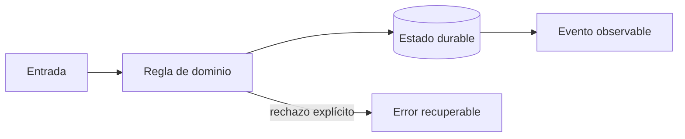
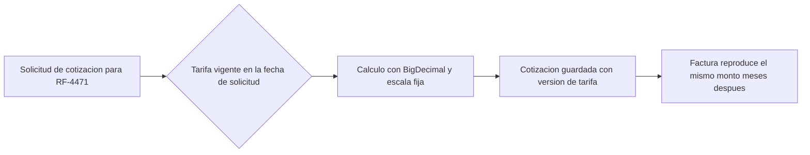
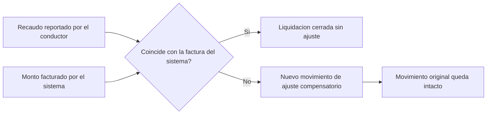
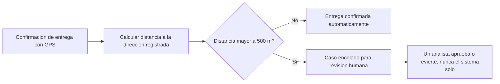

# Módulo 6: Facturación, recaudo, liquidaciones y fraude


## Aprende construyendo

### Tema 1: Cotización y facturación reproducible

**Conceptos clave:** Money, moneda, redondeo, vigencia, impuestos y versiones.

Money combina entero en unidad menor y moneda; nunca float. La cotización guarda tarifa, versión, entradas y desglose. El cambio de tarifa crea nueva vigencia. Impuestos dependen de jurisdicción y fecha, por lo que el motor recibe política explícita. El criterio no es memorizar la herramienta, sino poder predecir qué sucede ante duplicados, datos incompletos, concurrencia, pérdida de red o permisos insuficientes. Documenta supuestos y mide antes de optimizar.

**Analogía:** Es como un tiquete conserva fecha y tarifa aunque el precio cambie mañana.

**¿Por qué es importante?** Porque soporte y auditoría pueden reproducir cada cobro. En RutaFlow la decisión se valida con una prueba automatizada y una observación operativa, no solo con una captura de pantalla.

**Casos de uso reales:** estudia el flujo normal, un reintento, un dato tardío y un acceso sin permiso. Dibuja primero el flujo y marca dónde puede fallar.

**Diagrama:**


```mermaid
flowchart LR
  A[Entrada] --> B[Regla de dominio]
  B --> C[(Estado durable)]
  C --> D[Evento observable]
  B -->|rechazo explícito| E[Error recuperable]
```

#### Paso 1 · Objetivo y preparación

Al finalizar podrás construir y verificar **Tema 1: Cotización y facturación reproducible** dentro de RutaFlow, empezando desde una carpeta vacía y explicando qué decisión técnica resuelve. **Conocimiento previo:** terminal, Git y lectura de JSON.

#### Paso 2 · Contexto y caso real

**¿Por qué es importante?** Una cotización que no se puede reproducir rompe la confianza del cliente y la auditoría. Si el conductor cobra un valor hoy por un envío pero el sistema recalcula otro distinto la próxima semana con la tarifa ya actualizada, nadie puede decir cuál de los dos montos era el correcto. La tarifa debe quedar versionada con su rango exacto de vigencia, y el cálculo debe hacerse en aritmética exacta (`BigDecimal`), nunca en punto flotante: un error de redondeo de una fracción de centavo por envío se multiplica por miles de guías al mes y termina en un descuadre contable real.

**Caso real:** un cliente pide cotización para el envío RF-4471 el 3 de marzo, bajo la tarifa vigente ese día. El 10 de marzo la tarifa cambia. Si la factura se emite el 12 de marzo, debe reflejar la tarifa del 3 de marzo —la fecha de la cotización—, no la nueva. El sistema necesita conservar la vigencia exacta de cada tarifa para poder reconstruir ese cálculo meses después, ante un reclamo o una auditoría.

#### Paso 3 · Teoría, conceptos y analogía

**Conceptos clave:** `BigDecimal`, escala (`scale`) y modo de redondeo, tarifa versionada, rango de vigencia (`vigenteDesde` / `vigenteHasta`), desglose de cotización.

Piensa este tema no como una estación de clasificación genérica, sino como una caja registradora que jamás puede dar un resultado distinto para la misma venta. Cada tarifa tiene una fecha de inicio y una de fin de vigencia; cotizar es elegir la tarifa correcta para la fecha de la operación, no la tarifa de hoy. Si el cálculo usa `double` para sumar dinero, ya perdió la capacidad de ser auditado: el error de redondeo es silencioso y se acumula sin avisar.

**Analogía:** es como un recibo de caja registradora: aunque el precio del producto suba la semana próxima, el recibo de hoy prueba exactamente cuánto se cobró y bajo qué tarifa.


```mermaid
flowchart LR
  A[Solicitud de cotizacion para RF-4471] --> B{Tarifa vigente en la fecha de solicitud}
  B --> C[Calculo con BigDecimal y escala fija]
  C --> D[Cotizacion guardada con version de tarifa]
  D --> E[Factura reproduce el mismo monto meses despues]
```

#### Paso 4 · Demostración guiada desde cero

Crea una carpeta independiente para comprobar el concepto antes de conectarlo al monorepo. Después crea `CotizadorEnvio.java`:

```bash
mkdir -p rutaflow-labs/tema-1-cotizacion-facturacion
cd rutaflow-labs/tema-1-cotizacion-facturacion
```

```java
import java.math.BigDecimal;
import java.math.RoundingMode;
import java.time.LocalDate;
import java.util.List;

public class CotizadorEnvio {

    public record Tarifa(BigDecimal valorPorKg, BigDecimal impuesto, LocalDate vigenteDesde, LocalDate vigenteHasta) {}

    private final List<Tarifa> tarifas;

    public CotizadorEnvio(List<Tarifa> tarifas) {
        this.tarifas = tarifas;
    }

    // Elige la tarifa vigente en la fecha de la SOLICITUD, no la fecha actual.
    public BigDecimal cotizar(BigDecimal pesoKg, LocalDate fechaSolicitud) {
        Tarifa vigente = tarifas.stream()
            .filter(t -> !fechaSolicitud.isBefore(t.vigenteDesde()) && !fechaSolicitud.isAfter(t.vigenteHasta()))
            .findFirst()
            .orElseThrow(() -> new IllegalStateException("No hay tarifa vigente para " + fechaSolicitud));

        BigDecimal subtotal = vigente.valorPorKg().multiply(pesoKg);
        BigDecimal impuesto = subtotal.multiply(vigente.impuesto());
        return subtotal.add(impuesto).setScale(2, RoundingMode.HALF_UP);
    }

    public static void main(String[] args) {
        Tarifa tarifaMarzo = new Tarifa(new BigDecimal("4309.98"), new BigDecimal("0.19"),
            LocalDate.of(2026, 3, 1), LocalDate.of(2026, 3, 9));
        Tarifa tarifaNueva = new Tarifa(new BigDecimal("4450.00"), new BigDecimal("0.19"),
            LocalDate.of(2026, 3, 10), LocalDate.of(2026, 12, 31));

        CotizadorEnvio cotizador = new CotizadorEnvio(List.of(tarifaMarzo, tarifaNueva));

        // La factura del 12 de marzo para el envio RF-4471 debe usar la tarifa
        // vigente el 3 de marzo (fecha de la cotizacion original), no la nueva.
        BigDecimal total = cotizador.cotizar(new BigDecimal("25.0"), LocalDate.of(2026, 3, 3));
        System.out.println("RF-4471 total=" + total);
    }
}
```

Compílalo y ejecútalo:

```bash
javac CotizadorEnvio.java
java CotizadorEnvio
```

**Resultado esperado:** `RF-4471 total=128221.91` (`4309.98 × 25 × 1.19`, redondeado con escala fija a 2 decimales con `HALF_UP`), sin importar cuándo corras el programa ni si la tarifa de marzo ya fue reemplazada por la nueva.

**Fallo deliberado:** repite el mismo cálculo (mismo `valorPorKg`, mismo peso, mismo impuesto) pero con `double` en vez de `BigDecimal`:

```java
// FALLO: usar double en vez de BigDecimal para dinero
double valorPorKgFalloso = 4309.98;
double pesoKgFalloso = 25.0;
double impuestoFalloso = 0.19;
double subtotalFalloso = valorPorKgFalloso * pesoKgFalloso;       // 107749.49999999999, no 107749.50 exacto
double totalFalloso = subtotalFalloso + subtotalFalloso * impuestoFalloso;
System.out.printf("RF-4471 total (double)=%.2f%n", totalFalloso); // imprime 128221.90
```

El valor correcto es `$128.221,91` (eso es lo que calculó `BigDecimal`), pero la representación binaria de `4309.98` y `25.0` no es exacta: el subtotal queda en `107749.49999999999` en vez de `107749.50`, y ese error minúsculo empuja el total final a `128221.90499999998` —justo debajo del punto donde debería redondear hacia `.91`. El programa imprime `128221.90`: un centavo menos, en una sola operación. Individualmente insignificante, pero multiplicado por miles de guías al mes es un sesgo sistemático e imposible de rastrear transacción por transacción. Diagnostica comparando contra el resultado de `BigDecimal` con el mismo input; corrige volviendo a `BigDecimal` con `setScale(2, RoundingMode.HALF_UP)` en cada operación monetaria, nunca `double` ni `float`.

#### Paso 5 · Práctica guiada

1. Agrega una segunda tarifa con una vigencia distinta y verifica que `cotizar` elija la tarifa correcta según la **fecha de la solicitud**, no la tarifa más reciente.
2. Haz que `cotizar` lance una excepción explícita cuando la fecha no cae en ninguna vigencia, en vez de usar silenciosamente la tarifa más cercana.
3. Pista: nunca uses `double` para sumar o multiplicar dinero; si el peso o la tarifa llegan como texto (JSON), conviértelos directo a `BigDecimal`, nunca pasando por `double`.

#### Paso 6 · Práctica independiente

Implementa `CotizadorEnvio` con al menos dos tarifas de vigencias distintas, un método `cotizar(pesoKg, fechaSolicitud)` que seleccione la tarifa por rango de fechas y calcule con `BigDecimal` y escala fija, y una prueba que demuestre que una cotización de hace un mes sigue dando el mismo resultado aunque la tarifa actual ya cambió. No copies la solución del paso anterior; escribe primero el contrato (qué tarifa debería ganar en cada caso) y después el código.

#### Paso 7 · Cierre, evidencia y proyecto

Entrega `CotizadorEnvio.java`, la salida reproducible para RF-4471, la comparación `BigDecimal` contra `double` del fallo deliberado y una breve explicación de por qué el redondeo de punto flotante es inaceptable en dinero. El siguiente tema (**Tema 2: Recaudo, liquidación y conciliación**) toma esta cotización reproducible como el monto que debe conciliarse contra lo efectivamente recaudado en efectivo o por pago electrónico. **Fuente oficial:** [BigDecimal — Java SE documentation](https://docs.oracle.com/en/java/javase/17/docs/api/java.base/java/math/BigDecimal.html).

**Errores comunes:** usar `double` o `float` para cualquier monto; comparar fechas de vigencia con `<`/`>` en vez de `isBefore`/`isAfter` (error de límite en los bordes del rango); olvidar fijar la escala y el modo de redondeo antes de persistir o mostrar el total; recalcular con la tarifa de "hoy" en vez de la tarifa vigente en la fecha de la cotización original.
### Tema 2: Recaudo, liquidación y conciliación

**Conceptos clave:** doble partida, efectivo contra entrega, pagos, settlement, reversos y diferencias.

Cobrar efectivo aumenta caja del conductor y obligación a entregar; liquidar mueve ambas cuentas. Un pago electrónico cruza procesador, banco y ledger interno. Conciliación compara fuentes por referencia, monto, moneda y ventana; las diferencias entran a una cola, no se eliminan. El criterio no es memorizar la herramienta, sino poder predecir qué sucede ante duplicados, datos incompletos, concurrencia, pérdida de red o permisos insuficientes. Documenta supuestos y mide antes de optimizar.

**Analogía:** Es como cerrar caja: el total esperado y el contado se comparan y toda diferencia se investiga.

**¿Por qué es importante?** Porque separa el movimiento real de la representación contable. En RutaFlow la decisión se valida con una prueba automatizada y una observación operativa, no solo con una captura de pantalla.

**Casos de uso reales:** estudia el flujo normal, un reintento, un dato tardío y un acceso sin permiso. Dibuja primero el flujo y marca dónde puede fallar.

**Diagrama:**


```mermaid
flowchart LR
  A[Entrada] --> B[Regla de dominio]
  B --> C[(Estado durable)]
  C --> D[Evento observable]
  B -->|rechazo explícito| E[Error recuperable]
```

#### Paso 1 · Objetivo y preparación

Al finalizar podrás construir y verificar **Tema 2: Recaudo, liquidación y conciliación** dentro de RutaFlow, empezando desde una carpeta vacía y explicando qué decisión técnica resuelve. **Conocimiento previo:** terminal, Git y lectura de JSON.

#### Paso 2 · Contexto y caso real

**¿Por qué es importante?** La conciliación compara dos fuentes independientes de verdad —lo que el conductor reporta haber recaudado en efectivo y lo que el sistema de facturación registra que debía cobrarse— para una misma ventana de liquidación. Cuando las dos cifras no coinciden, la diferencia **nunca** se corrige editando el movimiento original: se inserta un movimiento de ajuste compensatorio que queda registrado junto al original. Editar un recaudo histórico directamente borra la evidencia de que hubo una discrepancia, rompe el rastro de auditoría y puede ocultar un fraude real en vez de detectarlo. Esta es la razón por la que una corrección contable es siempre **otro** movimiento, y nunca una edición del movimiento anterior.

**Caso real:** el conductor Ana reporta haber recaudado $120.000 en efectivo durante su turno del 5 de marzo para el envío RF-4471, pero el sistema registra que las facturas de contraentrega de ese turno suman $135.000. La diferencia de $15.000 debe quedar visible en una cola de discrepancias —nunca restada en silencio del saldo de Ana ni "corregida" sobre el registro original.

#### Paso 3 · Teoría, conceptos y analogía

**Conceptos clave:** doble partida, ventana de liquidación, movimiento compensatorio, saldo neto, reverso, tabla append-only (solo inserciones, nunca `UPDATE`/`DELETE`).

Piensa este tema como un libro contable de doble entrada: cada recaudo reportado y cada factura del sistema son hechos independientes que ya ocurrieron y no pueden reescribirse. Si aparece una diferencia, el libro no borra la página anterior —agrega una página nueva que explica y compensa la diferencia. Esa es la única forma de que, meses después, alguien pueda reconstruir exactamente qué pasó.

**Analogía:** es como cerrar caja en una tienda: si el efectivo contado no coincide con lo que el sistema dice que debía haber, no se tacha el reporte del cajero —se registra un ajuste aparte y se investiga la diferencia.


```mermaid
flowchart LR
  A[Recaudo reportado por el conductor] --> C{Coincide con la factura del sistema?}
  B[Monto facturado por el sistema] --> C
  C -->|Si| D[Liquidacion cerrada sin ajuste]
  C -->|No| E[Nuevo movimiento de ajuste compensatorio]
  E --> F[Movimiento original queda intacto]
```

#### Paso 4 · Demostración guiada desde cero

Crea una carpeta independiente para comprobar el concepto antes de conectarlo al monorepo:

```bash
mkdir -p rutaflow-labs/tema-2-recaudo-liquidacion-conciliacion
cd rutaflow-labs/tema-2-recaudo-liquidacion-conciliacion
```

Primero el esquema PostgreSQL: una tabla de movimientos **append-only**, donde un ajuste siempre referencia al movimiento que corrige:

```sql
CREATE TABLE recaudo_movimiento (
    id BIGSERIAL PRIMARY KEY,
    envio_id TEXT NOT NULL,
    tipo TEXT NOT NULL CHECK (tipo IN ('recaudo', 'ajuste_compensatorio')),
    monto NUMERIC(12,2) NOT NULL,
    referencia_movimiento_id BIGINT REFERENCES recaudo_movimiento(id),
    creado_en TIMESTAMPTZ NOT NULL DEFAULT now()
);

-- Turno de Ana para RF-4471: reporta 120.000, el sistema facturo 135.000.
INSERT INTO recaudo_movimiento (envio_id, tipo, monto) VALUES ('RF-4471', 'recaudo', 120000.00);
```

Y la lógica de conciliación en Java, que detecta la discrepancia y registra el ajuste **sin tocar el movimiento original**:

```java
import java.math.BigDecimal;
import java.util.Optional;

public class ConciliadorRecaudo {

    public record Recaudo(String envioId, long movimientoOriginalId, BigDecimal montoReportado, BigDecimal montoFacturado) {}

    public Optional<BigDecimal> detectarDiscrepancia(Recaudo recaudo) {
        BigDecimal diferencia = recaudo.montoFacturado().subtract(recaudo.montoReportado());
        return diferencia.compareTo(BigDecimal.ZERO) != 0 ? Optional.of(diferencia) : Optional.empty();
    }

    // Nunca editamos recaudo_movimiento: insertamos un ajuste que referencia al original.
    public String construirAjusteCompensatorio(Recaudo recaudo, BigDecimal diferencia) {
        return "INSERT INTO recaudo_movimiento (envio_id, tipo, monto, referencia_movimiento_id) "
            + "VALUES ('" + recaudo.envioId() + "', 'ajuste_compensatorio', " + diferencia
            + ", " + recaudo.movimientoOriginalId() + ");";
    }

    public static void main(String[] args) {
        ConciliadorRecaudo conciliador = new ConciliadorRecaudo();
        Recaudo turnoAna = new Recaudo("RF-4471", 501L, new BigDecimal("120000.00"), new BigDecimal("135000.00"));
        conciliador.detectarDiscrepancia(turnoAna)
            .ifPresent(diferencia -> System.out.println(conciliador.construirAjusteCompensatorio(turnoAna, diferencia)));
    }
}
```

**Resultado esperado:** el programa imprime `INSERT INTO recaudo_movimiento (envio_id, tipo, monto, referencia_movimiento_id) VALUES ('RF-4471', 'ajuste_compensatorio', 15000.00, 501);` — una fila **nueva** que referencia a la fila original (id 501, el recaudo de $120.000), que sigue existiendo sin cambios.

**Fallo deliberado:** en vez de insertar el ajuste, "corrige" el movimiento original directamente:

```sql
UPDATE recaudo_movimiento
SET monto = 135000.00
WHERE envio_id = 'RF-4471' AND tipo = 'recaudo';
```

Ejecuta `SELECT * FROM recaudo_movimiento WHERE envio_id = 'RF-4471'` después de esto: la fila ahora dice que Ana reportó $135.000 desde el principio —la discrepancia de $15.000 desapareció del historial por completo, como si nunca hubiera existido. Cualquier auditoría posterior que sume `recaudo` por conductor verá los totales cuadrados y nunca sabrá que hubo que investigar una diferencia, que es exactamente el comportamiento que permitiría ocultar un fraude real. Diagnostica comparando contra un respaldo o un log de la aplicación (la tabla misma ya no tiene la evidencia); corrige revirtiendo el `UPDATE` e insertando en su lugar el `ajuste_compensatorio` de $15.000 referenciando la fila original, que nunca debió modificarse.

#### Paso 5 · Práctica guiada

1. Agrega una ventana de liquidación (`periodo_inicio`, `periodo_fin`) y agrupa los movimientos por conductor y ventana antes de comparar `recaudo` contra facturación.
2. Si el conductor reportó **más** de lo que el sistema facturó (sobrante, no faltante), registra el ajuste con signo contrario para que el saldo neto de la ventana quede en cero.
3. Pista: ninguna consulta de cierre de turno debe usar `UPDATE` ni `DELETE` sobre `recaudo_movimiento`; toda corrección es un `INSERT` nuevo con `referencia_movimiento_id`.

#### Paso 6 · Práctica independiente

Implementa `ConciliadorRecaudo` completo: agrupa movimientos por `envio_id` y ventana de liquidación, detecta discrepancias con `BigDecimal` (nunca `double`) y genera el `INSERT` de ajuste compensatorio sin mutar ninguna fila existente. Escribe una prueba que, tras aplicar el ajuste, verifique que la fila original de $120.000 sigue intacta y que la suma de `recaudo` + `ajuste_compensatorio` para RF-4471 ahora coincide con los $135.000 facturados. No copies la solución del paso anterior; escribe primero el contrato (qué fila no debe cambiar nunca) y después el código.

#### Paso 7 · Cierre, evidencia y proyecto

Entrega el esquema SQL, `ConciliadorRecaudo.java`, la secuencia del fallo deliberado (el `UPDATE` que borra la evidencia) y la corrección con el `INSERT` compensatorio. El siguiente tema (**Tema 3: Fraude responsable**) usa esta misma cola de discrepancias como una de las señales que alimentan la puntuación de revisión: una diferencia de recaudo repetida en el mismo conductor es justamente el tipo de patrón que el modelo de fraude debe marcar para revisión humana, nunca para bloqueo automático. **Fuente oficial:** [PostgreSQL — Numeric Types](https://www.postgresql.org/docs/current/datatype-numeric.html).

**Errores comunes:** usar `UPDATE`/`DELETE` sobre un movimiento histórico para "corregir" una diferencia; comparar montos con `double` en vez de `NUMERIC`/`BigDecimal`; omitir `referencia_movimiento_id` y perder la trazabilidad entre el ajuste y el movimiento que corrige; conciliar sin fijar una ventana de liquidación clara, mezclando turnos distintos.
### Tema 3: Fraude responsable

**Conceptos clave:** señales, reglas, modelos, explicabilidad, revisión, sesgo y privacidad.

Velocidad imposible, evidencia repetida o concentración de reversos son señales, no culpabilidad. Una puntuación prioriza revisión y registra factores. Bloquear automáticamente por un GPS impreciso puede perjudicar zonas rurales. Se miden falsos positivos por segmento y existe apelación. El criterio no es memorizar la herramienta, sino poder predecir qué sucede ante duplicados, datos incompletos, concurrencia, pérdida de red o permisos insuficientes. Documenta supuestos y mide antes de optimizar.

**Analogía:** Es como una alarma de humo solicita inspección; no condena el edificio.

**¿Por qué es importante?** Porque reduce pérdidas sin convertir correlaciones defectuosas en decisiones irreversibles. En RutaFlow la decisión se valida con una prueba automatizada y una observación operativa, no solo con una captura de pantalla.

**Casos de uso reales:** estudia el flujo normal, un reintento, un dato tardío y un acceso sin permiso. Dibuja primero el flujo y marca dónde puede fallar.

**Diagrama:**


```mermaid
flowchart LR
  A[Entrada] --> B[Regla de dominio]
  B --> C[(Estado durable)]
  C --> D[Evento observable]
  B -->|rechazo explícito| E[Error recuperable]
```

#### Paso 1 · Objetivo y preparación

Al finalizar podrás construir y verificar **Tema 3: Fraude responsable** dentro de RutaFlow, empezando desde una carpeta vacía y explicando qué decisión técnica resuelve. **Conocimiento previo:** terminal, Git y lectura de JSON.

#### Paso 2 · Contexto y caso real

**¿Por qué es importante?** Una señal automatizada —por ejemplo, que la confirmación GPS de una entrega esté a más de 500 metros de la dirección registrada— puede indicar fraude, pero también puede ser GPS impreciso en una zona urbana densa, o un cliente que simplemente bajó a la calle principal a recibir el paquete porque el edificio no tiene acceso vehicular. Si el sistema bloquea o cancela automáticamente la entrega solo con esa señal, un falso positivo le niega el pago a un conductor honesto y genera una disputa evitable. Por eso la señal debe **encolar el caso para revisión humana**, nunca decidir el resultado final por sí sola.

**Caso real:** el conductor Carlos confirma la entrega del envío RF-7788 a unos 556 metros de la dirección registrada, porque el edificio no tiene acceso vehicular y el cliente bajó a la avenida principal a recibirlo. Una regla que bloquea automáticamente por distancia marcaría esta entrega legítima como fraude y le retendría el pago a Carlos por un patrón perfectamente normal en esa zona.

#### Paso 3 · Teoría, conceptos y analogía

**Conceptos clave:** señal, puntuación (`score`), umbral, cola de revisión, falso positivo, explicabilidad.

Piensa este tema como una alarma de humo, no como un veredicto: la alarma solicita inspección, no condena el edificio. Una señal de fraude (distancia GPS, velocidad imposible, reversos repetidos) prioriza un caso en una cola para que una persona lo revise con contexto completo; nunca cambia por sí misma el estado final de la entrega. Si un sistema automatizado tiene el poder de bloquear sin revisión humana, cualquier señal ruidosa —y el GPS siempre es ruidoso— se convierte en una decisión irreversible contra alguien inocente.

**Analogía:** es como una alarma de humo: solicita inspección, no condena el edificio.


```mermaid
flowchart LR
  A[Confirmacion de entrega con GPS] --> B[Calcular distancia a la direccion registrada]
  B --> C{Distancia mayor a 500 m?}
  C -->|No| D[Entrega confirmada automaticamente]
  C -->|Si| E[Caso encolado para revision humana]
  E --> F[Un analista aprueba o revierte, nunca el sistema solo]
```

#### Paso 4 · Demostración guiada desde cero

Crea una carpeta independiente para comprobar el concepto antes de conectarlo al monorepo. Después crea `DetectorSenalFraude.java`:

```bash
mkdir -p rutaflow-labs/tema-3-fraude-responsable
cd rutaflow-labs/tema-3-fraude-responsable
```

```java
import java.util.Optional;

public class DetectorSenalFraude {

    private static final double UMBRAL_METROS = 500.0;

    public record Coordenada(double lat, double lon) {}

    public double distanciaMetros(Coordenada a, Coordenada b) {
        double dLat = Math.toRadians(b.lat() - a.lat());
        double dLon = Math.toRadians(b.lon() - a.lon());
        double radioTierraMetros = 6371000;
        double parcial = Math.pow(Math.sin(dLat / 2), 2)
            + Math.cos(Math.toRadians(a.lat())) * Math.cos(Math.toRadians(b.lat()))
            * Math.pow(Math.sin(dLon / 2), 2);
        double angulo = 2 * Math.atan2(Math.sqrt(parcial), Math.sqrt(1 - parcial));
        return radioTierraMetros * angulo;
    }

    // La senal SOLO encola para revision humana; nunca decide el estado final.
    public Optional<String> evaluarEnvio(String envioId, Coordenada confirmacionGps, Coordenada direccionRegistrada) {
        double distancia = distanciaMetros(confirmacionGps, direccionRegistrada);
        if (distancia > UMBRAL_METROS) {
            return Optional.of("Envio " + envioId + " encolado para revision humana: GPS a "
                + Math.round(distancia) + " m de la direccion registrada");
        }
        return Optional.empty();
    }

    public static void main(String[] args) {
        DetectorSenalFraude detector = new DetectorSenalFraude();
        // Caso de Carlos: entrega legitima, edificio sin acceso vehicular.
        Coordenada direccionRegistrada = new Coordenada(4.6730, -74.0480);
        Coordenada confirmacionGps = new Coordenada(4.6780, -74.0480);
        System.out.println(detector.evaluarEnvio("RF-7788", confirmacionGps, direccionRegistrada)
            .orElse("Sin senal: distancia dentro del umbral"));
    }
}
```

**Resultado esperado:** el programa imprime `Envio RF-7788 encolado para revision humana: GPS a 556 m de la direccion registrada` — el caso queda marcado para que un analista lo revise con contexto (zona, hora, historial del conductor), pero la entrega **no** se bloquea ni se cancela automáticamente.

**Fallo deliberado:** reemplaza `evaluarEnvio` por una versión que decide sola, sin cola de revisión:

```java
public EstadoEnvio evaluarEnvioAutoBloqueo(String envioId, Coordenada confirmacionGps, Coordenada direccionRegistrada) {
    double distancia = distanciaMetros(confirmacionGps, direccionRegistrada);
    if (distancia > UMBRAL_METROS) {
        return EstadoEnvio.RECHAZADO_POR_FRAUDE; // cancela la entrega sin revision humana
    }
    return EstadoEnvio.CONFIRMADO;
}
```

Corre este método con el mismo caso de Carlos (RF-7788, 556 m): devuelve `RECHAZADO_POR_FRAUDE` de forma automática. La entrega de Carlos era legítima —el edificio simplemente no tiene acceso vehicular— pero el sistema ya tomó la decisión final sin que nadie la revisara: a Carlos se le retiene el pago y al cliente se le cancela una entrega que sí ocurrió, solo porque una sola señal de distancia superó el umbral. Diagnostica identificando que el error no está en el cálculo de distancia (es correcto) sino en que una señal automatizada obtuvo poder de decisión final; corrige volviendo a la versión que solo devuelve `Optional<String>` para encolar el caso, nunca un `EstadoEnvio` terminal.

#### Paso 5 · Práctica guiada

1. Agrega un segundo umbral (por ejemplo, 1000 m) que marque el caso con prioridad alta en la cola, sin que eso cambie que la decisión final la tome siempre un humano.
2. Registra en el caso encolado la distancia exacta y la hora de la confirmación, para que el analista tenga contexto real y no solo un booleano de "sospechoso/no sospechoso".
3. Pista: ninguna señal automatizada —ni esta ni ninguna futura que agregues— debe poder cambiar `EstadoEnvio` a un estado terminal (`CONFIRMADO`/`RECHAZADO_POR_FRAUDE`) sin pasar por revisión humana.

#### Paso 6 · Práctica independiente

Implementa `DetectorSenalFraude` completo con al menos dos señales (distancia GPS y, por ejemplo, reversos repetidos del mismo conductor en 24 horas), que combine ambas en una prioridad de cola sin que ninguna, ni juntas, bloqueen la entrega automáticamente. Escribe un caso de prueba con el escenario de Carlos (falso positivo por GPS) y verifica que el resultado sea "encolado para revisión", nunca un estado terminal. No copies la solución del paso anterior; escribe primero el contrato (qué puede decidir el sistema y qué debe decidir siempre una persona) y después el código.

#### Paso 7 · Cierre, evidencia y proyecto

Entrega `DetectorSenalFraude.java`, el caso encolado real para RF-7788, la versión de auto-bloqueo del fallo deliberado y una breve explicación de por qué ninguna señal automatizada debe decidir sola. El siguiente módulo (**Módulo 7: Producción — Tema 1: Infraestructura y entrega segura**) retoma esta misma disciplina: ninguna automatización del pipeline o de la operación debe tener poder de decisión final sin evidencia y, cuando aplica, sin revisión humana. **Fuente oficial:** [GDPR — Artículo 22: decisiones individuales automatizadas](https://gdpr-info.eu/art-22-gdpr/).

**Errores comunes:** dejar que una señal automatizada escriba un `EstadoEnvio` terminal; usar un solo umbral sin registrar la distancia real para el analista; tratar la señal como culpabilidad en vez de como prioridad de revisión; no versionar el umbral, perdiendo la capacidad de explicar por qué un caso viejo se marcó y uno nuevo no.
