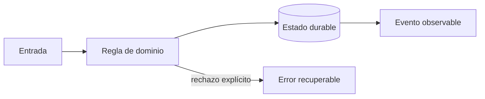

# Módulo 7: Producción: cloud, DevOps, seguridad y operación

## Aprende construyendo

### Tema 1: Infraestructura y entrega segura

**Conceptos clave:** Terraform, Kubernetes, CI/CD, artefactos, secretos, SBOM y firma.

Terraform crea redes, datos e identidades con estado protegido; Kubernetes ejecuta workloads con requests, limits y probes. La pipeline prueba, escanea, genera SBOM, firma una imagen inmutable y promueve el mismo digest. Floci visualiza pipelines; StackPort puede ofrecer el entorno reproducible de práctica. El criterio no es memorizar la herramienta, sino poder predecir qué sucede ante duplicados, datos incompletos, concurrencia, pérdida de red o permisos insuficientes. Documenta supuestos y mide antes de optimizar.

**Analogía:** Es como una cadena de custodia: cada relevo conserva identidad y evidencia.

**¿Por qué es importante?** Porque reduce configuraciones manuales y permite saber exactamente qué se desplegó. En RutaFlow la decisión se valida con una prueba automatizada y una observación operativa, no solo con una captura de pantalla.

**Casos de uso reales:** estudia el flujo normal, un reintento, un dato tardío y un acceso sin permiso. Dibuja primero el flujo y marca dónde puede fallar.

**Diagrama:**

### Tema 2: SLO y respuesta a incidentes

**Conceptos clave:** SLI, presupuesto de error, alertas por burn rate, trazas, runbooks y postmortem.

Disponibilidad útil mide confirmaciones válidas, no procesos vivos. Un SLO fija objetivo y ventana; el presupuesto equilibra velocidad y confiabilidad. Alertas actúan sobre síntomas y burn rate. El runbook orienta diagnóstico; el postmortem sin culpa identifica condiciones y acciones con responsable. El criterio no es memorizar la herramienta, sino poder predecir qué sucede ante duplicados, datos incompletos, concurrencia, pérdida de red o permisos insuficientes. Documenta supuestos y mide antes de optimizar.

**Analogía:** Es como un tablero de salud mide funciones vitales, no cuántas luces están encendidas.

**¿Por qué es importante?** Porque conecta decisiones técnicas con impacto en entregas. En RutaFlow la decisión se valida con una prueba automatizada y una observación operativa, no solo con una captura de pantalla.

**Casos de uso reales:** estudia el flujo normal, un reintento, un dato tardío y un acceso sin permiso. Dibuja primero el flujo y marca dónde puede fallar.

**Diagrama:**

### Tema 3: Continuidad, costes y proyecto final

**Conceptos clave:** backup, restore, RPO, RTO, game day, DR y coste por entrega.

Un backup no está probado hasta restaurarlo y verificar integridad. RPO limita pérdida tolerable; RTO, tiempo de recuperación. Un game day simula caída de base, cola saturada y proveedor de mapas lento. FinOps atribuye coste por servicio y entrega sin sacrificar seguridad. El criterio no es memorizar la herramienta, sino poder predecir qué sucede ante duplicados, datos incompletos, concurrencia, pérdida de red o permisos insuficientes. Documenta supuestos y mide antes de optimizar.

**Analogía:** Es como un simulacro de evacuación revela puertas bloqueadas antes del incendio.

**¿Por qué es importante?** Porque convierte documentación optimista en capacidad operacional demostrada. En RutaFlow la decisión se valida con una prueba automatizada y una observación operativa, no solo con una captura de pantalla.

**Casos de uso reales:** estudia el flujo normal, un reintento, un dato tardío y un acceso sin permiso. Dibuja primero el flujo y marca dónde puede fallar.

**Diagrama:**

