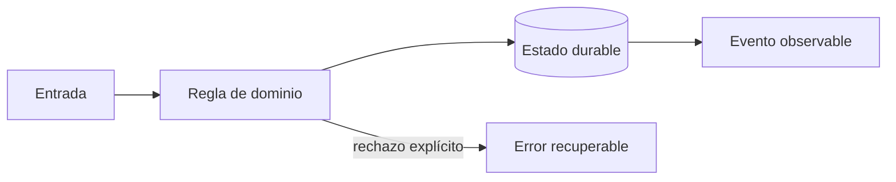

# Módulo 7: Producción: cloud, DevOps, seguridad y operación

## Sílabo

**Objetivo general:** Operar RutaFlow con despliegues verificables, objetivos de servicio y recuperación probada.

Al terminar, podrás explicar las decisiones con vocabulario técnico sencillo, implementar una vertical funcional, provocar al menos un fallo y demostrar su recuperación. El producto de estudio es ficticio: evita copiar marcas, identidades o datos de una empresa real.

**Evaluación:** 20 % modelo y explicación, 40 % laboratorio ejecutable, 25 % pruebas y manejo de fallos, 15 % documentación y demostración.

## Aprende construyendo

### Tema 1: Infraestructura y entrega segura

**Conceptos clave:** Terraform, Kubernetes, CI/CD, artefactos, secretos, SBOM y firma.

Terraform crea redes, datos e identidades con estado protegido; Kubernetes ejecuta workloads con requests, limits y probes. La pipeline prueba, escanea, genera SBOM, firma una imagen inmutable y promueve el mismo digest. Floci visualiza pipelines; StackPort puede ofrecer el entorno reproducible de práctica. El criterio no es memorizar la herramienta, sino poder predecir qué sucede ante duplicados, datos incompletos, concurrencia, pérdida de red o permisos insuficientes. Documenta supuestos y mide antes de optimizar.

**Analogía:** Es como una cadena de custodia: cada relevo conserva identidad y evidencia.

**¿Por qué es importante?** Porque reduce configuraciones manuales y permite saber exactamente qué se desplegó. En RutaFlow la decisión se valida con una prueba automatizada y una observación operativa, no solo con una captura de pantalla.

**Casos de uso reales:** estudia el flujo normal, un reintento, un dato tardío y un acceso sin permiso. Dibuja primero el flujo y marca dónde puede fallar.

**Diagrama:**

### Tema 2: SLO y respuesta a incidentes

**Conceptos clave:** SLI, presupuesto de error, alertas por burn rate, trazas, runbooks y postmortem.

Disponibilidad útil mide confirmaciones válidas, no procesos vivos. Un SLO fija objetivo y ventana; el presupuesto equilibra velocidad y confiabilidad. Alertas actúan sobre síntomas y burn rate. El runbook orienta diagnóstico; el postmortem sin culpa identifica condiciones y acciones con responsable. El criterio no es memorizar la herramienta, sino poder predecir qué sucede ante duplicados, datos incompletos, concurrencia, pérdida de red o permisos insuficientes. Documenta supuestos y mide antes de optimizar.

**Analogía:** Es como un tablero de salud mide funciones vitales, no cuántas luces están encendidas.

**¿Por qué es importante?** Porque conecta decisiones técnicas con impacto en entregas. En RutaFlow la decisión se valida con una prueba automatizada y una observación operativa, no solo con una captura de pantalla.

**Casos de uso reales:** estudia el flujo normal, un reintento, un dato tardío y un acceso sin permiso. Dibuja primero el flujo y marca dónde puede fallar.

**Diagrama:**

### Tema 3: Continuidad, costes y proyecto final

**Conceptos clave:** backup, restore, RPO, RTO, game day, DR y coste por entrega.

Un backup no está probado hasta restaurarlo y verificar integridad. RPO limita pérdida tolerable; RTO, tiempo de recuperación. Un game day simula caída de base, cola saturada y proveedor de mapas lento. FinOps atribuye coste por servicio y entrega sin sacrificar seguridad. El criterio no es memorizar la herramienta, sino poder predecir qué sucede ante duplicados, datos incompletos, concurrencia, pérdida de red o permisos insuficientes. Documenta supuestos y mide antes de optimizar.

**Analogía:** Es como un simulacro de evacuación revela puertas bloqueadas antes del incendio.

**¿Por qué es importante?** Porque convierte documentación optimista en capacidad operacional demostrada. En RutaFlow la decisión se valida con una prueba automatizada y una observación operativa, no solo con una captura de pantalla.

**Casos de uso reales:** estudia el flujo normal, un reintento, un dato tardío y un acceso sin permiso. Dibuja primero el flujo y marca dónde puede fallar.

**Diagrama:**

## Criterio transversal de calidad del código

Usa nombres del dominio (`confirmDelivery`, no `processData`), funciones pequeñas con una responsabilidad observable y errores tipados que conserven causa y contexto sin revelar secretos. Primero escribe una prueba del comportamiento o del fallo que quieres controlar; luego implementa la solución más simple. Aplica SOLID cuando existe presión real de cambio: separa políticas de infraestructura, invierte dependencias en límites externos y evita interfaces enormes. No abstraer antes de encontrar repetición con el mismo significado. Revisa corrección, claridad, cohesión, seguridad, complejidad y capacidad de operación; Clean Code no justifica ocultar costes ni crear capas ceremoniales.

## Rúbrica del proyecto

| Criterio | Inicial | Competente | Profesional |
|---|---|---|---|
| Fundamento | Repite términos | Explica la decisión | Compara alternativas y límites |
| Funcionamiento | Solo camino feliz | Maneja fallos previstos | Demuestra recuperación e idempotencia |
| Código | Acoplado y ambiguo | Claro y probado | Límites cohesionados y deuda explícita |
| Datos y seguridad | Usa datos reales | Minimiza y autoriza | Audita, retiene y modela amenazas |
| Operación | Requiere pasos ocultos | README reproducible | Métricas, runbook y evidencia |

## Bibliografía y fundamento académico

- Documentación oficial de las tecnologías enlazadas desde el panel **Actualizaciones oficiales** de la Academia; verifica versión y fecha antes de aplicar una API.
- Eric Evans, *Domain-Driven Design*, para lenguaje ubicuo, agregados e invariantes.
- Martin Kleppmann, *Designing Data-Intensive Applications*, para datos, replicación, streams y fallos.
- NIST Secure Software Development Framework y OWASP ASVS/MASVS, para ciclo de desarrollo y controles verificables.
- Google SRE Book y SRE Workbook, para SLI, SLO, presupuesto de error e incidentes.
- W3C WCAG, RFC de HTTP y OpenTelemetry Specification cuando la decisión afecte accesibilidad, contratos u observabilidad.

Las fuentes son punto de partida, no autoridad incuestionable: registra versión, distingue norma de recomendación y valida cada afirmación con un experimento reproducible.

## Resumen del módulo

Este capítulo conecta fundamento, implementación y operación. Debes poder contar qué problema resolviste, qué invariante protegiste, cómo comprobaste el comportamiento y qué límite conserva la solución. La evidencia final incluye código, pruebas, diagrama, ADR y demostración; completar una lista de temas sin poder explicar los fallos no representa dominio profesional.
