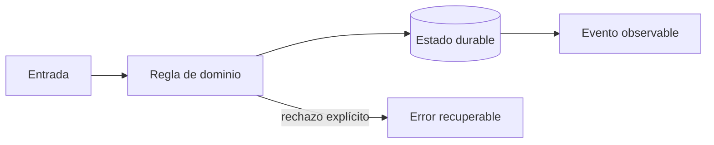
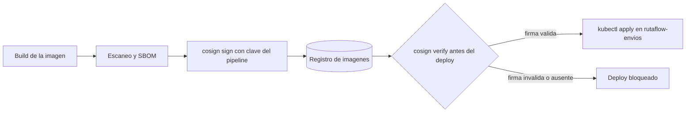
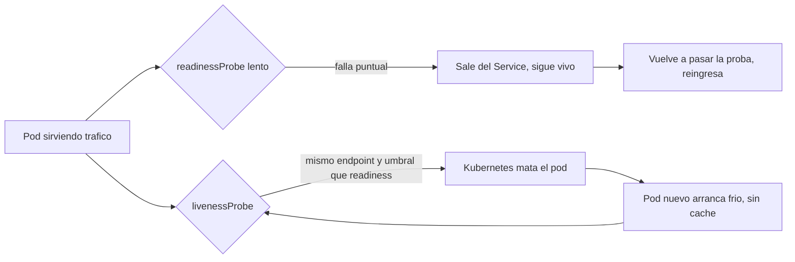
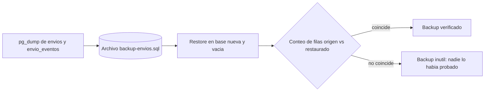

# Módulo 7: Producción: cloud, DevOps, seguridad y operación


## Aprende construyendo

### Tema 1: Infraestructura y entrega segura

**Conceptos clave:** Terraform, Kubernetes, CI/CD, artefactos, secretos, SBOM y firma.

Terraform crea redes, datos e identidades con estado protegido; Kubernetes ejecuta workloads con requests, limits y probes. La pipeline prueba, escanea, genera SBOM, firma una imagen inmutable y promueve el mismo digest. Floci visualiza pipelines; StackPort puede ofrecer el entorno reproducible de práctica. El criterio no es memorizar la herramienta, sino poder predecir qué sucede ante duplicados, datos incompletos, concurrencia, pérdida de red o permisos insuficientes. Documenta supuestos y mide antes de optimizar.

**Analogía:** Es como una cadena de custodia: cada relevo conserva identidad y evidencia.

**¿Por qué es importante?** Porque reduce configuraciones manuales y permite saber exactamente qué se desplegó. En RutaFlow la decisión se valida con una prueba automatizada y una observación operativa, no solo con una captura de pantalla.

**Casos de uso reales:** estudia el flujo normal, un reintento, un dato tardío y un acceso sin permiso. Dibuja primero el flujo y marca dónde puede fallar.

**Diagrama:**


```mermaid
flowchart LR
  A[Entrada] --> B[Regla de dominio]
  B --> C[(Estado durable)]
  C --> D[Evento observable]
  B -->|rechazo explícito| E[Error recuperable]
```

#### Paso 1 · Objetivo y preparación

Al finalizar podrás construir y verificar **Tema 1: Infraestructura y entrega segura** dentro de RutaFlow, provisionando un namespace de Kubernetes con Terraform y bloqueando el despliegue de imágenes sin firma verificada. **Conocimiento previo:** terminal, Git, nociones básicas de Terraform/HCL y de `kubectl`.

#### Paso 2 · Contexto y caso real

**¿Por qué es importante?** En RutaFlow, el servicio `api-envios` se despliega varias veces por semana: si cualquiera puede empujar una imagen a `registry.rutaflow.dev/api-envios` y el pipeline la despliega sin más preguntas, un registro comprometido (o un error humano con la imagen equivocada) termina sirviendo tráfico de producción sin que nadie lo note hasta que falla en caliente. Firmar la imagen con cosign y exigir `cosign verify` antes de desplegar no certifica que el código sea correcto ni que esté libre de vulnerabilidades: certifica que la imagen que llega a Kubernetes es exactamente la que el pipeline construyó y firmó, bit a bit, y que nadie la sustituyó en el camino.

**Caso real:** un registro de contenedores mal asegurado permite retaguear una imagen (`docker tag otra-imagen:latest registry.rutaflow.dev/api-envios:1.4.2` y `docker push`) sin tocar el repositorio de código. Si el `kubectl set image` del deploy no verifica la firma, Kubernetes despliega esa imagen igual que si fuera legítima.

#### Paso 3 · Teoría, conceptos y analogía

**Conceptos clave:** imagen inmutable, SBOM, firma criptográfica (cosign/sigstore), verificación como gate de despliegue, cadena de custodia. Pensá la firma como un sello de notario sobre una caja cerrada: el notario no revisa qué hay adentro ni si funciona, solo certifica que esta caja específica —identificada por su hash— salió de donde dice haber salido y no se abrió en el camino. `cosign verify` es el guardia que revisa ese sello antes de dejar pasar la caja a producción; sin ese guardia, el sello existe pero no protege nada.

**Analogía:** es como un precinto de seguridad en un camión de carga: el precinto no garantiza que la mercancía sea de buena calidad, solo que nadie abrió el camión entre el origen y el destino. Un precinto que nadie revisa en la puerta de destino es exactamente igual de útil que no tener precinto.


```mermaid
flowchart LR
  A[Build de la imagen] --> B[Escaneo y SBOM]
  B --> C[cosign sign con clave del pipeline]
  C --> D[(Registro de imagenes)]
  D --> E{cosign verify antes del deploy}
  E -->|firma valida| F[kubectl apply en rutaflow-envios]
  E -->|firma invalida o ausente| G[Deploy bloqueado]
```

#### Paso 4 · Demostración guiada desde cero

Crea una carpeta independiente para practicar Terraform y la firma de imágenes antes de tocar el monorepo:

```bash
mkdir -p rutaflow-labs/tema-1-infraestructura-y-entrega-segura
cd rutaflow-labs/tema-1-infraestructura-y-entrega-segura
```

`main.tf` — un namespace y un deployment mínimos para `api-envios`:

```hcl
# main.tf — infraestructura mínima de api-envios en Kubernetes
resource "kubernetes_namespace" "rutaflow" {
  metadata {
    name = "rutaflow-envios"
  }
}

resource "kubernetes_deployment" "api_envios" {
  metadata {
    name      = "api-envios"
    namespace = kubernetes_namespace.rutaflow.metadata[0].name
  }

  spec {
    replicas = 2

    selector {
      match_labels = { app = "api-envios" }
    }

    template {
      metadata {
        labels = { app = "api-envios" }
      }
      spec {
        container {
          name  = "api-envios"
          image = "registry.rutaflow.dev/api-envios:1.4.2"
        }
      }
    }
  }
}
```

```bash
terraform init
terraform plan -out=plan.tfplan
```

`deploy.sh` — la versión CON el bug: construye, firma y despliega, pero nunca verifica la firma antes de desplegar:

```bash
#!/usr/bin/env bash
set -euo pipefail
IMAGE="registry.rutaflow.dev/api-envios:1.4.2"

cosign sign --key cosign.key "$IMAGE"            # firma la imagen legítima
kubectl set image deployment/api-envios \
  api-envios="$IMAGE" -n rutaflow-envios          # BUG: despliega sin verificar nada
echo "Desplegado $IMAGE"
```

**Resultado esperado:** `terraform plan` muestra el namespace y el deployment a crear; `cosign sign` genera la firma en el registro.

**Fallo deliberado:** alguien retaguea una imagen distinta (sin firmar, o firmada con otra clave) sobre el mismo tag `registry.rutaflow.dev/api-envios:1.4.2` y vuelve a correr `deploy.sh`. El script completa sin ningún error e imprime `Desplegado registry.rutaflow.dev/api-envios:1.4.2`, porque nada en el script comprueba la firma: la imagen correcta y una imagen manipulada se despliegan exactamente igual. La firma generada antes existe, pero no protege nada si nadie la revisa en el camino. Corrección: agregá el gate de verificación antes de `kubectl set image`:

```bash
cosign verify --key cosign.pub "$IMAGE" \
  || { echo "Firma inválida: aborto el despliegue de $IMAGE"; exit 1; }
kubectl set image deployment/api-envios api-envios="$IMAGE" -n rutaflow-envios
```

Con el gate agregado, repetir el despliegue de la imagen retagueada falla con «Firma inválida: aborto el despliegue» antes de tocar Kubernetes; el despliegue de la imagen legítima y correctamente firmada sigue pasando.

#### Paso 5 · Práctica guiada

1. Agregá `resource_requests`/`limits` de CPU y memoria al contenedor en `main.tf` y corré `terraform plan` para confirmar que Terraform los incorpora sin recrear el deployment.
2. Extendé `deploy.sh` para que, si `cosign verify` falla, deje un registro (`echo` a un archivo `deploy.log`) con la imagen rechazada y la fecha, en vez de solo abortar en silencio.
3. Pista: nunca hagas `cosign verify` después de `kubectl set image` — el gate solo sirve si bloquea el despliegue antes de que Kubernetes reciba la imagen.

#### Paso 6 · Práctica independiente

Escribí un script `desplegar_verificado.sh` que reciba una imagen como argumento, la verifique con `cosign verify` contra la clave pública del equipo, y solo si la verificación pasa ejecute `kubectl set image`. Si la verificación falla, el script debe terminar con código de salida distinto de cero y sin tocar el deployment. No reuses el `deploy.sh` con bug del paso anterior como base; escribí primero el contrato (qué entra, qué puede fallar, qué sale) y después el script.

#### Paso 7 · Cierre, evidencia y proyecto

Entregá `main.tf`, el `plan.tfplan`, `deploy.sh` con el gate de verificación agregado, y la evidencia de ambas corridas: la que bloquea la imagen retagueada y la que despliega la imagen legítima. El siguiente tema de este módulo toma esta misma infraestructura en producción y le agrega SLO y probes de Kubernetes para decidir cuándo un pod está realmente caído. **Fuente oficial:** [https://docs.sigstore.dev/](https://docs.sigstore.dev/) (documentación de cosign/sigstore sobre firma y verificación de imágenes).

**Errores comunes:** firmar la imagen y nunca verificarla antes del deploy; verificar la firma después de que Kubernetes ya la desplegó; guardar la clave privada de firma en el mismo repositorio que el código; asumir que una imagen firmada está libre de vulnerabilidades; reusar el mismo tag (`:1.4.2`) para builds distintos en vez de desplegar por digest.
### Tema 2: SLO y respuesta a incidentes

**Conceptos clave:** SLI, presupuesto de error, alertas por burn rate, trazas, runbooks y postmortem.

Disponibilidad útil mide confirmaciones válidas, no procesos vivos. Un SLO fija objetivo y ventana; el presupuesto equilibra velocidad y confiabilidad. Alertas actúan sobre síntomas y burn rate. El runbook orienta diagnóstico; el postmortem sin culpa identifica condiciones y acciones con responsable. El criterio no es memorizar la herramienta, sino poder predecir qué sucede ante duplicados, datos incompletos, concurrencia, pérdida de red o permisos insuficientes. Documenta supuestos y mide antes de optimizar.

**Analogía:** Es como un tablero de salud mide funciones vitales, no cuántas luces están encendidas.

**¿Por qué es importante?** Porque conecta decisiones técnicas con impacto en entregas. En RutaFlow la decisión se valida con una prueba automatizada y una observación operativa, no solo con una captura de pantalla.

**Casos de uso reales:** estudia el flujo normal, un reintento, un dato tardío y un acceso sin permiso. Dibuja primero el flujo y marca dónde puede fallar.

**Diagrama:**


```mermaid
flowchart LR
  A[Entrada] --> B[Regla de dominio]
  B --> C[(Estado durable)]
  C --> D[Evento observable]
  B -->|rechazo explícito| E[Error recuperable]
```

#### Paso 1 · Objetivo y preparación

Al finalizar podrás construir y verificar **Tema 2: SLO y respuesta a incidentes** dentro de RutaFlow, definiendo un SLO concreto para `/envios/:id` y configurando `readinessProbe`/`livenessProbe` con semántica distinta. **Conocimiento previo:** terminal, Git, YAML de Kubernetes y lectura de métricas básicas.

#### Paso 2 · Contexto y caso real

**¿Por qué es importante?** Un SLO sin probes bien configuradas es papel mojado: podés declarar que `/envios/:id` responde en menos de 300 ms el 99.9% del tiempo, pero si Kubernetes no distingue entre «el proceso murió» y «el proceso está vivo pero momentáneamente lento», un pico de carga normal termina en un reinicio en cascada que degrada la disponibilidad real mucho más que el problema original.

**Caso real:** un repunte de pedidos satura temporalmente las consultas a la base de datos detrás de `/envios/:id`. El servicio sigue vivo y procesando, solo tarda más en responder. Si el `livenessProbe` usa el mismo endpoint y el mismo umbral que el `readinessProbe`, Kubernetes interpreta la lentitud como una muerte del proceso y lo reinicia — perdiendo las conexiones en curso y empeorando la carga sobre las réplicas restantes.

#### Paso 3 · Teoría, conceptos y analogía

**Conceptos clave:** SLI, SLO, presupuesto de error, `readinessProbe` (¿puede recibir tráfico ahora?) vs `livenessProbe` (¿sigue vivo el proceso?), burn rate. Pensá el `readinessProbe` como el guardia de la puerta de un local: si hay cola adentro, deja de dejar entrar gente nueva, pero no echa a nadie ni cierra el local. El `livenessProbe` es la alarma de incendio: solo debería dispararse si el local realmente se está quemando, no porque hay mucha gente adentro.

**Analogía:** mezclar ambas probes es como poner la misma alarma para «hay cola en la caja» y para «se incendió el local»: cada vez que hay mucha gente, los bomberos evacúan un edificio que no se está quemando.


```mermaid
flowchart LR
  A[Pod sirviendo trafico] --> B{readinessProbe lento}
  B -->|falla puntual| C[Sale del Service, sigue vivo]
  C --> D[Vuelve a pasar la proba, reingresa]
  A --> E{livenessProbe}
  E -->|mismo endpoint y umbral que readiness| F[Kubernetes mata el pod]
  F --> G[Pod nuevo arranca frio, sin cache]
  G --> E
```

#### Paso 4 · Demostración guiada desde cero

Definí el SLO y las probes en una carpeta de práctica:

```bash
mkdir -p rutaflow-labs/tema-2-slo-y-respuesta-a-incidentes
cd rutaflow-labs/tema-2-slo-y-respuesta-a-incidentes
```

`slo.md` — el SLO concreto del servicio:

```text
SLO: 99.9% de las peticiones a GET /envios/:id responden en menos de 300 ms,
medido sobre una ventana móvil de 30 días.
Presupuesto de error: 0.1% de peticiones pueden exceder 300 ms o fallar
antes de que se dispare una alerta de burn rate acelerado.
```

`deployment.yaml` — la versión CON el bug: liveness y readiness idénticas:

```yaml
apiVersion: apps/v1
kind: Deployment
metadata:
  name: api-envios
  namespace: rutaflow-envios
spec:
  template:
    spec:
      containers:
        - name: api-envios
          image: registry.rutaflow.dev/api-envios:1.4.2
          readinessProbe:
            httpGet: { path: /envios/health, port: 8080 }
            periodSeconds: 5
            timeoutSeconds: 1
            failureThreshold: 2
          livenessProbe:               # BUG: idéntica a la readiness
            httpGet: { path: /envios/health, port: 8080 }
            periodSeconds: 5
            timeoutSeconds: 1
            failureThreshold: 2
```

**Resultado esperado:** bajo carga normal, ambas probes pasan; el pod sirve tráfico sin interrupciones.

**Fallo deliberado:** simulá un pico de carga que hace que `/envios/health` (que internamente consulta la base) tarde 2 segundos en vez de los habituales 200 ms. El `readinessProbe` falla dos veces seguidas (correcto: el pod sale del Service hasta que se recupera), pero el `livenessProbe`, con el mismo umbral de 1 segundo, **también** falla dos veces seguidas — y Kubernetes mata y reinicia el pod. El pod nuevo arranca sin caché ni conexiones de base calientes, tarda todavía más en responder, vuelve a fallar el liveness, se reinicia otra vez: un `CrashLoopBackOff` disparado por carga, no por un proceso realmente muerto. Corrección: separar la semántica de cada probe:

```yaml
          readinessProbe:
            httpGet: { path: /envios/health, port: 8080 }
            periodSeconds: 5
            timeoutSeconds: 1
            failureThreshold: 2
          livenessProbe:               # FIX: solo pregunta "¿el proceso sigue vivo?"
            httpGet: { path: /envios/vivo, port: 8080 }   # no toca la base de datos
            periodSeconds: 10
            timeoutSeconds: 3
            failureThreshold: 5
```

Con `/envios/vivo` respondiendo sin depender de la base, el mismo pico de carga vuelve a sacar al pod del Service (readiness) pero ya no dispara reinicios en cascada (liveness).

#### Paso 5 · Práctica guiada

1. Agregá al `slo.md` una regla de burn rate: si se consume el 10% del presupuesto de error en una hora, dispará una alerta de severidad alta.
2. Ajustá `failureThreshold` y `periodSeconds` del `readinessProbe` para que tolere un pico de 10 segundos sin sacar el pod del Service, y documentá por qué elegiste esos valores.
3. Pista: el `livenessProbe` nunca debería depender de un recurso externo (base de datos, otro servicio); si depende, cualquier falla de ese recurso se convierte en un reinicio del pod que no lo soluciona.

#### Paso 6 · Práctica independiente

Escribí el runbook del incidente: dado un burn rate acelerado en `/envios/:id`, documentá los tres primeros comandos que correrías para diagnosticar (por ejemplo, `kubectl describe pod`, revisar logs de la base, comparar latencia de readiness vs liveness) y el criterio para decidir si el problema es de carga (no reiniciar, escalar réplicas) o de proceso realmente colgado (reiniciar). No copies el fallo del paso anterior tal cual; razoná el runbook desde el SLO definido en el paso 4.

#### Paso 7 · Cierre, evidencia y proyecto

Entregá `slo.md`, el `deployment.yaml` con el bug y el corregido, y la evidencia escrita de cómo el pico de carga provoca el reinicio en cascada con probes idénticas y deja de provocarlo con probes separadas. El siguiente tema de este módulo cierra el track completo de RutaFlow con continuidad, backups probados y el proyecto final. **Fuente oficial:** [https://kubernetes.io/docs/tasks/configure-pod-container/configure-liveness-readiness-startup-probes/](https://kubernetes.io/docs/tasks/configure-pod-container/configure-liveness-readiness-startup-probes/).

**Errores comunes:** usar el mismo endpoint y umbral para `livenessProbe` y `readinessProbe`; que el `livenessProbe` dependa de una base de datos o servicio externo; fijar un SLO sin definir la ventana de medición; confundir «el pod está lento» con «el pod está muerto»; no tener un runbook escrito antes de que ocurra el incidente.
### Tema 3: Continuidad, costes y proyecto final

**Conceptos clave:** backup, restore, RPO, RTO, game day, DR y coste por entrega.

Un backup no está probado hasta restaurarlo y verificar integridad. RPO limita pérdida tolerable; RTO, tiempo de recuperación. Un game day simula caída de base, cola saturada y proveedor de mapas lento. FinOps atribuye coste por servicio y entrega sin sacrificar seguridad. El criterio no es memorizar la herramienta, sino poder predecir qué sucede ante duplicados, datos incompletos, concurrencia, pérdida de red o permisos insuficientes. Documenta supuestos y mide antes de optimizar.

**Analogía:** Es como un simulacro de evacuación revela puertas bloqueadas antes del incendio.

**¿Por qué es importante?** Porque convierte documentación optimista en capacidad operacional demostrada. En RutaFlow la decisión se valida con una prueba automatizada y una observación operativa, no solo con una captura de pantalla.

**Casos de uso reales:** estudia el flujo normal, un reintento, un dato tardío y un acceso sin permiso. Dibuja primero el flujo y marca dónde puede fallar.

**Diagrama:**


```mermaid
flowchart LR
  A[Entrada] --> B[Regla de dominio]
  B --> C[(Estado durable)]
  C --> D[Evento observable]
  B -->|rechazo explícito| E[Error recuperable]
```

#### Paso 1 · Objetivo y preparación

Al finalizar podrás construir y verificar **Tema 3: Continuidad, costes y proyecto final** dentro de RutaFlow, probando un backup real de las tablas de envíos mediante una restauración completa en una base vacía. **Conocimiento previo:** terminal, Git, `psql`/`pg_dump` básico.

#### Paso 2 · Contexto y caso real

**¿Por qué es importante?** Un backup que nunca se restauró no es un backup: es un archivo del que nadie sabe si sirve. El `pg_dump` que corre todas las noches puede terminar con código de salida 0, escribir un archivo con buen tamaño, y aun así ser inútil — porque apuntaba a la base equivocada, porque el usuario no tenía permisos sobre una tabla y Postgres la omitió en silencio, o porque el archivo se corrompió en el camino. La única forma real de saber si un backup protege algo es restaurarlo y comparar.

**Caso real:** antes de este tema, RutaFlow documentaba un RPO y un RTO en un README, pero nadie había restaurado un backup real en meses. Este tema cierra esa brecha: la prueba de continuidad no es «el script de backup no tiró error», es «restauré el dump en una base nueva y los conteos de filas coinciden con el origen».

#### Paso 3 · Teoría, conceptos y analogía

**Conceptos clave:** RPO (cuánta pérdida de datos es tolerable), RTO (cuánto tiempo toma recuperarse), backup probado vs backup solamente ejecutado, verificación por conteo. Pensá el backup como un paracaídas: empacarlo bien no sirve de nada si nunca lo abriste para comprobar que se despliega; la única prueba real es saltar (restaurar) y confirmar que funciona.

**Analogía:** es como un simulacro de evacuación que revisa si la puerta de emergencia realmente abre, no solo si el cartel de «salida» está bien pegado en la pared.


```mermaid
flowchart LR
  A[pg_dump de envios y envio_eventos] --> B[(Archivo backup-envios.sql)]
  B --> C[Restore en base nueva y vacia]
  C --> D{Conteo de filas origen vs restaurado}
  D -->|coincide| E[Backup verificado]
  D -->|no coincide| F[Backup inutil: nadie lo habia probado]
```

#### Paso 4 · Demostración guiada desde cero

Practicá el ciclo completo de backup y restauración en una carpeta aislada (necesitás Postgres local o apuntar `DATABASE_URL` a una base de prueba):

```bash
mkdir -p rutaflow-labs/tema-3-continuidad-costes-y-proyecto-final
cd rutaflow-labs/tema-3-continuidad-costes-y-proyecto-final

# 1. Conteo de referencia ANTES del backup
psql "$DATABASE_URL" -t -c "select count(*) from envios" > conteo-origen.txt

# 2. Backup real de las tablas de dominio
pg_dump "$DATABASE_URL" \
  --table=envios --table=envio_eventos \
  --no-owner --format=plain \
  --file=backup-envios.sql
```

**Resultado esperado:** `backup-envios.sql` existe y pesa más de 0 bytes; `conteo-origen.txt` tiene un número mayor que cero (por ejemplo, el envío `RF-4471` entre los registros).

**Fallo deliberado:** el script de backup de producción tenía una variable de entorno mal apuntada (`DATABASE_URL` apuntaba a una base local vacía de un entorno de pruebas, no a la base real) durante semanas. `pg_dump` terminó siempre con código de salida 0 y escribió un archivo `backup-envios.sql` con el esquema completo pero **cero filas** — porque contra una base vacía eso es exactamente un backup correcto de una base vacía. Nadie lo notó porque nadie había intentado restaurarlo. Reproducilo así:

```bash
# Simula el backup corrido contra la base equivocada (vacía)
createdb rutaflow_origen_vacia
pg_dump rutaflow_origen_vacia --table=envios --table=envio_eventos \
  --no-owner --format=plain --file=backup-envios.sql   # exit 0, pero sin filas

# El restore "exitoso" expone el problema
createdb rutaflow_restore_test
psql rutaflow_restore_test -f backup-envios.sql
psql rutaflow_restore_test -t -c "select count(*) from envios" > conteo-restaurado.txt

diff conteo-origen.txt conteo-restaurado.txt \
  && echo "OK backup verificado" \
  || echo "BACKUP NO PROTEGE NADA: conteo origen vs restaurado no coincide"
```

El `pg_dump` nunca falló; el problema solo aparece al restaurar y comparar conteos. Corrección: el backup no se considera terminado hasta que un paso automatizado lo restaura en una base descartable y compara conteos — si no coinciden, el backup se marca como fallido y alerta, aunque `pg_dump` haya devuelto 0:

```bash
#!/usr/bin/env bash
set -euo pipefail
pg_dump "$DATABASE_URL" --table=envios --table=envio_eventos \
  --no-owner --format=plain --file=backup-envios.sql

createdb "rutaflow_verify_$(date +%s)" 2>/dev/null
psql "rutaflow_verify_$(date +%s)" -f backup-envios.sql >/dev/null
ORIGEN=$(psql "$DATABASE_URL" -t -c "select count(*) from envios")
RESTAURADO=$(psql "rutaflow_verify_$(date +%s)" -t -c "select count(*) from envios")
[ "$ORIGEN" -eq "$RESTAURADO" ] || { echo "ALERTA: backup no verificado"; exit 1; }
```

#### Paso 5 · Práctica guiada

1. Extendé la verificación para comparar también el conteo de `envio_eventos`, no solo `envios`: un backup puede acertar una tabla y perder otra.
2. Agendá la verificación de restore (no solo el `pg_dump`) como un paso recurrente, y documentá qué RPO/RTO reales confirma esa prueba.
3. Pista: verificar solo el tamaño del archivo de backup no alcanza — un archivo con el esquema completo y cero filas también «pesa» algo.

#### Paso 6 · Práctica independiente

Escribí un script `backup_verificado.sh` que haga `pg_dump`, restaure en una base temporal descartable, compare conteos de `envios` y `envio_eventos` contra el origen, y termine con código de salida distinto de cero si cualquiera de los dos conteos no coincide — sin dejar la base temporal de verificación abandonada al terminar. No copies el script de ejemplo tal cual; decidí primero qué constituye «backup verificado» para RutaFlow y después escribí el código.

#### Paso 7 · Cierre, evidencia y proyecto

Entregá `backup-envios.sql`, los dos archivos de conteo, y la evidencia de haber reproducido el backup vacío silencioso y luego corregido el proceso para que la verificación de restore sea parte del backup mismo, no un paso opcional posterior.

Este es el último tema del último módulo de RutaFlow. Los ocho módulos recorrieron el camino completo de un sistema de entregas real: desde modelar el dominio de un envío y su ciclo de estados, pasando por persistencia, concurrencia, integraciones externas y observabilidad, hasta esta infraestructura de producción con despliegues firmados y verificados, probes que distinguen lentitud de muerte, y backups que se prueban restaurándolos de verdad. No hay un tema siguiente: lo que sigue es aplicar este mismo criterio — predecir el fallo antes de que ocurra, y comprobarlo en vez de asumirlo — al resto de RutaFlow y a cualquier sistema en producción que construyas de acá en más. **Fuente oficial:** [https://www.postgresql.org/docs/current/backup-dump.html](https://www.postgresql.org/docs/current/backup-dump.html).

**Errores comunes:** confiar en el código de salida de `pg_dump` como prueba de que el backup sirve; nunca restaurar un backup hasta el día del incidente real; backupear la base equivocada por una variable de entorno mal apuntada; verificar solo el tamaño del archivo en vez del contenido; no limpiar las bases temporales de verificación y dejar residuos en el servidor de pruebas.
