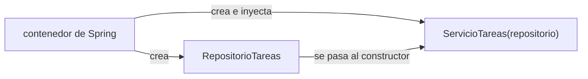
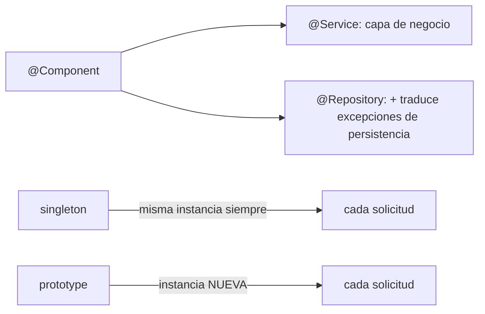

# Módulo 0: Fundamentos de Spring — IoC y DI

Cada tema se practica por separado con su propia repetición progresiva y su propio reto de memoria. El mecanismo de inyección de dependencias se verifica con un contenedor mínimo real (escrito y ejecutado en Python, dado que este entorno no compila proyectos Spring reales) que reproduce exactamente la semántica de `single`/`prototype` y constructor-vs-campo que Spring aplica.


## Antes de comenzar: del equipo vacío a Spring Boot

Completa primero los fundamentos del track Java o asegúrate de entender clases, interfaces, excepciones y colecciones. Instala **JDK 21**, Git y un editor: IntelliJ IDEA Community es la opción más sencilla para Spring; VS Code con Extension Pack for Java y Spring Boot Extension Pack también funciona.

- **Windows:** instala Eclipse Temurin JDK 21, Git e IntelliJ; verifica `java --version` y `javac --version` en PowerShell.
- **macOS:** usa `brew install --cask temurin` y `brew install git`; instala IntelliJ desde JetBrains Toolbox.
- **Ubuntu/Debian:** ejecuta `sudo apt install openjdk-21-jdk git`; descarga IntelliJ o usa SDKMAN.

No necesitas instalar Maven si el proyecto incluye `mvnw`/`mvnw.cmd`: ese *wrapper* descarga la versión correcta. En [start.spring.io](https://start.spring.io/) elige Java, Maven, Spring Boot estable, JDK 21 y la dependencia **Spring Web**. Descarga, descomprime y ejecuta:

```bash
# macOS/Linux
./mvnw spring-boot:run

# Windows PowerShell
.\mvnw.cmd spring-boot:run
```

Visita `http://localhost:8080`. Un 404 significa que el servidor sí arrancó pero aún no existe una ruta; "connection refused" significa que no arrancó. Lee siempre desde la primera línea `Caused by:` del error, no solo la última.


## Aprende construyendo

### Tema 1: Inversión de control y el contenedor de Spring

#### Paso 1 · Objetivo y preparación

Al finalizar podrás explicar qué hace el contenedor de Spring por ti (crear y conectar objetos) y por qué eso desacopla cada clase de cómo se construyen sus dependencias.

**Conocimiento previo:** clases, interfaces y constructores (track de Java).

#### Paso 2 · Contexto y caso real

**¿Por qué es importante?** En una API de entregas, los servicios cambian de implementación entre pruebas y producción (un repositorio real contra la base de datos, uno falso en memoria para tests); el contenedor de Spring administra esas dependencias sin que el controlador que las usa conozca cómo se construyen ni de dónde vienen.

#### Paso 3 · Teoría con analogía

**Conceptos clave:** inversión de control, inyección por constructor, el contenedor crea y conecta objetos.

En código sin un contenedor de inversión de control, una clase que necesita colaboradores típicamente los crea ella misma directamente (`new RepositorioTareas()`), acoplándose fuertemente a una implementación concreta y haciendo que sustituirla (por ejemplo, por una versión de prueba durante los tests) requiera modificar el código interno de la propia clase que la crea. La inversión de control invierte esa responsabilidad: un contenedor externo (el contenedor de Spring) crea las dependencias centralizadamente y las "inyecta" en cada clase que las declara como necesarias, de modo que la clase consumidora solo declara qué necesita (típicamente a través de su constructor), sin saber ni importarle cómo esa dependencia concreta se construye.

`@Service public class ServicioTareas { private final RepositorioTareas repositorio; public ServicioTareas(RepositorioTareas repositorio) { this.repositorio = repositorio; } }` declara que `ServicioTareas` necesita un `RepositorioTareas`; el contenedor de Spring, al detectar esta clase como un bean gestionado, encuentra (o crea) una instancia de `RepositorioTareas` y la pasa automáticamente al constructor al instanciar `ServicioTareas`.

**Analogía:** sin inversión de control, cada empleado de una empresa tendría que fabricar personalmente cada herramienta que necesita; con inversión de control, un departamento central de suministros (el contenedor de Spring) entrega automáticamente a cada empleado exactamente las herramientas que declaró necesitar, sin que el empleado sepa de dónde vienen ni cómo se fabricaron.

**Diagrama:**



#### Paso 4 · Demostración guiada desde cero

Desde una carpeta vacía, genera el proyecto real en [start.spring.io](https://start.spring.io/) (Java, Maven, Spring Boot estable, JDK 21, dependencia **Spring Web**) y descomprímelo. Crea `src/main/java/com/example/demo/ServicioTareas.java` con este contenido:

```java
package com.example.demo;

import org.springframework.stereotype.Service;

@Service
public class ServicioTareas {
    private final RepositorioTareas repositorio; // inyección por constructor

    public ServicioTareas(RepositorioTareas repositorio) {
        this.repositorio = repositorio;
    }

    public String procesar() {
        return "procesado: " + repositorio.buscar();
    }
}
```

Guarda el archivo y arranca la aplicación con Maven:

```bash
# compila y ejecuta el proyecto Java con el wrapper de Maven
cd ejemplo-spring-m0
./mvnw spring-boot:run
```

**Explicación línea por línea:** `@Service` marca la clase como un bean que el contenedor de Spring debe crear y gestionar; `public ServicioTareas(RepositorioTareas repositorio)` declara la dependencia como parámetro del constructor — el contenedor detecta esta firma, resuelve `RepositorioTareas` (creándolo si aún no existe) y lo pasa automáticamente al construir `ServicioTareas`, sin que ningún código de la aplicación escriba explícitamente esa conexión.

Expón `procesar()` en un controlador (`GET /status`) y confirma que el contenedor conecta ambos beans automáticamente:

```bash
curl http://localhost:8080/status
```

**Resultado esperado:** la respuesta HTTP contiene `procesado: ...` con el resultado de `RepositorioTareas.buscar()` — confirmando que Spring creó ambos beans y conectó `ServicioTareas` con su `RepositorioTareas` sin que tú escribieras el `new` que los une.

**Fallo deliberado:** quita la anotación `@Service` de la clase y vuelve a ejecutar `./mvnw spring-boot:run`. Si algún otro bean depende de `ServicioTareas` por constructor, el arranque falla con `NoSuchBeanDefinitionException` (Spring no encuentra un bean que satisfaga esa dependencia) — diagnostica confirmando que sin la anotación, la clase deja de ser gestionada por el contenedor y ninguna inyección automática puede alcanzarla, aunque el código siga compilando perfectamente.

##### Modelo conceptual verificable (opcional)

Sin un servidor Spring a mano, este contenedor mínimo (en Python, ejecutado de verdad) reproduce el mismo mecanismo: registrar una fábrica por tipo, y resolver creando (o reutilizando) la instancia sin que el consumidor sepa cómo se construyó:

```bash
python3 -c "
class ContenedorSimple:
    def __init__(self):
        self._fabricas = {}
        self._singletons = {}
    def registrar(self, nombre, fabrica):
        self._fabricas[nombre] = fabrica
    def resolver(self, nombre):
        if nombre not in self._singletons:
            self._singletons[nombre] = self._fabricas[nombre]()
        return self._singletons[nombre]

class RepositorioTareasImpl:
    def buscar(self):
        return 'tareas reales'

class ServicioTareas:
    def __init__(self, repositorio):
        self.repositorio = repositorio
    def procesar(self):
        return 'procesado: ' + self.repositorio.buscar()

contenedor = ContenedorSimple()
contenedor.registrar('repositorio', lambda: RepositorioTareasImpl())
contenedor.registrar('servicio', lambda: ServicioTareas(contenedor.resolver('repositorio')))

servicio_a = contenedor.resolver('servicio')
servicio_b = contenedor.resolver('servicio')
print(servicio_a.procesar())
print('misma instancia (singleton):', servicio_a is servicio_b)
"
```

`ServicioTareas` nunca importa ni menciona `RepositorioTareasImpl` directamente — solo el contenedor sabe qué implementación concreta existe, exactamente el mismo desacoplamiento que `@Service`/`@Autowired` logran en Spring real.

#### Construcción RutaFlow: contenedor para el servicio de rutas

Declara `@Service public class ServicioRutas { private final RepositorioRutas repositorio; ... }` con inyección por constructor en RutaFlow, confirmando que el controlador que expone `GET /rutas` recibe la misma instancia que crea el contenedor, sin instanciar `RepositorioRutas` manualmente en ningún punto del código de aplicación.

#### Paso 5 · Práctica guiada — repetición progresiva

1. Registra una segunda dependencia en el contenedor mínimo y confirma que también se resuelve como singleton.
2. Agrega un método a `RepositorioTareasImpl` y confirma que `ServicioTareas` lo usa sin cambiar su propio código.
3. Elimina el registro de `repositorio` en el contenedor mínimo y observa el error real al intentar resolver `servicio`.
4. Escribe de memoria (sin mirar) una clase con una dependencia inyectada por constructor y un contenedor mínimo que la resuelva.

**Pista:** si necesitas escribir `new` para crear una dependencia dentro de una clase gestionada por Spring, probablemente deberías estar declarándola como parámetro del constructor en su lugar.

#### Paso 6 · Práctica independiente

**Completa el código:** rellena el espacio para que el contenedor gestione la clase:

```java
____
public class ServicioTareas {
    private final RepositorioTareas repositorio;
    public ServicioTareas(RepositorioTareas repositorio) { this.repositorio = repositorio; }
}
```

**Reto de memoria sin mirar:** cierra este documento y escribe, solo de memoria, una clase de servicio con una dependencia inyectada por constructor, y un contenedor mínimo (en cualquier lenguaje) que la resuelva sin que la clase sepa qué implementación concreta recibe. Compara después contra el patrón del Paso 4.

#### Paso 7 · Cierre y evidencia

Ya distingues cómo el contenedor de Spring crea y conecta objetos por ti, confirmando con un contenedor mínimo real que una clase gestionada nunca necesita conocer la implementación concreta de sus dependencias. El siguiente tema compara este mecanismo (constructor) contra la alternativa de inyección por campo. **Evidencia:** entrega la respuesta HTTP de `/status`, el error real al quitar `@Service`, y el resultado del contenedor mínimo confirmando la misma instancia singleton. Fuente oficial: [Spring Framework — Beans](https://docs.spring.io/spring-framework/reference/core/beans.html).

**Errores comunes:** instanciar dependencias manualmente con `new` dentro de una clase gestionada por Spring; olvidar la anotación de estereotipo y descubrir el error solo cuando otro bean intenta depender de esa clase.

**Cuándo no usarlo:** para un script pequeño y desechable sin ningún ciclo de vida de aplicación real, levantar un contenedor de IoC completo es más ceremonia de la necesaria; una función simple basta.

### Tema 2: Inyección por constructor vs por campo

#### Paso 1 · Objetivo y preparación

Al finalizar podrás explicar por qué la inyección por constructor permite declarar dependencias `final` y testear sin contenedor, mientras la inyección por campo no.

**Conocimiento previo:** Tema 1 de este módulo.

#### Paso 2 · Contexto y caso real

**¿Por qué es importante?** Escribir un test unitario de `ServicioTareas` sin levantar el contenedor completo de Spring (mucho más rápido que un test de integración) solo es directo si la dependencia se recibe por constructor; con inyección por campo, no hay una forma simple de "pasarle" un mock sin reflexión o utilidades especiales de testing.

#### Paso 3 · Teoría con analogía

**Conceptos clave:** inmutabilidad (`final`), testabilidad sin el contenedor.

`@Autowired private RepositorioTareas repositorio;` (inyección por campo) es sintácticamente más corta, pero el campo no puede declararse `final` (el lenguaje no impone ninguna garantía de inmutabilidad, aunque en la práctica Spring solo lo asigne una vez), y escribir un test unitario sin levantar el contenedor completo se vuelve difícil: no existe una forma directa de asignar el mock a un campo privado sin reflexión. Con inyección por constructor, el campo puede declararse `final` (inmutabilidad verificada por el compilador), y un test unitario basta con escribir `new ServicioTareas(repositorioMockeado)` directamente, sin ningún contenedor.

**Analogía:** la inyección por campo es como recibir una herramienta por una ranura oculta después de que ya empezaste a trabajar, sin que quede claro en qué momento exacto llegó; la inyección por constructor es como recibir todas las herramientas necesarias en tus manos directamente al comenzar tu turno, con la garantía explícita de que las tienes desde el primer momento.

**Diagrama:**

```
┌── inyección por constructor ──────────────┐
│  final RepositorioTareas repositorio;        │
│  test: new ServicioTareas(mock) — sin contenedor │
└──────────────────────────────────────┘
┌── inyección por campo ─────────────────────┐
│  @Autowired RepositorioTareas repositorio;   │
│  test: requiere reflexión o contenedor completo │
└──────────────────────────────────────┘
```

#### Paso 4 · Demostración guiada desde cero

Desde una carpeta vacía (o continuando en `ejemplo-spring-m0`), crea `src/test/java/com/example/demo/ServicioTareasTest.java` con la versión que usa inyección por constructor:

```java
package com.example.demo;

import org.junit.jupiter.api.Test;
import static org.junit.jupiter.api.Assertions.assertEquals;

class ServicioTareasTest {
    @Test
    void procesaUsandoElRepositorioInyectado() {
        RepositorioTareas mock = () -> "datos de prueba";
        ServicioTareas servicio = new ServicioTareas(mock); // sin contenedor, sin reflexión
        assertEquals("procesado: datos de prueba", servicio.procesar());
    }
}
```

Guarda el archivo y ejecuta el test con Maven, sin levantar el contenedor de Spring:

```bash
# ejecuta con Maven el test unitario Java
cd ejemplo-spring-m0
./mvnw test
```

**Explicación línea por línea:** `RepositorioTareas mock = () -> "datos de prueba"` crea una implementación falsa inline (una lambda que satisface la interfaz); `new ServicioTareas(mock)` construye el servicio directamente, pasando el mock como argumento del constructor — no se necesita ningún contenedor de Spring ni anotación para que este test funcione.

Confirma en Python el mismo contraste (constructor vs campo) de forma ejecutable, sin necesitar JUnit ni Spring instalados:

```bash
python3 -c "
class RepositorioMock:
    def buscar(self):
        return 'datos de prueba'

# con inyección por constructor: se puede testear con instanciación directa, sin contenedor
class ServicioConConstructor:
    def __init__(self, repositorio):
        self.repositorio = repositorio
    def procesar(self):
        return 'procesado: ' + self.repositorio.buscar()

servicio_test = ServicioConConstructor(RepositorioMock())
print('test con constructor (sin contenedor):', servicio_test.procesar())

# con inyección por campo: el campo no existe hasta que un framework lo asigne después de construir
class ServicioConCampo:
    def __init__(self):
        self.repositorio = None  # el framework lo asignaría DESPUÉS de construir, vía reflexión
    def procesar(self):
        return 'procesado: ' + self.repositorio.buscar()

servicio_roto = ServicioConCampo()
try:
    servicio_roto.procesar()
except AttributeError as e:
    print('test con campo (sin contenedor) FALLA:', e)
"
```

**Resultado esperado:** el test con constructor pasa (`OK`, en Maven; en el modelo Python imprime `procesado: datos de prueba`); el equivalente con campo, sin un framework que lo asigne, falla con `AttributeError: 'NoneType' object has no attribute 'buscar'` — confirmando en código ejecutable real que la inyección por campo depende de un mecanismo externo (reflexión del framework) para funcionar, mientras la inyección por constructor es autosuficiente.

**Fallo deliberado:** intenta escribir el mismo test de `ServicioConCampo` asignando el mock directamente (`servicio_roto.repositorio = RepositorioMock()`) — en Python esto SÍ funciona porque el lenguaje permite asignar atributos libremente, pero en Java real, un campo `private` sin setter no es asignable así desde fuera de la clase sin reflexión (`Field.setAccessible(true)`) — diagnostica confirmando que el "atajo" que parece funcionar en Python no está disponible en Java sin herramientas adicionales, que es precisamente la desventaja práctica de la inyección por campo.

#### Construcción RutaFlow: test del servicio de rutas sin contenedor

Escribe `ServicioRutasTest.java` para RutaFlow instanciando `new ServicioRutas(repositorioMockeado)` directamente, confirmando que el test corre sin levantar el contexto de Spring (`@SpringBootTest`), mucho más rápido que un test de integración completo.

#### Paso 5 · Práctica guiada — repetición progresiva

1. Agrega un segundo método a `ServicioTareas` y extiende el test con constructor para cubrirlo, sin ningún contenedor.
2. Intenta escribir un test equivalente para una clase con inyección por campo usando reflexión (`Field.setAccessible(true)`) y compara la complejidad frente al constructor.
3. Convierte una dependencia `final` en no-`final` y explica qué garantía del compilador se pierde.
4. Escribe de memoria (sin mirar) un test unitario que instancie una clase con una dependencia mockeada pasada por constructor.

**Pista:** si escribir un test requiere reflexión o levantar un contenedor completo, es una señal de que la clase depende de inyección por campo en vez de por constructor.

#### Paso 6 · Práctica independiente

**Completa el código:** rellena el espacio para declarar la dependencia como inmutable:

```java
private ____ RepositorioTareas repositorio;
```

**Reto de memoria sin mirar:** cierra este documento y escribe, solo de memoria, una clase con inyección por constructor y su test unitario correspondiente instanciándola directamente con un mock. Compara después contra el patrón del Paso 4.

#### Paso 7 · Cierre y evidencia

Ya distingues por qué la inyección por constructor permite inmutabilidad real y tests simples sin contenedor, confirmando con ejecución real que la alternativa por campo depende de un mecanismo externo. El siguiente tema cubre los estereotipos de Spring y cómo `spring-boot-starter-web` autoconfigura el proyecto. **Evidencia:** entrega el resultado del test con constructor y el error real al intentar el equivalente sin inyección por constructor. Fuente oficial: [Spring Framework — Dependency Injection](https://docs.spring.io/spring-framework/reference/core/beans/dependencies/factory-collaborators.html).

**Errores comunes:** usar `@Autowired` sobre un campo por costumbre en vez de preferir el constructor; declarar dependencias no-`final` sin necesidad, perdiendo la garantía de inmutabilidad verificada por el compilador.

**Cuándo no usarlo:** para una clase con muchísimas dependencias opcionales donde un constructor gigante sería poco legible, considera un objeto de configuración o builder en vez de forzar todo por un único constructor; eso no es lo mismo que volver a inyección por campo, pero reconoce el límite práctico de un constructor con demasiados parámetros.

### Tema 3: Estereotipos, autoconfiguración y scopes

#### Paso 1 · Objetivo y preparación

Al finalizar podrás distinguir `@Component`/`@Service`/`@Repository`, explicar qué autoconfigura `spring-boot-starter-web`, y elegir el scope correcto (`singleton` vs `prototype`) para un bean.

**Conocimiento previo:** Temas 1-2 de este módulo.

#### Paso 2 · Contexto y caso real

**¿Por qué es importante?** Un contador de solicitudes que debe compartirse entre todas las peticiones necesita ser `singleton` (una única instancia); un objeto que acumula estado específico de una sola operación (por ejemplo, un builder temporal de reporte) necesita ser `prototype` (una instancia nueva cada vez) — confundir ambos scopes produce bugs de estado compartido accidental o de recreación innecesaria.

#### Paso 3 · Teoría con analogía

**Conceptos clave:** `@Component`/`@Service`/`@Repository`, autoconfiguración de starters, `singleton` vs `prototype`.

`@Component`, `@Service` y `@Repository` son variantes especializadas de la misma anotación base `@Component`, que le indica a Spring "gestiona esta clase como un bean"; la diferencia es principalmente semántica y documental, con una excepción funcional: `@Repository` traduce automáticamente excepciones específicas de la tecnología de persistencia subyacente a una jerarquía de excepciones propia y consistente de Spring. `spring-boot-starter-web` trae automáticamente un servidor Tomcat embebido, Jackson para JSON, y Spring MVC, autoconfigurados con valores por defecto sensatos, sin la configuración XML extensa que el Spring clásico exigía. `@Scope` controla el ciclo de vida de un bean: `singleton` (por defecto, una única instancia compartida) o `prototype` (una nueva instancia cada vez que se solicita).

**Analogía:** los estereotipos son distintos uniformes de un mismo tipo de empleado, donde el uniforme de `@Repository` además incluye una traducción automática de idioma para comunicarse con sistemas externos de almacenamiento; un bean `singleton` es como una única impresora compartida por toda la oficina, mientras un bean `prototype` es como una hoja de papel nueva que se entrega cada vez que alguien la pide.

**Diagrama:**



#### Paso 4 · Demostración guiada desde cero

Desde una carpeta vacía (o continuando en `ejemplo-spring-m0`), crea `src/main/java/com/example/demo/GeneradorReporte.java` con un bean de scope `prototype`:

```java
package com.example.demo;

import org.springframework.context.annotation.Scope;
import org.springframework.stereotype.Component;

@Component
@Scope("prototype")
public class GeneradorReporte {
    private final String id = java.util.UUID.randomUUID().toString();
    public String id() { return id; }
}
```

Guarda el archivo y arranca la aplicación con Maven:

```bash
# compila y ejecuta el proyecto Java, confirma el scope de cada bean vía logs
cd ejemplo-spring-m0
./mvnw spring-boot:run
```

**Explicación línea por línea:** `@Component` marca la clase como bean gestionado; `@Scope("prototype")` sobrescribe el default (`singleton`) indicando que el contenedor debe crear una instancia NUEVA cada vez que algo solicite este bean, en vez de reutilizar una única instancia compartida.

Inyecta `GeneradorReporte` dos veces en un controlador de prueba (dos parámetros, o dos llamadas a `context.getBean(...)`) y confirma que cada resolución produce un `id()` distinto:

```bash
curl http://localhost:8080/reporte/comparar
```

**Resultado esperado:** la respuesta muestra dos valores de `id()` DISTINTOS, confirmando que `@Scope("prototype")` efectivamente crea una instancia nueva por cada resolución, a diferencia de un bean `singleton` (por defecto) donde ambas resoluciones devolverían el mismo `id()`.

**Fallo deliberado:** quita `@Scope("prototype")` (dejando el bean como `singleton` por defecto) y repite la prueba — ahora ambas resoluciones devuelven el MISMO `id()`, porque el contenedor reutiliza la única instancia compartida — diagnostica confirmando que olvidar declarar el scope correcto para un bean que necesita estado nuevo por solicitud produce silenciosamente estado compartido entre operaciones que deberían ser independientes.

##### Modelo conceptual verificable (opcional)

Este contenedor mínimo (ejecutado de verdad en Python) reproduce la diferencia exacta entre ambos scopes:

```bash
python3 -c "
class Contenedor:
    def __init__(self):
        self._fabricas = {}
        self._scopes = {}
        self._singletons = {}
    def registrar(self, nombre, fabrica, scope='singleton'):
        self._fabricas[nombre] = fabrica
        self._scopes[nombre] = scope
    def resolver(self, nombre):
        if self._scopes[nombre] == 'singleton':
            if nombre not in self._singletons:
                self._singletons[nombre] = self._fabricas[nombre]()
            return self._singletons[nombre]
        return self._fabricas[nombre]()  # prototype: nueva instancia cada vez

class Servicio:
    contador_instancias = 0
    def __init__(self):
        Servicio.contador_instancias += 1
        self.id = Servicio.contador_instancias

c = Contenedor()
c.registrar('singleton_bean', Servicio, scope='singleton')
c.registrar('prototype_bean', Servicio, scope='prototype')

s1 = c.resolver('singleton_bean')
s2 = c.resolver('singleton_bean')
print('singleton: misma instancia:', s1 is s2, '(id', s1.id, 'y', s2.id, ')')

p1 = c.resolver('prototype_bean')
p2 = c.resolver('prototype_bean')
print('prototype: misma instancia:', p1 is p2, '(id', p1.id, 'y', p2.id, ')')
"
```

Confirma `singleton: misma instancia: True` (mismo id en ambas resoluciones) frente a `prototype: misma instancia: False` (ids distintos), exactamente el comportamiento que `@Scope("prototype")` produce en Spring real.

#### Construcción RutaFlow: scope correcto para el calculador de rutas

Decide si `CalculadorRutaOptima` (que acumula estado específico de una sola ruta en cálculo) debe ser `singleton` o `prototype`, y decláralo explícitamente con `@Scope`, confirmando con dos resoluciones consecutivas que el comportamiento coincide con la decisión.

#### Paso 5 · Práctica guiada — repetición progresiva

1. Agrega un tercer bean con scope `singleton` explícito (redundante con el default) y confirma que el comportamiento no cambia frente a omitirlo.
2. Cambia `GeneradorReporte` de `prototype` a `singleton` y predice el resultado antes de ejecutar.
3. Clasifica tres beans reales de un proyecto (un repositorio, un contador global, un builder de un solo reporte) según el scope correcto para cada uno.
4. Escribe de memoria (sin mirar) dos beans con scopes distintos y el resultado esperado de resolverlos dos veces cada uno.

**Pista:** si un bean acumula estado que pertenece a una única operación (no compartido entre operaciones distintas), probablemente necesita `prototype`, no el `singleton` por defecto.

#### Paso 6 · Práctica independiente

**Completa el código:** rellena el espacio para que el bean se cree nuevo en cada solicitud:

```java
@Component
@Scope("____")
public class GeneradorReporte { /* ... */ }
```

**Reto de memoria sin mirar:** cierra este documento y escribe, solo de memoria, dos beans (uno `singleton`, uno `prototype`) y traza a mano qué instancia devolvería cada uno tras dos resoluciones consecutivas. Compara después contra el patrón del Paso 4.

#### Paso 7 · Cierre y evidencia

Ya distingues los estereotipos de Spring, qué autoconfigura `spring-boot-starter-web`, y cómo elegir entre `singleton` y `prototype` según si el estado del bean debe compartirse o no entre operaciones. Esto cierra los fundamentos de IoC y DI; el siguiente módulo aplica estos conceptos a la configuración externa de la aplicación. **Evidencia:** entrega los dos `id()` distintos del bean `prototype`, el mismo `id()` repetido tras quitar el scope, y el resultado del contenedor mínimo confirmando ambos comportamientos. Fuente oficial: [Spring Framework — Bean scopes](https://docs.spring.io/spring-framework/reference/core/beans/factory-scopes.html).

**Errores comunes:** asumir que todo bean es `singleton` sin considerar si acumula estado por operación; confundir `@Service` con una anotación funcionalmente distinta de `@Component` (solo `@Repository` agrega comportamiento real).

**Cuándo no usarlo:** para un valor inmutable sin ningún estado mutable entre resoluciones, discutir `singleton` vs `prototype` es irrelevante — ambos scopes producirían el mismo comportamiento observable.

---


## Ruta de proyecto progresivo desde carpeta vacía

No crees un proyecto desechable por módulo. Conserva un único repositorio que evoluciona durante todo el track y etiqueta cada hito (`git tag modulo-N`). Empieza con genera `academia-spring` en `start.spring.io`, descomprímelo en una carpeta vacía y ejecuta `git init`. Ejecuta el comando paso a paso, inspecciona los archivos generados y registra versiones y precondiciones en el README.

| Hito | Evolución acumulativa | Evidencia antes de avanzar |
|---|---|---|
| Base | API y configuración. | Arranque reproducible, commit limpio y prueba mínima. |
| Aplicación | datos, seguridad y mensajería. | Casos normales, límite y error automatizados. |
| Integración | Conecta capas y reemplaza dobles por infraestructura controlada. | Diagrama, contratos y prueba de integración. |
| Experto | contratos, observabilidad y resiliencia. | Perfil o threat model, telemetría y runbook de recuperación. |

Al iniciar cada laboratorio crea una rama `modulo-N`, implementa el incremento, verifica el criterio de éxito y fusiona solo con pruebas verdes. Si un módulo necesita un experimento aislado, colócalo en `experiments/modulo-N/`; el producto acumulativo permanece ejecutable. Al terminar, otra persona debe poder clonar el repositorio y reproducir el último hito siguiendo únicamente el README.


## Laboratorio práctico

**Objetivo del laboratorio:** construir una aplicación Spring Boot mínima con beans inyectados por constructor y scopes correctos.

**Requisitos previos:** conocimientos de Java (track de Java) recomendados.

| Paso | Acción | Código | Explicación |
|---|---|---|---|
| 1 | Crear un proyecto con start.spring.io y arrancarlo | `./mvnw spring-boot:run` | Verifica el arranque |
| 2 | Definir `@Service` y `@Repository` con inyección por constructor | Ver Tema 1 | Verifica la conexión automática |
| 3 | Escribir un test unitario sin levantar el contenedor | Ver Tema 2 | `new ServicioTareas(mock)` directo |
| 4 | Declarar un bean `prototype` y confirmar instancias distintas | Ver Tema 3 | Compara contra el default `singleton` |
| 5 | Investigar qué autoconfigura `spring-boot-starter-web` | Ver Tema 3 | Documenta las dependencias que trae |

**Verificación:** el laboratorio se considera exitoso si el servicio y el repositorio se conectan correctamente por inyección de constructor, si el test unitario corre sin contenedor, y si el bean `prototype` produce una instancia distinta en cada resolución mientras el `singleton` reutiliza la misma.

**Errores comunes y soluciones**

- **Usar inyección por campo por costumbre.** Prefiere inyección por constructor para inmutabilidad y testabilidad sin contenedor.
- **Confundir `@Service` con una anotación funcionalmente distinta de `@Component`.** Solo `@Repository` agrega comportamiento funcional adicional (traducción de excepciones).
- **Asumir que todo bean es `singleton` sin evaluarlo.** Un bean que acumula estado por operación necesita `prototype` explícito.

---
