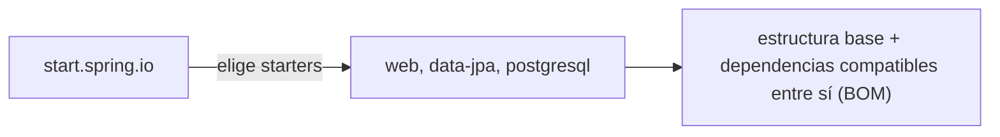

# Módulo 1: Spring Boot CLI y estructura de proyecto

Cada tema se practica por separado con su propia repetición progresiva y su propio reto de memoria. La fusión de configuración base + perfil se verifica con la aplicación Spring Boot real, arrancando con y sin el perfil activo y comparando los valores efectivos.


## Aprende construyendo

### Tema 1: Spring Initializr y starters

#### Paso 1 · Objetivo y preparación

Al finalizar podrás elegir starters con criterio y explicar por qué evitan el "dependency hell" de resolver manualmente versiones compatibles.

**Conocimiento previo:** Módulo 0 (contenedor de Spring, `@Service`).

#### Paso 2 · Contexto y caso real

**¿Por qué es importante?** Un servicio de entregas que necesita exponer HTTP, persistir en PostgreSQL y validar entradas no debería requerir que el equipo investigue manualmente qué versiones de Tomcat, Hibernate y Jackson son compatibles entre sí para la versión de Spring Boot elegida.

#### Paso 3 · Teoría con analogía

**Conceptos clave:** starter, dependencias preconfiguradas, generación de estructura base.

[start.spring.io](https://start.spring.io) genera la estructura base de un proyecto a partir de starters seleccionados (`web`, `data-jpa`, `security`, `postgresql`), donde cada starter es un conjunto curado de dependencias preconfiguradas que trabajan juntas de forma coherente: `spring-boot-starter-web` trae todo lo necesario para exponer APIs HTTP; `spring-boot-starter-data-jpa` trae Hibernate y la infraestructura de Spring Data para persistencia. Esta curación es el valor añadido de los starters sobre agregar dependencias sueltas manualmente: Spring Boot gestiona internamente qué versiones de cada dependencia son compatibles entre sí para una versión dada, eliminando la necesidad de resolver manualmente esa matriz de compatibilidad (el "dependency hell") mediante su gestión centralizada de versiones (el BOM de Spring Boot).

**Analogía:** un starter es un kit de herramientas preensamblado para un propósito específico, donde todas las herramientas incluidas ya están verificadas para trabajar bien juntas, en vez de comprar cada herramienta individual y verificar manualmente su compatibilidad.

**Diagrama:**



#### Paso 4 · Demostración guiada desde cero

Desde una carpeta vacía, genera el proyecto real con el starter `web`:

```bash
# descarga y arranca con Maven el proyecto generado por Spring Initializr
mkdir ejemplo-spring-m1
cd ejemplo-spring-m1
curl -fsSL https://start.spring.io/starter.zip -d dependencies=web -d javaVersion=21 -o app.zip
unzip app.zip
./mvnw spring-boot:run
```

Crea `src/main/java/com/example/demo/SaludController.java` exponiendo `GET /health`:

```java
package com.example.demo;

import org.springframework.web.bind.annotation.GetMapping;
import org.springframework.web.bind.annotation.RestController;

@RestController
public class SaludController {
    @GetMapping("/health")
    public String health() {
        return "OK";
    }
}
```

**Explicación línea por línea:** `dependencies=web` en la URL de Initializr selecciona el starter `spring-boot-starter-web`, que trae Tomcat embebido, Jackson y Spring MVC ya autoconfigurados; `@RestController` marca la clase como manejador de peticiones HTTP que serializa directamente los valores de retorno (en vez de resolver una vista); `@GetMapping("/health")` mapea peticiones `GET /health` a este método.

Guarda el archivo, reinicia la aplicación y confirma la respuesta:

```bash
curl http://localhost:8080/health
```

**Resultado esperado:** la respuesta HTTP es `200 OK` con cuerpo `OK` — confirmando que el starter `web` autoconfiguró un servidor HTTP funcional sin ninguna configuración manual de Tomcat, Jackson o Spring MVC por tu parte.

**Fallo deliberado:** genera un segundo proyecto sin el starter `web` (`-d dependencies=` vacío) e intenta agregar el mismo `SaludController`. La compilación falla porque `org.springframework.web.bind.annotation.RestController` no existe en el classpath — diagnostica confirmando que sin el starter correspondiente, ni siquiera las anotaciones básicas de esa capacidad están disponibles, mucho antes de llegar a un error en tiempo de ejecución.

#### Paso 5 · Práctica guiada — repetición progresiva

1. Agrega el starter `validation` a un proyecto existente y confirma que `@NotBlank`/`@NotNull` quedan disponibles.
2. Genera un proyecto con `data-jpa` sin `postgresql` (ni ningún driver de base de datos) y observa el error real al intentar arrancar.
3. Compara el `pom.xml` generado con y sin el starter `security`, identificando qué dependencias nuevas aparecen.
4. Escribe de memoria (sin mirar) los starters mínimos necesarios para una API HTTP que persiste en una base de datos relacional.

**Pista:** antes de agregar una dependencia suelta manualmente, verifica primero si existe un starter que ya la incluya con las versiones compatibles correctas.

#### Paso 6 · Práctica independiente

**Completa el código:** rellena el espacio para que el controlador responda a peticiones HTTP:

```java
@____
public class SaludController {
    @GetMapping("/health")
    public String health() { return "OK"; }
}
```

**Reto de memoria sin mirar:** cierra este documento y escribe, solo de memoria, un controlador REST mínimo con un endpoint `GET`, y los starters necesarios para que compile y arranque. Compara después contra el patrón del Paso 4.

#### Paso 7 · Cierre y evidencia

Ya eliges starters con criterio y explicas por qué evitan resolver manualmente versiones compatibles entre dependencias. El siguiente tema compara los dos formatos de configuración externa disponibles. **Evidencia:** entrega la respuesta `200 OK` de `/health` y el fallo real de compilación al usar una anotación sin su starter correspondiente. Fuente oficial: [Spring Initializr](https://docs.spring.io/initializr/docs/current/reference/html/).

**Errores comunes:** agregar dependencias sueltas manualmente en vez de usar el starter correspondiente, arriesgando incompatibilidades de versión; incluir starters que el proyecto no necesita, aumentando el tiempo de arranque y la superficie de configuración sin beneficio real.

**Cuándo no usarlo:** para una librería que no es una aplicación ejecutable por sí misma (por ejemplo, un módulo compartido consumido por otros proyectos), los starters de Spring Boot como tal no aplican; usa dependencias de Spring Framework más específicas según lo que la librería necesite exponer.

### Tema 2: application.yml vs application.properties

#### Paso 1 · Objetivo y preparación

Al finalizar podrás elegir entre YAML y properties para configuración externa, y confirmar que ambos formatos son funcionalmente equivalentes para Spring Boot.

**Conocimiento previo:** Tema 1 de este módulo.

#### Paso 2 · Contexto y caso real

**¿Por qué es importante?** Una configuración con varios niveles de anidación (`spring.datasource.url`, `spring.datasource.username`, `spring.jpa.hibernate.ddl-auto`) se vuelve visualmente repetitiva en `.properties` (el prefijo `spring.` se repite en cada línea) mientras que en `.yml` se agrupa jerárquicamente una sola vez, sin que ninguna de las dos formas cambie qué configuración es efectivamente posible expresar.

#### Paso 3 · Teoría con analogía

**Conceptos clave:** configuración tipada, indentación jerárquica, equivalencia funcional.

`application.properties` expresa configuración como pares clave-valor planos con notación de puntos (`spring.datasource.url=jdbc:postgresql://localhost:5432/app`); `application.yml` expresa la misma configuración usando indentación jerárquica (`spring: datasource: url: ...`), agrupando visualmente las claves relacionadas bajo su nodo padre común. Ambos formatos son completamente válidos y Spring Boot los soporta indistintamente (incluso es posible mezclar ambos en el mismo proyecto, aunque no es recomendable por claridad); la elección es principalmente una cuestión de legibilidad del equipo, sin ninguna diferencia funcional real.

**Analogía:** `application.properties` es una lista plana de instrucciones con prefijos repetidos en cada línea; `application.yml` es un índice jerárquico con subcategorías anidadas visualmente bajo su categoría padre, generalmente más fácil de navegar cuanto más profunda es la jerarquía.

**Diagrama:**

```
┌── application.properties (plano) ──────────┐
│  spring.datasource.url=...                    │
│  spring.datasource.username=...                │
└──────────────────────────────────────┘
┌── application.yml (jerárquico) ────────────┐
│  spring:                                      │
│    datasource:                                │
│      url: ...                                 │
│      username: ...                            │
└──────────────────────────────────────┘
```

#### Paso 4 · Demostración guiada desde cero

Desde una carpeta vacía (o continuando en `ejemplo-spring-m1`), crea `src/main/resources/application.yml` con configuración anidada:

```yaml
spring:
  datasource:
    url: jdbc:postgresql://localhost:5432/app
    username: app_user
server:
  port: 8080
```

Guarda el archivo (Spring Boot detecta `application.yml` automáticamente al arrancar, sin configuración adicional) y confirma que el puerto configurado se aplica:

```bash
# arranca el proyecto Java con Maven usando la configuración de application.yml
cd ejemplo-spring-m1
./mvnw spring-boot:run
```

**Explicación línea por línea:** la indentación de dos espacios bajo `spring:` y luego bajo `datasource:` expresa la misma jerarquía que `spring.datasource.url=...` en formato plano; `server: port: 8080` funciona idénticamente en ambos formatos, seleccionando el puerto en el que Tomcat escucha.

**Resultado esperado:** la aplicación arranca escuchando en el puerto `8080` (el valor configurado en `application.yml`), confirmando que Spring Boot lee y aplica la configuración anidada sin ninguna diferencia de comportamiento frente al formato plano equivalente.

**Fallo deliberado:** desalinea la indentación de `url` (quítale un espacio respecto a `datasource:`) y vuelve a arrancar. YAML es sensible a la indentación exacta: el parser interpreta la línea mal indentada como perteneciente a un nivel de jerarquía distinto del que pretendías, produciendo un error de parseo o una propiedad que termina en la ubicación equivocada — diagnostica confirmando que la ventaja de legibilidad del YAML jerárquico tiene como costo una sensibilidad a la indentación que `.properties` (plano, sin jerarquía visual) no tiene.

Para confirmarlo sin ambigüedad, crea `src/main/resources/application.properties` (en vez del `.yml` anterior) con la forma plana exactamente equivalente:

```properties
spring.datasource.url=jdbc:postgresql://localhost:5432/app
spring.datasource.username=app_user
server.port=8080
```

Arranca la aplicación con este archivo en vez de `application.yml` (mantén solo uno de los dos presente a la vez) y repite la petición de comprobación:

```bash
# arranca el proyecto Java con Maven usando application.properties en vez de application.yml
cd ejemplo-spring-m1
./mvnw spring-boot:run
```

**Resultado esperado:** la aplicación arranca exactamente igual, escuchando en el puerto `8080` y con la misma URL de datasource — confirmando en la aplicación real que `spring.datasource.url` (plano) y `spring: datasource: url:` (anidado) son la misma clave interpretada por el mismo mecanismo de Spring Boot, sin ninguna diferencia de comportamiento observable entre ambos formatos.

#### Paso 5 · Práctica guiada — repetición progresiva

1. Agrega una tercera clave anidada (`spring.jpa.hibernate.ddl-auto`) en ambos formatos y confirma que producen la misma clave aplanada.
2. Desalinea deliberadamente una indentación en YAML y documenta el error de parseo exacto que produce.
3. Escribe la misma configuración de tres niveles de profundidad en ambos formatos y cuenta cuántos caracteres tiene cada uno.
4. Escribe de memoria (sin mirar) una configuración anidada de dos niveles en YAML y su equivalente plano en `.properties`.

**Pista:** si te equivocas con la indentación en YAML, el error no siempre es obvio a simple vista — cuenta los espacios exactos en vez de asumir que "se ve bien".

#### Paso 6 · Práctica independiente

**Completa el código:** rellena el espacio para expresar `server.port` en YAML:

```yaml
____:
  port: 8080
```

**Reto de memoria sin mirar:** cierra este documento y escribe, solo de memoria, la misma configuración de base de datos en ambos formatos (YAML y properties), y verifica que representan las mismas claves. Compara después contra el patrón del Paso 4.

#### Paso 7 · Cierre y evidencia

Ya eliges entre YAML y properties con criterio, confirmando con la aplicación real que ambos formatos representan exactamente la misma información. El siguiente tema usa perfiles para variar esta configuración por entorno. **Evidencia:** entrega el resultado de arrancar la aplicación con `application.yml` y con `application.properties` equivalente, y el error real de indentación del fallo deliberado. Fuente oficial: [Spring Boot — Externalized Configuration](https://docs.spring.io/spring-boot/docs/current/reference/html/features.html#features.external-config).

**Errores comunes:** mezclar `.properties` y `.yml` en el mismo proyecto sin necesidad, generando confusión sobre cuál tiene prioridad; desalinear la indentación en YAML sin notar el error hasta que la configuración no se aplica como se esperaba.

**Cuándo no usarlo:** para una configuración de una sola clave sin ninguna anidación, la diferencia entre ambos formatos es irrelevante; cualquiera de los dos es igual de simple.

La configuración por perfil que definas aquí es la misma que usará el proyecto integrador de este track (microservicio productivo, Módulo 12) para separar entornos.

### Tema 3: Perfiles y estructura por capas

#### Paso 1 · Objetivo y preparación

Al finalizar podrás externalizar configuración por perfil y organizar el código en capas `controller`/`service`/`repository` con responsabilidades delimitadas.

**Conocimiento previo:** Tema 2 de este módulo.

#### Paso 2 · Contexto y caso real

**¿Por qué es importante?** Desplegar exactamente el mismo artefacto compilado en desarrollo y en producción, variando solo la URL de la base de datos y el nivel de logs entre ambos entornos, evita el riesgo de que el artefacto probado en un entorno sea sutilmente distinto al que efectivamente se despliega en producción.

#### Paso 3 · Teoría con analogía

**Conceptos clave:** perfil (`application-{perfil}.yml`), sobreescritura parcial, estructura por capas.

Un perfil (`application-dev.yml`, `application-prod.yml`) sobreescribe únicamente los valores específicos que declara explícitamente, manteniendo intacto el resto de la configuración base definida en `application.yml`; `java -jar app.jar --spring.profiles.active=dev` activa el perfil correspondiente al arrancar, sin necesidad de recompilar la aplicación para cada entorno. La estructura por capas (`controller/` traduciendo HTTP hacia/desde DTOs, `service/` con la lógica de negocio sin conocimiento de HTTP, `repository/` con el acceso a datos) establece responsabilidades delimitadas: el controller no debería contener lógica de negocio, y el service no debería conocer detalles HTTP como códigos de estado.

**Analogía:** los perfiles son distintos conjuntos de ajustes preconfigurados para el mismo dispositivo, seleccionables según el contexto de uso sin reconfigurar manualmente cada ajuste; la estructura por capas es una cadena de producción donde cada estación tiene una responsabilidad delimitada y no necesita conocer los detalles internos de las demás estaciones.

**Diagrama:**

```
┌── application.yml (base) ──────────────────┐
│  server.port: 8080                            │
│  spring.datasource.url: .../app               │
└──────────────┬─────────────────────────┘
               │ + application-dev.yml (perfil)
               ▼
┌── configuración final con perfil dev ──────┐
│  server.port: 8080 (heredado, sin cambios)    │
│  spring.datasource.url: .../app_dev (sobreescrito) │
└──────────────────────────────────────┘
```

#### Paso 4 · Demostración guiada desde cero

Desde una carpeta vacía (o continuando en `ejemplo-spring-m1`), crea `src/main/resources/application-dev.yml` con la configuración específica del entorno de desarrollo:

```yaml
spring:
  datasource:
    url: jdbc:postgresql://localhost:5432/app_dev
```

Arranca la aplicación activando explícitamente el perfil `dev`:

```bash
# empaqueta y ejecuta el jar Java con el perfil dev activado
cd ejemplo-spring-m1
./mvnw clean package -DskipTests
java -jar target/*.jar --spring.profiles.active=dev
```

**Explicación línea por línea:** `application-dev.yml` solo declara `spring.datasource.url`, sobreescribiendo ÚNICAMENTE esa clave; `server.port` (definido en `application.yml` base) permanece sin cambios porque el perfil no lo menciona; `--spring.profiles.active=dev` le indica a Spring Boot qué archivo de perfil cargar además del `application.yml` base.

**Resultado esperado:** los logs de arranque muestran `The following 1 profile is active: "dev"` y la aplicación se conecta a `app_dev` (no a `app`, el valor base) — confirmando que el perfil sobreescribió solo la clave que declaró explícitamente, dejando el resto de la configuración base intacta.

**Fallo deliberado:** arranca sin `--spring.profiles.active=dev` (sin activar ningún perfil). La aplicación usa `spring.datasource.url` del `application.yml` BASE (apuntando a `app`, no a `app_dev`) — diagnostica confirmando que un perfil nunca se activa automáticamente; olvidar la bandera en el comando de arranque es el error más común al desplegar en el entorno equivocado sin darse cuenta.

Para ver la configuración final ya fusionada (no solo inferirla), agrega el starter `actuator` al proyecto, expón el endpoint `env` en `application.yml` (`management.endpoints.web.exposure.include: env`), y consulta el entorno efectivo con la aplicación corriendo:

```bash
# consulta las propiedades efectivas después de fusionar base + perfil dev
curl -s http://localhost:8080/actuator/env/spring.datasource.url | grep -o '"value":"[^"]*"'
curl -s http://localhost:8080/actuator/env/server.port | grep -o '"value":[0-9]*'
```

**Resultado esperado:** `spring.datasource.url` reporta el valor del perfil (`.../app_dev`), mientras `server.port` reporta `8080`, el valor heredado de la base sin cambios — el endpoint `/actuator/env` expone exactamente la configuración fusionada que Spring Boot calculó, sin necesidad de inferirla manualmente.

#### Paso 5 · Práctica guiada — repetición progresiva

1. Agrega un tercer perfil `test` que sobreescriba únicamente el puerto, y confirma con `/actuator/env` qué claves cambian y cuáles no.
2. Declara la misma clave en `application.yml` base Y en el perfil, arranca con el perfil activo, y confirma con `/actuator/env` cuál de los dos valores gana.
3. Organiza un endpoint existente en las tres capas (`controller`/`service`/`repository`) y documenta qué responsabilidad tiene cada una.
4. Escribe de memoria (sin mirar) un `application-test.yml` que sobreescriba únicamente una clave del `application.yml` base.

**Pista:** antes de desplegar, siempre verifica explícitamente con qué perfil arrancó la aplicación (revisando el log `The following N profile(s) are active`) en vez de asumirlo.

#### Paso 6 · Práctica independiente

**Completa el código:** rellena el espacio para activar el perfil `dev` al arrancar:

```bash
java -jar app.jar --spring.____=dev
```

**Reto de memoria sin mirar:** cierra este documento y escribe, solo de memoria, una configuración base y un perfil que sobreescriba una sola clave, y traza a mano qué configuración final resultaría. Compara después contra el patrón del Paso 4.

#### Paso 7 · Cierre y evidencia

Ya externalizas configuración por perfil y organizas el código en capas con responsabilidades delimitadas, confirmando con `/actuator/env` que un perfil sobreescribe solo lo que declara explícitamente. Esto cierra la estructura básica de un proyecto Spring Boot; el siguiente módulo profundiza en la capa web y el manejo de peticiones HTTP. **Evidencia:** entrega el resultado de `/actuator/env` con la configuración final fusionada (puerto heredado, URL sobreescrita) y el comportamiento real al arrancar sin activar ningún perfil. Fuente oficial: [Spring Boot — Profiles](https://docs.spring.io/spring-boot/docs/current/reference/html/features.html#features.profiles).

**Errores comunes:** olvidar activar el perfil correcto al desplegar, terminando con la configuración base incorrecta para ese entorno; poner lógica de negocio en el controller, mezclando responsabilidades entre capas.

**Cuándo no usarlo:** para una aplicación que siempre corre en un único entorno fijo sin ninguna variación de configuración, mantener múltiples perfiles agrega complejidad sin beneficio real; un único `application.yml` basta.

---

La estructura por capas de este tema es la que organiza el proyecto integrador de este track (microservicio productivo, Módulo 12).

## Laboratorio práctico

**Objetivo del laboratorio:** generar un proyecto Spring Boot con perfiles dev/prod y estructura por capas.

**Requisitos previos:** Módulo 0 completado.

| Paso | Acción | Código | Explicación |
|---|---|---|---|
| 1 | Generar el proyecto con Spring Initializr | web, data-jpa, postgresql | Verifica las dependencias generadas |
| 2 | Convertir a `application.yml` | Ver Tema 2 | Compara la legibilidad |
| 3 | Crear `application-dev.yml`/`application-prod.yml` | Ver Tema 3 | Arranca con `--spring.profiles.active=dev` |
| 4 | Organizar en paquetes por capa | Ver Tema 3 | `controller/`, `service/`, `repository/`, `dto/` |
| 5 | Verificar el perfil activo | `/actuator/env` | Si está habilitado |

**Verificación:** el laboratorio se considera exitoso si el proyecto arranca correctamente con cada perfil aplicando su configuración específica, y si la estructura por capas separa claramente controller/service/repository sin lógica de negocio filtrada en el controller.

**Errores comunes y soluciones**

- **Hardcodear valores de configuración distintos por entorno en el código.** Usa perfiles para externalizar esa configuración.
- **Poner lógica de negocio en el controller.** El controller solo debe traducir HTTP hacia/desde DTOs, delegando la lógica al service.
- **Mezclar `.properties` y `.yml` sin necesidad.** Elige un formato y sé consistente en todo el proyecto.

---
