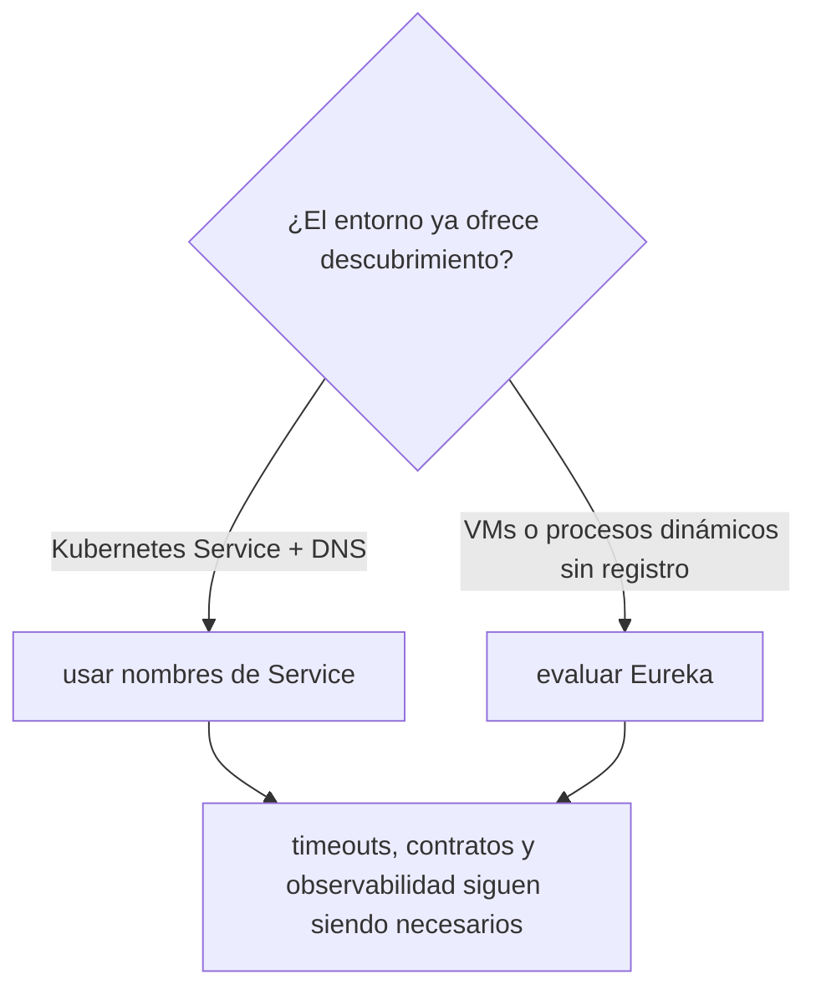
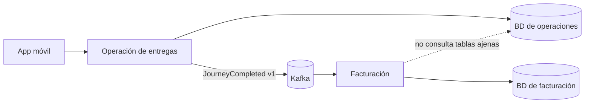

# Módulo 10: Microservicios con Spring Cloud

## Sílabo

**Objetivo general**

Coordinar múltiples servicios Spring Boot con configuración centralizada, descubrimiento de servicios, un gateway como punto de entrada único, y resiliencia con circuit breakers.

**Objetivos específicos**

1. Registrar y descubrir microservicios por nombre con Eureka.
2. Configurar Spring Cloud Gateway como punto de entrada único.
3. Explicar qué problema resuelve un Config Server centralizado.
4. Implementar un circuit breaker con Resilience4j y observar el fallback en acción.
5. Explicar el propósito de `@RefreshScope` para configuración dinámica.
6. Configurar gateway y servicios como Resource Servers con límites de confianza explícitos.
7. Elegir entre Eureka y descubrimiento nativo de Kubernetes sin duplicar infraestructura.
8. Diseñar límites de servicio con DDD y propiedad exclusiva de datos antes de distribuir el sistema.

**Contenido**

- Config Server.
- Service discovery (Eureka).
- Spring Cloud Gateway.
- Resiliencia con Resilience4j (circuit breaker).
- `@Retry`, `@RateLimiter`, `@Bulkhead` y `@TimeLimiter`.
- Spring Cloud Bus y `@RefreshScope`.
- OAuth2/OIDC con Keycloak, JWT, Token Relay y autorización en profundidad.
- HTTP Interfaces, deadlines y descubrimiento nativo en Kubernetes.
- DDD aplicado: capacidades de negocio, contexto delimitado, agregado y base de datos por servicio.

**Evaluación**

Dos microservicios Spring Boot comunicándose vía gateway con circuit breaker, más cuatro ejercicios de evaluación.

---

## Contenido teórico

### Tema 1: Config Server y service discovery

**Conceptos clave:** configuración centralizada respaldada por Git, resolución por nombre en vez de URL fija.

En un sistema con muchos microservicios independientes, cada uno manteniendo su propio `application.yml` local, cambiar un valor de configuración compartido entre varios servicios (una URL de un servicio externo común, por ejemplo) requeriría modificar y redesplegar cada servicio individual que use ese valor; un Config Server centraliza la configuración de todos los microservicios en un único lugar (típicamente respaldado por un repositorio Git, permitiendo versionar y revisar cambios de configuración como cualquier otro cambio de código), de modo que cambiar un valor compartido en el Config Server puede propagarse a todos los servicios que lo consumen sin necesidad de redesplegar cada uno individualmente.

`@FeignClient(name = "servicio-pedidos") interface PedidosClient { @GetMapping("/pedidos/{id}") Pedido obtener(@PathVariable Long id); }` demuestra el patrón de service discovery: en vez de codificar una URL fija hacia el servicio de pedidos (que podría cambiar según el entorno, o tener múltiples instancias corriendo simultáneamente para balanceo de carga), el cliente se resuelve por nombre lógico (`servicio-pedidos`), y Eureka (el servidor de registro, `@EnableEurekaServer`) mantiene un directorio actualizado de qué instancias físicas específicas corresponden actualmente a ese nombre lógico, permitiendo que instancias se agreguen, se quiten, o cambien de ubicación sin que el código cliente necesite ninguna actualización.

**Analogía:** un Config Server centralizado es como un directorio maestro de políticas compartidas entre todas las sucursales de una franquicia, actualizable en un único lugar en vez de tener que visitar cada sucursal individual para actualizar su copia local; el service discovery con Eureka es como un directorio telefónico que se actualiza automáticamente cada vez que una sucursal cambia de dirección, permitiendo que quien llame simplemente marque el nombre de la sucursal sin necesitar conocer su dirección física exacta y actualizada en cada momento.

**¿Por qué es importante?** Un Config Server centralizado evita tener que redesplegar cada microservicio individualmente ante un cambio de configuración compartida; el service discovery permite que los servicios se comuniquen por nombre lógico, tolerando cambios de ubicación o escalado de instancias sin actualizar el código cliente.

**Código del ejemplo:**

```java
@EnableEurekaServer // servidor de registro
@EnableDiscoveryClient // cada microservicio se registra aquí

@FeignClient(name = "servicio-pedidos") // se resuelve por nombre, no por URL fija
interface PedidosClient { @GetMapping("/pedidos/{id}") Pedido obtener(@PathVariable Long id); }
```

### Tema 2: Spring Cloud Gateway

**Conceptos clave:** punto de entrada único, enrutamiento centralizado.

`spring: cloud: gateway: routes: - id: pedidos uri: lb://servicio-pedidos predicates: [Path=/api/pedidos/**]` configura un único punto de entrada para todo el sistema de microservicios, enrutando cada petición entrante hacia el microservicio correcto según el patrón de la ruta solicitada (`/api/pedidos/**` dirigiéndose específicamente hacia `servicio-pedidos`, resuelto a su vez por service discovery mediante el prefijo `lb://`, indicando balanceo de carga entre las instancias disponibles de ese servicio).

Centralizar el enrutamiento en un gateway único es también un lugar natural para aplicar responsabilidades transversales como autenticación inicial, rate limiting y trazabilidad. Sin embargo, verificar un token únicamente en el gateway crea una frontera peligrosa si un servicio puede alcanzarse por otra ruta o si una identidad interna está comprometida. Cada servicio que protege datos debe validar el token o recibir una credencial interna verificable y aplicar autorización sobre el recurso; el gateway no sustituye la regla «esta entrega pertenece a esta identidad».

**Analogía:** un gateway es como la recepción única de un complejo de oficinas con múltiples departamentos internos, donde los visitantes se registran una única vez en la recepción y son dirigidos automáticamente al departamento correcto, en vez de que cada departamento individual tenga que gestionar su propia recepción y verificación de visitantes por separado.

**¿Por qué es importante?** Un gateway centraliza enrutamiento y controles de borde, pero mantener autorización en el servicio propietario evita que una ruta interna alternativa convierta el gateway en el único punto de seguridad de todo el sistema.

**Configuración del ejemplo:**

```yaml
spring:
  cloud:
    gateway:
      routes:
        - id: pedidos
          uri: lb://servicio-pedidos
          predicates: [Path=/api/pedidos/**]
```

### Tema 3: Circuit breaker con Resilience4j

**Conceptos clave:** abrir el circuito ante fallos repetidos, fallback inmediato.

`@CircuitBreaker(name = "servicioPedidos", fallbackMethod = "fallbackPedidos") public Pedido obtenerPedido(Long id) { return pedidosClient.obtener(id); } public Pedido fallbackPedidos(Long id, Exception e) { return Pedido.vacio(); }` protege una llamada a un servicio externo (o a otro microservicio) contra fallos repetidos y sostenidos: si `servicio-pedidos` comienza a fallar consistentemente (superando un umbral configurable de tasa de fallo), el circuit breaker "abre el circuito", dejando de intentar realizar la llamada real hacia ese servicio caído durante un período configurable, y en su lugar invocando inmediatamente el método de fallback (`fallbackPedidos`, devolviendo un resultado por defecto razonable), evitando que las peticiones se acumulen esperando indefinidamente una respuesta de un servicio que sabe, con alta probabilidad, que actualmente no va a responder exitosamente.

Sin un circuit breaker, un servicio caído puede arrastrar en cascada a todos los servicios que dependen de él: cada petición hacia el servicio caído esperaría su timeout completo antes de fallar, acumulando peticiones en espera activa que consumen recursos (threads, conexiones) del servicio que realiza la llamada, potencialmente agotando esos recursos y haciendo que ese servicio dependiente también empiece a fallar por agotamiento de recursos, propagando el fallo original en cascada hacia arriba en la cadena de dependencias del sistema completo. `@Retry`, `@RateLimiter`, `@Bulkhead` y `@TimeLimiter` son primitivas de resiliencia complementarias de Resilience4j: reintentar automáticamente ante fallos transitorios, limitar la tasa de peticiones salientes, aislar recursos (como pools de threads) por dependencia específica para que el agotamiento de uno no afecte a los demás, y establecer límites de tiempo explícitos para cualquier llamada individual, respectivamente.

**Analogía:** un circuit breaker es como un disyuntor eléctrico que corta automáticamente el circuito ante una sobrecarga detectada, evitando que el problema se propague y dañe el resto del sistema eléctrico, y que permite reintentar conectar la corriente después de un tiempo prudencial, en vez de dejar que la sobrecarga continúe indefinidamente causando daño acumulativo.

**¿Por qué es importante?** Un circuit breaker evita que las llamadas hacia un servicio caído se acumulen esperando indefinidamente, previniendo que un fallo se propague en cascada hacia los servicios dependientes por agotamiento de recursos compartidos.

**Código del ejemplo:**

```java
@CircuitBreaker(name = "servicioPedidos", fallbackMethod = "fallbackPedidos")
public Pedido obtenerPedido(Long id) { return pedidosClient.obtener(id); }
public Pedido fallbackPedidos(Long id, Exception e) { return Pedido.vacio(); }
```

### Tema 4: OAuth2/OIDC, Keycloak y Token Relay sin perder la frontera de autorización

**Conceptos clave:** Identity Provider, issuer, audience, scopes, roles, Resource Server, JWKS, token relay y service account.

Keycloak actúa como proveedor de identidad: autentica al usuario y emite un access token firmado. Spring Cloud Gateway y cada API protegida se configuran como **Resource Servers** usando el `issuer-uri`; Spring Security obtiene y rota las claves públicas mediante JWKS, valida firma, emisor y expiración. También debes comprobar que la audiencia corresponde a tu API: un token legítimo emitido para otro recurso no debería aceptarse automáticamente.

`roles` y `scopes` expresan capacidades generales, pero no propiedad. `ROLE_DRIVER` permite entrar al conjunto de operaciones del conductor; el caso de uso todavía debe verificar que `journeyId` corresponde al `sub` autenticado. Esta regla vive en el servicio dueño de jornadas, no únicamente en una ruta del gateway.

```yaml
spring:
  security:
    oauth2:
      resourceserver:
        jwt:
          issuer-uri: http://keycloak:8080/realms/rutaflow
```

```java
@Bean
SecurityFilterChain api(HttpSecurity http) throws Exception {
    return http
        .authorizeHttpRequests(auth -> auth
            .requestMatchers("/actuator/health").permitAll()
            .requestMatchers(HttpMethod.POST, "/api/journeys/*/positions")
                .hasAuthority("SCOPE_location:write")
            .anyRequest().authenticated())
        .oauth2ResourceServer(oauth -> oauth.jwt(Customizer.withDefaults()))
        .build();
}
```

Token Relay reenvía el token del usuario a un servicio downstream cuando este necesita actuar dentro del mismo contexto del usuario. No lo uses por defecto en todas las llamadas: amplía la exposición del token y acopla servicios a permisos de una sesión humana. Para trabajos asíncronos o comunicación máquina a máquina usa credenciales de cliente con audiencia y scopes mínimos; conserva separada la identidad que inició la operación en metadatos auditables.

**Analogía:** el gateway es el control de entrada del edificio y el token es la credencial; cada archivo sensible conserva además su propia lista de personas autorizadas. Haber entrado al edificio no permite abrir cualquier expediente.

**¿Por qué es importante?** Firma válida responde «quién emitió esta credencial y si fue alterada»; audiencia, scope y propiedad responden preguntas adicionales. Confundirlas produce acceso horizontal entre usuarios o reutilización de tokens fuera de contexto.

**Práctica verificable:** inicia Keycloak y dos APIs con Docker Compose. Prueba token ausente (`401`), scope insuficiente (`403`), audiencia incorrecta, token vencido y conductor intentando modificar una jornada ajena. Registra solamente `sub`, decisión y correlation ID; nunca el JWT completo.

### Tema 5: HTTP Interfaces, deadlines y descubrimiento según el entorno

**Conceptos clave:** contrato cliente, WebClient, RestClient, HTTP Service Interface, timeout, deadline, load balancing, DNS y Kubernetes Service.

Una interfaz HTTP declarativa describe el contrato de la dependencia sin mezclarlo con la regla de negocio. Spring crea un proxy cliente sobre `RestClient` o `WebClient`; eso reduce código repetitivo, pero no elimina fallos de red, compatibilidad ni la necesidad de pruebas de contrato.

```java
@HttpExchange("/api/routes")
interface RouteClient {
    @GetExchange("/{journeyId}")
    RouteSnapshot find(@PathVariable UUID journeyId);
}

@Bean
RouteClient routeClient(RestClient.Builder builder) {
    RestClient restClient = builder.baseUrl("http://route-service").build();
    HttpServiceProxyFactory factory = HttpServiceProxyFactory
        .builderFor(RestClientAdapter.create(restClient)).build();
    return factory.createClient(RouteClient.class);
}
```

Define un deadline total de la operación y reparte presupuestos menores a cada llamada. Un timeout de conexión, uno de lectura y un circuit breaker responden a fallos diferentes. No agregues retries simultáneamente en móvil, gateway y cada servicio: tres capas con tres intentos pueden convertir una petición en 27 llamadas. Solo reintenta operaciones seguras o idempotentes, con backoff, jitter y observabilidad.

Eureka es útil cuando las aplicaciones necesitan un registro gestionado por la propia plataforma Spring fuera de un orquestador que ya resuelva servicios. En Kubernetes, un `Service` y DNS proporcionan nombre estable y balanceo hacia Pods; desplegar Eureka además puede duplicar descubrimiento, health y operación sin aportar una garantía necesaria. ConfigMap/Secret tampoco reemplazan automáticamente Config Server: elige según versionado, refresh, auditoría y modelo operacional, no por copiar una arquitectura.



**Analogía:** instalar Eureka dentro de Kubernetes sin una necesidad concreta es mantener dos directorios telefónicos para la misma oficina; cuando difieren, el problema operativo aumenta en vez de resolverse.

**¿Por qué es importante?** La arquitectura debe aprovechar garantías reales del entorno. Agregar infraestructura duplicada eleva fallos y mantenimiento, mientras un cliente declarativo sin deadlines únicamente hace más elegante una llamada que todavía puede bloquearse.

**Fallo deliberado:** añade 800 ms de latencia al servicio de rutas y configura un deadline total de 500 ms. Verifica que la respuesta falle con semántica explícita, que no se devuelva una ruta vacía fingiendo éxito y que la traza muestre en qué dependencia se consumió el presupuesto.

### Tema 6: DDD para decidir límites y propiedad de datos

**Conceptos clave:** capacidad de negocio, contexto delimitado, lenguaje ubicuo, agregado, invariante, propiedad de datos y monolito modular.

Un microservicio no es una capa técnica ni una tabla aislada. En RutaFlow, `Journey` pertenece al contexto **Operación de entregas** porque allí viven reglas como «una jornada cerrada no acepta nuevas posiciones». `Invoice` pertenece a **Facturación**, donde las reglas hablan de impuestos, conceptos y asientos. Que ambos conceptos compartan el identificador del envío no significa que deban compartir modelo, repositorio ni tablas.

Un **contexto delimitado** define dónde un término mantiene un significado coherente. Dentro de él, un **agregado** protege invariantes en una única frontera transaccional. El servicio propietario cambia su estado; los demás consultan un contrato o reaccionan a eventos. Una foreign key entre bases de servicios, una consulta directa a la tabla ajena o una entidad JPA compartida rompen esa autonomía: una migración interna puede detener varios despliegues y ya no existe un dueño claro de la regla.

Empieza con un monolito modular cuando los límites todavía son hipótesis. Mantén paquetes y dependencias explícitas; extrae un servicio solo cuando exista una razón medible, como escalado independiente, aislamiento de fallos, ritmo de cambio distinto o responsabilidad de equipo. DDD ayuda a descubrir límites, pero no obliga a desplegar cada contexto como proceso independiente.

```text
rutaflow/
├── operations-service/
│   └── src/main/java/com/rutaflow/operations/journey/
│       ├── domain/Journey.java
│       ├── application/RecordPosition.java
│       └── infrastructure/JourneyJpaRepository.java
└── billing-service/
    └── src/main/java/com/rutaflow/billing/invoice/
        ├── domain/Invoice.java
        ├── application/CreateInvoice.java
        └── infrastructure/InvoiceJpaRepository.java
```

```java
public final class Journey {
    private JourneyStatus status;
    private final List<Position> positions = new ArrayList<>();

    public void record(Position position) {
        if (status == JourneyStatus.CLOSED) {
            throw new JourneyAlreadyClosed();
        }
        positions.add(position);
    }
}
```

El caso de uso carga el agregado mediante un puerto del contexto de operaciones, ejecuta `record` y persiste. Facturación no importa `Journey.java`: consume un `JourneyCompleted` versionado con los datos mínimos que necesita. Así, el dominio conserva la regla y Kafka o JPA siguen siendo detalles reemplazables en la periferia.

**Analogía:** cada contexto es un departamento con vocabulario, expedientes y autoridad propios. Puede enviar un documento firmado a otro departamento, pero no entrar a modificar directamente sus archivadores.



**¿Por qué es importante?** Spring Cloud resuelve problemas de coordinación entre servicios; no corrige una separación de dominio equivocada. Distribuir primero y descubrir después los límites produce transacciones imposibles, llamadas circulares y cambios coordinados.

**Práctica verificable:** crea `docs/context-map.md` con los contextos Operaciones, Rutas, Identidad, Notificaciones y Facturación. Para cada uno registra lenguaje, reglas, datos propios, contratos publicados y consumidor. Implementa `Journey.record` en la ruta mostrada y prueba que una jornada cerrada rechaza posiciones sin acceder a Kafka ni PostgreSQL.

**Resultado esperado:** la prueba unitaria falla antes de implementar la invariante y queda verde después; ninguna clase de facturación importa entidades de operaciones; cada migración SQL vive dentro del servicio propietario.

**Fallo deliberado:** permite que facturación consulte `operations.journeys` directamente y cambia el nombre de una columna. Documenta qué despliegues se rompen; reemplaza el acoplamiento por un contrato HTTP o evento según la necesidad de consistencia.

---

## Criterio transversal de calidad del código

Aplica estas decisiones en todos los ejemplos y en tu entrega:

- usa nombres que expresen intención, dominio y unidades; evita `data`, `temp`, `manager` o `process` cuando exista un término preciso;
- mantén funciones, componentes, clases, consultas y módulos cohesionados alrededor de una responsabilidad comprobable;
- haz visibles las dependencias y los efectos de red, tiempo, archivos, estado y base de datos;
- valida entradas en la frontera y representa errores con contexto, sin ocultar la causa ni registrar secretos;
- elimina duplicación de reglas, no toda repetición textual; una abstracción incorrecta cuesta más que dos líneas parecidas;
- escribe primero la solución más simple que satisface el requisito y refactoriza con pruebas verdes;
- aplica SOLID únicamente cuando exista una necesidad real de cambio, extensión, sustitución o aislamiento.

**SOLID con criterio:** responsabilidad única significa una razón coherente de cambio, no una clase por función. Abierto/cerrado justifica estrategias cuando hay variantes reales. Sustitución exige respetar contratos. Segregación evita obligar a consumidores a depender de operaciones que no usan. Inversión de dependencias protege el dominio frente a detalles externos; no exige crear interfaces para cada objeto.

**Comprobación antes de continuar:** ¿otra persona puede entender los nombres y el flujo?, ¿los casos de error son observables?, ¿una prueba demuestra la regla principal?, ¿cada abstracción aporta más claridad de la que cuesta? Registra una decisión de refactorización y una decisión consciente de *no abstraer*.

## Laboratorio práctico

**Objetivo del laboratorio:** construir dos microservicios Spring Boot comunicándose vía gateway con circuit breaker.

**Requisitos previos:** Módulos 0-9 completados.

| Paso | Acción | Código | Explicación |
|---|---|---|---|
| 1 | Levantar dos microservicios que se comuniquen por HTTP | — | Verifica la comunicación básica |
| 2 | Registrar ambos en Eureka | Ver Tema 1 | Descubrimiento por nombre, no URL fija |
| 3 | Configurar Spring Cloud Gateway | Ver Tema 2 | Punto de entrada único |
| 4 | Agregar un circuit breaker con Resilience4j | Ver Tema 3 | Simula un fallo y observa el fallback |
| 5 | Proteger gateway y API con Keycloak | Ver Tema 4 | Distingue 401, 403, scope y propiedad |
| 6 | Implementar un cliente HTTP declarativo | Ver Tema 5 | Inyecta latencia y respeta el deadline total |
| 7 | Ejecutar en Kubernetes local | Ver Tema 5 | Compara DNS nativo con la necesidad real de Eureka |
| 8 | Definir contextos y datos propietarios | Ver Tema 6 | Implementa una invariante sin infraestructura y publica un contrato mínimo |

**Verificación:** el laboratorio se considera exitoso si el gateway enruta correctamente hacia ambos microservicios según la ruta solicitada, y si el circuit breaker efectivamente invoca el fallback tras simular fallos repetidos del servicio dependiente.

**Errores comunes y soluciones**

- **Codificar URLs fijas entre microservicios.** Usa service discovery para resolver por nombre lógico.
- **No configurar un circuit breaker para llamadas entre servicios.** Sin él, un servicio caído puede arrastrar en cascada a sus dependientes.
- **Confiar toda la seguridad al gateway.** Autentica en el borde, pero cada servicio protegido valida la credencial y autoriza el recurso que posee.
- **Acumular retries en todas las capas.** Define un único presupuesto y reintenta solamente operaciones seguras; mide la amplificación resultante.
- **Dividir servicios por entidades o compartir su base de datos.** Separa por capacidades y reglas; un único servicio es dueño de cada dato y publica contratos.

---


## Rúbrica del proyecto

Esta rúbrica evalúa el laboratorio y los ejercicios como evidencia de dominio, no la mera finalización de pasos.

| Criterio | Peso | Evidencia esperada |
|---|---:|---|
| Comprensión conceptual | 20% | Explica el mecanismo, sus límites y por qué la solución funciona. |
| Implementación funcional | 30% | El artefacto satisface requisitos normales, límite y de error. |
| Verificación | 20% | Incluye pruebas, mediciones o inspecciones reproducibles. |
| Diseño y calidad | 15% | Nombres, estructura, seguridad y mantenibilidad son deliberados. |
| Comunicación profesional | 15% | README, decisiones, comandos y resultados permiten repetir el trabajo. |

Se alcanza competencia con 70/100 y sin cero en implementación o verificación. El nivel experto exige comparar alternativas, justificar trade-offs y reconocer condiciones donde la solución dejaría de ser válida.

## Bibliografía y fundamento académico

Estas fuentes sustentan los conceptos y deben consultarse para verificar detalles que cambian entre versiones:

- VMware/Broadcom, documentación de *Spring Framework* y *Spring Boot*.
- IETF, especificaciones HTTP y OAuth 2.0.
- OWASP Foundation, *Application Security Verification Standard*.
- ACM/IEEE-CS/AAAI, *Computer Science Curricula 2023*.
- IEEE Computer Society, *SWEBOK Guide V4.0*.

## Resumen del módulo

**Puntos clave**

- Un Config Server centralizado evita redespliegues individuales ante cambios de configuración compartida.
- El service discovery con Eureka resuelve servicios por nombre lógico, tolerando cambios de ubicación o escalado.
- Spring Cloud Gateway centraliza el enrutamiento y responsabilidades transversales como autenticación y rate limiting.
- Un circuit breaker con Resilience4j previene que un servicio caído arrastre en cascada a sus dependientes.
- DDD permite definir límites y dueños; Spring Cloud coordina servicios ya bien delimitados.

**Conceptos aprendidos**

- Config Server y service discovery con Eureka.
- Spring Cloud Gateway.
- Circuit breaker y primitivas de resiliencia de Resilience4j.
- Contextos delimitados, agregados, invariantes y propiedad de datos.

**Próximos pasos**

En el Módulo 11 aprenderás empaquetado y despliegue: fat JAR frente a capas de Docker, GraalVM native image, y health checks para Kubernetes.

**Recursos adicionales**

- Documentación oficial de Spring Cloud (spring.io/projects/spring-cloud) y Resilience4j (resilience4j.readme.io).
