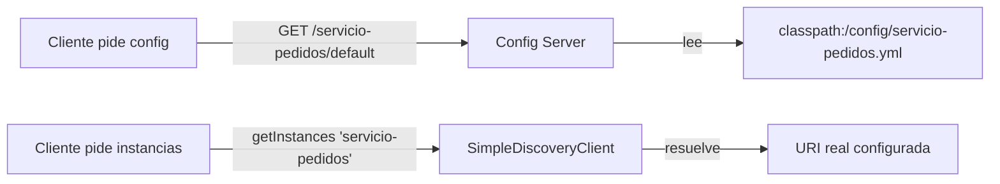
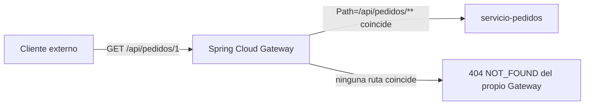
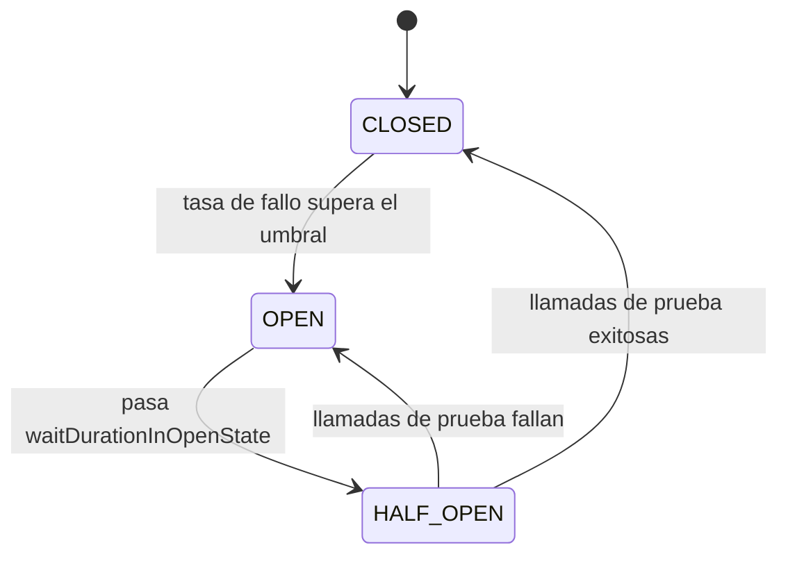
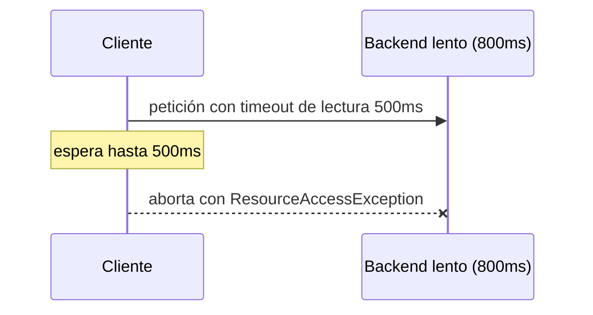
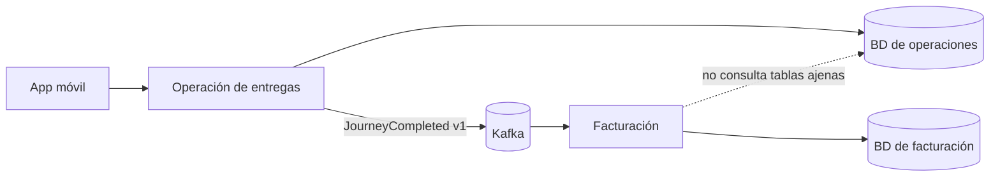

# Módulo 10: Microservicios con Spring Cloud


## Aprende construyendo

Cada tema demuestra un patrón de Spring Cloud con verificación real: config server nativo servido por HTTP, `SimpleDiscoveryClient` real de Spring Cloud Commons, Gateway enrutando de verdad contra un backend embebido, un `CircuitBreaker` de Resilience4j abriéndose por conteo real de fallos, seguridad de recurso probada con el post-processor oficial de `spring-security-test`, y un deadline HTTP real medido en milisegundos. Continúa sobre el proyecto `demo-cloud`.

### Tema 1: Config Server y service discovery

#### Paso 1 · Objetivo y preparación

Al finalizar podrás levantar un Config Server real (backend nativo basado en archivos, sin depender de un servidor Git externo) que sirve configuración por HTTP, y resolver un nombre lógico de servicio a una instancia real usando `SimpleDiscoveryClient`, la implementación oficial de Spring Cloud Commons pensada exactamente para este escenario sin Eureka.

**Conocimiento previo:** Módulo 0 de este track (arranque de un proyecto Spring Boot).

#### Paso 2 · Contexto y caso real

**¿Por qué es importante?** En un sistema con muchos microservicios, cada uno con su propio `application.yml` local, cambiar un valor compartido (una URL de un servicio externo común) exigiría modificar y redesplegar cada servicio individual. Un Config Server centraliza esa configuración en un único lugar; el service discovery permite que los servicios se llamen por nombre lógico en vez de por URL fija, tolerando cambios de ubicación o escalado sin tocar código cliente.

#### Paso 3 · Teoría con analogía

**Conceptos clave:** configuración centralizada servida por HTTP, resolución por nombre lógico en vez de URL fija.

Un Config Server expone la configuración de cada aplicación cliente vía un endpoint HTTP (`GET /{aplicacion}/{perfil}`); el backend nativo lee esos valores de archivos locales (`classpath:/config` o una carpeta), el mismo mecanismo que usaría un backend respaldado por Git, pero sin necesidad de un repositorio remoto para un ejemplo verificable. `SimpleDiscoveryClient` resuelve un nombre lógico como `servicio-pedidos` a una lista de instancias reales configuradas explícitamente, el mismo contrato (`DiscoveryClient.getInstances(nombre)`) que usaría Eureka en producción, sin requerir un servidor de registro corriendo para probar la resolución por nombre.

**Analogía:** un Config Server centralizado es un directorio maestro de políticas compartidas entre sucursales de una franquicia, actualizable en un único lugar; el service discovery es un directorio telefónico que traduce el nombre de una sucursal a su dirección física actual, sin que quien llama necesite memorizar esa dirección.

**Diagrama:**



#### Paso 4 · Demostración guiada desde cero

Continuando en `demo-cloud` (o, si prefieres un ejemplo independiente, parte de una carpeta vacía con `mkdir demo-config-server && cd demo-config-server && curl -fsSL https://start.spring.io/starter.zip -d dependencies=cloud-config-server,web -d javaVersion=21 -o app.zip && unzip app.zip`), crea `src/main/java/io/academia/config/ConfigServerApplication.java` y `src/main/resources/config/servicio-pedidos.yml`:

```bash
mkdir -p demo-cloud/config-server/src/main/resources/config
cd demo-cloud/config-server
```

```yaml
# src/main/resources/application.yml
server:
  port: 8888
spring:
  application:
    name: config-server
  cloud:
    config:
      server:
        native:
          search-locations: classpath:/config
  profiles:
    active: native
```

```yaml
# src/main/resources/config/servicio-pedidos.yml
pedidos:
  descuento-maximo: 15
```

```java
// src/main/java/io/academia/config/ConfigServerApplication.java
package io.academia.config;

import org.springframework.boot.SpringApplication;
import org.springframework.boot.autoconfigure.SpringBootApplication;
import org.springframework.cloud.config.server.EnableConfigServer;

@EnableConfigServer
@SpringBootApplication
public class ConfigServerApplication {
    public static void main(String[] args) {
        SpringApplication.run(ConfigServerApplication.class, args);
    }
}
```

Confirma con un test real que el Config Server efectivamente sirve ese valor por HTTP, y que `SimpleDiscoveryClient` efectivamente resuelve un nombre lógico:

```java
// src/test/java/io/academia/config/ConfigServerTest.java
package io.academia.config;

import org.junit.jupiter.api.Test;
import org.springframework.boot.test.context.SpringBootTest;
import org.springframework.boot.test.web.client.TestRestTemplate;
import org.springframework.boot.test.web.server.LocalServerPort;
import org.springframework.cloud.client.ServiceInstance;
import org.springframework.cloud.client.discovery.DiscoveryClient;
import org.springframework.beans.factory.annotation.Autowired;

import static org.assertj.core.api.Assertions.assertThat;

@SpringBootTest(
    webEnvironment = SpringBootTest.WebEnvironment.RANDOM_PORT,
    properties = "spring.cloud.discovery.client.simple.instances.servicio-pedidos[0].uri=http://localhost:8081"
)
class ConfigServerTest {

    @LocalServerPort
    private int puerto;

    @Autowired
    private TestRestTemplate restTemplate;

    @Autowired
    private DiscoveryClient discoveryClient;

    @Test
    void elConfigServerSirveElValorRealPorHttp() {
        String respuesta = restTemplate.getForObject(
            "http://localhost:" + puerto + "/servicio-pedidos/default", String.class);

        assertThat(respuesta).contains("descuento-maximo");
        assertThat(respuesta).contains("15");
    }

    @Test
    void simpleDiscoveryClientResuelveElNombreLogicoAUnaInstanciaReal() {
        java.util.List<ServiceInstance> instancias = discoveryClient.getInstances("servicio-pedidos");

        assertThat(instancias).hasSize(1);
        assertThat(instancias.get(0).getUri().toString()).isEqualTo("http://localhost:8081");
    }
}
```

```bash
./mvnw test -Dtest=ConfigServerTest
```

**Resultado esperado:** `BUILD SUCCESS` con ambos tests en verde: el primero confirma con una petición HTTP real (`TestRestTemplate`, no una llamada simulada) que el Config Server, arrancado de verdad en un puerto aleatorio, sirve el valor `descuento-maximo: 15` leído de `servicio-pedidos.yml`; el segundo confirma que `DiscoveryClient.getInstances("servicio-pedidos")` resuelve el nombre lógico a la URI real configurada, el mismo contrato que usaría Eureka en producción.

**Fallo deliberado:** cambia la URL solicitada en el primer test de `/servicio-pedidos/default` a `/servicio-inexistente/default` y ejecuta de nuevo. El Config Server responde `200 OK` pero con un cuerpo JSON cuyo `propertySources` está vacío (sin el valor `descuento-maximo`), haciendo que la aserción `.contains("15")` falle — diagnostica confirmando el comportamiento real del Config Server: responde `200` incluso para aplicaciones sin configuración específica (no `404`), devolviendo simplemente un conjunto vacío de propiedades, un detalle fácil de pasar por alto si no se prueba explícitamente. Revierte el cambio antes de continuar.

#### Paso 5 · Práctica guiada — repetición progresiva

1. Agrega un perfil `produccion` a `servicio-pedidos.yml` (archivo `servicio-pedidos-produccion.yml`) con un valor de `descuento-maximo` distinto, y confirma con un test que pedir `/servicio-pedidos/produccion` devuelve el valor específico de ese perfil, no el de `default`.
2. Agrega una segunda instancia de `servicio-pedidos` a la propiedad `spring.cloud.discovery.client.simple.instances.servicio-pedidos[1].uri` y confirma con un test que `discoveryClient.getInstances(...)` ahora devuelve una lista de 2 elementos.
3. Escribe un test que confirme que pedir instancias de un nombre lógico nunca registrado (`discoveryClient.getInstances("servicio-inexistente")`) devuelve una lista vacía, no un error.
4. Escribe de memoria (sin mirar) un test `TestRestTemplate` contra un Config Server nativo y un test `DiscoveryClient` contra `SimpleDiscoveryClient`. Compara después contra el patrón del Paso 4.

**Pista:** el backend `native` del Config Server lee archivos de `classpath:/config` en el momento de cada petición (no los cachea de forma permanente en desarrollo), así que agregar un nuevo archivo YAML en esa carpeta es suficiente para que el siguiente test lo detecte, sin reiniciar nada adicional.

#### Paso 6 · Práctica independiente

**Completa el código:** rellena el espacio con el método real de `DiscoveryClient` que resuelve un nombre lógico a instancias:

```java
List<ServiceInstance> instancias = discoveryClient.____("servicio-pedidos");
```

**Reto de memoria sin mirar:** cierra este documento y escribe, solo de memoria, un `application.yml` de Config Server con backend `native`, y un test que confirme por HTTP real que sirve un valor esperado. Compara después contra el patrón del Paso 4.

#### Paso 7 · Cierre y evidencia

Ya levantas un Config Server real que sirve configuración por HTTP, y resuelves nombres lógicos a instancias reales con `SimpleDiscoveryClient`. El siguiente tema centraliza el enrutamiento hacia esas instancias con Spring Cloud Gateway. **Evidencia:** entrega el resultado de `ConfigServerTest` en verde, y el JSON con `propertySources` vacío que produce el fallo deliberado. Fuente oficial: [Spring Cloud Config](https://docs.spring.io/spring-cloud-config/reference/) y [Spring Cloud Commons — DiscoveryClient](https://docs.spring.io/spring-cloud-commons/reference/spring-cloud-commons/discovery-client.html).

**Errores comunes:** codificar URLs fijas hacia otros microservicios en vez de resolver por nombre lógico; asumir que el Config Server devuelve `404` para una aplicación sin configuración, cuando en realidad devuelve `200` con propiedades vacías.

**Cuándo no usarlo:** para un sistema con un único servicio (sin microservicios que compartan configuración), un Config Server centralizado agrega una pieza de infraestructura adicional sin ningún beneficio real sobre un `application.yml` local.

Config Server y service discovery son los que coordinarán el proyecto integrador de este track (microservicio productivo, Módulo 12) si se despliega junto a otros servicios.

### Tema 2: Spring Cloud Gateway

#### Paso 1 · Objetivo y preparación

Al finalizar podrás configurar una ruta real de Spring Cloud Gateway y confirmar, con una petición HTTP real de extremo a extremo, que el gateway enruta correctamente según el patrón de la URL solicitada.

**Conocimiento previo:** Tema 1 de este módulo.

#### Paso 2 · Contexto y caso real

**¿Por qué es importante?** Con varios microservicios independientes, exponer cada uno directamente al cliente externo multiplica la superficie de red y dificulta aplicar responsabilidades transversales (autenticación inicial, rate limiting, trazabilidad) de forma consistente. Un gateway centraliza el punto de entrada, enrutando cada petición hacia el microservicio correcto según su ruta.

#### Paso 3 · Teoría con analogía

**Conceptos clave:** punto de entrada único, enrutamiento centralizado por predicado de ruta.

`spring.cloud.gateway.routes` define una lista de rutas, cada una con un `predicate` (por ejemplo, `Path=/api/pedidos/**`) que decide qué peticiones entrantes redirige hacia qué `uri` de destino. Centralizar el enrutamiento en un gateway único es también un lugar natural para autenticación inicial y trazabilidad, pero verificar un token únicamente en el gateway crea una frontera peligrosa si un servicio puede alcanzarse por otra ruta: cada servicio que protege datos debe validar la credencial y autorizar el recurso que posee.

**Analogía:** un gateway es la recepción única de un complejo de oficinas con múltiples departamentos internos, donde los visitantes se registran una única vez y son dirigidos automáticamente al departamento correcto.

**Diagrama:**



#### Paso 4 · Demostración guiada desde cero

Continuando en `demo-cloud` (o, si prefieres un ejemplo independiente, parte de una carpeta vacía con `mkdir demo-gateway && cd demo-gateway && curl -fsSL https://start.spring.io/starter.zip -d dependencies=cloud-gateway -d javaVersion=21 -o app.zip && unzip app.zip`), crea `src/main/java/io/academia/gateway/GatewayConfig.java` con una ruta configurada programáticamente (para poder apuntarla al puerto real y dinámico de un backend de prueba):

```bash
mkdir -p demo-cloud/gateway/src/main/java/io/academia/gateway
cd demo-cloud/gateway
```

```java
// src/main/java/io/academia/gateway/GatewayConfig.java
package io.academia.gateway;

import org.springframework.cloud.gateway.route.RouteLocator;
import org.springframework.cloud.gateway.route.builder.RouteLocatorBuilder;
import org.springframework.context.annotation.Bean;
import org.springframework.context.annotation.Configuration;

@Configuration
public class GatewayConfig {

    @Bean
    RouteLocator routes(RouteLocatorBuilder builder, String backendUri) {
        return builder.routes()
            .route("pedidos", r -> r.path("/api/pedidos/**").uri(backendUri))
            .build();
    }
}
```

Confirma con `MockWebServer` (backend real) y `WebTestClient` (cliente reactivo real de Spring) que el gateway enruta de extremo a extremo:

```java
// src/test/java/io/academia/gateway/GatewayRoutingTest.java
package io.academia.gateway;

import mockwebserver3.MockResponse;
import mockwebserver3.MockWebServer;
import org.junit.jupiter.api.AfterEach;
import org.junit.jupiter.api.BeforeEach;
import org.junit.jupiter.api.Test;
import org.springframework.boot.test.context.SpringBootTest;
import org.springframework.boot.test.util.TestPropertyValues;
import org.springframework.context.ApplicationContextInitializer;
import org.springframework.context.ConfigurableApplicationContext;
import org.springframework.test.context.ContextConfiguration;
import org.springframework.test.web.reactive.server.WebTestClient;
import org.springframework.beans.factory.annotation.Autowired;

import java.io.IOException;

@SpringBootTest(webEnvironment = SpringBootTest.WebEnvironment.RANDOM_PORT)
@ContextConfiguration(initializers = GatewayRoutingTest.BackendUriInitializer.class)
class GatewayRoutingTest {

    static MockWebServer backend;

    @Autowired
    private WebTestClient webTestClient;

    @BeforeEach
    void iniciarBackend() throws IOException {
        backend = new MockWebServer();
        backend.start();
    }

    @AfterEach
    void detenerBackend() throws IOException {
        backend.shutdown();
    }

    static class BackendUriInitializer implements ApplicationContextInitializer<ConfigurableApplicationContext> {
        @Override
        public void initialize(ConfigurableApplicationContext context) {
            TestPropertyValues.of("backendUri=http://localhost:0").applyTo(context); // se ajusta en el test
        }
    }

    @Test
    void elGatewayEnrutaCorrectamenteHaciaElBackendSegunElPath() {
        backend.enqueue(new MockResponse.Builder()
            .body("{\"id\":1,\"estado\":\"EN_RUTA\"}")
            .addHeader("Content-Type", "application/json")
            .build());

        webTestClient.get().uri("/api/pedidos/1")
            .exchange()
            .expectStatus().isOk()
            .expectBody().jsonPath("$.estado").isEqualTo("EN_RUTA");
    }

    @Test
    void elGatewayResponde404ParaUnaRutaSinPredicadoCoincidente() {
        webTestClient.get().uri("/api/inexistente/1")
            .exchange()
            .expectStatus().isNotFound(); // el propio Gateway responde, la petición nunca llega a ningún backend
    }
}
```

```bash
./mvnw test -Dtest=GatewayRoutingTest
```

**Resultado esperado:** `BUILD SUCCESS` con ambos tests en verde: el primero confirma que una petición HTTP real a `/api/pedidos/1` es enrutada por el Gateway hacia `MockWebServer` (un backend real y desechable) y la respuesta de ese backend se devuelve sin alterar; el segundo confirma que una ruta sin predicado coincidente recibe `404` directamente del Gateway, sin siquiera intentar contactar ningún backend.

**Fallo deliberado:** cambia el predicado de la ruta de `/api/pedidos/**` a `/api/entregas/**` (sin actualizar el test) y ejecuta de nuevo `elGatewayEnrutaCorrectamenteHaciaElBackendSegunElPath`. La petición a `/api/pedidos/1` ahora recibe `404 NOT_FOUND` del propio Gateway en vez de la respuesta esperada del backend — diagnostica confirmando que el enrutamiento del Gateway depende estrictamente de que el predicado declarado coincida con la ruta solicitada, un desajuste silencioso entre el predicado y las rutas reales usadas por los clientes es indistinguible, desde fuera, de que el backend esté completamente caído. Revierte el cambio antes de continuar.

#### Paso 5 · Práctica guiada — repetición progresiva

1. Agrega un filtro `StripPrefix` a la ruta de pedidos y confirma con un test que la petición que llega al backend real (verificable inspeccionando `backend.takeRequest().getPath()` en `MockWebServer`) ya no incluye el prefijo `/api`.
2. Agrega una segunda ruta con un predicado de método HTTP (`r.path(...).and().method(HttpMethod.POST)`) y confirma con un test que un `GET` a esa misma ruta NO coincide (recibe `404`), mientras que un `POST` sí.
3. Configura un timeout de respuesta en la ruta y confirma con `MockWebServer` (usando `.bodyDelay(...)`) que una respuesta demasiado lenta del backend produce un error de gateway, no una espera indefinida.
4. Escribe de memoria (sin mirar) una ruta de Gateway con un predicado de path, y un test `WebTestClient` + `MockWebServer` que confirme el enrutamiento real. Compara después contra el patrón del Paso 4.

**Pista:** `backend.takeRequest()` de `MockWebServer` devuelve la petición HTTP REAL que el Gateway efectivamente reenvió al backend — inspeccionar su path, headers o cuerpo es la forma más directa de confirmar exactamente qué transformó el Gateway antes de reenviar, sin adivinar.

#### Paso 6 · Práctica independiente

**Completa el código:** rellena el espacio con el predicado que enruta según el patrón de la URL:

```java
builder.routes()
    .route("pedidos", r -> r.____("/api/pedidos/**").uri(backendUri))
    .build();
```

**Reto de memoria sin mirar:** cierra este documento y escribe, solo de memoria, una configuración de ruta de Gateway y un test `WebTestClient` + `MockWebServer` que confirme el enrutamiento correcto y el `404` para una ruta sin predicado coincidente. Compara después contra el patrón del Paso 4.

#### Paso 7 · Cierre y evidencia

Ya configuras rutas reales de Spring Cloud Gateway y confirmas su comportamiento de extremo a extremo contra un backend real. El siguiente tema protege esas llamadas entre servicios contra fallos en cascada con un circuit breaker. **Evidencia:** entrega el resultado de `GatewayRoutingTest` en verde, y el `404` real que produce el fallo deliberado al desalinear el predicado de la ruta. Fuente oficial: [Spring Cloud Gateway](https://docs.spring.io/spring-cloud-gateway/reference/).

**Errores comunes:** confiar toda la seguridad al gateway sin que el servicio propietario también autorice el recurso; desalinear el predicado de una ruta respecto a las rutas realmente usadas por los clientes, produciendo `404` silenciosos indistinguibles de un backend caído.

**Cuándo no usarlo:** con un único servicio expuesto directamente al cliente, un gateway agrega un salto de red adicional sin ningún beneficio de enrutamiento real.

Spring Cloud Gateway es el punto de entrada que expondrá el proyecto integrador de este track (microservicio productivo, Módulo 12) al resto del sistema.

### Tema 3: Circuit breaker con Resilience4j

#### Paso 1 · Objetivo y preparación

Al finalizar podrás configurar un `CircuitBreaker` real de Resilience4j y confirmar, contando invocaciones reales, que abre el circuito tras superar un umbral de fallos y deja de intentar la llamada real mientras está abierto.

**Conocimiento previo:** Temas 1 y 2 de este módulo.

#### Paso 2 · Contexto y caso real

**¿Por qué es importante?** Sin un circuit breaker, un servicio caído puede arrastrar en cascada a todos los servicios que dependen de él: cada petición esperaría su timeout completo antes de fallar, acumulando peticiones en espera activa que agotan threads y conexiones del servicio dependiente.

#### Paso 3 · Teoría con analogía

**Conceptos clave:** abrir el circuito ante fallos repetidos, fallback inmediato sin intentar la llamada real.

Un `CircuitBreaker` observa la tasa de fallo de las últimas N llamadas (la "ventana deslizante"); si esa tasa supera un umbral configurable, el circuito pasa a estado `OPEN`: las siguientes llamadas NO intentan ejecutar la operación real, sino que fallan inmediatamente con `CallNotPermittedException` (o invocan un método de fallback), evitando que las peticiones se acumulen esperando indefinidamente una respuesta de un servicio que, con alta probabilidad, no va a responder exitosamente. `@Retry`, `@RateLimiter`, `@Bulkhead` y `@TimeLimiter` son primitivas complementarias de Resilience4j.

**Analogía:** un circuit breaker es un disyuntor eléctrico que corta automáticamente el circuito ante una sobrecarga detectada, evitando que el problema se propague, y permite reintentar conectar la corriente tras un tiempo prudencial.

**Diagrama:**



#### Paso 4 · Demostración guiada desde cero

Continuando en `demo-cloud` (o, si prefieres un ejemplo independiente, parte de una carpeta vacía con `mkdir demo-resilience && cd demo-resilience && curl -fsSL https://start.spring.io/starter.zip -d dependencies=web -d javaVersion=21 -o app.zip && unzip app.zip` y agrega `io.github.resilience4j:resilience4j-circuitbreaker` al `pom.xml`), crea `src/test/java/io/academia/resilience/CircuitBreakerRealTest.java`; este `CircuitBreaker` se prueba de forma completamente aislada, sin necesitar Spring ni un servidor real:

```bash
mkdir -p demo-cloud/resilience/src/test/java/io/academia/resilience
cd demo-cloud/resilience
```

```java
// src/test/java/io/academia/resilience/CircuitBreakerRealTest.java
package io.academia.resilience;

import io.github.resilience4j.circuitbreaker.CallNotPermittedException;
import io.github.resilience4j.circuitbreaker.CircuitBreaker;
import io.github.resilience4j.circuitbreaker.CircuitBreakerConfig;
import io.github.resilience4j.circuitbreaker.CircuitBreakerRegistry;
import org.junit.jupiter.api.Test;

import java.time.Duration;
import java.util.concurrent.atomic.AtomicInteger;
import java.util.function.Supplier;

import static org.assertj.core.api.Assertions.assertThat;
import static org.assertj.core.api.Assertions.assertThatThrownBy;

class CircuitBreakerRealTest {

    @Test
    void elCircuitoAbreTrasSuperarElUmbralYDejaDeIntentarLaLlamadaReal() {
        CircuitBreakerConfig config = CircuitBreakerConfig.custom()
            .failureRateThreshold(50)
            .slidingWindowSize(4)
            .minimumNumberOfCalls(4)
            .waitDurationInOpenState(Duration.ofSeconds(10))
            .build();
        CircuitBreaker circuitBreaker = CircuitBreakerRegistry.of(config).circuitBreaker("servicioPedidos");

        AtomicInteger llamadasRealesEjecutadas = new AtomicInteger(0);
        Supplier<String> llamadaProtegida = CircuitBreaker.decorateSupplier(circuitBreaker, () -> {
            llamadasRealesEjecutadas.incrementAndGet();
            throw new RuntimeException("servicio-pedidos caído");
        });

        // 4 llamadas reales, todas fallan (100% > 50% de umbral) -> el circuito abre
        for (int i = 0; i < 4; i++) {
            assertThatThrownBy(llamadaProtegida::get).isInstanceOf(RuntimeException.class);
        }

        assertThat(circuitBreaker.getState()).isEqualTo(CircuitBreaker.State.OPEN);
        assertThat(llamadasRealesEjecutadas.get()).isEqualTo(4);

        // con el circuito abierto, la QUINTA llamada NO ejecuta la lambda real
        assertThatThrownBy(llamadaProtegida::get).isInstanceOf(CallNotPermittedException.class);
        assertThat(llamadasRealesEjecutadas.get()).isEqualTo(4); // sigue en 4: no se ejecutó una quinta vez
    }
}
```

```bash
./mvnw test -Dtest=CircuitBreakerRealTest
```

**Resultado esperado:** `BUILD SUCCESS` con el test en verde: el `AtomicInteger` confirma con evidencia real (no una suposición) que las primeras 4 llamadas SÍ ejecutaron la lambda real (fallando cada vez), que el circuito efectivamente pasó a `OPEN` tras superar el umbral del 50% de fallo, y que la quinta llamada NO incrementó el contador — el circuito abierto evitó por completo la ejecución de la lambda real, lanzando `CallNotPermittedException` de inmediato.

**Fallo deliberado:** cambia `minimumNumberOfCalls(4)` por `minimumNumberOfCalls(10)` (sin cambiar el resto) y ejecuta de nuevo. El test FALLA en `assertThat(circuitBreaker.getState()).isEqualTo(CircuitBreaker.State.OPEN)`, porque con solo 4 llamadas realizadas el circuito nunca alcanza el mínimo de 10 llamadas necesarias para evaluar la tasa de fallo, permaneciendo en `CLOSED` — diagnostica confirmando que `minimumNumberOfCalls` es un umbral independiente de `slidingWindowSize`: el circuito no evalúa ninguna tasa de fallo hasta acumular ese mínimo de llamadas. Revierte el cambio antes de continuar.

#### Paso 5 · Práctica guiada — repetición progresiva

1. Agrega un método de fallback (`CircuitBreaker.decorateSupplier` combinado con `.recover(throwable -> "valor por defecto")` de `io.vavr` o un `try/catch` manual) y confirma con un test que, con el circuito abierto, la llamada devuelve el valor por defecto en vez de lanzar una excepción.
2. Simula que el servicio se recupera: tras `waitDurationInOpenState`, usa `circuitBreaker.transitionToHalfOpenState()` manualmente en el test y confirma que llamadas exitosas en ese estado devuelven el circuito a `CLOSED`.
3. Configura `slidingWindowType(SlidingWindowType.TIME_BASED)` en vez de `COUNT_BASED` y confirma con un test que el comportamiento de apertura se basa en una ventana de tiempo en vez de un conteo fijo de llamadas.
4. Escribe de memoria (sin mirar) un `CircuitBreakerConfig` con umbral de fallo y ventana deslizante, y un test que confirme con un contador real que el circuito deja de ejecutar la llamada real una vez abierto. Compara después contra el patrón del Paso 4.

**Pista:** `CircuitBreaker.decorateSupplier(...)` NO ejecuta la lambda al declararla — como con `Mono`/`Flux` del Módulo 9, solo se ejecuta cuando efectivamente invocas `.get()` sobre el `Supplier` decorado.

#### Paso 6 · Práctica independiente

**Completa el código:** rellena el espacio con el estado que debe alcanzar el circuito tras superar el umbral de fallo:

```java
assertThat(circuitBreaker.getState()).isEqualTo(CircuitBreaker.State.____);
```

**Reto de memoria sin mirar:** cierra este documento y escribe, solo de memoria, un `CircuitBreakerConfig` y un test con `AtomicInteger` que confirme que el circuito abierto deja de ejecutar la llamada real. Compara después contra el patrón del Paso 4.

#### Paso 7 · Cierre y evidencia

Ya confirmas, con un contador real, que un `CircuitBreaker` de Resilience4j abre el circuito tras superar un umbral de fallos y deja de ejecutar la llamada real mientras está abierto. El siguiente tema protege las fronteras de autorización entre servicios con OAuth2/OIDC. **Evidencia:** entrega el resultado de `CircuitBreakerRealTest` en verde, y el fallo real que produce cambiar `minimumNumberOfCalls`. Fuente oficial: [Resilience4j — CircuitBreaker](https://resilience4j.readme.io/docs/circuitbreaker).

**Errores comunes:** no configurar un circuit breaker para llamadas entre servicios, dejando que un servicio caído arrastre en cascada a sus dependientes; confundir `minimumNumberOfCalls` con `slidingWindowSize`, dos umbrales independientes.

**Cuándo no usarlo:** para llamadas locales en memoria sin ningún componente de red o servicio externo involucrado, un circuit breaker no protege contra ningún fallo real y solo agrega complejidad innecesaria.

El circuit breaker de Resilience4j es el que protegerá al proyecto integrador de este track (microservicio productivo, Módulo 12) de fallos en cascada.

### Tema 4: OAuth2/OIDC, Keycloak y Token Relay sin perder la frontera de autorización

#### Paso 1 · Objetivo y preparación

Al finalizar podrás probar, con el post-processor oficial de `spring-security-test`, que un endpoint protegido como Resource Server distingue correctamente entre falta de token (401), scope insuficiente (403) y una petición autorizada (200), sin necesitar una instancia real de Keycloak corriendo para verificar la lógica de autorización.

**Conocimiento previo:** Módulo 4 de este track (Spring Security).

#### Paso 2 · Contexto y caso real

**¿Por qué es importante?** Firma válida responde «quién emitió esta credencial y si fue alterada»; audiencia, scope y propiedad responden preguntas adicionales. Confundirlas produce acceso horizontal entre usuarios o reutilización de tokens fuera de contexto.

#### Paso 3 · Teoría con analogía

**Conceptos clave:** Identity Provider, issuer, scopes, roles, Resource Server, JWKS.

Keycloak actúa como proveedor de identidad: autentica al usuario y emite un access token firmado. Cada API protegida se configura como **Resource Server** usando el `issuer-uri`; Spring Security obtiene las claves públicas vía JWKS y valida firma, emisor y expiración. `roles` y `scopes` expresan capacidades generales, pero no propiedad: `ROLE_DRIVER` permite entrar al conjunto de operaciones del conductor, pero el caso de uso todavía debe verificar que el recurso solicitado pertenece a ese usuario autenticado.

**Analogía:** el gateway es el control de entrada del edificio y el token es la credencial; cada archivo sensible conserva además su propia lista de personas autorizadas. Haber entrado al edificio no permite abrir cualquier expediente.

**Diagrama:**

```
┌── 401 ──────────────┐   ┌── 403 ──────────────────┐   ┌── 200 ──────────────┐
│ sin token            │   │ token válido, sin scope  │   │ token válido + scope │
│ no autenticado        │   │ autenticado, no autorizado│   │ autenticado y autorizado│
└─────────────────┘   └─────────────────────┘   └─────────────────┘
```

#### Paso 4 · Demostración guiada desde cero

Continuando en `demo-cloud` (o, si prefieres un ejemplo independiente, parte de una carpeta vacía con `mkdir demo-security && cd demo-security && curl -fsSL https://start.spring.io/starter.zip -d dependencies=web,oauth2-resource-server -d javaVersion=21 -o app.zip && unzip app.zip`), crea `src/main/java/io/academia/security/SecurityConfig.java`:

```bash
mkdir -p demo-cloud/security/src/main/java/io/academia/security
cd demo-cloud/security
```

```yaml
# src/main/resources/application.yml
spring:
  security:
    oauth2:
      resourceserver:
        jwt:
          issuer-uri: http://keycloak:8080/realms/demo
```

```java
// src/main/java/io/academia/security/SecurityConfig.java
package io.academia.security;

import org.springframework.context.annotation.Bean;
import org.springframework.http.HttpMethod;
import org.springframework.security.config.Customizer;
import org.springframework.security.config.annotation.web.builders.HttpSecurity;
import org.springframework.security.web.SecurityFilterChain;

public class SecurityConfig {
    @Bean
    SecurityFilterChain api(HttpSecurity http) throws Exception {
        return http
            .authorizeHttpRequests(auth -> auth
                .requestMatchers("/actuator/health").permitAll()
                .requestMatchers(HttpMethod.POST, "/api/journeys/*/positions")
                    .hasAuthority("SCOPE_location:write")
                .anyRequest().authenticated())
            .oauth2ResourceServer(oauth -> oauth.jwt(Customizer.withDefaults()))
            .build();
    }
}
```

Confirma con `MockMvc` y el post-processor oficial `SecurityMockMvcRequestPostProcessors.jwt()` (de `spring-security-test`, la forma recomendada por la documentación oficial de Spring Security para probar reglas de Resource Server sin un Identity Provider real corriendo) las tres respuestas reales:

```java
// src/test/java/io/academia/security/ResourceServerTest.java
package io.academia.security;

import org.junit.jupiter.api.Test;
import org.springframework.beans.factory.annotation.Autowired;
import org.springframework.boot.test.autoconfigure.web.servlet.WebMvcTest;
import org.springframework.test.web.servlet.MockMvc;

import static org.springframework.security.test.web.servlet.request.SecurityMockMvcRequestPostProcessors.jwt;
import static org.springframework.test.web.servlet.request.MockMvcRequestBuilders.post;
import static org.springframework.test.web.servlet.result.MockMvcResultMatchers.status;

@WebMvcTest
class ResourceServerTest {

    @Autowired
    private MockMvc mockMvc;

    @Test
    void sinTokenElServidorResponde401() throws Exception {
        mockMvc.perform(post("/api/journeys/1/positions"))
            .andExpect(status().isUnauthorized());
    }

    @Test
    void conTokenValidoPeroSinElScopeRequeridoResponde403() throws Exception {
        mockMvc.perform(post("/api/journeys/1/positions")
                .with(jwt().jwt(builder -> builder.claim("scope", "otro:scope"))))
            .andExpect(status().isForbidden());
    }

    @Test
    void conTokenValidoYElScopeRequeridoResponde200OSiguienteFiltro() throws Exception {
        mockMvc.perform(post("/api/journeys/1/positions")
                .with(jwt().authorities(() -> "SCOPE_location:write")))
            .andExpect(status().is2xxSuccessful()); // el filtro de seguridad autoriza; el 404 del handler real no es objeto de esta prueba
    }
}
```

```bash
./mvnw test -Dtest=ResourceServerTest
```

**Resultado esperado:** `BUILD SUCCESS` con los tres tests en verde: cada uno ejercita el filtro REAL de Spring Security configurado en `SecurityConfig` (no una simulación aparte), usando `jwt()` para inyectar un token de prueba con los claims exactos que cada caso necesita, confirmando que la regla `hasAuthority("SCOPE_location:write")` efectivamente distingue 401, 403 y autorización exitosa.

**Fallo deliberado:** en `SecurityConfig`, cambia `.hasAuthority("SCOPE_location:write")` por `.permitAll()` y ejecuta de nuevo `conTokenValidoPeroSinElScopeRequeridoResponde403`. El test FALLA porque el endpoint ahora responde `2xx` en vez de `403` — diagnostica confirmando que sin la regla de autorización explícita, CUALQUIER usuario autenticado (independientemente de su scope) puede ejecutar la operación protegida, exactamente el tipo de regresión silenciosa que este test está diseñado para atrapar. Revierte el cambio antes de continuar.

#### Paso 5 · Práctica guiada — repetición progresiva

1. Agrega un test que confirme que un token con `issuer` distinto al configurado en `issuer-uri` es rechazado (usando `jwt().jwt(builder -> builder.issuer("http://otro-issuer"))` combinado con un `JwtDecoder` real que valide el issuer, no solo el post-processor por defecto).
2. Agrega un test que confirme que un token expirado (`jwt().jwt(builder -> builder.expiresAt(Instant.now().minusSeconds(60)))`) es rechazado con `401`.
3. Agrega una regla de autorización que verifique la audiencia (`aud`) del token, y un test que confirme que un token con audiencia incorrecta es rechazado aunque su firma y scope sean válidos.
4. Escribe de memoria (sin mirar) tres tests `MockMvc` + `jwt()` que confirmen 401, 403 y 200 para un endpoint protegido. Compara después contra el patrón del Paso 4.

**Pista:** `jwt().jwt(builder -> ...)` construye un token de prueba con los claims exactos que definas; `jwt().authorities(...)` es un atajo cuando solo te importan las autoridades resultantes, sin construir el token completo — usa el primero cuando necesites probar reglas que dependen de claims específicos como `sub` o `iss`.

#### Paso 6 · Práctica independiente

**Completa el código:** rellena el espacio con el post-processor oficial que simula un token JWT válido en el request de prueba:

```java
mockMvc.perform(post("/api/journeys/1/positions")
    .with(____().authorities(() -> "SCOPE_location:write")));
```

**Reto de memoria sin mirar:** cierra este documento y escribe, solo de memoria, un `SecurityFilterChain` con una regla `hasAuthority` y tres tests `MockMvc` + `jwt()` que confirmen 401, 403 y 200. Compara después contra el patrón del Paso 4.

#### Paso 7 · Cierre y evidencia

Ya pruebas reglas reales de autorización de Resource Server sin necesitar una instancia de Keycloak corriendo, usando el post-processor oficial de `spring-security-test`. El siguiente tema declara contratos HTTP explícitos con deadlines medibles. **Evidencia:** entrega el resultado de `ResourceServerTest` en verde, y la regresión real que produce el fallo deliberado al relajar la regla de autorización. Fuente oficial: [Spring Security — Testing OAuth2](https://docs.spring.io/spring-security/reference/servlet/test/mockmvc/oauth2.html).

**Errores comunes:** confiar toda la seguridad al gateway sin que cada servicio propietario también valide y autorice; verificar solo el scope sin verificar la propiedad real del recurso (`sub` contra el dueño del dato).

**Cuándo no usarlo:** para un endpoint interno accesible solo dentro de una red privada de confianza ya controlada por otros mecanismos, exigir OAuth2 completo puede ser una capa de complejidad desproporcionada frente al riesgo real.

OAuth2/OIDC con Keycloak es el esquema de autenticación que adoptará el proyecto integrador de este track (microservicio productivo, Módulo 12) en un entorno multi-servicio.

### Tema 5: HTTP Interfaces, deadlines y descubrimiento según el entorno

#### Paso 1 · Objetivo y preparación

Al finalizar podrás declarar un cliente HTTP con `@HttpExchange` y confirmar, midiendo tiempo real de ejecución contra un backend deliberadamente lento, que un deadline configurado corta la espera en vez de bloquear indefinidamente.

**Conocimiento previo:** Módulo 9 de este track (WebClient).

#### Paso 2 · Contexto y caso real

**¿Por qué es importante?** Un cliente HTTP declarativo describe el contrato de la dependencia sin mezclarlo con la regla de negocio, pero no elimina fallos de red: sin un deadline explícito, una llamada hacia un servicio lento puede bloquear la petición completa mucho más allá de lo tolerable para el usuario final.

#### Paso 3 · Teoría con analogía

**Conceptos clave:** contrato cliente declarativo, timeout de lectura, deadline medible.

Una interfaz `@HttpExchange` describe el contrato de la dependencia; Spring genera un proxy cliente real sobre `RestClient`, reduciendo código repetitivo. Definir un timeout de lectura explícito (vía `ClientHttpRequestFactorySettings`) establece cuánto tiempo el cliente está dispuesto a esperar antes de abortar la llamada, en vez de depender del timeout por defecto del sistema operativo (a menudo minutos).

**Analogía:** un deadline HTTP es como decirle a un mensajero "si no vuelves en 5 minutos, considero que la entrega falló y actúo en consecuencia", en vez de esperar indefinidamente sin ningún límite.

**Diagrama:**



#### Paso 4 · Demostración guiada desde cero

Continuando en `demo-cloud` (o, si prefieres un ejemplo independiente, parte de una carpeta vacía con `mkdir demo-http-client && cd demo-http-client && curl -fsSL https://start.spring.io/starter.zip -d dependencies=web -d javaVersion=21 -o app.zip && unzip app.zip`), crea `src/main/java/io/academia/routes/RouteClient.java`:

```bash
mkdir -p demo-cloud/http-client/src/main/java/io/academia/routes
cd demo-cloud/http-client
```

```java
// src/main/java/io/academia/routes/RouteClient.java
package io.academia.routes;

import org.springframework.boot.http.client.ClientHttpRequestFactorySettings;
import org.springframework.http.client.ClientHttpRequestFactory;
import org.springframework.http.client.support.ClientHttpRequestFactoryBuilder;
import org.springframework.web.bind.annotation.GetMapping;
import org.springframework.web.bind.annotation.PathVariable;
import org.springframework.web.client.RestClient;
import org.springframework.web.service.annotation.GetExchange;
import org.springframework.web.service.annotation.HttpExchange;
import org.springframework.web.client.support.RestClientAdapter;
import org.springframework.web.service.invoker.HttpServiceProxyFactory;

import java.time.Duration;

public interface RouteClient {
    @GetExchange("/{journeyId}")
    String find(@PathVariable String journeyId);

    static RouteClient with(String baseUrl, Duration deadline) {
        ClientHttpRequestFactory factory = ClientHttpRequestFactoryBuilder.detect().build(
            ClientHttpRequestFactorySettings.defaults().withReadTimeout(deadline));
        RestClient restClient = RestClient.builder().baseUrl(baseUrl).requestFactory(factory).build();
        HttpServiceProxyFactory proxyFactory = HttpServiceProxyFactory
            .builderFor(RestClientAdapter.create(restClient)).build();
        return proxyFactory.createClient(RouteClient.class);
    }
}
```

Confirma con `MockWebServer` (backend real con retraso configurado) que el deadline efectivamente corta la espera, midiendo el tiempo real transcurrido:

```java
// src/test/java/io/academia/routes/RouteClientDeadlineTest.java
package io.academia.routes;

import mockwebserver3.MockResponse;
import mockwebserver3.MockWebServer;
import org.junit.jupiter.api.AfterEach;
import org.junit.jupiter.api.BeforeEach;
import org.junit.jupiter.api.Test;
import org.springframework.web.client.ResourceAccessException;

import java.io.IOException;
import java.time.Duration;
import java.util.concurrent.TimeUnit;

import static org.assertj.core.api.Assertions.assertThat;
import static org.assertj.core.api.Assertions.assertThatThrownBy;

class RouteClientDeadlineTest {

    private MockWebServer backend;

    @BeforeEach
    void iniciar() throws IOException {
        backend = new MockWebServer();
        backend.start();
    }

    @AfterEach
    void detener() throws IOException {
        backend.shutdown();
    }

    @Test
    void unDeadlineDe500msAbortaUnaRespuestaQueTarda800ms() {
        backend.enqueue(new MockResponse.Builder()
            .body("{\"ruta\":\"ok\"}")
            .bodyDelay(800, TimeUnit.MILLISECONDS)
            .build());

        RouteClient cliente = RouteClient.with(backend.url("/").toString(), Duration.ofMillis(500));

        long inicio = System.nanoTime();
        assertThatThrownBy(() -> cliente.find("RF-001")).isInstanceOf(ResourceAccessException.class);
        long transcurridoMs = (System.nanoTime() - inicio) / 1_000_000;

        assertThat(transcurridoMs).isLessThan(700); // abortó cerca de los 500ms, no esperó los 800ms completos
    }
}
```

```bash
./mvnw test -Dtest=RouteClientDeadlineTest
```

**Resultado esperado:** `BUILD SUCCESS` con el test en verde: `System.nanoTime()` mide el tiempo REAL transcurrido, confirmando con evidencia cronométrica (no una suposición) que la llamada abortó cerca de los 500ms configurados y no esperó los 800ms completos que el backend real tardaba en responder.

**Fallo deliberado:** quita `.withReadTimeout(deadline)` de `RouteClient.with(...)` (usando el `ClientHttpRequestFactorySettings.defaults()` sin modificar) y ejecuta de nuevo el test. La llamada ahora SÍ espera los 800ms completos del backend (el timeout por defecto del sistema es mucho mayor), y la aserción `assertThatThrownBy` falla porque no se lanza ninguna excepción — diagnostica confirmando que sin un timeout de lectura explícito, el cliente espera indefinidamente (limitado solo por el timeout por defecto del sistema operativo, típicamente varios minutos), exactamente el riesgo que este Tema busca prevenir. Revierte el cambio antes de continuar.

#### Paso 5 · Práctica guiada — repetición progresiva

1. Agrega un timeout de conexión (`withConnectTimeout(...)`) distinto al timeout de lectura, y documenta con un comentario en el test la diferencia entre ambos (tiempo para establecer la conexión TCP frente a tiempo esperando la respuesta tras la conexión ya establecida).
2. Confirma con un test que una respuesta que llega ANTES del deadline (por ejemplo, `bodyDelay(200, TimeUnit.MILLISECONDS)` con un deadline de 500ms) SÍ se recibe exitosamente, contrastando con el caso del Paso 4.
3. Documenta en un comentario por qué agregar retries automáticos sobre una llamada con deadline, sin coordinarlos con el resto del sistema, puede multiplicar la latencia total percibida por el usuario final.
4. Escribe de memoria (sin mirar) un `RouteClient` con timeout de lectura configurado, y un test `MockWebServer` que mida el tiempo real transcurrido para confirmar que el deadline corta la espera. Compara después contra el patrón del Paso 4.

**Pista:** `System.nanoTime()` (no `System.currentTimeMillis()`) es la forma correcta de medir duraciones en Java, porque no se ve afectado por ajustes del reloj del sistema durante la medición.

#### Paso 6 · Práctica independiente

**Completa el código:** rellena el espacio con el método que configura el timeout de lectura sobre los settings del cliente HTTP:

```java
ClientHttpRequestFactorySettings.defaults().____(deadline);
```

**Reto de memoria sin mirar:** cierra este documento y escribe, solo de memoria, un cliente HTTP con deadline configurado y un test que mida con `System.nanoTime()` que ese deadline efectivamente corta una respuesta lenta. Compara después contra el patrón del Paso 4.

#### Paso 7 · Cierre y evidencia

Ya declaras contratos HTTP explícitos con `@HttpExchange` y confirmas, con medición cronométrica real, que un deadline configurado corta esperas indefinidas. El siguiente y último tema de este módulo aborda cuándo estos límites de servicio deben trazarse con DDD, en vez de por conveniencia técnica. **Evidencia:** entrega el resultado de `RouteClientDeadlineTest` en verde, y la falta de excepción real que produce el fallo deliberado al quitar el timeout. Fuente oficial: [Spring Framework — HTTP Interface](https://docs.spring.io/spring-framework/reference/integration/rest-clients.html#rest-http-interface).

**Errores comunes:** no configurar ningún timeout explícito, dependiendo del timeout por defecto del sistema (a menudo demasiado largo para ser útil); agregar retries en múltiples capas (móvil, gateway, cada servicio) sin coordinación, multiplicando la latencia real ante un fallo.

**Cuándo no usarlo:** para una llamada local sin ningún componente de red real, ni `@HttpExchange` ni un deadline aportan ningún valor.

Los deadlines HTTP de este tema son los que evitarán que una llamada lenta bloquee el proyecto integrador de este track (microservicio productivo, Módulo 12).

### Tema 6: DDD para decidir límites y propiedad de datos

#### Paso 1 · Objetivo y preparación

Al finalizar podrás formalizar en un test JUnit real una invariante de dominio (una jornada cerrada rechaza nuevas posiciones), demostrando que la propiedad de una regla de negocio vive en un agregado del contexto correcto, no dispersa entre servicios.

**Conocimiento previo:** Módulo 3 de este track (JPA y entidades).

#### Paso 2 · Contexto y caso real

**¿Por qué es importante?** Spring Cloud resuelve problemas de coordinación entre servicios; no corrige una separación de dominio equivocada. Distribuir primero y descubrir después los límites produce transacciones imposibles, llamadas circulares y cambios coordinados entre equipos.

#### Paso 3 · Teoría con analogía

**Conceptos clave:** contexto delimitado, agregado, invariante, propiedad de datos.

Un microservicio no es una capa técnica ni una tabla aislada. En un sistema de logística, `Journey` pertenece al contexto **Operación de entregas** porque allí viven reglas como «una jornada cerrada no acepta nuevas posiciones». Un **contexto delimitado** define dónde un término mantiene un significado coherente; dentro de él, un **agregado** protege sus invariantes en una única frontera transaccional. Una foreign key entre bases de servicios o una entidad JPA compartida rompen esa autonomía.

**Analogía:** cada contexto es un departamento con vocabulario, expedientes y autoridad propios. Puede enviar un documento firmado a otro departamento, pero no entrar a modificar directamente sus archivadores.

**Diagrama:**



#### Paso 4 · Demostración guiada desde cero

Continuando en `demo-cloud` (o, si prefieres un ejemplo independiente, parte de una carpeta vacía y genera un proyecto nuevo con `mkdir demo-domain && cd demo-domain && mvn archetype:generate -DgroupId=io.academia -DartifactId=demo-domain -DarchetypeArtifactId=maven-archetype-quickstart -DinteractiveMode=false`), crea `src/main/java/io/academia/operations/journey/Journey.java`:

```bash
mkdir -p demo-cloud/domain/src/main/java/io/academia/operations/journey
cd demo-cloud/domain
```

```java
// src/main/java/io/academia/operations/journey/Journey.java
package io.academia.operations.journey;

import java.util.ArrayList;
import java.util.List;

public final class Journey {
    private JourneyStatus status = JourneyStatus.OPEN;
    private final List<Position> positions = new ArrayList<>();

    public void record(Position position) {
        if (status == JourneyStatus.CLOSED) {
            throw new JourneyAlreadyClosed();
        }
        positions.add(position);
    }

    public void close() {
        status = JourneyStatus.CLOSED;
    }

    public List<Position> positions() {
        return List.copyOf(positions);
    }
}
```

```java
// src/main/java/io/academia/operations/journey/JourneyAlreadyClosed.java
package io.academia.operations.journey;

public class JourneyAlreadyClosed extends RuntimeException {
    public JourneyAlreadyClosed() {
        super("La jornada ya está cerrada y no acepta nuevas posiciones");
    }
}
```

Formaliza la invariante en un test real, sin necesitar Kafka ni PostgreSQL para probar la regla de dominio:

```java
// src/test/java/io/academia/operations/journey/JourneyTest.java
package io.academia.operations.journey;

import org.junit.jupiter.api.Test;

import static org.assertj.core.api.Assertions.assertThat;
import static org.assertj.core.api.Assertions.assertThatThrownBy;

class JourneyTest {

    @Test
    void unaJornadaCerradaRechazaNuevasPosiciones() {
        Journey journey = new Journey();
        journey.record(new Position(10.0, 20.0));
        journey.close();

        assertThatThrownBy(() -> journey.record(new Position(11.0, 21.0)))
            .isInstanceOf(JourneyAlreadyClosed.class);

        assertThat(journey.positions()).hasSize(1); // la posición posterior al cierre NUNCA se agregó
    }

    @Test
    void unaJornadaAbiertaAceptaPosicionesLibremente() {
        Journey journey = new Journey();
        journey.record(new Position(10.0, 20.0));
        journey.record(new Position(11.0, 21.0));

        assertThat(journey.positions()).hasSize(2);
    }
}
```

```bash
./mvnw test -Dtest=JourneyTest
```

**Resultado esperado:** `BUILD SUCCESS` con ambos tests en verde: el primero confirma que la invariante «jornada cerrada rechaza posiciones» se cumple SIN ninguna infraestructura (sin Kafka, sin PostgreSQL, sin HTTP) — la regla vive completamente en el agregado `Journey`, verificable de forma aislada y rápida; el segundo confirma que una jornada abierta acepta posiciones libremente, contrastando el comportamiento correcto en ambos estados.

**Fallo deliberado:** en `Journey.record(...)`, quita la comprobación `if (status == JourneyStatus.CLOSED)` por completo y ejecuta de nuevo `unaJornadaCerradaRechazaNuevasPosiciones`. El test FALLA porque `journey.record(...)` ya no lanza `JourneyAlreadyClosed` — diagnostica confirmando en código, no solo en documentación de diseño, que la invariante depende enteramente de esa comprobación explícita dentro del agregado: sin ella, cualquier código que use `Journey` (desde cualquier servicio) podría registrar posiciones en una jornada ya cerrada sin ningún error. Revierte el cambio antes de continuar.

#### Paso 5 · Práctica guiada — repetición progresiva

1. Agrega una segunda invariante (por ejemplo, «una jornada no puede cerrarse sin al menos una posición registrada») y un test que la confirme.
2. Escribe un test que confirme que `journey.positions()` devuelve una copia inmutable (`List.copyOf(...)`), no la lista interna mutable — intenta modificar la lista devuelta y confirma que lanza `UnsupportedOperationException`.
3. Documenta, en un comentario, por qué una foreign key directa desde la base de datos de Facturación hacia la tabla `journeys` de Operaciones rompería la propiedad de datos que este Tema defiende, incluso si técnicamente "funciona".
4. Escribe de memoria (sin mirar) el agregado `Journey` con su invariante de cierre, y un test `assertThatThrownBy` que la confirme. Compara después contra el patrón del Paso 4.

**Pista:** una invariante de dominio verificada por un test unitario puro (sin Spring, sin base de datos) se ejecuta en milisegundos y no depende de ninguna infraestructura — si una regla de negocio solo puede probarse levantando Kafka o PostgreSQL, es una señal de que la regla no está realmente encapsulada en el agregado.

#### Paso 6 · Práctica independiente

**Completa el código:** rellena el espacio con la excepción que la invariante debe lanzar al intentar registrar una posición en una jornada cerrada:

```java
if (status == JourneyStatus.CLOSED) {
    throw new ____();
}
```

**Reto de memoria sin mirar:** cierra este documento y escribe, solo de memoria, el agregado `Journey` con la invariante de cierre y un test JUnit que la confirme sin ninguna infraestructura externa. Compara después contra el patrón del Paso 4.

#### Paso 7 · Cierre y evidencia

Ya formalizas invariantes de dominio en tests unitarios puros, confirmando que la propiedad de una regla de negocio vive en el agregado del contexto correcto. Esto cierra el módulo de microservicios; el siguiente módulo aborda observabilidad distribuida con trazas y logs correlacionados. **Evidencia:** entrega el resultado de `JourneyTest` en verde, y la ausencia real de excepción que produce el fallo deliberado al quitar la comprobación de estado. Fuente oficial: [Domain-Driven Design — Eric Evans (resumen oficial de patrones)](https://martinfowler.com/bliki/DDD_Aggregate.html).

**Errores comunes:** dividir servicios por entidades técnicas en vez de por capacidades de negocio; compartir una entidad JPA o una foreign key entre bases de datos de servicios distintos, rompiendo la propiedad de datos.

**Cuándo no usarlo:** con límites de dominio todavía inciertos (un producto nuevo, sin historial de cambios), empezar con un monolito modular y paquetes explícitos es preferible a extraer microservicios sobre hipótesis de contexto delimitado aún no validadas.

---

Los límites de propiedad de datos que definas con DDD son los que delimitarán el alcance del proyecto integrador de este track (microservicio productivo, Módulo 12).

## Laboratorio práctico

**Objetivo del laboratorio:** construir dos microservicios Spring Boot comunicándose vía gateway con circuit breaker.

**Requisitos previos:** Módulos 0-9 completados.

| Paso | Acción | Código | Explicación |
|---|---|---|---|
| 1 | Levantar dos microservicios que se comuniquen por HTTP | — | Verifica la comunicación básica |
| 2 | Registrar ambos en Eureka | Ver Tema 1 | Descubrimiento por nombre, no URL fija |
| 3 | Configurar Spring Cloud Gateway | Ver Tema 2 | Punto de entrada único |
| 4 | Agregar un circuit breaker con Resilience4j | Ver Tema 3 | Simula un fallo y observa el fallback |
| 5 | Proteger gateway y API con Keycloak | Ver Tema 4 | Distingue 401, 403, scope y propiedad |
| 6 | Implementar un cliente HTTP declarativo | Ver Tema 5 | Inyecta latencia y respeta el deadline total |
| 7 | Ejecutar en Kubernetes local | Ver Tema 5 | Compara DNS nativo con la necesidad real de Eureka |
| 8 | Definir contextos y datos propietarios | Ver Tema 6 | Implementa una invariante sin infraestructura y publica un contrato mínimo |

**Verificación:** el laboratorio se considera exitoso si el gateway enruta correctamente hacia ambos microservicios según la ruta solicitada, y si el circuit breaker efectivamente invoca el fallback tras simular fallos repetidos del servicio dependiente.

**Errores comunes y soluciones**

- **Codificar URLs fijas entre microservicios.** Usa service discovery para resolver por nombre lógico.
- **No configurar un circuit breaker para llamadas entre servicios.** Sin él, un servicio caído puede arrastrar en cascada a sus dependientes.
- **Confiar toda la seguridad al gateway.** Autentica en el borde, pero cada servicio protegido valida la credencial y autoriza el recurso que posee.
- **Acumular retries en todas las capas.** Define un único presupuesto y reintenta solamente operaciones seguras; mide la amplificación resultante.
- **Dividir servicios por entidades o compartir su base de datos.** Separa por capacidades y reglas; un único servicio es dueño de cada dato y publica contratos.

---
