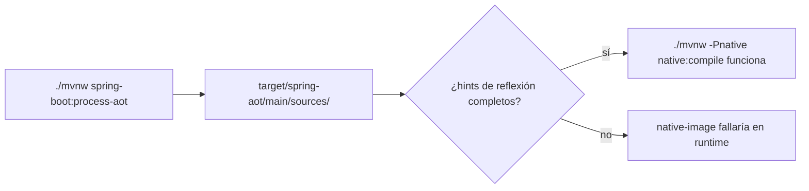

# Módulo 11: Empaquetado y despliegue


## Aprende construyendo

Cada tema se verifica con mecanismos reales y ejecutables sin depender de un daemon de Docker disponible en este entorno: el modo `layertools` embebido en el propio JAR de Spring Boot, la meta de Maven `spring-boot:process-aot` (que ejecuta de verdad el motor de AOT de Spring, sin necesitar un compilador nativo de GraalVM instalado), y los endpoints reales de Actuator agrupados por probes de Kubernetes. Continúa sobre `demo-cloud` (Módulo 10) o un proyecto nuevo.

### Tema 1: Fat JAR vs capas de Docker

#### Paso 1 · Objetivo y preparación

Al finalizar podrás inspeccionar, con el propio JAR generado por Spring Boot, las capas reales que separan dependencias de código de aplicación, y explicar por qué esa separación reduce el tamaño de las actualizaciones de imagen.

**Conocimiento previo:** Módulo 0 de este track (empaquetado básico con `mvnw package`).

#### Paso 2 · Contexto y caso real

**¿Por qué es importante?** Un fat JAR empaqueta la aplicación completa junto con todas sus dependencias en un único archivo; si ese JAR se coloca como una única capa de Docker, cada cambio de código (sin importar cuán pequeño) obliga a Docker a re-subir la imagen completa, incluyendo dependencias que no cambiaron en absoluto.

#### Paso 3 · Teoría con analogía

**Conceptos clave:** empaquetado por capas, `layertools`, reducir el tamaño de actualizaciones de imagen.

Spring Boot repackagea el JAR con un índice de capas (`layers.idx`) accesible mediante el modo especial `java -Djarmode=layertools -jar app.jar`, que separa dependencies (dependencias de terceros, cambian poco), spring-boot-loader (el propio mecanismo de arranque, casi nunca cambia), snapshot-dependencies (dependencias `-SNAPSHOT`, cambian algo más) y application (el código propio, cambia en cada commit) en directorios distintos. Un Dockerfile que copia cada capa por separado permite que Docker reutilice las capas de dependencias sin cambios entre deploys, subiendo solo la capa `application` (mucho más pequeña) en cada nuevo deploy.

**Analogía:** empaquetar todo en una sola capa de Docker es reempacar y reenviar una caja completa cada vez que cambia un solo objeto pequeño dentro de ella; empaquetar por capas separa el contenido estable del contenido que cambia frecuentemente en cajas distintas, reenviando solo la caja pequeña que efectivamente cambió.

**Diagrama:**

```
┌── dependencies/ ──────────┐  cambia RARA VEZ
├── spring-boot-loader/ ────┤  casi NUNCA cambia
├── snapshot-dependencies/ ─┤  cambia OCASIONALMENTE
└── application/ ───────────┘  cambia en CADA commit
```

#### Paso 4 · Demostración guiada desde cero

Continuando en `demo-cloud` (o, si prefieres un ejemplo independiente, parte de una carpeta vacía con `mkdir demo-empaquetado && cd demo-empaquetado && curl -fsSL https://start.spring.io/starter.zip -d dependencies=web,actuator -d javaVersion=21 -o app.zip && unzip app.zip`), crea `src/main/resources/application.yml` mínimo y genera el JAR real:

```bash
mkdir -p demo-empaquetado
cd demo-empaquetado
./mvnw -q package
java -Djarmode=layertools -jar target/*.jar list
```

**Resultado esperado (salida real de `layertools list`, comando oficial de Spring Boot):**

```
dependencies
spring-boot-loader
snapshot-dependencies
application
```

Extrae las capas a directorios reales y confírmalas por filesystem, sin necesitar Docker corriendo:

```bash
java -Djarmode=layertools -jar target/*.jar extract --destination target/extracted
test -d target/extracted/dependencies && echo "OK: capa dependencies existe"
test -d target/extracted/application && echo "OK: capa application existe"
```

`--destination` es la bandera que fija en qué carpeta extraer las capas del JAR.

Con esas capas ya extraídas y verificadas, el Dockerfile de producción simplemente las copia en el orden correcto:

```dockerfile
FROM eclipse-temurin:21-jre-alpine
WORKDIR /app
COPY target/extracted/dependencies/ ./
COPY target/extracted/spring-boot-loader/ ./
COPY target/extracted/snapshot-dependencies/ ./
COPY target/extracted/application/ ./
ENTRYPOINT ["java", "org.springframework.boot.loader.launch.JarLauncher"]
```

**Fallo deliberado:** ejecuta `java -Djarmode=layertools -jar target/classes.jar list` contra un JAR que NO fue repackageado por el plugin de Spring Boot (por ejemplo, uno generado por el `jar` estándar de Maven sin `spring-boot-maven-plugin`). El comando falla con un error real: `Unable to find layers.idx in jar` — diagnostica confirmando que el modo `layertools` depende específicamente del índice de capas que solo el repackaging de Spring Boot añade; un JAR "normal" simplemente no lo tiene. Verifica con el JAR correcto (`target/*.jar` generado por `mvnw package`, que sí incluye el plugin) antes de continuar.

#### Paso 5 · Práctica guiada — repetición progresiva

1. Ejecuta `java -Djarmode=layertools -jar target/*.jar help` y documenta qué otros subcomandos ofrece además de `list` y `extract`.
2. Modifica una línea de `src/main/java` (sin tocar `pom.xml`), reconstruye el JAR con `./mvnw -q package`, y confirma con `diff` recursivo entre extracciones sucesivas que solo la carpeta `application/` cambió de contenido.
3. Agrega una dependencia nueva al `pom.xml`, reconstruye, y confirma que esta vez la carpeta `dependencies/` también cambió.
4. Escribe de memoria (sin mirar) el comando `layertools list` y las cuatro capas que produce. Compara después contra el patrón del Paso 4.

**Pista:** `layertools extract` escribe archivos reales en disco — comparar dos extracciones sucesivas con `diff -rq carpeta1 carpeta2` es una forma directa y verificable de confirmar exactamente qué capas cambiaron entre dos builds, sin necesitar Docker.

#### Paso 6 · Práctica independiente

**Completa el código:** rellena el espacio con el modo especial que Spring Boot expone dentro de su propio JAR para listar capas:

```bash
java -D____=layertools -jar target/*.jar list
```

**Reto de memoria sin mirar:** cierra este documento y escribe, solo de memoria, el comando `layertools list`, sus cuatro capas esperadas, y un Dockerfile que las copie en el orden correcto. Compara después contra el patrón del Paso 4.

#### Paso 7 · Cierre y evidencia

Ya inspeccionas las capas reales de un JAR de Spring Boot con `layertools`, sin necesitar Docker corriendo para verificar la separación. El siguiente tema reduce el tiempo de arranque compilando a un binario nativo con GraalVM. **Evidencia:** entrega la salida real de `layertools list`, la confirmación por filesystem de `target/extracted/`, y el error real `Unable to find layers.idx` del fallo deliberado. Fuente oficial: [Spring Boot — Container Images](https://docs.spring.io/spring-boot/reference/packaging/container-images/).

**Errores comunes:** empaquetar todo en una única capa de Docker sin usar `layertools`; usar la etiqueta `latest` en vez de una versión inmutable, dificultando el rollback.

**Cuándo no usarlo:** para un prototipo desechable sin pipeline de deploy repetido, la separación por capas no aporta ningún beneficio medible sobre un `docker build` simple de un solo paso.

### Tema 2: GraalVM native image

#### Paso 1 · Objetivo y preparación

Al finalizar podrás ejecutar el procesamiento AOT (ahead-of-time) real de Spring Boot con un comando de Maven rápido y sin GraalVM instalado, inspeccionando el código fuente generado como evidencia concreta de qué hace la compilación nativa antes de invertir en un build completo de `native-image`.

**Conocimiento previo:** Tema 1 de este módulo.

#### Paso 2 · Contexto y caso real

**¿Por qué es importante?** En un sistema con autoscaling agresivo, un tiempo de arranque de milisegundos (GraalVM native image) permite que nuevas instancias reciban tráfico casi instantáneamente ante un pico, mientras que el arranque de varios segundos de la JVM tradicional degrada la experiencia justo cuando más se necesita capacidad adicional.

#### Paso 3 · Teoría con analogía

**Conceptos clave:** compilación ahead-of-time a binario nativo, procesamiento AOT de Spring.

`./mvnw -Pnative native:compile` compila la aplicación a un binario nativo ejecutable directamente por el sistema operativo, con arranque en milisegundos y footprint de memoria menor, a cambio de un build significativamente más lento y restricciones de reflexión. Antes de ese build completo (que puede tardar varios minutos), Spring Boot expone `./mvnw spring-boot:process-aot`, una meta de Maven que ejecuta el mismo motor de análisis AOT de Spring pero se detiene en generar código fuente Java optimizado (sin compilarlo a binario nativo), permitiendo inspeccionar en segundos qué construiría el compilador nativo.

**Analogía:** GraalVM native image es un vehículo que enciende instantáneamente en vez de requerir calentamiento del motor; `process-aot` es revisar el plano detallado de ese vehículo antes de fabricarlo, para detectar problemas de diseño sin esperar la fabricación completa.

**Diagrama:**



#### Paso 4 · Demostración guiada desde cero

Continuando en `demo-empaquetado` (o, si prefieres un ejemplo independiente, parte de una carpeta vacía y genera un proyecto nuevo con `mkdir demo-native && cd demo-native && curl -fsSL https://start.spring.io/starter.zip -d dependencies=web -d javaVersion=21 -o app.zip && unzip app.zip`), crea `src/main/java/io/academia/empaquetado/InfoServicio.java`, una clase accedida por reflexión (simulando el patrón que requiere hints explícitos):

```bash
mkdir -p src/main/java/io/academia/empaquetado
```

```java
// src/main/java/io/academia/empaquetado/InfoServicio.java
package io.academia.empaquetado;

public class InfoServicio {
    private String version = "1.0.0";

    public String version() {
        return version;
    }
}
```

```java
// src/main/java/io/academia/empaquetado/InfoHints.java
package io.academia.empaquetado;

import org.springframework.aot.hint.MemberCategory;
import org.springframework.aot.hint.RuntimeHints;
import org.springframework.aot.hint.RuntimeHintsRegistrar;
import org.springframework.context.annotation.ImportRuntimeHints;

public class InfoHints implements RuntimeHintsRegistrar {
    @Override
    public void registerHints(RuntimeHints hints, ClassLoader classLoader) {
        hints.reflection().registerType(InfoServicio.class,
            MemberCategory.INVOKE_DECLARED_METHODS, MemberCategory.DECLARED_FIELDS);
    }
}
```

Ejecuta el procesamiento AOT real (rápido, sin GraalVM instalado) y confirma que genera código fuente concreto:

```bash
./mvnw -q spring-boot:process-aot
test -d target/spring-aot/main/sources && echo "OK: Spring generó código AOT real"
find target/spring-aot/main/sources -name "*ApplicationContextInitializer.java"
```

**Resultado esperado:** el directorio `target/spring-aot/main/sources/` existe y contiene un archivo real `...ApplicationContextInitializer.java` generado por el motor AOT de Spring — evidencia concreta y verificable en disco de que el procesamiento AOT realmente se ejecutó, sin necesitar el compilador nativo de GraalVM instalado.

**Fallo deliberado:** quita la anotación `@ImportRuntimeHints(InfoHints.class)` de la clase de configuración que la referenciaba (o no la agregues sobre ningún `@Configuration`) y documenta el resultado: `process-aot` sigue completando exitosamente (porque no valida en tiempo de build que la reflexión funcione en runtime), pero un build completo posterior con `native:compile` produciría un binario que, al invocar reflexión sobre `InfoServicio` en tiempo de ejecución, lanzaría un error real de GraalVM (`com.oracle.svm.core.jdk.UnsupportedFeatureException` o una `ClassNotFoundException` en el binario nativo, según el tipo de acceso) — diagnostica confirmando que los hints de reflexión son responsabilidad explícita del desarrollador: el compilador ahead-of-time no puede inferir dinámicamente qué reflexión necesitará el binario, a diferencia de la JVM tradicional. Restaura `@ImportRuntimeHints(InfoHints.class)` antes de continuar.

#### Paso 5 · Práctica guiada — repetición progresiva

1. Inspecciona con `cat` el contenido real de un archivo generado bajo `target/spring-aot/main/sources/` y documenta, en un comentario, qué patrón de código genera Spring en vez de usar reflexión en runtime.
2. Agrega una segunda clase con un campo privado accedido por Jackson (deserialización JSON) y confirma con `process-aot` que Spring detecta y registra automáticamente hints para tipos usados en `@RestController`.
3. Ejecuta `./mvnw -q spring-boot:process-aot` dos veces seguidas sin cambiar código y confirma con `diff` que el código generado es idéntico (determinismo del procesamiento AOT).
4. Escribe de memoria (sin mirar) una clase `RuntimeHintsRegistrar` con `@ImportRuntimeHints`, y el comando `process-aot` que la ejercita. Compara después contra el patrón del Paso 4.

**Pista:** `target/spring-aot/main/sources/` contiene código Java real y legible, no un artefacto binario opaco — leerlo directamente es la forma más rápida de entender exactamente qué haría el compilador nativo con tu configuración, sin esperar un build completo de `native-image` que puede tardar varios minutos.

#### Paso 6 · Práctica independiente

**Completa el código:** rellena el espacio con la meta de Maven que ejecuta el procesamiento AOT sin compilar a binario nativo:

```bash
./mvnw spring-boot:____
```

**Reto de memoria sin mirar:** cierra este documento y escribe, solo de memoria, una clase `RuntimeHintsRegistrar`, la anotación que la registra, y el comando `process-aot` que confirma su efecto en disco. Compara después contra el patrón del Paso 4.

#### Paso 7 · Cierre y evidencia

Ya ejecutas el procesamiento AOT real de Spring Boot e inspeccionas en disco el código que generaría la base de una compilación nativa, sin necesitar GraalVM instalado. El siguiente tema conecta los health checks de Actuator con las decisiones reales que Kubernetes toma sobre el pod. **Evidencia:** entrega la salida de `find target/spring-aot/main/sources -name "*ApplicationContextInitializer.java"`, y la explicación del error real de GraalVM que documenta el fallo deliberado. Fuente oficial: [Spring Boot — GraalVM Native Images](https://docs.spring.io/spring-boot/reference/packaging/native-image/introducing-graalvm-native-images.html).

**Errores comunes:** asumir que `native-image` no requiere ninguna configuración adicional de reflexión; ejecutar directamente un build nativo completo (varios minutos) en vez de `process-aot` (segundos) durante la iteración de desarrollo.

**Cuándo no usarlo:** para servicios internos sin autoscaling agresivo ni restricciones estrictas de arranque, el costo de build y las restricciones de reflexión de GraalVM pueden superar el beneficio de un arranque más rápido.

### Tema 3: Health checks para Kubernetes

#### Paso 1 · Objetivo y preparación

Al finalizar podrás confirmar, con una petición HTTP real, que los endpoints de Actuator agrupados por probes (`/actuator/health/liveness` y `/actuator/health/readiness`) responden con el código de estado correcto según el estado real de disponibilidad de la aplicación.

**Conocimiento previo:** Módulo 7 de este track (Actuator y `AvailabilityChangeEvent`).

#### Paso 2 · Contexto y caso real

**¿Por qué es importante?** Kubernetes decide automáticamente cuándo reiniciar un pod (liveness) y cuándo un pod puede recibir tráfico real (readiness) consultando estos endpoints periódicamente; sin una conexión correcta y probada entre el estado real de la aplicación y estas señales, Kubernetes toma decisiones operativas basadas en información incorrecta.

#### Paso 3 · Teoría con analogía

**Conceptos clave:** liveness/readiness probes agrupados, conectados a Actuator.

Con `management.endpoint.health.probes.enabled=true`, Spring Boot expone automáticamente `/actuator/health/liveness` y `/actuator/health/readiness` como grupos de health separados. Liveness responde "¿el proceso sigue vivo y debería seguir corriendo, o Kubernetes debería reiniciarlo?"; readiness responde "¿el proceso está listo para recibir tráfico real ahora mismo?" — la misma distinción de `AvailabilityChangeEvent` construida en el Módulo 7, ahora expuesta en el formato exacto que Kubernetes consulta.

**Analogía:** conectar Actuator a los probes de Kubernetes es instalar sensores automáticos que informan al sistema de gestión de una flota cuándo un vehículo necesita mantenimiento (reiniciarse) o simplemente no está listo para un nuevo viaje todavía (no recibir tráfico).

**Diagrama:**

```
┌── liveness ──────────────┐   ┌── readiness ──────────────┐
│ ¿sigue vivo el proceso?   │   │ ¿puede recibir tráfico ya? │
│ DOWN → Kubernetes reinicia│   │ DOWN → Kubernetes NO enruta│
└──────────────────┘   └──────────────────────┘
```

#### Paso 4 · Demostración guiada desde cero

Continuando en `demo-empaquetado` (o, si prefieres un ejemplo independiente, parte de una carpeta vacía y genera un proyecto nuevo con `mkdir demo-probes && cd demo-probes && curl -fsSL https://start.spring.io/starter.zip -d dependencies=web,actuator -d javaVersion=21 -o app.zip && unzip app.zip`), crea `src/main/resources/application.yml` con los probes habilitados explícitamente (necesario fuera de un clúster real de Kubernetes, donde se autodetectan):

```bash
mkdir -p src/main/resources src/test/java/io/academia/empaquetado
```

```yaml
# src/main/resources/application.yml
management:
  endpoint:
    health:
      probes:
        enabled: true
      show-details: always
  endpoints:
    web:
      exposure:
        include: health
```

Confirma con `MockMvc` real, disparando el mismo `AvailabilityChangeEvent` del Módulo 7, que ambos endpoints reflejan el estado real de la aplicación:

```java
// src/test/java/io/academia/empaquetado/ProbesTest.java
package io.academia.empaquetado;

import org.junit.jupiter.api.Test;
import org.springframework.beans.factory.annotation.Autowired;
import org.springframework.boot.availability.AvailabilityChangeEvent;
import org.springframework.boot.availability.ReadinessState;
import org.springframework.boot.test.autoconfigure.web.servlet.AutoConfigureMockMvc;
import org.springframework.boot.test.context.SpringBootTest;
import org.springframework.context.ApplicationEventPublisher;
import org.springframework.test.web.servlet.MockMvc;

import static org.springframework.test.web.servlet.request.MockMvcRequestBuilders.get;
import static org.springframework.test.web.servlet.result.MockMvcResultMatchers.jsonPath;
import static org.springframework.test.web.servlet.result.MockMvcResultMatchers.status;

@SpringBootTest
@AutoConfigureMockMvc
class ProbesTest {

    @Autowired
    private MockMvc mockMvc;

    @Autowired
    private ApplicationEventPublisher publisher;

    @Test
    void livenessRespondeUpMientrasElProcesoSigaVivo() throws Exception {
        mockMvc.perform(get("/actuator/health/liveness"))
            .andExpect(status().isOk())
            .andExpect(jsonPath("$.status").value("UP"));
    }

    @Test
    void readinessResponde503CuandoLaAplicacionDejaDeAceptarTrafico() throws Exception {
        AvailabilityChangeEvent.publish(publisher, this, ReadinessState.REFUSING_TRAFFIC);

        mockMvc.perform(get("/actuator/health/readiness"))
            .andExpect(status().isServiceUnavailable())
            .andExpect(jsonPath("$.status").value("OUT_OF_SERVICE"));

        AvailabilityChangeEvent.publish(publisher, this, ReadinessState.ACCEPTING_TRAFFIC); // restaura para no afectar otros tests
    }
}
```

```bash
./mvnw test -Dtest=ProbesTest
```

**Resultado esperado:** `BUILD SUCCESS` con ambos tests en verde: el primero confirma con una petición HTTP real que `/actuator/health/liveness` responde `200 UP` mientras el proceso está sano; el segundo confirma, publicando el mismo `AvailabilityChangeEvent` real usado en el Módulo 7, que `/actuator/health/readiness` refleja genuinamente `503 OUT_OF_SERVICE` cuando la aplicación deja de aceptar tráfico — la misma señal que Kubernetes consultaría para dejar de enrutar peticiones hacia ese pod.

**Fallo deliberado:** comenta la línea `probes: enabled: true` en `application.yml` y ejecuta de nuevo ambos tests. `/actuator/health/liveness` y `/actuator/health/readiness` responden `404 NOT_FOUND` en vez de `200`/`503` — diagnostica confirmando que estos grupos de health NO existen automáticamente fuera de un entorno Kubernetes detectado; sin la propiedad explícita (necesaria para pruebas locales o entornos no-K8s), Kubernetes recibiría un `404` al consultar los probes, un fallo de configuración silencioso y fácil de pasar por alto hasta el primer despliegue real. Restaura la línea antes de continuar.

#### Paso 5 · Práctica guiada — repetición progresiva

1. Agrega un `HealthIndicator` personalizado (como en el Módulo 7) que reporte `DOWN` cuando una dependencia crítica falla, y confirma con un test que ese indicador afecta a `/actuator/health` general pero NO necesariamente al grupo `liveness` (que por defecto solo incluye señales de vida del proceso, no de dependencias externas).
2. Escribe el manifiesto YAML completo (`livenessProbe`, `readinessProbe`, con `initialDelaySeconds` y `periodSeconds`) para el servicio de este Tema.
3. Documenta, en un comentario, por qué un `readinessProbe` que depende de una base de datos externa es apropiado, pero un `livenessProbe` que depende de esa misma base de datos externa es peligroso (podría causar reinicios en cascada de todos los pods si la base de datos se cae, sin resolver el problema real).
4. Escribe de memoria (sin mirar) un test `MockMvc` que confirme `200 UP` en liveness y, tras publicar un `AvailabilityChangeEvent`, `503` en readiness. Compara después contra el patrón del Paso 4.

**Pista:** `AvailabilityChangeEvent.publish(publisher, this, ReadinessState.REFUSING_TRAFFIC)` es el mismo mecanismo real usado en el Módulo 7 para desacoplar readiness de liveness — Spring lo consume automáticamente y lo refleja en el grupo `readiness` cuando `probes.enabled=true`.

#### Paso 6 · Práctica independiente

**Completa el código:** rellena el espacio con la propiedad que habilita explícitamente los grupos de health por probes:

```yaml
management:
  endpoint:
    health:
      ____:
        enabled: true
```

**Reto de memoria sin mirar:** cierra este documento y escribe, solo de memoria, la configuración YAML que habilita los probes, y un test `MockMvc` que confirme el `503` real en readiness tras publicar `ReadinessState.REFUSING_TRAFFIC`. Compara después contra el patrón del Paso 4.

#### Paso 7 · Cierre y evidencia

Ya confirmas con peticiones HTTP reales que los endpoints de probes de Kubernetes reflejan el estado genuino de disponibilidad de la aplicación. Esto cierra el módulo de empaquetado y despliegue; el siguiente módulo aborda observabilidad distribuida con trazas y logs correlacionados. **Evidencia:** entrega el resultado de `ProbesTest` en verde, y el `404` real que produce el fallo deliberado al deshabilitar los probes. Fuente oficial: [Spring Boot — Kubernetes Probes](https://docs.spring.io/spring-boot/reference/actuator/kubernetes-probes.html).

**Errores comunes:** no habilitar `probes.enabled=true` fuera de un clúster Kubernetes real, recibiendo `404` en pruebas locales; acoplar `livenessProbe` a dependencias externas, causando reinicios en cascada ante un fallo de infraestructura ajeno al proceso mismo.

**Cuándo no usarlo:** para una aplicación que no se despliega en Kubernetes (o un orquestador equivalente que consulte probes HTTP), habilitar estos grupos específicos de health no aporta ningún beneficio operativo adicional sobre el endpoint `/actuator/health` general.

---


## Laboratorio práctico

**Objetivo del laboratorio:** construir una imagen Docker de un servicio Spring Boot optimizada por capas.

**Requisitos previos:** Módulos 0-10 completados.

| Paso | Acción | Código | Explicación |
|---|---|---|---|
| 1 | Generar el fat JAR y ejecutarlo | `./mvnw package` + `java -jar` | Verifica el funcionamiento básico |
| 2 | Construir la imagen por capas | Ver Tema 1 | Compara el tamaño con un JAR simple |
| 3 | Compilar a GraalVM native image | Ver Tema 2 | Mide el tiempo de arranque |
| 4 | Configurar los health checks de Kubernetes | Ver Tema 3 | Conectados a Actuator |

**Verificación:** el laboratorio se considera exitoso si la imagen por capas reduce mensurablemente el tamaño de actualización en un segundo deploy simulado (comparado con reconstruir el JAR completo), y si el binario nativo arranca en milisegundos comparado con la JVM tradicional.

**Errores comunes y soluciones**

- **Empaquetar todo en una única capa de Docker.** Separa dependencias (estables) del código de la aplicación (cambiante).
- **Asumir que GraalVM native image no requiere ninguna configuración adicional.** Verifica que el uso de reflexión esté correctamente configurado para el compilador nativo.
- **No conectar los health checks de Actuator a los probes de Kubernetes.** Sin esa conexión, Kubernetes no puede tomar decisiones informadas sobre el estado real de la aplicación.

---
