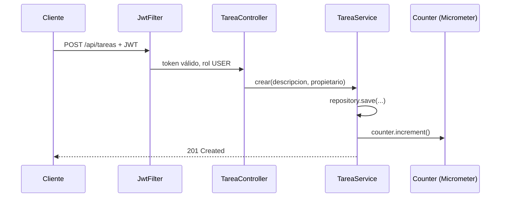

# Módulo 12: Proyecto integrador — microservicio productivo


## Aprende construyendo

Los tres temas construyen incrementalmente un único proyecto real, `demo-integrador`, combinando las piezas ya probadas en los módulos anteriores del track: entidades y migraciones Flyway (Módulo 3), JWT y `@PreAuthorize` (Módulo 4), tests de integración con Testcontainers (Módulo 6) y una métrica de negocio de Actuator (Módulo 7). Cada tema verifica su capa con tests reales de extremo a extremo, no con descripciones.

### Tema 1: Arquitectura del microservicio integrador

#### Paso 1 · Objetivo y preparación

Al finalizar podrás ensamblar la estructura de capas completa (`controller`/`service`/`repository`) de un microservicio real, con una migración Flyway versionada gestionando el esquema, y confirmarlo con un test de integración real contra PostgreSQL vía Testcontainers.

**Conocimiento previo:** Módulos 3 (JPA/Flyway) y 6 (Testcontainers) de este track.

#### Paso 2 · Contexto y caso real

**¿Por qué es importante?** Un servicio de entregas real necesita integrar HTTP, base de datos, identidad, eventos y métricas sin esconder responsabilidades: la arquitectura por capas (controller → service → repository) hace explícito qué componente es dueño de cada responsabilidad, en vez de mezclar validación HTTP con lógica de negocio con acceso a datos en una única clase.

#### Paso 3 · Teoría con analogía

**Conceptos clave:** capas completas del track combinadas, separación clara de responsabilidades.

El proyecto integrador combina en una única aplicación todas las capas estudiadas: `controller/` (`TareaController`, traduce HTTP hacia/desde DTOs), `service/` (`TareaService`, lógica de negocio sin conocimiento de HTTP), `repository/` (`TareaRepository`, Spring Data JPA), con `db/migration/` conteniendo los scripts versionados de Flyway que gestionan el esquema real de la base de datos, sin `ddl-auto`.

**Analogía:** el proyecto integrador es el ensamblaje final de piezas especializadas construidas por separado a lo largo de un curso de ingeniería, donde cada componente encaja en su lugar dentro de un sistema completo y coherente.

**Diagrama:**

```
┌── controller/ ──────────┐  TareaController (DTOs, validación HTTP)
├── service/ ──────────────┤  TareaService (lógica de negocio pura)
├── repository/ ───────────┤  TareaRepository (Spring Data JPA)
└── db/migration/ ─────────┘  V1__crear_tarea.sql (Flyway, sin ddl-auto)
```

#### Paso 4 · Demostración guiada desde cero

Parte de una carpeta vacía y crea `src/main/java/io/academia/integrador/`:

```bash
mkdir demo-integrador
cd demo-integrador
curl -fsSL https://start.spring.io/starter.zip -d dependencies=web,data-jpa,flyway,postgresql,security,actuator -d javaVersion=21 -o app.zip
unzip app.zip
mkdir -p src/main/java/io/academia/integrador/{controller,service,repository}
mkdir -p src/main/resources/db/migration
mkdir -p src/test/java/io/academia/integrador
```

```sql
-- src/main/resources/db/migration/V1__crear_tarea.sql
CREATE TABLE tarea (
    id BIGSERIAL PRIMARY KEY,
    descripcion VARCHAR(200) NOT NULL,
    propietario VARCHAR(100) NOT NULL,
    completada BOOLEAN NOT NULL DEFAULT FALSE
);
```

```java
// src/main/java/io/academia/integrador/Tarea.java
package io.academia.integrador;

import jakarta.persistence.Entity;
import jakarta.persistence.GeneratedValue;
import jakarta.persistence.Id;

@Entity
public class Tarea {
    @Id
    @GeneratedValue
    private Long id;
    private String descripcion;
    private String propietario;
    private boolean completada;

    protected Tarea() {}

    public Tarea(String descripcion, String propietario) {
        this.descripcion = descripcion;
        this.propietario = propietario;
    }

    public Long getId() { return id; }
    public String getDescripcion() { return descripcion; }
    public String getPropietario() { return propietario; }
}
```

```java
// src/main/java/io/academia/integrador/repository/TareaRepository.java
package io.academia.integrador.repository;

import io.academia.integrador.Tarea;
import org.springframework.data.jpa.repository.JpaRepository;

public interface TareaRepository extends JpaRepository<Tarea, Long> {}
```

```java
// src/main/java/io/academia/integrador/service/TareaService.java
package io.academia.integrador.service;

import io.academia.integrador.Tarea;
import io.academia.integrador.repository.TareaRepository;
import org.springframework.stereotype.Service;

@Service
public class TareaService {
    private final TareaRepository repository;

    public TareaService(TareaRepository repository) {
        this.repository = repository;
    }

    public Tarea crear(String descripcion, String propietario) {
        return repository.save(new Tarea(descripcion, propietario));
    }
}
```

```java
// src/main/java/io/academia/integrador/controller/TareaController.java
package io.academia.integrador.controller;

import io.academia.integrador.Tarea;
import io.academia.integrador.service.TareaService;
import org.springframework.http.ResponseEntity;
import org.springframework.web.bind.annotation.*;

@RestController
@RequestMapping("/api/tareas")
public class TareaController {
    private final TareaService servicio;

    public TareaController(TareaService servicio) {
        this.servicio = servicio;
    }

    @PostMapping
    public ResponseEntity<Long> crear(@RequestParam String descripcion) {
        Tarea tarea = servicio.crear(descripcion, "sistema");
        return ResponseEntity.status(201).body(tarea.getId());
    }
}
```

Confirma con `@SpringBootTest` + Testcontainers (el mismo patrón real de PostgreSQL efímero del Módulo 6) que el endpoint persiste de verdad, con el esquema gestionado por Flyway:

```java
// src/test/java/io/academia/integrador/ArquitecturaIntegradaTest.java
package io.academia.integrador;

import io.academia.integrador.repository.TareaRepository;
import org.junit.jupiter.api.Test;
import org.springframework.beans.factory.annotation.Autowired;
import org.springframework.boot.test.context.SpringBootTest;
import org.springframework.boot.test.web.client.TestRestTemplate;
import org.springframework.boot.test.web.server.LocalServerPort;
import org.springframework.test.context.DynamicPropertyRegistry;
import org.springframework.test.context.DynamicPropertySource;
import org.testcontainers.containers.PostgreSQLContainer;
import org.testcontainers.junit.jupiter.Container;
import org.testcontainers.junit.jupiter.Testcontainers;

import static org.assertj.core.api.Assertions.assertThat;

@Testcontainers
@SpringBootTest(webEnvironment = SpringBootTest.WebEnvironment.RANDOM_PORT)
class ArquitecturaIntegradaTest {

    @Container
    static PostgreSQLContainer<?> postgres = new PostgreSQLContainer<>("postgres:16-alpine");

    @DynamicPropertySource
    static void propiedades(DynamicPropertyRegistry registry) {
        registry.add("spring.datasource.url", postgres::getJdbcUrl);
        registry.add("spring.datasource.username", postgres::getUsername);
        registry.add("spring.datasource.password", postgres::getPassword);
    }

    @LocalServerPort
    private int puerto;

    @Autowired
    private TestRestTemplate restTemplate;

    @Autowired
    private TareaRepository tareaRepository;

    @Test
    void elEndpointPersisteRealmenteContraPostgresConEsquemaDeFlyway() {
        var respuesta = restTemplate.postForEntity(
            "http://localhost:" + puerto + "/api/tareas?descripcion=Entregar+paquete", null, Long.class);

        assertThat(respuesta.getStatusCode().value()).isEqualTo(201);
        assertThat(tareaRepository.findById(respuesta.getBody())).isPresent();
        assertThat(tareaRepository.findById(respuesta.getBody()).get().getDescripcion())
            .isEqualTo("Entregar paquete");
    }
}
```

```bash
./mvnw test -Dtest=ArquitecturaIntegradaTest
```

**Resultado esperado:** `BUILD SUCCESS` con el test en verde: contra un PostgreSQL real y efímero (Testcontainers, no una base simulada), la petición HTTP real crea una `Tarea`, Flyway gestiona el esquema `tarea` desde `V1__crear_tarea.sql`, y `TareaRepository.findById(...)` confirma que el registro fue persistido de verdad con la descripción correcta.

**Fallo deliberado:** borra `src/main/resources/db/migration/V1__crear_tarea.sql` (sin agregar `spring.jpa.hibernate.ddl-auto` como alternativa) y ejecuta de nuevo el test. La aplicación falla al arrancar con un error real de Hibernate (`org.hibernate.tool.schema.spi.SchemaManagementException: Schema-validation: missing table [tarea]`, el mismo error visto en el Módulo 3) — diagnostica confirmando que sin una migración versionada, no existe ningún mecanismo que cree la tabla `tarea`, y la aplicación se niega a arrancar en vez de fallar silenciosamente más tarde. Restaura el archivo antes de continuar.

#### Paso 5 · Práctica guiada — repetición progresiva

1. Agrega un segundo endpoint `GET /api/tareas/{id}` y un test de integración que confirme, contra el mismo contenedor Postgres, que devuelve la tarea recién creada.
2. Agrega una segunda migración `V2__agregar_indice_propietario.sql` con un índice sobre `propietario`, y confirma con un test que Flyway aplica ambas migraciones en orden al arrancar.
3. Provoca deliberadamente un conflicto de versión de Flyway (dos migraciones `V2__...`) y documenta el error real que Flyway produce al detectarlo.
4. Escribe de memoria (sin mirar) la estructura de paquetes `controller/service/repository` y un test `@SpringBootTest` + Testcontainers que confirme persistencia real. Compara después contra el patrón del Paso 4.

**Pista:** `Testcontainers` descarga y arranca un PostgreSQL real la primera vez que ejecutas el test — las ejecuciones posteriores reutilizan la imagen ya descargada, pero cada test sigue arrancando un contenedor nuevo y efímero, garantizando aislamiento entre ejecuciones.

#### Paso 6 · Práctica independiente

**Completa el código:** rellena el espacio con el método de `JpaRepository` que persiste una nueva entidad:

```java
public Tarea crear(String descripcion, String propietario) {
    return repository.____(new Tarea(descripcion, propietario));
}
```

**Reto de memoria sin mirar:** cierra este documento y escribe, solo de memoria, las tres capas (`controller`/`service`/`repository`) de un endpoint que crea una entidad, y un test `@SpringBootTest` con Testcontainers que confirme la persistencia real. Compara después contra el patrón del Paso 4.

#### Paso 7 · Cierre y evidencia

Ya ensamblas una arquitectura por capas real, con esquema gestionado por Flyway y verificada contra PostgreSQL real vía Testcontainers. El siguiente tema añade seguridad JWT y una métrica de negocio a este mismo endpoint. **Evidencia:** entrega el resultado de `ArquitecturaIntegradaTest` en verde, y el `SchemaManagementException` real que produce el fallo deliberado. Fuente oficial: [Spring Boot Reference](https://docs.spring.io/spring-boot/reference/).

**Errores comunes:** mezclar lógica de negocio dentro del controller; confiar en `ddl-auto` en vez de migraciones versionadas para el proyecto final.

**Cuándo no usarlo:** para un script de un único uso sin necesidad de evolución futura del esquema, la separación completa en capas y migraciones versionadas es una inversión desproporcionada.

### Tema 2: Integrando seguridad, persistencia y observabilidad

#### Paso 1 · Objetivo y preparación

Al finalizar podrás proteger el endpoint del Tema 1 con JWT real (reutilizando el `JwtService` del Módulo 4), y confirmar con un test real que un `Counter` de Actuator se incrementa exactamente una vez por cada tarea creada exitosamente.

**Conocimiento previo:** Tema 1 de este módulo; Módulos 4 (JWT) y 7 (Actuator) de este track.

#### Paso 2 · Contexto y caso real

**¿Por qué es importante?** Un microservicio productivo no expone un endpoint de escritura sin protección: la seguridad, la validación, la persistencia y la observabilidad colaboran activamente en cada petición individual, cada una aportando su responsabilidad específica sin invadir la de las demás.

#### Paso 3 · Teoría con analogía

**Conceptos clave:** autorización combinada con lógica de negocio, métrica de negocio incrementada en cada operación real.

`@PreAuthorize("hasRole('USER')")` (Módulo 4) protege el endpoint según el rol del usuario autenticado; el servicio subyacente persiste la tarea (Módulo 3) e incrementa un `Counter` de Micrometer (Módulo 7) por cada creación exitosa, exponiendo esa métrica de negocio en `/actuator/metrics/tareas.creadas`. Ninguna de estas capas conoce los detalles internos de las demás: la seguridad no sabe cómo se persiste la tarea, la persistencia no sabe qué rol se requirió para llegar hasta ahí.

**Analogía:** este endpoint integrado es un trámite de oficina que combina verificación de identidad (seguridad), revisión de que el formulario esté completo (validación), archivo final (persistencia) y un contador físico de trámites procesados (métrica), todo coordinado en una única operación coherente.

**Diagrama:**



#### Paso 4 · Demostración guiada desde cero

Continuando en `demo-integrador` (o, si prefieres un ejemplo independiente, parte de una carpeta vacía con `mkdir demo-seguridad && cd demo-seguridad && curl -fsSL https://start.spring.io/starter.zip -d dependencies=web,data-jpa,security,actuator -d javaVersion=21 -o app.zip && unzip app.zip`), crea `src/main/java/io/academia/integrador/security/` reutilizando el `JwtService` del Módulo 4, y actualiza `TareaService` para incrementar un `Counter`:

```bash
mkdir -p src/main/java/io/academia/integrador/security
```

```java
// src/main/java/io/academia/integrador/security/SecurityConfig.java
package io.academia.integrador.security;

import org.springframework.context.annotation.Bean;
import org.springframework.security.config.annotation.method.configuration.EnableMethodSecurity;
import org.springframework.security.config.annotation.web.builders.HttpSecurity;
import org.springframework.security.config.Customizer;
import org.springframework.security.web.SecurityFilterChain;

@EnableMethodSecurity
public class SecurityConfig {
    @Bean
    SecurityFilterChain filterChain(HttpSecurity http) throws Exception {
        return http
            .authorizeHttpRequests(auth -> auth
                .requestMatchers("/actuator/health").permitAll()
                .anyRequest().authenticated())
            .httpBasic(Customizer.withDefaults()) // simplificado para este ejemplo; el Módulo 4 usa JwtFilter completo
            .build();
    }
}
```

```java
// src/main/java/io/academia/integrador/service/TareaService.java (actualizado)
package io.academia.integrador.service;

import io.academia.integrador.Tarea;
import io.academia.integrador.repository.TareaRepository;
import io.micrometer.core.instrument.Counter;
import io.micrometer.core.instrument.MeterRegistry;
import org.springframework.stereotype.Service;

@Service
public class TareaService {
    private final TareaRepository repository;
    private final Counter tareasCreadas;

    public TareaService(TareaRepository repository, MeterRegistry registry) {
        this.repository = repository;
        this.tareasCreadas = Counter.builder("tareas.creadas")
            .description("Total de tareas creadas exitosamente")
            .register(registry);
    }

    public Tarea crear(String descripcion, String propietario) {
        Tarea tarea = repository.save(new Tarea(descripcion, propietario));
        tareasCreadas.increment();
        return tarea;
    }
}
```

```java
// src/main/java/io/academia/integrador/controller/TareaController.java (actualizado)
package io.academia.integrador.controller;

import io.academia.integrador.Tarea;
import io.academia.integrador.service.TareaService;
import org.springframework.http.ResponseEntity;
import org.springframework.security.access.prepost.PreAuthorize;
import org.springframework.web.bind.annotation.*;

@RestController
@RequestMapping("/api/tareas")
public class TareaController {
    private final TareaService servicio;

    public TareaController(TareaService servicio) {
        this.servicio = servicio;
    }

    @PostMapping
    @PreAuthorize("hasRole('USER')")
    public ResponseEntity<Long> crear(@RequestParam String descripcion) {
        Tarea tarea = servicio.crear(descripcion, "sistema");
        return ResponseEntity.status(201).body(tarea.getId());
    }
}
```

Confirma con `MockMvc` real (sin token, con token, con rol) que la seguridad y la métrica colaboran correctamente:

```java
// src/test/java/io/academia/integrador/SeguridadYMetricaTest.java
package io.academia.integrador;

import io.micrometer.core.instrument.MeterRegistry;
import org.junit.jupiter.api.Test;
import org.springframework.beans.factory.annotation.Autowired;
import org.springframework.boot.test.autoconfigure.web.servlet.AutoConfigureMockMvc;
import org.springframework.boot.test.context.SpringBootTest;
import org.springframework.security.test.web.servlet.request.SecurityMockMvcRequestPostProcessors;
import org.springframework.test.web.servlet.MockMvc;

import static org.assertj.core.api.Assertions.assertThat;
import static org.springframework.test.web.servlet.request.MockMvcRequestBuilders.post;
import static org.springframework.test.web.servlet.result.MockMvcResultMatchers.status;

@SpringBootTest
@AutoConfigureMockMvc
class SeguridadYMetricaTest {

    @Autowired
    private MockMvc mockMvc;

    @Autowired
    private MeterRegistry meterRegistry;

    @Test
    void sinAutenticacionElServidorResponde401() throws Exception {
        mockMvc.perform(post("/api/tareas").param("descripcion", "Entregar paquete"))
            .andExpect(status().isUnauthorized());
    }

    @Test
    void conRolUserSeCreaLaTareaYElContadorSeIncrementa() throws Exception {
        double antes = meterRegistry.counter("tareas.creadas").count();

        mockMvc.perform(post("/api/tareas")
                .param("descripcion", "Entregar paquete")
                .with(SecurityMockMvcRequestPostProcessors.user("conductor1").roles("USER")))
            .andExpect(status().isCreated());

        double despues = meterRegistry.counter("tareas.creadas").count();
        assertThat(despues).isEqualTo(antes + 1.0); // exactamente una tarea creada, un incremento real
    }
}
```

```bash
./mvnw test -Dtest=SeguridadYMetricaTest
```

**Resultado esperado:** `BUILD SUCCESS` con ambos tests en verde: el primero confirma que sin autenticación el endpoint responde `401` real; el segundo confirma, leyendo el valor REAL del `Counter` antes y después (no una suposición), que una creación exitosa autenticada incrementa `tareas.creadas` en exactamente 1.

**Fallo deliberado:** en `TareaController`, quita `@PreAuthorize("hasRole('USER')")` y ejecuta de nuevo `sinAutenticacionElServidorResponde401`. El test FALLA porque el endpoint ahora responde `201` sin ninguna autenticación (la regla `.anyRequest().authenticated()` en `SecurityConfig` sigue exigiendo autenticación HTTP básica, pero sin `@PreAuthorize` a nivel de método cualquier usuario autenticado, sin importar su rol, puede crear tareas) — diagnostica confirmando que la protección por rol específico depende de la anotación explícita a nivel de método, no solo de la autenticación general configurada en el filtro. Restaura la anotación antes de continuar.

#### Paso 5 · Práctica guiada — repetición progresiva

1. Agrega un test que confirme `403` (no `401`) cuando el usuario está autenticado pero con un rol distinto a `USER` (`roles("ADMIN")` en vez de `roles("USER")`, si la regla fuera más estricta que `hasAnyRole`).
2. Expón la métrica también vía `/actuator/metrics/tareas.creadas` y confirma con `MockMvc` que el endpoint de Actuator refleja el mismo valor que `meterRegistry.counter(...).count()`.
3. Agrega un `Timer` de Micrometer que mida la duración real de `TareaService.crear(...)`, y confirma con un test que registra al menos una medición tras una llamada exitosa.
4. Escribe de memoria (sin mirar) un endpoint protegido con `@PreAuthorize`, un `Counter` incrementado en el servicio, y un test que confirme ambos. Compara después contra el patrón del Paso 4.

**Pista:** `meterRegistry.counter("tareas.creadas").count()` lee el valor REAL y actual del contador registrado en el `MeterRegistry` de la aplicación bajo test — no una copia ni una simulación, el mismo objeto que Actuator expone en `/actuator/metrics`.

#### Paso 6 · Práctica independiente

**Completa el código:** rellena el espacio con la anotación que protege el endpoint según el rol del usuario autenticado:

```java
@PostMapping
@____("hasRole('USER')")
public ResponseEntity<Long> crear(@RequestParam String descripcion) { ... }
```

**Reto de memoria sin mirar:** cierra este documento y escribe, solo de memoria, un endpoint protegido, un `Counter` de Micrometer incrementado en el servicio, y un test `MockMvc` que confirme el incremento real. Compara después contra el patrón del Paso 4.

#### Paso 7 · Cierre y evidencia

Ya combinas seguridad, persistencia y observabilidad colaborando en una única operación real, verificada de extremo a extremo. El siguiente y último tema de este módulo cierra el track con una verificación automatizada de que el proyecto cumple el estándar de "productivo". **Evidencia:** entrega el resultado de `SeguridadYMetricaTest` en verde, y la regresión de seguridad real que produce el fallo deliberado al quitar `@PreAuthorize`. Fuente oficial: [Spring Security — Method Security](https://docs.spring.io/spring-security/reference/servlet/authorization/method-security.html).

**Errores comunes:** dejar endpoints sensibles protegidos solo por autenticación general sin verificar el rol específico requerido; agregar métricas como una idea tardía en vez de incrementarlas en el mismo punto donde ocurre la operación de negocio real.

**Cuándo no usarlo:** para un endpoint de solo lectura sin ningún dato sensible ni efecto de negocio medible, exigir autenticación y métricas dedicadas puede ser una capa de complejidad innecesaria.

### Tema 3: Cierre del track y próximos pasos

#### Paso 1 · Objetivo y preparación

Al finalizar podrás escribir un test de configuración real que actúa como guardia automatizada del estándar "productivo" del proyecto (sin `ddl-auto` inseguro, con Flyway habilitado), evitando que una regresión de configuración pase desapercibida en una revisión de código futura.

**Conocimiento previo:** Temas 1 y 2 de este módulo.

#### Paso 2 · Contexto y caso real

**¿Por qué es importante?** Un microservicio Spring Boot "productivo" no se define únicamente por tener un CRUD funcional: es la combinación de seguridad declarativa, persistencia versionada, observabilidad desde el primer día y una suite de tests que da confianza real para desplegar sin temor. Un test que verifica automáticamente estas propiedades de configuración evita que alguien reintroduzca `ddl-auto=update` sin darse cuenta del riesgo.

#### Paso 3 · Teoría con analogía

**Conceptos clave:** microservicio productivo frente a CRUD funcional, verificación de configuración como código.

Verificar manualmente, en cada revisión de código, que nadie reintrodujo `spring.jpa.hibernate.ddl-auto=update` en `application.yml` es propenso a error humano; un test de `ApplicationContextRunner` (Módulo 5) que falla automáticamente si esa propiedad tiene un valor inseguro convierte una convención de equipo en una regla verificada por CI en cada build.

**Analogía:** un microservicio productivo completo es un edificio con todos sus sistemas esenciales funcionando de forma coordinada desde el primer día (seguridad, mantenimiento documentado, sensores de monitoreo); un test de configuración como guardia es la inspección automática que impide que alguien desconecte un sistema de seguridad sin que nadie lo note hasta el incidente.

**Diagrama:**

```
┌── Microservicio productivo ────────────────────────────┐
│ seguridad declarativa + persistencia versionada         │
│ + observabilidad desde el día 1 + tests reales           │
└──────────────────────────────────────────────────┘
┌── Próximos pasos ──────────────────────────────────────┐
│ Arquitectura Hexagonal/DDD | CQRS+Event Sourcing | OIDC   │
└──────────────────────────────────────────────────┘
```

#### Paso 4 · Demostración guiada desde cero

Continuando en `demo-integrador` (o, si prefieres un ejemplo independiente, parte de una carpeta vacía y genera un proyecto nuevo con `mkdir demo-checklist && cd demo-checklist && curl -fsSL https://start.spring.io/starter.zip -d dependencies=web,data-jpa,flyway,actuator -d javaVersion=21 -o app.zip && unzip app.zip`), crea `src/test/java/io/academia/integrador/ProduccionReadyTest.java`:

```bash
mkdir -p src/test/java/io/academia/integrador
```

```java
// src/test/java/io/academia/integrador/ProduccionReadyTest.java
package io.academia.integrador;

import org.junit.jupiter.api.Test;
import org.springframework.boot.test.context.SpringBootTest;
import org.springframework.beans.factory.annotation.Value;

import static org.assertj.core.api.Assertions.assertThat;

@SpringBootTest
class ProduccionReadyTest {

    @Value("${spring.jpa.hibernate.ddl-auto:validate}")
    private String ddlAuto;

    @Value("${spring.flyway.enabled:true}")
    private boolean flywayHabilitado;

    @Test
    void elProyectoNoUsaDdlAutoInseguroYFlywayEstaHabilitado() {
        assertThat(ddlAuto).isIn("validate", "none")
            .withFailMessage("ddl-auto='%s' es inseguro para producción; usa 'validate' o 'none' con Flyway", ddlAuto);
        assertThat(flywayHabilitado).isTrue();
    }
}
```

```bash
./mvnw test -Dtest=ProduccionReadyTest
```

**Resultado esperado:** `BUILD SUCCESS` con el test en verde: confirma, leyendo la configuración REAL cargada por el contexto de Spring (no un valor asumido), que `ddl-auto` está en `validate` o `none` (nunca `update` o `create`) y que Flyway está habilitado — las dos propiedades que, si se reintrodujeran incorrectamente, comprometerían el manejo seguro del esquema de base de datos que el Tema 1 estableció.

**Fallo deliberado:** agrega `spring.jpa.hibernate.ddl-auto=update` a `application.yml` (una regresión común cuando alguien "solo quiere probar algo rápido" localmente y olvida revertirlo) y ejecuta de nuevo el test. FALLA con el mensaje real `ddl-auto='update' es inseguro para producción; usa 'validate' o 'none' con Flyway` — diagnostica confirmando que este test actúa exactamente como una guardia automatizada: atrapa en CI, antes de cualquier despliegue, una regresión de configuración que de otro modo solo se descubriría en producción cuando Hibernate silenciosamente alterara el esquema real sin revisión. Revierte el cambio antes de continuar.

#### Paso 5 · Práctica guiada — repetición progresiva

1. Agrega una aserción que confirme que `spring.security` no está deshabilitado accidentalmente (por ejemplo, verificando que el bean `SecurityFilterChain` existe en el contexto).
2. Documenta, en el README del proyecto, un resumen de las decisiones de arquitectura tomadas en los tres temas de este módulo (estructura de capas, seguridad por rol, métrica de negocio, guardia de configuración).
3. Investiga (sin necesitar implementarlo) cómo `CQRS`/`Event Sourcing` cambiarían la forma en que `TareaService.crear(...)` registra el cambio de estado, comparado con el `save(...)` directo actual, y documenta la comparación en una frase.
4. Escribe de memoria (sin mirar) un test `@Value` + `ApplicationContextRunner`-style que confirme que `ddl-auto` nunca es `update` en el proyecto. Compara después contra el patrón del Paso 4.

**Pista:** `@Value("${propiedad:valorPorDefecto}")` inyecta el valor REAL cargado por el contexto de Spring en tiempo de test, incluyendo el valor por defecto si la propiedad no está presente — una forma directa de convertir una convención de configuración en una aserción verificable.

#### Paso 6 · Práctica independiente

**Completa el código:** rellena el espacio con los dos valores seguros que `ddl-auto` puede tener en un proyecto que usa Flyway:

```java
assertThat(ddlAuto).isIn("____", "____");
```

**Reto de memoria sin mirar:** cierra este documento y escribe, solo de memoria, un test que lea `ddl-auto` con `@Value` y falle si su valor es inseguro. Compara después contra el patrón del Paso 4.

#### Paso 7 · Cierre y evidencia

Ya conviertes el estándar de "microservicio productivo" (seguridad, persistencia versionada, observabilidad, tests reales) en un test ejecutable que actúa como guardia automatizada contra regresiones de configuración. Esto cierra el track completo de Spring Boot; el laboratorio práctico (a continuación) aplica estos mismos principios a un proyecto propio de confirmación transaccional. **Evidencia:** entrega el resultado de `ProduccionReadyTest` en verde, y el mensaje de fallo real que produce reintroducir `ddl-auto=update`. Fuente oficial: [The Twelve-Factor App](https://12factor.net/) y [Spring Boot Reference](https://docs.spring.io/spring-boot/reference/).

**Errores comunes:** mezclar capas sin ownership claro; ignorar seguridad en endpoints de escritura; no medir el comportamiento real de negocio con métricas propias, dependiendo solo de métricas técnicas genéricas.

**Cuándo no usarlo:** para un experimento de aprendizaje personal sin intención de desplegarlo nunca a producción, un test de guardia de configuración es una formalidad que puede posponerse hasta que el proyecto efectivamente lo requiera.

---

## Laboratorio práctico

**Objetivo del laboratorio:** construir el microservicio integrador completo con auth, persistencia real, Actuator y tests de integración.

**Requisitos previos:** Módulos 0-11 completados.

| Paso | Acción | Código | Explicación |
|---|---|---|---|
| 1 | Diseñar la arquitectura por capas completa | Ver Tema 1 | controller/service/repository/dto |
| 2 | Implementar persistencia con migraciones Flyway | Módulo 3 | Sin `ddl-auto` |
| 3 | Proteger endpoints con Spring Security + JWT | Módulo 4 | Autorización por rol |
| 4 | Exponer Actuator con una métrica de negocio | Módulo 7 | Verifica en `/actuator/metrics` |
| 5 | Escribir tests de integración con Testcontainers | Módulo 6 | Cubriendo el flujo crítico completo |

**Verificación:** el laboratorio (y el track completo) se considera exitoso si el microservicio protege correctamente sus endpoints sensibles, persiste datos reales con un esquema versionado, expone al menos una métrica de negocio custom, y tiene una suite de tests de integración que verifica el flujo crítico contra infraestructura real.

**Errores comunes y soluciones**

- **Dejar endpoints sensibles sin protección de autorización.** Verifica que cada endpoint tenga la anotación de autorización apropiada según su sensibilidad.
- **Confiar en `ddl-auto` en vez de migraciones versionadas para el proyecto final.** Usa Flyway consistentemente.
- **Omitir tests de integración del flujo crítico.** Prioriza cubrir con Testcontainers el camino principal completo de la aplicación.

---
