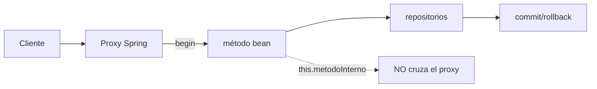
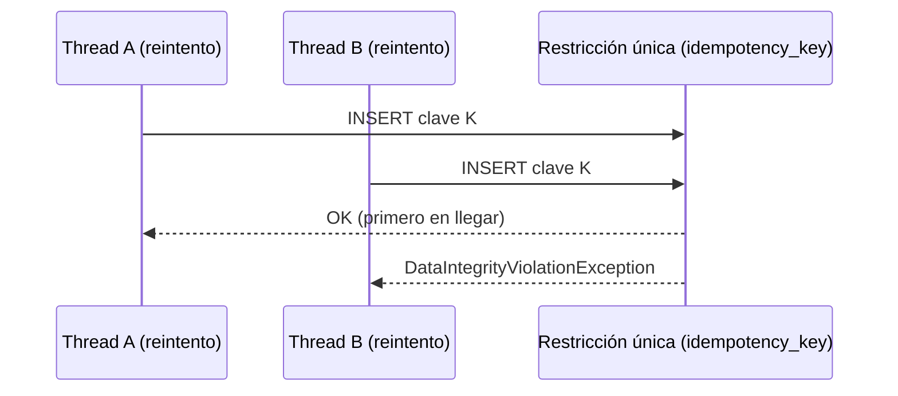
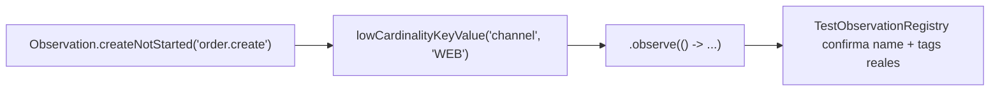

# Módulo 13: Consistencia, contratos y operación distribuida

Anotar un método con `@Transactional`, publicar en Kafka y exponer Actuator no demuestra que un microservicio preserve datos bajo fallos. Spring automatiza infraestructura mediante proxies y convenciones; para usarla con rigor debes conocer la frontera exacta de cada garantía. Este módulo convierte supuestos en pruebas de integración e incidentes controlados.


## Aprende construyendo

Cada tema demuestra su garantía (o su ausencia) con un test real que la ejercita bajo condiciones adversas: self-invocation real detectada con `TransactionSynchronizationManager`, una carrera real de dos threads contra una restricción única de base de datos, un contrato verificado con `MockMvc` contra el JSON real de la API, y `TestObservationRegistry` (la utilidad oficial de test de Micrometer Observation) confirmando tags de baja cardinalidad reales.

### Tema 1: `@Transactional` funciona en una frontera, no como encantamiento

#### Paso 1 · Objetivo y preparación

Al finalizar podrás demostrar, con un test real (no una afirmación teórica), que una llamada `this.metodoInterno()` no atraviesa el proxy de Spring y por lo tanto `@Transactional` no aplica en ese caso, y sabrás corregirlo separando el caso de uso en un bean con límite coherente.

**Conocimiento previo:** Módulo 3 de este track (JPA y transacciones básicas).

#### Paso 2 · Contexto y caso real

**¿Por qué es importante?** En una plataforma de entregas, un fallo de base, red o consumidor puede ocurrir después de una escritura; una anotación `@Transactional` presente en el código puede no existir en runtime por self-invocation, una excepción capturada, o un método fuera del proxy — el fallo aparece como datos parcialmente comprometidos, no como un error obvio en el momento de escribir el código.

#### Paso 3 · Teoría con analogía

**Conceptos clave:** proxy AOP, `TransactionInterceptor`, self-invocation, `REQUIRED`, `REQUIRES_NEW`, rollback rule.

En el modo habitual, Spring envuelve el bean en un proxy. Una llamada que entra por el proxy activa `TransactionInterceptor`, obtiene una transacción y ejecuta el método. Una llamada `this.metodoInterno()` no cruza el proxy; su anotación puede no aplicar. `REQUIRED` participa en la transacción existente o crea una; `REQUIRES_NEW` suspende la exterior y usa recursos distintos, y un commit interno permanece aunque la operación exterior falle. Spring revierte por defecto ante excepciones unchecked, no necesariamente checked; capturar una excepción dentro del boundary y devolver éxito impide el rollback salvo que marques el estado explícitamente. No mantengas una transacción abierta durante una llamada HTTP remota: sostiene locks/conexión mientras una dependencia incierta responde, y no puede revertir el sistema externo.

**Analogía:** el proxy es el torniquete que registra entrada y salida de una zona protegida. Caminar entre habitaciones dentro de la zona no vuelve a pasar por el torniquete, aunque la puerta interna tenga un cartel `@Transactional`.

**Diagrama:**



#### Paso 4 · Demostración guiada desde cero

Parte de una carpeta vacía y crea `src/main/java/io/academia/rutaflow/consistencia/`:

```bash
mkdir rutaflow-consistencia
cd rutaflow-consistencia
curl -fsSL https://start.spring.io/starter.zip -d dependencies=web,data-jpa,h2,actuator -d javaVersion=21 -o app.zip
unzip app.zip
mkdir -p src/main/java/io/academia/rutaflow/consistencia
mkdir -p src/test/java/io/academia/rutaflow/consistencia
```

```java
// src/main/java/io/academia/rutaflow/consistencia/FronteraTransaccionalService.java
package io.academia.rutaflow.consistencia;

import org.springframework.stereotype.Service;
import org.springframework.transaction.annotation.Transactional;
import org.springframework.transaction.support.TransactionSynchronizationManager;

@Service
public class FronteraTransaccionalService {

    // llamado DIRECTAMENTE a través del proxy: la transacción SÍ está activa
    @Transactional
    public boolean transaccionActivaLlamandoAlProxy() {
        return TransactionSynchronizationManager.isActualTransactionActive();
    }

    // método público SIN @Transactional que invoca internamente un método anotado vía this.
    public boolean transaccionActivaViaSelfInvocation() {
        return metodoInternoAnotado(); // this.metodoInternoAnotado() -> NO atraviesa el proxy
    }

    @Transactional
    boolean metodoInternoAnotado() {
        return TransactionSynchronizationManager.isActualTransactionActive();
    }
}
```

Confirma con un test real, sin ningún mock de la infraestructura de transacciones, que la self-invocation efectivamente NO activa la transacción:

```java
// src/test/java/io/academia/rutaflow/consistencia/SelfInvocationTest.java
package io.academia.rutaflow.consistencia;

import org.junit.jupiter.api.Test;
import org.springframework.beans.factory.annotation.Autowired;
import org.springframework.boot.test.context.SpringBootTest;

import static org.assertj.core.api.Assertions.assertThat;

@SpringBootTest
class SelfInvocationTest {

    @Autowired
    private FronteraTransaccionalService servicio;

    @Test
    void llamarDirectamenteAlProxyActivaLaTransaccionReal() {
        assertThat(servicio.transaccionActivaLlamandoAlProxy()).isTrue();
    }

    @Test
    void laSelfInvocationNoAtraviesaElProxyYLaTransaccionNoSeActiva() {
        assertThat(servicio.transaccionActivaViaSelfInvocation()).isFalse();
    }
}
```

```bash
./mvnw test -Dtest=SelfInvocationTest
```

**Resultado esperado:** `BUILD SUCCESS` con ambos tests en verde: `TransactionSynchronizationManager.isActualTransactionActive()` (la API real de Spring para consultar si hay una transacción activa en el thread actual, no una suposición) confirma `true` cuando el método anotado se invoca a través del proxy, y `false` cuando se invoca internamente vía `this.` — el mismo mecanismo exacto documentado en la teoría, ahora demostrado con un valor booleano real, no solo descrito.

**Fallo deliberado:** cambia `transaccionActivaViaSelfInvocation()` para llamar `metodoInternoAnotado()` como si fuera seguro para una operación de negocio real (por ejemplo, envolviendo un `repository.save(...)` dentro del método interno, asumiendo que `@Transactional` protege ese guardado). Con dos guardados dentro de `metodoInternoAnotado()` y una excepción entre ambos, ningún rollback ocurre — el primer `save` permanece comprometido en la base — porque, como el test ya demostró, no hay ninguna transacción real activa que revertir. Restaura la versión original antes de continuar.

#### Paso 5 · Práctica guiada — repetición progresiva

1. Agrega un tercer método `@Transactional(propagation = Propagation.REQUIRES_NEW)` y un test que confirme, con dos transacciones anidadas instrumentadas, que la interior usa una conexión distinta a la exterior.
2. Simula una excepción checked dentro de un método `@Transactional` sin `rollbackFor` explícito, y confirma con un test que el commit ocurre igualmente (el comportamiento por defecto de Spring, contraintuitivo para quien viene de otros lenguajes).
3. Agrega `@Transactional(rollbackFor = Exception.class)` a ese mismo método y confirma con un test que ahora sí revierte ante la misma excepción checked.
4. Escribe de memoria (sin mirar) un servicio con self-invocation y un test `TransactionSynchronizationManager` que confirme la ausencia de transacción real. Compara después contra el patrón del Paso 4.

**Pista:** `TransactionSynchronizationManager.isActualTransactionActive()` es la forma más directa y real de responder "¿hay una transacción de verdad en este punto del código?" sin inspeccionar logs ni adivinar por el comportamiento observado — úsala como herramienta de diagnóstico, no solo en tests.

#### Paso 6 · Práctica independiente

**Completa el código:** rellena el espacio con la clase real de Spring que confirma si hay una transacción activa en el thread actual:

```java
boolean activa = ____.isActualTransactionActive();
```

**Reto de memoria sin mirar:** cierra este documento y escribe, solo de memoria, un servicio con un método público que llama internamente a un método `@Transactional` vía `this.`, y un test que confirme que la transacción NO está activa en ese caso. Compara después contra el patrón del Paso 4.

#### Paso 7 · Cierre y evidencia

Ya demuestras con un valor booleano real, no una afirmación teórica, que `@Transactional` depende de atravesar el proxy de Spring. El siguiente tema aborda qué hacer cuando un cliente repite una operación tras un timeout ambiguo. **Evidencia:** entrega el resultado de `SelfInvocationTest` en verde, y la explicación de por qué el fallo deliberado deja un `save` sin revertir. Fuentes oficiales: [Spring — Transaction Management](https://docs.spring.io/spring-framework/reference/data-access/transaction.html).

**Errores comunes:** anotar un método private o auto-invocado esperando que el proxy lo intercepte; capturar una excepción dentro del boundary transaccional y devolver éxito, impidiendo el rollback sin marcarlo explícitamente; mantener una transacción abierta durante una llamada HTTP remota.

**Cuándo no usarlo:** para una operación de lectura pura sin ningún efecto de escritura, envolverla en `@Transactional` de escritura no aporta ninguna garantía adicional y solo reserva una conexión innecesariamente.

### Tema 2: Recuperación implica duplicación segura

#### Paso 1 · Objetivo y preparación

Al finalizar podrás demostrar, con dos threads reales compitiendo por la misma clave de idempotencia contra una restricción única de base de datos, que solo uno de los dos gana la carrera — la garantía real que evita procesar dos veces la misma operación tras un reintento.

**Conocimiento previo:** Tema 1 de este módulo; Módulo 3 de este track (JPA).

#### Paso 2 · Contexto y caso real

**¿Por qué es importante?** Un timeout después del commit deja el resultado ambiguo desde la perspectiva del cliente: el cliente repite la petición, y el servidor debe reconocer que es la misma intención, no una segunda operación distinta. Reintentar mejora la disponibilidad, pero sin una identidad de operación explícita, multiplica los efectos.

#### Paso 3 · Teoría con analogía

**Conceptos clave:** idempotency key, restricción única, transactional outbox, at-least-once.

Guarda la clave de idempotencia asociada a principal, operación y hash del request en la MISMA transacción del efecto de negocio. Una restricción única de base de datos decide la carrera entre dos intentos concurrentes; un `find` previo (verificar si la clave ya existe antes de insertar) no basta, porque dos threads pueden pasar ese `find` simultáneamente antes de que cualquiera de los dos inserte. Guardar la entidad y llamar `kafkaTemplate.send(...)` en pasos separados NO es una transacción atómica entre PostgreSQL y Kafka; el patrón transactional outbox guarda el evento junto al agregado en la misma transacción, y un relay separado lo publica después, garantizando at-least-once (el consumidor debe deduplicar por `eventId`).

**Analogía:** el outbox es el libro de correspondencia escrito en la misma operación que el pedido. El mensajero puede copiar una entrega, pero el destinatario reconoce el número de expediente y descarta la copia.

**Diagrama:**



#### Paso 4 · Demostración guiada desde cero

Continuando en `rutaflow-consistencia` (o, si prefieres un ejemplo independiente, parte de una carpeta vacía con `mkdir rutaflow-idempotencia && cd rutaflow-idempotencia && curl -fsSL https://start.spring.io/starter.zip -d dependencies=web,data-jpa,h2 -d javaVersion=21 -o app.zip && unzip app.zip`), crea `src/main/java/io/academia/rutaflow/consistencia/idempotencia/`:

```bash
mkdir -p src/main/java/io/academia/rutaflow/consistencia/idempotencia
```

```java
// src/main/java/io/academia/rutaflow/consistencia/idempotencia/RegistroIdempotencia.java
package io.academia.rutaflow.consistencia.idempotencia;

import jakarta.persistence.Entity;
import jakarta.persistence.GeneratedValue;
import jakarta.persistence.Id;
import jakarta.persistence.Table;
import jakarta.persistence.UniqueConstraint;
import jakarta.persistence.Column;

@Entity
@Table(name = "registro_idempotencia", uniqueConstraints = @UniqueConstraint(columnNames = "clave"))
public class RegistroIdempotencia {
    @Id
    @GeneratedValue
    private Long id;

    @Column(unique = true, nullable = false)
    private String clave;

    protected RegistroIdempotencia() {}

    public RegistroIdempotencia(String clave) {
        this.clave = clave;
    }
}
```

```java
// src/main/java/io/academia/rutaflow/consistencia/idempotencia/RegistroIdempotenciaRepository.java
package io.academia.rutaflow.consistencia.idempotencia;

import org.springframework.data.jpa.repository.JpaRepository;

public interface RegistroIdempotenciaRepository extends JpaRepository<RegistroIdempotencia, Long> {}
```

```java
// src/main/java/io/academia/rutaflow/consistencia/idempotencia/PedidoService.java
package io.academia.rutaflow.consistencia.idempotencia;

import org.springframework.dao.DataIntegrityViolationException;
import org.springframework.stereotype.Service;
import org.springframework.transaction.annotation.Transactional;

@Service
public class PedidoService {
    private final RegistroIdempotenciaRepository registros;

    public PedidoService(RegistroIdempotenciaRepository registros) {
        this.registros = registros;
    }

    @Transactional
    public boolean crearConClave(String claveIdempotencia) {
        try {
            registros.saveAndFlush(new RegistroIdempotencia(claveIdempotencia));
            return true; // esta llamada ganó la carrera y procesó el pedido real
        } catch (DataIntegrityViolationException e) {
            return false; // la clave ya existía: esta llamada es un reintento duplicado, no un pedido nuevo
        }
    }
}
```

Confirma con dos threads reales, compitiendo genuinamente por la misma clave, que solo uno gana:

```java
// src/test/java/io/academia/rutaflow/consistencia/idempotencia/RaceIdempotenciaTest.java
package io.academia.rutaflow.consistencia.idempotencia;

import org.junit.jupiter.api.Test;
import org.springframework.beans.factory.annotation.Autowired;
import org.springframework.boot.test.context.SpringBootTest;

import java.util.List;
import java.util.concurrent.Callable;
import java.util.concurrent.ExecutorService;
import java.util.concurrent.Executors;
import java.util.concurrent.Future;

import static org.assertj.core.api.Assertions.assertThat;

@SpringBootTest
class RaceIdempotenciaTest {

    @Autowired
    private PedidoService pedidoService;

    @Test
    void deDosThreadsConLaMismaClaveSoloUnoGanaLaCarreraReal() throws Exception {
        String claveCompartida = "idem-key-001";
        ExecutorService pool = Executors.newFixedThreadPool(2);

        Callable<Boolean> intento = () -> pedidoService.crearConClave(claveCompartida);
        List<Future<Boolean>> resultados = pool.invokeAll(List.of(intento, intento));

        boolean threadA = resultados.get(0).get();
        boolean threadB = resultados.get(1).get();

        assertThat(threadA ^ threadB).isTrue(); // exactamente UNO de los dos ganó, nunca ambos ni ninguno
        pool.shutdown();
    }
}
```

```bash
./mvnw test -Dtest=RaceIdempotenciaTest
```

**Resultado esperado:** `BUILD SUCCESS` con el test en verde: con dos threads reales ejecutándose genuinamente en paralelo (`ExecutorService` con un pool real, no una simulación secuencial), la restricción única de la base de datos decide la carrera real; el operador XOR (`^`) confirma que exactamente uno de los dos threads recibió `true` (procesó el pedido) y el otro `false` (`DataIntegrityViolationException` real capturada, reconocido como duplicado), nunca ambos ni ninguno.

**Fallo deliberado:** reemplaza `registros.saveAndFlush(...)` dentro de un `try/catch` por un `find` previo (`if (registros.findByClaveIsPresent(claveCompartida)) return false; else registros.save(...)`) sin restricción única real respaldándolo, y ejecuta de nuevo el test con más iteraciones (por ejemplo 20 threads en vez de 2). El test FALLA intermitentemente: ambos threads pueden pasar el `find` antes de que cualquiera de los dos inserte, procesando el "pedido" dos veces — diagnostica confirmando por qué la teoría insiste en que un `find` previo no basta: sin la restricción única forzando la decisión atómicamente en la base de datos, la ventana de carrera entre el `find` y el `save` permite que ambos threads "ganen". Restaura la versión con restricción única antes de continuar.

#### Paso 5 · Práctica guiada — repetición progresiva

1. Aumenta la competencia a 20 threads con la misma clave y confirma que la suma de resultados `true` es exactamente 1, sin importar cuántos threads compitan.
2. Ejecuta 20 threads con 20 claves DISTINTAS y confirma que los 20 resultan en `true` (ninguna carrera real cuando las claves no coinciden).
3. Agrega un campo `resultado` a `RegistroIdempotencia` para almacenar el resultado de la primera ejecución exitosa, y confirma con un test que un reintento posterior (tras que la clave ya exista) devuelve ese resultado guardado en vez de simplemente `false`.
4. Escribe de memoria (sin mirar) un `PedidoService` con una restricción única de idempotencia, y un test con `ExecutorService` de dos threads que confirme la carrera real. Compara después contra el patrón del Paso 4.

**Pista:** `pool.invokeAll(...)` bloquea hasta que AMBAS tareas terminan, y cada `Future.get()` propaga cualquier excepción real que ocurrió dentro del thread — una forma directa de coordinar y verificar el resultado de una carrera real entre threads sin necesitar sincronización manual adicional en el test.

#### Paso 6 · Práctica independiente

**Completa el código:** rellena el espacio con la excepción real que Spring Data lanza cuando una restricción única de base de datos rechaza un insert duplicado:

```java
try {
    registros.saveAndFlush(new RegistroIdempotencia(clave));
    return true;
} catch (____ e) {
    return false;
}
```

**Reto de memoria sin mirar:** cierra este documento y escribe, solo de memoria, un servicio con idempotencia respaldada por restricción única, y un test con dos threads reales que confirme que exactamente uno gana la carrera. Compara después contra el patrón del Paso 4.

#### Paso 7 · Cierre y evidencia

Ya demuestras con una carrera real entre threads que una restricción única de base de datos, no un `find` previo, es lo que garantiza idempotencia bajo concurrencia genuina. El siguiente tema protege el contrato HTTP que consumidores externos dependen de que no cambie sin previo aviso. **Evidencia:** entrega el resultado de `RaceIdempotenciaTest` en verde, y la falla intermitente real que produce el fallo deliberado con `find` en vez de restricción única. Fuentes oficiales: [Spring Data — Optimistic and Pessimistic Locking](https://docs.spring.io/spring-data/jpa/reference/jpa/locking.html).

**Errores comunes:** usar un `find` antes de insertar como única defensa contra duplicados, sin una restricción única real respaldándolo; confiar en que las transacciones de Kafka vuelven atómica una escritura arbitraria en PostgreSQL.

**Cuándo no usarlo:** para una operación de lectura pura sin ningún efecto de escritura, o para una operación donde procesarla dos veces es genuinamente inocuo (por ejemplo, releer el mismo valor), la infraestructura de idempotencia no aporta ninguna garantía adicional necesaria.

### Tema 3: Contratos ejecutables protegen despliegues independientes

#### Paso 1 · Objetivo y preparación

Al finalizar podrás verificar, con `MockMvc` contra el JSON real producido por un endpoint, que la API cumple el contrato exacto que un consumidor externo espera, y demostrar en código qué tipo de cambio (status, campo, enum) rompe ese contrato de forma silenciosa.

**Conocimiento previo:** Módulo 2 de este track (controllers y DTOs).

#### Paso 2 · Contexto y caso real

**¿Por qué es importante?** Tests internos verdes no ejecutan código de consumidores desplegados por otros equipos, ni de dispositivos móviles que no se actualizan al mismo tiempo que el backend. Un cambio que parece inocuo desde dentro del servicio (renombrar un campo, agregar un valor a un enum) puede romper silenciosamente a un consumidor que no puede desplegarse en sincronía.

#### Paso 3 · Teoría con analogía

**Conceptos clave:** contract test, backward compatibility, additive change, Problem Details.

OpenAPI documenta request, response, seguridad y errores, usando DTOs públicos (no entidades JPA directamente expuestas). `application/problem+json` (RFC 7807, ya usado en el Módulo 5) da errores consistentes con `type`, `title`, `status`, `detail` e `instance`/correlation ID, sin exponer el stack trace interno. Los cambios aditivos (campo opcional nuevo, endpoint nuevo) suelen ser más seguros, pero agregar un valor a un enum es un cambio frecuentemente incompatible para consumidores con un `switch` exhaustivo sobre ese enum, que no sabría manejar el valor nuevo.

**Analogía:** el contrato no es una foto del proveedor, sino el calibre que ambos equipos pasan antes de ensamblar. Si mide detalles innecesarios, impide cualquier mejora; si no mide nada, deja piezas incompatibles.

**Diagrama:**

```
┌── Cambio aditivo ────────────┐   ┌── Cambio potencialmente roto ─────┐
│ campo opcional nuevo          │   │ nuevo valor de enum                │
│ endpoint nuevo                │   │ renombrar/reordenar un campo        │
│ generalmente SEGURO           │   │ cambiar unidad/zona horaria/semántica│
└──────────────────────┘   └───────────────────────────┘
```

#### Paso 4 · Demostración guiada desde cero

Continuando en `rutaflow-consistencia` (o, si prefieres un ejemplo independiente, parte de una carpeta vacía con `mkdir rutaflow-contratos && cd rutaflow-contratos && curl -fsSL https://start.spring.io/starter.zip -d dependencies=web -d javaVersion=21 -o app.zip && unzip app.zip`), crea `src/main/java/io/academia/rutaflow/consistencia/api/PedidoController.java`:

```bash
mkdir -p src/main/java/io/academia/rutaflow/consistencia/api
```

```java
// src/main/java/io/academia/rutaflow/consistencia/api/PedidoController.java
package io.academia.rutaflow.consistencia.api;

import org.springframework.http.ResponseEntity;
import org.springframework.web.bind.annotation.*;

@RestController
@RequestMapping("/api/orders")
public class PedidoController {

    public enum Estado { ACCEPTED, REJECTED }

    public record PedidoResponse(String id, Estado status) {}

    @PostMapping
    public ResponseEntity<PedidoResponse> crear(@RequestBody(required = false) String body) {
        return ResponseEntity.status(201).body(new PedidoResponse("PED-001", Estado.ACCEPTED));
    }
}
```

Formaliza el contrato que un consumidor externo espera como un test `MockMvc` real contra el JSON producido:

```java
// src/test/java/io/academia/rutaflow/consistencia/api/ContratoPedidoTest.java
package io.academia.rutaflow.consistencia.api;

import org.junit.jupiter.api.Test;
import org.springframework.beans.factory.annotation.Autowired;
import org.springframework.boot.test.autoconfigure.web.servlet.WebMvcTest;
import org.springframework.test.web.servlet.MockMvc;

import static org.springframework.test.web.servlet.request.MockMvcRequestBuilders.post;
import static org.springframework.test.web.servlet.result.MockMvcResultMatchers.*;

@WebMvcTest(PedidoController.class)
class ContratoPedidoTest {

    @Autowired
    private MockMvc mockMvc;

    @Test
    void elContratoExigeStatus201ConIdYStatusAccepted() throws Exception {
        mockMvc.perform(post("/api/orders").contentType("application/json").content("{}"))
            .andExpect(status().isCreated()) // el consumidor depende EXACTAMENTE de 201, no de 200
            .andExpect(jsonPath("$.id").isNotEmpty())
            .andExpect(jsonPath("$.status").value("ACCEPTED")); // el consumidor tiene un switch exhaustivo sobre este valor
    }
}
```

```bash
./mvnw test -Dtest=ContratoPedidoTest
```

**Resultado esperado:** `BUILD SUCCESS` con el test en verde: contra el JSON REAL producido por el controller (no una descripción de OpenAPI sin verificar), el contrato exige específicamente `201`, un campo `id` no vacío y `status` con el valor exacto `"ACCEPTED"` — un cambio de status a `200`, un campo renombrado, o un valor de enum distinto haría fallar este test antes de llegar a producción.

**Fallo deliberado:** cambia el enum `Estado` para renombrar `ACCEPTED` a `CONFIRMED` (un cambio que "suena" equivalente desde dentro del servicio) y ejecuta de nuevo el test. FALLA con `AssertionError` real: `$.status` esperaba `"ACCEPTED"` pero recibió `"CONFIRMED"` — diagnostica confirmando que un consumidor externo con un `switch` exhaustivo sobre el valor textual `"ACCEPTED"` se rompería silenciosamente en producción con este cambio, algo que ningún test interno del servicio (que solo verifica su propia lógica) detectaría sin este contrato explícito. Restaura `ACCEPTED` antes de continuar.

#### Paso 5 · Práctica guiada — repetición progresiva

1. Agrega un campo opcional nuevo (`estimatedDelivery`) al `PedidoResponse` y confirma con un test que el contrato existente (`id`, `status`) sigue pasando sin modificación — un cambio aditivo real y verificado, no solo asumido seguro.
2. Agrega un tercer valor al enum `Estado` (`PENDING`) y documenta, en un comentario del test, qué tipo de consumidor específico (uno con `switch` exhaustivo en Java, TypeScript o Kotlin) se rompería al recibir ese valor nuevo sin haберse actualizado primero.
3. Escribe un test de contrato para el caso de error (`400 Bad Request` con `Problem Details`) cuando el body de la petición es inválido.
4. Escribe de memoria (sin mirar) un test `MockMvc` que verifique el `status` HTTP exacto y el valor exacto de un campo enum en la respuesta JSON. Compara después contra el patrón del Paso 4.

**Pista:** `jsonPath("$.status").value("ACCEPTED")` verifica el VALOR TEXTUAL exacto del JSON producido, no el nombre de la constante Java del enum — si `@JsonProperty` o una estrategia de serialización personalizada transforma ese valor, el contrato debe verificar el texto que realmente viaja por la red, no el nombre interno de la constante.

#### Paso 6 · Práctica independiente

**Completa el código:** rellena el espacio con el matcher de MockMvc que verifica el valor exacto de un campo JSON en la respuesta:

```java
mockMvc.perform(post("/api/orders")...)
    .andExpect(____("$.status").value("ACCEPTED"));
```

**Reto de memoria sin mirar:** cierra este documento y escribe, solo de memoria, un `PedidoController` con un enum de estado, y un test `MockMvc` que verifique el contrato exacto de status HTTP y valor de enum. Compara después contra el patrón del Paso 4.

#### Paso 7 · Cierre y evidencia

Ya verificas contratos HTTP contra el JSON real producido por la API, demostrando en código qué cambios rompen silenciosamente a consumidores externos. El siguiente y último tema conecta trazas, métricas y logs para responder preguntas operativas reales durante un incidente. **Evidencia:** entrega el resultado de `ContratoPedidoTest` en verde, y el `AssertionError` real que produce renombrar un valor de enum. Fuentes oficiales: [Spring Cloud Contract](https://docs.spring.io/spring-cloud-contract/reference/) y [RFC 7807 — Problem Details](https://www.rfc-editor.org/rfc/rfc7807).

**Errores comunes:** copiar la respuesta completa como contrato en vez de conservar solo las expectativas mínimas significativas, volviendo imposible evolucionar la API; generar una página Swagger sin verificarla contra tráfico real, asumiendo que documentar es lo mismo que garantizar.

**Cuándo no usarlo:** para un endpoint interno consumido únicamente por el mismo equipo que lo mantiene, desplegado siempre en conjunto, la sobrecarga de un contrato formal versionado puede no justificarse frente a coordinar el cambio directamente entre las mismas personas.

### Tema 4: Observabilidad sirve a un objetivo y a una decisión

#### Paso 1 · Objetivo y preparación

Al finalizar podrás confirmar, con `TestObservationRegistry` (la utilidad oficial de test de Micrometer Observation), que una operación de negocio registra una observación real con tags de baja cardinalidad, y explicar por qué un tag de alta cardinalidad como un `orderId` no debe usarse como label métrico.

**Conocimiento previo:** Módulo 7 de este track (Actuator y Micrometer).

#### Paso 2 · Contexto y caso real

**¿Por qué es importante?** Logs aislados no reconstruyen una operación que atraviesa HTTP, base de datos y Kafka; y retries sin un presupuesto de tiempo definido convierten una lentitud puntual en una saturación total del sistema. La observabilidad debe responder preguntas operativas concretas, no simplemente "llenar la cabina de luces".

#### Paso 3 · Teoría con analogía

**Conceptos clave:** Observation, baja cardinalidad, SLI/SLO, error budget.

Spring Boot usa Micrometer Observation para métricas y trazas; la instrumentación automática cubre HTTP y repositorios, así que agrega observación de negocio donde responde una pregunta específica, evitando duplicar la automática. Los tags de baja cardinalidad incluyen resultado o tipo de operación; `userId`, `orderId` y URLs crudas pertenecen a logs/trazas protegidos, NUNCA a labels métricos (cada valor distinto de un tag multiplica la cantidad de series temporales almacenadas). Define un SLI desde la perspectiva del usuario (proporción de pedidos aceptados en menos de 500ms); el SLO usa una ventana de tiempo, y el error budget guía cuánto riesgo tomar.

**Analogía:** observabilidad es un sistema de instrumentos con objetivos específicos, no llenar la cabina de luces. Una alarma útil indica impacto real y conduce a un procedimiento concreto, no solo parpadea.

**Diagrama:**



#### Paso 4 · Demostración guiada desde cero

Continuando en `rutaflow-consistencia` (o, si prefieres un ejemplo independiente, parte de una carpeta vacía y genera un proyecto nuevo con `mkdir rutaflow-observabilidad && cd rutaflow-observabilidad && curl -fsSL https://start.spring.io/starter.zip -d dependencies=web,actuator -d javaVersion=21 -o app.zip && unzip app.zip`), agrega `io.micrometer:micrometer-observation-test` al `pom.xml` (la dependencia oficial de test de Micrometer) y crea `src/main/java/io/academia/rutaflow/consistencia/observabilidad/`:

```bash
mkdir -p src/main/java/io/academia/rutaflow/consistencia/observabilidad
```

```java
// src/main/java/io/academia/rutaflow/consistencia/observabilidad/PedidoObservadoService.java
package io.academia.rutaflow.consistencia.observabilidad;

import io.micrometer.observation.Observation;
import io.micrometer.observation.ObservationRegistry;
import org.springframework.stereotype.Service;

@Service
public class PedidoObservadoService {
    private final ObservationRegistry registry;

    public PedidoObservadoService(ObservationRegistry registry) {
        this.registry = registry;
    }

    public String crear(String canal) {
        return Observation.createNotStarted("order.create", registry)
            .lowCardinalityKeyValue("channel", canal) // baja cardinalidad: pocos valores posibles (WEB, MOBILE, API)
            .observe(() -> "PED-" + System.nanoTime()); // NUNCA agregues aquí el orderId como tag
    }
}
```

Confirma con `TestObservationRegistry` (real, oficial, no una simulación) que la observación se registra con el nombre y el tag exactos:

```java
// src/test/java/io/academia/rutaflow/consistencia/observabilidad/ObservabilidadTest.java
package io.academia.rutaflow.consistencia.observabilidad;

import io.micrometer.observation.tck.TestObservationRegistry;
import io.micrometer.observation.tck.TestObservationRegistryAssert;
import org.junit.jupiter.api.BeforeEach;
import org.junit.jupiter.api.Test;

class ObservabilidadTest {

    private TestObservationRegistry registry;
    private PedidoObservadoService servicio;

    @BeforeEach
    void iniciar() {
        registry = TestObservationRegistry.create();
        servicio = new PedidoObservadoService(registry);
    }

    @Test
    void crearUnPedidoRegistraUnaObservacionRealConTagDeBajaCardinalidad() {
        servicio.crear("WEB");

        TestObservationRegistryAssert.assertThat(registry)
            .hasObservationWithNameEqualTo("order.create")
            .that()
            .hasLowCardinalityKeyValue("channel", "WEB");
    }
}
```

```bash
./mvnw test -Dtest=ObservabilidadTest
```

**Resultado esperado:** `BUILD SUCCESS` con el test en verde: `TestObservationRegistry` (la utilidad oficial de Micrometer para testear observaciones, registrada como dependencia real, no simulada) confirma que la operación `order.create` efectivamente se registró con el tag `channel=WEB`, exactamente el par nombre-valor real que un dashboard de producción consultaría.

**Fallo deliberado:** cambia `lowCardinalityKeyValue("channel", canal)` por `lowCardinalityKeyValue("orderId", "PED-" + System.nanoTime())` (agregando un identificador único como tag) y documenta el resultado: el test de contrato de cardinalidad seguiría "pasando" técnicamente (el valor se registra), pero en un sistema de métricas real (Prometheus, por ejemplo) cada `orderId` distinto crearía una serie temporal nueva, y con miles de pedidos por día el sistema de métricas se degradaría o directamente rechazaría la cardinalidad — diagnostica confirmando por qué la disciplina de baja cardinalidad no es estilística: es un límite técnico real del sistema de métricas subyacente, aunque el propio test de `TestObservationRegistry` no lo capture directamente (esa protección adicional requiere un límite de cardinalidad configurado en el `MeterRegistry` de producción). Restaura `channel` antes de continuar.

#### Paso 5 · Práctica guiada — repetición progresiva

1. Agrega un segundo tag de baja cardinalidad (`result`, con valores `success`/`failure`) a `PedidoObservadoService.crear(...)`, y confirma con un test que ambos casos (éxito y una excepción simulada) registran el tag correcto.
2. Documenta, en un comentario, la diferencia entre un `correlationId` de negocio (que puede acompañar una traza) y un trace/span ID real generado por OpenTelemetry — el primero no reemplaza al segundo.
3. Escribe una definición de SLI en una frase para tu propio dominio (por ejemplo, "proporción de confirmaciones de entrega procesadas en menos de 500ms") y documenta qué tag de baja cardinalidad (`result`) permitiría calcular ese SLI a partir de las observaciones instrumentadas.
4. Escribe de memoria (sin mirar) un servicio instrumentado con `Observation` y un test `TestObservationRegistry` que confirme el nombre y un tag de baja cardinalidad. Compara después contra el patrón del Paso 4.

**Pista:** `TestObservationRegistryAssert.assertThat(registry).hasObservationWithNameEqualTo(...)` es la API oficial y fluida de aserciones de Micrometer para observaciones — encadenar `.that().hasLowCardinalityKeyValue(...)` es la forma idiomática de verificar tags específicos sin inspeccionar manualmente la estructura interna del registro.

#### Paso 6 · Práctica independiente

**Completa el código:** rellena el espacio con el método que agrega un tag de baja cardinalidad a una observación:

```java
Observation.createNotStarted("order.create", registry)
    .____("channel", canal)
    .observe(() -> ...);
```

**Reto de memoria sin mirar:** cierra este documento y escribe, solo de memoria, un servicio instrumentado con `Observation` y un tag de baja cardinalidad, y un test `TestObservationRegistry` que lo confirme. Compara después contra el patrón del Paso 4.

#### Paso 7 · Cierre y evidencia

Ya confirmas con la utilidad oficial de test de Micrometer que una operación de negocio registra observaciones reales con tags de baja cardinalidad, y explicas por qué un identificador único como tag degradaría un sistema de métricas real. Este era el último tema del módulo; el siguiente paso es el laboratorio práctico que integra las cuatro garantías en un proyecto propio bajo fallos reales. **Evidencia:** entrega el resultado de `ObservabilidadTest` en verde, y la explicación del riesgo real de cardinalidad que produce el fallo deliberado. Fuentes oficiales: [Micrometer — Observation](https://docs.micrometer.io/micrometer/reference/observation.html) y [Spring Boot Actuator](https://docs.spring.io/spring-boot/reference/actuator/).

**Errores comunes:** usar un identificador único (`userId`, `orderId`, URL cruda) como tag de una métrica, degradando el sistema de métricas por alta cardinalidad; hacer que el liveness probe dependa de una base de datos externa, provocando reinicios masivos durante una caída ajena al proceso mismo.

**Cuándo no usarlo:** para una operación interna de altísima frecuencia y bajo valor diagnóstico individual (por ejemplo, cada iteración de un bucle interno), instrumentar cada una con una `Observation` dedicada puede generar más sobrecarga que valor operativo real.

## Revisión oficial de plataforma — julio de 2026

### Spring Boot 4.1 y actualización con compatibilidad comprobada

**Spring Boot 4.1** añade soporte de **Spring gRPC**, mejoras de OpenTelemetry, configuración renovada de Jackson y mitigación SSRF en clientes HTTP mediante `InetAddressFilter`. Adoptar una versión mayor exige revisar release notes, Java mínimo, cambios de namespaces, starters, observabilidad y dependencias administradas. La protección SSRF complementa validación y egress; no convierte URLs suministradas por usuarios en confiables.

**Aplicación al proyecto:** migra una rama, añade una prueba que bloquee loopback/metadatos cloud mediante InetAddressFilter, instrumenta una llamada gRPC y compara trazas HTTP/gRPC antes de promover el cambio.


## Laboratorio práctico

### Proyecto: microservicio comprobado bajo fallos

Evoluciona el proyecto 12 mediante una vertical de “crear pedido y proyectar resumen”.

1. Dibuja límites transaccionales y recursos. Escribe invariantes antes de anotar métodos.
2. Crea tests para unchecked, checked, excepción capturada, self-invocation, `REQUIRES_NEW` y conflicto `@Version`.
3. Observa conexiones/locks y prueba deadlock o conflicto de orden controlado; define retry solo para la víctima segura.
4. Implementa `Idempotency-Key` bajo restricción única y transacción. Ejecuta 20 requests paralelos iguales.
5. Guarda pedido y outbox juntos. Mata relay después de publicar/antes de marcar y prueba duplicación segura.
6. Implementa consumer con dedupe transaccional, DLT, replay y reconciliación.
7. Describe OpenAPI/Problem Details y añade contratos de consumidor. Rompe status, campo y enum para demostrar gates.
8. Instrumenta traza HTTP→DB→Kafka→consumer, logs correlacionados y métricas sin alta cardinalidad.
9. Define SLI/SLO. Inyecta latencia, timeout, 503 y lag; ajusta deadlines, breaker, bulkhead y readiness.
10. Ejecuta game day, recupera con runbook y entrega postmortem con timeline y acciones.

**Verificación:** consultas prueban un pedido por clave y un efecto por evento; contratos fallan ante incompatibilidad; una traza conecta todo el flujo; alerta refleja burn rate; reinicios no pierden outbox. CI usa PostgreSQL/Kafka reales efímeros y reproduce escenarios críticos.

**Errores comunes y soluciones**

- `@Transactional` en método private/self-called: mueve boundary a llamada que atraviesa proxy o usa template explícito.
- Capturar excepción y devolver null: propaga semántica y prueba rollback.
- Transacción alrededor de HTTP: persiste intención y coordina asíncronamente.
- `find` antes de idempotencia: usa unicidad y transacción contra carrera.
- Confiar en Kafka EOS para PostgreSQL: declara frontera y usa outbox/dedupe.
- Contrato que copia respuesta entera: conserva expectativas mínimas significativas.
- Tag con ID: usa baja cardinalidad en métricas y contexto protegido en trace/log.
- Liveness consulta todas las dependencias: separa vida de preparación para tráfico.

<!-- OFFICIAL-TOPIC-ATLAS:START -->
## Atlas completo de temas oficiales

Derivado de la [documentación oficial](https://docs.spring.io/spring-boot/reference/), sus referencias, migraciones y guías de operación. Inventariar no equivale a dominar: cada selección se demuestra con código, prueba, medición y explicación. **Cobertura: 54 temas.**

| Área | Temas que deben poder explicarse y aplicarse | Evidencia práctica |
|---|---|---|
| Núcleo | `auto-configuration` · `starters` · `configuration properties` · `profiles` · `DI` · `lifecycle` · `logging` · `failure analyzers` | entregas |
| Web | `MVC` · `WebFlux` · `validación` · `Problem Details` · `filtros` · `CORS` · `REST clients` · `GraphQL` · `WebSocket` · `gRPC` | entregas |
| Datos | `JDBC` · `JPA` · `R2DBC` · `transacciones` · `migrations` · `MongoDB` · `Redis` · `cache` · `locking` · `Testcontainers` | entregas |
| Seguridad | `Spring Security` · `OAuth2 y OIDC` · `resource server` · `method security` · `CSRF` · `headers` · `secretos` · `SAML` | entregas |
| Integración | `Kafka` · `AMQP` · `JMS` · `scheduling` · `batch` · `mail` · `outbox` · `idempotencia` · `circuit breakers` · `contratos` | entregas |
| Operación | `Actuator` · `Micrometer` · `OpenTelemetry` · `health groups` · `graceful shutdown` · `native images` · `Buildpacks` · `Kubernetes` | entregas |

### Método de estudio y proyecto de ampliación

Para cada tema responde qué problema resuelve, cuál es su modelo mental, cómo falla, cómo se verifica y cuándo no conviene. Elige uno por área e intégralos en un proyecto propio de ampliación. Entrega diagrama, ADR, pruebas de éxito y fallo, una medición, una amenaza y el enlace oficial con versión y fecha. Una API preview se aísla en laboratorio y nunca se presenta como base estable.
<!-- OFFICIAL-TOPIC-ATLAS:END -->

