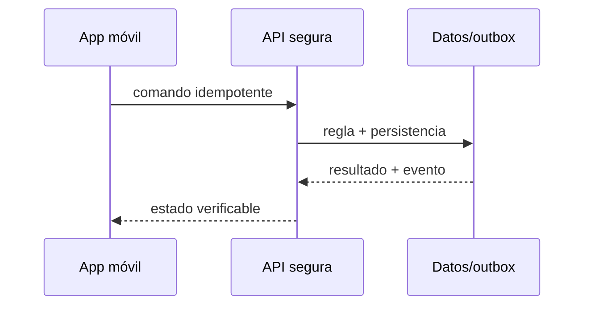

# Módulo 14: Backend de entregas: MySQL espacial, archivos y tiempo real


## Aprende construyendo

### Tema 1: CRUD API y contratos

#### Paso 1 · Objetivo y preparación
Al finalizar podrás implementar este tema desde cero. Prerrequisitos: JDK 21, Maven, Docker y un editor.

#### Paso 2 · Contexto y caso real
En un caso real de entregas, esta capacidad conecta pedidos, rutas y usuarios con contratos claros y recuperación ante fallos.

#### Paso 3 · Teoría, modelo mental y analogía
El diseño separa dominio, adaptadores y operación; cada frontera valida entradas, errores y permisos. La analogía es una central logística: cada estación tiene un responsable, protocolo y registro, no una caja de lógica mezclada.

#### Paso 4 · Demostración guiada desde cero
Parte de una carpeta vacía:
```bash
mkdir ejemplo-spring-avanzado
cd ejemplo-spring-avanzado
curl -fsSL https://start.spring.io/starter.zip -d dependencies=web,actuator -d javaVersion=21 -o app.zip
unzip app.zip
mvn test
```
Crea src/main/java/com/example/demo/Example.java con la implementación mínima y documenta cada bloque.

#### Paso 5 · Práctica guiada
Pista: ejecuta mvn test, provoca un fallo deliberado modificando una entrada o dependencia, lee el diagnóstico y corrígelo. Resultado esperado: prueba verde y salida reproducible.

#### Paso 6 · Práctica independiente
Añade un caso de éxito, un caso de error, una prueba de concurrencia y una métrica; explica qué garantía ofrece y cuál no.

#### Paso 7 · Cierre y evidencia
Guarda estructura, comandos, resultados y log; como siguiente paso integra la técnica en otro adaptador. Errores comunes: asumir configuración previa, mezclar capas, no validar fallos y omitir rollback. Fuentes oficiales: https://docs.spring.io/spring-boot/reference/ y https://spring.io/guides.
**¿Por qué es importante?** Porque una capacidad avanzada solo es útil cuando puede reproducirse y operarse con evidencia.
**Evidencia de aprendizaje:** entrega el proyecto aislado, prueba verde, fallo diagnosticado y explicación técnica.
**Conceptos clave:** contratos, estados explícitos, fallos, seguridad y verificación.

Crear, consultar, asignar, actualizar y cancelar envíos son casos de uso diferentes, no un controlador genérico que expone entidades. DTO, Bean Validation, Problem Details y OpenAPI definen el contrato. DELETE puede significar cancelación de negocio y no eliminación física. Idempotency-Key protege creación y confirmación ante reintentos. La implementación se conecta a RutaFlow y se prueba con camino feliz, entrada inválida, repetición y dependencia no disponible.

**Analogía:** Es como una central de despacho: cada mensaje necesita identidad, hora, destino y confirmación; ver un vehículo en pantalla no demuestra que el paquete fue entregado.

**¿Por qué es importante?** Porque una aplicación logística funciona en movimiento, con mala red, concurrencia y datos sensibles. La corrección debe sobrevivir fuera de una demostración local.

**Casos de uso reales:** posición tardía, token vencido, fotografía pesada, comando repetido y usuario intentando acceder a una entrega ajena.

**Diagrama:**


### Tema 2: MySQL y datos espaciales

#### Paso 1 · Objetivo y preparación
Al finalizar podrás implementar este tema desde cero. Prerrequisitos: JDK 21, Maven, Docker y un editor.

#### Paso 2 · Contexto y caso real
En un caso real de entregas, esta capacidad conecta pedidos, rutas y usuarios con contratos claros y recuperación ante fallos.

#### Paso 3 · Teoría, modelo mental y analogía
El diseño separa dominio, adaptadores y operación; cada frontera valida entradas, errores y permisos. La analogía es una central logística: cada estación tiene un responsable, protocolo y registro, no una caja de lógica mezclada.

#### Paso 4 · Demostración guiada desde cero
Parte de una carpeta vacía:
```bash
mkdir ejemplo-spring-avanzado
cd ejemplo-spring-avanzado
curl -fsSL https://start.spring.io/starter.zip -d dependencies=web,actuator -d javaVersion=21 -o app.zip
unzip app.zip
mvn test
```
Crea src/main/java/com/example/demo/Example.java con la implementación mínima y documenta cada bloque.

#### Paso 5 · Práctica guiada
Pista: ejecuta mvn test, provoca un fallo deliberado modificando una entrada o dependencia, lee el diagnóstico y corrígelo. Resultado esperado: prueba verde y salida reproducible.

#### Paso 6 · Práctica independiente
Añade un caso de éxito, un caso de error, una prueba de concurrencia y una métrica; explica qué garantía ofrece y cuál no.

#### Paso 7 · Cierre y evidencia
Guarda estructura, comandos, resultados y log; como siguiente paso integra la técnica en otro adaptador. Errores comunes: asumir configuración previa, mezclar capas, no validar fallos y omitir rollback. Fuentes oficiales: https://docs.spring.io/spring-boot/reference/ y https://spring.io/guides.
**¿Por qué es importante?** Porque una capacidad avanzada solo es útil cuando puede reproducirse y operarse con evidencia.
**Evidencia de aprendizaje:** entrega el proyecto aislado, prueba verde, fallo diagnosticado y explicación técnica.
**Conceptos clave:** contratos, estados explícitos, fallos, seguridad y verificación.

MySQL 8 almacena POINT con SRID 4326 e índices SPATIAL. ST_Distance_Sphere permite filtros iniciales de cercanía, mientras rutas reales requieren un motor vial. Longitud va antes que latitud en WKT. EXPLAIN demuestra uso del índice; precisión, timestamp y procedencia acompañan cada coordenada. La implementación se conecta a RutaFlow y se prueba con camino feliz, entrada inválida, repetición y dependencia no disponible.

**Analogía:** Es como una central de despacho: cada mensaje necesita identidad, hora, destino y confirmación; ver un vehículo en pantalla no demuestra que el paquete fue entregado.

**¿Por qué es importante?** Porque una aplicación logística funciona en movimiento, con mala red, concurrencia y datos sensibles. La corrección debe sobrevivir fuera de una demostración local.

**Casos de uso reales:** posición tardía, token vencido, fotografía pesada, comando repetido y usuario intentando acceder a una entrega ajena.

**Diagrama:**


### Tema 3: JPA e Hibernate Spatial

#### Paso 1 · Objetivo y preparación
Al finalizar podrás implementar este tema desde cero. Prerrequisitos: JDK 21, Maven, Docker y un editor.

#### Paso 2 · Contexto y caso real
En un caso real de entregas, esta capacidad conecta pedidos, rutas y usuarios con contratos claros y recuperación ante fallos.

#### Paso 3 · Teoría, modelo mental y analogía
El diseño separa dominio, adaptadores y operación; cada frontera valida entradas, errores y permisos. La analogía es una central logística: cada estación tiene un responsable, protocolo y registro, no una caja de lógica mezclada.

#### Paso 4 · Demostración guiada desde cero
Parte de una carpeta vacía:
```bash
mkdir ejemplo-spring-avanzado
cd ejemplo-spring-avanzado
curl -fsSL https://start.spring.io/starter.zip -d dependencies=web,actuator -d javaVersion=21 -o app.zip
unzip app.zip
mvn test
```
Crea src/main/java/com/example/demo/Example.java con la implementación mínima y documenta cada bloque.

#### Paso 5 · Práctica guiada
Pista: ejecuta mvn test, provoca un fallo deliberado modificando una entrada o dependencia, lee el diagnóstico y corrígelo. Resultado esperado: prueba verde y salida reproducible.

#### Paso 6 · Práctica independiente
Añade un caso de éxito, un caso de error, una prueba de concurrencia y una métrica; explica qué garantía ofrece y cuál no.

#### Paso 7 · Cierre y evidencia
Guarda estructura, comandos, resultados y log; como siguiente paso integra la técnica en otro adaptador. Errores comunes: asumir configuración previa, mezclar capas, no validar fallos y omitir rollback. Fuentes oficiales: https://docs.spring.io/spring-boot/reference/ y https://spring.io/guides.
**¿Por qué es importante?** Porque una capacidad avanzada solo es útil cuando puede reproducirse y operarse con evidencia.
**Evidencia de aprendizaje:** entrega el proyecto aislado, prueba verde, fallo diagnosticado y explicación técnica.
**Conceptos clave:** contratos, estados explícitos, fallos, seguridad y verificación.

JPA modela agregados y Hibernate traduce persistencia, pero no reemplaza entender SQL. Hibernate Spatial integra Geometry/Point; migraciones Flyway crean SRID, constraints e índices. Se evitan N+1 mediante proyecciones o fetch explícito. Una transacción valida versión optimista, guarda posición y produce outbox. La implementación se conecta a RutaFlow y se prueba con camino feliz, entrada inválida, repetición y dependencia no disponible.

**Analogía:** Es como una central de despacho: cada mensaje necesita identidad, hora, destino y confirmación; ver un vehículo en pantalla no demuestra que el paquete fue entregado.

**¿Por qué es importante?** Porque una aplicación logística funciona en movimiento, con mala red, concurrencia y datos sensibles. La corrección debe sobrevivir fuera de una demostración local.

**Casos de uso reales:** posición tardía, token vencido, fotografía pesada, comando repetido y usuario intentando acceder a una entrega ajena.

**Diagrama:**


### Tema 4: JWT Bearer y autorización por roles

#### Paso 1 · Objetivo y preparación
Al finalizar podrás implementar este tema desde cero. Prerrequisitos: JDK 21, Maven, Docker y un editor.

#### Paso 2 · Contexto y caso real
En un caso real de entregas, esta capacidad conecta pedidos, rutas y usuarios con contratos claros y recuperación ante fallos.

#### Paso 3 · Teoría, modelo mental y analogía
El diseño separa dominio, adaptadores y operación; cada frontera valida entradas, errores y permisos. La analogía es una central logística: cada estación tiene un responsable, protocolo y registro, no una caja de lógica mezclada.

#### Paso 4 · Demostración guiada desde cero
Parte de una carpeta vacía:
```bash
mkdir ejemplo-spring-avanzado
cd ejemplo-spring-avanzado
curl -fsSL https://start.spring.io/starter.zip -d dependencies=web,actuator -d javaVersion=21 -o app.zip
unzip app.zip
mvn test
```
Crea src/main/java/com/example/demo/Example.java con la implementación mínima y documenta cada bloque.

#### Paso 5 · Práctica guiada
Pista: ejecuta mvn test, provoca un fallo deliberado modificando una entrada o dependencia, lee el diagnóstico y corrígelo. Resultado esperado: prueba verde y salida reproducible.

#### Paso 6 · Práctica independiente
Añade un caso de éxito, un caso de error, una prueba de concurrencia y una métrica; explica qué garantía ofrece y cuál no.

#### Paso 7 · Cierre y evidencia
Guarda estructura, comandos, resultados y log; como siguiente paso integra la técnica en otro adaptador. Errores comunes: asumir configuración previa, mezclar capas, no validar fallos y omitir rollback. Fuentes oficiales: https://docs.spring.io/spring-boot/reference/ y https://spring.io/guides.
**¿Por qué es importante?** Porque una capacidad avanzada solo es útil cuando puede reproducirse y operarse con evidencia.
**Evidencia de aprendizaje:** entrega el proyecto aislado, prueba verde, fallo diagnosticado y explicación técnica.
**Conceptos clave:** contratos, estados explícitos, fallos, seguridad y verificación.

Spring Security valida Authorization: Bearer mediante resource server y firma asimétrica; no se escribe criptografía casera. ROLE_DRIVER permite acciones de conductor, pero también se verifica que la jornada esté asignada a esa identidad. Expiración corta, scopes, rotación y revocación limitan daño. Logs nunca imprimen tokens. La implementación se conecta a RutaFlow y se prueba con camino feliz, entrada inválida, repetición y dependencia no disponible.

**Analogía:** Es como una central de despacho: cada mensaje necesita identidad, hora, destino y confirmación; ver un vehículo en pantalla no demuestra que el paquete fue entregado.

**¿Por qué es importante?** Porque una aplicación logística funciona en movimiento, con mala red, concurrencia y datos sensibles. La corrección debe sobrevivir fuera de una demostración local.

**Casos de uso reales:** posición tardía, token vencido, fotografía pesada, comando repetido y usuario intentando acceder a una entrega ajena.

**Diagrama:**


### Tema 5: Socket.IO y tiempo real

#### Paso 1 · Objetivo y preparación
Al finalizar podrás implementar este tema desde cero. Prerrequisitos: JDK 21, Maven, Docker y un editor.

#### Paso 2 · Contexto y caso real
En un caso real de entregas, esta capacidad conecta pedidos, rutas y usuarios con contratos claros y recuperación ante fallos.

#### Paso 3 · Teoría, modelo mental y analogía
El diseño separa dominio, adaptadores y operación; cada frontera valida entradas, errores y permisos. La analogía es una central logística: cada estación tiene un responsable, protocolo y registro, no una caja de lógica mezclada.

#### Paso 4 · Demostración guiada desde cero
Parte de una carpeta vacía:
```bash
mkdir ejemplo-spring-avanzado
cd ejemplo-spring-avanzado
curl -fsSL https://start.spring.io/starter.zip -d dependencies=web,actuator -d javaVersion=21 -o app.zip
unzip app.zip
mvn test
```
Crea src/main/java/com/example/demo/Example.java con la implementación mínima y documenta cada bloque.

#### Paso 5 · Práctica guiada
Pista: ejecuta mvn test, provoca un fallo deliberado modificando una entrada o dependencia, lee el diagnóstico y corrígelo. Resultado esperado: prueba verde y salida reproducible.

#### Paso 6 · Práctica independiente
Añade un caso de éxito, un caso de error, una prueba de concurrencia y una métrica; explica qué garantía ofrece y cuál no.

#### Paso 7 · Cierre y evidencia
Guarda estructura, comandos, resultados y log; como siguiente paso integra la técnica en otro adaptador. Errores comunes: asumir configuración previa, mezclar capas, no validar fallos y omitir rollback. Fuentes oficiales: https://docs.spring.io/spring-boot/reference/ y https://spring.io/guides.
**¿Por qué es importante?** Porque una capacidad avanzada solo es útil cuando puede reproducirse y operarse con evidencia.
**Evidencia de aprendizaje:** entrega el proyecto aislado, prueba verde, fallo diagnosticado y explicación técnica.
**Conceptos clave:** contratos, estados explícitos, fallos, seguridad y verificación.

Spring soporta WebSocket/STOMP de forma natural; Socket.IO es otro protocolo y requiere un servidor compatible o gateway. El curso implementa y compara ambos para decidir por interoperabilidad, rooms, acknowledgements y operación. Eventos contienen shipmentId, sequence, occurredAt y schemaVersion; consumidores deduplican. La implementación se conecta a RutaFlow y se prueba con camino feliz, entrada inválida, repetición y dependencia no disponible.

**Analogía:** Es como una central de despacho: cada mensaje necesita identidad, hora, destino y confirmación; ver un vehículo en pantalla no demuestra que el paquete fue entregado.

**¿Por qué es importante?** Porque una aplicación logística funciona en movimiento, con mala red, concurrencia y datos sensibles. La corrección debe sobrevivir fuera de una demostración local.

**Casos de uso reales:** posición tardía, token vencido, fotografía pesada, comando repetido y usuario intentando acceder a una entrega ajena.

**Diagrama:**


### Tema 6: Archivos y notificaciones push

#### Paso 1 · Objetivo y preparación
Al finalizar podrás implementar este tema desde cero. Prerrequisitos: JDK 21, Maven, Docker y un editor.

#### Paso 2 · Contexto y caso real
En un caso real de entregas, esta capacidad conecta pedidos, rutas y usuarios con contratos claros y recuperación ante fallos.

#### Paso 3 · Teoría, modelo mental y analogía
El diseño separa dominio, adaptadores y operación; cada frontera valida entradas, errores y permisos. La analogía es una central logística: cada estación tiene un responsable, protocolo y registro, no una caja de lógica mezclada.

#### Paso 4 · Demostración guiada desde cero
Parte de una carpeta vacía:
```bash
mkdir ejemplo-spring-avanzado
cd ejemplo-spring-avanzado
curl -fsSL https://start.spring.io/starter.zip -d dependencies=web,actuator -d javaVersion=21 -o app.zip
unzip app.zip
mvn test
```
Crea src/main/java/com/example/demo/Example.java con la implementación mínima y documenta cada bloque.

#### Paso 5 · Práctica guiada
Pista: ejecuta mvn test, provoca un fallo deliberado modificando una entrada o dependencia, lee el diagnóstico y corrígelo. Resultado esperado: prueba verde y salida reproducible.

#### Paso 6 · Práctica independiente
Añade un caso de éxito, un caso de error, una prueba de concurrencia y una métrica; explica qué garantía ofrece y cuál no.

#### Paso 7 · Cierre y evidencia
Guarda estructura, comandos, resultados y log; como siguiente paso integra la técnica en otro adaptador. Errores comunes: asumir configuración previa, mezclar capas, no validar fallos y omitir rollback. Fuentes oficiales: https://docs.spring.io/spring-boot/reference/ y https://spring.io/guides.
**¿Por qué es importante?** Porque una capacidad avanzada solo es útil cuando puede reproducirse y operarse con evidencia.
**Evidencia de aprendizaje:** entrega el proyecto aislado, prueba verde, fallo diagnosticado y explicación técnica.
**Conceptos clave:** contratos, estados explícitos, fallos, seguridad y verificación.

La base almacena metadatos y hash; fotografías viven en object storage con claves no predecibles, URLs firmadas y retención. Se valida MIME real, tamaño y malware. Un outbox dispara Firebase Admin/APNs después del commit. Push es entrega al menos una vez: payload mínimo, deduplicación y consulta posterior al API. La implementación se conecta a RutaFlow y se prueba con camino feliz, entrada inválida, repetición y dependencia no disponible.

**Analogía:** Es como una central de despacho: cada mensaje necesita identidad, hora, destino y confirmación; ver un vehículo en pantalla no demuestra que el paquete fue entregado.

**¿Por qué es importante?** Porque una aplicación logística funciona en movimiento, con mala red, concurrencia y datos sensibles. La corrección debe sobrevivir fuera de una demostración local.

**Casos de uso reales:** posición tardía, token vencido, fotografía pesada, comando repetido y usuario intentando acceder a una entrega ajena.

**Diagrama:**


