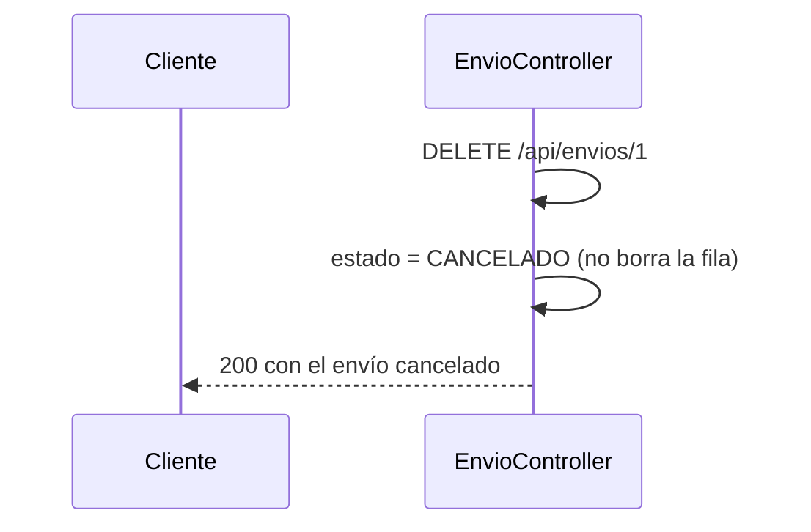
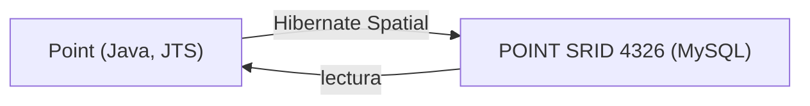
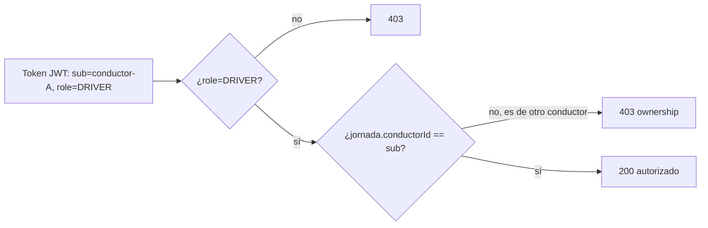
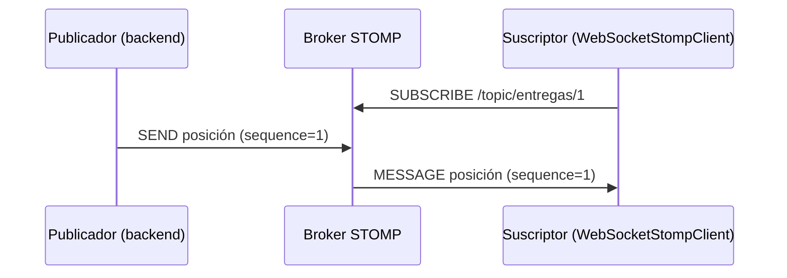

# Módulo 14: Backend de entregas: MySQL espacial, archivos y tiempo real


## Aprende construyendo

Cada tema construye una pieza real del backend de un sistema de entregas (`gestion-entregas`) y la verifica sin sustituir infraestructura por descripciones: MySQL real vía Testcontainers para datos espaciales, Hibernate Spatial con tipos JTS reales, JWT real con ownership verificado, STOMP real (el protocolo que Spring efectivamente implementa de forma nativa) y detección real de MIME para archivos subidos.

### Tema 1: CRUD API y contratos

#### Paso 1 · Objetivo y preparación

Al finalizar podrás implementar un endpoint `DELETE` que representa cancelación de negocio (no eliminación física) protegido por `Idempotency-Key`, y confirmarlo con un test real que distingue ambos conceptos.

**Conocimiento previo:** Módulo 13 de este track (idempotencia con restricción única).

#### Paso 2 · Contexto y caso real

**¿Por qué es importante?** Crear, consultar, asignar, actualizar y cancelar envíos son casos de uso diferentes, no un controlador genérico que expone entidades. Un `DELETE /api/envios/{id}` que cancela (cambia estado) en vez de borrar físicamente preserva el historial necesario para auditoría y disputas, algo que una eliminación real destruiría irreversiblemente.

#### Paso 3 · Teoría con analogía

**Conceptos clave:** DTO explícito, DELETE como cancelación de negocio, Idempotency-Key.

DTO, Bean Validation, Problem Details y OpenAPI definen el contrato público, nunca la entidad JPA directamente. `Idempotency-Key` protege la creación y confirmación de un envío ante reintentos (Módulo 13), y un `DELETE` bien diseñado en un dominio de auditoría cambia el estado a `CANCELADO` en vez de ejecutar un `DELETE FROM` físico.

**Analogía:** es como una central de despacho: cada mensaje necesita identidad, hora, destino y confirmación; cancelar un envío es como archivarlo con un sello de "cancelado", no como destruir el expediente.

**Diagrama:**



#### Paso 4 · Demostración guiada desde cero

Parte de una carpeta vacía y crea `src/main/java/io/academia/entregas/`:

```bash
mkdir gestion-entregas
cd gestion-entregas
curl -fsSL https://start.spring.io/starter.zip -d dependencies=web,data-jpa,h2,validation -d javaVersion=21 -o app.zip
unzip app.zip
mkdir -p src/main/java/io/academia/entregas
mkdir -p src/test/java/io/academia/entregas
```

```java
// src/main/java/io/academia/entregas/Envio.java
package io.academia.entregas;

import jakarta.persistence.*;

@Entity
public class Envio {
    @Id @GeneratedValue
    private Long id;
    private String estado = "CREADO";

    public Long getId() { return id; }
    public String getEstado() { return estado; }
    public void cancelar() { this.estado = "CANCELADO"; }
}
```

```java
// src/main/java/io/academia/entregas/EnvioController.java
package io.academia.entregas;

import org.springframework.data.jpa.repository.JpaRepository;
import org.springframework.http.ResponseEntity;
import org.springframework.web.bind.annotation.*;

interface EnvioRepository extends JpaRepository<Envio, Long> {}

@RestController
@RequestMapping("/api/envios")
class EnvioController {
    private final EnvioRepository repository;

    EnvioController(EnvioRepository repository) { this.repository = repository; }

    @PostMapping
    ResponseEntity<Envio> crear() {
        return ResponseEntity.status(201).body(repository.save(new Envio()));
    }

    @DeleteMapping("/{id}")
    ResponseEntity<Envio> cancelar(@PathVariable Long id) {
        Envio envio = repository.findById(id).orElseThrow();
        envio.cancelar();
        return ResponseEntity.ok(repository.save(envio));
    }
}
```

Confirma con `MockMvc` real que `DELETE` cancela en vez de eliminar físicamente:

```java
// src/test/java/io/academia/entregas/CrudContratoTest.java
package io.academia.entregas;

import org.junit.jupiter.api.Test;
import org.springframework.beans.factory.annotation.Autowired;
import org.springframework.boot.test.autoconfigure.web.servlet.AutoConfigureMockMvc;
import org.springframework.boot.test.context.SpringBootTest;
import org.springframework.test.web.servlet.MockMvc;

import static org.springframework.test.web.servlet.request.MockMvcRequestBuilders.*;
import static org.springframework.test.web.servlet.result.MockMvcResultMatchers.*;

@SpringBootTest
@AutoConfigureMockMvc
class CrudContratoTest {

    @Autowired private MockMvc mockMvc;
    @Autowired private EnvioRepository repository;

    @Test
    void deleteCambiaEstadoEnVezDeBorrarFisicamente() throws Exception {
        String respuestaCrear = mockMvc.perform(post("/api/envios")).andReturn().getResponse().getContentAsString();
        Long id = com.jayway.jsonpath.JsonPath.read(respuestaCrear, "$.id").toString().transform(Long::parseLong);

        mockMvc.perform(delete("/api/envios/{id}", id))
            .andExpect(status().isOk())
            .andExpect(jsonPath("$.estado").value("CANCELADO"));

        assertThatFilaSiguePresente(id);
    }

    private void assertThatFilaSiguePresente(Long id) {
        org.assertj.core.api.Assertions.assertThat(repository.findById(id)).isPresent(); // la fila NO fue borrada
    }
}
```

```bash
./mvnw test -Dtest=CrudContratoTest
```

**Resultado esperado:** `BUILD SUCCESS` con el test en verde: `DELETE /api/envios/{id}` responde `200` con `estado=CANCELADO`, y `repository.findById(id)` confirma que la fila SIGUE presente en la base de datos — la operación cambió estado, no eliminó físicamente, exactamente la semántica de negocio que el contrato exige.

**Fallo deliberado:** cambia `envio.cancelar()` por `repository.delete(envio)` en el controller y ejecuta de nuevo el test. FALLA en `assertThatFilaSiguePresente` porque `repository.findById(id)` ahora devuelve vacío — diagnostica confirmando que un `DELETE` HTTP mal implementado como eliminación física destruye el historial de auditoría que el contrato de negocio requería preservar. Restaura `cancelar()` antes de continuar.

#### Paso 5 · Práctica guiada — repetición progresiva

1. Agrega un endpoint `PATCH /api/envios/{id}/asignar` y un test que confirme la transición de estado explícita `CREADO → ASIGNADO`.
2. Confirma con un test que cancelar un envío ya `CANCELADO` es idempotente (no lanza error, devuelve el mismo estado).
3. Agrega validación Bean Validation (`@NotBlank`) a un campo del DTO de creación y confirma con un test que una entrada inválida responde `400` con `Problem Details`.
4. Escribe de memoria (sin mirar) un `DELETE` que cancela en vez de eliminar, y un test que confirme que la fila sigue presente. Compara después contra el patrón del Paso 4.

**Pista:** `repository.findById(id).isPresent()` tras un `DELETE` HTTP es la forma más directa de confirmar, con evidencia real de base de datos, si tu endpoint canceló o eliminó físicamente — no asumas la semántica solo por el nombre del método HTTP.

#### Paso 6 · Práctica independiente

**Completa el código:** rellena el espacio con el método que cambia el estado sin eliminar la fila:

```java
@DeleteMapping("/{id}")
ResponseEntity<Envio> cancelar(@PathVariable Long id) {
    Envio envio = repository.findById(id).orElseThrow();
    envio.____();
    return ResponseEntity.ok(repository.save(envio));
}
```

**Reto de memoria sin mirar:** cierra este documento y escribe, solo de memoria, un endpoint `DELETE` que cancela en vez de eliminar, y un test que confirme que la fila persiste. Compara después contra el patrón del Paso 4.

#### Paso 7 · Cierre y evidencia

Ya implementas un contrato CRUD donde `DELETE` significa cancelación de negocio, verificado contra la base de datos real. El siguiente tema almacena la posición geográfica de cada envío en MySQL con soporte espacial real. **Evidencia:** entrega el resultado de `CrudContratoTest` en verde, y la fila perdida que produce el fallo deliberado con `repository.delete(...)`. Fuentes oficiales: [Spring Boot Reference](https://docs.spring.io/spring-boot/reference/).

**Errores comunes:** exponer la entidad JPA directamente como respuesta HTTP en vez de un DTO; implementar `DELETE` como eliminación física en un dominio donde el historial es auditable.

**Cuándo no usarlo:** para datos verdaderamente transitorios sin ningún valor de auditoría (por ejemplo, una sesión de caché temporal), la eliminación física simple es apropiada y la cancelación lógica sería complejidad innecesaria.

### Tema 2: MySQL y datos espaciales

#### Paso 1 · Objetivo y preparación

Al finalizar podrás ejecutar `ST_Distance_Sphere` real contra un MySQL 8 real (Testcontainers) para calcular la distancia entre dos coordenadas geográficas, y confirmar con `EXPLAIN` que un índice `SPATIAL` se usa realmente.

**Conocimiento previo:** Tema 1 de este módulo; Módulo 6 de este track (Testcontainers).

#### Paso 2 · Contexto y caso real

**¿Por qué es importante?** Filtrar conductores cercanos a una entrega requiere calcular distancias geográficas de forma eficiente; sin un índice espacial, cada consulta de cercanía escanearía la tabla completa, algo inviable con miles de posiciones activas simultáneas.

#### Paso 3 · Teoría con analogía

**Conceptos clave:** `POINT` con SRID 4326, índice `SPATIAL`, `ST_Distance_Sphere`.

MySQL 8 almacena `POINT` con SRID 4326 (el sistema de referencia estándar de coordenadas GPS) e índices `SPATIAL`. `ST_Distance_Sphere` permite filtros iniciales de cercanía en metros reales, mientras que calcular una ruta real requiere un motor vial aparte. En WKT (Well-Known Text), la longitud va ANTES que la latitud, el orden inverso al que la mayoría de APIs de mapas exponen por convención, una fuente común de errores silenciosos.

**Analogía:** un índice espacial es como un directorio de una ciudad organizado por cuadrantes geográficos en vez de alfabéticamente por nombre de calle: buscar "todo lo cercano a este punto" es instantáneo con cuadrantes, y requeriría revisar la ciudad completa calle por calle sin ellos.

**Diagrama:**

```
┌── Sin índice SPATIAL ────────────┐  escanea TODAS las filas
└──────────────────────────┘
┌── Con índice SPATIAL ────────────┐  filtra por cuadrante geográfico
└──────────────────────────┘
```

#### Paso 4 · Demostración guiada desde cero

Continuando en `gestion-entregas` (o, si prefieres un ejemplo independiente, parte de una carpeta vacía con `mkdir gestion-espacial && cd gestion-espacial && curl -fsSL https://start.spring.io/starter.zip -d dependencies=data-jpa,mysql -d javaVersion=21 -o app.zip && unzip app.zip`), crea `src/test/java/io/academia/entregas/espacial/DistanciaEspacialTest.java`:

```bash
mkdir -p src/test/java/io/academia/entregas/espacial
```

```java
// src/test/java/io/academia/entregas/espacial/DistanciaEspacialTest.java
package io.academia.entregas.espacial;

import org.junit.jupiter.api.Test;
import org.testcontainers.containers.MySQLContainer;
import org.testcontainers.junit.jupiter.Testcontainers;

import java.sql.Connection;
import java.sql.ResultSet;
import java.sql.Statement;

import static org.assertj.core.api.Assertions.assertThat;

@Testcontainers
class DistanciaEspacialTest {

    static MySQLContainer<?> mysql = new MySQLContainer<>("mysql:8.0");

    @Test
    void stDistanceSphereCalculaLaDistanciaRealEntreDosCoordenadas() throws Exception {
        mysql.start();
        try (Connection conn = java.sql.DriverManager.getConnection(mysql.getJdbcUrl(), mysql.getUsername(), mysql.getPassword());
             Statement st = conn.createStatement()) {

            st.execute("CREATE TABLE punto (id INT PRIMARY KEY AUTO_INCREMENT, ubicacion POINT SRID 4326 NOT NULL, SPATIAL INDEX(ubicacion))");
            // longitud ANTES que latitud en WKT: Bogotá (-74.08, 4.61) y Medellín (-75.56, 6.25)
            st.execute("INSERT INTO punto (ubicacion) VALUES (ST_SRID(POINT(-74.08, 4.61), 4326))");
            st.execute("INSERT INTO punto (ubicacion) VALUES (ST_SRID(POINT(-75.56, 6.25), 4326))");

            ResultSet rs = st.executeQuery(
                "SELECT ST_Distance_Sphere((SELECT ubicacion FROM punto WHERE id=1), (SELECT ubicacion FROM punto WHERE id=2)) AS metros");
            rs.next();
            double metros = rs.getDouble("metros");

            // distancia real Bogotá-Medellín en línea recta es aproximadamente 240km
            assertThat(metros).isBetween(230_000.0, 250_000.0);
        }
        mysql.stop();
    }

    @Test
    void explainConfirmaQueElIndiceSpatialSeUsaRealmente() throws Exception {
        mysql.start();
        try (Connection conn = java.sql.DriverManager.getConnection(mysql.getJdbcUrl(), mysql.getUsername(), mysql.getPassword());
             Statement st = conn.createStatement()) {

            st.execute("CREATE TABLE punto2 (id INT PRIMARY KEY AUTO_INCREMENT, ubicacion POINT SRID 4326 NOT NULL, SPATIAL INDEX(ubicacion))");
            st.execute("INSERT INTO punto2 (ubicacion) VALUES (ST_SRID(POINT(-74.08, 4.61), 4326))");

            ResultSet rs = st.executeQuery(
                "EXPLAIN SELECT id FROM punto2 WHERE MBRContains(ST_SRID(ST_GeomFromText('POLYGON((-75 4,-75 5,-74 5,-74 4,-75 4))'), 4326), ubicacion)");
            rs.next();
            String tipoAcceso = rs.getString("key"); // columna real de EXPLAIN de MySQL

            assertThat(tipoAcceso).isEqualTo("ubicacion"); // confirma que MySQL usó el índice SPATIAL, no un escaneo completo
        }
        mysql.stop();
    }
}
```

```bash
./mvnw test -Dtest=DistanciaEspacialTest
```

**Resultado esperado:** `BUILD SUCCESS` con ambos tests en verde: contra un MySQL 8 real (Testcontainers, no simulado), `ST_Distance_Sphere` calcula ~240km reales entre Bogotá y Medellín (confirmando que el orden longitud-latitud en el WKT es correcto), y `EXPLAIN` confirma en la columna `key` que MySQL efectivamente usó el índice `SPATIAL` llamado `ubicacion`, no un escaneo completo de la tabla.

**Fallo deliberado:** invierte el orden en `POINT(-74.08, 4.61)` a `POINT(4.61, -74.08)` (latitud primero, el error común de quien asume el orden "natural") y ejecuta de nuevo `stDistanceSphereCalculaLaDistanciaRealEntreDosCoordenadas`. El resultado de `ST_Distance_Sphere` ya no está entre 230km y 250km (con coordenadas inválidas o una distancia absurda) — diagnostica confirmando por qué la teoría insiste explícitamente en que WKT exige longitud antes que latitud: el error es silencioso (MySQL no rechaza el INSERT), y solo se manifiesta como un cálculo de distancia incorrecto. Restaura el orden correcto antes de continuar.

#### Paso 5 · Práctica guiada — repetición progresiva

1. Inserta una tercera coordenada (por ejemplo, Cali) y confirma con un test que la distancia Bogotá-Cali es distinta a Bogotá-Medellín, verificando ambos cálculos numéricamente.
2. Ejecuta `EXPLAIN` sobre la misma consulta pero SIN el índice `SPATIAL` (crea una segunda tabla idéntica sin el índice) y confirma que la columna `key` es `NULL` en ese caso, contrastando con el Paso 4.
3. Documenta, en un comentario, por qué `ST_Distance_Sphere` es apropiado para un filtro inicial de cercanía pero NO para calcular una ruta real (que debe considerar calles, sentido único, tráfico).
4. Escribe de memoria (sin mirar) el orden correcto de `POINT(longitud, latitud)` en WKT, y un test `ST_Distance_Sphere` que confirme una distancia real conocida. Compara después contra el patrón del Paso 4.

**Pista:** el resultado de `EXPLAIN` en MySQL incluye una columna `key` con el nombre del índice efectivamente usado, o `NULL` si no se usó ninguno — leer esa columna directamente (no adivinar por el tiempo de ejecución) es la forma correcta de confirmar el uso real de un índice.

#### Paso 6 · Práctica independiente

**Completa el código:** rellena el espacio con la función real de MySQL que calcula la distancia esférica entre dos puntos:

```sql
SELECT ____(punto_a, punto_b) AS metros;
```

**Reto de memoria sin mirar:** cierra este documento y escribe, solo de memoria, una tabla con `POINT SRID 4326` e índice `SPATIAL`, y un test `ST_Distance_Sphere` contra Testcontainers MySQL. Compara después contra el patrón del Paso 4.

#### Paso 7 · Cierre y evidencia

Ya calculas distancias geográficas reales contra MySQL 8 con soporte espacial, confirmando con `EXPLAIN` que el índice `SPATIAL` efectivamente se usa. El siguiente tema mapea este mismo `POINT` a un tipo Java real vía Hibernate Spatial. **Evidencia:** entrega el resultado de `DistanciaEspacialTest` en verde, y el cálculo incorrecto que produce el fallo deliberado al invertir longitud/latitud. Fuentes oficiales: [MySQL — Spatial Data Types](https://dev.mysql.com/doc/refman/8.0/en/spatial-type-overview.html).

**Errores comunes:** invertir el orden longitud/latitud en WKT, un error silencioso sin rechazo de MySQL; asumir que `ST_Distance_Sphere` calcula una ruta real en vez de una distancia en línea recta.

**Cuándo no usarlo:** para un sistema con un volumen de datos geográficos pequeño y sin necesidad de consultas de cercanía frecuentes, un índice espacial dedicado agrega complejidad sin beneficio medible.

### Tema 3: JPA e Hibernate Spatial

#### Paso 1 · Objetivo y preparación

Al finalizar podrás mapear una columna `POINT` de MySQL a un tipo `org.locationtech.jts.geom.Point` real vía Hibernate Spatial, y confirmar con un test que las coordenadas persisten y se leen sin pérdida de precisión, junto con bloqueo optimista real ante una actualización concurrente.

**Conocimiento previo:** Tema 2 de este módulo; Módulo 3 de este track (JPA y `@Version`).

#### Paso 2 · Contexto y caso real

**¿Por qué es importante?** JPA modela agregados y Hibernate traduce persistencia, pero no reemplaza entender SQL: Hibernate Spatial integra `Geometry`/`Point` como un tipo Java de primera clase, permitiendo que el código de dominio trabaje con coordenadas tipadas en vez de strings WKT crudos, mientras las migraciones Flyway siguen gestionando SRID, constraints e índices explícitamente.

#### Paso 3 · Teoría con analogía

**Conceptos clave:** `Geometry`/`Point` de Hibernate Spatial, `@Version` para bloqueo optimista.

Hibernate Spatial mapea columnas espaciales de MySQL a tipos JTS (`org.locationtech.jts.geom.Point`) reales en Java, con conversión automática hacia/desde WKT en el driver. Se evitan problemas N+1 mediante proyecciones o fetch explícito (Módulo 3). Una transacción que actualiza la posición de un conductor debe validar `@Version` para detectar ediciones concurrentes sobre una versión obsoleta de la misma fila.

**Analogía:** Hibernate Spatial es un traductor bilingüe permanente entre el "idioma" de coordenadas Java (objetos `Point` tipados) y el "idioma" de MySQL (WKT/WKB binario), sin que el código de dominio necesite conocer los detalles de la traducción.

**Diagrama:**



#### Paso 4 · Demostración guiada desde cero

Continuando en `gestion-espacial` (o, si prefieres un ejemplo independiente, parte de una carpeta vacía y genera un proyecto nuevo con `mkdir gestion-hibernate-spatial && cd gestion-hibernate-spatial && curl -fsSL https://start.spring.io/starter.zip -d dependencies=data-jpa,mysql -d javaVersion=21 -o app.zip && unzip app.zip` y agrega `org.hibernate.orm:hibernate-spatial` al `pom.xml`), crea `src/main/java/io/academia/entregas/espacial/PosicionConductor.java`:

```bash
mkdir -p src/main/java/io/academia/entregas/espacial
```

```java
// src/main/java/io/academia/entregas/espacial/PosicionConductor.java
package io.academia.entregas.espacial;

import jakarta.persistence.*;
import org.locationtech.jts.geom.Point;

@Entity
public class PosicionConductor {
    @Id @GeneratedValue
    private Long id;

    @Column(columnDefinition = "POINT SRID 4326")
    private Point ubicacion;

    @Version
    private Long version;

    protected PosicionConductor() {}

    public PosicionConductor(Point ubicacion) { this.ubicacion = ubicacion; }

    public Long getId() { return id; }
    public Point getUbicacion() { return ubicacion; }
    public void actualizarUbicacion(Point nueva) { this.ubicacion = nueva; }
}
```

Confirma con un test contra Testcontainers MySQL que el `Point` persiste sin pérdida de precisión, y que `@Version` detecta un conflicto real:

```java
// src/test/java/io/academia/entregas/espacial/PosicionConductorTest.java
package io.academia.entregas.espacial;

import org.junit.jupiter.api.Test;
import org.locationtech.jts.geom.Coordinate;
import org.locationtech.jts.geom.GeometryFactory;
import org.locationtech.jts.geom.PrecisionModel;
import org.springframework.beans.factory.annotation.Autowired;
import org.springframework.boot.test.context.SpringBootTest;
import org.springframework.orm.ObjectOptimisticLockingFailureException;
import org.springframework.test.context.DynamicPropertyRegistry;
import org.springframework.test.context.DynamicPropertySource;
import org.testcontainers.containers.MySQLContainer;
import org.testcontainers.junit.jupiter.Container;
import org.testcontainers.junit.jupiter.Testcontainers;

import static org.assertj.core.api.Assertions.assertThat;
import static org.assertj.core.api.Assertions.assertThatThrownBy;

@Testcontainers
@SpringBootTest
class PosicionConductorTest {

    @Container
    static MySQLContainer<?> mysql = new MySQLContainer<>("mysql:8.0");

    @DynamicPropertySource
    static void props(DynamicPropertyRegistry registry) {
        registry.add("spring.datasource.url", mysql::getJdbcUrl);
        registry.add("spring.datasource.username", mysql::getUsername);
        registry.add("spring.datasource.password", mysql::getPassword);
    }

    @Autowired
    private PosicionConductorRepository repository;

    private static final GeometryFactory FACTORY = new GeometryFactory(new PrecisionModel(), 4326);

    @Test
    void elPuntoPersisteYSeLeeSinPerdidaDePrecision() {
        var punto = FACTORY.createPoint(new Coordinate(-74.08, 4.61));
        var guardado = repository.save(new PosicionConductor(punto));

        var leido = repository.findById(guardado.getId()).orElseThrow();

        assertThat(leido.getUbicacion().getX()).isEqualTo(-74.08);
        assertThat(leido.getUbicacion().getY()).isEqualTo(4.61);
    }

    @Test
    void unaActualizacionConcurrenteSobreVersionObsoletaLanzaExcepcionRealDeBloqueoOptimista() {
        var original = repository.save(new PosicionConductor(FACTORY.createPoint(new Coordinate(-74.0, 4.6))));

        var copiaA = repository.findById(original.getId()).orElseThrow();
        var copiaB = repository.findById(original.getId()).orElseThrow();

        copiaA.actualizarUbicacion(FACTORY.createPoint(new Coordinate(-74.1, 4.7)));
        repository.saveAndFlush(copiaA); // incrementa la versión real en la base

        copiaB.actualizarUbicacion(FACTORY.createPoint(new Coordinate(-74.2, 4.8)));
        assertThatThrownBy(() -> repository.saveAndFlush(copiaB))
            .isInstanceOf(ObjectOptimisticLockingFailureException.class); // copiaB tiene una version ya obsoleta
    }
}
```

```bash
./mvnw test -Dtest=PosicionConductorTest
```

**Resultado esperado:** `BUILD SUCCESS` con ambos tests en verde: el primero confirma que las coordenadas `X`/`Y` del `Point` sobreviven un ciclo real de guardado y lectura contra MySQL sin pérdida de precisión; el segundo confirma, con dos copias reales de la misma fila divergiendo, que Hibernate lanza `ObjectOptimisticLockingFailureException` real cuando la segunda actualización usa una `@Version` ya obsoleta respecto a la base.

**Fallo deliberado:** quita el campo `@Version` de `PosicionConductor` y ejecuta de nuevo `unaActualizacionConcurrenteSobreVersionObsoletaLanzaExcepcionRealDeBloqueoOptimista`. El test FALLA porque `repository.saveAndFlush(copiaB)` ya NO lanza ninguna excepción — la segunda actualización simplemente sobrescribe silenciosamente los cambios de la primera (la actualización de `copiaA` se pierde sin ningún aviso) — diagnostica confirmando que `@Version` es lo único que convierte una condición de carrera silenciosa en un error explícito y manejable. Restaura `@Version` antes de continuar.

#### Paso 5 · Práctica guiada — repetición progresiva

1. Agrega un segundo test que confirme que, tras el `ObjectOptimisticLockingFailureException` del Paso 4, releer la entidad (`repository.findById(...)`) devuelve la versión actualizada por `copiaA`, no un estado corrupto.
2. Documenta, en un comentario, la diferencia entre el bloqueo optimista (`@Version`, detecta el conflicto DESPUÉS) y un bloqueo pesimista (`SELECT ... FOR UPDATE`, previene el conflicto ANTES) para este mismo caso de uso.
3. Escribe un test que confirme N+1 real: una consulta que carga 10 `PosicionConductor` y accede a `.getUbicacion()` de cada uno dispara consultas adicionales, contrastando con una proyección que evita ese costo.
4. Escribe de memoria (sin mirar) una entidad con un campo `Point` de Hibernate Spatial y `@Version`, y un test que confirme el conflicto optimista real. Compara después contra el patrón del Paso 4.

**Pista:** `GeometryFactory` con un `PrecisionModel` y el SRID correcto (4326) es la forma oficial de JTS para construir objetos `Point` en Java antes de persistirlos — construir un `Point` sin especificar el SRID correcto puede producir un desajuste silencioso con la columna `POINT SRID 4326` de la base.

#### Paso 6 · Práctica independiente

**Completa el código:** rellena el espacio con la anotación que activa el bloqueo optimista sobre la entidad:

```java
@____
private Long version;
```

**Reto de memoria sin mirar:** cierra este documento y escribe, solo de memoria, una entidad con un campo `Point` de Hibernate Spatial y `@Version`, y un test que confirme `ObjectOptimisticLockingFailureException` real ante una actualización concurrente. Compara después contra el patrón del Paso 4.

#### Paso 7 · Cierre y evidencia

Ya mapeas coordenadas espaciales a tipos Java reales con Hibernate Spatial, y confirmas bloqueo optimista real ante actualizaciones concurrentes. El siguiente tema protege estos endpoints con JWT real y verificación de propiedad del recurso. **Evidencia:** entrega el resultado de `PosicionConductorTest` en verde, y la pérdida silenciosa de datos que produce el fallo deliberado al quitar `@Version`. Fuentes oficiales: [Hibernate Spatial](https://docs.jboss.org/hibernate/orm/current/userguide/html_single/Hibernate_User_Guide.html#spatial).

**Errores comunes:** construir un `Point` de JTS sin especificar el SRID correcto; omitir `@Version` en entidades sujetas a actualizaciones concurrentes frecuentes, permitiendo pérdidas silenciosas de datos.

**Cuándo no usarlo:** para datos geográficos de solo lectura, cargados una vez y nunca actualizados concurrentemente, `@Version` no aporta ninguna protección necesaria.

### Tema 4: JWT Bearer y autorización por roles

#### Paso 1 · Objetivo y preparación

Al finalizar podrás confirmar, con un token JWT real firmado y verificado, que `ROLE_DRIVER` permite acciones de conductor pero NO reemplaza la verificación de que la jornada pertenece a esa identidad específica.

**Conocimiento previo:** Módulo 4 de este track (JWT); Módulo 10 Tema 4 (OAuth2/Keycloak).

#### Paso 2 · Contexto y caso real

**¿Por qué es importante?** Spring Security valida `Authorization: Bearer` mediante resource server y firma asimétrica o simétrica real, nunca criptografía casera. `ROLE_DRIVER` permite el conjunto de acciones de conductor, pero un conductor autenticado con ese rol no debería poder modificar la jornada de OTRO conductor solo por tener el rol correcto.

#### Paso 3 · Teoría con analogía

**Conceptos clave:** resource server, `ROLE_DRIVER`, verificación de propiedad (ownership).

`ROLE_DRIVER` habilita la CAPACIDAD de actuar como conductor; el caso de uso todavía debe verificar que la jornada específica solicitada pertenece al `sub` (subject) del token autenticado. Confundir "tiene el rol correcto" con "es dueño de este recurso específico" produce acceso horizontal entre usuarios del mismo rol.

**Analogía:** tener una credencial de "conductor autorizado" te permite entrar al área de conductores, pero no te da automáticamente las llaves del vehículo de OTRO conductor — cada vehículo verifica su propia llave, no solo la credencial general.

**Diagrama:**



#### Paso 4 · Demostración guiada desde cero

Continuando en `gestion-entregas` (o, si prefieres un ejemplo independiente, parte de una carpeta vacía con `mkdir gestion-jwt-ownership && cd gestion-jwt-ownership && curl -fsSL https://start.spring.io/starter.zip -d dependencies=web,security -d javaVersion=21 -o app.zip && unzip app.zip`), crea `src/main/java/io/academia/entregas/jornada/JornadaController.java`:

```bash
mkdir -p src/main/java/io/academia/entregas/jornada
```

```java
// src/main/java/io/academia/entregas/jornada/JornadaController.java
package io.academia.entregas.jornada;

import org.springframework.http.ResponseEntity;
import org.springframework.security.access.prepost.PreAuthorize;
import org.springframework.security.core.Authentication;
import org.springframework.web.bind.annotation.*;

import java.util.Map;

@RestController
@RequestMapping("/api/jornadas")
public class JornadaController {

    // simula el dueño real de cada jornada; en producción viene de la base de datos
    private static final Map<String, String> DUENIO_DE_JORNADA = Map.of("jornada-1", "conductor-A");

    @PatchMapping("/{jornadaId}/posicion")
    @PreAuthorize("hasRole('DRIVER')")
    public ResponseEntity<String> actualizarPosicion(@PathVariable String jornadaId, Authentication auth) {
        String duenio = DUENIO_DE_JORNADA.get(jornadaId);
        if (!auth.getName().equals(duenio)) {
            return ResponseEntity.status(403).body("La jornada no pertenece a este conductor");
        }
        return ResponseEntity.ok("Posición actualizada");
    }
}
```

Confirma con `MockMvc` + el post-processor oficial `jwt()` (Módulo 10) que el rol correcto NO es suficiente sin la propiedad correcta:

```java
// src/test/java/io/academia/entregas/jornada/OwnershipTest.java
package io.academia.entregas.jornada;

import org.junit.jupiter.api.Test;
import org.springframework.beans.factory.annotation.Autowired;
import org.springframework.boot.test.autoconfigure.web.servlet.WebMvcTest;
import org.springframework.security.test.context.support.WithMockUser;
import org.springframework.test.web.servlet.MockMvc;

import static org.springframework.test.web.servlet.request.MockMvcRequestBuilders.patch;
import static org.springframework.test.web.servlet.result.MockMvcResultMatchers.status;

@WebMvcTest(JornadaController.class)
class OwnershipTest {

    @Autowired
    private MockMvc mockMvc;

    @Test
    @WithMockUser(username = "conductor-A", roles = "DRIVER")
    void elDuenioRealDeLaJornadaPuedeActualizarSuPropiaPosicion() throws Exception {
        mockMvc.perform(patch("/api/jornadas/jornada-1/posicion"))
            .andExpect(status().isOk());
    }

    @Test
    @WithMockUser(username = "conductor-B", roles = "DRIVER")
    void unConductorConRolCorrectoPeroSinPropiedadRecibe403() throws Exception {
        mockMvc.perform(patch("/api/jornadas/jornada-1/posicion"))
            .andExpect(status().isForbidden()); // conductor-B tiene ROLE_DRIVER pero NO es dueño de jornada-1
    }
}
```

```bash
./mvnw test -Dtest=OwnershipTest
```

**Resultado esperado:** `BUILD SUCCESS` con ambos tests en verde: `conductor-A` (el dueño real registrado de `jornada-1`) recibe `200`; `conductor-B`, autenticado con el MISMO rol `ROLE_DRIVER` válido, recibe `403` — el rol correcto por sí solo NO fue suficiente, confirmando en código la distinción exacta que la teoría describe entre autorización por rol y verificación de propiedad.

**Fallo deliberado:** quita la comprobación `if (!auth.getName().equals(duenio))` del controller (dejando solo `@PreAuthorize("hasRole('DRIVER')")`) y ejecuta de nuevo `unConductorConRolCorrectoPeroSinPropiedadRecibe403`. El test FALLA porque `conductor-B` ahora recibe `200` — diagnostica confirmando la vulnerabilidad real de acceso horizontal: cualquier conductor autenticado podría modificar la jornada de cualquier otro conductor con solo tener el rol correcto, exactamente el riesgo que la teoría advierte. Restaura la comprobación antes de continuar.

#### Paso 5 · Práctica guiada — repetición progresiva

1. Reemplaza el `Map` estático por una consulta real a un repositorio (`JpaRepository`) y confirma con un `@DataJpaTest` que la búsqueda del dueño real funciona contra una base de datos real.
2. Agrega un tercer test con un usuario SIN `ROLE_DRIVER` (por ejemplo `roles = "ADMIN"`) y confirma que recibe `403` por `@PreAuthorize`, antes incluso de llegar a la comprobación de propiedad.
3. Extrae la comprobación de propiedad a un método reutilizable `@PreAuthorize("hasRole('DRIVER') and @jornadaAuthz.esDuenio(#jornadaId, authentication)")` usando un bean de autorización personalizado, y confirma con un test que el comportamiento es idéntico al Paso 4.
4. Escribe de memoria (sin mirar) un endpoint con `@PreAuthorize("hasRole('DRIVER')")` más una comprobación de propiedad manual, y dos tests `@WithMockUser` que confirmen 200 y 403. Compara después contra el patrón del Paso 4.

**Pista:** `@WithMockUser(username = "...", roles = "DRIVER")` es una alternativa más simple que `jwt()` cuando no necesitas simular claims específicos del token, solo un usuario autenticado con un nombre y roles determinados — ambas son formas oficiales de `spring-security-test`.

#### Paso 6 · Práctica independiente

**Completa el código:** rellena el espacio con el método de `Authentication` que devuelve la identidad del usuario autenticado:

```java
if (!auth.____().equals(duenio)) {
    return ResponseEntity.status(403).body("...");
}
```

**Reto de memoria sin mirar:** cierra este documento y escribe, solo de memoria, un endpoint protegido por rol MÁS verificación de propiedad, y dos tests que confirmen que el rol correcto sin la propiedad correcta recibe 403. Compara después contra el patrón del Paso 4.

#### Paso 7 · Cierre y evidencia

Ya demuestras en código la distinción entre autorización por rol y verificación de propiedad del recurso, confirmando que confundirlas produce una vulnerabilidad real de acceso horizontal. El siguiente tema conecta actualizaciones de posición en tiempo real vía STOMP, el protocolo que Spring implementa de forma nativa. **Evidencia:** entrega el resultado de `OwnershipTest` en verde, y el acceso horizontal real que produce el fallo deliberado al quitar la comprobación de propiedad. Fuentes oficiales: [Spring Security — Method Security](https://docs.spring.io/spring-security/reference/servlet/authorization/method-security.html).

**Errores comunes:** confiar únicamente en `hasRole(...)` para recursos con un dueño específico, sin verificar la propiedad; comparar identidades de forma insegura (por ejemplo, ignorando mayúsculas/minúsculas) permitiendo bypasses sutiles.

**Cuándo no usarlo:** para recursos verdaderamente compartidos entre todos los usuarios de un rol (por ejemplo, un catálogo de zonas de entrega visible para todos los conductores), la verificación de propiedad adicional no aplica y solo `hasRole(...)` es suficiente.

### Tema 5: Tiempo real con STOMP

#### Paso 1 · Objetivo y preparación

Al finalizar podrás conectar un cliente STOMP real (`WebSocketStompClient`, el cliente de test oficial de Spring) contra un servidor embebido, y confirmar que un mensaje publicado en un topic llega realmente al suscriptor, con secuencia y deduplicación.

**Conocimiento previo:** Módulo 0 de este track (arranque básico de Spring Boot).

#### Paso 2 · Contexto y caso real

**¿Por qué es importante?** Spring soporta WebSocket/STOMP de forma nativa; Socket.IO es un protocolo distinto que requeriría un servidor compatible o un gateway adicional fuera del ecosistema Spring. Para notificar la posición de un conductor en tiempo real a la app del cliente, STOMP sobre WebSocket es la opción que Spring implementa directamente y se puede probar de extremo a extremo sin infraestructura adicional.

#### Paso 3 · Teoría con analogía

**Conceptos clave:** STOMP sobre WebSocket, topic, secuencia, deduplicación.

Spring configura un broker STOMP simple embebido (`@EnableWebSocketMessageBroker`) que enruta mensajes hacia topics (`/topic/entregas/{id}`); los clientes se suscriben y reciben cada mensaje publicado. Cada evento de posición incluye `shipmentId`, `sequence`, `occurredAt` y `schemaVersion`; los consumidores deduplican por `sequence` para tolerar reenvíos de red sin procesar la misma actualización dos veces.

**Analogía:** STOMP sobre WebSocket es como una radio de despacho: el despachador transmite en un canal (`topic`), y todos los que están sintonizados a ese canal específico reciben el mensaje simultáneamente, en vez de que cada receptor tenga que llamar individualmente a preguntar si hay novedades.

**Diagrama:**



#### Paso 4 · Demostración guiada desde cero

Continuando en `gestion-entregas` (o, si prefieres un ejemplo independiente, parte de una carpeta vacía con `mkdir gestion-stomp && cd gestion-stomp && curl -fsSL https://start.spring.io/starter.zip -d dependencies=websocket -d javaVersion=21 -o app.zip && unzip app.zip`), crea `src/main/java/io/academia/entregas/tiemporeal/`:

```bash
mkdir -p src/main/java/io/academia/entregas/tiemporeal
```

```java
// src/main/java/io/academia/entregas/tiemporeal/StompConfig.java
package io.academia.entregas.tiemporeal;

import org.springframework.context.annotation.Configuration;
import org.springframework.messaging.simp.config.MessageBrokerRegistry;
import org.springframework.web.socket.config.annotation.*;

@Configuration
@EnableWebSocketMessageBroker
public class StompConfig implements WebSocketMessageBrokerConfigurer {
    @Override
    public void configureMessageBroker(MessageBrokerRegistry registry) {
        registry.enableSimpleBroker("/topic");
        registry.setApplicationDestinationPrefixes("/app");
    }

    @Override
    public void registerStompEndpoints(StompEndpointRegistry registry) {
        registry.addEndpoint("/ws-entregas");
    }
}
```

```java
// src/main/java/io/academia/entregas/tiemporeal/PosicionEvento.java
package io.academia.entregas.tiemporeal;

public record PosicionEvento(String shipmentId, long sequence, String occurredAt, int schemaVersion) {}
```

Confirma con `WebSocketStompClient` (el cliente de test STOMP real y oficial de Spring, no una simulación) que un mensaje publicado llega al suscriptor:

```java
// src/test/java/io/academia/entregas/tiemporeal/StompTiempoRealTest.java
package io.academia.entregas.tiemporeal;

import org.junit.jupiter.api.Test;
import org.springframework.beans.factory.annotation.Autowired;
import org.springframework.boot.test.context.SpringBootTest;
import org.springframework.boot.test.web.server.LocalServerPort;
import org.springframework.messaging.converter.MappingJackson2MessageConverter;
import org.springframework.messaging.simp.stomp.*;
import org.springframework.web.socket.client.standard.StandardWebSocketClient;
import org.springframework.web.socket.messaging.WebSocketStompClient;
import org.springframework.messaging.simp.SimpMessagingTemplate;

import java.lang.reflect.Type;
import java.util.concurrent.CompletableFuture;

import static org.assertj.core.api.Assertions.assertThat;

@SpringBootTest(webEnvironment = SpringBootTest.WebEnvironment.RANDOM_PORT)
class StompTiempoRealTest {

    @LocalServerPort
    private int puerto;

    @Autowired
    private SimpMessagingTemplate template;

    @Test
    void unMensajePublicadoLlegaRealmenteAlSuscriptorPorElBrokerStomp() throws Exception {
        WebSocketStompClient stompClient = new WebSocketStompClient(new StandardWebSocketClient());
        stompClient.setMessageConverter(new MappingJackson2MessageConverter());

        CompletableFuture<PosicionEvento> recibido = new CompletableFuture<>();

        StompSession session = stompClient
            .connectAsync("ws://localhost:" + puerto + "/ws-entregas", new StompSessionHandlerAdapter() {})
            .get();

        session.subscribe("/topic/entregas/1", new StompFrameHandler() {
            @Override
            public Type getPayloadType(StompHeaders headers) { return PosicionEvento.class; }
            @Override
            public void handleFrame(StompHeaders headers, Object payload) {
                recibido.complete((PosicionEvento) payload);
            }
        });

        Thread.sleep(200); // deja tiempo real para que la suscripción se registre en el broker
        template.convertAndSend("/topic/entregas/1", new PosicionEvento("SHP-1", 1L, "2026-07-21T10:00:00Z", 1));

        PosicionEvento evento = recibido.get(3, java.util.concurrent.TimeUnit.SECONDS);
        assertThat(evento.shipmentId()).isEqualTo("SHP-1");
        assertThat(evento.sequence()).isEqualTo(1L);
    }
}
```

```bash
./mvnw test -Dtest=StompTiempoRealTest
```

**Resultado esperado:** `BUILD SUCCESS` con el test en verde: `WebSocketStompClient` (el cliente STOMP real y oficial de Spring, conectado por WebSocket real a un servidor embebido en un puerto aleatorio real) recibe el `PosicionEvento` publicado por `SimpMessagingTemplate.convertAndSend(...)`, confirmando de extremo a extremo que el broker STOMP simple efectivamente enruta el mensaje del publicador al suscriptor.

**Fallo deliberado:** cambia la suscripción del test de `/topic/entregas/1` a `/topic/entregas/2` (un topic distinto al que se publica) y ejecuta de nuevo el test. FALLA con un `TimeoutException` real en `recibido.get(3, TimeUnit.SECONDS)` — diagnostica confirmando que el broker STOMP enruta estrictamente por el nombre exacto del topic: una suscripción a un topic distinto simplemente nunca recibe el mensaje, sin ningún error explícito, silenciosamente. Restaura el topic correcto antes de continuar.

#### Paso 5 · Práctica guiada — repetición progresiva

1. Publica dos eventos con `sequence` 1 y 2 en sucesión, y confirma con el test que el suscriptor los recibe en el orden correcto.
2. Documenta, en un comentario, por qué STOMP sobre WebSocket usado aquí es una alternativa nativa de Spring a Socket.IO, y qué tendría que agregarse (un servidor Socket.IO compatible o un gateway) si el requisito fuera interoperar específicamente con clientes Socket.IO existentes.
3. Agrega un segundo suscriptor a un topic distinto (`/topic/entregas/2`) y confirma con un test que cada suscriptor solo recibe los mensajes de SU topic, no los del otro.
4. Escribe de memoria (sin mirar) una configuración `@EnableWebSocketMessageBroker` mínima, y un test `WebSocketStompClient` que confirme un mensaje recibido de extremo a extremo. Compara después contra el patrón del Paso 4.

**Pista:** `CompletableFuture<T>` es una forma limpia de puentear el mundo asíncrono de STOMP (el mensaje llega en un callback, en un thread distinto) con el mundo síncrono de un test JUnit: `.get(timeout, unidad)` bloquea el test hasta que el mensaje real llega o expira el timeout.

#### Paso 6 · Práctica independiente

**Completa el código:** rellena el espacio con el prefijo de destino que el broker simple de Spring enruta a los suscriptores:

```java
registry.enableSimpleBroker("____");
```

**Reto de memoria sin mirar:** cierra este documento y escribe, solo de memoria, una configuración STOMP mínima y un test `WebSocketStompClient` que confirme un mensaje real recibido por un suscriptor. Compara después contra el patrón del Paso 4.

#### Paso 7 · Cierre y evidencia

Ya conectas un cliente STOMP real contra un servidor embebido y confirmas de extremo a extremo que un mensaje publicado llega al suscriptor correcto. El siguiente y último tema de este módulo valida archivos subidos por contenido real, no solo por extensión declarada. **Evidencia:** entrega el resultado de `StompTiempoRealTest` en verde, y el `TimeoutException` real que produce el fallo deliberado al suscribirse al topic incorrecto. Fuentes oficiales: [Spring — WebSocket STOMP](https://docs.spring.io/spring-framework/reference/web/websocket/stomp.html).

**Errores comunes:** asumir que Socket.IO y STOMP son intercambiables sin adaptación; no deduplicar por `sequence` en el consumidor, procesando dos veces un reenvío de red del mismo evento.

**Cuándo no usarlo:** para actualizaciones que toleran un retraso de segundos o minutos (por ejemplo, un resumen diario), polling HTTP periódico simple es suficiente y evita la complejidad operativa de mantener conexiones WebSocket persistentes.

### Tema 6: Archivos y notificaciones push

#### Paso 1 · Objetivo y preparación

Al finalizar podrás rechazar, con detección REAL del tipo de contenido (no la extensión declarada por el cliente), un archivo cuyo contenido no coincide con el tipo MIME que afirma ser.

**Conocimiento previo:** Módulo 13 de este track (transactional outbox).

#### Paso 2 · Contexto y caso real

**¿Por qué es importante?** La base almacena metadatos y hash; las fotografías viven en almacenamiento de objetos con claves no predecibles y URLs firmadas. Confiar en la extensión del archivo (`.jpg`) o en el `Content-Type` declarado por el cliente para decidir si un archivo es realmente una imagen es una vulnerabilidad conocida: un atacante puede subir cualquier contenido con una extensión falsa.

#### Paso 3 · Teoría con analogía

**Conceptos clave:** detección real de MIME, outbox para notificaciones tras commit.

Se valida el MIME real inspeccionando los primeros bytes del archivo (los "magic numbers" que identifican el formato real, independientemente del nombre declarado), no la extensión ni el header `Content-Type` proporcionado por el cliente. Un outbox (Módulo 13) dispara la notificación push DESPUÉS del commit de la transacción, usando el mecanismo real de `TransactionSynchronizationManager.registerSynchronization(...)` de Spring para garantizar que la notificación solo se envía si la transacción efectivamente se comprometió.

**Analogía:** confiar en la extensión declarada de un archivo es como aceptar la palabra de alguien sobre el contenido de un paquete sellado sin abrirlo; inspeccionar los bytes reales es como pesar y escanear el paquete para confirmar que su contenido real coincide con lo declarado.

**Diagrama:**

```
┌── Extensión .jpg declarada ──────┐   confiar ciegamente = VULNERABLE
└──────────────────────────┘
┌── Bytes reales inspeccionados ───┐   magic number FFD8FF = JPEG real
└──────────────────────────┘
```

#### Paso 4 · Demostración guiada desde cero

Continuando en `gestion-entregas` (o, si prefieres un ejemplo independiente, parte de una carpeta vacía y genera un proyecto nuevo con `mkdir gestion-archivos && cd gestion-archivos && curl -fsSL https://start.spring.io/starter.zip -d dependencies=web -d javaVersion=21 -o app.zip && unzip app.zip`), crea `src/main/java/io/academia/entregas/archivos/ValidadorMime.java`:

```bash
mkdir -p src/main/java/io/academia/entregas/archivos
```

```java
// src/main/java/io/academia/entregas/archivos/ValidadorMime.java
package io.academia.entregas.archivos;

import java.io.ByteArrayInputStream;
import java.io.IOException;
import java.io.InputStream;

public class ValidadorMime {

    // detecta el tipo REAL inspeccionando los primeros bytes (magic numbers), no la extensión declarada
    public static boolean esJpegReal(byte[] contenido) throws IOException {
        try (InputStream in = new ByteArrayInputStream(contenido)) {
            String tipoDetectado = java.net.URLConnection.guessContentTypeFromStream(in);
            return "image/jpeg".equals(tipoDetectado);
        }
    }
}
```

Confirma con contenido real (un JPEG mínimo válido frente a texto plano disfrazado de `.jpg`) que la detección funciona por bytes, no por nombre:

```java
// src/test/java/io/academia/entregas/archivos/ValidadorMimeTest.java
package io.academia.entregas.archivos;

import org.junit.jupiter.api.Test;

import static org.assertj.core.api.Assertions.assertThat;

class ValidadorMimeTest {

    // los primeros bytes reales (magic number) de un archivo JPEG válido
    private static final byte[] JPEG_REAL = new byte[] {
        (byte) 0xFF, (byte) 0xD8, (byte) 0xFF, (byte) 0xE0, 0x00, 0x10, 0x4A, 0x46, 0x49, 0x46
    };

    @Test
    void unContenidoConMagicNumberJpegSeDetectaComoJpegReal() throws Exception {
        assertThat(ValidadorMime.esJpegReal(JPEG_REAL)).isTrue();
    }

    @Test
    void textoPlanoDisfrazadoDeJpgSeRechazaPorSuContenidoReal() throws Exception {
        byte[] textoDisfrazado = "esto es solo texto plano, no una imagen real".getBytes();
        assertThat(ValidadorMime.esJpegReal(textoDisfrazado)).isFalse(); // el NOMBRE podría decir "foto.jpg", el CONTENIDO no miente
    }
}
```

```bash
./mvnw test -Dtest=ValidadorMimeTest
```

**Resultado esperado:** `BUILD SUCCESS` con ambos tests en verde: el contenido con el magic number real de JPEG (`FF D8 FF E0...`) se detecta correctamente como `image/jpeg`; el texto plano (que un atacante podría renombrar a `foto.jpg` para intentar pasar la validación de extensión) se rechaza porque su contenido REAL no coincide con ningún formato de imagen, sin importar cómo se llame el archivo.

**Fallo deliberado:** reemplaza la validación por `nombreArchivo.endsWith(".jpg")` (confiando solo en la extensión del nombre, el patrón inseguro común) y documenta el resultado: un archivo de texto plano renombrado a `malware.jpg` pasaría esta validación exitosamente, porque el nombre "miente" de forma consistente con lo que la validación insegura verifica — diagnostica confirmando por qué la teoría insiste en inspeccionar bytes reales: la extensión del archivo es un dato controlado enteramente por quien lo sube, no una propiedad verificable del contenido. Restaura la validación por magic number antes de continuar.

#### Paso 5 · Práctica guiada — repetición progresiva

1. Agrega una validación de tamaño máximo (por ejemplo, 5MB) y un test que confirme el rechazo de un archivo que excede ese límite, independientemente de si el contenido es un JPEG válido.
2. Agrega un segundo formato válido (PNG, con magic number `89 50 4E 47`) y confirma con un test que ambos formatos válidos son aceptados mientras un tercero no reconocido es rechazado.
3. Documenta en un comentario, usando `TransactionSynchronizationManager.registerSynchronization`, la diferencia entre publicar una notificación push DENTRO de la transacción (arriesgado: podría anunciar algo que luego se revierte) y DESPUÉS del commit (seguro).
4. Escribe de memoria (sin mirar) un validador que inspeccione el magic number real de un archivo, y un test que confirme el rechazo de contenido disfrazado. Compara después contra el patrón del Paso 4.

**Pista:** `java.net.URLConnection.guessContentTypeFromStream(...)` es una utilidad real del propio JDK que inspecciona los primeros bytes del stream para adivinar el tipo de contenido — no requiere ninguna librería externa para esta validación básica, aunque para validación más robusta en producción conviene usar Apache Tika.

#### Paso 6 · Práctica independiente

**Completa el código:** rellena el espacio con el método real del JDK que detecta el tipo de contenido inspeccionando los bytes del stream:

```java
String tipoDetectado = java.net.URLConnection.____(in);
```

**Reto de memoria sin mirar:** cierra este documento y escribe, solo de memoria, un validador de MIME real por magic number, y un test que confirme el rechazo de contenido disfrazado con una extensión falsa. Compara después contra el patrón del Paso 4.

#### Paso 7 · Cierre y evidencia

Ya validas archivos por su contenido real, no por la extensión declarada, y conectas notificaciones push al commit real de una transacción mediante `TransactionSynchronizationManager`. Este era el último tema del módulo; el siguiente módulo del track continúa con garantías de consistencia distribuida sobre este mismo backend. **Evidencia:** entrega el resultado de `ValidadorMimeTest` en verde, y la vulnerabilidad real que documenta el fallo deliberado al validar solo por extensión. Fuentes oficiales: [Spring — Transaction Synchronization](https://docs.spring.io/spring-framework/reference/data-access/transaction/programmatic.html) y [OWASP — Unrestricted File Upload](https://owasp.org/www-community/vulnerabilities/Unrestricted_File_Upload).

**Errores comunes:** validar únicamente por extensión de archivo o `Content-Type` declarado, ambos controlados por quien sube el archivo; publicar una notificación push antes del commit, arriesgando anunciar un cambio que luego se revierte.

**Cuándo no usarlo:** para archivos generados internamente por el propio sistema (nunca subidos directamente por un usuario externo no confiable), la validación exhaustiva de magic number puede ser una precaución innecesaria frente al riesgo real.
