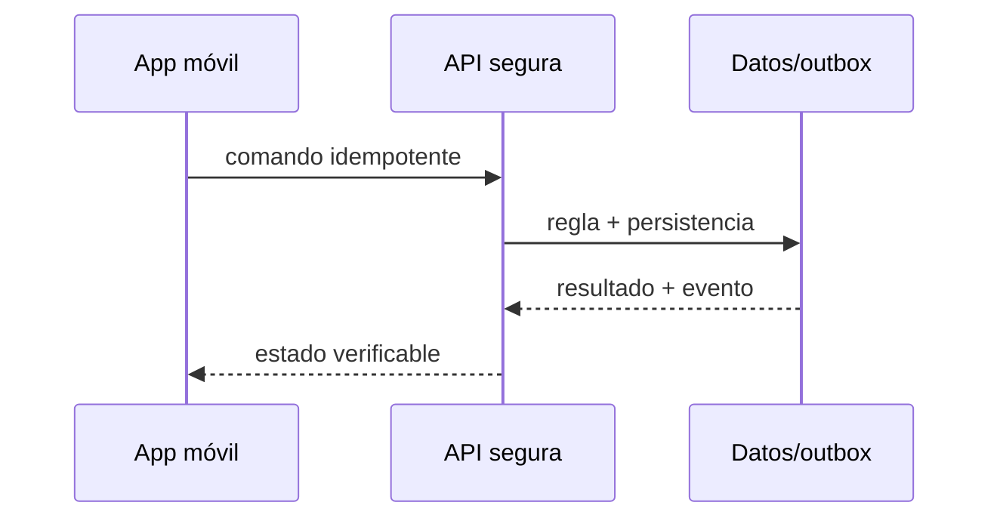

# Módulo 14: Backend de entregas: MySQL espacial, archivos y tiempo real

## Sílabo

**Objetivo general:** construir una vertical de seguimiento de entregas que conecte interfaz, ubicación, tiempo real, persistencia, seguridad, evidencia y notificaciones sin esconder los fallos normales de una aplicación móvil.

**Evaluación:** 40 % implementación, 25 % pruebas, 20 % explicación y decisiones, 15 % seguridad y operación.

## Contenido teórico

### Tema 1: CRUD API y contratos

**Conceptos clave:** contratos, estados explícitos, fallos, seguridad y verificación.

Crear, consultar, asignar, actualizar y cancelar envíos son casos de uso diferentes, no un controlador genérico que expone entidades. DTO, Bean Validation, Problem Details y OpenAPI definen el contrato. DELETE puede significar cancelación de negocio y no eliminación física. Idempotency-Key protege creación y confirmación ante reintentos. La implementación se conecta a RutaFlow y se prueba con camino feliz, entrada inválida, repetición y dependencia no disponible.

**Analogía:** Es como una central de despacho: cada mensaje necesita identidad, hora, destino y confirmación; ver un vehículo en pantalla no demuestra que el paquete fue entregado.

**¿Por qué es importante?** Porque una aplicación logística funciona en movimiento, con mala red, concurrencia y datos sensibles. La corrección debe sobrevivir fuera de una demostración local.

**Casos de uso reales:** posición tardía, token vencido, fotografía pesada, comando repetido y usuario intentando acceder a una entrega ajena.

**Diagrama:**

### Tema 2: MySQL y datos espaciales

**Conceptos clave:** contratos, estados explícitos, fallos, seguridad y verificación.

MySQL 8 almacena POINT con SRID 4326 e índices SPATIAL. ST_Distance_Sphere permite filtros iniciales de cercanía, mientras rutas reales requieren un motor vial. Longitud va antes que latitud en WKT. EXPLAIN demuestra uso del índice; precisión, timestamp y procedencia acompañan cada coordenada. La implementación se conecta a RutaFlow y se prueba con camino feliz, entrada inválida, repetición y dependencia no disponible.

**Analogía:** Es como una central de despacho: cada mensaje necesita identidad, hora, destino y confirmación; ver un vehículo en pantalla no demuestra que el paquete fue entregado.

**¿Por qué es importante?** Porque una aplicación logística funciona en movimiento, con mala red, concurrencia y datos sensibles. La corrección debe sobrevivir fuera de una demostración local.

**Casos de uso reales:** posición tardía, token vencido, fotografía pesada, comando repetido y usuario intentando acceder a una entrega ajena.

**Diagrama:**

### Tema 3: JPA e Hibernate Spatial

**Conceptos clave:** contratos, estados explícitos, fallos, seguridad y verificación.

JPA modela agregados y Hibernate traduce persistencia, pero no reemplaza entender SQL. Hibernate Spatial integra Geometry/Point; migraciones Flyway crean SRID, constraints e índices. Se evitan N+1 mediante proyecciones o fetch explícito. Una transacción valida versión optimista, guarda posición y produce outbox. La implementación se conecta a RutaFlow y se prueba con camino feliz, entrada inválida, repetición y dependencia no disponible.

**Analogía:** Es como una central de despacho: cada mensaje necesita identidad, hora, destino y confirmación; ver un vehículo en pantalla no demuestra que el paquete fue entregado.

**¿Por qué es importante?** Porque una aplicación logística funciona en movimiento, con mala red, concurrencia y datos sensibles. La corrección debe sobrevivir fuera de una demostración local.

**Casos de uso reales:** posición tardía, token vencido, fotografía pesada, comando repetido y usuario intentando acceder a una entrega ajena.

**Diagrama:**

### Tema 4: JWT Bearer y autorización por roles

**Conceptos clave:** contratos, estados explícitos, fallos, seguridad y verificación.

Spring Security valida Authorization: Bearer mediante resource server y firma asimétrica; no se escribe criptografía casera. ROLE_DRIVER permite acciones de conductor, pero también se verifica que la jornada esté asignada a esa identidad. Expiración corta, scopes, rotación y revocación limitan daño. Logs nunca imprimen tokens. La implementación se conecta a RutaFlow y se prueba con camino feliz, entrada inválida, repetición y dependencia no disponible.

**Analogía:** Es como una central de despacho: cada mensaje necesita identidad, hora, destino y confirmación; ver un vehículo en pantalla no demuestra que el paquete fue entregado.

**¿Por qué es importante?** Porque una aplicación logística funciona en movimiento, con mala red, concurrencia y datos sensibles. La corrección debe sobrevivir fuera de una demostración local.

**Casos de uso reales:** posición tardía, token vencido, fotografía pesada, comando repetido y usuario intentando acceder a una entrega ajena.

**Diagrama:**

### Tema 5: Socket.IO y tiempo real

**Conceptos clave:** contratos, estados explícitos, fallos, seguridad y verificación.

Spring soporta WebSocket/STOMP de forma natural; Socket.IO es otro protocolo y requiere un servidor compatible o gateway. El curso implementa y compara ambos para decidir por interoperabilidad, rooms, acknowledgements y operación. Eventos contienen shipmentId, sequence, occurredAt y schemaVersion; consumidores deduplican. La implementación se conecta a RutaFlow y se prueba con camino feliz, entrada inválida, repetición y dependencia no disponible.

**Analogía:** Es como una central de despacho: cada mensaje necesita identidad, hora, destino y confirmación; ver un vehículo en pantalla no demuestra que el paquete fue entregado.

**¿Por qué es importante?** Porque una aplicación logística funciona en movimiento, con mala red, concurrencia y datos sensibles. La corrección debe sobrevivir fuera de una demostración local.

**Casos de uso reales:** posición tardía, token vencido, fotografía pesada, comando repetido y usuario intentando acceder a una entrega ajena.

**Diagrama:**

### Tema 6: Archivos y notificaciones push

**Conceptos clave:** contratos, estados explícitos, fallos, seguridad y verificación.

La base almacena metadatos y hash; fotografías viven en object storage con claves no predecibles, URLs firmadas y retención. Se valida MIME real, tamaño y malware. Un outbox dispara Firebase Admin/APNs después del commit. Push es entrega al menos una vez: payload mínimo, deduplicación y consulta posterior al API. La implementación se conecta a RutaFlow y se prueba con camino feliz, entrada inválida, repetición y dependencia no disponible.

**Analogía:** Es como una central de despacho: cada mensaje necesita identidad, hora, destino y confirmación; ver un vehículo en pantalla no demuestra que el paquete fue entregado.

**¿Por qué es importante?** Porque una aplicación logística funciona en movimiento, con mala red, concurrencia y datos sensibles. La corrección debe sobrevivir fuera de una demostración local.

**Casos de uso reales:** posición tardía, token vencido, fotografía pesada, comando repetido y usuario intentando acceder a una entrega ajena.

**Diagrama:**

## Criterio transversal de calidad del código

Usa nombres del dominio, dependencias dirigidas hacia políticas estables y errores tipados. Escribe una prueba antes de corregir cada fallo. SOLID se aplica para separar mapas, transporte, persistencia y notificaciones, no para crear capas vacías. No abstraer hasta encontrar repetición con el mismo significado. Revisa nombres, errores, prueba, privacidad, permisos y operación.

## Laboratorio práctico

Parte de una carpeta vacía de feature dentro de RutaFlow. Define primero el contrato `DeliveryUpdate` con identificador, secuencia, instante y precisión. Implementa una pantalla de jornada, un endpoint protegido y persistencia durable. Luego conecta mapa y canal en tiempo real. Finalmente captura evidencia, trabaja sin red y sincroniza.

1. Dibuja pantalla, estados y amenazas antes de instalar paquetes.
2. Implementa el camino feliz con datos simulados y una prueba automatizada.
3. Sustituye un adaptador a la vez: mapa, GPS, socket, datos, archivos y push.
4. Desconecta la red, repite el comando, vence el token y envía eventos fuera de orden.
5. Mide batería o consulta, latencia, frames y backlog; registra resultados en README.

La definición de terminado exige comandos reproducibles, datos ficticios, secretos fuera del repositorio y una demostración en dispositivo o entorno de integración. No basta con que el marcador se mueva.

## Rúbrica del proyecto

| Criterio | Inicial | Competente | Profesional |
|---|---|---|---|
| Funcionalidad | Demo aislada | Flujo integrado | Offline, reintentos y recuperación |
| Geografía | Dibuja puntos | Valida precisión/tiempo | Índices, secuencia y medición |
| Seguridad | Solo login | Bearer y roles | Propiedad, amenazas y mínimo dato |
| Código | Plugins acoplados | Límites probados | Adaptadores sustituibles con criterio |
| Operación | Logs manuales | Métricas básicas | Correlación, runbook y prueba de fallo |

## Bibliografía y fundamento académico

- Documentación oficial de Flutter, Riverpod, Google Maps Platform, Dio, Firebase y Socket.IO para el cliente.
- Spring Boot Reference, Spring Security Reference, MySQL 8 Spatial Reference, Hibernate Spatial y Firebase Admin para el servidor.
- RFC 6750 para Bearer Tokens, RFC 7946 para GeoJSON y especificación WebSocket RFC 6455.
- OWASP MASVS/ASVS para permisos, almacenamiento, autenticación, archivos y APIs.
- Martin Kleppmann, *Designing Data-Intensive Applications*, para orden, duplicación y fallos parciales.

Verifica versión, licencia y política de precios antes de elegir proveedor de mapas o mensajería. Socket.IO no es WebSocket puro y JWT no significa automáticamente autorización correcta.

## Resumen del módulo

Los temas de la lista ahora forman una capacidad visible y evaluable. La persona diseña pantallas, gestiona estado, dibuja y actualiza rutas, recibe posiciones, conserva trabajo offline, procesa imágenes, consume HTTP, protege recursos y envía notificaciones. El aprendizaje termina cuando puede explicar y demostrar qué ocurre ante mala red, duplicados, datos geográficos imperfectos y accesos indebidos.
