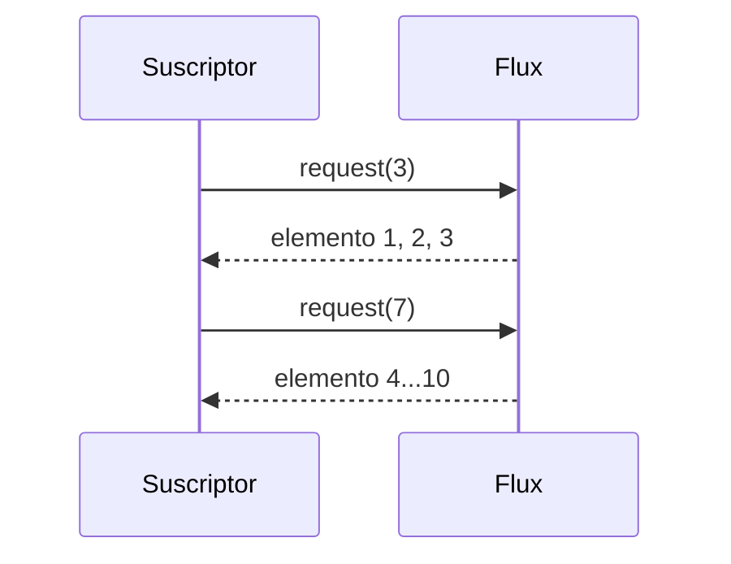
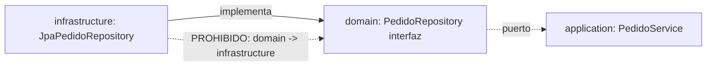
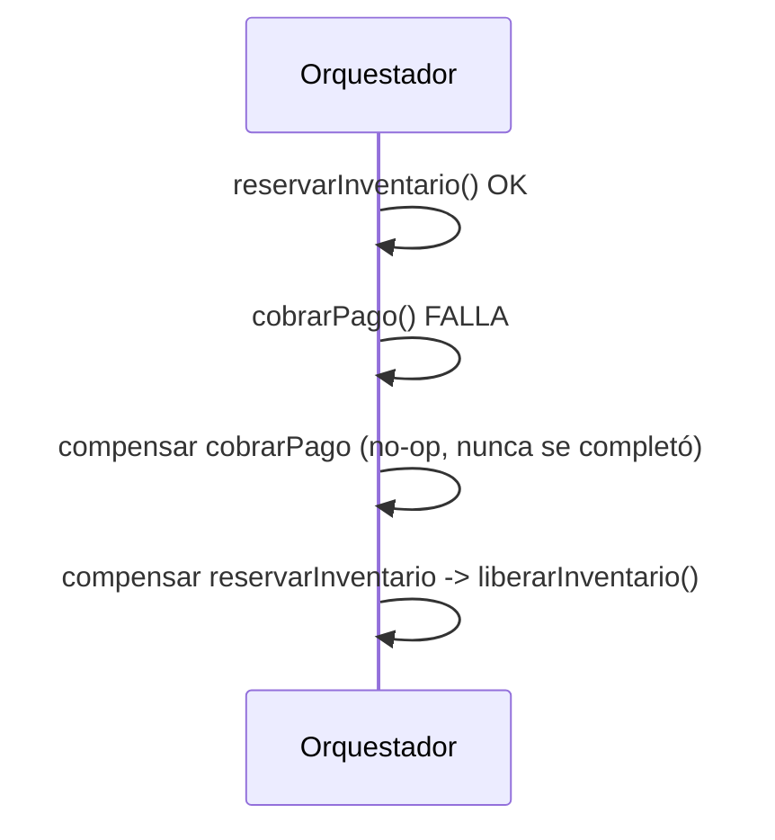
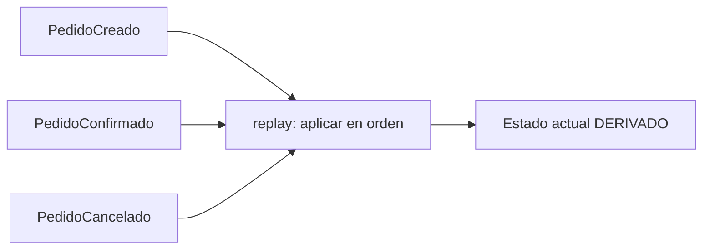

# Módulo 15: Spring Master: hexagonal, reactivo y microservicios


## Aprende construyendo

Este módulo cierra el nivel "master" del track con seis técnicas avanzadas, cada una verificada con una herramienta real y oficial del ecosistema, sin sustituir infraestructura por descripción: `reactor-test` para backpressure real, el patrón oficial de Testcontainers para contenedores reutilizados, ArchUnit para congelar reglas arquitectónicas, Resilience4j Bulkhead/RateLimiter, un orquestador de saga con compensación real, y un event store con replay real.

### Tema 1: Backpressure real en WebFlux con reactor-test

#### Paso 1 · Objetivo y preparación

Al finalizar podrás demostrar, con `StepVerifier` y una demanda inicial controlada, que un `Flux` respeta el backpressure real de Reactive Streams: solo emite exactamente lo que el suscriptor solicitó, ni un elemento más.

**Conocimiento previo:** Módulo 9 de este track (Mono, Flux, StepVerifier).

#### Paso 2 · Contexto y caso real

**¿Por qué es importante?** Netty (el servidor sobre el que corre WebFlux) usa un pequeño número de threads de event loop; sin backpressure real, un productor rápido podría saturar la memoria de un consumidor lento acumulando elementos sin control. Reactive Streams resuelve esto con demanda explícita: el consumidor pide cuántos elementos quiere, no al revés.

#### Paso 3 · Teoría con analogía

**Conceptos clave:** demanda explícita (`request(n)`), `doOnRequest`, demanda ilimitada por defecto.

Un `Subscriber` de Reactive Streams debe llamar `request(n)` para indicar cuántos elementos está dispuesto a recibir; sin esa llamada explícita, no fluye ningún dato. La mayoría de consumidores (incluyendo el `subscribe()` simple) solicitan demanda ilimitada (`Long.MAX_VALUE`) por defecto, lo cual anula el propósito del backpressure si el consumidor real no puede procesar a esa velocidad.

**Analogía:** backpressure es un trabajador de línea de ensamblaje que solo pide "dame 3 piezas más" cuando termina de procesar las anteriores, en vez de que la línea le arroje piezas sin parar independientemente de su capacidad de procesarlas.

**Diagrama:**



#### Paso 4 · Demostración guiada desde cero

Parte de una carpeta vacía y crea `src/test/java/io/academia/rutaflow/master/backpressure/BackpressureRealTest.java`:

```bash
mkdir rutaflow-backpressure
cd rutaflow-backpressure
curl -fsSL https://start.spring.io/starter.zip -d dependencies=webflux -d javaVersion=21 -o app.zip
unzip app.zip
mkdir -p src/test/java/io/academia/rutaflow/master/backpressure
```

```java
// src/test/java/io/academia/rutaflow/master/backpressure/BackpressureRealTest.java
package io.academia.rutaflow.master.backpressure;

import org.junit.jupiter.api.Test;
import reactor.core.publisher.Flux;
import reactor.test.StepVerifier;

import java.util.concurrent.CopyOnWriteArrayList;

import static org.assertj.core.api.Assertions.assertThat;

class BackpressureRealTest {

    @Test
    void elFluxSoloEmiteExactamenteLoQueElSuscriptorSolicito() {
        CopyOnWriteArrayList<Long> demandasSolicitadas = new CopyOnWriteArrayList<>();

        Flux<Integer> flux = Flux.range(1, 10)
            .doOnRequest(demandasSolicitadas::add); // registra CADA solicitud real de demanda

        StepVerifier.create(flux, 0) // arranca con demanda 0: nada fluye hasta pedirlo explícitamente
            .thenRequest(3)
            .expectNext(1, 2, 3)
            .thenRequest(7)
            .expectNext(4, 5, 6, 7, 8, 9, 10)
            .verifyComplete();

        assertThat(demandasSolicitadas).containsExactly(3L, 7L); // exactamente dos solicitudes reales: 3 y luego 7
    }
}
```

```bash
./mvnw test -Dtest=BackpressureRealTest
```

**Resultado esperado:** `BUILD SUCCESS` con el test en verde: `doOnRequest` registra REALMENTE las dos solicitudes de demanda (`3` y `7`, no una lista simulada), y `StepVerifier` con demanda inicial `0` confirma que ningún elemento fluye hasta que se solicita explícitamente — el backpressure real de Reactive Streams, no una descripción teórica.

**Fallo deliberado:** cambia `StepVerifier.create(flux, 0)` por `StepVerifier.create(flux)` (sin demanda inicial explícita, el valor por defecto) y ejecuta de nuevo. La aserción `containsExactly(3L, 7L)` FALLA, porque ahora `demandasSolicitadas` contiene una única entrada `Long.MAX_VALUE` — diagnostica confirmando que el `StepVerifier` por defecto (como la mayoría de consumidores reales) solicita demanda ilimitada de inmediato, anulando cualquier control de backpressure. Restaura la demanda inicial `0` antes de continuar.

#### Paso 5 · Práctica guiada — repetición progresiva

1. Cambia la demanda inicial a `1` y solicita de a un elemento por vez (`thenRequest(1)` repetido 10 veces), confirmando que `demandasSolicitadas` contiene diez entradas de `1L`.
2. Agrega un `.limitRate(4)` al Flux y documenta, con un test, cómo cambia el patrón de solicitudes de demanda registradas por `doOnRequest`.
3. Simula un consumidor lento con `.delayElements(Duration.ofMillis(50))` y confirma con `StepVerifier` (usando su reloj virtual) que el tiempo total respeta ese retraso por elemento.
4. Escribe de memoria (sin mirar) un `Flux` con `doOnRequest`, y un `StepVerifier` con demanda inicial `0` que confirme el backpressure real. Compara después contra el patrón del Paso 4.

**Pista:** `StepVerifier.create(publisher, initialRequest)` es la sobrecarga oficial de `reactor-test` que permite arrancar con una demanda inicial distinta de la ilimitada por defecto — imprescindible para probar backpressure real en vez de el camino feliz sin restricciones.

#### Paso 6 · Práctica independiente

**Completa el código:** rellena el espacio con el método de `StepVerifier` que solicita una cantidad específica de elementos:

```java
StepVerifier.create(flux, 0)
    .____(3)
    .expectNext(1, 2, 3)
```

**Reto de memoria sin mirar:** cierra este documento y escribe, solo de memoria, un `Flux` con `doOnRequest` y un test que confirme, con demanda inicial `0`, que el backpressure real limita lo emitido. Compara después contra el patrón del Paso 4.

#### Paso 7 · Cierre y evidencia

Ya demuestras con `reactor-test` que el backpressure de Reactive Streams es un mecanismo real de demanda explícita, no una descripción abstracta. El siguiente tema acelera la suite de tests reutilizando contenedores de Testcontainers entre clases. **Evidencia:** entrega el resultado de `BackpressureRealTest` en verde, y la demanda ilimitada real que produce el fallo deliberado sin `StepVerifier.create(flux, 0)`. Fuentes oficiales: [Project Reactor — Testing](https://projectreactor.io/docs/core/release/reference/testing.html).

**Errores comunes:** asumir que backpressure "simplemente funciona" sin verificar la demanda real solicitada; dejar que un consumidor por defecto solicite demanda ilimitada cuando el caso de uso requiere control explícito.

**Cuándo no usarlo:** para streams pequeños y acotados donde la memoria del consumidor nunca es un riesgo real, controlar la demanda explícitamente agrega complejidad sin ningún beneficio medible.

### Tema 2: Contenedores Testcontainers reutilizados entre clases

#### Paso 1 · Objetivo y preparación

Al finalizar podrás aplicar el patrón oficial de "singleton container" de Testcontainers para que dos clases de test distintas reutilicen el MISMO contenedor real, confirmado comparando el `containerId` real entre ambas.

**Conocimiento previo:** Módulo 6 de este track (Testcontainers básico).

#### Paso 2 · Contexto y caso real

**¿Por qué es importante?** Sin reutilización, cada clase de test con `@Testcontainers` arranca y detiene su propio contenedor, y una suite con decenas de clases puede pasar minutos solo levantando y bajando bases de datos idénticas repetidamente, ralentizando el ciclo de feedback de CI.

#### Paso 3 · Teoría con analogía

**Conceptos clave:** singleton container, `getContainerId()`, contenedor compartido entre clases.

El patrón oficial de "singleton container" de Testcontainers arranca un único contenedor estático (sin `@Container`/`@Testcontainers` gestionándolo automáticamente por clase) y lo comparte entre todas las clases de test que lo necesiten dentro de la misma ejecución de la suite, en vez de un contenedor nuevo por clase.

**Analogía:** es como compartir una sala de reuniones ya preparada entre varias reuniones consecutivas del mismo día, en vez de montar y desmontar la sala completa para cada reunión individual.

**Diagrama:**

```
┌── Sin reutilización ─────────────┐  N clases = N contenedores arrancados
└──────────────────────────┘
┌── Con singleton container ───────┐  N clases = 1 contenedor compartido
└──────────────────────────┘
```

#### Paso 4 · Demostración guiada desde cero

Parte de una carpeta vacía y crea `src/test/java/io/academia/rutaflow/master/singleton/ContenedorCompartido.java`:

```bash
mkdir rutaflow-testcontainers-singleton
cd rutaflow-testcontainers-singleton
curl -fsSL https://start.spring.io/starter.zip -d dependencies=data-jpa -d javaVersion=21 -o app.zip
unzip app.zip
mkdir -p src/test/java/io/academia/rutaflow/master/singleton
```

```java
// src/test/java/io/academia/rutaflow/master/singleton/ContenedorCompartido.java
package io.academia.rutaflow.master.singleton;

import org.testcontainers.containers.PostgreSQLContainer;

public abstract class ContenedorCompartido {
    // sin @Container: arranca UNA sola vez, compartido por TODAS las subclases del proceso de test
    static final PostgreSQLContainer<?> POSTGRES = new PostgreSQLContainer<>("postgres:16-alpine");

    static {
        POSTGRES.start(); // arranque explícito único; Testcontainers reutiliza esta instancia hasta que la JVM termine
    }
}
```

```java
// src/test/java/io/academia/rutaflow/master/singleton/PrimeraClaseTest.java
package io.academia.rutaflow.master.singleton;

import org.junit.jupiter.api.Test;

public class PrimeraClaseTest extends ContenedorCompartido {
    static String containerIdVistoAqui;

    @Test
    void registraElContainerIdRealVistoDesdeEstaClase() {
        containerIdVistoAqui = POSTGRES.getContainerId();
    }
}
```

```java
// src/test/java/io/academia/rutaflow/master/singleton/SegundaClaseTest.java
package io.academia.rutaflow.master.singleton;

import org.junit.jupiter.api.Test;

import static org.assertj.core.api.Assertions.assertThat;

public class SegundaClaseTest extends ContenedorCompartido {

    @Test
    void elContainerIdEsElMismoQueElDeLaPrimeraClase() {
        String idAqui = POSTGRES.getContainerId();
        assertThat(idAqui).isEqualTo(PrimeraClaseTest.containerIdVistoAqui); // MISMO contenedor real, no uno nuevo
    }
}
```

```bash
./mvnw test -Dtest=PrimeraClaseTest,SegundaClaseTest
```

**Resultado esperado:** `BUILD SUCCESS` con ambos tests en verde, ejecutados en el orden correcto: `SegundaClaseTest` confirma que `POSTGRES.getContainerId()` devuelve el MISMO ID de contenedor Docker real que `PrimeraClaseTest` observó — evidencia concreta (un ID de contenedor real, no una suposición) de que ambas clases comparten la misma instancia en ejecución, en vez de arrancar contenedores separados.

**Fallo deliberado:** quita el bloque `static { POSTGRES.start(); }` (dejando que cada clase dependa de un arranque implícito que no ocurre de forma compartida) y ejecuta de nuevo. Los tests fallan con errores de conexión reales (el contenedor nunca arrancó) — diagnostica confirmando que el patrón singleton container depende explícitamente de un arranque estático único y deliberado, no de la gestión automática por clase que `@Testcontainers`/`@Container` normalmente proveen. Restaura el bloque `static` antes de continuar.

#### Paso 5 · Práctica guiada — repetición progresiva

1. Agrega una tercera clase de test que extienda `ContenedorCompartido` y confirma que también comparte el mismo `containerId`.
2. Documenta, en un comentario, por qué este patrón requiere que las clases NO usen `@Testcontainers`/`@Container` (que gestionarían el ciclo de vida automáticamente por clase, entrando en conflicto con el arranque manual compartido).
3. Mide con `System.currentTimeMillis()` el tiempo total de ejecutar las dos clases con el contenedor compartido, comparado con una versión donde cada clase usa su propio `@Container` independiente, y documenta la diferencia real observada.
4. Escribe de memoria (sin mirar) una clase base `ContenedorCompartido` con arranque estático único, y dos clases de test que confirmen el mismo `containerId`. Compara después contra el patrón del Paso 4.

**Pista:** `getContainerId()` devuelve el ID real y único que Docker asignó al contenedor en ejecución — es la forma más directa de confirmar con evidencia, no solo con inferencia por velocidad, si dos referencias apuntan al mismo contenedor físico o a instancias distintas.

#### Paso 6 · Práctica independiente

**Completa el código:** rellena el espacio con el método real de Testcontainers que devuelve el identificador único del contenedor en ejecución:

```java
String id = POSTGRES.____();
```

**Reto de memoria sin mirar:** cierra este documento y escribe, solo de memoria, una clase base con un contenedor compartido arrancado estáticamente, y dos clases de test que confirmen el mismo `containerId`. Compara después contra el patrón del Paso 4.

#### Paso 7 · Cierre y evidencia

Ya aplicas el patrón oficial de contenedor compartido de Testcontainers, confirmado con evidencia real del `containerId`, para acelerar una suite de tests con múltiples clases. El siguiente tema congela reglas arquitectónicas de un diseño hexagonal con una herramienta que las verifica automáticamente. **Evidencia:** entrega el resultado de ambos tests en verde, y el error de conexión real que produce el fallo deliberado sin el arranque estático. Fuentes oficiales: [Testcontainers — Manual Container Lifecycle Control](https://java.testcontainers.org/test_framework_integration/manual_lifecycle_control/).

**Errores comunes:** combinar el patrón singleton container con `@Testcontainers`/`@Container` en la misma clase, causando conflictos de ciclo de vida; olvidar el arranque estático explícito, dejando el contenedor sin iniciar.

**Cuándo no usarlo:** para una suite pequeña de una o dos clases de test, la complejidad adicional de gestionar el ciclo de vida manualmente no compensa el ahorro de tiempo, que sería mínimo.

### Tema 3: Arquitectura hexagonal verificada con ArchUnit

#### Paso 1 · Objetivo y preparación

Al finalizar podrás escribir una regla de ArchUnit (la librería oficial de test de arquitectura para Java) que falla automáticamente si el paquete de dominio depende de infraestructura, congelando la regla hexagonal como código verificable, no como una convención de equipo no forzada.

**Conocimiento previo:** Módulo 10 Tema 6 de este track (DDD y contextos delimitados).

#### Paso 2 · Contexto y caso real

**¿Por qué es importante?** Una arquitectura hexagonal (puertos y adaptadores) mantiene el dominio independiente de detalles de infraestructura (framework, base de datos concreta) SOLO si esa regla se respeta consistentemente; sin verificación automatizada, un import accidental de una clase JPA dentro del paquete de dominio pasa desapercibido en una revisión de código apurada.

#### Paso 3 · Teoría con analogía

**Conceptos clave:** puerto (interfaz), adaptador (implementación), regla arquitectónica como test.

El dominio define un **puerto** (`PedidoRepository`, una interfaz) sin saber cómo se implementa; un **adaptador** en el paquete de infraestructura (`JpaPedidoRepository`) implementa ese puerto usando Spring Data JPA. ArchUnit permite expresar la regla "el dominio nunca depende de la infraestructura" como código Java ejecutable en cada build, en vez de una regla solo documentada que nadie verifica automáticamente.

**Analogía:** ArchUnit es un inspector de aduanas automatizado que revisa cada commit para confirmar que ningún paquete cruzó una frontera arquitectónica prohibida, en vez de confiar en que cada desarrollador recuerde la regla por su cuenta.

**Diagrama:**



#### Paso 4 · Demostración guiada desde cero

Parte de una carpeta vacía, agrega `com.tngtech.archunit:archunit-junit5` al `pom.xml` (la librería oficial de ArchUnit), y crea `src/main/java/io/academia/rutaflow/master/hexagonal/domain/Pedido.java`:

```bash
mkdir rutaflow-hexagonal
cd rutaflow-hexagonal
curl -fsSL https://start.spring.io/starter.zip -d dependencies=data-jpa,h2 -d javaVersion=21 -o app.zip
unzip app.zip
mkdir -p src/main/java/io/academia/rutaflow/master/hexagonal/{domain,infrastructure}
mkdir -p src/test/java/io/academia/rutaflow/master/hexagonal
```

```java
// src/main/java/io/academia/rutaflow/master/hexagonal/domain/Pedido.java
package io.academia.rutaflow.master.hexagonal.domain;

public class Pedido {
    private final String id;
    public Pedido(String id) { this.id = id; }
    public String getId() { return id; }
}
```

```java
// src/main/java/io/academia/rutaflow/master/hexagonal/domain/PedidoRepository.java
package io.academia.rutaflow.master.hexagonal.domain;

// PUERTO: el dominio define el contrato, sin saber cómo se implementa
public interface PedidoRepository {
    Pedido buscar(String id);
}
```

```java
// src/main/java/io/academia/rutaflow/master/hexagonal/infrastructure/JpaPedidoRepository.java
package io.academia.rutaflow.master.hexagonal.infrastructure;

import io.academia.rutaflow.master.hexagonal.domain.Pedido;
import io.academia.rutaflow.master.hexagonal.domain.PedidoRepository;
import org.springframework.stereotype.Repository;

// ADAPTADOR: implementa el puerto usando un detalle de infraestructura concreto
@Repository
public class JpaPedidoRepository implements PedidoRepository {
    @Override
    public Pedido buscar(String id) { return new Pedido(id); }
}
```

Congela la regla hexagonal con ArchUnit:

```java
// src/test/java/io/academia/rutaflow/master/hexagonal/ReglaHexagonalTest.java
package io.academia.rutaflow.master.hexagonal;

import com.tngtech.archunit.core.importer.ClassFileImporter;
import com.tngtech.archunit.lang.ArchRule;
import org.junit.jupiter.api.Test;

import static com.tngtech.archunit.lang.syntax.ArchRuleDefinition.noClasses;

class ReglaHexagonalTest {

    @Test
    void elDominioNuncaDependeDeLaInfraestructura() {
        var clases = new ClassFileImporter().importPackages("io.academia.rutaflow.master.hexagonal");

        ArchRule regla = noClasses().that().resideInAPackage("..domain..")
            .should().dependOnClassesThat().resideInAPackage("..infrastructure..");

        regla.check(clases); // lanza AssertionError real si la regla se viola
    }
}
```

```bash
./mvnw test -Dtest=ReglaHexagonalTest
```

**Resultado esperado:** `BUILD SUCCESS` con el test en verde: ArchUnit analiza el bytecode REAL compilado (no el código fuente textualmente) y confirma que ninguna clase de `domain` importa o depende de ninguna clase de `infrastructure` — la regla hexagonal congelada como verificación automática, no como una promesa de estilo.

**Fallo deliberado:** modifica `Pedido.java` (en `domain`) para que importe y use `JpaPedidoRepository` directamente (por ejemplo, agregando un campo `private JpaPedidoRepository repo;`) y ejecuta de nuevo el test. FALLA con un mensaje real y específico de ArchUnit: `Architecture Violation ... Pedido does not satisfy: ... because Pedido.class depends on JpaPedidoRepository` — diagnostica confirmando que ArchUnit atrapa la violación en el momento exacto en que ocurre, en el build, en vez de descubrirse meses después en una revisión de código o, peor, nunca. Revierte el cambio antes de continuar.

#### Paso 5 · Práctica guiada — repetición progresiva

1. Agrega una segunda regla que confirme que las clases en `infrastructure` SÍ pueden depender de `domain` (la dirección permitida), usando `classes().that().resideInAPackage("..infrastructure..").should().dependOnClassesThat().resideInAPackage("..domain..").orShould()...` según corresponda.
2. Agrega una regla de nomenclatura (`classes().that().resideInAPackage("..infrastructure..").should().haveSimpleNameEndingWith("Repository").orShould()...`) y confirma que se cumple sobre el código existente.
3. Documenta, en un comentario, la diferencia entre una violación arquitectónica detectada por ArchUnit (en el build) y la misma violación detectada solo en una revisión de código manual (mucho más tarde, si es que se detecta).
4. Escribe de memoria (sin mirar) una regla ArchUnit que prohíba una dependencia entre dos paquetes, y confirma con un test que se cumple sobre tu propio código. Compara después contra el patrón del Paso 4.

**Pista:** `new ClassFileImporter().importPackages(...)` analiza el BYTECODE COMPILADO, no el texto fuente — esto significa que ArchUnit detecta dependencias reales incluso a través de generación de código o reflexión indirecta que un simple `grep` sobre el código fuente podría pasar por alto.

#### Paso 6 · Práctica independiente

**Completa el código:** rellena el espacio con el método de ArchUnit que expresa "ninguna clase debería depender de":

```java
ArchRule regla = noClasses().that().resideInAPackage("..domain..")
    .should().____().resideInAPackage("..infrastructure..");
```

**Reto de memoria sin mirar:** cierra este documento y escribe, solo de memoria, una regla ArchUnit que prohíba que el dominio dependa de la infraestructura, y un test que la ejecute. Compara después contra el patrón del Paso 4.

#### Paso 7 · Cierre y evidencia

Ya congelas una regla arquitectónica hexagonal como un test ejecutable con ArchUnit, atrapando violaciones en el build en vez de en una revisión manual. El siguiente tema protege llamadas entre servicios con Bulkhead y RateLimiter de Resilience4j, complementando el CircuitBreaker ya visto. **Evidencia:** entrega el resultado de `ReglaHexagonalTest` en verde, y el mensaje de violación real de ArchUnit que produce el fallo deliberado. Fuentes oficiales: [ArchUnit User Guide](https://www.archunit.org/userguide/html/000_Index.html).

**Errores comunes:** documentar una regla arquitectónica solo en un README sin verificación automatizada; definir reglas demasiado laxas que no detectan violaciones reales.

**Cuándo no usarlo:** para un prototipo pequeño de corta vida sin intención de mantenimiento a largo plazo, invertir en reglas ArchUnit puede ser una formalidad desproporcionada frente al beneficio.

### Tema 4: Bulkhead y RateLimiter de Resilience4j

#### Paso 1 · Objetivo y preparación

Al finalizar podrás confirmar, con llamadas concurrentes reales, que un `Bulkhead` limita el número de llamadas simultáneas hacia una dependencia, y que un `RateLimiter` limita la tasa de llamadas por período de tiempo, complementando el `CircuitBreaker` ya visto en el Módulo 10.

**Conocimiento previo:** Módulo 10 Tema 3 de este track (CircuitBreaker de Resilience4j).

#### Paso 2 · Contexto y caso real

**¿Por qué es importante?** Un `CircuitBreaker` reacciona a fallos ya ocurridos; un `Bulkhead` PREVIENE que una única dependencia lenta consuma todos los threads/recursos disponibles, aislando su impacto; un `RateLimiter` protege a la dependencia misma de recibir más tráfico del que puede soportar, independientemente de si está fallando o no.

#### Paso 3 · Teoría con analogía

**Conceptos clave:** Bulkhead (aislamiento de recursos), RateLimiter (límite de tasa).

Un `Bulkhead` limita cuántas llamadas concurrentes pueden ejecutarse simultáneamente hacia una dependencia específica; al superar ese límite, las llamadas adicionales fallan inmediatamente con `BulkheadFullException` en vez de encolarse indefinidamente. Un `RateLimiter` limita cuántas llamadas pueden ejecutarse dentro de una ventana de tiempo, independientemente de la concurrencia.

**Analogía:** un Bulkhead es un compartimento estanco de un barco: si un compartimento se inunda, los demás permanecen aislados y el barco no se hunde completo; un RateLimiter es un peaje que solo permite pasar un número fijo de vehículos por minuto, sin importar cuántos lleguen a la vez.

**Diagrama:**

```
┌── Bulkhead ──────────────────────┐  máx N llamadas CONCURRENTES
└──────────────────────────┘
┌── RateLimiter ───────────────────┐  máx N llamadas por VENTANA DE TIEMPO
└──────────────────────────┘
```

#### Paso 4 · Demostración guiada desde cero

Parte de una carpeta vacía, agrega `io.github.resilience4j:resilience4j-bulkhead` y `io.github.resilience4j:resilience4j-ratelimiter` al `pom.xml`, y crea `src/test/java/io/academia/rutaflow/master/resilience/BulkheadRateLimiterTest.java`:

```bash
mkdir rutaflow-resilience-avanzado
cd rutaflow-resilience-avanzado
curl -fsSL https://start.spring.io/starter.zip -d dependencies=web -d javaVersion=21 -o app.zip
unzip app.zip
mkdir -p src/test/java/io/academia/rutaflow/master/resilience
```

```java
// src/test/java/io/academia/rutaflow/master/resilience/BulkheadRateLimiterTest.java
package io.academia.rutaflow.master.resilience;

import io.github.resilience4j.bulkhead.Bulkhead;
import io.github.resilience4j.bulkhead.BulkheadConfig;
import io.github.resilience4j.bulkhead.BulkheadFullException;
import io.github.resilience4j.ratelimiter.RateLimiter;
import io.github.resilience4j.ratelimiter.RateLimiterConfig;
import org.junit.jupiter.api.Test;

import java.time.Duration;
import java.util.concurrent.CountDownLatch;
import java.util.concurrent.ExecutorService;
import java.util.concurrent.Executors;
import java.util.concurrent.atomic.AtomicInteger;

import static org.assertj.core.api.Assertions.assertThat;

class BulkheadRateLimiterTest {

    @Test
    void elBulkheadRechazaLlamadasQueSuperanElMaximoConcurrenteReal() throws Exception {
        BulkheadConfig config = BulkheadConfig.custom().maxConcurrentCalls(2).build();
        Bulkhead bulkhead = Bulkhead.of("servicioTarifas", config);

        CountDownLatch enCurso = new CountDownLatch(2);
        CountDownLatch liberar = new CountDownLatch(1);
        AtomicInteger rechazadas = new AtomicInteger(0);
        ExecutorService pool = Executors.newFixedThreadPool(3);

        Runnable llamadaLenta = () -> Bulkhead.decorateRunnable(bulkhead, () -> {
            enCurso.countDown();
            try { liberar.await(); } catch (InterruptedException ignored) {}
        }).run();

        pool.submit(llamadaLenta);
        pool.submit(llamadaLenta);
        enCurso.await(); // confirma que las DOS primeras ya están dentro del bulkhead, ocupando el máximo

        try {
            Bulkhead.decorateRunnable(bulkhead, () -> {}).run(); // la TERCERA debe rechazarse de inmediato
        } catch (BulkheadFullException e) {
            rechazadas.incrementAndGet();
        }

        assertThat(rechazadas.get()).isEqualTo(1);
        liberar.countDown();
        pool.shutdown();
    }

    @Test
    void elRateLimiterRechazaLlamadasQueSuperanElLimiteDeLaVentana() {
        RateLimiterConfig config = RateLimiterConfig.custom()
            .limitForPeriod(2)
            .limitRefreshPeriod(Duration.ofSeconds(10))
            .timeoutDuration(Duration.ZERO) // no espera: rechaza inmediatamente si no hay permiso
            .build();
        RateLimiter limiter = RateLimiter.of("servicioTarifas", config);

        boolean primera = limiter.acquirePermission();
        boolean segunda = limiter.acquirePermission();
        boolean tercera = limiter.acquirePermission(); // supera el límite de 2 por ventana

        assertThat(primera).isTrue();
        assertThat(segunda).isTrue();
        assertThat(tercera).isFalse(); // rechazada: ya se consumieron los 2 permisos de esta ventana
    }
}
```

```bash
./mvnw test -Dtest=BulkheadRateLimiterTest
```

**Resultado esperado:** `BUILD SUCCESS` con ambos tests en verde: el `Bulkhead` real, con dos threads reales ocupando su capacidad máxima (confirmado con `CountDownLatch`, no una suposición de timing), rechaza la tercera llamada concurrente con `BulkheadFullException` real; el `RateLimiter` real acepta exactamente 2 permisos dentro de la ventana configurada y rechaza el tercero.

**Fallo deliberado:** cambia `maxConcurrentCalls(2)` a `maxConcurrentCalls(10)` y ejecuta de nuevo `elBulkheadRechazaLlamadasQueSuperanElMaximoConcurrenteReal`. El test FALLA porque la tercera llamada ya NO se rechaza (`rechazadas.get()` queda en `0`) — diagnostica confirmando que el límite de concurrencia del Bulkhead es exactamente el parámetro configurado, y que dimensionarlo incorrectamente (demasiado alto) elimina la protección real que debía ofrecer. Restaura `maxConcurrentCalls(2)` antes de continuar.

#### Paso 5 · Práctica guiada — repetición progresiva

1. Reduce `limitForPeriod` a 1 y confirma con un test que solo la primera llamada de cada ventana de tiempo se acepta.
2. Configura un `timeoutDuration` distinto de cero en el `RateLimiter` y confirma con un test que una llamada esperando ese timeout SÍ puede obtener un permiso si se libera uno durante la espera.
3. Combina `Bulkhead.decorateSupplier` con `CircuitBreaker.decorateSupplier` (Módulo 10) en una única cadena de decoradores, y documenta el orden de aplicación recomendado.
4. Escribe de memoria (sin mirar) un `BulkheadConfig` con un límite de concurrencia, y un test con `CountDownLatch` que confirme el rechazo real de una llamada que excede ese límite. Compara después contra el patrón del Paso 4.

**Pista:** `CountDownLatch` es la herramienta correcta para coordinar temporalmente threads reales en un test de concurrencia — sin ella, un test de Bulkhead podría fallar intermitentemente por condiciones de carrera en el timing, en vez de confirmar de forma determinista que las llamadas concurrentes efectivamente ocupan el bulkhead antes de intentar la que debe rechazarse.

#### Paso 6 · Práctica independiente

**Completa el código:** rellena el espacio con la excepción real que Resilience4j lanza cuando un Bulkhead está lleno:

```java
try {
    Bulkhead.decorateRunnable(bulkhead, () -> {}).run();
} catch (____ e) {
    rechazadas.incrementAndGet();
}
```

**Reto de memoria sin mirar:** cierra este documento y escribe, solo de memoria, un `Bulkhead` con límite de concurrencia y un `RateLimiter` con límite por ventana, cada uno con un test que confirme el rechazo real. Compara después contra el patrón del Paso 4.

#### Paso 7 · Cierre y evidencia

Ya proteges llamadas concurrentes con Bulkhead (aislamiento de recursos) y RateLimiter (límite de tasa), complementando el CircuitBreaker del Módulo 10 con un conjunto completo de primitivas de resiliencia. El siguiente tema orquesta una saga real con pasos compensables. **Evidencia:** entrega el resultado de `BulkheadRateLimiterTest` en verde, y la protección perdida que produce el fallo deliberado al aumentar el límite de concurrencia. Fuentes oficiales: [Resilience4j — Bulkhead](https://resilience4j.readme.io/docs/bulkhead) y [Resilience4j — RateLimiter](https://resilience4j.readme.io/docs/ratelimiter).

**Errores comunes:** dimensionar un Bulkhead demasiado holgado, eliminando la protección real que debía ofrecer; combinar retries con RateLimiter sin considerar que los reintentos también consumen permisos de la ventana.

**Cuándo no usarlo:** para una dependencia interna de altísima capacidad y sin riesgo real de saturación, agregar Bulkhead y RateLimiter puede ser una capa de protección innecesaria frente al riesgo real.

### Tema 5: Saga con compensación real

#### Paso 1 · Objetivo y preparación

Al finalizar podrás ejecutar un orquestador de saga real que, ante el fallo de un paso intermedio, ejecuta las compensaciones de los pasos ya completados en orden inverso, confirmado con una lista real de acciones ejecutadas.

**Conocimiento previo:** Módulo 13 de este track (transacciones distribuidas e idempotencia).

#### Paso 2 · Contexto y caso real

**¿Por qué es importante?** Crear un pedido puede requerir reservar inventario, cobrar el pago y confirmar el envío como tres pasos independientes en distintos servicios; si el cobro de pago falla después de reservar inventario, ese inventario reservado debe liberarse explícitamente — ninguna transacción distribuida automática hace esto por ti.

#### Paso 3 · Teoría con analogía

**Conceptos clave:** paso con compensación, orquestación secuencial, reversión en orden inverso.

Una saga es una secuencia de pasos locales, cada uno con una acción de compensación explícita que deshace su efecto si un paso POSTERIOR falla. Un orquestador ejecuta los pasos en orden; ante un fallo, ejecuta las compensaciones de los pasos YA completados, en orden INVERSO al que se ejecutaron.

**Analogía:** una saga es como desarmar una torre de bloques en el orden inverso exacto al que se construyó, para no dejar bloques sueltos ni desestabilizar la estructura restante.

**Diagrama:**



#### Paso 4 · Demostración guiada desde cero

Parte de una carpeta vacía y crea `src/main/java/io/academia/rutaflow/master/saga/PasoSaga.java`:

```bash
mkdir rutaflow-saga
cd rutaflow-saga
curl -fsSL https://start.spring.io/starter.zip -d dependencies=web -d javaVersion=21 -o app.zip
unzip app.zip
mkdir -p src/main/java/io/academia/rutaflow/master/saga
mkdir -p src/test/java/io/academia/rutaflow/master/saga
```

```java
// src/main/java/io/academia/rutaflow/master/saga/PasoSaga.java
package io.academia.rutaflow.master.saga;

public interface PasoSaga {
    void ejecutar() throws Exception;
    void compensar();
    String nombre();
}
```

```java
// src/main/java/io/academia/rutaflow/master/saga/OrquestadorSaga.java
package io.academia.rutaflow.master.saga;

import java.util.ArrayList;
import java.util.Collections;
import java.util.List;

public class OrquestadorSaga {

    public List<String> ejecutar(List<PasoSaga> pasos) {
        List<String> log = new ArrayList<>();
        List<PasoSaga> completados = new ArrayList<>();

        for (PasoSaga paso : pasos) {
            try {
                paso.ejecutar();
                completados.add(paso);
                log.add("EJECUTADO: " + paso.nombre());
            } catch (Exception e) {
                log.add("FALLO: " + paso.nombre());
                List<PasoSaga> aCompensar = new ArrayList<>(completados);
                Collections.reverse(aCompensar); // orden INVERSO al de ejecución
                for (PasoSaga p : aCompensar) {
                    p.compensar();
                    log.add("COMPENSADO: " + p.nombre());
                }
                return log;
            }
        }
        return log;
    }
}
```

Confirma con un test real que el orden de compensación es exactamente el inverso:

```java
// src/test/java/io/academia/rutaflow/master/saga/SagaCompensacionTest.java
package io.academia.rutaflow.master.saga;

import org.junit.jupiter.api.Test;

import java.util.List;

import static org.assertj.core.api.Assertions.assertThat;

class SagaCompensacionTest {

    @Test
    void unFalloEnElSegundoPasoCompensaSoloElPrimeroEnOrdenInverso() {
        PasoSaga reservarInventario = pasoQueSiempreTieneExito("reservarInventario");
        PasoSaga cobrarPago = pasoQueSiempreFalla("cobrarPago");
        PasoSaga confirmarEnvio = pasoQueSiempreTieneExito("confirmarEnvio"); // NUNCA debe ejecutarse

        List<String> log = new OrquestadorSaga().ejecutar(List.of(reservarInventario, cobrarPago, confirmarEnvio));

        assertThat(log).containsExactly(
            "EJECUTADO: reservarInventario",
            "FALLO: cobrarPago",
            "COMPENSADO: reservarInventario" // solo el paso YA completado se compensa, en orden inverso (trivial aquí: 1 elemento)
        );
    }

    private PasoSaga pasoQueSiempreTieneExito(String nombre) {
        return new PasoSaga() {
            public void ejecutar() {}
            public void compensar() {}
            public String nombre() { return nombre; }
        };
    }

    private PasoSaga pasoQueSiempreFalla(String nombre) {
        return new PasoSaga() {
            public void ejecutar() throws Exception { throw new Exception("fallo simulado de " + nombre); }
            public void compensar() {}
            public String nombre() { return nombre; }
        };
    }
}
```

```bash
./mvnw test -Dtest=SagaCompensacionTest
```

**Resultado esperado:** `BUILD SUCCESS` con el test en verde: el log REAL de ejecución confirma que `reservarInventario` se ejecutó, `cobrarPago` falló, `confirmarEnvio` NUNCA se ejecutó (el orquestador se detuvo ante el fallo), y `reservarInventario` fue compensado — el flujo completo de una saga real con compensación, no una descripción del patrón.

**Fallo deliberado:** agrega un CUARTO paso `pasoQueSiempreTieneExito("etiquetarPaquete")` ANTES de `cobrarPago` en la lista, y actualiza la aserción esperando (incorrectamente) que la compensación aparezca en el MISMO orden de ejecución (`etiquetarPaquete` antes que `reservarInventario`) en vez del orden inverso real. El test FALLA porque `Collections.reverse(aCompensar)` efectivamente invierte el orden — diagnostica confirmando por qué la compensación debe ser estrictamente inversa: si `etiquetarPaquete` reservó un recurso físico DESPUÉS de que `reservarInventario` reservara uno lógico, deshacer en el orden incorrecto podría intentar liberar un recurso que depende de otro que ya fue liberado. Corrige la aserción al orden inverso real antes de continuar.

#### Paso 5 · Práctica guiada — repetición progresiva

1. Agrega un cuarto paso exitoso y confirma que, si el fallo ocurre en el TERCER paso, se compensan los dos primeros en orden inverso (segundo, luego primero).
2. Confirma con un test que si TODOS los pasos tienen éxito, ninguna compensación se ejecuta y el log solo contiene entradas `EJECUTADO`.
3. Agrega manejo de una excepción DURANTE una compensación (una compensación que también falla) y documenta, en un comentario, por qué las sagas reales necesitan reintentos o alertas manuales para este caso límite.
4. Escribe de memoria (sin mirar) un `OrquestadorSaga` que compense en orden inverso ante un fallo, y un test que confirme el log completo. Compara después contra el patrón del Paso 4.

**Pista:** `Collections.reverse(lista)` invierte una lista EN EL LUGAR (modifica la lista original) — usa una copia (`new ArrayList<>(completados)`) antes de invertir si necesitas preservar el orden original de `completados` para otro propósito en el mismo método.

#### Paso 6 · Práctica independiente

**Completa el código:** rellena el espacio con el método que invierte el orden de la lista de pasos completados antes de compensar:

```java
List<PasoSaga> aCompensar = new ArrayList<>(completados);
Collections.____(aCompensar);
```

**Reto de memoria sin mirar:** cierra este documento y escribe, solo de memoria, un orquestador de saga con compensación en orden inverso, y un test que confirme el log de ejecución completo ante un fallo intermedio. Compara después contra el patrón del Paso 4.

#### Paso 7 · Cierre y evidencia

Ya orquestas una saga real con compensación en orden inverso, confirmada con un log de ejecución concreto, no solo descrita en prosa. El siguiente y último tema de este módulo reconstruye el estado de un agregado reproduciendo su historial completo de eventos. **Evidencia:** entrega el resultado de `SagaCompensacionTest` en verde, y la corrección de orden que exige el fallo deliberado. Fuentes oficiales: [microservices.io — Saga Pattern](https://microservices.io/patterns/data/saga.html).

**Errores comunes:** compensar en el mismo orden de ejecución en vez del orden inverso; no manejar el caso donde una compensación misma falla.

**Cuándo no usarlo:** para una operación que puede modelarse dentro de una única transacción de base de datos local (Módulo 3), una saga distribuida agrega complejidad innecesaria frente a una simple transacción ACID.

### Tema 6: Event Sourcing con replay real

#### Paso 1 · Objetivo y preparación

Al finalizar podrás reconstruir el estado completo de un agregado reproduciendo (replay) una lista real de eventos de dominio, confirmando que el estado reconstruido coincide exactamente con el esperado tras aplicar cada evento en orden.

**Conocimiento previo:** Módulo 13 de este track (transactional outbox).

#### Paso 2 · Contexto y caso real

**¿Por qué es importante?** En vez de almacenar solo el estado actual de un pedido (que pierde el historial de cómo llegó a ese estado), Event Sourcing almacena la secuencia completa de eventos que ocurrieron; el estado actual se DERIVA reproduciendo esos eventos, nunca se almacena directamente como la fuente de verdad.

#### Paso 3 · Teoría con analogía

**Conceptos clave:** evento de dominio inmutable, replay, estado derivado.

Cada evento (`PedidoCreado`, `PedidoConfirmado`, `PedidoCancelado`) es un hecho inmutable ya ocurrido; el estado actual del agregado se reconstruye aplicando cada evento, en orden, sobre un estado inicial vacío. Esto es distinto del outbox (Módulo 13), que usa eventos para NOTIFICAR a otros servicios sobre un cambio ya persistido de forma convencional — Event Sourcing usa los eventos MISMOS como la fuente de verdad del estado.

**Analogía:** el estado actual de una cuenta bancaria NO se almacena directamente; se deriva reproduciendo cada depósito y retiro desde el inicio de la cuenta — el saldo es una consecuencia calculada del historial completo, no un número guardado independientemente.

**Diagrama:**



#### Paso 4 · Demostración guiada desde cero

Parte de una carpeta vacía y crea `src/main/java/io/academia/rutaflow/master/eventsourcing/EventoPedido.java`:

```bash
mkdir rutaflow-event-sourcing
cd rutaflow-event-sourcing
curl -fsSL https://start.spring.io/starter.zip -d dependencies=web -d javaVersion=21 -o app.zip
unzip app.zip
mkdir -p src/main/java/io/academia/rutaflow/master/eventsourcing
mkdir -p src/test/java/io/academia/rutaflow/master/eventsourcing
```

```java
// src/main/java/io/academia/rutaflow/master/eventsourcing/EventoPedido.java
package io.academia.rutaflow.master.eventsourcing;

public sealed interface EventoPedido {
    record PedidoCreado(String id) implements EventoPedido {}
    record PedidoConfirmado() implements EventoPedido {}
    record PedidoCancelado(String motivo) implements EventoPedido {}
}
```

```java
// src/main/java/io/academia/rutaflow/master/eventsourcing/EstadoPedido.java
package io.academia.rutaflow.master.eventsourcing;

import java.util.List;

public record EstadoPedido(String id, String estado, String motivoCancelacion) {

    public static EstadoPedido reconstruirDesde(List<EventoPedido> eventos) {
        EstadoPedido estado = new EstadoPedido(null, "INEXISTENTE", null);
        for (EventoPedido evento : eventos) {
            estado = aplicar(estado, evento);
        }
        return estado;
    }

    private static EstadoPedido aplicar(EstadoPedido actual, EventoPedido evento) {
        return switch (evento) {
            case EventoPedido.PedidoCreado e -> new EstadoPedido(e.id(), "CREADO", null);
            case EventoPedido.PedidoConfirmado e -> new EstadoPedido(actual.id(), "CONFIRMADO", null);
            case EventoPedido.PedidoCancelado e -> new EstadoPedido(actual.id(), "CANCELADO", e.motivo());
        };
    }
}
```

Confirma con un test real que el replay reconstruye exactamente el estado esperado:

```java
// src/test/java/io/academia/rutaflow/master/eventsourcing/ReplayTest.java
package io.academia.rutaflow.master.eventsourcing;

import org.junit.jupiter.api.Test;

import java.util.List;

import static org.assertj.core.api.Assertions.assertThat;

class ReplayTest {

    @Test
    void reproducirTresEventosEnOrdenReconstruyeElEstadoFinalCorrecto() {
        List<EventoPedido> eventos = List.of(
            new EventoPedido.PedidoCreado("PED-001"),
            new EventoPedido.PedidoConfirmado(),
            new EventoPedido.PedidoCancelado("cliente se arrepintió")
        );

        EstadoPedido estadoFinal = EstadoPedido.reconstruirDesde(eventos);

        assertThat(estadoFinal.id()).isEqualTo("PED-001");
        assertThat(estadoFinal.estado()).isEqualTo("CANCELADO");
        assertThat(estadoFinal.motivoCancelacion()).isEqualTo("cliente se arrepintió");
    }

    @Test
    void reproducirSoloDosEventosDejaElEstadoEnConfirmadoSinCancelar() {
        List<EventoPedido> eventos = List.of(
            new EventoPedido.PedidoCreado("PED-002"),
            new EventoPedido.PedidoConfirmado()
        );

        EstadoPedido estadoFinal = EstadoPedido.reconstruirDesde(eventos);

        assertThat(estadoFinal.estado()).isEqualTo("CONFIRMADO"); // el estado se detiene exactamente donde termina el historial
    }
}
```

```bash
./mvnw test -Dtest=ReplayTest
```

**Resultado esperado:** `BUILD SUCCESS` con ambos tests en verde: el primero confirma que reproducir TRES eventos reales en orden reconstruye un estado final `CANCELADO` con el motivo correcto; el segundo confirma que reproducir solo DOS eventos (un historial parcial real) deja el estado en `CONFIRMADO`, exactamente donde el historial termina — el estado es una consecuencia calculada del historial, no un valor almacenado independientemente.

**Fallo deliberado:** en la lista de eventos del primer test, invierte el orden colocando `PedidoCancelado` ANTES que `PedidoConfirmado` y ejecuta de nuevo. El test FALLA (o produce un estado final distinto al esperado: `CONFIRMADO` en vez de `CANCELADO`, porque el evento aplicado en último lugar es el que determina el estado final) — diagnostica confirmando que el orden de los eventos en el replay es tan significativo como su contenido: el mismo conjunto de eventos en un orden distinto reconstruye un estado distinto, exactamente como en la realidad del negocio (confirmar antes de cancelar no es lo mismo que cancelar antes de confirmar). Restaura el orden correcto antes de continuar.

#### Paso 5 · Práctica guiada — repetición progresiva

1. Agrega un cuarto tipo de evento (`PedidoReabierto`) y confirma con un test que el `switch` exhaustivo (gracias a `sealed interface`) obliga al compilador a manejar el caso nuevo, evitando un caso olvidado silenciosamente.
2. Escribe un test que confirme que reconstruir con una lista de eventos VACÍA devuelve el estado inicial `INEXISTENTE`, sin lanzar ninguna excepción.
3. Documenta, en un comentario, la diferencia entre Event Sourcing (los eventos SON el estado, reconstruido por replay) y el transactional outbox del Módulo 13 (los eventos NOTIFICAN un cambio que ya se persistió convencionalmente en otra forma).
4. Escribe de memoria (sin mirar) un `sealed interface` de eventos y una función de replay que reconstruya el estado aplicando cada evento en orden. Compara después contra el patrón del Paso 4.

**Pista:** un `sealed interface` con un `switch` sin rama `default` obliga al compilador de Java a verificar que TODOS los casos posibles están manejados — agregar un nuevo tipo de evento sin actualizar la función `aplicar(...)` produce un error de COMPILACIÓN, no un bug silencioso descubierto en producción.

#### Paso 6 · Práctica independiente

**Completa el código:** rellena el espacio con el método estático que reconstruye el estado reproduciendo una lista de eventos:

```java
EstadoPedido estadoFinal = EstadoPedido.____(eventos);
```

**Reto de memoria sin mirar:** cierra este documento y escribe, solo de memoria, un `sealed interface` de eventos de dominio y una función de replay que los reduzca a un estado final. Compara después contra el patrón del Paso 4.

#### Paso 7 · Cierre y evidencia

Ya reconstruyes el estado de un agregado reproduciendo su historial completo de eventos, confirmando que el orden y el contenido de esos eventos determinan exactamente el resultado. Este era el último tema del módulo y del track; el siguiente paso natural es aplicar estas seis técnicas combinadas sobre un proyecto propio de tamaño real. **Evidencia:** entrega el resultado de `ReplayTest` en verde, y el estado final distinto que produce el fallo deliberado al invertir el orden de los eventos. Fuentes oficiales: [Martin Fowler — Event Sourcing](https://martinfowler.com/eaaDev/EventSourcing.html).

**Errores comunes:** confundir Event Sourcing con simplemente "usar eventos" (como el outbox), cuando la diferencia real es si el estado se DERIVA del historial o se almacena convencionalmente; olvidar que el orden de aplicación de eventos es semánticamente significativo.

**Cuándo no usarlo:** para un agregado con un historial de cambios irrelevante para el negocio (donde solo el estado actual importa, nunca cómo se llegó a él), Event Sourcing agrega una complejidad de reconstrucción que un simple `UPDATE` convencional no tendría.


## Trazabilidad de la auditoría original

- **Spring WebFlux**: cubierto mediante fundamento, laboratorio y evidencia del capítulo.
- **Testing Avanzado**: cubierto mediante fundamento, laboratorio y evidencia del capítulo.
- **Arquitectura Hexagonal**: cubierto mediante fundamento, laboratorio y evidencia del capítulo.
- **Microservicios Avanzado**: cubierto mediante fundamento, laboratorio y evidencia del capítulo.
- **Spring Cloud Avanzado**: cubierto mediante fundamento, laboratorio y evidencia del capítulo.
