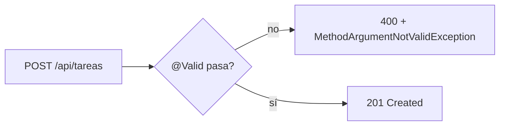
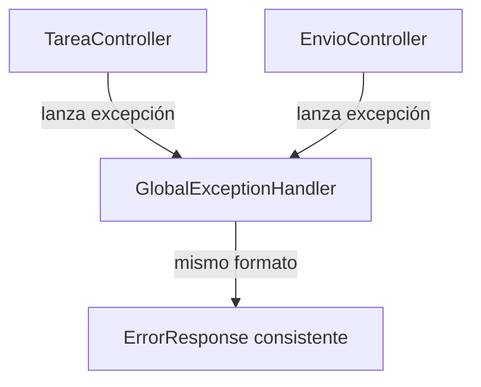

# Módulo 2: REST APIs con Spring Web

Cada tema separa el contrato HTTP (DTOs) de la persistencia interna (entidades), automatiza la validación de entrada y centraliza el manejo de errores — las tres piezas que hacen que una API REST sea predecible para quien la consume.


## Aprende construyendo

### Tema 1: Por qué DTOs en vez de entidades directamente

#### Paso 1 · Objetivo y preparación

Al finalizar podrás explicar por qué exponer entidades JPA directamente en una API es riesgoso, y separar el contrato HTTP de la persistencia interna usando DTOs.

**Conocimiento previo:** Módulo 1 (Spring Initializr, perfiles). Prerrequisitos: JDK 21, Maven y un editor.

#### Paso 2 · Contexto y caso real

**¿Por qué es importante?** Una API de paquetes recibe datos de clientes externos y no debe exponer columnas internas de la base de datos ni aceptar valores imposibles en la entrada; una frontera explícita entre el contrato público y el modelo interno protege ambos lados de ese cambio.

#### Paso 3 · Teoría con analogía

**Conceptos clave:** DTO (Data Transfer Object), desacoplar el contrato HTTP de la persistencia, relaciones `lazy`.

Un DTO representa el contrato de transporte hacia/desde el cliente HTTP, mientras que una entidad JPA (Módulo 3) representa el modelo de persistencia interno; separarlos evita dos problemas concretos. Primero, exponer entidades directamente filtraría detalles internos de la capa de persistencia hacia el contrato público (campos que existen únicamente por razones de mapeo relacional, o relaciones internas que no deberían ser visibles ni modificables desde fuera). Segundo, puede producir errores de serialización concretos con relaciones marcadas como `lazy` (Módulo 3), donde Jackson podría intentar serializar una relación que Hibernate todavía no cargó, produciendo una excepción en tiempo de ejecución. Los DTOs actúan como una capa de traducción explícita: renombrar un campo interno de la entidad no rompe el contrato público si el DTO correspondiente permanece estable.

**Analogía:** exponer entidades directamente es como mostrar a un cliente externo el inventario interno completo de un almacén, con sus códigos internos de ubicación; un DTO es como un catálogo de cara al público, que puede reorganizarse internamente sin que el catálogo público cambie.

**Diagrama:**

```mermaid
flowchart LR
  A["Cliente HTTP"] -->|CrearTareaRequest (DTO)| B["Controller"]
  B --> C["Tarea (entidad JPA)"]
  C -->|TareaDTO.from(tarea)| A
```

#### Paso 4 · Demostración guiada desde cero

Desde una carpeta vacía, genera el proyecto con los starters `web` y `validation`:

```bash
# descarga el proyecto y ejecuta las pruebas Java con Maven
mkdir ejemplo-spring-m2
cd ejemplo-spring-m2
curl -fsSL https://start.spring.io/starter.zip -d dependencies=web,validation -d javaVersion=21 -o app.zip
unzip app.zip
./mvnw test
```

Crea `src/main/java/com/example/demo/TareaController.java` recibiendo y devolviendo DTOs, nunca la entidad `Tarea` directamente:

```java
package com.example.demo;

import org.springframework.http.HttpStatus;
import org.springframework.http.ResponseEntity;
import org.springframework.web.bind.annotation.*;

@RestController
@RequestMapping("/api/tareas")
public class TareaController {

    private final ServicioTareas servicio;

    public TareaController(ServicioTareas servicio) {
        this.servicio = servicio;
    }

    @PostMapping
    public ResponseEntity<TareaDTO> crear(@RequestBody CrearTareaRequest request) {
        Tarea tarea = servicio.crear(request);
        return ResponseEntity.status(HttpStatus.CREATED).body(TareaDTO.from(tarea));
    }
}
```

**Explicación línea por línea:** `crear` recibe `CrearTareaRequest` (un DTO de entrada, no la entidad) y devuelve `TareaDTO` (un DTO de salida); `TareaDTO.from(tarea)` traduce explícitamente la entidad interna hacia el contrato público, controlando exactamente qué campos se exponen.

Envía una petición real y confirma que la respuesta expone solo los campos del DTO:

```bash
curl -i -X POST http://localhost:8080/api/tareas -H 'Content-Type: application/json' -d '{"titulo":"Entregar paquete","prioridad":1}'
```

**Resultado esperado:** la respuesta HTTP es `201 Created` con un cuerpo JSON que contiene únicamente los campos definidos en `TareaDTO` — sin ningún campo interno de la entidad `Tarea` que no esté explícitamente mapeado, confirmando que el DTO controla exactamente la superficie expuesta.

**Fallo deliberado:** cambia el controller para devolver la entidad `Tarea` directamente en vez de `TareaDTO`. Si `Tarea` tiene una relación `@ManyToOne(fetch = FetchType.LAZY)` hacia otra entidad, Jackson intenta serializarla fuera de una sesión de Hibernate activa, produciendo `LazyInitializationException` — diagnostica confirmando que exponer entidades directamente no es solo un problema de diseño, sino una fuente real de errores en tiempo de ejecución.

#### Construcción RutaFlow: DTOs para el recurso Envío

Crea `CrearEnvioRequest` y `EnvioDTO` para el recurso `Envio` de RutaFlow, confirmando que el controller nunca recibe ni devuelve la entidad JPA `Envio` directamente.

#### Paso 5 · Práctica guiada — repetición progresiva

1. Agrega un campo interno a la entidad `Tarea` (por ejemplo `costoInterno`) y confirma que no aparece en la respuesta JSON porque `TareaDTO` no lo mapea.
2. Renombra un campo de la entidad sin renombrar el campo correspondiente del DTO, y confirma que el contrato público no cambia.
3. Provoca el fallo deliberado del Paso 4 (devolver la entidad con una relación lazy) y documenta el stack trace exacto de `LazyInitializationException`.
4. Escribe de memoria (sin mirar) un DTO de entrada y uno de salida para un recurso nuevo, y el método `from()` que traduce la entidad al DTO de salida.

**Pista:** si un campo de la entidad no debería ser visible externamente, la forma más simple de garantizarlo es que el DTO de salida simplemente no lo incluya.

#### Paso 6 · Práctica independiente

**Completa el código:** rellena el espacio para que el método traduzca la entidad al DTO de salida:

```java
public ResponseEntity<TareaDTO> crear(@RequestBody CrearTareaRequest request) {
    Tarea tarea = servicio.crear(request);
    return ResponseEntity.status(HttpStatus.CREATED).body(TareaDTO.____(tarea));
}
```

**Reto de memoria sin mirar:** cierra este documento y escribe, solo de memoria, un DTO de entrada, un DTO de salida y un controller que use ambos sin exponer la entidad. Compara después contra el patrón del Paso 4.

#### Paso 7 · Cierre y evidencia

Ya explicas por qué exponer entidades directamente es riesgoso y separas el contrato HTTP de la persistencia con DTOs. El siguiente tema automatiza la validación de esos DTOs de entrada. **Evidencia:** entrega la respuesta `201 Created` con solo los campos del DTO, y el fallo real de `LazyInitializationException` al exponer la entidad directamente. Fuentes oficiales: [Spring Web MVC](https://docs.spring.io/spring-framework/reference/web/webmvc.html).

**Errores comunes:** devolver entidades JPA directamente desde el controller; nombrar el DTO igual que la entidad, generando confusión sobre cuál es cuál.

**Cuándo no usarlo:** para una API interna de solo lectura, sin persistencia relacional detrás (por ejemplo, un proxy que reenvía datos de otro servicio sin transformarlos), el DTO puede ser innecesario si no existe ninguna entidad de persistencia que proteger.

### Tema 2: Validación con Bean Validation y ResponseEntity

#### Paso 1 · Objetivo y preparación

Al finalizar podrás declarar restricciones de validación sobre un DTO de entrada y controlar explícitamente el código de estado HTTP devuelto.

**Conocimiento previo:** Tema 1 de este módulo.

#### Paso 2 · Contexto y caso real

**¿Por qué es importante?** Una API de paquetes no debe aceptar valores imposibles (un título vacío, una prioridad negativa); validar la entrada automáticamente en la frontera de la API evita que datos inválidos lleguen siquiera a la lógica de negocio.

#### Paso 3 · Teoría con analogía

**Conceptos clave:** anotaciones declarativas de validación (`@NotBlank`, `@Min`), `@Valid`, códigos de estado HTTP explícitos.

Bean Validation declara restricciones directamente sobre los campos del DTO mediante anotaciones (`@NotBlank`, `@Min`, `@Size`, `@Email`), verificadas automáticamente por Spring cuando el parámetro del controller se marca con `@Valid`, sin necesidad de código de validación imperativo repetido en cada endpoint. Si la validación falla, Spring lanza automáticamente `MethodArgumentNotValidException` antes de que el código del método del controller siquiera se ejecute. `ResponseEntity` permite controlar explícitamente el código de estado HTTP devuelto según el resultado real de la operación (`201` para creación exitosa, `404` si el recurso no existe), en vez de que Spring infiera un único código genérico para todos los casos.

**Analogía:** Bean Validation es como un formulario que rechaza automáticamente cualquier entrada que no cumpla reglas declaradas explícitamente, sin que un revisor humano verifique manualmente cada regla en cada envío; usar el código de estado HTTP correcto es como usar el sello oficial preciso correspondiente a cada resultado específico de un trámite, en vez de un único sello genérico.

**Diagrama:**



#### Paso 4 · Demostración guiada desde cero

Desde una carpeta vacía (o continuando en `ejemplo-spring-m2`, generado con `mvn` en el Tema 1), crea `src/main/java/com/example/demo/CrearTareaRequest.java` con restricciones declarativas:

```java
package com.example.demo;

import jakarta.validation.constraints.Min;
import jakarta.validation.constraints.NotBlank;

public record CrearTareaRequest(
    @NotBlank String titulo,
    @Min(1) int prioridad
) {}
```

Modifica el controller del Tema 1 para marcar el parámetro con `@Valid`:

```java
@PostMapping
public ResponseEntity<TareaDTO> crear(@Valid @RequestBody CrearTareaRequest request) {
    Tarea tarea = servicio.crear(request);
    return ResponseEntity.status(HttpStatus.CREATED).body(TareaDTO.from(tarea));
}
```

**Explicación línea por línea:** `@NotBlank` rechaza `titulo` vacío, nulo o solo espacios; `@Min(1)` rechaza `prioridad` menor a 1; `@Valid` en la firma del método le indica a Spring que verifique estas restricciones antes de ejecutar el cuerpo del método.

Ejecuta las pruebas reales y confirma que la validación se aplica:

```bash
# ejecuta las pruebas Java con Maven, incluyendo la petición inválida
cd ejemplo-spring-m2
./mvnw test
```

**Resultado esperado:** una petición con `titulo` vacío devuelve `400 Bad Request` con un detalle legible del campo que falló, sin que el código del controller haya escrito ninguna verificación manual — confirmando que `@Valid` intercepta la petición inválida antes de que llegue al cuerpo del método.

**Fallo deliberado:** quita `@Valid` de la firma del método y envía la misma petición con `titulo` vacío. La petición llega sin ser rechazada (`201 Created` con un título vacío persistido) — diagnostica confirmando que las anotaciones de Bean Validation por sí solas no verifican nada; sin `@Valid`, Spring simplemente las ignora.

#### Construcción RutaFlow: validación del recurso Envío

Agrega `@NotBlank` en la dirección de destino y `@Min(0)` en el peso del paquete de `CrearEnvioRequest`, confirmando con una petición real que un peso negativo produce `400 Bad Request`.

#### Paso 5 · Práctica guiada — repetición progresiva

1. Agrega `@Email` a un campo de correo del DTO y confirma que un valor sin `@` es rechazado con `400`.
2. Quita `@Valid` deliberadamente y confirma que una entrada inválida ya no es rechazada.
3. Cambia `ResponseEntity.status(HttpStatus.CREATED)` por `ResponseEntity.ok()` y documenta qué código HTTP cambia en la respuesta.
4. Escribe de memoria (sin mirar) un DTO con al menos dos restricciones de Bean Validation distintas y un controller que las verifique con `@Valid`.

**Pista:** si una validación no se está aplicando, lo primero que hay que revisar es si `@Valid` está presente en la firma del método — es la causa más común de este fallo.

#### Paso 6 · Práctica independiente

**Completa el código:** rellena el espacio para que la validación se aplique automáticamente:

```java
@PostMapping
public ResponseEntity<TareaDTO> crear(@____ @RequestBody CrearTareaRequest request) { ... }
```

**Reto de memoria sin mirar:** cierra este documento y escribe, solo de memoria, un DTO con `@NotBlank` y `@Min`, y un controller que lo valide con `@Valid` devolviendo el código HTTP correcto. Compara después contra el patrón del Paso 4.

#### Paso 7 · Cierre y evidencia

Ya declaras restricciones de validación sobre DTOs de entrada y controlas explícitamente el código de estado HTTP devuelto. El siguiente tema centraliza el manejo de los errores que esta validación produce. **Evidencia:** entrega el resultado real de la respuesta `400` al validar con `@Valid` presente, y la ausencia de ese rechazo al quitarlo. Fuentes oficiales: [Bean Validation (Jakarta)](https://jakarta.ee/specifications/bean-validation/).

**Errores comunes:** olvidar `@Valid` en la firma del método, dejando las anotaciones de validación sin efecto; devolver siempre `200` sin importar el resultado real de la operación.

**Cuándo no usarlo:** para un DTO que solo transporta datos ya validados por otra capa previa (por ejemplo, un mensaje de una cola interna ya validado en origen), duplicar la validación con Bean Validation puede ser redundante.

### Tema 3: Manejo centralizado de errores con @ControllerAdvice

#### Paso 1 · Objetivo y preparación

Al finalizar podrás centralizar el manejo de excepciones de toda una API en un único lugar, sin repetir try/catch en cada controller.

**Conocimiento previo:** Tema 2 de este módulo.

#### Paso 2 · Contexto y caso real

**¿Por qué es importante?** Sin manejo centralizado, cada controller de una API con decenas de endpoints tendría que repetir su propia lógica de traducción de excepciones a respuestas HTTP, arriesgando formatos de error inconsistentes entre distintos endpoints de la misma API.

#### Paso 3 · Teoría con analogía

**Conceptos clave:** `@RestControllerAdvice`, `@ExceptionHandler`, formato de error consistente.

`@RestControllerAdvice` centraliza en una única clase el manejo de excepciones específicas que pueden ocurrir en cualquier controller de la aplicación, mapeando cada tipo de excepción a una respuesta HTTP consistente mediante métodos anotados con `@ExceptionHandler`, en vez de que cada controller individual envuelva su propia lógica en bloques `try`/`catch` repetidos. Este enfoque garantiza que todos los controllers compartan exactamente el mismo formato de respuesta de error, reduciendo la duplicación de lógica de manejo de errores.

**Analogía:** `@ControllerAdvice` es como un departamento central de atención de reclamos que procesa de forma consistente cualquier tipo de problema reportado desde cualquier sucursal de una empresa, en vez de que cada sucursal improvise su propio procedimiento particular.

**Diagrama:**



#### Paso 4 · Demostración guiada desde cero

Desde una carpeta vacía (o continuando en `ejemplo-spring-m2`, generado con `mvn` en el Tema 1), crea `src/main/java/com/example/demo/GlobalExceptionHandler.java`:

```java
package com.example.demo;

import org.springframework.http.ResponseEntity;
import org.springframework.web.bind.MethodArgumentNotValidException;
import org.springframework.web.bind.annotation.ExceptionHandler;
import org.springframework.web.bind.annotation.RestControllerAdvice;

@RestControllerAdvice
public class GlobalExceptionHandler {

    @ExceptionHandler(MethodArgumentNotValidException.class)
    public ResponseEntity<ErrorResponse> manejarValidacion(MethodArgumentNotValidException ex) {
        return ResponseEntity.badRequest().body(new ErrorResponse(ex.getMessage()));
    }

    @ExceptionHandler(RecursoNoEncontradoException.class)
    public ResponseEntity<ErrorResponse> manejarNoEncontrado(RecursoNoEncontradoException ex) {
        return ResponseEntity.status(404).body(new ErrorResponse(ex.getMessage()));
    }
}
```

**Explicación línea por línea:** `@RestControllerAdvice` marca la clase como manejador global aplicado a todos los controllers; cada método `@ExceptionHandler(Tipo.class)` intercepta ese tipo de excepción específico lanzado desde cualquier controller y lo traduce a una respuesta HTTP con un formato (`ErrorResponse`) consistente en toda la API.

Ejecuta las pruebas reales confirmando que ambos tipos de error usan el mismo formato:

```bash
# ejecuta las pruebas Java con Maven que verifican el formato de error consistente
cd ejemplo-spring-m2
./mvnw test
```

**Resultado esperado:** tanto un error de validación (`400`) como un recurso no encontrado (`404`) devuelven un cuerpo JSON con exactamente la misma estructura de `ErrorResponse`, confirmando que el formato de error es consistente en toda la API sin que cada controller lo implemente por separado.

**Fallo deliberado:** elimina `GlobalExceptionHandler` y deja que `RecursoNoEncontradoException` se propague sin manejar. Spring devuelve su página de error genérica por defecto (`500 Internal Server Error` con un cuerpo que no sigue el formato `ErrorResponse` de la API) — diagnostica confirmando que sin un `@ExceptionHandler` explícito para cada excepción de negocio, el cliente recibe una respuesta inconsistente con el resto del contrato de la API.

#### Construcción RutaFlow: manejo centralizado para el recurso Envío

Agrega un `@ExceptionHandler` para `EnvioNoEncontradoException` en el mismo `GlobalExceptionHandler`, confirmando que produce el mismo formato `ErrorResponse` que los errores de `Tarea`.

#### Paso 5 · Práctica guiada — repetición progresiva

1. Agrega un tercer `@ExceptionHandler` para una excepción de negocio nueva y confirma que reutiliza el mismo `ErrorResponse`.
2. Elimina temporalmente el handler de `RecursoNoEncontradoException` y documenta la respuesta genérica real que Spring produce en su lugar.
3. Compara cuántas líneas de código requeriría manejar el mismo error con `try`/`catch` repetido en tres controllers distintos, frente a un único handler centralizado.
4. Escribe de memoria (sin mirar) una clase `@RestControllerAdvice` con dos `@ExceptionHandler` que devuelvan el mismo formato de error.

**Pista:** cada `@ExceptionHandler` maneja un tipo de excepción específico — si una excepción no tiene un handler correspondiente, cae en el comportamiento genérico de Spring, no en un handler por defecto tuyo.

#### Paso 6 · Práctica independiente

**Completa el código:** rellena el espacio para que la clase intercepte excepciones de todos los controllers:

```java
@____
public class GlobalExceptionHandler {
    @ExceptionHandler(RecursoNoEncontradoException.class)
    public ResponseEntity<ErrorResponse> manejarNoEncontrado(RecursoNoEncontradoException ex) { ... }
}
```

**Reto de memoria sin mirar:** cierra este documento y escribe, solo de memoria, un `@RestControllerAdvice` con handlers para una excepción de validación y una de recurso no encontrado. Compara después contra el patrón del Paso 4.

#### Paso 7 · Cierre y evidencia

Ya centralizas el manejo de excepciones de toda una API en un único lugar, con un formato de error consistente y sin repetir try/catch en cada controller. Esto cierra el ciclo básico de una API REST con Spring Web; el siguiente módulo persiste datos reales con JPA. **Evidencia:** entrega el resultado con el `ErrorResponse` consistente entre un error `400` y un `404`, y la respuesta genérica real al quitar el handler correspondiente. Fuentes oficiales: [Spring — Exception Handling](https://docs.spring.io/spring-framework/reference/web/webmvc/mvc-controller/ann-exceptionhandler.html).

**Errores comunes:** repetir try/catch en cada controller para el mismo tipo de error, en vez de centralizarlo; capturar `Exception` genérico sin distinguir el tipo real, filtrando detalles internos (stack traces) hacia el cliente.

**Cuándo no usarlo:** para un endpoint verdaderamente único que necesita un manejo de error muy específico y no reutilizable en ningún otro lugar de la API, un `try`/`catch` local puntual puede ser más simple que agregar un handler global de un solo uso.

---


## Laboratorio práctico

**Objetivo del laboratorio:** construir una API REST con validación de entrada y manejo centralizado de errores.

**Requisitos previos:** Módulos 0-1 completados.

| Paso | Acción | Código | Explicación |
|---|---|---|---|
| 1 | Crear GET/POST `/tareas` con DTOs | Ver Tema 1 | No expone la entidad directamente |
| 2 | Agregar validación con `@Valid` | Ver Tema 2 | `@NotBlank`, `@Min` en el DTO |
| 3 | Devolver `ResponseEntity` con códigos correctos | Ver Tema 2 | 201 al crear, 404 si no existe |
| 4 | Crear un `@ControllerAdvice` con `@ExceptionHandler` | Ver Tema 3 | Captura una excepción de negocio, devuelve 400 |
| 5 | Probar con curl un body inválido | — | Verifica el mensaje de error estructurado |

**Verificación:** el laboratorio se considera exitoso si ningún endpoint expone la entidad JPA directamente, y si una entrada inválida produce un error 400 con un mensaje estructurado consistente, sin ningún try/catch repetido en el controller.

**Errores comunes y soluciones**

- **Exponer la entidad JPA directamente en la respuesta HTTP.** Usa siempre un DTO específico para el contrato de la API.
- **Olvidar `@Valid` en el parámetro del controller.** Sin él, las anotaciones de Bean Validation en el DTO no se verifican.
- **Repetir try/catch en cada controller para el mismo tipo de error.** Centraliza ese manejo en un `@ControllerAdvice`.

---
