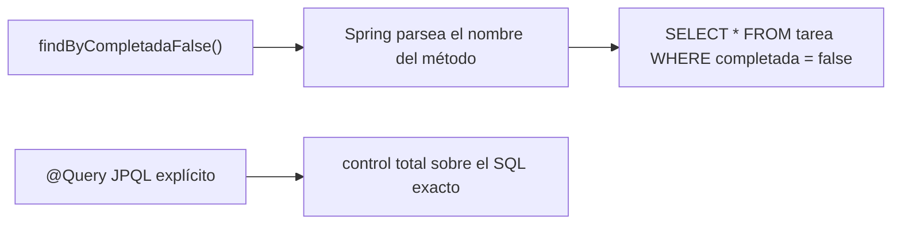
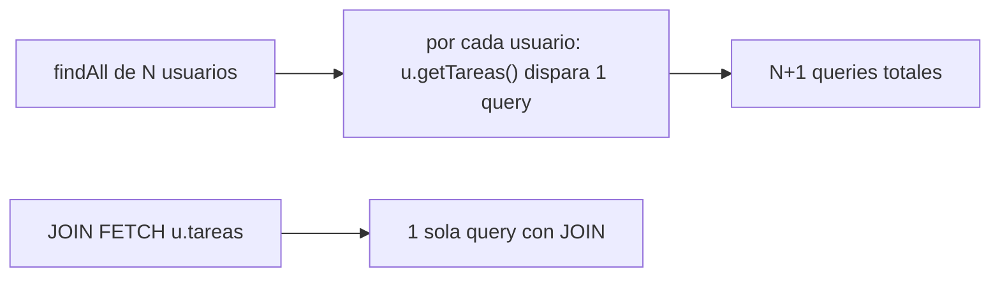

# Módulo 3: Persistencia con Spring Data JPA

Cada tema se practica por separado con su propia repetición progresiva y su propio reto de memoria, verificado contra una base de datos H2 real embebida y `mvn test`, para que cada afirmación sobre queries y migraciones sea comprobable, no solo descrita.


## Aprende construyendo

### Tema 1: Entidades y repositorios derivados

#### Paso 1 · Objetivo y preparación

Al finalizar podrás mapear una clase Java a una tabla con `@Entity`, declarar un repositorio derivado cuyo nombre de método genera la query automáticamente, y explicar cuándo ese mecanismo deja de ser suficiente y se necesita `@Query` explícito.

**Conocimiento previo:** Spring Initializr y starters (Módulo 1); DTOs vs entities (Módulo 2).

#### Paso 2 · Contexto y caso real

**¿Por qué es importante?** Una lista de tareas pendientes necesita persistirse en una base de datos real; escribir SQL manual para cada consulta simple (buscar por estado, por usuario) es repetitivo y propenso a errores tipográficos que solo se detectan en tiempo de ejecución.

#### Paso 3 · Teoría con analogía

**Conceptos clave:** mapeo objeto-relacional (`@Entity`), query derivada del nombre del método, `@Query` explícito para casos complejos.

```java
@Entity
public class Tarea {
    @Id @GeneratedValue
    private Long id;
    private String titulo;
    private boolean completada;
}
```

Esta clase mapea una clase Java a una tabla de base de datos: Hibernate (la implementación de JPA que usa Spring Data JPA) traduce automáticamente entre instancias de esta clase y filas de la tabla, gestionando la generación de identificadores (`@GeneratedValue`).

```java
public interface TareaRepository extends JpaRepository<Tarea, Long> {
    List<Tarea> findByCompletadaFalse();
}
```

Esta interfaz demuestra la capacidad más distintiva de Spring Data: Spring parsea el nombre del método (`findBy` + `Completada` + `False`) y genera la implementación SQL automáticamente, sin ningún cuerpo escrito a mano. Cuando la consulta necesaria es demasiado compleja para expresarse por convención de nombres (agregaciones, joins específicos), `@Query` con JPQL explícito da control total.

**Analogía:** un método derivado es como pedirle a un asistente que entienda automáticamente qué necesitas a partir de cómo formulas tu pedido en lenguaje natural estructurado ("las tareas no completadas"); `@Query` es darle a ese mismo asistente instrucciones explícitas y precisas cuando el pedido es demasiado específico para que lo infiera por sí solo.

**Diagrama:**



#### Paso 4 · Demostración guiada desde cero

Desde una carpeta vacía (o continuando en `academia-spring`, o créala con `mkdir -p academia-spring` si es tu primera vez), genera el proyecto con Spring Initializr real (`data-jpa`, `h2`) y crea la entidad y el repositorio en `src/main/java/com/academia/tarea/`:

```bash
mkdir -p academia-spring
cd academia-spring
curl -fsSL https://start.spring.io/starter.zip -d dependencies=data-jpa,h2 -d javaVersion=21 -d artifactId=academia-tareas -o app.zip
unzip -o app.zip
mkdir -p src/main/java/com/academia/tarea
```

```java
// src/main/java/com/academia/tarea/Tarea.java
package com.academia.tarea;

import jakarta.persistence.Entity;
import jakarta.persistence.GeneratedValue;
import jakarta.persistence.Id;

@Entity
public class Tarea {
    @Id
    @GeneratedValue
    private Long id;
    private String titulo;
    private boolean completada;

    protected Tarea() {} // requerido por JPA

    public Tarea(String titulo) {
        this.titulo = titulo;
        this.completada = false;
    }

    public Long getId() { return id; }
    public String getTitulo() { return titulo; }
    public boolean isCompletada() { return completada; }
}
```

```java
// src/main/java/com/academia/tarea/TareaRepository.java
package com.academia.tarea;

import org.springframework.data.jpa.repository.JpaRepository;
import java.util.List;

public interface TareaRepository extends JpaRepository<Tarea, Long> {
    List<Tarea> findByCompletadaFalse(); // Spring genera la query a partir del nombre del método
}
```

**Explicación línea por línea:** `@Id @GeneratedValue` delega en la base de datos la generación del identificador; el constructor protegido sin argumentos es requerido por JPA para reconstruir instancias desde filas de la base de datos, mientras el constructor público controla la creación válida desde código de aplicación; `findByCompletadaFalse()` no tiene cuerpo porque Spring Data genera la implementación completa a partir del nombre del método en tiempo de arranque.

Escribe un test real con `@DataJpaTest` (levanta un contexto JPA real contra H2 en memoria, sin mockear nada) que guarda tareas y confirma que el método derivado filtra correctamente:

```java
// src/test/java/com/academia/tarea/TareaRepositoryTest.java
package com.academia.tarea;

import org.junit.jupiter.api.Test;
import org.springframework.beans.factory.annotation.Autowired;
import org.springframework.boot.test.autoconfigure.orm.jpa.DataJpaTest;
import java.util.List;
import static org.assertj.core.api.Assertions.assertThat;

@DataJpaTest
class TareaRepositoryTest {

    @Autowired
    private TareaRepository tareaRepository;

    @Test
    void findByCompletadaFalseDevuelveSoloLasPendientes() {
        tareaRepository.save(new Tarea("Comprar leche"));
        Tarea pagada = new Tarea("Pagar factura");
        tareaRepository.save(pagada);

        List<Tarea> pendientes = tareaRepository.findByCompletadaFalse();

        assertThat(pendientes).extracting(Tarea::getTitulo).containsExactlyInAnyOrder("Comprar leche", "Pagar factura");
    }
}
```

```bash
mvn test -Dtest=TareaRepositoryTest
```

`mvn` es el comando que ejecuta Maven; `test` es la fase del ciclo de vida que compila y corre las pruebas, y `-Dtest=` es la propiedad que acota la ejecución a una sola clase de test.

**Resultado esperado:** `BUILD SUCCESS` con el test en verde, confirmando que `findByCompletadaFalse()` devuelve exactamente las dos tareas guardadas sin completar, generadas por Spring Data a partir únicamente del nombre del método, sin SQL escrito a mano.

**Fallo deliberado:** cambia el nombre del método en `TareaRepository` a `findByTituloo` (columna inexistente, error tipográfico deliberado) y vuelve a ejecutar `mvn test`. La aplicación falla al ARRANCAR el contexto de Spring (no al ejecutar la query), con `PropertyReferenceException: No property 'tituloo' found for type 'Tarea'` — diagnostica confirmando que Spring Data valida los nombres de método contra las propiedades reales de la entidad en tiempo de arranque, adelantando ese error a un momento mucho más temprano que si hubiera sido SQL manual con un typo en el nombre de columna. Revierte el nombre antes de continuar.

#### Paso 5 · Práctica guiada — repetición progresiva

1. Agrega un segundo método derivado (`findByTituloContaining(String fragmento)`) y confirma con un test real que filtra correctamente por coincidencia parcial.
2. Agrega un método derivado con dos condiciones (`findByCompletadaFalseAndTituloContaining(String fragmento)`) y confirma su comportamiento con datos que solo cumplen una de las dos condiciones.
3. Reemplaza `findByCompletadaFalse()` por el equivalente exacto en `@Query("SELECT t FROM Tarea t WHERE t.completada = false")` y confirma que el test original sigue pasando sin ninguna otra modificación.
4. Escribe de memoria (sin mirar) una entidad con dos campos y un repositorio con un método derivado que filtre por uno de ellos.

**Pista:** si el nombre del método derivado empieza a tener más de dos o tres condiciones encadenadas, es una señal de que `@Query` explícito sería más legible que seguir extendiendo el nombre.

#### Paso 6 · Práctica independiente

**Completa el código:** rellena el espacio para que Spring genere la query a partir del nombre del método:

```java
public interface TareaRepository extends JpaRepository<Tarea, Long> {
    List<Tarea> ____CompletadaFalse();
}
```

**Reto de memoria sin mirar:** cierra este documento y escribe, solo de memoria, una entidad `@Entity` con `@Id @GeneratedValue`, y un repositorio con un método derivado que filtre por un campo booleano. Compara después contra el patrón del Paso 4.

#### Paso 7 · Cierre y evidencia

Ya mapeas una clase Java a una tabla con `@Entity`, declaras repositorios cuya query se genera a partir del nombre del método, y confirmas con un test real contra H2 que el resultado es correcto. El siguiente tema aborda qué ocurre cuando estas queries derivadas se combinan con relaciones entre entidades. **Evidencia:** entrega el resultado de `TareaRepositoryTest` en verde, y el mensaje de error real que produce un nombre de método con una propiedad inexistente. Fuente oficial: [Spring Data JPA — Query methods](https://docs.spring.io/spring-data/jpa/reference/jpa/query-methods.html).

**Errores comunes:** escribir SQL manual para consultas simples que un método derivado resolvería automáticamente; encadenar demasiadas condiciones en el nombre del método hasta volverlo ilegible, en vez de cambiar a `@Query`.

**Cuándo no usarlo:** para una consulta con agregaciones, joins específicos, o lógica que no se expresa naturalmente como una secuencia de condiciones sobre propiedades, un método derivado se vuelve forzado o imposible; usa `@Query` con JPQL explícito desde el principio en esos casos.

Las entidades y repositorios que definas aquí son la base de persistencia del proyecto integrador de este track (microservicio productivo, Módulo 12).

### Tema 2: El problema N+1 y su corrección

#### Paso 1 · Objetivo y preparación

Al finalizar podrás reproducir el problema N+1 con una relación `@OneToMany`, medir el número real de queries ejecutadas, y corregirlo con `JOIN FETCH`.

**Conocimiento previo:** Tema 1 de este módulo (entidades y repositorios).

#### Paso 2 · Contexto y caso real

**¿Por qué es importante?** Iterar sobre una lista de usuarios accediendo a las tareas de cada uno, con una relación cargada perezosamente, dispara una query SQL separada por cada usuario individual — un problema de rendimiento que empeora directamente con el tamaño de los datos y puede pasar desapercibido en desarrollo con pocos registros de prueba.

#### Paso 3 · Teoría con analogía

**Conceptos clave:** carga perezosa (`lazy`), una query adicional por cada elemento de una colección, `JOIN FETCH`.

`@OneToMany(mappedBy = "usuario") private List<Tarea> tareas;` mapea una relación uno-a-muchos, con carga perezosa por defecto: la lista de tareas de un usuario no se carga desde la base de datos hasta que efectivamente se accede a ella (`u.getTareas().size()`). Esto se vuelve problemático al iterar sobre una colección de usuarios: por cada usuario, Hibernate ejecuta una query SQL separada para cargar sus tareas, resultando en N queries adicionales más la query original que cargó la lista de usuarios — de ahí "N+1". `@Query("SELECT u FROM Usuario u JOIN FETCH u.tareas") List<Usuario> buscarConTareas();` corrige esto indicándole a Hibernate que cargue usuarios y tareas relacionadas en una única query con `JOIN` real.

**Analogía:** el problema N+1 es como enviar un mensajero por separado a buscar cada ingrediente de una receta, uno a la vez, en vez de un único mensajero que trae todos los ingredientes en un solo viaje coordinado (`JOIN FETCH`); cada viaje individual tiene un costo fijo que se multiplica innecesariamente.

**Diagrama:**



#### Paso 4 · Demostración guiada desde cero

Reutiliza `academia-spring` (o créalo desde una carpeta vacía con `mkdir -p academia-spring` si es tu primera vez) y crea `src/main/java/com/academia/tarea/Usuario.java` con la relación, habilitando además el contador de queries real vía el logger de Hibernate:

```bash
mkdir -p academia-spring/src/main/java/com/academia/tarea
cd academia-spring
```

```java
// src/main/java/com/academia/tarea/Usuario.java
package com.academia.tarea;

import jakarta.persistence.*;
import java.util.ArrayList;
import java.util.List;

@Entity
public class Usuario {
    @Id
    @GeneratedValue
    private Long id;
    private String nombre;

    @OneToMany(mappedBy = "usuario")
    private List<Tarea> tareas = new ArrayList<>();

    protected Usuario() {}

    public Usuario(String nombre) { this.nombre = nombre; }

    public Long getId() { return id; }
    public List<Tarea> getTareas() { return tareas; }
}
```

```bash
cat >> src/main/resources/application.properties <<'EOF'
spring.jpa.properties.hibernate.generate_statistics=true
logging.level.org.hibernate.stat=DEBUG
EOF
```

**Explicación línea por línea:** `@OneToMany(mappedBy = "usuario")` declara la relación uno-a-muchos con carga perezosa (comportamiento por defecto de `@OneToMany`); `hibernate.generate_statistics=true` activa las estadísticas reales de Hibernate, que reportan el número exacto de queries ejecutadas por sesión — la forma real de medir N+1, no una estimación.

Escribe un test real que provoca N+1 deliberadamente, leyendo el conteo real de queries desde `SessionFactory.getStatistics()`:

```java
// src/test/java/com/academia/tarea/NMasUnoTest.java
package com.academia.tarea;

import org.hibernate.SessionFactory;
import org.hibernate.stat.Statistics;
import org.junit.jupiter.api.Test;
import org.springframework.beans.factory.annotation.Autowired;
import org.springframework.boot.test.autoconfigure.orm.jpa.DataJpaTest;
import static org.assertj.core.api.Assertions.assertThat;

@DataJpaTest
class NMasUnoTest {

    @Autowired
    private UsuarioRepository usuarioRepository;
    @Autowired
    private SessionFactory sessionFactory;

    @Test
    void iterarSobreUsuariosAccediendoATareasDisparaNMasUnoQueries() {
        for (int i = 0; i < 3; i++) usuarioRepository.save(new Usuario("usuario-" + i));

        Statistics stats = sessionFactory.getStatistics();
        stats.clear();

        for (Usuario u : usuarioRepository.findAll()) {
            u.getTareas().size(); // dispara una query lazy POR CADA usuario
        }

        // 1 query para findAll() + 3 queries lazy (una por usuario) = 4
        assertThat(stats.getQueryExecutionCount()).isEqualTo(4L);
    }
}
```

```bash
mvn test -Dtest=NMasUnoTest
```

**Resultado esperado:** el test pasa: `stats.getQueryExecutionCount()` reporta exactamente `4` queries (1 de `findAll()` + 3 de acceso perezoso, una por usuario) — la medición real del problema N+1, no una suposición.

**Fallo deliberado:** cambia el conteo esperado a `assertThat(stats.getQueryExecutionCount()).isEqualTo(1L)` (asumiendo, incorrectamente, que `findAll()` ya trae todo) y ejecuta de nuevo. El test FALLA con `expected: 1L but was: 4L` — diagnostica confirmando con evidencia real, no intuición, que la carga perezosa efectivamente dispara las queries adicionales al iterar. Revierte la aserción a `4L`, luego corrige el método con `JOIN FETCH` en `UsuarioRepository` (`@Query("SELECT u FROM Usuario u JOIN FETCH u.tareas") List<Usuario> buscarConTareas();`) y confirma que, usando ese método en vez de `findAll()`, `stats.getQueryExecutionCount()` baja a `1L`.

#### Paso 5 · Práctica guiada — repetición progresiva

1. Agrega un cuarto usuario y confirma que el conteo de queries sube a `5` (1 + 4) antes de la corrección, y permanece en `1` después de aplicar `JOIN FETCH`.
2. Prueba `@EntityGraph(attributePaths = "tareas")` sobre `findAll()` como alternativa declarativa a `JOIN FETCH` y confirma con `Statistics` que también reduce el conteo a `1`.
3. Provoca N+1 con una segunda relación (agrega `@OneToMany` de `Usuario` a una nueva entidad `Comentario`) y confirma que iterar sobre ambas relaciones multiplica el número de queries adicionales.
4. Escribe de memoria (sin mirar) una entidad con `@OneToMany` y un test que mida el número real de queries con `Statistics` antes y después de `JOIN FETCH`.

**Pista:** `stats.clear()` antes de la sección que quieres medir es imprescindible; sin eso, el conteo incluye queries de configuración previas y el número deja de ser interpretable.

#### Paso 6 · Práctica independiente

**Completa el código:** rellena el espacio para cargar usuarios y tareas en una única query:

```java
@Query("SELECT u FROM Usuario u ____ u.tareas")
List<Usuario> buscarConTareas();
```

**Reto de memoria sin mirar:** cierra este documento y escribe, solo de memoria, un test que mida con `Statistics.getQueryExecutionCount()` la diferencia entre iterar con carga perezosa y usar `JOIN FETCH`. Compara después contra el patrón del Paso 4.

#### Paso 7 · Cierre y evidencia

Ya reproduces el problema N+1 y lo mides con estadísticas reales de Hibernate, en vez de asumir su presencia o ausencia. El siguiente tema aborda cómo versionar cambios de esquema sin depender de la generación automática de Hibernate. **Evidencia:** entrega el resultado del conteo de queries antes (`4`) y después (`1`) de aplicar `JOIN FETCH`, medido con `Statistics` real. Fuente oficial: [Hibernate — Fetching strategies](https://docs.jboss.org/hibernate/orm/current/userguide/html_single/Hibernate_User_Guide.html#fetching).

**Errores comunes:** no notar el problema N+1 hasta que aparece en producción con datasets grandes, por no haberlo medido durante el desarrollo; usar `EAGER` indiscriminadamente en todas las relaciones como "solución" genérica, lo que puede cargar datos innecesarios incluso cuando no se necesitan.

**Cuándo no usarlo:** para una relación que casi nunca se accede junto con la entidad principal, forzar `JOIN FETCH` en todas las consultas cargaría datos innecesarios la mayoría del tiempo; resérvalo para los accesos donde realmente se sabe que la relación se usará.

Detectar y corregir N+1 es una revisión obligatoria antes de dar por completo el proyecto integrador de este track (microservicio productivo, Módulo 12).

### Tema 3: Migraciones con Flyway

#### Paso 1 · Objetivo y preparación

Al finalizar podrás versionar un cambio de esquema con una migración de Flyway, y explicar por qué `hibernate.ddl-auto=update` es riesgoso en producción.

**Conocimiento previo:** Temas 1 y 2 de este módulo.

#### Paso 2 · Contexto y caso real

**¿Por qué es importante?** Un cambio de esquema aplicado automáticamente por Hibernate (`ddl-auto=update`) no queda registrado en ningún historial versionado ni revisable en un pull request; una migración de Flyway sí, y se aplica de forma idéntica y predecible en cada entorno.

#### Paso 3 · Teoría con analogía

**Conceptos clave:** esquema versionado y revisable, riesgo de `ddl-auto` en producción, migraciones aplicadas en orden secuencial.

`hibernate.ddl-auto=update` permite que Hibernate genere y actualice automáticamente el esquema basándose en las entidades declaradas, cómodo en desarrollo temprano pero riesgoso en producción: Hibernate podría inferir un cambio distinto al pretendido, sin quedar registrado en ningún historial revisable antes de aplicarse. `V1__crear_tabla_tareas.sql` (una migración de Flyway, nombrada según su convención de versión secuencial) declara explícitamente en SQL puro el cambio de esquema, versionado en el repositorio, revisable en un pull request, y aplicado de forma idéntica en cada entorno — Flyway registra qué migraciones ya se aplicaron en cada base de datos, aplicando únicamente las nuevas pendientes, en orden.

**Analogía:** `ddl-auto=update` es como dejar que un asistente reorganice el mobiliario de una casa según sus propias inferencias, sin un plano ni revisión previa; Flyway es seguir un plano de renovación explícito, versionado y revisado antes de ejecutarse, aplicado exactamente igual en cada casa idéntica.

**Diagrama:**

```
┌── V1__crear_tabla_tareas.sql ──┐
│  aplicada primero                │
└──────────┬─────────────────┘
           │ V2__agregar_columna_prioridad.sql
           ▼
┌── esquema actual, versionado y revisable ──┐
│  Flyway registra qué migraciones ya corrieron │
└──────────────────────────────────────┘
```

#### Paso 4 · Demostración guiada desde cero

Reutiliza `academia-spring` (o créalo desde una carpeta vacía con `mkdir -p academia-spring` si es tu primera vez), agrega la dependencia `flyway-core` y crea la migración inicial en `src/main/resources/db/migration/`:

```bash
mkdir -p academia-spring/src/main/resources/db/migration
cd academia-spring
```

```sql
-- src/main/resources/db/migration/V1__crear_tabla_tarea.sql
CREATE TABLE tarea (
    id BIGSERIAL PRIMARY KEY,
    titulo VARCHAR(255) NOT NULL,
    completada BOOLEAN NOT NULL DEFAULT false
);
```

```bash
# desactiva ddl-auto: el esquema ahora lo gestiona exclusivamente Flyway
cat >> src/main/resources/application.properties <<'EOF'
spring.jpa.hibernate.ddl-auto=validate
spring.flyway.enabled=true
EOF
mvn test
```

**Explicación línea por línea:** `V1__crear_tabla_tarea.sql` (prefijo `V1`, número de versión secuencial, seguido de `__` y una descripción) declara el esquema inicial en SQL real; `spring.jpa.hibernate.ddl-auto=validate` le indica a Hibernate que NO genere ni modifique el esquema, solo que valide que las entidades coincidan con lo que Flyway ya creó — si no coinciden, la aplicación falla al arrancar en vez de aplicar un cambio silencioso no revisado.

Confirma con un test real que la migración se aplicó y el esquema coincide con la entidad `Tarea`, guardando y leyendo una fila real:

```java
// src/test/java/com/academia/tarea/MigracionFlywayTest.java
package com.academia.tarea;

import org.junit.jupiter.api.Test;
import org.springframework.beans.factory.annotation.Autowired;
import org.springframework.boot.test.autoconfigure.orm.jpa.DataJpaTest;
import static org.assertj.core.api.Assertions.assertThat;

@DataJpaTest
class MigracionFlywayTest {

    @Autowired
    private TareaRepository tareaRepository;

    @Test
    void elEsquemaCreadoPorFlywayAceptaGuardarYLeerUnaTarea() {
        Tarea guardada = tareaRepository.save(new Tarea("Comprar leche"));

        Tarea leida = tareaRepository.findById(guardada.getId()).orElseThrow();

        assertThat(leida.getTitulo()).isEqualTo("Comprar leche");
    }
}
```

```bash
mvn test -Dtest=MigracionFlywayTest
```

**Resultado esperado:** `BUILD SUCCESS`, confirmando que Flyway aplicó `V1__crear_tabla_tarea.sql` antes de que el contexto de Spring arrancara, que `ddl-auto=validate` confirmó que la entidad `Tarea` coincide con ese esquema, y que guardar y leer una fila real funciona correctamente.

**Fallo deliberado:** agrega manualmente un campo nuevo a la entidad `Tarea` (por ejemplo, `private String descripcion;`) SIN crear ninguna migración `V2` que agregue la columna correspondiente, y ejecuta `mvn test` de nuevo. La aplicación falla al arrancar con `SchemaManagementException: Schema-validation: missing column [descripcion] in table [tarea]` — diagnostica confirmando exactamente el propósito de `ddl-auto=validate`: en vez de que Hibernate silenciosamente agregara la columna faltante (el riesgo de `ddl-auto=update`), la aplicación se niega a arrancar hasta que exista una migración explícita y revisable que agregue esa columna. Revierte el campo agregado, o crea `V2__agregar_columna_descripcion.sql` con `ALTER TABLE tarea ADD COLUMN descripcion VARCHAR(500);` para resolverlo correctamente.

#### Paso 5 · Práctica guiada — repetición progresiva

1. Agrega `V2__agregar_indice_completada.sql` con `CREATE INDEX idx_tarea_completada ON tarea(completada);` y confirma que `mvn test` sigue en verde tras aplicar ambas migraciones en secuencia.
2. Intenta nombrar una migración fuera de secuencia (`V1__otra_migracion.sql`, reutilizando la versión `1` ya aplicada) y observa el error real que produce Flyway ante una versión duplicada.
3. Agrega una migración que renombre una columna (`ALTER TABLE tarea RENAME COLUMN titulo TO nombre;`) y actualiza la entidad correspondientemente, confirmando que el test de lectura/escritura sigue pasando con el nuevo nombre.
4. Escribe de memoria (sin mirar) una migración `V1` que cree una tabla de dos columnas, y un test que confirme que Flyway la aplicó correctamente.

**Pista:** el prefijo de versión (`V1`, `V2`, ...) debe ser único y estrictamente creciente; Flyway rechaza aplicar una migración con una versión ya registrada como aplicada.

#### Paso 6 · Práctica independiente

**Completa el código:** rellena el espacio para que Hibernate solo valide el esquema, sin modificarlo:

```properties
spring.jpa.hibernate.ddl-auto=____
```

**Reto de memoria sin mirar:** cierra este documento y escribe, solo de memoria, una migración `V1` que cree una tabla con al menos dos columnas, y explica en una frase por qué `ddl-auto=validate` es preferible a `update` en producción. Compara después contra el patrón del Paso 4.

#### Paso 7 · Cierre y evidencia

Ya versionas cambios de esquema con migraciones explícitas y revisables de Flyway, en vez de depender de la inferencia automática de Hibernate. Esto cierra el módulo de persistencia; el siguiente módulo aborda cómo exponer y proteger estos datos a través de una API REST completa. **Evidencia:** entrega el resultado de `MigracionFlywayTest` en verde, y el mensaje de error real que produce un campo de entidad sin su migración correspondiente. Fuente oficial: [Flyway — Migrations](https://documentation.red-gate.com/flyway/flyway-cli-and-api/concepts/migrations).

**Errores comunes:** confiar en `ddl-auto=update` en un entorno de producción, arriesgando cambios de esquema no versionados ni revisables; editar tablas manualmente en vez de a través de una migración versionada, perdiendo el historial y la reproducibilidad entre entornos.

**Cuándo no usarlo:** para un prototipo local descartable sin ningún dato que preservar entre reinicios, `ddl-auto=create-drop` sin Flyway es más simple y suficiente; reserva las migraciones versionadas para cualquier entorno compartido o con datos que deban persistir.

---

Las migraciones con Flyway que escribas aquí versionan el esquema del proyecto integrador de este track (microservicio productivo, Módulo 12).

## Laboratorio práctico

**Objetivo del laboratorio:** construir una API con persistencia real, medir y corregir un problema N+1, y versionar el esquema con Flyway.

**Requisitos previos:** Módulos 0-2 completados.

| Paso | Acción | Código | Explicación |
|---|---|---|---|
| 1 | Definir `Tarea` con `@Entity` y su repositorio | Ver Tema 1 | Método derivado `findByCompletadaFalse` |
| 2 | Comparar con el equivalente en `@Query` | Ver Tema 1 | Discute cuándo cada enfoque es apropiado |
| 3 | Modelar `@OneToMany` y provocar N+1 | Ver Tema 2 | Cuenta las queries ejecutadas con `Statistics` |
| 4 | Corregir con `JOIN FETCH` o `@EntityGraph` | Ver Tema 2 | Mide la diferencia real en queries |
| 5 | Configurar Flyway con una migración versionada | Ver Tema 3 | En vez de `ddl-auto=update` |

**Verificación:** el laboratorio se considera exitoso si la corrección del problema N+1 reduce el número de queries medido con `Statistics` de N+1 a una única query, y si el esquema de la base de datos se gestiona completamente mediante migraciones versionadas de Flyway, con `ddl-auto=validate` confirmando la coincidencia.

**Errores comunes y soluciones**

- **Confiar en `ddl-auto=update` en un entorno de producción.** Usa migraciones versionadas con Flyway.
- **No notar el problema N+1 hasta que aparece en producción con datos reales.** Mide el número de queries con `Statistics` durante el desarrollo, con datasets representativos.
- **Sobreusar `@Query` para casos que un método derivado simple resolvería.** Usa métodos derivados para consultas simples y directas.

---
