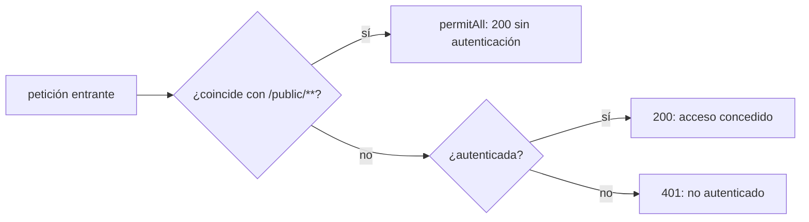
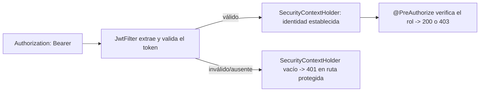

# Módulo 4: Spring Security

Cada tema se practica por separado con su propia repetición progresiva y su propio reto de memoria, verificado con `MockMvc` real contra un contexto de Spring real, para que cada código de estado HTTP (200/401/403) sea comprobable, no solo descrito.


## Aprende construyendo

### Tema 1: SecurityFilterChain moderno

#### Paso 1 · Objetivo y preparación

Al finalizar podrás declarar un `SecurityFilterChain` como `@Bean` que permite rutas públicas y exige autenticación en el resto, y confirmar con `MockMvc` real los códigos 200 y 401 correspondientes.

**Conocimiento previo:** Spring Initializr y starters (Módulo 1); `@RestController` básico (Módulo 1).

#### Paso 2 · Contexto y caso real

**¿Por qué es importante?** Clientes, conductores y operadores consultan rutas distintas de una API de entregas; un endpoint de salud (`/public/health`) debe responder sin credencial para que un balanceador de carga lo consulte, mientras las rutas de negocio (`/api/**`) deben exigir identidad — confundir esta frontera expone datos y operaciones críticas.

#### Paso 3 · Teoría con analogía

**Conceptos clave:** configuración declarativa vía `@Bean`, reglas de autorización por ruta.

La configuración moderna de Spring Security (reemplazando el patrón anterior basado en extender `WebSecurityConfigurerAdapter`, ahora deprecado) declara la cadena de filtros directamente como un `@Bean`: `http.authorizeHttpRequests(auth -> auth.requestMatchers("/public/**").permitAll().anyRequest().authenticated())` configura de forma fluida qué rutas requieren autenticación y cuáles están explícitamente permitidas sin ella. Este enfoque basado en `@Bean` refleja la migración general de Spring hacia composición explícita mediante beans en vez de herencia de clases base configurables.

**Analogía:** el `SecurityFilterChain` es como una lista de control de acceso a la entrada de un edificio: especifica explícitamente qué áreas son de acceso público sin credencial, y cuáles requieren verificación de identidad antes de permitir el paso.

**Diagrama:**



#### Paso 4 · Demostración guiada desde cero

Desde una carpeta vacía (o continuando en `academia-spring`, o créala con `mkdir -p academia-spring` si es tu primera vez), genera el proyecto con Spring Initializr real (`web`, `security`) y crea `src/main/java/com/academia/seguridad/SecurityConfig.java` junto con un controlador mínimo:

```bash
mkdir -p academia-spring
cd academia-spring
curl -fsSL https://start.spring.io/starter.zip -d dependencies=web,security -d javaVersion=21 -d artifactId=academia-security -o app.zip
unzip -o app.zip
mkdir -p src/main/java/com/academia/seguridad
```

```java
// src/main/java/com/academia/seguridad/SecurityConfig.java
package com.academia.seguridad;

import org.springframework.context.annotation.Bean;
import org.springframework.context.annotation.Configuration;
import org.springframework.security.config.annotation.web.builders.HttpSecurity;
import org.springframework.security.web.SecurityFilterChain;

@Configuration
public class SecurityConfig {

    @Bean
    SecurityFilterChain filterChain(HttpSecurity http) throws Exception {
        return http
            .csrf(csrf -> csrf.disable()) // API stateless: sin sesiones basadas en cookies
            .authorizeHttpRequests(auth -> auth
                .requestMatchers("/public/**").permitAll()
                .anyRequest().authenticated())
            .httpBasic(httpBasic -> {}) // autenticación básica real para este tema; JWT llega en el Tema 2
            .build();
    }
}
```

```java
// src/main/java/com/academia/seguridad/RutasController.java
package com.academia.seguridad;

import org.springframework.web.bind.annotation.GetMapping;
import org.springframework.web.bind.annotation.RestController;

@RestController
public class RutasController {

    @GetMapping("/public/health")
    public String salud() { return "OK"; }

    @GetMapping("/api/entregas")
    public String entregas() { return "entregas confidenciales"; }
}
```

**Explicación línea por línea:** `requestMatchers("/public/**").permitAll()` declara explícitamente qué rutas no requieren autenticación; `anyRequest().authenticated()` exige identidad para cualquier otra ruta no listada; `httpBasic(...)` habilita autenticación básica real (usuario/contraseña) como mecanismo concreto de este tema, reemplazado por el filtro JWT en el Tema 2.

Confirma con `MockMvc` real (levanta el contexto de seguridad completo, sin mockear la cadena de filtros) que `/public/health` responde sin credencial y `/api/entregas` exige autenticación:

```java
// src/test/java/com/academia/seguridad/SecurityFilterChainTest.java
package com.academia.seguridad;

import org.junit.jupiter.api.Test;
import org.springframework.beans.factory.annotation.Autowired;
import org.springframework.boot.test.autoconfigure.web.servlet.AutoConfigureMockMvc;
import org.springframework.boot.test.context.SpringBootTest;
import org.springframework.security.test.context.support.WithMockUser;
import org.springframework.test.web.servlet.MockMvc;

import static org.springframework.test.web.servlet.request.MockMvcRequestBuilders.get;
import static org.springframework.test.web.servlet.result.MockMvcResultMatchers.status;

@SpringBootTest
@AutoConfigureMockMvc
class SecurityFilterChainTest {

    @Autowired
    private MockMvc mockMvc;

    @Test
    void rutaPublicaRespondeSinCredencial() throws Exception {
        mockMvc.perform(get("/public/health")).andExpect(status().isOk());
    }

    @Test
    void rutaProtegidaExigeAutenticacion() throws Exception {
        mockMvc.perform(get("/api/entregas")).andExpect(status().isUnauthorized());
    }

    @Test
    @WithMockUser
    void rutaProtegidaRespondeConUsuarioAutenticado() throws Exception {
        mockMvc.perform(get("/api/entregas")).andExpect(status().isOk());
    }
}
```

```bash
mvn test -Dtest=SecurityFilterChainTest
```

**Resultado esperado:** `BUILD SUCCESS` con los 3 tests en verde: `/public/health` responde `200` sin credencial, `/api/entregas` responde `401` sin autenticar, y responde `200` cuando `@WithMockUser` simula un usuario autenticado real dentro del contexto de seguridad.

**Fallo deliberado:** cambia `.anyRequest().authenticated()` por `.anyRequest().permitAll()` (permitiendo todo por error) y ejecuta de nuevo `mvn test -Dtest=SecurityFilterChainTest`. El test `rutaProtegidaExigeAutenticacion` FALLA con `expected: 401 but was: 200` — diagnostica confirmando con evidencia real, no una revisión visual del código, que esa única línea es la frontera completa entre una API protegida y una completamente abierta. Revierte el cambio antes de continuar.

#### Paso 5 · Práctica guiada — repetición progresiva

1. Agrega una segunda ruta pública (`/public/version`) y confirma con un test real que responde `200` sin credencial.
2. Cambia `/api/entregas` a `/api/entregas/**` y agrega un sub-recurso (`/api/entregas/1/detalle`) confirmando que también exige autenticación por estar bajo el mismo patrón.
3. Elimina temporalmente `requestMatchers("/public/**").permitAll()` por completo y confirma que ahora incluso `/public/health` responde `401` — deduce por qué el orden y la presencia explícita de cada regla importan.
4. Escribe de memoria (sin mirar) un `SecurityFilterChain` con una ruta pública y el resto autenticado, y un test que confirme ambos códigos.

**Pista:** las reglas de `authorizeHttpRequests` se evalúan en orden; una regla más específica debe declararse antes que una más general que la cubriría primero.

#### Paso 6 · Práctica independiente

**Completa el código:** rellena el espacio para que el resto de rutas exija autenticación:

```java
.authorizeHttpRequests(auth -> auth
    .requestMatchers("/public/**").permitAll()
    .anyRequest().____())
```

**Reto de memoria sin mirar:** cierra este documento y escribe, solo de memoria, un `SecurityFilterChain` con una ruta pública y el resto protegido, y un test `MockMvc` que confirme `200` y `401` respectivamente. Compara después contra el patrón del Paso 4.

#### Paso 7 · Cierre y evidencia

Ya declaras una frontera de seguridad explícita entre rutas públicas y protegidas, confirmada con `MockMvc` real contra el contexto de seguridad completo. El siguiente tema reemplaza la autenticación básica por un filtro JWT real. **Evidencia:** entrega el resultado de los 3 tests en verde, y el resultado del fallo deliberado mostrando `401` esperado vs `200` obtenido. Fuente oficial: [Spring Security — Authorize HTTP requests](https://docs.spring.io/spring-security/reference/servlet/authorization/authorize-http-requests.html).

**Errores comunes:** usar `anyRequest().permitAll()` por error durante desarrollo y olvidar revertirlo; no probar explícitamente el caso sin autenticación, asumiendo que la configuración es correcta sin confirmarlo.

**Cuándo no usarlo:** para un prototipo interno de un solo desarrollador sin ningún dato sensible expuesto, una configuración de seguridad completa puede posponerse; sigue siendo buena práctica no exponerlo públicamente sin protección antes de manejar datos reales.

El `SecurityFilterChain` que configures aquí protege cada endpoint del proyecto integrador de este track (microservicio productivo, Módulo 12).

### Tema 2: Filtro JWT y autorización por rol

#### Paso 1 · Objetivo y preparación

Al finalizar podrás implementar un filtro que valida un JWT real en cada petición, y proteger un endpoint con `@PreAuthorize` según el rol contenido en ese token.

**Conocimiento previo:** Tema 1 de este módulo (SecurityFilterChain).

#### Paso 2 · Contexto y caso real

**¿Por qué es importante?** Una API stateless (sin sesiones en el servidor) necesita identificar al usuario en cada petición sin mantener estado; un JWT firmado transporta esa identidad de forma verificable sin que el servidor necesite recordar nada entre peticiones, y el rol contenido en él determina qué operaciones puede realizar.

#### Paso 3 · Teoría con analogía

**Conceptos clave:** validación de token en cada request, `SecurityContextHolder`, `@PreAuthorize`.

Un filtro que extiende `OncePerRequestFilter` (garantizando que se ejecute exactamente una vez por petición) extrae el token JWT del header `Authorization`, lo valida criptográficamente, y si es válido establece la identidad autenticada en el `SecurityContextHolder` — el mecanismo central que el resto de Spring Security consulta para saber quién es el usuario actual. `@PreAuthorize("hasRole('ADMIN')")` sobre un método de controller verifica, antes de ejecutarlo, que el usuario autenticado tenga el rol requerido, devolviendo `403` automáticamente si no lo tiene.

**Analogía:** el filtro JWT es un control de identidad en la entrada que verifica las credenciales de cada visitante y le entrega una etiqueta visible con su identidad verificada; `@PreAuthorize` es un letrero en la puerta de una sala específica que solo permite el paso a visitantes con cierta etiqueta, rechazando automáticamente a cualquiera sin ella.

**Diagrama:**



#### Paso 4 · Demostración guiada desde cero

Reutiliza `academia-spring` (o créalo desde una carpeta vacía con `mkdir -p academia-spring` si es tu primera vez), agrega la dependencia real `io.jsonwebtoken:jjwt-api` (más `jjwt-impl` y `jjwt-jackson` en runtime) y crea `src/main/java/com/academia/seguridad/JwtService.java`:

```bash
mkdir -p academia-spring/src/main/java/com/academia/seguridad
cd academia-spring
```

```java
// src/main/java/com/academia/seguridad/JwtService.java
package com.academia.seguridad;

import io.jsonwebtoken.Jwts;
import io.jsonwebtoken.security.Keys;
import org.springframework.stereotype.Service;

import javax.crypto.SecretKey;
import java.util.Date;

@Service
public class JwtService {
    private final SecretKey clave = Keys.hmacShaKeyFor("clave-de-prueba-academia-floci-32-bytes-min".getBytes());

    public String generar(String usuario, String rol) {
        return Jwts.builder()
            .subject(usuario)
            .claim("rol", rol)
            .issuedAt(new Date())
            .expiration(new Date(System.currentTimeMillis() + 3_600_000))
            .signWith(clave)
            .compact();
    }

    public io.jsonwebtoken.Claims validar(String token) {
        return Jwts.parser().verifyWith(clave).build().parseSignedClaims(token).getPayload();
    }
}
```

```java
// src/main/java/com/academia/seguridad/JwtFilter.java
package com.academia.seguridad;

import jakarta.servlet.FilterChain;
import jakarta.servlet.http.HttpServletRequest;
import jakarta.servlet.http.HttpServletResponse;
import org.springframework.security.authentication.UsernamePasswordAuthenticationToken;
import org.springframework.security.core.authority.SimpleGrantedAuthority;
import org.springframework.security.core.context.SecurityContextHolder;
import org.springframework.stereotype.Component;
import org.springframework.web.filter.OncePerRequestFilter;

import java.io.IOException;
import java.util.List;

@Component
public class JwtFilter extends OncePerRequestFilter {
    private final JwtService jwtService;

    public JwtFilter(JwtService jwtService) { this.jwtService = jwtService; }

    @Override
    protected void doFilterInternal(HttpServletRequest req, HttpServletResponse res, FilterChain chain)
            throws jakarta.servlet.ServletException, IOException {
        String header = req.getHeader("Authorization");
        if (header != null && header.startsWith("Bearer ")) {
            try {
                var claims = jwtService.validar(header.substring(7));
                String rol = claims.get("rol", String.class);
                var auth = new UsernamePasswordAuthenticationToken(
                    claims.getSubject(), null, List.of(new SimpleGrantedAuthority("ROLE_" + rol)));
                SecurityContextHolder.getContext().setAuthentication(auth);
            } catch (Exception tokenInvalido) {
                // token presente pero inválido: se deja sin autenticar, la ruta protegida rechazará con 401
            }
        }
        chain.doFilter(req, res);
    }
}
```

**Explicación línea por línea:** `JwtService.generar` firma un token real con una clave HMAC, incluyendo el rol como claim personalizado; `JwtFilter.doFilterInternal` extrae el token del header `Authorization`, lo valida con la MISMA clave, y si es válido construye una identidad autenticada con el rol como `GrantedAuthority` (`ROLE_` es el prefijo que Spring Security espera para `hasRole(...)`); un token ausente o inválido simplemente deja la petición sin autenticar, delegando el rechazo a las reglas de `authorizeHttpRequests` del Tema 1.

Agrega un endpoint protegido por rol y confirma con `MockMvc` real, usando tokens generados por el propio `JwtService`, los tres escenarios: sin token, con token de rol insuficiente, y con token del rol correcto:

```java
// src/main/java/com/academia/seguridad/AdminController.java (agregar al RutasController o en archivo nuevo)
package com.academia.seguridad;

import org.springframework.security.access.prepost.PreAuthorize;
import org.springframework.web.bind.annotation.DeleteMapping;
import org.springframework.web.bind.annotation.PathVariable;
import org.springframework.web.bind.annotation.RestController;

@RestController
public class AdminController {

    @PreAuthorize("hasRole('ADMIN')")
    @DeleteMapping("/api/entregas/{id}")
    public void eliminar(@PathVariable Long id) { /* elimina la entrega */ }
}
```

```java
// src/test/java/com/academia/seguridad/JwtFilterTest.java
package com.academia.seguridad;

import org.junit.jupiter.api.Test;
import org.springframework.beans.factory.annotation.Autowired;
import org.springframework.boot.test.autoconfigure.web.servlet.AutoConfigureMockMvc;
import org.springframework.boot.test.context.SpringBootTest;
import org.springframework.test.web.servlet.MockMvc;

import static org.springframework.test.web.servlet.request.MockMvcRequestBuilders.delete;
import static org.springframework.test.web.servlet.result.MockMvcResultMatchers.status;

@SpringBootTest
@AutoConfigureMockMvc
class JwtFilterTest {

    @Autowired
    private MockMvc mockMvc;
    @Autowired
    private JwtService jwtService;

    @Test
    void sinTokenLaRutaProtegidaResponde401() throws Exception {
        mockMvc.perform(delete("/api/entregas/1")).andExpect(status().isUnauthorized());
    }

    @Test
    void conRolInsuficienteResponde403() throws Exception {
        String token = jwtService.generar("conductor1", "DRIVER");
        mockMvc.perform(delete("/api/entregas/1").header("Authorization", "Bearer " + token))
            .andExpect(status().isForbidden());
    }

    @Test
    void conRolAdminResponde200() throws Exception {
        String token = jwtService.generar("admin1", "ADMIN");
        mockMvc.perform(delete("/api/entregas/1").header("Authorization", "Bearer " + token))
            .andExpect(status().isOk());
    }
}
```

```bash
mvn test -Dtest=JwtFilterTest
```

**Resultado esperado:** `BUILD SUCCESS` con los 3 tests en verde: sin token, `401`; con un token real firmado pero de rol `DRIVER`, `403` (autenticado pero sin el rol requerido); con un token real de rol `ADMIN`, `200` — los tres casos usan tokens JWT genuinamente generados y validados por `JwtService`, no simulados.

**Fallo deliberado:** en `JwtFilterTest`, genera el token con `jwtService.generar("admin1", "ADMIN")` pero fírmalo con una clave distinta modificando temporalmente `JwtService` para usar `Keys.hmacShaKeyFor("otra-clave-completamente-diferente-32-bytes".getBytes())` solo en la generación (no en la validación). Ejecuta de nuevo `conRolAdminResponde200` — el test FALLA porque `jwtService.validar(...)` lanza una excepción real de firma inválida (`SignatureException`), y el filtro deja la petición sin autenticar, resultando en `401` en vez del `200` esperado — diagnostica confirmando que un JWT no es válido por su estructura o contenido, sino por estar firmado con la clave exacta que el servidor usa para verificarlo. Revierte el cambio antes de continuar.

#### Paso 5 · Práctica guiada — repetición progresiva

1. Agrega un segundo rol (`OPERATOR`) al endpoint (`hasAnyRole('ADMIN', 'OPERATOR')`) y confirma con un token de cada rol que ambos obtienen `200`.
2. Genera un token con `JwtService.generar` pero con una fecha de expiración ya pasada (modifica temporalmente `expiration` a `new Date(System.currentTimeMillis() - 1000)`) y confirma que `validar(...)` lanza una excepción real de token expirado.
3. Agrega un segundo endpoint protegido con un rol distinto y confirma que un token válido de un rol no da acceso al endpoint del otro rol.
4. Escribe de memoria (sin mirar) un filtro que extraiga un header `Authorization`, valide un JWT, y establezca la identidad en `SecurityContextHolder`. Compara después contra el patrón del Paso 4.

**Pista:** un `403` significa "autenticado pero sin permiso"; un `401` significa "no autenticado en absoluto" — si tu test espera uno y obtiene el otro, el problema está en un lugar distinto del que asumías.

#### Paso 6 · Práctica independiente

**Completa el código:** rellena el espacio para exigir el rol `ADMIN` antes de ejecutar el método:

```java
@____("hasRole('ADMIN')")
@DeleteMapping("/api/entregas/{id}")
public void eliminar(@PathVariable Long id) { }
```

**Reto de memoria sin mirar:** cierra este documento y escribe, solo de memoria, un test `MockMvc` que confirme `401` sin token, `403` con rol insuficiente, y `200` con el rol correcto, usando un `JwtService` real. Compara después contra el patrón del Paso 4.

#### Paso 7 · Cierre y evidencia

Ya validas identidad mediante un JWT real firmado criptográficamente, y proteges endpoints por rol con `@PreAuthorize`, confirmando los tres códigos de estado relevantes con tokens genuinamente generados. El siguiente tema aborda dos protecciones adicionales específicas del navegador: CORS y CSRF. **Evidencia:** entrega el resultado de los 3 tests de `JwtFilterTest` en verde, y el resultado del fallo deliberado mostrando el rechazo por firma inválida. Fuente oficial: [Spring Security — JWT](https://docs.spring.io/spring-security/reference/servlet/oauth2/resource-server/jwt.html).

**Errores comunes:** guardar el JWT completo en logs de la aplicación, exponiendo el token de sesión de un usuario si esos logs se filtran; confundir `401` (no autenticado) con `403` (autenticado pero sin permiso) al diagnosticar un fallo de acceso.

**Cuándo no usarlo:** para una aplicación con sesiones tradicionales basadas en cookies del lado del servidor (no una API stateless consumida por múltiples clientes), la autenticación por sesión de Spring Security sin JWT es más simple y apropiada.

El filtro JWT y la autorización por rol de este tema son los que protegen el proyecto integrador de este track (microservicio productivo, Módulo 12).

### Tema 3: CORS y CSRF

#### Paso 1 · Objetivo y preparación

Al finalizar podrás configurar CORS para restringir qué orígenes de navegador consumen la API, y explicar por qué una API stateless con JWT generalmente no necesita protección CSRF.

**Conocimiento previo:** Temas 1 y 2 de este módulo.

#### Paso 2 · Contexto y caso real

**¿Por qué es importante?** Un frontend servido desde un dominio distinto al de la API necesita permiso explícito del navegador para consumirla (CORS); un atacante no debería poder inducir peticiones no deseadas aprovechando cookies de sesión (CSRF) — dos protecciones distintas que se confunden con frecuencia.

#### Paso 3 · Teoría con analogía

**Conceptos clave:** origen distinto del navegador (CORS), protección específica de sesiones basadas en cookies (CSRF).

CORS controla qué orígenes (protocolo + dominio + puerto) tienen permitido, desde el navegador del usuario, realizar peticiones hacia la API desde un origen distinto: `config.setAllowedOrigins(List.of("https://miapp.com"))` restringe explícitamente qué frontends pueden consumirla desde JavaScript en el navegador — no aplica a llamadas directas entre servidores. CSRF es un ataque relevante específicamente para aplicaciones con sesiones basadas en cookies: el navegador envía automáticamente las cookies de un dominio en cualquier petición hacia él, incluso iniciada desde un sitio malicioso. Una API stateless con JWT (Tema 2) generalmente no necesita esa protección, porque el token debe incluirse explícitamente en el header `Authorization` por el código cliente — algo que un atacante no puede forzar sin conocer el token de la víctima.

**Analogía:** CORS es una lista de invitados autorizados a acceder a un recurso desde direcciones externas específicas; CSRF aprovecha que alguien lleva puesta automáticamente una credencial visible (la cookie) que cualquier lugar reconoce sin verificación adicional, mientras un JWT es una credencial que debe presentarse explícitamente cada vez.

**Diagrama:**

```
┌── navegador en https://miapp.com ──┐
│  petición hacia https://api.miapp.com  │
└──────────┬───────────────────┘
           │ CORS: ¿https://miapp.com está en allowedOrigins?
           ▼
┌── sí: header Access-Control-Allow-Origin devuelto ──┐
│  no: navegador bloquea la respuesta del lado cliente   │
└─────────────────────────────────────────────┘
```

#### Paso 4 · Demostración guiada desde cero

Reutiliza `academia-spring` (o créalo desde una carpeta vacía con `mkdir -p academia-spring` si es tu primera vez) y crea `src/main/java/com/academia/seguridad/CorsConfig.java`:

```bash
mkdir -p academia-spring/src/main/java/com/academia/seguridad
cd academia-spring
```

```java
// src/main/java/com/academia/seguridad/CorsConfig.java
package com.academia.seguridad;

import org.springframework.context.annotation.Bean;
import org.springframework.context.annotation.Configuration;
import org.springframework.web.cors.CorsConfiguration;
import org.springframework.web.cors.UrlBasedCorsConfigurationSource;
import org.springframework.web.cors.CorsConfigurationSource;

import java.util.List;

@Configuration
public class CorsConfig {

    @Bean
    CorsConfigurationSource corsConfigurationSource() {
        var config = new CorsConfiguration();
        config.setAllowedOrigins(List.of("https://demo.academia.dev"));
        config.setAllowedMethods(List.of("GET", "POST", "DELETE"));

        var source = new UrlBasedCorsConfigurationSource();
        source.registerCorsConfiguration("/**", config);
        return source;
    }
}
```

Registra `.cors(cors -> {})` en el `SecurityFilterChain` del Tema 1 para que Spring Security aplique esta configuración, y confirma con `MockMvc` real, enviando el header `Origin`, la diferencia entre un origen permitido y uno no permitido:

```java
// src/test/java/com/academia/seguridad/CorsConfigTest.java
package com.academia.seguridad;

import org.junit.jupiter.api.Test;
import org.springframework.beans.factory.annotation.Autowired;
import org.springframework.boot.test.autoconfigure.web.servlet.AutoConfigureMockMvc;
import org.springframework.boot.test.context.SpringBootTest;
import org.springframework.test.web.servlet.MockMvc;

import static org.springframework.test.web.servlet.request.MockMvcRequestBuilders.options;
import static org.springframework.test.web.servlet.result.MockMvcResultMatchers.header;
import static org.springframework.test.web.servlet.result.MockMvcResultMatchers.status;

@SpringBootTest
@AutoConfigureMockMvc
class CorsConfigTest {

    @Autowired
    private MockMvc mockMvc;

    @Test
    void origenPermitidoRecibeElHeaderDeAutorizacionCors() throws Exception {
        mockMvc.perform(options("/public/health")
                .header("Origin", "https://demo.academia.dev")
                .header("Access-Control-Request-Method", "GET"))
            .andExpect(status().isOk())
            .andExpect(header().string("Access-Control-Allow-Origin", "https://demo.academia.dev"));
    }

    @Test
    void origenNoPermitidoNoRecibeElHeaderDeAutorizacionCors() throws Exception {
        mockMvc.perform(options("/public/health")
                .header("Origin", "https://sitio-no-autorizado.com")
                .header("Access-Control-Request-Method", "GET"))
            .andExpect(status().isForbidden());
    }
}
```

```bash
mvn test -Dtest=CorsConfigTest
```

**Resultado esperado:** `BUILD SUCCESS` con ambos tests en verde: la petición preflight (`OPTIONS`) desde el origen permitido recibe `Access-Control-Allow-Origin: https://demo.academia.dev`, mientras la misma petición desde un origen no listado es rechazada por el propio filtro CORS de Spring Security antes de llegar al controller.

**Fallo deliberado:** cambia `config.setAllowedOrigins(List.of("https://demo.academia.dev"))` por `config.setAllowedOrigins(List.of("*"))` (permitiendo cualquier origen) y ejecuta de nuevo `origenNoPermitidoNoRecibeElHeaderDeAutorizacionCors`. El test FALLA porque ahora CUALQUIER origen, incluido `https://sitio-no-autorizado.com`, recibe el header de autorización — diagnostica confirmando por qué `allowedOrigins("*")` en producción es exactamente el error que la lista explícita de orígenes existe para prevenir. Revierte el cambio antes de continuar.

#### Paso 5 · Práctica guiada — repetición progresiva

1. Agrega un segundo origen permitido (por ejemplo, un entorno de staging) a `allowedOrigins` y confirma con un test que ambos orígenes reciben el header correspondiente.
2. Restringe `allowedMethods` a solo `GET` y confirma que una petición preflight con `Access-Control-Request-Method: DELETE` desde el origen permitido es rechazada de todas formas.
3. Documenta en una frase, basándote en el Paso 3, por qué reactivar CSRF (`csrf(csrf -> {})` en vez de `csrf(csrf -> csrf.disable())`) en la API JWT de este módulo no sería necesario, mientras sí lo sería si la aplicación usara sesiones basadas en cookies.
4. Escribe de memoria (sin mirar) una configuración de CORS con un único origen permitido, y un test que confirme el rechazo de un origen distinto.

**Pista:** CORS se aplica del lado del NAVEGADOR del cliente; una herramienta como `curl` o Postman, al no ser un navegador, no aplica la política del mismo origen y puede recibir respuestas que un navegador real bloquearía — por eso este Tema se verifica con `MockMvc`, que sí simula fielmente el comportamiento de preflight que un navegador ejecutaría.

#### Paso 6 · Práctica independiente

**Completa el código:** rellena el espacio para restringir CORS a un único origen específico:

```java
config.setAllowedOrigins(List.of("____"));
```

**Reto de memoria sin mirar:** cierra este documento y escribe, solo de memoria, una configuración de `CorsConfigurationSource` con un origen permitido, y explica en una frase por qué una API JWT stateless generalmente deshabilita CSRF. Compara después contra el patrón del Paso 4.

#### Paso 7 · Cierre y evidencia

Ya configuras CORS para restringir qué orígenes de navegador consumen la API, y explicas por qué CSRF es una protección específica de sesiones basadas en cookies que una API JWT stateless generalmente no necesita. Esto cierra el módulo de Spring Security; el siguiente módulo aborda cómo documentar y versionar esta misma API. **Evidencia:** entrega el resultado de ambos tests de `CorsConfigTest` en verde, y el resultado del fallo deliberado mostrando el rechazo esperado convertido en aceptación indebida. Fuente oficial: [Spring — CORS](https://docs.spring.io/spring-framework/reference/web/webmvc-cors.html).

**Errores comunes:** desactivar CSRF sin entender el tipo de transporte de sesión que la aplicación realmente usa; configurar CORS con `allowedOrigins("*")` en producción, permitiendo que cualquier sitio consuma la API desde un navegador.

**Cuándo no usarlo:** para una API consumida exclusivamente por otros servicios backend (nunca desde JavaScript en un navegador), la configuración de CORS no tiene efecto alguno — esa protección es exclusivamente relevante para peticiones iniciadas desde un navegador.

---

La configuración de CORS y CSRF de este tema es la que necesitará el frontend que consuma el proyecto integrador de este track (microservicio productivo, Módulo 12).

## Laboratorio práctico

**Objetivo del laboratorio:** construir una API protegida con JWT y rutas con autorización por rol.

**Requisitos previos:** Módulos 0-3 completados.

| Paso | Acción | Código | Explicación |
|---|---|---|---|
| 1 | Configurar el `SecurityFilterChain` | Ver Tema 1 | `/api/**` autenticado, `/public/**` permitido |
| 2 | Implementar el filtro JWT | Ver Tema 2 | Valida el token real en cada request |
| 3 | Agregar `@PreAuthorize("hasRole('ADMIN')")` | Ver Tema 2 | Verifica el 403 real sin ese rol |
| 4 | Configurar CORS para el frontend | Ver Tema 3 | Solo el origen esperado, no `"*"` |
| 5 | Documentar cuándo CSRF es relevante | Ver Tema 3 | Y por qué se deshabilita en esta API |

**Verificación:** el laboratorio se considera exitoso si un usuario sin el rol requerido recibe `403` real al intentar acceder a un endpoint protegido, y si el filtro JWT rechaza correctamente peticiones con un token inválido o ausente hacia rutas autenticadas, todo confirmado con `MockMvc`.

**Errores comunes y soluciones**

- **Deshabilitar CSRF en una aplicación que usa sesiones basadas en cookies.** CSRF sigue siendo relevante en ese caso; solo deshabilítalo en APIs stateless con JWT.
- **Configurar CORS con `allowedOrigins("*")` en producción.** Restringe explícitamente a los orígenes reales esperados.
- **Olvidar `OncePerRequestFilter` para el filtro JWT.** Sin él, el filtro podría ejecutarse más de una vez por petición en ciertas configuraciones de servlets anidados.

---
