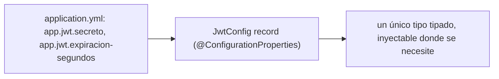
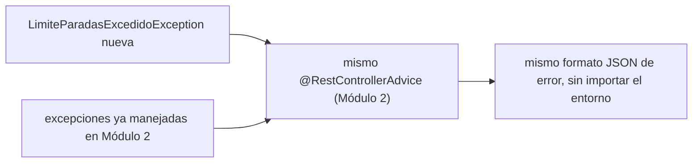

# Módulo 5: Configuración, perfiles y manejo de errores

Cada tema se practica por separado con su propia repetición progresiva y su propio reto de memoria, verificado con `ApplicationContextRunner` y `MockMvc` reales, para que "la aplicación falla al arranque" o "el formato de error es consistente" sean afirmaciones comprobables, no solo descritas.


## Aprende construyendo

### Tema 1: @ConfigurationProperties tipado

#### Paso 1 · Objetivo y preparación

Al finalizar podrás agrupar configuración relacionada en un tipo fuertemente tipado con `@ConfigurationProperties`, y confirmar con un test real que los valores de `application.yml` se enlazan correctamente.

**Conocimiento previo:** Spring Initializr y starters (Módulo 1); `application.yml` vs `application.properties` (Módulo 1).

#### Paso 2 · Contexto y caso real

**¿Por qué es importante?** Una API de entregas cambia URLs, límites y credenciales entre local, pruebas y producción; leer cada valor individual con `@Value("${...}")` disperso en distintas clases dificulta tener una visión centralizada de toda la configuración relacionada con un aspecto específico, como JWT.

#### Paso 3 · Teoría con analogía

**Conceptos clave:** agrupación de configuración relacionada, frente a `@Value` disperso.

`@ConfigurationProperties("app.jwt") @Validated public record JwtConfig(@NotBlank String secreto, @Min(60) long expiracionSegundos) {}` mapea un grupo completo de configuración relacionada (todo bajo el prefijo `app.jwt`) hacia un único tipo fuertemente tipado, en vez de leer cada valor disperso con `@Value` repetido en cada clase que lo necesita. Esta agrupación ofrece verificación de tipos en tiempo de compilación (un valor numérico mal configurado como texto se detecta al mapear) y validación centralizada de todo el grupo en un único lugar.

**Analogía:** `@ConfigurationProperties` es un formulario estructurado con una sección dedicada para cada tema relacionado; `@Value` disperso es anotar valores sueltos en notas adhesivas distribuidas por distintas partes de una oficina, sin ninguna vista centralizada.

**Diagrama:**



#### Paso 4 · Demostración guiada desde cero

Desde una carpeta vacía (o continuando en `academia-spring`, o créala con `mkdir -p academia-spring` si es tu primera vez), genera el proyecto con Spring Initializr real (`web`, `validation`) y crea `src/main/java/com/academia/config/JwtConfig.java`:

```bash
mkdir -p academia-spring/src/main/java/com/academia/config
cd academia-spring
curl -fsSL https://start.spring.io/starter.zip -d dependencies=web,validation -d javaVersion=21 -d artifactId=academia-config -o app.zip
unzip -o app.zip
```

```java
// src/main/java/com/academia/config/JwtConfig.java
package com.academia.config;

import jakarta.validation.constraints.Min;
import jakarta.validation.constraints.NotBlank;
import org.springframework.boot.context.properties.ConfigurationProperties;
import org.springframework.boot.context.properties.EnableConfigurationProperties;
import org.springframework.context.annotation.Configuration;
import org.springframework.validation.annotation.Validated;

@ConfigurationProperties("app.jwt")
@Validated
public record JwtConfig(
    @NotBlank String secreto,
    @Min(60) long expiracionSegundos
) {}
```

```java
// src/main/java/com/academia/config/ConfigActivador.java
package com.academia.config;

import org.springframework.boot.context.properties.EnableConfigurationProperties;
import org.springframework.context.annotation.Configuration;

@Configuration
@EnableConfigurationProperties(JwtConfig.class)
public class ConfigActivador {}
```

```yaml
# src/main/resources/application.yml
app:
  jwt:
    secreto: clave-de-prueba-academia-floci
    expiracion-segundos: 900
```

**Explicación línea por línea:** el `record JwtConfig` agrupa ambos valores bajo el prefijo `app.jwt`; `@NotBlank` y `@Min(60)` declaran las restricciones de validación directamente sobre los componentes del record; `@EnableConfigurationProperties(JwtConfig.class)` registra la clase para que Spring la enlace y valide durante el arranque.

Confirma con `ApplicationContextRunner` (la utilidad real de Spring Boot Test para levantar un contexto mínimo y aislado, sin todo el arranque completo de la aplicación) que los valores de `application.yml` se enlazan correctamente al tipo tipado:

```java
// src/test/java/com/academia/config/JwtConfigTest.java
package com.academia.config;

import org.junit.jupiter.api.Test;
import org.springframework.boot.test.context.runner.ApplicationContextRunner;

import static org.assertj.core.api.Assertions.assertThat;

class JwtConfigTest {

    private final ApplicationContextRunner contextRunner = new ApplicationContextRunner()
        .withUserConfiguration(ConfigActivador.class);

    @Test
    void enlazaLosValoresDeConfiguracionAlTipoTipado() {
        contextRunner
            .withPropertyValues("app.jwt.secreto=clave-real", "app.jwt.expiracion-segundos=900")
            .run(context -> {
                JwtConfig config = context.getBean(JwtConfig.class);
                assertThat(config.secreto()).isEqualTo("clave-real");
                assertThat(config.expiracionSegundos()).isEqualTo(900L);
            });
    }
}
```

```bash
mvn test -Dtest=JwtConfigTest
```

**Resultado esperado:** `BUILD SUCCESS` con el test en verde, confirmando que `ApplicationContextRunner` levantó un contexto real con esas propiedades y `JwtConfig` las enlazó correctamente a un tipo fuertemente tipado, sin ningún `@Value` disperso.

**Fallo deliberado:** cambia `app.jwt.expiracion-segundos=900` por `app.jwt.expiracion-segundos=texto-no-numerico` en el test y ejecuta de nuevo. El `context.getBean(JwtConfig.class)` lanza una excepción real (`context.run(...)` captura el fallo internamente; verifica con `contextRunner.withPropertyValues(...).run(context -> assertThat(context).hasFailed())`) porque Spring no puede convertir ese texto al tipo `long` declarado — diagnostica confirmando que la verificación de tipos ocurre al enlazar la configuración, antes de que ningún código de negocio intente usar ese valor. Revierte el valor antes de continuar.

#### Paso 5 · Práctica guiada — repetición progresiva

1. Agrega un tercer campo al `record` (`boolean modoDebug`) y confirma con el test que también se enlaza correctamente desde `application.yml`.
2. Usa `@NestedConfigurationProperty` para agrupar un sub-objeto anidado dentro de `JwtConfig` (por ejemplo, una configuración de reintentos) y confirma que también se enlaza correctamente.
3. Compara escribir el mismo enlace con `@Value("${app.jwt.secreto}")` y `@Value("${app.jwt.expiracion-segundos}")` disueltos en dos clases distintas, y documenta en una frase qué visión centralizada se pierde frente a `JwtConfig`.
4. Escribe de memoria (sin mirar) un `record` con `@ConfigurationProperties` y dos campos validados, y un test `ApplicationContextRunner` que confirme el enlace correcto.

**Pista:** `ApplicationContextRunner` es más rápido que `@SpringBootTest` para probar configuración aislada porque no levanta toda la aplicación, solo el subconjunto de beans que declares con `withUserConfiguration(...)`.

#### Paso 6 · Práctica independiente

**Completa el código:** rellena el espacio para declarar el prefijo de configuración correcto:

```java
@____("app.jwt")
@Validated
public record JwtConfig(@NotBlank String secreto, @Min(60) long expiracionSegundos) {}
```

**Reto de memoria sin mirar:** cierra este documento y escribe, solo de memoria, un `record` con `@ConfigurationProperties` y validación, y un test `ApplicationContextRunner` que confirme el enlace correcto de sus valores. Compara después contra el patrón del Paso 4.

#### Paso 7 · Cierre y evidencia

Ya agrupas configuración relacionada en un tipo fuertemente tipado y validado, confirmando con un test real que los valores de `application.yml` se enlazan correctamente. El siguiente tema confirma qué ocurre cuando un valor obligatorio falta por completo. **Evidencia:** entrega el resultado de `JwtConfigTest` en verde, y el resultado del fallo deliberado mostrando el contexto fallando ante un tipo incompatible. Fuente oficial: [Spring Boot — Type-safe Configuration Properties](https://docs.spring.io/spring-boot/reference/features/external-config.html#features.external-config.typesafe-configuration-properties).

**Errores comunes:** usar `@Value` disperso en vez de `@ConfigurationProperties` agrupado, perdiendo visión centralizada; olvidar `@EnableConfigurationProperties` o el escaneo de componentes, dejando la clase sin registrar aunque esté bien declarada.

**Cuándo no usarlo:** para un único valor de configuración aislado sin relación con ningún grupo mayor (por ejemplo, un feature flag booleano suelto), un `@Value` simple es más directo que crear un `record` completo solo para ese valor.

`@ConfigurationProperties` tipado es como organizará su configuración el proyecto integrador de este track (microservicio productivo, Módulo 12), sin strings mágicos dispersos.

### Tema 2: Fallar rápido al arranque

#### Paso 1 · Objetivo y preparación

Al finalizar podrás confirmar, con un test real, que la aplicación se niega a arrancar cuando falta un valor de configuración obligatorio, en vez de arrancar con un valor inválido que fallaría más tarde.

**Conocimiento previo:** Tema 1 de este módulo (`@ConfigurationProperties`).

#### Paso 2 · Contexto y caso real

**¿Por qué es importante?** Si `app.jwt.secreto` falta y la aplicación arranca de todas formas, el problema se manifestará mucho más tarde —posiblemente ya en producción bajo tráfico real— cuando algún código intente usar ese valor `null`, en un momento y contexto completamente distinto de donde realmente se originó el problema.

#### Paso 3 · Teoría con analogía

**Conceptos clave:** validación temprana, evitar fallas silenciosas tardías en producción.

Con `@Validated` aplicado a una clase de `@ConfigurationProperties`, si falta un valor marcado `@NotBlank` o `@Min`, la aplicación NO arranca en absoluto: falla inmediatamente durante el arranque con un mensaje claro señalando exactamente qué valor falta o es inválido. Este principio de "fallar rápido" (fail-fast) prioriza detectar el problema en el momento más temprano y controlado posible (el arranque, típicamente supervisado activamente durante un despliegue) en vez de dejar que se manifieste de forma impredecible durante la operación normal.

**Analogía:** fallar rápido al arranque es como que un avión rechace despegar si detecta en la revisión previa en tierra que le falta un componente esencial, en vez de descubrir esa falta a mitad de vuelo, un momento considerablemente más peligroso para resolverlo.

**Diagrama:**

```
┌── sin @Validated ──────────────────────────────────────┐
│  falta app.jwt.secreto → app arranca "bien" →               │
│  falla más tarde en producción (NullPointerException)       │
└──────────────────────────────────────────────────┘
┌── con @Validated ──────────────────────────────────────┐
│  falta app.jwt.secreto → app NO arranca →                    │
│  error claro inmediato, en el momento del despliegue        │
└──────────────────────────────────────────────────┘
```

#### Paso 4 · Demostración guiada desde cero

Reutiliza `academia-spring` (o créalo desde una carpeta vacía con `mkdir -p academia-spring` si es tu primera vez) y crea `src/test/java/com/academia/config/FalloArranqueTest.java`, confirmando con `ApplicationContextRunner` que la ausencia del valor obligatorio impide el arranque:

```bash
mkdir -p academia-spring/src/test/java/com/academia/config
cd academia-spring
```

```java
// src/test/java/com/academia/config/FalloArranqueTest.java
package com.academia.config;

import org.junit.jupiter.api.Test;
import org.springframework.boot.context.properties.bind.validation.BindValidationException;
import org.springframework.boot.test.context.runner.ApplicationContextRunner;

import static org.assertj.core.api.Assertions.assertThat;

class FalloArranqueTest {

    private final ApplicationContextRunner contextRunner = new ApplicationContextRunner()
        .withUserConfiguration(ConfigActivador.class);

    @Test
    void sinElValorObligatorioElContextoNoArranca() {
        contextRunner
            .withPropertyValues("app.jwt.expiracion-segundos=900") // falta app.jwt.secreto a propósito
            .run(context -> {
                assertThat(context).hasFailed();
                assertThat(context.getStartupFailure())
                    .hasRootCauseInstanceOf(BindValidationException.class);
            });
    }

    @Test
    void conTodosLosValoresObligatoriosElContextoArrancaCorrectamente() {
        contextRunner
            .withPropertyValues("app.jwt.secreto=clave-real", "app.jwt.expiracion-segundos=900")
            .run(context -> assertThat(context).hasNotFailed());
    }
}
```

```bash
mvn test -Dtest=FalloArranqueTest
```

**Resultado esperado:** ambos tests pasan: sin `app.jwt.secreto`, el contexto falla al arrancar con una causa raíz `BindValidationException` (la excepción real que Spring lanza cuando `@Validated` rechaza un valor); con todos los valores obligatorios presentes, el contexto arranca sin fallos — la diferencia medida directamente sobre el resultado real del arranque, no sobre una suposición.

**Fallo deliberado:** quita temporalmente `@Validated` de `JwtConfig` (dejando solo `@ConfigurationProperties`) y ejecuta de nuevo `sinElValorObligatorioElContextoNoArranca`. El test FALLA porque ahora `assertThat(context).hasFailed()` es falso: el contexto arranca "exitosamente" con `secreto = null`, exactamente el escenario peligroso que este Tema previene — diagnostica confirmando que `@Validated` es la línea específica de código responsable de convertir un valor faltante en un fallo de arranque inmediato, en vez de un `null` silencioso que fallaría más tarde en un lugar distinto. Revierte `@Validated` antes de continuar.

#### Paso 5 · Práctica guiada — repetición progresiva

1. Agrega un tercer test que confirme que un valor de `expiracion-segundos` menor a `60` (violando `@Min(60)`) también hace fallar el arranque, con el mismo tipo de causa raíz.
2. Lee el mensaje completo de `context.getStartupFailure().getMessage()` en un test y confirma que menciona explícitamente el nombre de la propiedad problemática.
3. Agrega una segunda clase `@ConfigurationProperties` con su propia validación, y confirma que un valor inválido en CUALQUIERA de las dos hace fallar el arranque completo del contexto, no solo el de la clase afectada.
4. Escribe de memoria (sin mirar) un test `ApplicationContextRunner` que confirme `hasFailed()` con una causa raíz `BindValidationException` ante un valor de configuración faltante. Compara después contra el patrón del Paso 4.

**Pista:** `context.getStartupFailure()` devuelve la excepción completa con toda la cadena de causas; `hasRootCauseInstanceOf(...)` navega hasta la causa más profunda, que es normalmente la más específica y útil para diagnosticar.

#### Paso 6 · Práctica independiente

**Completa el código:** rellena el espacio para confirmar que el contexto falló al arrancar:

```java
contextRunner.withPropertyValues("app.jwt.expiracion-segundos=900")
    .run(context -> assertThat(context).____());
```

**Reto de memoria sin mirar:** cierra este documento y escribe, solo de memoria, dos tests `ApplicationContextRunner`: uno que confirme el fallo de arranque ante un valor faltante, y otro que confirme el arranque exitoso con todos los valores presentes. Compara después contra el patrón del Paso 4.

#### Paso 7 · Cierre y evidencia

Ya confirmas con un test real que un valor de configuración obligatorio faltante impide el arranque completo de la aplicación, en vez de dejarla arrancar con un valor inválido. El siguiente tema aborda cómo comunicar de forma consistente los errores que sí ocurren durante la operación normal, ya con la aplicación arrancada. **Evidencia:** entrega el resultado de ambos tests de `FalloArranqueTest` en verde, y el resultado del fallo deliberado mostrando el arranque "exitoso" indebido al quitar `@Validated`. Fuente oficial: [Spring Boot — Testing auto-configuration](https://docs.spring.io/spring-boot/reference/testing/spring-boot-applications.html#testing.spring-boot-applications.testing-auto-configuration).

**Errores comunes:** omitir `@Validated` en la clase de configuración, dejando que un valor faltante pase desapercibido hasta usarse en producción; definir valores por defecto inseguros para propiedades que deberían ser explícitamente obligatorias, como secretos o credenciales.

**Cuándo no usarlo:** para un valor de configuración genuinamente opcional con un valor por defecto seguro y razonable (por ejemplo, un tamaño de página de paginación), forzar validación obligatoria sin un valor por defecto sería innecesariamente rígido; reserva `@NotBlank`/`@Min` sin default para valores donde no existe un valor por defecto seguro.

Fallar rápido al arranque es la estrategia que adoptará el proyecto integrador de este track (microservicio productivo, Módulo 12) para no desplegar con configuración inválida.

### Tema 3: Manejo global de excepciones consistente entre entornos

#### Paso 1 · Objetivo y preparación

Al finalizar podrás extender el manejo global de excepciones (Módulo 2) para una nueva excepción de negocio, confirmando con `MockMvc` real que el formato de error permanece consistente.

**Conocimiento previo:** `@ControllerAdvice` y `ResponseEntity` (Módulo 2); Temas 1-2 de este módulo.

#### Paso 2 · Contexto y caso real

**¿Por qué es importante?** Cada nueva regla de negocio que puede fallar (por ejemplo, exceder el límite de paradas por ruta) necesita comunicar el error al cliente de la API en el MISMO formato que cualquier otro error ya manejado, sin que el consumidor de la API tenga que aprender un formato distinto por cada tipo de excepción nueva.

#### Paso 3 · Teoría con analogía

**Conceptos clave:** el mismo `@RestControllerAdvice` extendido, formato uniforme sin importar el entorno.

El manejo global de excepciones, ya cubierto en el Módulo 2 con `@RestControllerAdvice`, se extiende naturalmente para mapear cualquier excepción de negocio adicional hacia una respuesta HTTP consistente, en el mismo lugar centralizado, garantizando que el formato de error permanezca exactamente el mismo sin importar el entorno (desarrollo, pruebas, producción) ni qué endpoint originó el error. Combinar esto con la configuración tipada y validada de los Temas 1-2 produce una aplicación robusta en su conjunto: los problemas de configuración se detectan al arranque, y los errores de negocio que sí ocurren durante la operación se comunican de forma predecible.

**Analogía:** extender el manejo global de excepciones es ampliar el mismo protocolo unificado de atención de incidencias de una empresa para cubrir cada nuevo tipo de incidencia, en vez de crear un protocolo distinto para cada problema nuevo que aparece.

**Diagrama:**



#### Paso 4 · Demostración guiada desde cero

Reutiliza `academia-spring` (o créalo desde una carpeta vacía con `mkdir -p academia-spring` si es tu primera vez) y crea la excepción de negocio y su mapeo en `src/main/java/com/academia/errores/`:

```bash
mkdir -p academia-spring/src/main/java/com/academia/errores
cd academia-spring
```

```java
// src/main/java/com/academia/errores/LimiteParadasExcedidoException.java
package com.academia.errores;

public class LimiteParadasExcedidoException extends RuntimeException {
    public LimiteParadasExcedidoException(int limite) {
        super("El límite de " + limite + " paradas por ruta fue excedido");
    }
}
```

```java
// src/main/java/com/academia/errores/ManejadorGlobalErrores.java
package com.academia.errores;

import org.springframework.http.HttpStatus;
import org.springframework.http.ProblemDetail;
import org.springframework.web.bind.annotation.ExceptionHandler;
import org.springframework.web.bind.annotation.RestControllerAdvice;

@RestControllerAdvice
public class ManejadorGlobalErrores {

    @ExceptionHandler(LimiteParadasExcedidoException.class)
    public ProblemDetail manejarLimiteExcedido(LimiteParadasExcedidoException ex) {
        ProblemDetail problema = ProblemDetail.forStatusAndDetail(HttpStatus.UNPROCESSABLE_ENTITY, ex.getMessage());
        problema.setTitle("Límite de paradas excedido");
        return problema;
    }
}
```

```java
// src/main/java/com/academia/errores/RutasController.java
package com.academia.errores;

import org.springframework.web.bind.annotation.PostMapping;
import org.springframework.web.bind.annotation.RequestParam;
import org.springframework.web.bind.annotation.RestController;

@RestController
public class RutasController {
    private static final int LIMITE_PARADAS = 20;

    @PostMapping("/api/rutas")
    public String crearRuta(@RequestParam int numeroDeParadas) {
        if (numeroDeParadas > LIMITE_PARADAS) throw new LimiteParadasExcedidoException(LIMITE_PARADAS);
        return "ruta creada con " + numeroDeParadas + " paradas";
    }
}
```

**Explicación línea por línea:** `LimiteParadasExcedidoException` es una excepción de negocio específica del dominio; `@ExceptionHandler(LimiteParadasExcedidoException.class)` en el MISMO `@RestControllerAdvice` que ya manejaría otras excepciones (Módulo 2) la mapea a `422 Unprocessable Entity` usando `ProblemDetail` (el formato estándar RFC 7807, el mismo formato que cualquier otro error de esta API); el controller lanza la excepción cuando la regla de negocio se viola, sin necesidad de construir la respuesta de error manualmente en cada endpoint.

Confirma con `MockMvc` real que la excepción se traduce al formato `ProblemDetail` esperado, con el mismo `Content-Type` estándar que cualquier otro error de la API:

```java
// src/test/java/com/academia/errores/ManejadorGlobalErroresTest.java
package com.academia.errores;

import org.junit.jupiter.api.Test;
import org.springframework.beans.factory.annotation.Autowired;
import org.springframework.boot.test.autoconfigure.web.servlet.AutoConfigureMockMvc;
import org.springframework.boot.test.context.SpringBootTest;
import org.springframework.test.web.servlet.MockMvc;

import static org.springframework.test.web.servlet.request.MockMvcRequestBuilders.post;
import static org.springframework.test.web.servlet.result.MockMvcResultMatchers.*;

@SpringBootTest
@AutoConfigureMockMvc
class ManejadorGlobalErroresTest {

    @Autowired
    private MockMvc mockMvc;

    @Test
    void excederElLimiteDeParadasDevuelveProblemDetailConsistente() throws Exception {
        mockMvc.perform(post("/api/rutas").param("numeroDeParadas", "25"))
            .andExpect(status().isUnprocessableEntity())
            .andExpect(content().contentTypeCompatibleWith("application/problem+json"))
            .andExpect(jsonPath("$.title").value("Límite de paradas excedido"))
            .andExpect(jsonPath("$.status").value(422));
    }

    @Test
    void dentroDelLimiteCreaLaRutaCorrectamente() throws Exception {
        mockMvc.perform(post("/api/rutas").param("numeroDeParadas", "10"))
            .andExpect(status().isOk());
    }
}
```

```bash
mvn test -Dtest=ManejadorGlobalErroresTest
```

**Resultado esperado:** ambos tests pasan: exceder el límite devuelve `422` con el formato `application/problem+json` estándar (el mismo formato RFC 7807 usado por cualquier otro error ya manejado en el Módulo 2), y una petición dentro del límite responde `200` normalmente.

**Fallo deliberado:** en `RutasController`, reemplaza `throw new LimiteParadasExcedidoException(LIMITE_PARADAS)` por una respuesta manual de error construida directamente en el método (`return "ERROR: límite excedido"`, con `200 OK` por defecto en vez de un código de error). Ejecuta de nuevo `excederElLimiteDeParadasDevuelveProblemDetailConsistente` — el test FALLA porque `status().isUnprocessableEntity()` no coincide con el `200` real devuelto — diagnostica confirmando por qué construir respuestas de error manualmente dentro de cada endpoint, en vez de lanzar una excepción de negocio hacia el manejador centralizado, produce inconsistencias reales y detectables: un cliente que espera `422` con `ProblemDetail` recibiría un `200` con un texto plano no estructurado. Revierte el cambio antes de continuar.

#### Paso 5 · Práctica guiada — repetición progresiva

1. Agrega una segunda excepción de negocio distinta al mismo `@RestControllerAdvice` y confirma con un test que ambas producen el mismo formato `application/problem+json`, solo con `title`/`detail` distintos.
2. Agrega un campo adicional al `ProblemDetail` (`problema.setProperty("limite", LIMITE_PARADAS)`) y confirma con `jsonPath("$.limite")` que aparece en la respuesta.
3. Provoca el error con un valor límite exacto (`numeroDeParadas=20`, igual al límite, no mayor) y confirma si la condición actual (`>`) lo acepta o lo rechaza; decide si ese es el comportamiento correcto según el enunciado "el límite es 20".
4. Escribe de memoria (sin mirar) una excepción de negocio, su mapeo en `@RestControllerAdvice` a `ProblemDetail`, y un test `MockMvc` que confirme el código de estado y el `title`. Compara después contra el patrón del Paso 4.

**Pista:** `content().contentTypeCompatibleWith("application/problem+json")` es más robusto que comparar el string exacto del `Content-Type`, porque tolera parámetros adicionales como el charset que Spring puede agregar automáticamente.

#### Paso 6 · Práctica independiente

**Completa el código:** rellena el espacio para mapear la excepción a una respuesta HTTP:

```java
@____(LimiteParadasExcedidoException.class)
public ProblemDetail manejarLimiteExcedido(LimiteParadasExcedidoException ex) {
    return ProblemDetail.forStatusAndDetail(HttpStatus.UNPROCESSABLE_ENTITY, ex.getMessage());
}
```

**Reto de memoria sin mirar:** cierra este documento y escribe, solo de memoria, una excepción de negocio mapeada a `ProblemDetail` en un `@RestControllerAdvice`, y un test `MockMvc` que confirme el código de estado y el formato de la respuesta. Compara después contra el patrón del Paso 4.

#### Paso 7 · Cierre y evidencia

Ya extiendes el manejo centralizado de excepciones para una nueva regla de negocio, confirmando con `MockMvc` real que el formato de error permanece consistente sin importar qué endpoint lo originó. Esto cierra el módulo de configuración y manejo de errores; el siguiente módulo aborda cómo probar la aplicación completa de forma automatizada. **Evidencia:** entrega el resultado de ambos tests de `ManejadorGlobalErroresTest` en verde, y el resultado del fallo deliberado mostrando la inconsistencia de un `200` donde se esperaba `422`. Fuente oficial: [Spring — Error Handling for REST with ProblemDetail](https://docs.spring.io/spring-framework/reference/web/webmvc/mvc-ann-rest-exceptions.html).

**Errores comunes:** construir respuestas de error manualmente dentro de un endpoint específico en vez de lanzar una excepción hacia el manejador centralizado; crear un `@ControllerAdvice` nuevo y separado para cada excepción, en vez de extender el mismo existente.

**Cuándo no usarlo:** para un error verdaderamente específico de un único endpoint sin ninguna posibilidad de reutilización en otro lugar de la aplicación, manejarlo directamente en el método del controller sin pasar por el mecanismo global puede ser aceptable; reserva el `@RestControllerAdvice` centralizado para excepciones de negocio con sentido a nivel de aplicación.

---

El manejo global de excepciones de este tema es el que mantendrá consistente el proyecto integrador de este track (microservicio productivo, Módulo 12) entre entornos.

## Laboratorio práctico

**Objetivo del laboratorio:** configurar propiedades tipadas y validadas al arranque, sin valores hardcodeados.

**Requisitos previos:** Módulos 0-4 completados.

| Paso | Acción | Código | Explicación |
|---|---|---|---|
| 1 | Crear una clase `@ConfigurationProperties` | Ver Tema 1 | Con valores tipados desde `application.yml` |
| 2 | Agregar `@Validated` | Ver Tema 2 | Falla al arranque si falta un valor obligatorio |
| 3 | Provocar la falla intencionalmente | Ver Tema 2 | Confirmado con `ApplicationContextRunner` real |
| 4 | Centralizar una excepción de negocio adicional | Ver Tema 3 | Mismo formato `ProblemDetail` consistente |

**Verificación:** el laboratorio se considera exitoso si borrar un valor de configuración obligatorio impide que la aplicación arranque, con `BindValidationException` como causa raíz real, y si todos los errores de negocio devuelven el mismo formato `application/problem+json` consistente.

**Errores comunes y soluciones**

- **Usar `@Value` disperso en vez de `@ConfigurationProperties` agrupado.** Agrupa configuración relacionada en un único tipo tipado.
- **Omitir `@Validated` en la clase de configuración.** Sin ella, un valor faltante puede pasar desapercibido hasta usarse en producción.
- **Crear un nuevo `@ControllerAdvice` separado para cada nueva excepción.** Extiende el mismo `@ControllerAdvice` centralizado existente.

---
