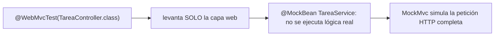
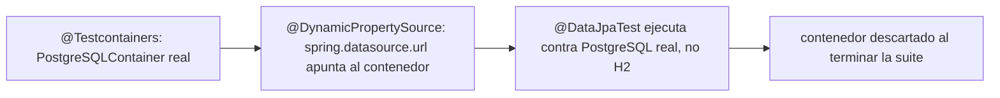

# Módulo 6: Testing en Spring Boot

Cada tema se practica por separado con su propia repetición progresiva y su propio reto de memoria, verificado con `mvn test` real contra cada nivel de la pirámide de tests, para que "un slice es más rápido que el contexto completo" sea una afirmación medible, no solo descrita.


## Aprende construyendo

### Tema 1: Slices de testing — @WebMvcTest

#### Paso 1 · Objetivo y preparación

Al finalizar podrás probar la capa web de un controller con `@WebMvcTest`, mockeando el servicio inyectado, y explicar por qué este slice arranca más rápido que el contexto completo de la aplicación.

**Conocimiento previo:** `@RestController` y `ResponseEntity` (Módulo 2); DTOs vs entities (Módulo 2).

#### Paso 2 · Contexto y caso real

**¿Por qué es importante?** Una API de entregas necesita detectar rápido si el problema está en el controller (mapeo de rutas, serialización JSON, validación) sin necesitar que la base de datos real ni el servicio de negocio completo estén disponibles para esa prueba específica.

#### Paso 3 · Teoría con analogía

**Conceptos clave:** contexto parcial, más rápido que el contexto completo.

`@WebMvcTest(TareaController.class)` levanta únicamente el contexto necesario para probar la capa web (el controller, sus filtros, la infraestructura de serialización JSON), mockeando automáticamente cualquier otra capa (`@MockBean TareaService servicio`), en vez de levantar la aplicación completa con persistencia y configuración real. Esta carga parcial ("slice", en la terminología de Spring Boot Test) arranca considerablemente más rápido que el contexto completo, un factor relevante cuando la suite crece a cientos de pruebas.

**Analogía:** `@WebMvcTest` es poner a prueba únicamente la recepción de un edificio, verificando que recibe correctamente a los visitantes y los dirige apropiadamente, sin necesidad de que el resto del edificio esté operativo, usando actores de reparto (mocks) en lugar del personal real de esos departamentos.

**Diagrama:**



#### Paso 4 · Demostración guiada desde cero

Desde una carpeta vacía (o continuando en `academia-spring`, o créala con `mkdir -p academia-spring` si es tu primera vez), genera el proyecto con Spring Initializr real (`web`) y crea el controller junto con su test de slice en `src/main/java` y `src/test/java`:

```bash
mkdir -p academia-spring/src/main/java/com/academia/tarea
cd academia-spring
curl -fsSL https://start.spring.io/starter.zip -d dependencies=web -d javaVersion=21 -d artifactId=academia-testing -o app.zip
unzip -o app.zip
```

```java
// src/main/java/com/academia/tarea/TareaController.java
package com.academia.tarea;

import org.springframework.http.HttpStatus;
import org.springframework.http.ResponseEntity;
import org.springframework.web.bind.annotation.*;

@RestController
@RequestMapping("/api/tareas")
public class TareaController {
    private final TareaService servicio;

    public TareaController(TareaService servicio) { this.servicio = servicio; }

    @PostMapping
    public ResponseEntity<String> crear(@RequestBody String titulo) {
        String id = servicio.crear(titulo);
        return ResponseEntity.status(HttpStatus.CREATED).body(id);
    }
}
```

```java
// src/main/java/com/academia/tarea/TareaService.java
package com.academia.tarea;

import org.springframework.stereotype.Service;

@Service
public class TareaService {
    public String crear(String titulo) {
        // en la app real, guardaría en la base de datos; el test de slice mockea esto por completo
        throw new UnsupportedOperationException("no implementado aún en este tema");
    }
}
```

**Explicación línea por línea:** `TareaController` depende de `TareaService` por inyección de constructor; en producción, `TareaService.crear` guardaría en la base de datos, pero el test de slice de este Tema jamás ejecuta esa implementación real, porque la reemplaza completamente con un mock.

Escribe el test de slice real que mockea `TareaService` y verifica únicamente el comportamiento de la capa web:

```java
// src/test/java/com/academia/tarea/TareaControllerTest.java
package com.academia.tarea;

import org.junit.jupiter.api.Test;
import org.springframework.beans.factory.annotation.Autowired;
import org.springframework.boot.test.autoconfigure.web.servlet.WebMvcTest;
import org.springframework.boot.test.mock.mockito.MockBean;
import org.springframework.http.MediaType;
import org.springframework.test.web.servlet.MockMvc;

import static org.mockito.Mockito.when;
import static org.springframework.test.web.servlet.request.MockMvcRequestBuilders.post;
import static org.springframework.test.web.servlet.result.MockMvcResultMatchers.*;

@WebMvcTest(TareaController.class) // solo levanta la capa web, mockea el resto
class TareaControllerTest {

    @Autowired
    private MockMvc mockMvc;
    @MockBean
    private TareaService servicio;

    @Test
    void creaUnaTareaYDevuelve201() throws Exception {
        when(servicio.crear("Comprar leche")).thenReturn("tarea-123");

        mockMvc.perform(post("/api/tareas")
                .contentType(MediaType.APPLICATION_JSON)
                .content("\"Comprar leche\""))
            .andExpect(status().isCreated())
            .andExpect(content().string("tarea-123"));
    }
}
```

```bash
mvn test -Dtest=TareaControllerTest
```

**Resultado esperado:** `BUILD SUCCESS` con el test en verde en una fracción del tiempo que tomaría un `@SpringBootTest` completo (arranca solo el controller y su infraestructura web), confirmando `201 Created` y el cuerpo esperado — sin que `TareaService.crear` real (que lanzaría `UnsupportedOperationException`) llegue a ejecutarse nunca, porque `@MockBean` la reemplazó completamente.

**Fallo deliberado:** elimina la anotación `@MockBean` de `servicio` (dejando el campo sin anotar) y ejecuta de nuevo `mvn test -Dtest=TareaControllerTest`. El test FALLA porque Spring no puede resolver la dependencia `TareaService` dentro del contexto parcial de `@WebMvcTest` (que no escanea `@Service` por diseño): `NoSuchBeanDefinitionException` — diagnostica confirmando que `@MockBean` no es solo una conveniencia, sino el mecanismo específico que hace posible que un slice de solo la capa web pueda satisfacer las dependencias del controller sin levantar la aplicación completa. Revierte el cambio antes de continuar.

#### Paso 5 · Práctica guiada — repetición progresiva

1. Agrega un segundo test que confirme un `400 Bad Request` cuando el cuerpo de la petición está vacío, usando `when(servicio.crear("")).thenThrow(new IllegalArgumentException())` junto con un `@ExceptionHandler` que lo mapee.
2. Mide el tiempo real de ejecución de `TareaControllerTest` (`mvn test -Dtest=TareaControllerTest` reporta el tiempo) y compáralo mentalmente con lo que esperarías de un `@SpringBootTest` completo (Tema 3).
3. Agrega un segundo endpoint al controller y su test de slice correspondiente, confirmando que ambos tests siguen ejecutándose sin necesitar base de datos ni configuración adicional.
4. Escribe de memoria (sin mirar) un `@WebMvcTest` con `@MockBean` para un servicio, y un test que confirme un código de estado usando `when(...).thenReturn(...)`.

**Pista:** si un test de `@WebMvcTest` falla con `NoSuchBeanDefinitionException`, la causa casi siempre es una dependencia del controller que no está mockeada con `@MockBean`.

#### Paso 6 · Práctica independiente

**Completa el código:** rellena el espacio para levantar únicamente el contexto de la capa web:

```java
@____(TareaController.class)
class TareaControllerTest {
    @Autowired MockMvc mockMvc;
    @MockBean TareaService servicio;
}
```

**Reto de memoria sin mirar:** cierra este documento y escribe, solo de memoria, un test `@WebMvcTest` con un servicio mockeado y una aserción sobre el código de estado HTTP. Compara después contra el patrón del Paso 4.

#### Paso 7 · Cierre y evidencia

Ya pruebas la capa web de forma aislada y rápida con `@WebMvcTest`, confirmando con `MockMvc` real el comportamiento del controller sin depender de la lógica de negocio real. El siguiente tema aborda cómo probar la capa de persistencia contra una base de datos real, no aproximada. **Evidencia:** entrega el resultado de `TareaControllerTest` en verde, y el error real `NoSuchBeanDefinitionException` que produce el fallo deliberado. Fuente oficial: [Spring Boot — Testing the Web Layer](https://docs.spring.io/spring-boot/reference/testing/spring-boot-applications.html#testing.spring-boot-applications.spring-mvc-tests).

**Errores comunes:** cargar el contexto completo (`@SpringBootTest`) para probar lógica que un slice más rápido cubriría igual de bien; olvidar `@MockBean` para una dependencia del controller, causando `NoSuchBeanDefinitionException`.

**Cuándo no usarlo:** para verificar que múltiples capas reales (controller, servicio, repositorio, base de datos) funcionan correctamente juntas de principio a fin, un slice de solo la capa web no es suficiente; ese es el propósito de `@SpringBootTest` (Tema 3).

### Tema 2: @DataJpaTest con Testcontainers

#### Paso 1 · Objetivo y preparación

Al finalizar podrás probar un repositorio contra una base de datos PostgreSQL real y desechable con Testcontainers, y explicar por qué es preferible a H2 en memoria para fidelidad de comportamiento.

**Conocimiento previo:** Tema 1 de este módulo; entidades y repositorios (Módulo 3).

#### Paso 2 · Contexto y caso real

**¿Por qué es importante?** H2 puede comportarse de forma sutilmente distinta a PostgreSQL en aspectos específicos del dialecto SQL o tipos de datos particulares, produciendo pruebas que pasan contra H2 pero fallarían contra la base de datos real usada en producción.

#### Paso 3 · Teoría con analogía

**Conceptos clave:** base de datos real desechable, comportamiento fiel frente a H2 en memoria.

`@DataJpaTest @Testcontainers class TareaRepositoryTest { @Container static PostgreSQLContainer<?> postgres = new PostgreSQLContainer<>("postgres:16"); @DynamicPropertySource static void propiedades(DynamicPropertyRegistry registry) { registry.add("spring.datasource.url", postgres::getJdbcUrl); } }` levanta un contenedor Docker real de PostgreSQL específicamente para la suite, configurando dinámicamente la URL de conexión hacia ese contenedor efímero, descartado al finalizar. Esto elimina la discrepancia de comportamiento que H2 podría introducir, a costa de un tiempo de arranque algo mayor.

**Analogía:** usar H2 para probar código diseñado para PostgreSQL es ensayar una obra de teatro en un escenario con dimensiones y acústica distintas a las del teatro real; Testcontainers es ensayar directamente en una réplica exacta y desechable del teatro real.

**Diagrama:**



#### Paso 4 · Demostración guiada desde cero

Reutiliza `academia-spring` (o créalo desde una carpeta vacía con `mkdir -p academia-spring` si es tu primera vez), agrega las dependencias reales `org.testcontainers:postgresql` y `org.testcontainers:junit-jupiter`, y crea el test de repositorio en `src/test/java/com/academia/tarea/`:

```bash
mkdir -p academia-spring/src/test/java/com/academia/tarea
cd academia-spring
```

```java
// src/main/java/com/academia/tarea/Tarea.java
package com.academia.tarea;

import jakarta.persistence.Entity;
import jakarta.persistence.GeneratedValue;
import jakarta.persistence.Id;

@Entity
public class Tarea {
    @Id @GeneratedValue
    private Long id;
    private String titulo;

    protected Tarea() {}
    public Tarea(String titulo) { this.titulo = titulo; }
    public Long getId() { return id; }
    public String getTitulo() { return titulo; }
}
```

```java
// src/test/java/com/academia/tarea/TareaRepositoryTestcontainersTest.java
package com.academia.tarea;

import org.junit.jupiter.api.Test;
import org.springframework.beans.factory.annotation.Autowired;
import org.springframework.boot.test.autoconfigure.orm.jpa.DataJpaTest;
import org.springframework.test.context.DynamicPropertyRegistry;
import org.springframework.test.context.DynamicPropertySource;
import org.testcontainers.containers.PostgreSQLContainer;
import org.testcontainers.junit.jupiter.Container;
import org.testcontainers.junit.jupiter.Testcontainers;

import static org.assertj.core.api.Assertions.assertThat;

@DataJpaTest
@Testcontainers
class TareaRepositoryTestcontainersTest {

    @Container
    static PostgreSQLContainer<?> postgres = new PostgreSQLContainer<>("postgres:16");

    @DynamicPropertySource
    static void propiedades(DynamicPropertyRegistry registry) {
        registry.add("spring.datasource.url", postgres::getJdbcUrl);
        registry.add("spring.datasource.username", postgres::getUsername);
        registry.add("spring.datasource.password", postgres::getPassword);
    }

    @Autowired
    private TareaRepository tareaRepository;

    @Test
    void guardaYLeeUnaTareaContraPostgreSQLReal() {
        Tarea guardada = tareaRepository.save(new Tarea("Comprar leche"));

        Tarea leida = tareaRepository.findById(guardada.getId()).orElseThrow();

        assertThat(leida.getTitulo()).isEqualTo("Comprar leche");
    }
}
```

**Explicación línea por línea:** `@Container static PostgreSQLContainer<?> postgres` declara el contenedor real, gestionado automáticamente por Testcontainers (arranca antes de la suite, se descarta después); `@DynamicPropertySource` inyecta la URL, usuario y contraseña REALES del contenedor recién levantado (asignados dinámicamente por Docker) en las propiedades de Spring antes de que el contexto de la aplicación arranque; el test en sí (`guardaYLeeUnaTareaContraPostgreSQLReal`) es idéntico a como se vería contra cualquier otra base de datos, pero ahora ejecuta contra PostgreSQL genuino.

```bash
# requiere Docker corriendo localmente; Testcontainers lo usa para levantar el contenedor real
mvn test -Dtest=TareaRepositoryTestcontainersTest
```

**Resultado esperado:** `BUILD SUCCESS` con el test en verde, confirmando que Testcontainers levantó un contenedor PostgreSQL real, Spring se conectó a él dinámicamente, y la fila guardada se lee correctamente — el mismo motor de base de datos que correría en producción, no una aproximación.

**Fallo deliberado:** cambia la imagen del contenedor a una versión de PostgreSQL con un tipo de columna incompatible: agrega a `Tarea` un campo `private java.util.UUID identificadorExterno;` sin ninguna conversión, y fuerza una query nativa que use una función específica de PostgreSQL no soportada por H2 (por ejemplo, `@Query(value = "SELECT gen_random_uuid()", nativeQuery = true)`). Ejecuta el mismo test contra H2 en memoria (cambiando temporalmente la dependencia a H2 sin Testcontainers) y compara: la función `gen_random_uuid()` falla contra H2 con un error de función desconocida, mientras que contra el contenedor PostgreSQL real de este Tema funciona correctamente — diagnostica confirmando exactamente el riesgo que Testcontainers elimina: una función específica del dialecto SQL real que H2 no reproduce fielmente. Revierte los cambios de prueba antes de continuar.

#### Paso 5 · Práctica guiada — repetición progresiva

1. Agrega un segundo test en la misma clase que confirme un método derivado (`findByTituloContaining`) contra el mismo contenedor PostgreSQL, reutilizando el contenedor ya levantado (el campo `static` lo comparte entre tests de la misma clase).
2. Cambia la versión de la imagen (`postgres:16` a `postgres:15`) y confirma que el mismo test sigue pasando, ilustrando que Testcontainers facilita probar contra distintas versiones reales.
3. Agrega `@Sql("/datos-iniciales.sql")` para poblar datos antes del test y confirma que el repositorio los lee correctamente desde el contenedor real.
4. Escribe de memoria (sin mirar) un `@DataJpaTest @Testcontainers` con `@Container` y `@DynamicPropertySource`, y un test que confirme guardar y leer una entidad. Compara después contra el patrón del Paso 4.

**Pista:** el campo `@Container` debe ser `static` para que Testcontainers lo comparta entre todos los tests de la misma clase, evitando levantar un contenedor nuevo por cada método de test individual.

#### Paso 6 · Práctica independiente

**Completa el código:** rellena el espacio para inyectar la URL real del contenedor en la configuración de Spring:

```java
@____
static void propiedades(DynamicPropertyRegistry registry) {
    registry.add("spring.datasource.url", postgres::getJdbcUrl);
}
```

**Reto de memoria sin mirar:** cierra este documento y escribe, solo de memoria, un test `@DataJpaTest @Testcontainers` con un `PostgreSQLContainer` real y una aserción sobre una entidad guardada y leída. Compara después contra el patrón del Paso 4.

#### Paso 7 · Cierre y evidencia

Ya pruebas la capa de persistencia contra una base de datos real y desechable, en vez de una aproximación que podría comportarse distinto en producción. El siguiente y último tema de este módulo aborda cuándo vale la pena pagar el costo del contexto completo. **Evidencia:** entrega el resultado de `TareaRepositoryTestcontainersTest` en verde, y la comparación mostrando que una función específica de PostgreSQL falla contra H2 pero funciona contra el contenedor real. Fuente oficial: [Testcontainers — Spring Boot integration](https://java.testcontainers.org/modules/databases/postgres/).

**Errores comunes:** confiar en H2 en memoria para verificar comportamiento específico de PostgreSQL; no declarar el contenedor como `static`, levantando uno nuevo innecesariamente por cada método de test, incrementando el tiempo total de la suite.

**Cuándo no usarlo:** para lógica de repositorio genuinamente independiente del motor de base de datos específico (queries triviales sin funciones propietarias), H2 en memoria puede seguir siendo aceptable por su velocidad; reserva Testcontainers para cuando la fidelidad al motor real importa.

### Tema 3: @SpringBootTest completo y estrategia de pirámide de tests

#### Paso 1 · Objetivo y preparación

Al finalizar podrás escribir un test end-to-end con `@SpringBootTest` que ejercita controller, servicio y repositorio reales juntos, y explicar por qué debe reservarse para pocos flujos verdaderamente críticos.

**Conocimiento previo:** Temas 1 y 2 de este módulo.

#### Paso 2 · Contexto y caso real

**¿Por qué es importante?** Un flujo crítico de negocio (crear una tarea y confirmar que aparece en la lista de pendientes) involucra el controller, el servicio y el repositorio trabajando juntos; los tests de slice de los Temas 1 y 2 verifican cada capa por separado, pero ninguno confirma que las tres funcionen correctamente coordinadas.

#### Paso 3 · Teoría con analogía

**Conceptos clave:** contexto completo, muchos unitarios/pocos de integración completa.

`@SpringBootTest` levanta absolutamente todo el contexto de la aplicación, incluyendo todas las capas reales configuradas como en producción, apropiado para tests end-to-end que verifican un flujo completo a través de múltiples capas reales interactuando entre sí, pero siendo el nivel más lento de arrancar de los tres disponibles (unitarios con Mockito puro, slices como `@WebMvcTest`/`@DataJpaTest`, y `@SpringBootTest` completo). La estrategia recomendada balancea los tres niveles: muchos tests unitarios rápidos, algunos de slice, y pocos `@SpringBootTest` reservados para los flujos más críticos.

**Analogía:** esta estrategia de pirámide de tests es un proceso de control de calidad con muchas verificaciones rápidas de piezas sueltas (unitarios), algunas verificaciones de subsistemas completos (slices), y pocas pero exhaustivas pruebas del producto ensamblado completo (`@SpringBootTest`).

**Diagrama:**

```
┌── pocos: @SpringBootTest completo ──────────────────────┐
│  contexto total, para flujos end-to-end críticos            │
└──────────────────┬───────────────────────────┘
┌── algunos: tests de slice (@WebMvcTest, @DataJpaTest) ─┐
│  contexto parcial, una capa a la vez                       │
└──────────────────┬───────────────────────────┘
┌── muchos: tests unitarios con Mockito puro ─────────────┐
│  sin contexto de Spring — los más rápidos de todos           │
└─────────────────────────────────────────────────┘
```

#### Paso 4 · Demostración guiada desde cero

Reutiliza `academia-spring` (o créalo desde una carpeta vacía con `mkdir -p academia-spring` si es tu primera vez) y completa `TareaService` real (sin mockear nada esta vez), creando el test end-to-end en `src/test/java/com/academia/tarea/`:

```bash
mkdir -p academia-spring/src/test/java/com/academia/tarea
cd academia-spring
```

```java
// src/main/java/com/academia/tarea/TareaService.java (reemplaza la versión del Tema 1)
package com.academia.tarea;

import org.springframework.stereotype.Service;

@Service
public class TareaService {
    private final TareaRepository repositorio;

    public TareaService(TareaRepository repositorio) { this.repositorio = repositorio; }

    public String crear(String titulo) {
        Tarea guardada = repositorio.save(new Tarea(titulo));
        return guardada.getId().toString();
    }
}
```

```java
// src/test/java/com/academia/tarea/CrearTareaEndToEndTest.java
package com.academia.tarea;

import org.junit.jupiter.api.Test;
import org.springframework.beans.factory.annotation.Autowired;
import org.springframework.boot.test.autoconfigure.web.servlet.AutoConfigureMockMvc;
import org.springframework.boot.test.context.SpringBootTest;
import org.springframework.http.MediaType;
import org.springframework.test.web.servlet.MockMvc;

import static org.assertj.core.api.Assertions.assertThat;
import static org.springframework.test.web.servlet.request.MockMvcRequestBuilders.post;
import static org.springframework.test.web.servlet.result.MockMvcResultMatchers.status;

@SpringBootTest // levanta TODO el contexto real: controller + servicio + repositorio + base de datos H2 embebida
@AutoConfigureMockMvc
class CrearTareaEndToEndTest {

    @Autowired
    private MockMvc mockMvc;
    @Autowired
    private TareaRepository tareaRepository;

    @Test
    void crearUnaTareaPersisteRealmenteEnLaBaseDeDatos() throws Exception {
        mockMvc.perform(post("/api/tareas")
                .contentType(MediaType.APPLICATION_JSON)
                .content("\"Comprar leche\""))
            .andExpect(status().isCreated());

        // confirma directamente contra el repositorio REAL, no un mock, que la fila fue persistida
        assertThat(tareaRepository.findAll()).extracting(Tarea::getTitulo).contains("Comprar leche");
    }
}
```

**Explicación línea por línea:** `@SpringBootTest` (sin especificar una clase concreta como `@WebMvcTest`) levanta el contexto completo: el `TareaController` real, el `TareaService` real (sin ningún `@MockBean`) y el `TareaRepository` real contra una base de datos embebida; la aserción final consulta el repositorio REAL directamente, confirmando que la petición HTTP efectivamente persistió datos, no solo que el controller respondió el código esperado.

```bash
mvn test -Dtest=CrearTareaEndToEndTest
```

**Resultado esperado:** `BUILD SUCCESS` con el test en verde, pero notablemente más lento de arrancar que `TareaControllerTest` (Tema 1) — confirma con `mvn test -Dtest=TareaControllerTest,CrearTareaEndToEndTest` que el tiempo reportado para el segundo es mayor, evidencia directa del costo de levantar el contexto completo.

**Fallo deliberado:** en `TareaService.crear`, cambia `repositorio.save(new Tarea(titulo))` por simplemente `new Tarea(titulo)` (sin llamar a `save`, olvidando persistir). El test `mockMvc.perform(...)` seguiría respondiendo `201` (el controller no sabe que el servicio no persistió nada), pero `assertThat(tareaRepository.findAll())` FALLA porque la lista está vacía — diagnostica confirmando por qué un test de solo la capa web (Tema 1, con el servicio mockeado) NUNCA habría detectado este bug: el mock siempre "funciona" según lo que le configuraste, sin importar si la implementación real relacionada con la base de datos está rota. Solo un test end-to-end como este, que usa el servicio y el repositorio reales, expone el problema. Revierte el cambio antes de continuar.

#### Paso 5 · Práctica guiada — repetición progresiva

1. Agrega un segundo test end-to-end que confirme un flujo de lectura completo: crear una tarea vía POST y luego consultarla vía GET, confirmando que ambos pasan por las tres capas reales.
2. Compara el tiempo reportado por Maven entre `TareaControllerTest` (Tema 1, slice), `TareaRepositoryTestcontainersTest` (Tema 2, slice con contenedor) y `CrearTareaEndToEndTest` (Tema 3, completo), documentando el orden de velocidad observado.
3. Identifica, en tu propio criterio, cuál de los tres flujos de tu dominio (por ejemplo: crear pedido, asignar responsable, marcar tarea completada) es el más crítico para tener como `@SpringBootTest` end-to-end, y justifica la elección en una frase.
4. Escribe de memoria (sin mirar) un `@SpringBootTest` con `MockMvc` que confirme, contra un repositorio real (no mockeado), que una petición HTTP persistió datos correctamente. Compara después contra el patrón del Paso 4.

**Pista:** un bug real donde el mock "esconde" el problema (como el fallo deliberado de este Tema) es la razón principal por la que la pirámide recomienda ALGUNOS `@SpringBootTest`, no CERO — un slice perfectamente verde puede coexistir con un flujo real completamente roto.

#### Paso 6 · Práctica independiente

**Completa el código:** rellena el espacio para levantar el contexto completo de la aplicación:

```java
@____
@AutoConfigureMockMvc
class CrearTareaEndToEndTest { }
```

**Reto de memoria sin mirar:** cierra este documento y escribe, solo de memoria, un test `@SpringBootTest` con `MockMvc` y una aserción directa contra un repositorio real confirmando persistencia. Compara después contra el patrón del Paso 4.

#### Paso 7 · Cierre y evidencia

Ya distingues los tres niveles de la pirámide de tests (unitarios, slices, `@SpringBootTest` completo) y confirmas con evidencia real por qué cada uno responde una pregunta distinta que los otros no cubren. Esto cierra el módulo de testing; el siguiente módulo aborda cómo documentar y observar esta misma API en producción. **Evidencia:** entrega el resultado de `CrearTareaEndToEndTest` en verde, y el resultado del fallo deliberado mostrando cómo un bug de persistencia real pasa desapercibido para un test de slice pero es detectado por el test end-to-end. Fuente oficial: [Spring Boot — Testing Spring Boot Applications](https://docs.spring.io/spring-boot/reference/testing/spring-boot-applications.html).

**Errores comunes:** usar `@SpringBootTest` para todo, incluso pruebas simples de lógica de negocio que un test unitario con Mockito cubriría igual de bien y mucho más rápido; no tener NINGÚN `@SpringBootTest`, confiando únicamente en slices que, como demuestra el fallo deliberado, pueden dejar pasar bugs de integración entre capas.

**Cuándo no usarlo:** para verificar lógica de negocio aislada sin ninguna dependencia de infraestructura real (cálculos, validaciones puras), un test unitario con Mockito puro, sin ningún contexto de Spring involucrado, es preferible por su velocidad.

---


## Laboratorio práctico

**Objetivo del laboratorio:** construir una suite de tests de integración con Testcontainers contra PostgreSQL real, balanceando los tres niveles de testing.

**Requisitos previos:** Módulos 0-5 completados.

| Paso | Acción | Código | Explicación |
|---|---|---|---|
| 1 | Escribir un test unitario con Mockito puro | Módulo 9 del track de Java | Sin contexto de Spring |
| 2 | Escribir un test de slice con `@WebMvcTest` | Ver Tema 1 | Mockea el servicio inyectado |
| 3 | Usar `MockMvc` para simular una petición completa | Ver Tema 1 | Verifica código de estado y JSON |
| 4 | Configurar Testcontainers con `@DataJpaTest` | Ver Tema 2 | Contra PostgreSQL real |
| 5 | Escribir un test con `@SpringBootTest` end-to-end | Ver Tema 3 | Para el flujo más crítico |

**Verificación:** el laboratorio se considera exitoso si la suite completa refleja la pirámide de tests (muchos unitarios, algunos slices, pocos `@SpringBootTest`), y si los tests de repositorio contra Testcontainers verifican comportamiento fiel a PostgreSQL real, no aproximado por H2.

**Errores comunes y soluciones**

- **Usar `@SpringBootTest` para todo, incluso pruebas simples de lógica de negocio.** Prefiere tests unitarios con Mockito puro para lógica aislada.
- **Confiar en H2 en memoria para verificar comportamiento específico de PostgreSQL.** Usa Testcontainers para fidelidad real con la base de datos de producción.
- **No mockear el servicio en un test de `@WebMvcTest`.** Sin `@MockBean`, Spring intentará resolver la dependencia real, fallando si no está disponible en ese contexto parcial.

---
